# [13차시] 분류 모델 - 의사결정나무 - 다이어그램

## 1. 학습 흐름


## 2. 의사결정나무 개념

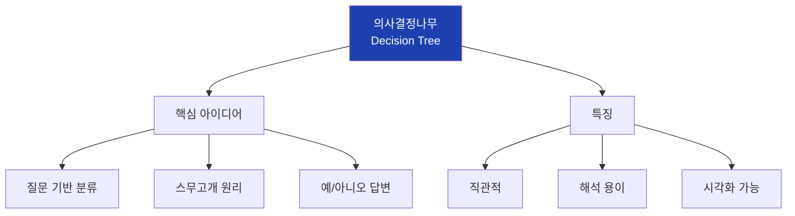

## 3. 과일 분류 예시

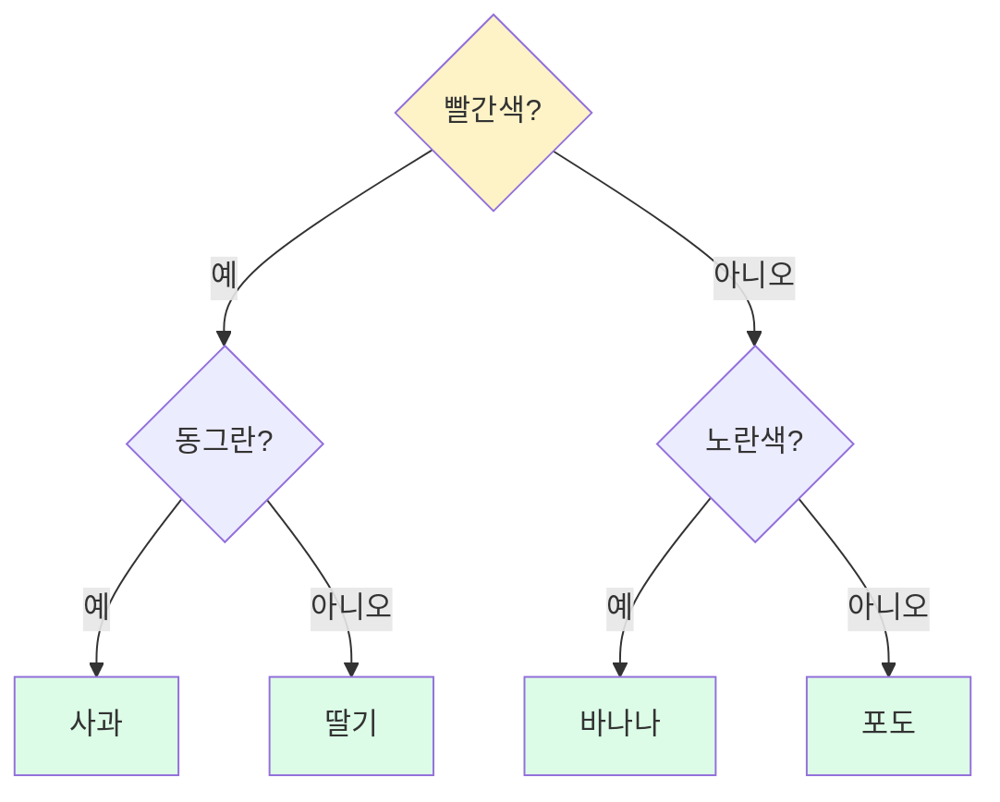

## 4. 제조 불량 분류 예시

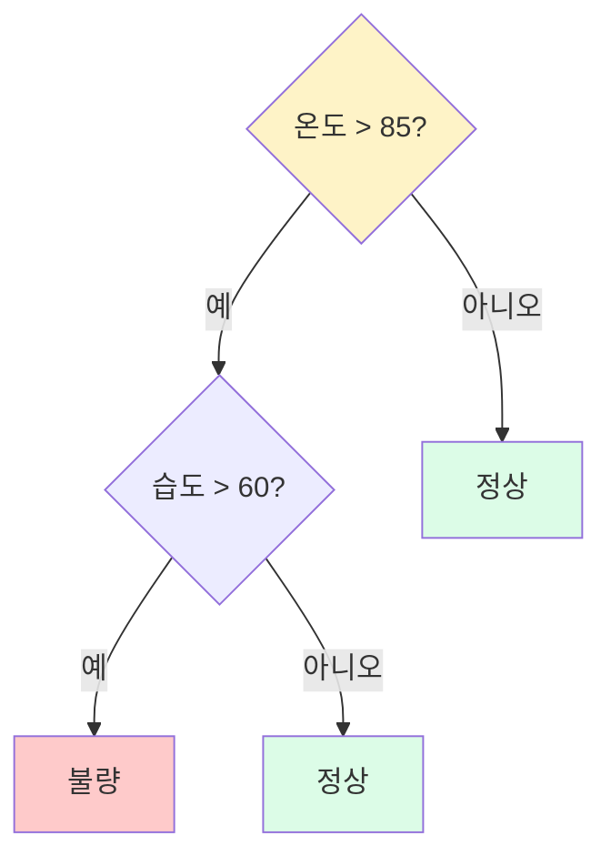

## 5. 트리 구조 용어

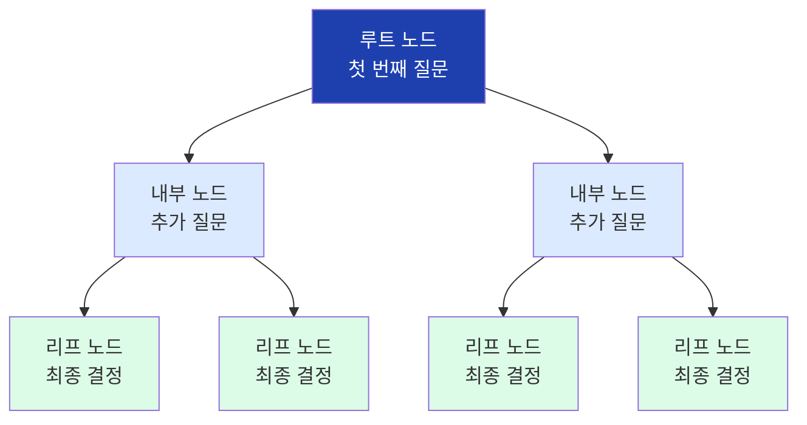

## 6. 불순도 개념

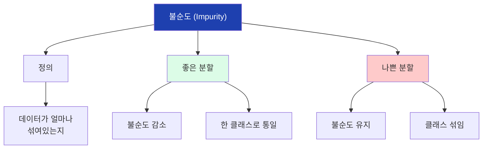

## 7. 좋은 분할 vs 나쁜 분할

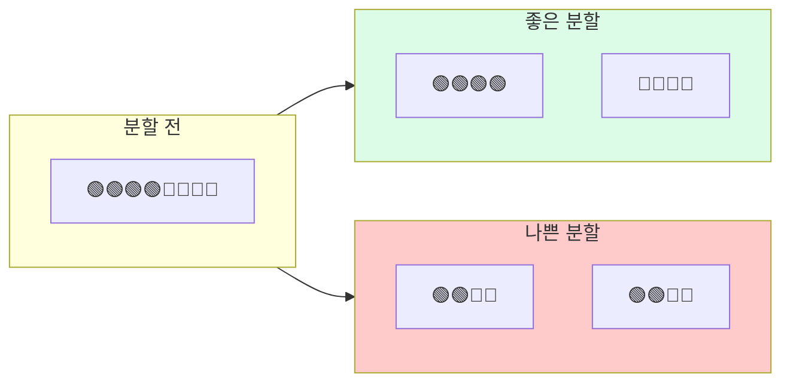

## 8. 지니 불순도

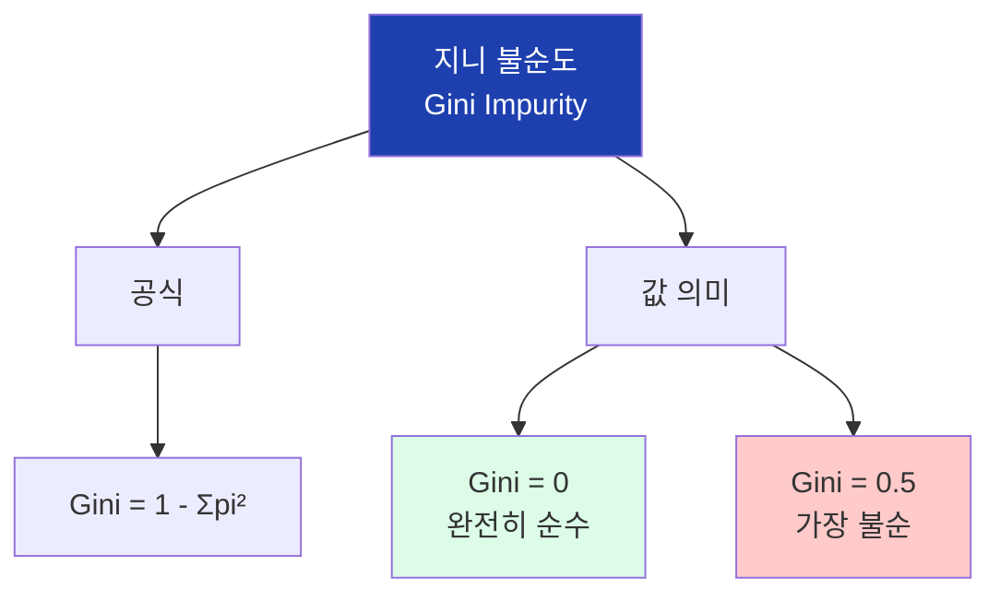

## 9. 지니 계산 예시

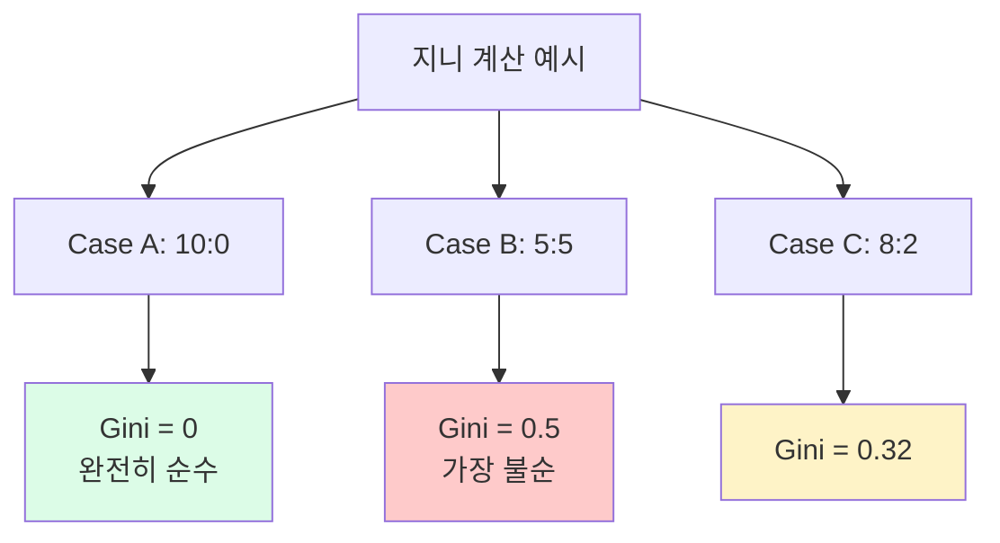

## 10. 정보 이득

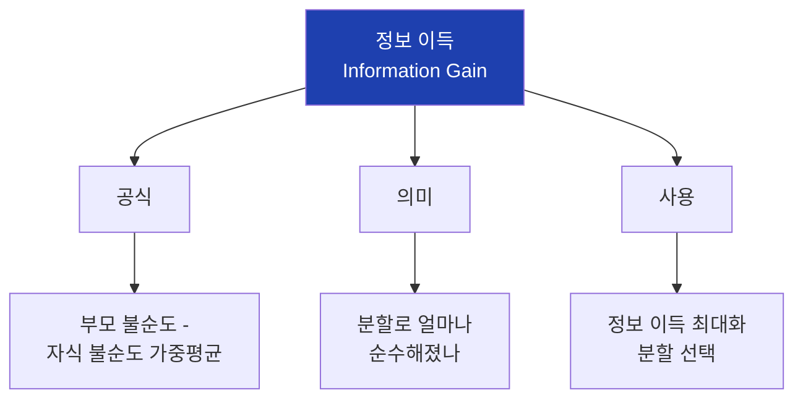

## 11. 트리 학습 과정

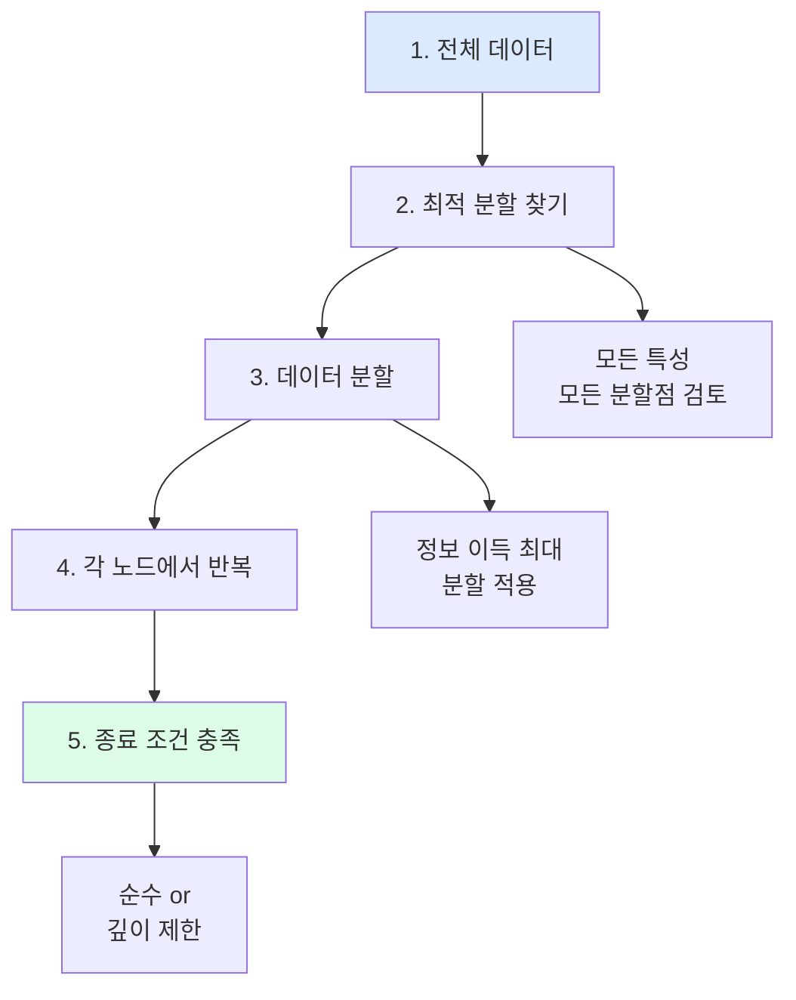

## 12. 과대적합

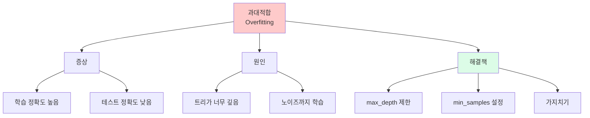

## 13. 과대적합 vs 과소적합

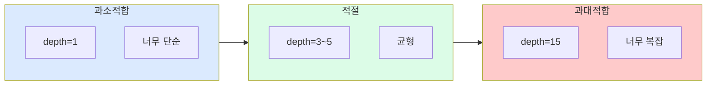

## 14. 의사결정나무 장단점

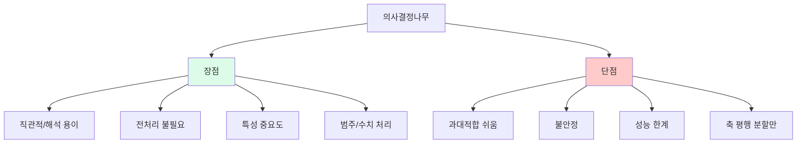

## 15. DecisionTreeClassifier

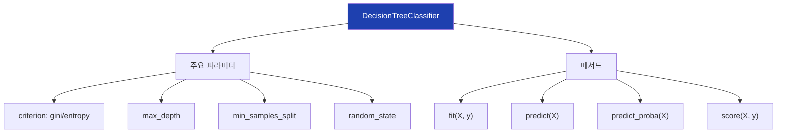

## 16. max_depth 영향

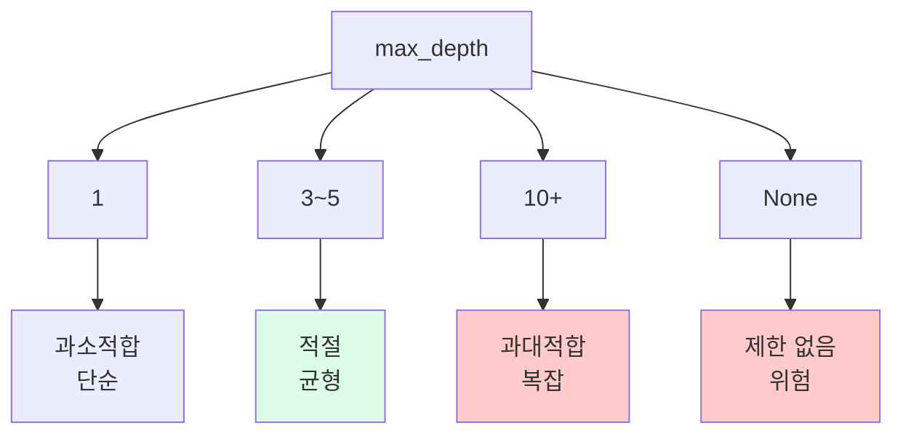

## 17. sklearn 기본 흐름

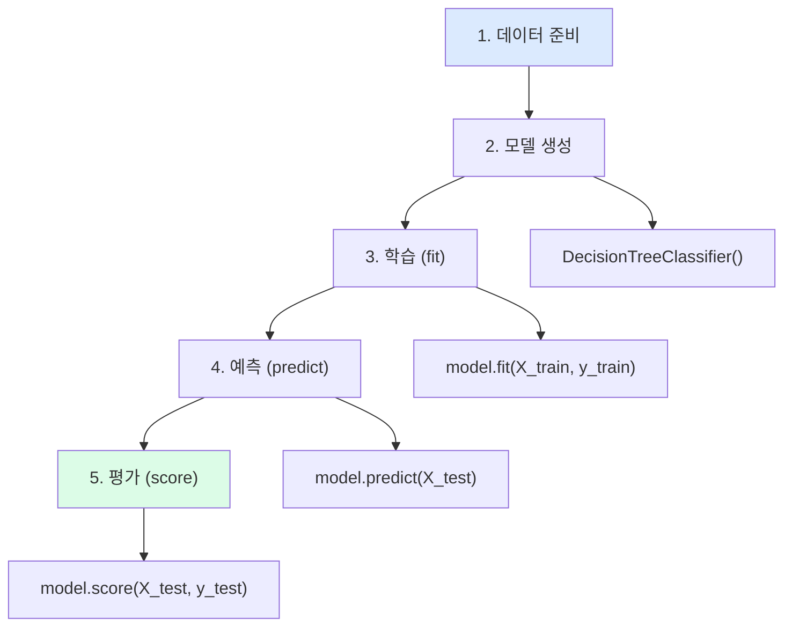

## 18. 학습/테스트 분할

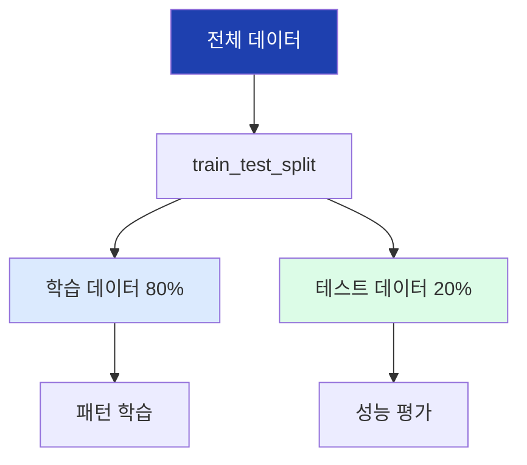

## 19. 예측 흐름

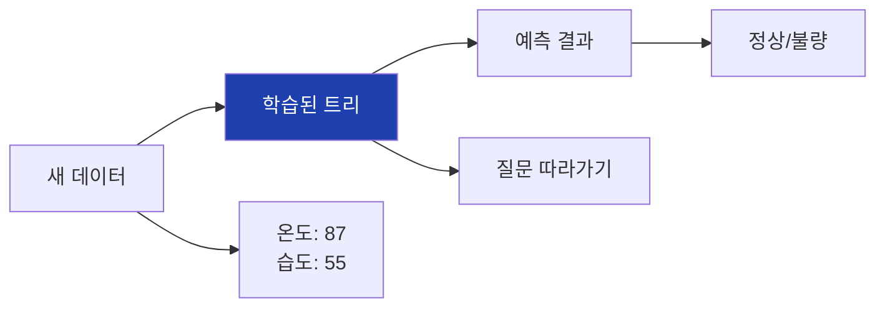

## 20. predict_proba

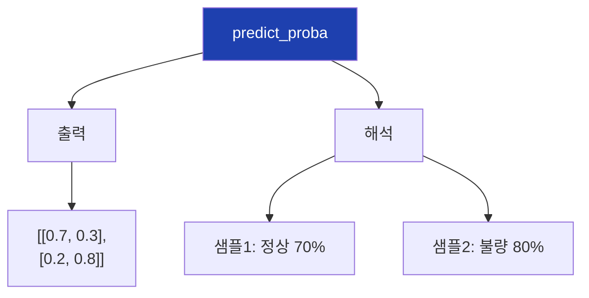

## 21. 혼동 행렬

```mermaid
flowchart TD
    A["혼동 행렬"]

    A --> B["구조"]

    subgraph matrix["예측"]
        direction LR
        B1["TN"]
        B2["FP"]
        B3["FN"]
        B4["TP"]
    end

    B --> matrix

    B1 --> B1a["정상→정상<br>정확"]
    B2 --> B2a["정상→불량<br>거짓 경보"]
    B3 --> B3a["불량→정상<br>누락"]
    B4 --> B4a["불량→불량<br>정확"]

    style B1a fill:#dcfce7
    style B4a fill:#dcfce7
    style B2a fill:#fef3c7
    style B3a fill:#fecaca
```

## 22. 트리 시각화

```mermaid
flowchart TD
    A["plot_tree"]

    A --> B["파라미터"]
    B --> B1["feature_names"]
    B --> B2["class_names"]
    B --> B3["filled=True"]
    B --> B4["rounded=True"]

    A --> C["출력"]
    C --> C1["트리 그래프"]
    C --> C2["노드 정보"]

    style A fill:#1e40af,color:#fff
```

## 23. 노드 정보 읽기

```mermaid
flowchart TD
    A["노드 정보"]

    A --> B["분할 조건"]
    B --> B1["temperature <= 87.5"]

    A --> C["불순도"]
    C --> C1["gini = 0.42"]

    A --> D["샘플 수"]
    D --> D1["samples = 400"]

    A --> E["클래스 분포"]
    E --> E1["value = [320, 80]"]

    A --> F["다수 클래스"]
    F --> F1["class = 정상"]

    style A fill:#1e40af,color:#fff
```

## 24. export_text

```mermaid
flowchart TD
    A["export_text"]

    A --> B["출력 예시"]

    B --> B1["|--- temperature <= 87.5<br>|   |--- class: 정상<br>|--- temperature > 87.5<br>|   |--- humidity <= 60<br>|   |   |--- class: 정상<br>|   |--- humidity > 60<br>|   |   |--- class: 불량"]

    style A fill:#1e40af,color:#fff
```

## 25. 특성 중요도

```mermaid
flowchart TD
    A["특성 중요도<br>feature_importances_"]

    A --> B["의미"]
    B --> B1["분류 기여도"]
    B --> B2["0~1 사이 값"]
    B --> B3["합계 = 1"]

    A --> C["예시"]
    C --> C1["온도: 0.65"]
    C --> C2["습도: 0.28"]
    C --> C3["속도: 0.05"]
    C --> C4["압력: 0.02"]

    style A fill:#1e40af,color:#fff
    style C1 fill:#dcfce7
```

## 26. 특성 중요도 해석

```mermaid
flowchart TD
    A["특성 중요도 해석"]

    A --> B["온도: 0.65"]
    B --> B1["가장 중요<br>집중 관리 필요"]

    A --> C["습도: 0.28"]
    C --> C1["유의미한 영향"]

    A --> D["속도, 압력: 낮음"]
    D --> D1["영향 작음<br>제거 고려"]

    style B1 fill:#dcfce7
```

## 27. 결정 경계

```mermaid
flowchart TD
    A["결정 경계"]

    A --> B["특징"]
    B --> B1["축에 평행"]
    B --> B2["직각 분할"]
    B --> B3["계단 형태"]

    A --> C["한계"]
    C --> C1["대각선 패턴<br>표현 어려움"]

    style A fill:#1e40af,color:#fff
```

## 28. 깊이별 성능 비교

```mermaid
flowchart TD
    A["깊이별 실험"]

    A --> B["학습 곡선"]
    B --> B1["train: 계속 상승"]
    B --> B2["test: 정점 후 하락"]

    A --> C["최적 깊이"]
    C --> C1["train-test 차이<br>최소화"]

    A --> D["과대적합 지점"]
    D --> D1["train-test 차이<br>급격히 증가"]

    style C fill:#dcfce7
    style D fill:#fecaca
```

## 29. 깊이 선택 전략

```mermaid
flowchart TD
    A["최적 깊이 찾기"]

    A --> B["방법 1"]
    B --> B1["학습 곡선 시각화"]
    B --> B2["교차점 확인"]

    A --> C["방법 2"]
    C --> C1["교차검증"]
    C --> C2["평균 성능 비교"]

    A --> D["방법 3"]
    D --> D1["GridSearchCV"]
    D --> D2["자동 탐색"]

    style A fill:#1e40af,color:#fff
```

## 30. 실습 파이프라인

```mermaid
flowchart TD
    A["1. 데이터 생성"]
    B["2. X, y 분리"]
    C["3. train/test 분할"]
    D["4. 모델 학습"]
    E["5. 평가"]
    F["6. 최적 깊이 탐색"]
    G["7. 최종 모델"]
    H["8. 예측"]

    A --> B --> C --> D --> E --> F --> G --> H

    style A fill:#dbeafe
    style H fill:#dcfce7
```

## 31. classification_report

```mermaid
flowchart TD
    A["classification_report"]

    A --> B["정밀도 (Precision)"]
    B --> B1["예측 불량 중<br>실제 불량 비율"]

    A --> C["재현율 (Recall)"]
    C --> C1["실제 불량 중<br>예측 불량 비율"]

    A --> D["F1 Score"]
    D --> D1["정밀도-재현율<br>조화 평균"]

    style A fill:#1e40af,color:#fff
```

## 32. 새 데이터 예측

```mermaid
flowchart TD
    A["새 제품 데이터"]

    A --> B["입력"]
    B --> B1["온도: 87"]
    B --> B2["습도: 55"]
    B --> B3["속도: 100"]
    B --> B4["압력: 1.0"]

    A --> C["예측"]
    C --> C1["불량 확률: 25%"]
    C --> C2["판정: 정상"]

    style A fill:#1e40af,color:#fff
    style C2 fill:#dcfce7
```

## 33. 실무 활용

```mermaid
flowchart TD
    A["실무 활용"]

    A --> B["품질 관리"]
    B --> B1["실시간 불량 예측"]
    B --> B2["임계값 알람"]

    A --> C["원인 분석"]
    C --> C1["특성 중요도 확인"]
    C --> C2["트리 규칙 해석"]

    A --> D["공정 개선"]
    D --> D1["중요 변수 관리"]
    D --> D2["최적 조건 도출"]

    style A fill:#1e40af,color:#fff
```

## 34. 다음 차시 연결

```mermaid
flowchart LR
    A["13차시<br>의사결정나무"]
    B["13차시<br>랜덤포레스트"]

    A --> B

    A --> A1["단일 트리"]
    A --> A2["불안정"]
    A --> A3["과대적합 쉬움"]

    B --> B1["여러 트리"]
    B --> B2["안정적"]
    B --> B3["성능 향상"]

    style A fill:#dbeafe
    style B fill:#dcfce7
```

## 35. 핵심 정리

```mermaid
flowchart TD
    A["13차시 핵심"]

    A --> B["원리"]
    B --> B1["질문 기반 분류<br>지니 불순도"]

    A --> C["사용법"]
    C --> C1["DecisionTreeClassifier<br>max_depth 제한"]

    A --> D["해석"]
    D --> D1["트리 시각화<br>특성 중요도"]

    style A fill:#1e40af,color:#fff
```
