# [14차시] 분류 모델 - 랜덤포레스트 - 다이어그램

## 1. 학습 흐름


## 2. 앙상블 개념

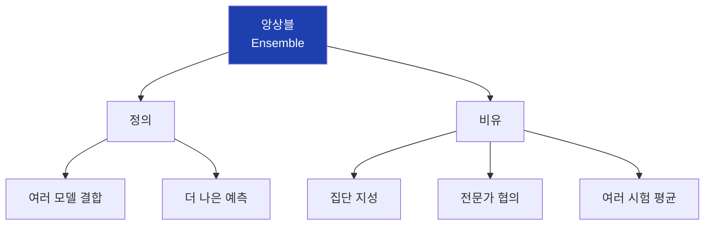

## 3. 집단 지성

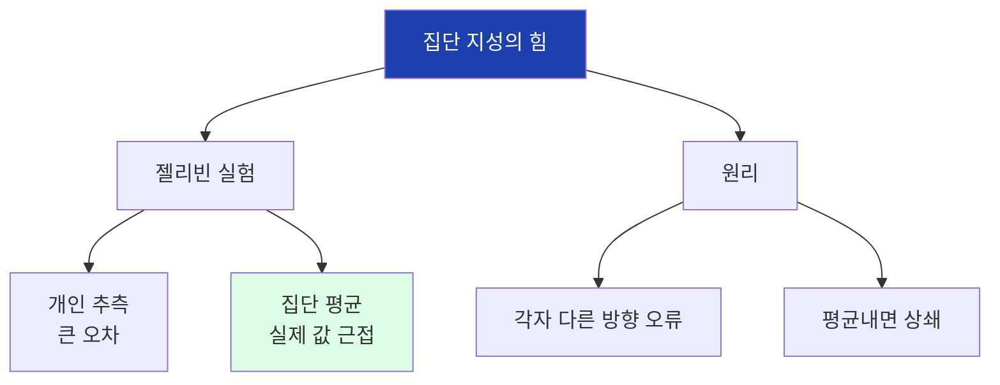

## 4. 앙상블 조건

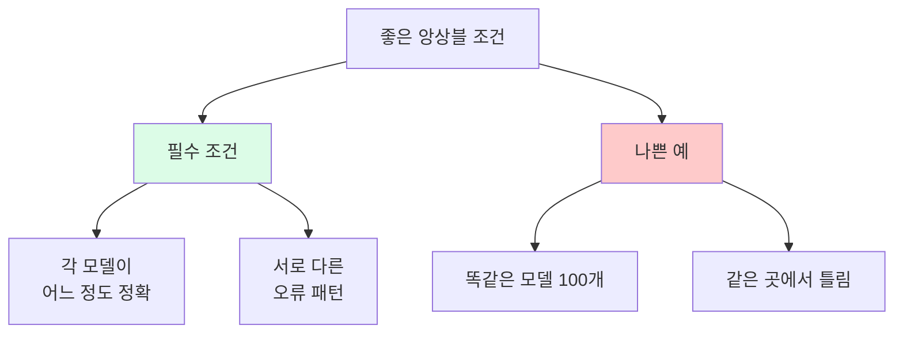

## 5. 앙상블 방법 종류

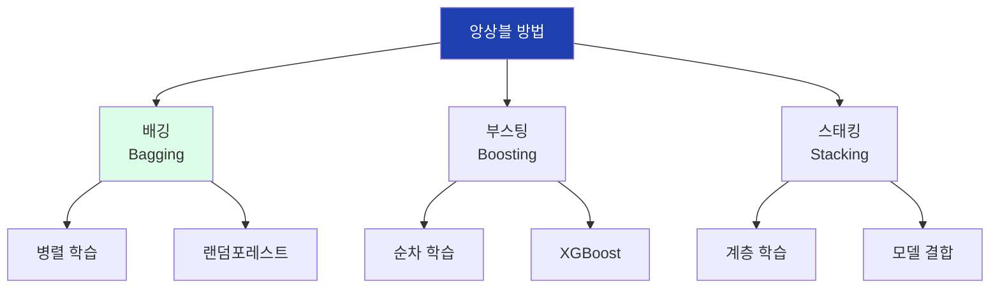

## 6. 배깅 vs 부스팅

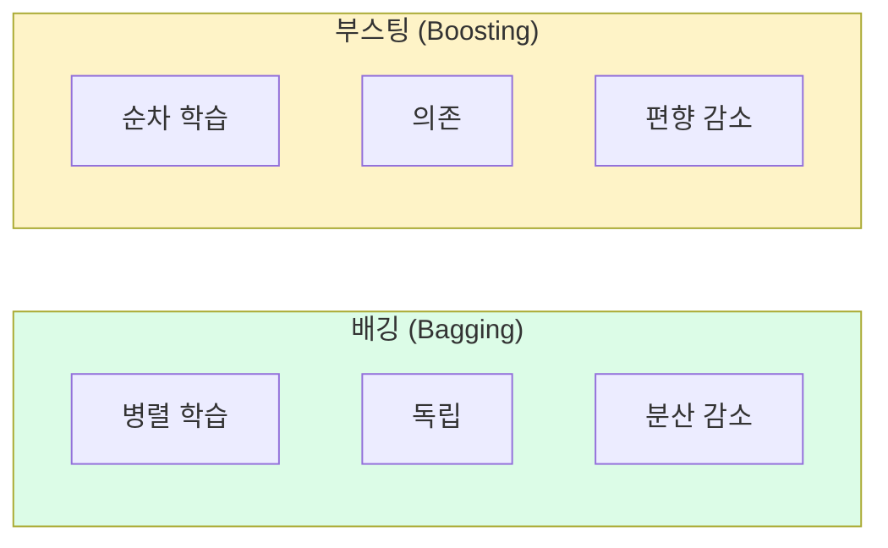

## 7. 배깅 과정

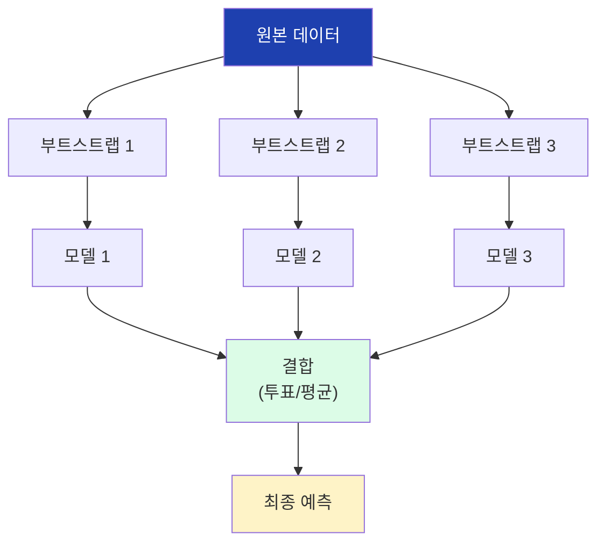

## 8. 부트스트랩 샘플링

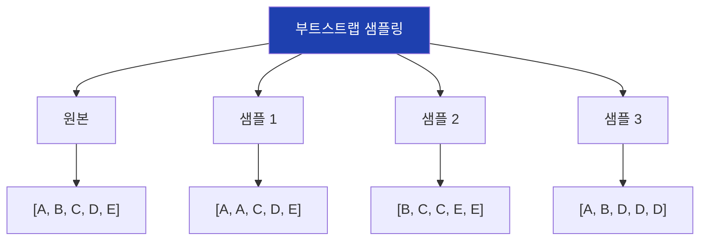

## 9. 부트스트랩 특성

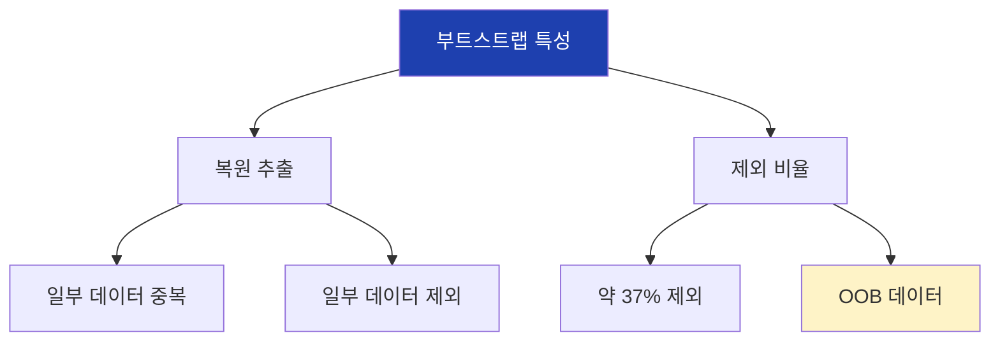

## 10. 랜덤포레스트 정의

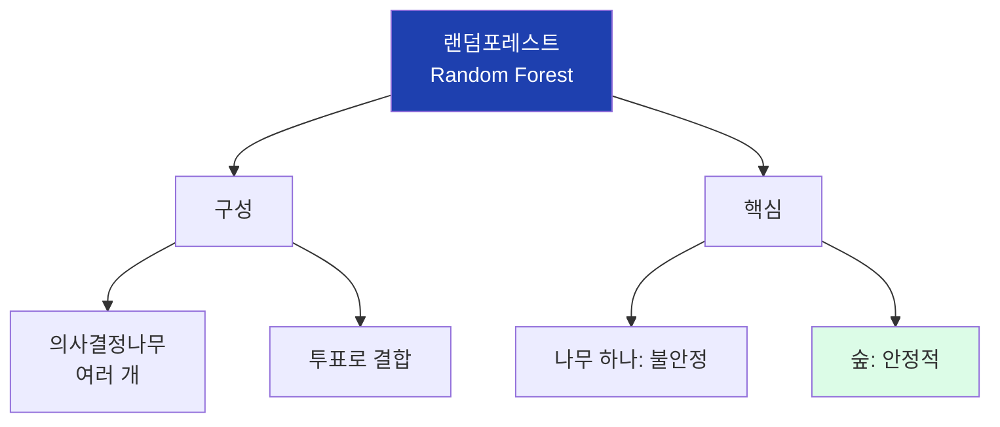

## 11. 두 가지 랜덤

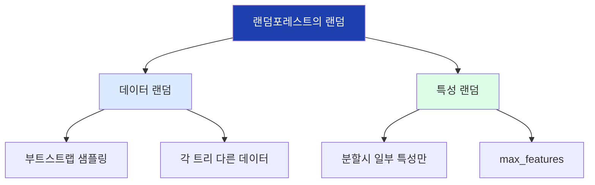

## 12. 특성 랜덤 선택

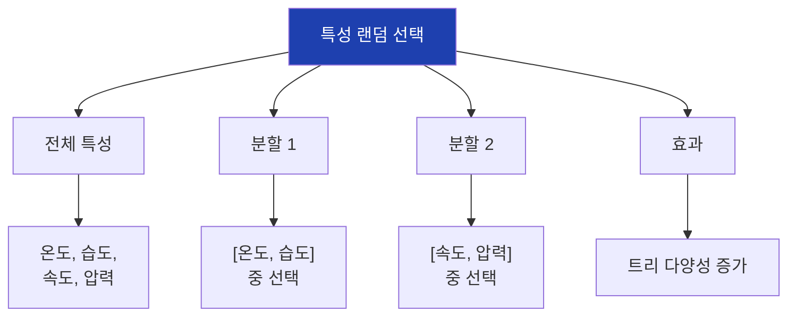

## 13. 랜덤포레스트 학습

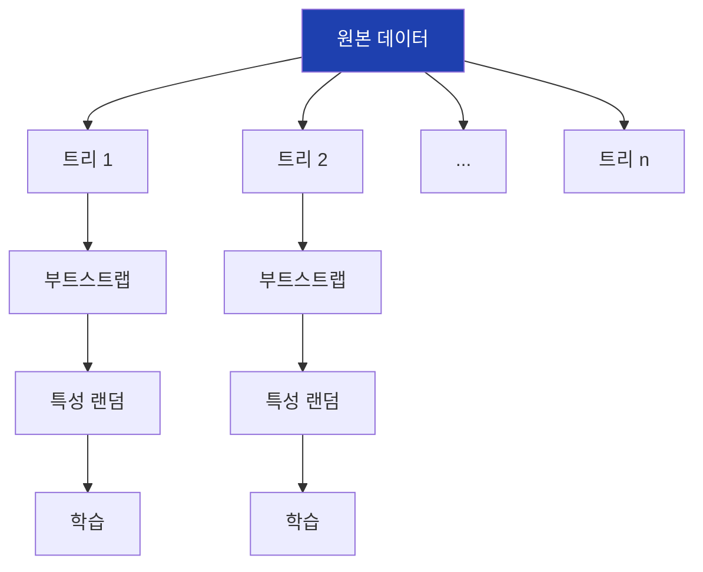

## 14. 예측: 다수결 투표

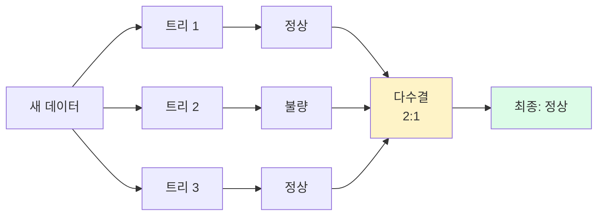

## 15. 예측: 평균 (회귀)

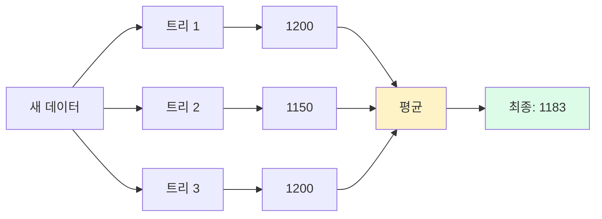

## 16. OOB 점수

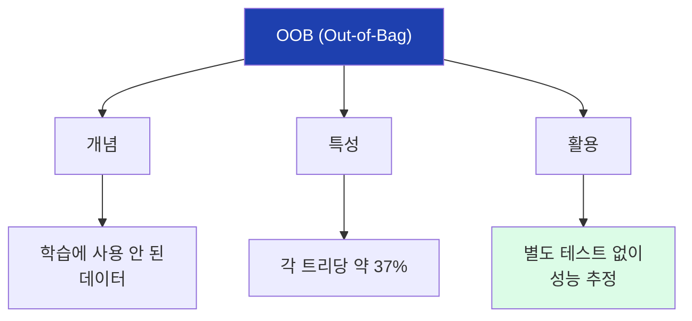

## 17. 의사결정나무 vs 랜덤포레스트

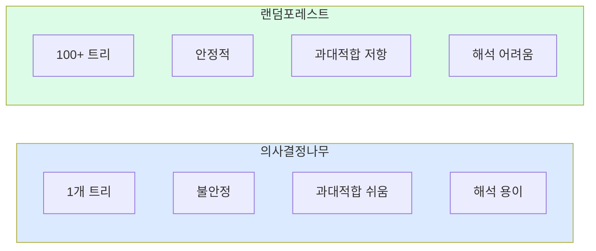

## 18. 성능 비교

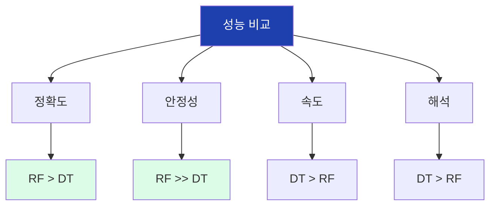

## 19. 장단점

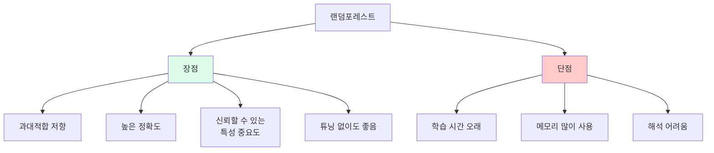

## 20. RandomForestClassifier

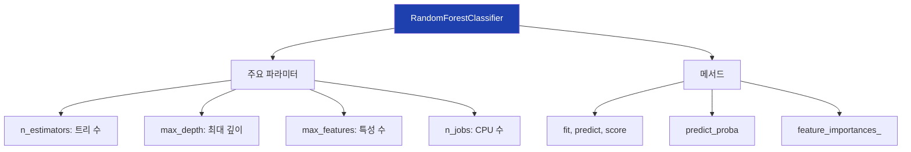

## 21. n_estimators 영향

```mermaid
flowchart LR
    A["트리 10개"]
    B["트리 50개"]
    C["트리 100개"]
    D["트리 200개"]

    A --> A1["낮음"]
    B --> B1["상승"]
    C --> C1["포화"]
    D --> D1["거의 동일"]

    style A fill:#fecaca
    style C fill:#dcfce7
    style D fill:#dcfce7
```

## 22. n_estimators 그래프

```mermaid
flowchart TD
    A["n_estimators 선택"]

    A --> B["10-50"]
    B --> B1["성능 급상승"]

    A --> C["100-200"]
    C --> C1["최적 구간<br>권장"]

    A --> D["300+"]
    D --> D1["성능 거의 동일<br>시간/메모리 낭비"]

    style C fill:#dcfce7
```

## 23. sklearn 사용법

```mermaid
flowchart TD
    A["1. 모델 생성"]
    B["2. 학습 (fit)"]
    C["3. 예측 (predict)"]
    D["4. 평가 (score)"]
    E["5. 특성 중요도"]

    A --> B --> C --> D --> E

    A --> A1["RandomForest<br>Classifier()"]
    B --> B1["model.fit(X, y)"]
    C --> C1["model.predict(X)"]
    D --> D1["model.score(X, y)"]
    E --> E1["feature_importances_"]

    style A fill:#dbeafe
    style E fill:#dcfce7
```

## 24. 코드 예시

```mermaid
flowchart TD
    A["랜덤포레스트 코드"]

    A --> B["생성"]
    B --> B1["RandomForestClassifier<br>(n_estimators=100)"]

    A --> C["학습"]
    C --> C1["model.fit<br>(X_train, y_train)"]

    A --> D["예측"]
    D --> D1["model.predict<br>(X_test)"]

    A --> E["평가"]
    E --> E1["model.score<br>(X_test, y_test)"]

    style A fill:#1e40af,color:#fff
```

## 25. OOB 점수 활용

```mermaid
flowchart TD
    A["OOB 점수 사용"]

    A --> B["설정"]
    B --> B1["oob_score=True"]

    A --> C["학습"]
    C --> C1["model.fit(X, y)"]

    A --> D["확인"]
    D --> D1["model.oob_score_"]

    A --> E["장점"]
    E --> E1["별도 검증 세트<br>불필요"]

    style A fill:#1e40af,color:#fff
```

## 26. 특성 중요도 비교

```mermaid
flowchart LR
    subgraph dt["의사결정나무"]
        A1["특성 A: 0.8"]
        A2["특성 B: 0.2"]
        A3["불안정"]
    end

    subgraph rf["랜덤포레스트"]
        B1["특성 A: 0.6"]
        B2["특성 B: 0.4"]
        B3["안정적"]
    end

    style rf fill:#dcfce7
```

## 27. 안정성 실험

```mermaid
flowchart TD
    A["안정성 실험"]

    A --> B["10회 반복 실험"]

    B --> C["의사결정나무"]
    C --> C1["평균: 85%"]
    C --> C2["표준편차: 3%"]

    B --> D["랜덤포레스트"]
    D --> D1["평균: 88%"]
    D --> D2["표준편차: 1%"]

    style D fill:#dcfce7
```

## 28. 실습 흐름

```mermaid
flowchart TD
    A["1. 데이터 준비"]
    B["2. DT vs RF 비교"]
    C["3. 안정성 실험"]
    D["4. n_estimators 탐색"]
    E["5. 특성 중요도"]
    F["6. 새 데이터 예측"]

    A --> B --> C --> D --> E --> F

    style A fill:#dbeafe
    style F fill:#dcfce7
```

## 29. 실무 권장 설정

```mermaid
flowchart TD
    A["권장 설정"]

    A --> B["n_estimators"]
    B --> B1["100~200"]

    A --> C["max_depth"]
    C --> C1["None 또는 15~20"]

    A --> D["max_features"]
    D --> D1["'sqrt' (기본값)"]

    A --> E["n_jobs"]
    E --> E1["-1 (전체 CPU)"]

    style A fill:#1e40af,color:#fff
```

## 30. 언제 사용?

```mermaid
flowchart TD
    A["랜덤포레스트 사용 시기"]

    A --> B["빠른 프로토타이핑"]
    B --> B1["튜닝 없이도<br>좋은 성능"]

    A --> C["특성 중요도 분석"]
    C --> C1["신뢰할 수 있는<br>중요도"]

    A --> D["안정적 예측 필요"]
    D --> D1["분산이 낮음"]

    style A fill:#1e40af,color:#fff
```

## 31. 다음 차시 연결

```mermaid
flowchart LR
    A["14차시<br>랜덤포레스트"]
    B["14차시<br>선형/다항회귀"]

    A --> B

    A --> A1["분류"]
    A --> A2["범주 예측"]

    B --> B1["회귀"]
    B --> B2["숫자 예측"]

    style A fill:#dbeafe
    style B fill:#dcfce7
```

## 32. 핵심 정리

```mermaid
flowchart TD
    A["14차시 핵심"]

    A --> B["앙상블"]
    B --> B1["여러 모델 결합"]

    A --> C["랜덤포레스트"]
    C --> C1["배깅 + 특성 랜덤"]

    A --> D["장점"]
    D --> D1["안정적<br>높은 정확도"]

    style A fill:#1e40af,color:#fff
```
