# [15차시] 예측 모델 - 선형/다항회귀 - 다이어그램

## 1. 학습 흐름


## 2. 분류 vs 회귀

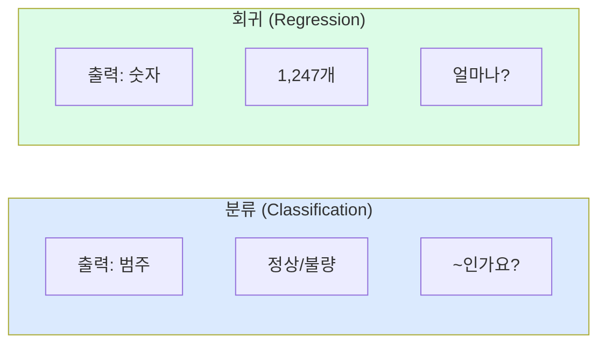

## 3. 회귀 문제 예시

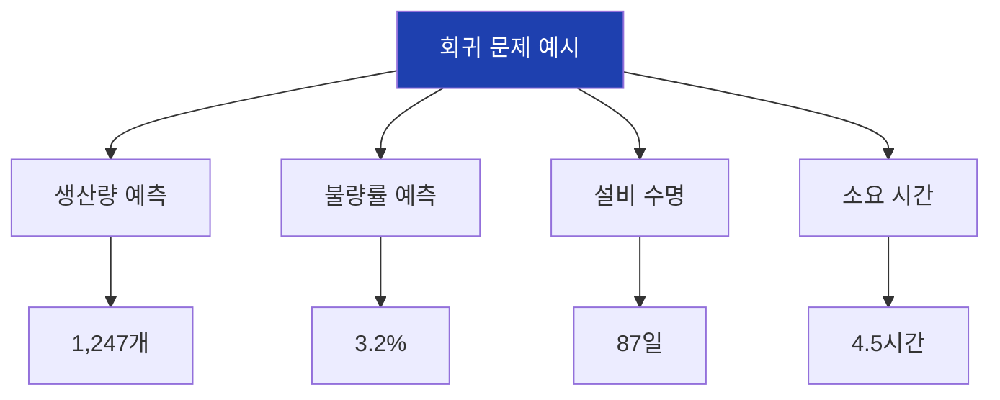

## 4. 회귀 평가 지표

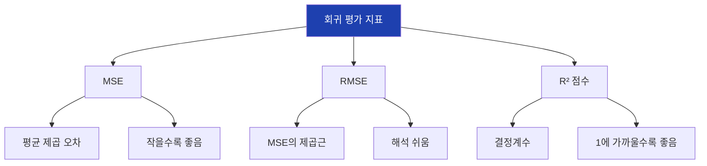

## 5. R² 점수 해석

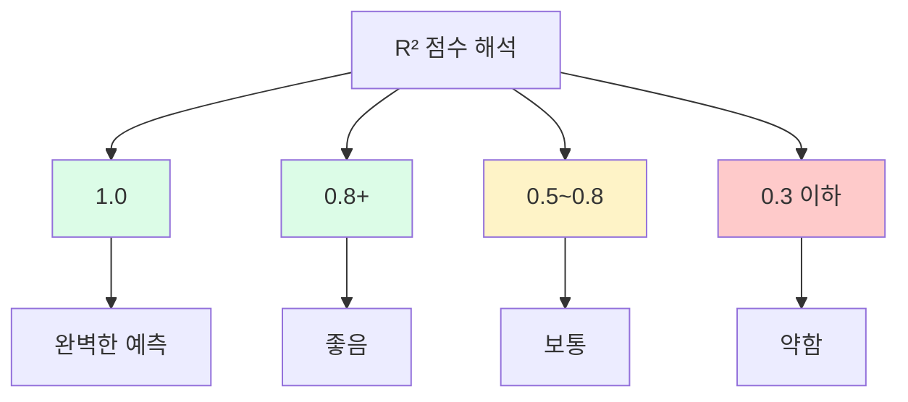

## 6. 선형회귀 수식

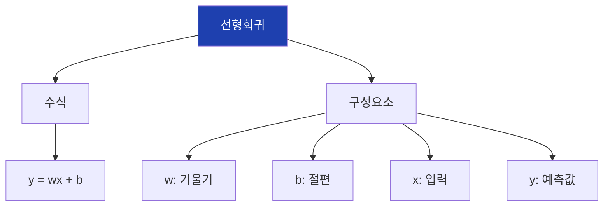

## 7. 기울기와 절편

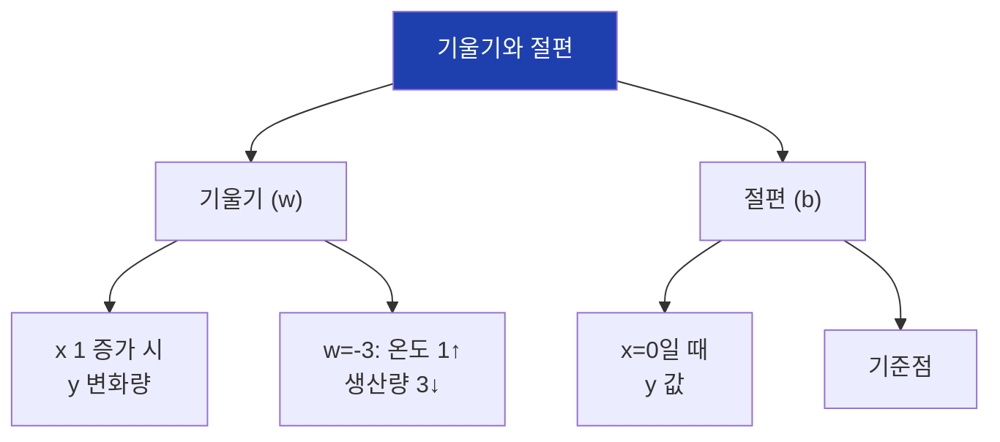

## 8. 다중 선형회귀

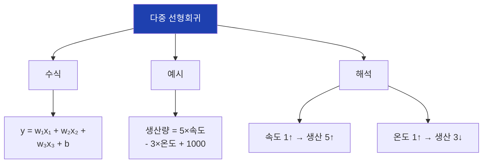

## 9. 최소제곱법

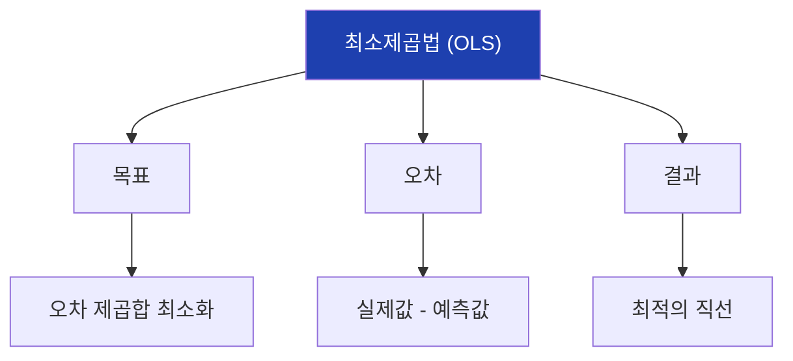

## 10. sklearn LinearRegression

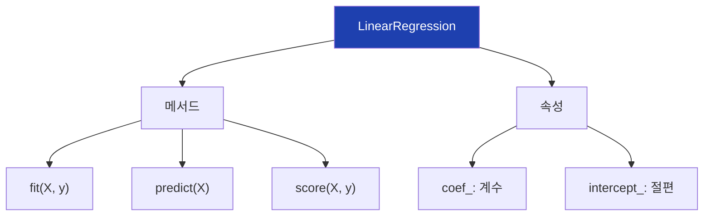

## 11. 선형회귀 흐름

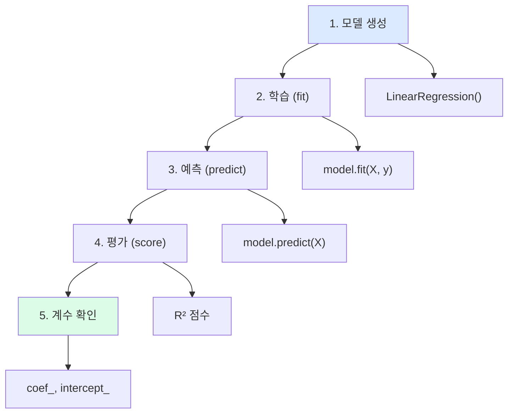

## 12. 비선형 관계

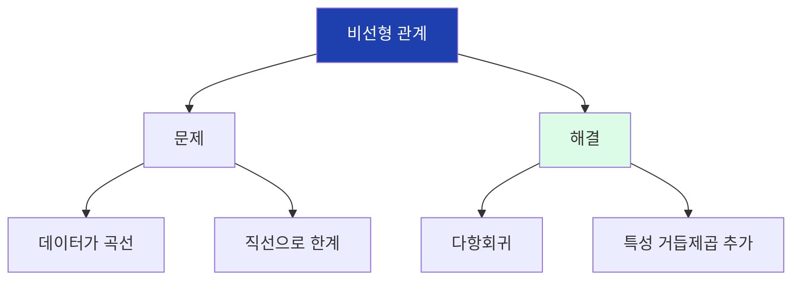

## 13. 다항회귀

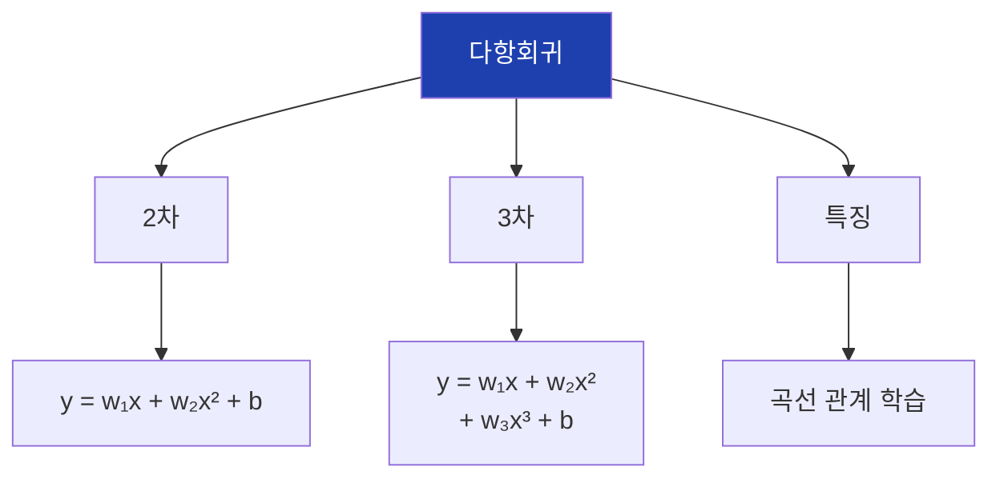

## 14. PolynomialFeatures

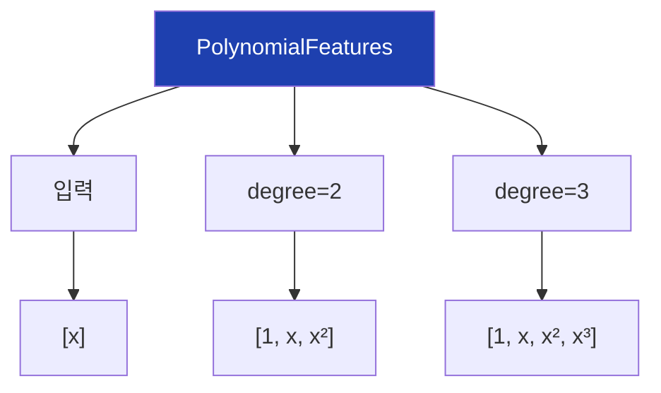

## 15. 다항회귀 파이프라인

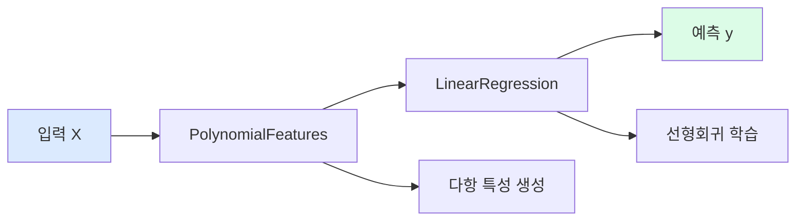

## 16. degree의 영향

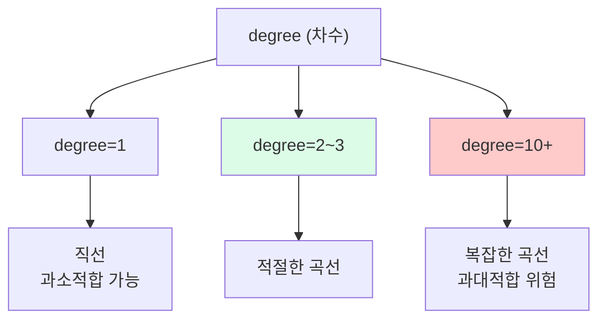

## 17. 과대적합 징후

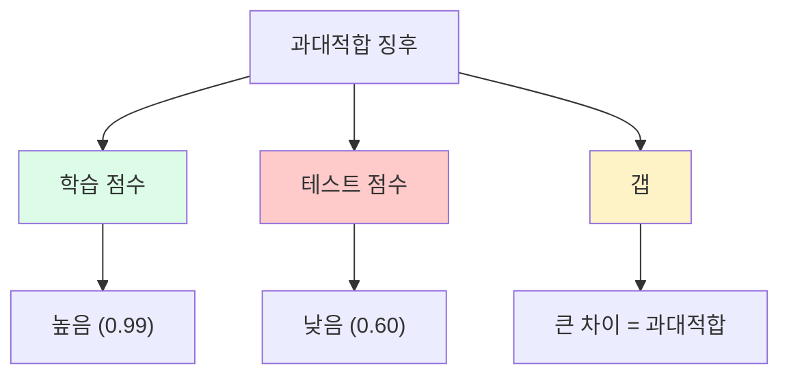

## 18. 차수 선택 전략

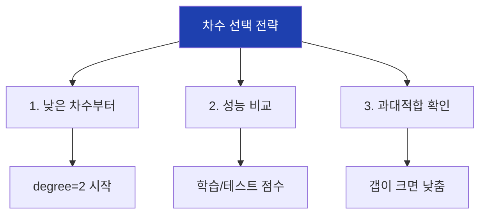

## 19. 실습 흐름

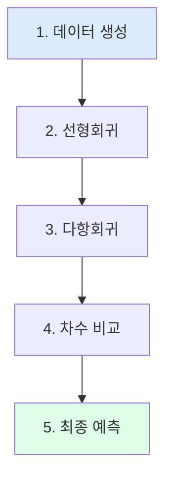

## 20. 선형 vs 다항 비교

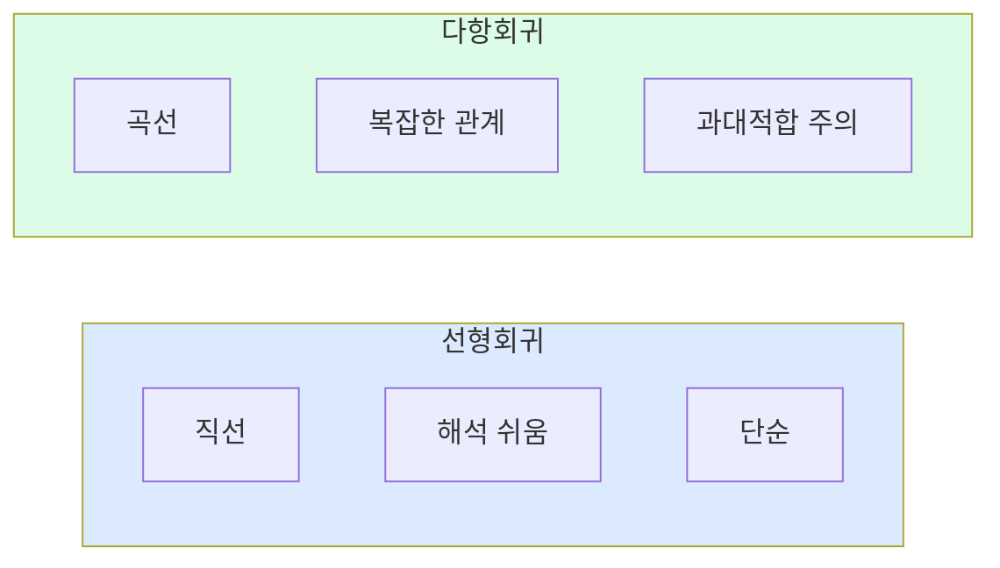

## 21. 언제 사용?

```mermaid
flowchart TD
    A["모델 선택"]

    A --> B["선형회귀"]
    B --> B1["직선 관계"]
    B --> B2["해석 중요"]
    B --> B3["빠른 학습"]

    A --> C["다항회귀"]
    C --> C1["곡선 관계"]
    C --> C2["degree 2~3"]
    C --> C3["과대적합 주의"]

    style A fill:#1e40af,color:#fff
```

## 22. 예측 시각화

```mermaid
flowchart TD
    A["예측 시각화"]

    A --> B["실제 vs 예측"]
    B --> B1["산점도"]
    B --> B2["대각선에 가까울수록<br>정확"]

    A --> C["잔차 분포"]
    C --> C1["히스토그램"]
    C --> C2["0 근처 집중되면<br>좋음"]

    style A fill:#1e40af,color:#fff
```

## 23. 계수 해석

```mermaid
flowchart TD
    A["계수 해석"]

    A --> B["온도: -3.1"]
    B --> B1["온도 1↑<br>생산량 3.1↓"]

    A --> C["속도: 5.2"]
    C --> C1["속도 1↑<br>생산량 5.2↑"]

    A --> D["인사이트"]
    D --> D1["온도 관리 중요"]

    style A fill:#1e40af,color:#fff
```

## 24. 새 데이터 예측

```mermaid
flowchart TD
    A["새 데이터"]

    A --> B["입력"]
    B --> B1["온도: 85"]
    B --> B2["습도: 50"]
    B --> B3["속도: 100"]

    A --> C["예측"]
    C --> C1["생산량: 1,240개"]

    style A fill:#1e40af,color:#fff
    style C fill:#dcfce7
```

## 25. 핵심 정리

```mermaid
flowchart TD
    A["15차시 핵심"]

    A --> B["회귀"]
    B --> B1["숫자 예측<br>MSE, R²"]

    A --> C["선형회귀"]
    C --> C1["y = wx + b<br>직선"]

    A --> D["다항회귀"]
    D --> D1["곡선 관계<br>과대적합 주의"]

    style A fill:#1e40af,color:#fff
```

## 26. 다음 차시 연결

```mermaid
flowchart LR
    A["15차시<br>선형/다항회귀"]
    B["15차시<br>모델 평가"]

    A --> B

    A --> A1["기본 평가"]
    B --> B1["교차검증"]
    B --> B2["더 정확한 평가"]

    style A fill:#dbeafe
    style B fill:#dcfce7
```
