# [16차시] 모델 평가와 반복 검증 - 다이어그램

## 1. 학습 흐름

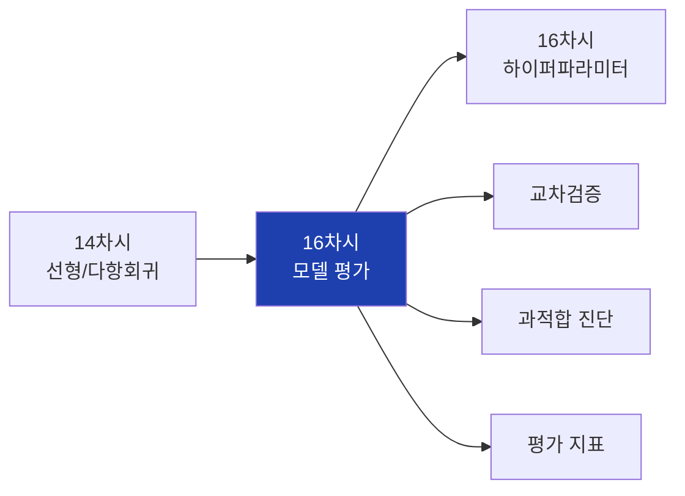

## 2. 대주제 구조

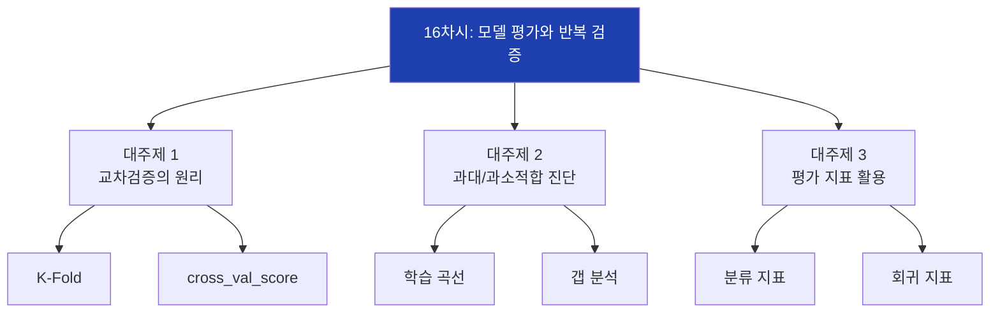

## 3. 단일 분할의 문제

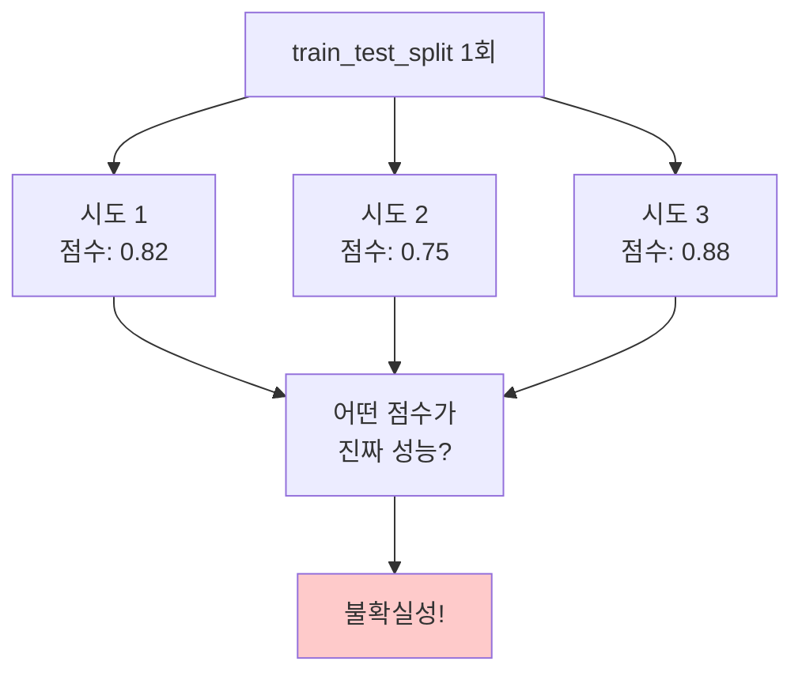

## 4. K-Fold 교차검증 개념

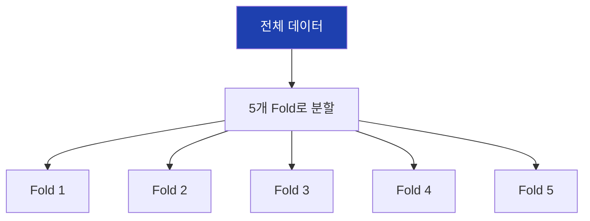

## 5. K-Fold 실행 과정

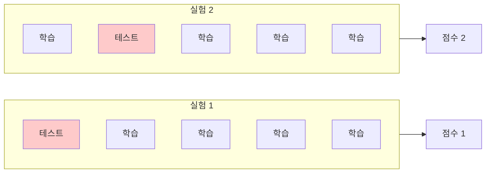

## 6. 5-Fold 교차검증 전체

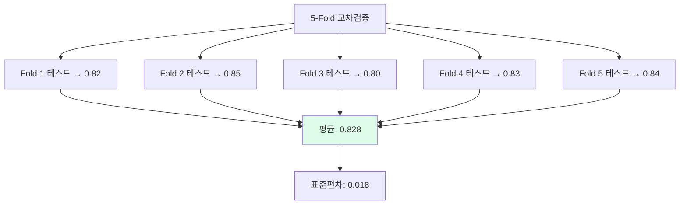

## 7. cross_val_score 사용법

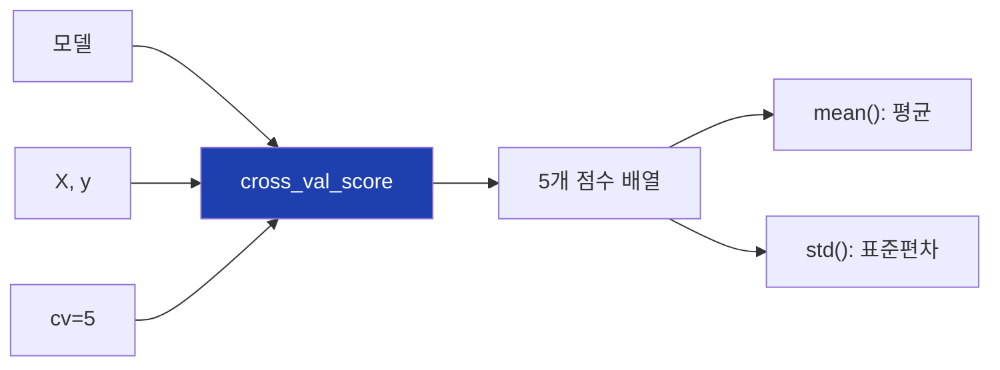

## 8. K 값 선택 가이드

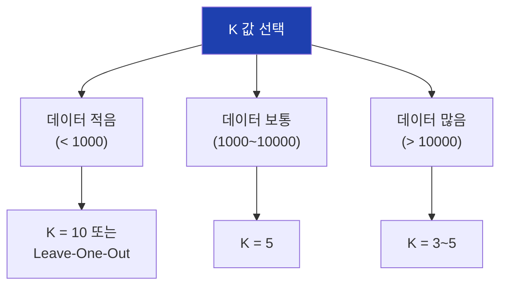

## 9. StratifiedKFold

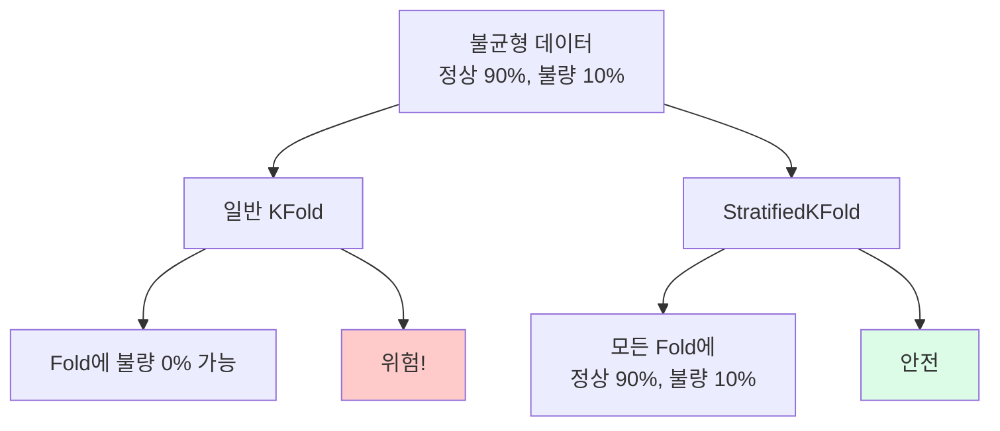

## 10. 과대적합 개념

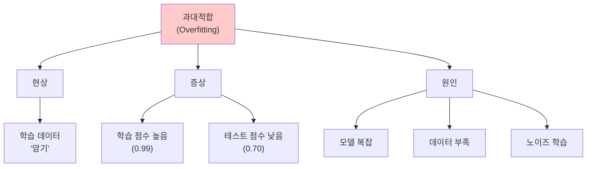

## 11. 과소적합 개념

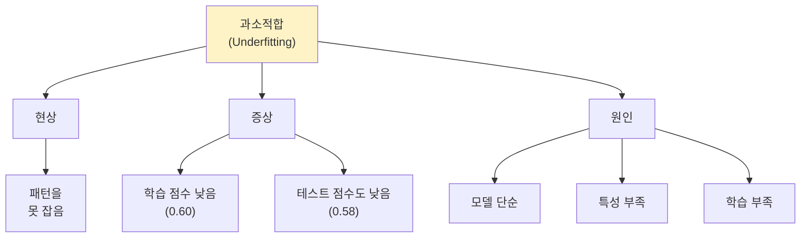

## 12. 과대적합 vs 과소적합 비교

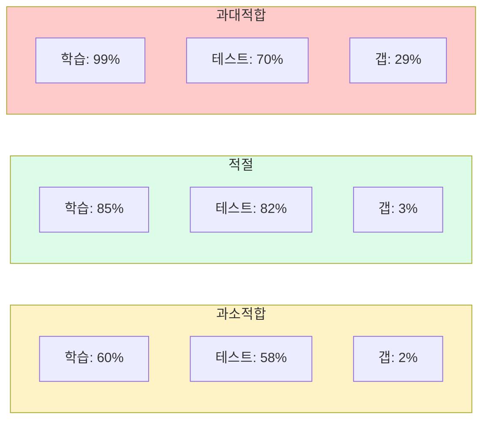

## 13. 진단 기준표

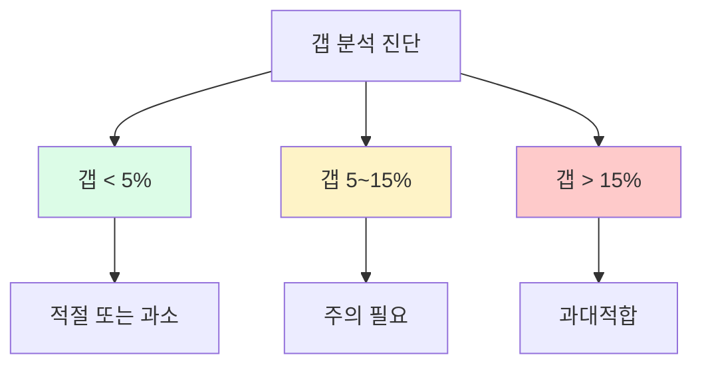

## 14. 학습 곡선 개념

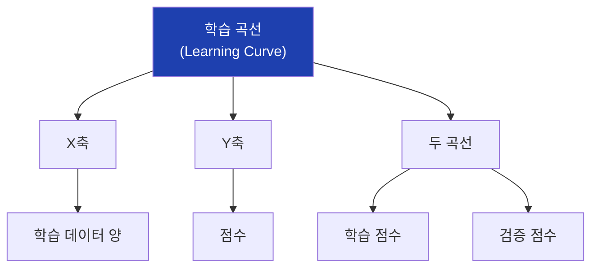

## 15. 학습 곡선 - 과대적합

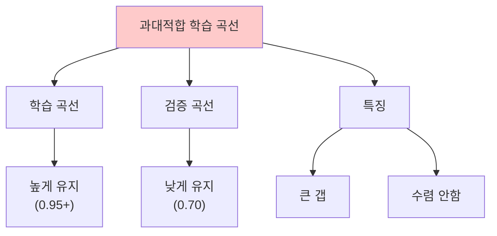

## 16. 학습 곡선 - 적절한 모델

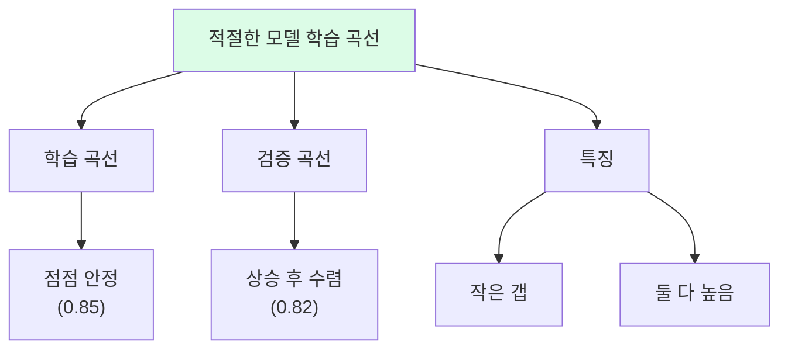

## 17. 검증 곡선 개념

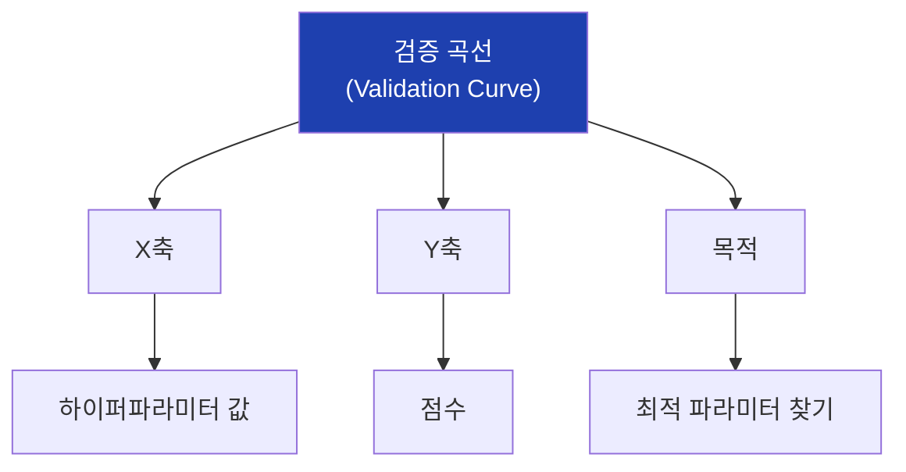

## 18. max_depth 검증 곡선

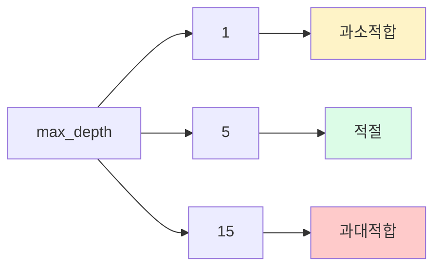

## 19. 혼동행렬 구조

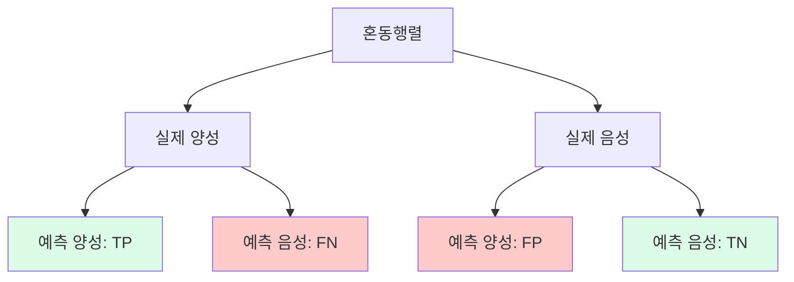

## 20. TP, FP, FN, TN 설명

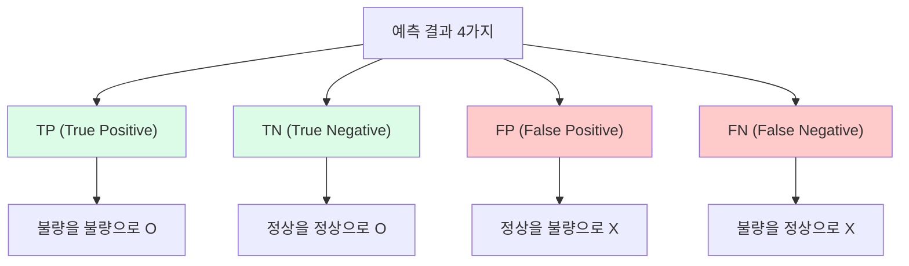

## 21. 정밀도 (Precision)

```mermaid
flowchart TD
    A["정밀도 (Precision)"]

    A --> B["공식"]
    B --> B1["TP / (TP + FP)"]

    A --> C["의미"]
    C --> C1["양성 예측 중<br>실제 양성 비율"]

    A --> D["질문"]
    D --> D1["불량이라고 한 것 중<br>진짜 불량은?"]

    style A fill:#1e40af,color:#fff
```

## 22. 재현율 (Recall)

```mermaid
flowchart TD
    A["재현율 (Recall)"]

    A --> B["공식"]
    B --> B1["TP / (TP + FN)"]

    A --> C["의미"]
    C --> C1["실제 양성 중<br>양성 예측 비율"]

    A --> D["질문"]
    D --> D1["실제 불량 중<br>잡아낸 비율은?"]

    style A fill:#1e40af,color:#fff
```

## 23. F1 Score

```mermaid
flowchart TD
    A["F1 Score"]

    A --> B["공식"]
    B --> B1["2 × (P × R) / (P + R)"]

    A --> C["특징"]
    C --> C1["정밀도와 재현율의<br>조화평균"]

    A --> D["해석"]
    D --> D1["둘 다 높아야<br>F1도 높음"]

    style A fill:#1e40af,color:#fff
```

## 24. 정밀도 vs 재현율 상황

```mermaid
flowchart TD
    A["상황별 중요 지표"]

    A --> B["재현율 중요"]
    B --> B1["불량 놓치면 안됨"]
    B --> B2["의료 진단"]
    B --> B3["사기 탐지"]

    A --> C["정밀도 중요"]
    C --> C1["오경보 비용 큼"]
    C --> C2["스팸 필터"]
    C --> C3["정상품 폐기 방지"]

    style A fill:#1e40af,color:#fff
```

## 25. classification_report 출력

```mermaid
flowchart TD
    A["classification_report"]

    A --> B["클래스별"]
    B --> B1["precision"]
    B --> B2["recall"]
    B --> B3["f1-score"]
    B --> B4["support"]

    A --> C["전체"]
    C --> C1["accuracy"]
    C --> C2["macro avg"]
    C --> C3["weighted avg"]

    style A fill:#1e40af,color:#fff
```

## 26. 회귀 평가 지표

```mermaid
flowchart TD
    A["회귀 평가 지표"]

    A --> B["MSE"]
    B --> B1["평균 제곱 오차"]
    B --> B2["이상치 민감"]

    A --> C["RMSE"]
    C --> C1["MSE 제곱근"]
    C --> C2["원래 단위"]

    A --> D["MAE"]
    D --> D1["평균 절대 오차"]
    D --> D2["이상치 강건"]

    A --> E["R²"]
    E --> E1["결정계수"]
    E --> E2["1에 가까울수록"]

    style A fill:#1e40af,color:#fff
```

## 27. MSE vs MAE

```mermaid
flowchart LR
    subgraph mse["MSE"]
        A1["큰 오차 더 패널티"]
        A2["이상치에 민감"]
    end

    subgraph mae["MAE"]
        B1["모든 오차 동등"]
        B2["이상치에 강건"]
    end

    style mse fill:#dbeafe
    style mae fill:#dcfce7
```

## 28. R² 점수 해석

```mermaid
flowchart TD
    A["R² 점수 해석"]

    A --> B["1.0"]
    B --> B1["완벽"]

    A --> C["0.8+"]
    C --> C1["좋음"]

    A --> D["0.5~0.8"]
    D --> D1["보통"]

    A --> E["< 0.3"]
    E --> E1["약함"]

    A --> F["음수"]
    F --> F1["평균보다 못함"]

    style B fill:#dcfce7
    style C fill:#dcfce7
    style D fill:#fef3c7
    style E fill:#fecaca
    style F fill:#fecaca
```

## 29. 지표 선택 가이드

```mermaid
flowchart TD
    A["어떤 지표를 볼까?"]

    A --> B["분류"]
    B --> B1["균형 → 정확도"]
    B --> B2["불균형 → F1"]
    B --> B3["비용 고려 → P/R"]

    A --> C["회귀"]
    C --> C1["일반 → RMSE + R²"]
    C --> C2["이상치 많음 → MAE"]

    style A fill:#1e40af,color:#fff
```

## 30. 실습 흐름

```mermaid
flowchart TD
    A["1. 데이터 준비"]
    B["2. 단일 분할 실험"]
    C["3. 교차검증"]
    D["4. 과대적합 실험"]
    E["5. 학습 곡선"]
    F["6. 분류 보고서"]

    A --> B --> C --> D --> E --> F

    style A fill:#dbeafe
    style F fill:#dcfce7
```

## 31. 교차검증 vs 단일분할

```mermaid
flowchart LR
    subgraph single["단일 분할"]
        A1["1회 평가"]
        A2["운에 좌우"]
        A3["불안정"]
    end

    subgraph cv["교차검증"]
        B1["K회 평가"]
        B2["평균 + 표준편차"]
        B3["안정적"]
    end

    style single fill:#fecaca
    style cv fill:#dcfce7
```

## 32. 과대적합 해결책

```mermaid
flowchart TD
    A["과대적합 해결"]

    A --> B["모델 단순화"]
    B --> B1["max_depth 줄이기"]
    B --> B2["n_estimators 줄이기"]

    A --> C["정규화"]
    C --> C1["L1, L2 정규화"]

    A --> D["데이터 증강"]
    D --> D1["더 많은 데이터 수집"]

    style A fill:#1e40af,color:#fff
```

## 33. 과소적합 해결책

```mermaid
flowchart TD
    A["과소적합 해결"]

    A --> B["모델 복잡화"]
    B --> B1["max_depth 늘리기"]
    B --> B2["더 복잡한 모델"]

    A --> C["특성 추가"]
    C --> C1["특성 엔지니어링"]

    A --> D["학습 늘리기"]
    D --> D1["에폭 증가"]

    style A fill:#1e40af,color:#fff
```

## 34. sklearn 평가 함수 정리

```mermaid
flowchart TD
    A["sklearn 평가 함수"]

    A --> B["교차검증"]
    B --> B1["cross_val_score"]
    B --> B2["learning_curve"]
    B --> B3["validation_curve"]

    A --> C["분류 지표"]
    C --> C1["accuracy_score"]
    C --> C2["confusion_matrix"]
    C --> C3["classification_report"]

    A --> D["회귀 지표"]
    D --> D1["mean_squared_error"]
    D --> D2["mean_absolute_error"]
    D --> D3["r2_score"]

    style A fill:#1e40af,color:#fff
```

## 35. 모델 선택 워크플로우

```mermaid
flowchart TD
    A["모델 후보들"]
    B["교차검증<br>(각 모델)"]
    C["평균 점수 비교"]
    D["최고 모델 선택"]
    E["전체 데이터로<br>재학습"]
    F["최종 모델"]

    A --> B --> C --> D --> E --> F

    style A fill:#dbeafe
    style F fill:#dcfce7
```

## 36. 핵심 정리

```mermaid
flowchart TD
    A["16차시 핵심"]

    A --> B["교차검증"]
    B --> B1["K-Fold로<br>안정적 평가"]

    A --> C["과적합 진단"]
    C --> C1["학습/테스트 갭<br>학습 곡선"]

    A --> D["평가 지표"]
    D --> D1["분류: P, R, F1<br>회귀: RMSE, R²"]

    style A fill:#1e40af,color:#fff
```

## 37. 다음 차시 연결

```mermaid
flowchart LR
    A["16차시<br>모델 평가"]
    B["16차시<br>하이퍼파라미터"]

    A --> B

    A --> A1["cross_val_score"]
    B --> B1["GridSearchCV"]
    B --> B2["최적 파라미터 탐색"]

    style A fill:#dbeafe
    style B fill:#dcfce7
```

## 38. 전체 ML 파이프라인에서 위치

```mermaid
flowchart LR
    A["데이터"]
    B["전처리"]
    C["모델 학습"]
    D["평가"]
    E["튜닝"]
    F["배포"]

    A --> B --> C --> D --> E --> F

    style D fill:#1e40af,color:#fff
```
