# [17차시] 모델 설정값 최적화 - 다이어그램

## 1. 학습 흐름

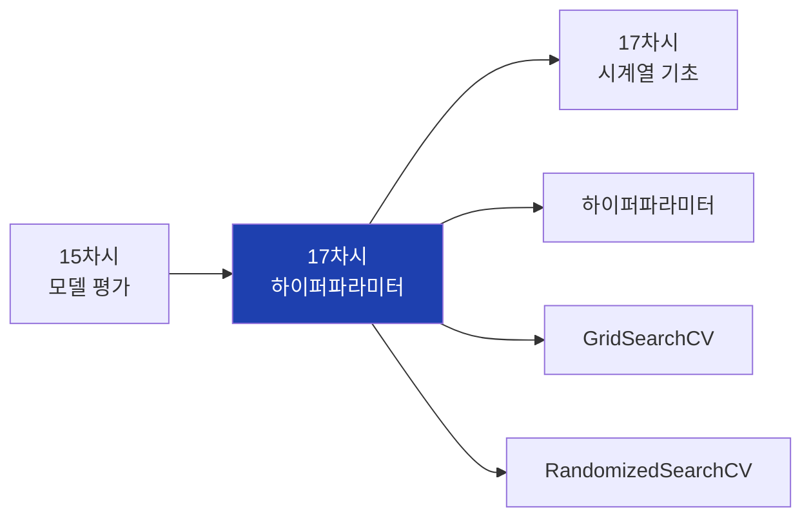

## 2. 대주제 구조

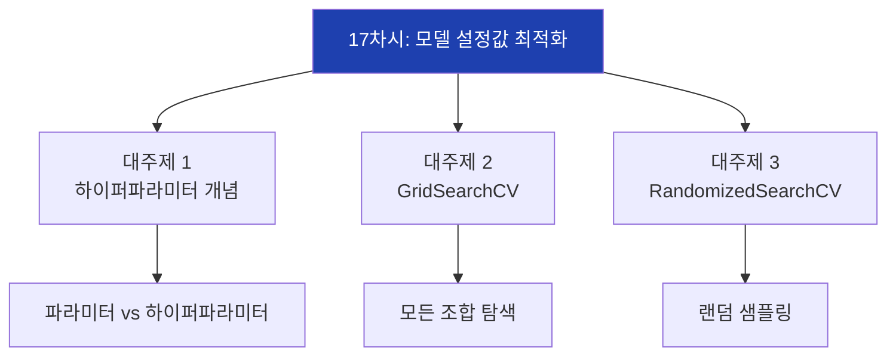

## 3. 파라미터 vs 하이퍼파라미터

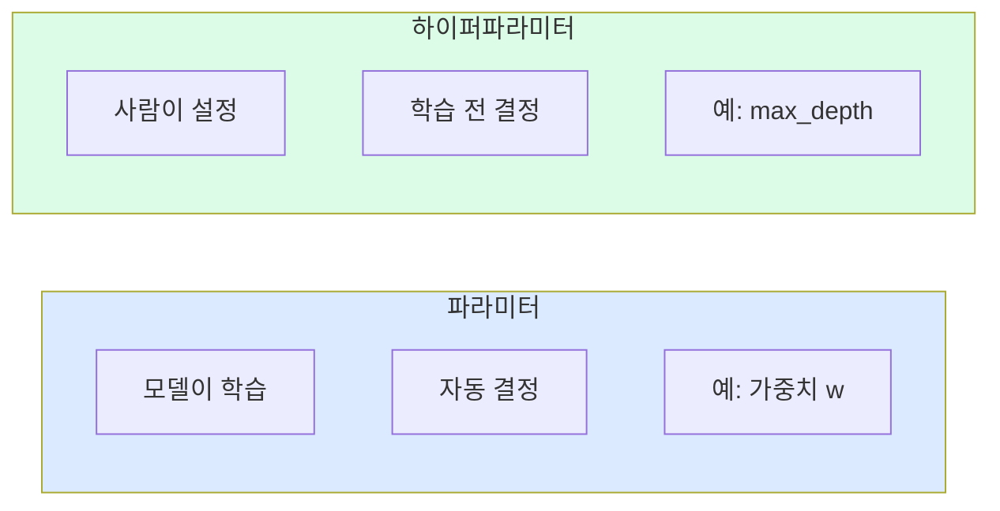

## 4. 하이퍼파라미터 예시

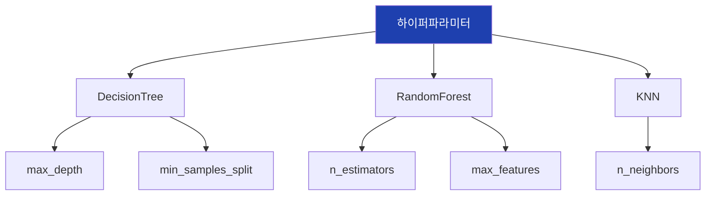

## 5. 하이퍼파라미터의 영향

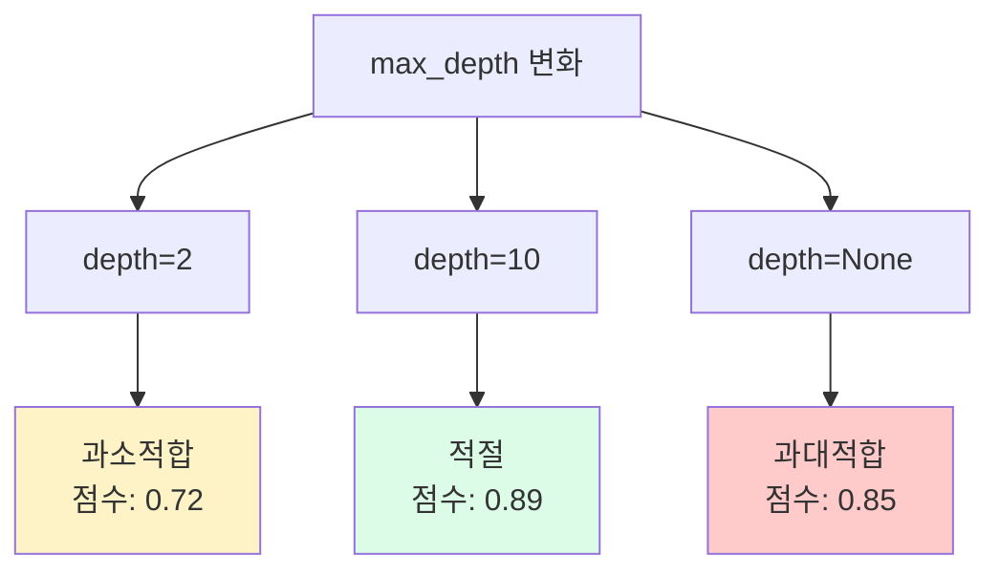

## 6. 수동 탐색의 한계

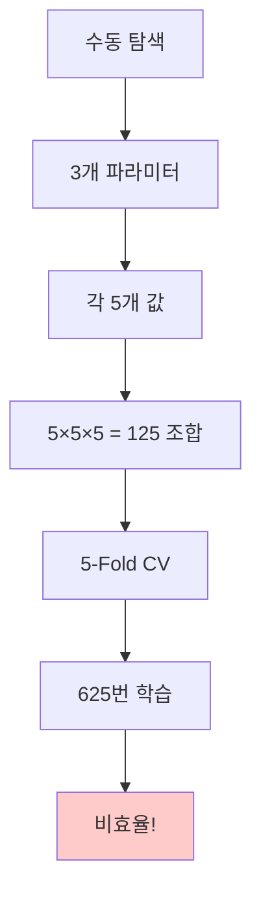

## 7. 조합 폭발 문제

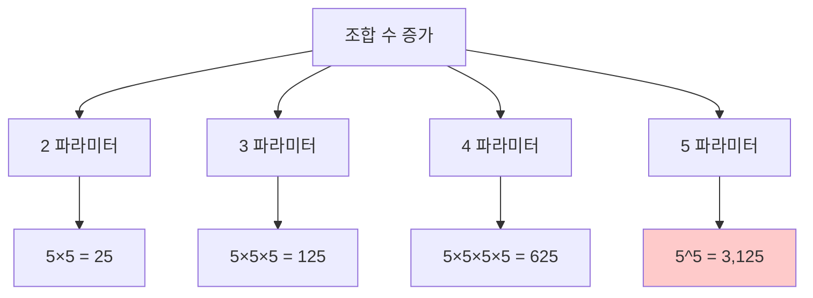

## 8. GridSearchCV 개념

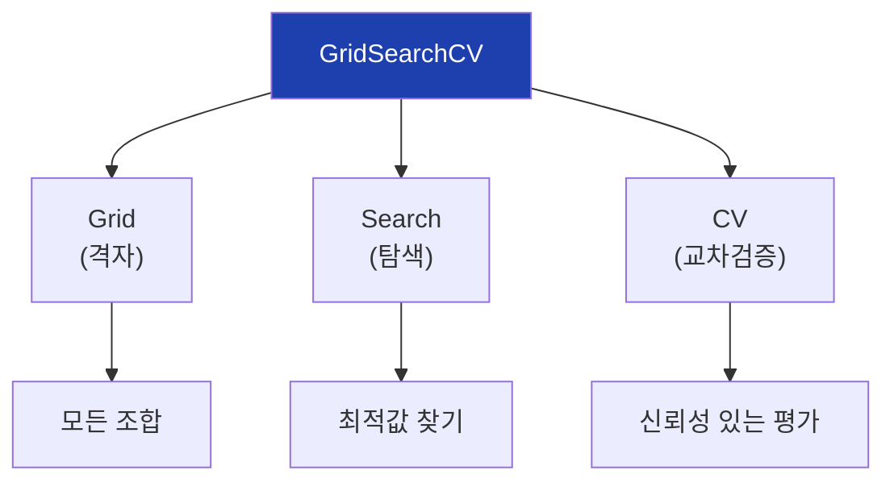

## 9. GridSearchCV 격자 시각화

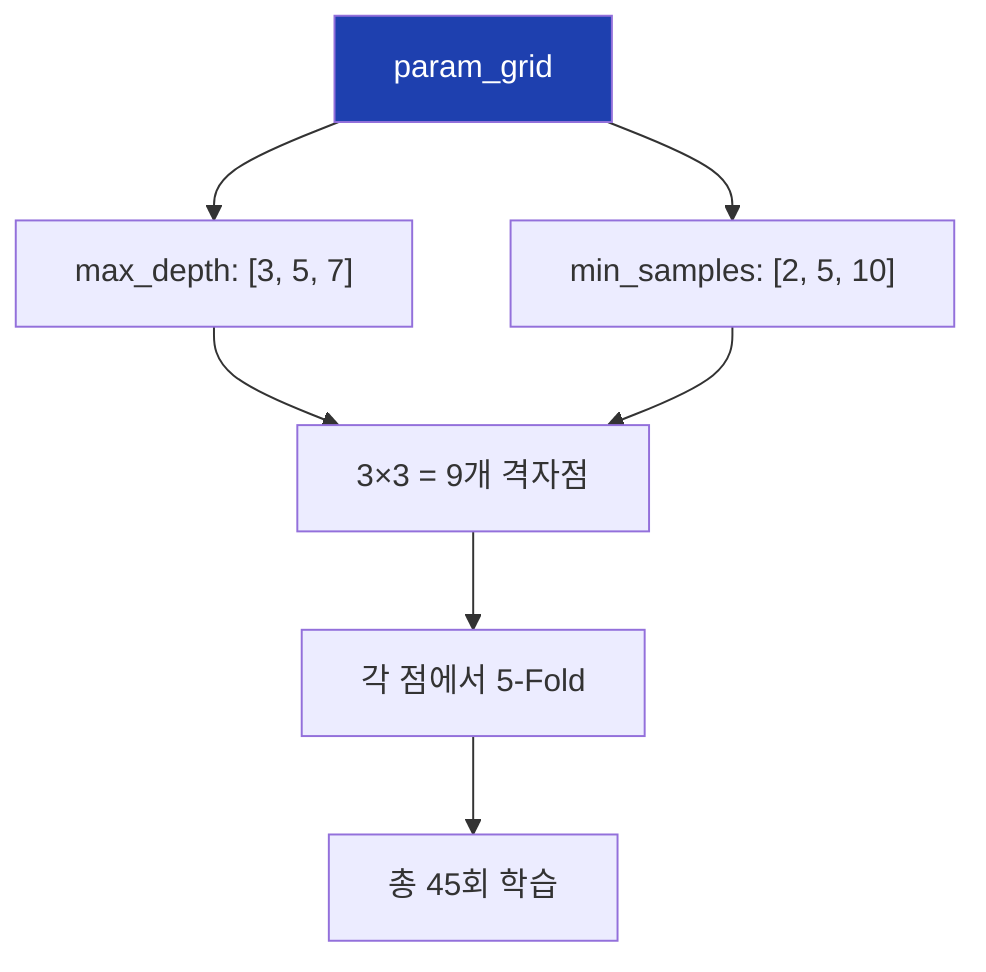

## 10. GridSearchCV 동작 과정

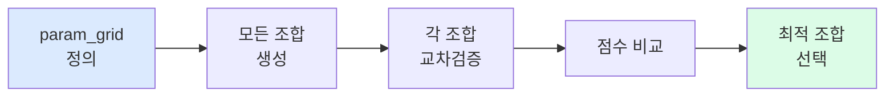

## 11. GridSearchCV 코드 구조

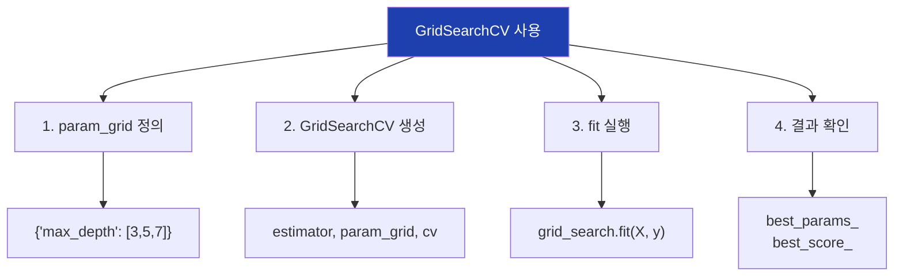

## 12. GridSearchCV 주요 속성

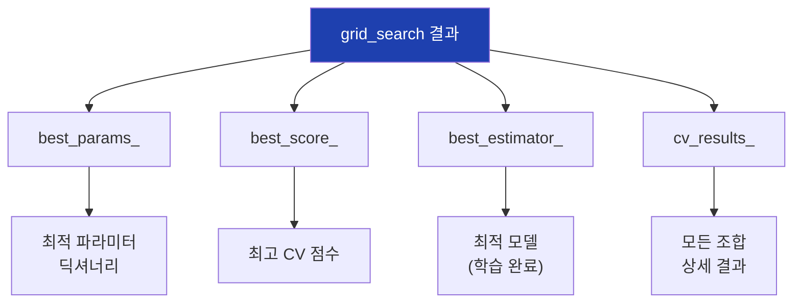

## 13. scoring 옵션 - 분류

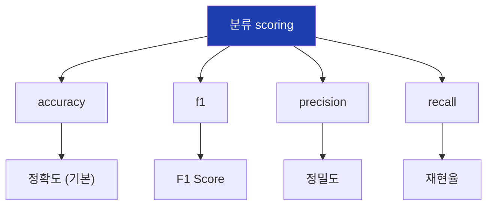

## 14. scoring 옵션 - 회귀

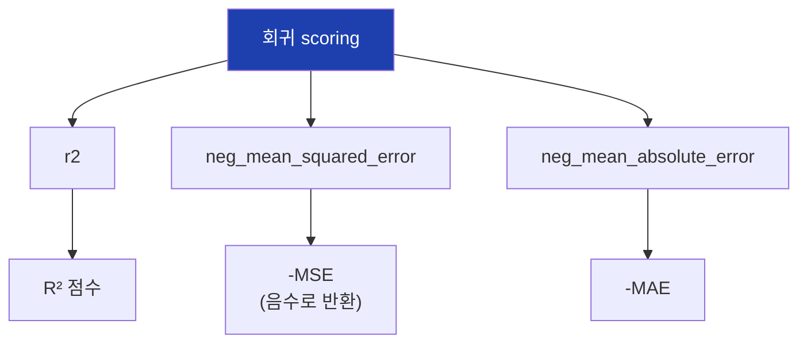

## 15. GridSearchCV의 한계

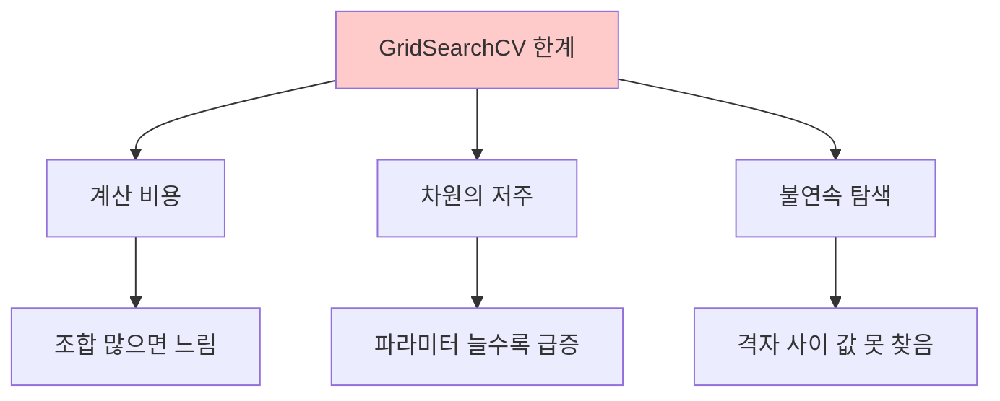

## 16. RandomizedSearchCV 개념

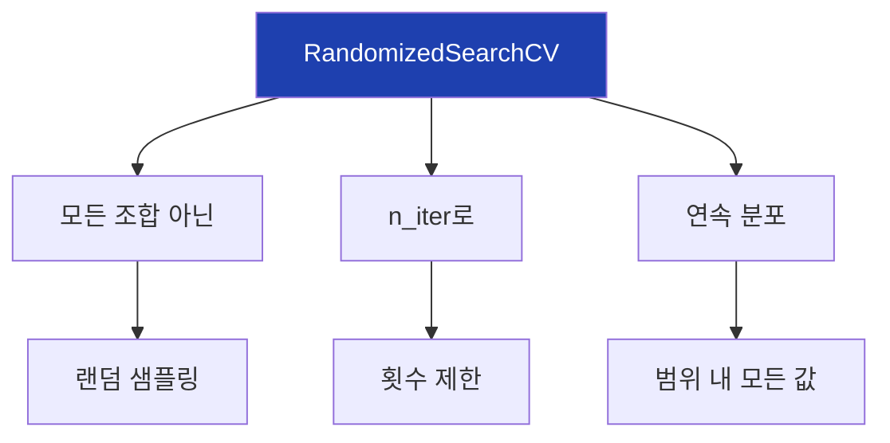

## 17. Grid vs Random 비교

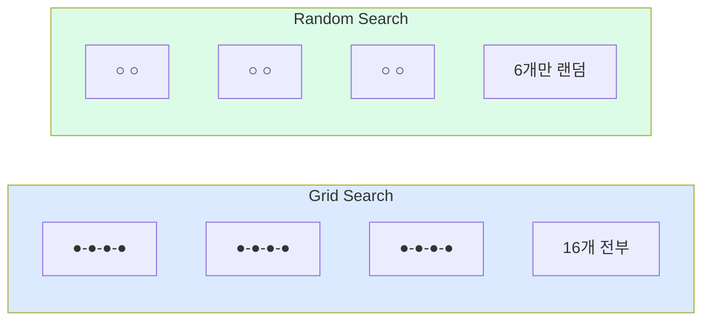

## 18. RandomizedSearchCV 분포

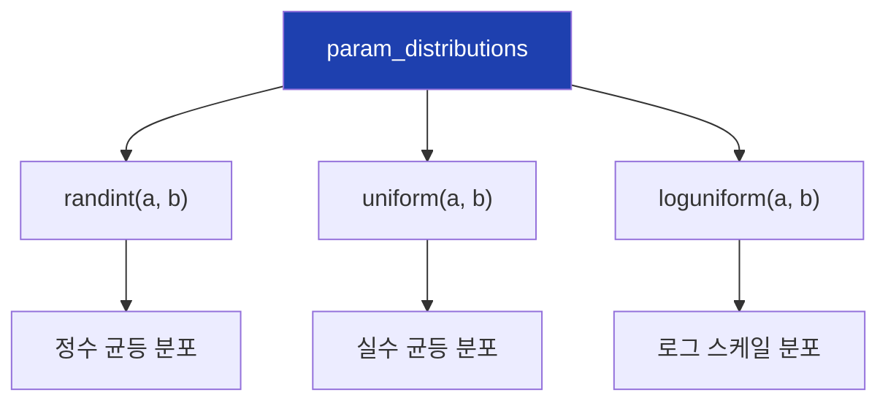

## 19. 분포 사용 예시

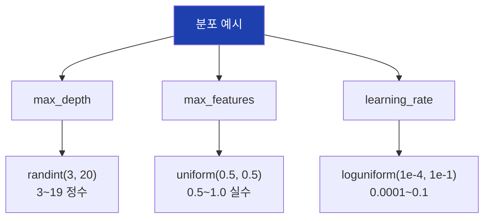

## 20. n_iter 선택 가이드

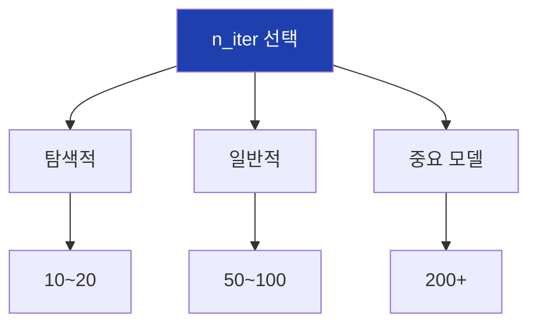

## 21. Grid vs Random 효율성

```mermaid
flowchart TD
    A["10,000 조합 문제"]

    A --> B["Grid Search"]
    B --> B1["10,000 조합 모두"]
    B --> B2["매우 오래 걸림"]

    A --> C["Random Search"]
    C --> C1["100개만 샘플링"]
    C --> C2["1% 시간"]
    C --> C3["비슷한 성능"]

    style B2 fill:#fecaca
    style C3 fill:#dcfce7
```

## 22. 2단계 탐색 전략

```mermaid
flowchart TD
    A["1단계: Random"]
    B["넓은 범위<br>빠르게 탐색"]
    C["좋은 영역 파악"]
    D["2단계: Grid"]
    E["좁은 범위<br>세밀하게 탐색"]
    F["최적값 정밀 탐색"]

    A --> B --> C --> D --> E --> F

    style A fill:#dbeafe
    style D fill:#dcfce7
```

## 23. 2단계 탐색 예시

```mermaid
flowchart TD
    A["1단계 Random"]
    A --> B["max_depth: 3~20"]
    B --> C["best: 8"]

    C --> D["2단계 Grid"]
    D --> E["max_depth: 6,7,8,9,10"]
    E --> F["best: 9"]

    style C fill:#fef3c7
    style F fill:#dcfce7
```

## 24. 병렬 처리 (n_jobs)

```mermaid
flowchart TD
    A["n_jobs 옵션"]

    A --> B["n_jobs=1"]
    B --> B1["단일 코어<br>(기본값)"]

    A --> C["n_jobs=-1"]
    C --> C1["모든 코어<br>(최대 속도)"]

    A --> D["n_jobs=4"]
    D --> D1["4개 코어"]

    style A fill:#1e40af,color:#fff
```

## 25. 실습 흐름

```mermaid
flowchart TD
    A["1. 데이터 준비"]
    B["2. 기본 모델 평가"]
    C["3. GridSearchCV"]
    D["4. RandomizedSearchCV"]
    E["5. 결과 비교"]
    F["6. 최적 모델 저장"]

    A --> B --> C --> D --> E --> F

    style A fill:#dbeafe
    style F fill:#dcfce7
```

## 26. param_grid 작성

```mermaid
flowchart TD
    A["param_grid 예시"]

    A --> B["RandomForest"]
    B --> B1["n_estimators: [50,100,200]"]
    B --> B2["max_depth: [3,5,7,None]"]
    B --> B3["min_samples_split: [2,5,10]"]

    style A fill:#1e40af,color:#fff
```

## 27. param_distributions 작성

```mermaid
flowchart TD
    A["param_distributions 예시"]

    A --> B["RandomForest"]
    B --> B1["n_estimators: randint(50,300)"]
    B --> B2["max_depth: [3,5,7,10,None]"]
    B --> B3["min_samples_split: randint(2,20)"]

    style A fill:#1e40af,color:#fff
```

## 28. 결과 비교표

```mermaid
flowchart TD
    A["Grid vs Random 비교"]

    A --> B["조합 수"]
    B --> B1["Grid: 180<br>Random: 50"]

    A --> C["시간"]
    C --> C1["Grid: 60초<br>Random: 20초"]

    A --> D["점수"]
    D --> D1["Grid: 0.87<br>Random: 0.86"]

    style A fill:#1e40af,color:#fff
```

## 29. cv_results_ 활용

```mermaid
flowchart TD
    A["cv_results_"]

    A --> B["params"]
    B --> B1["테스트된 파라미터"]

    A --> C["mean_test_score"]
    C --> C1["평균 CV 점수"]

    A --> D["rank_test_score"]
    D --> D1["순위"]

    A --> E["std_test_score"]
    E --> E1["점수 표준편차"]

    style A fill:#1e40af,color:#fff
```

## 30. 최적 모델 활용

```mermaid
flowchart TD
    A["best_estimator_"]

    A --> B["이미 학습됨"]
    B --> B1["최적 파라미터로"]

    A --> C["바로 사용 가능"]
    C --> C1["predict()"]
    C --> C2["score()"]

    A --> D["저장 가능"]
    D --> D1["joblib.dump()"]

    style A fill:#1e40af,color:#fff
```

## 31. 다중 평가 지표

```mermaid
flowchart TD
    A["다중 scoring"]

    A --> B["scoring=['accuracy','f1','recall']"]
    B --> C["refit='f1'"]
    C --> C1["최종 선택 기준"]

    B --> D["cv_results_에서<br>각 지표별 점수"]

    style A fill:#1e40af,color:#fff
```

## 32. 경계값 처리

```mermaid
flowchart TD
    A["최적값이 경계에"]

    A --> B["max_depth: [3,5,7]"]
    B --> C["best: 7"]
    C --> D["경계값!"]

    D --> E["범위 확장"]
    E --> F["max_depth: [7,10,15]"]
    F --> G["다시 탐색"]

    style D fill:#fef3c7
```

## 33. 핵심 정리

```mermaid
flowchart TD
    A["17차시 핵심"]

    A --> B["하이퍼파라미터"]
    B --> B1["사람이 설정<br>성능에 영향"]

    A --> C["GridSearchCV"]
    C --> C1["모든 조합<br>철저하지만 느림"]

    A --> D["RandomizedSearchCV"]
    D --> D1["랜덤 샘플링<br>효율적"]

    style A fill:#1e40af,color:#fff
```

## 34. sklearn 함수 정리

```mermaid
flowchart TD
    A["sklearn 함수"]

    A --> B["GridSearchCV"]
    B --> B1["param_grid"]
    B --> B2["모든 조합"]

    A --> C["RandomizedSearchCV"]
    C --> C1["param_distributions"]
    C --> C2["n_iter 샘플"]

    A --> D["공통 속성"]
    D --> D1["best_params_"]
    D --> D2["best_score_"]
    D --> D3["best_estimator_"]

    style A fill:#1e40af,color:#fff
```

## 35. 선택 가이드

```mermaid
flowchart TD
    A["어떤 방법을 쓸까?"]

    A --> B["파라미터 적음<br>(2~3개)"]
    B --> B1["Grid Search"]

    A --> C["파라미터 많음<br>범위 넓음"]
    C --> C1["Random Search"]

    A --> D["정밀도 중요"]
    D --> D1["Random → Grid<br>2단계"]

    style A fill:#1e40af,color:#fff
```

## 36. 다음 차시 연결

```mermaid
flowchart LR
    A["17차시<br>하이퍼파라미터"]
    B["17차시<br>시계열 기초"]

    A --> B

    A --> A1["모델 최적화"]
    B --> B1["날짜 데이터"]
    B --> B2["시간 처리"]

    style A fill:#dbeafe
    style B fill:#dcfce7
```

## 37. ML 파이프라인에서 위치

```mermaid
flowchart LR
    A["데이터"]
    B["전처리"]
    C["모델 학습"]
    D["평가"]
    E["튜닝"]
    F["배포"]

    A --> B --> C --> D --> E --> F

    style E fill:#1e40af,color:#fff
```

## 38. 전체 최적화 워크플로우

```mermaid
flowchart TD
    A["시작"]
    B["기본 모델 성능 확인"]
    C["Random Search로<br>좋은 영역 탐색"]
    D["Grid Search로<br>세밀 튜닝"]
    E["최적 모델 검증"]
    F["모델 저장"]
    G["배포"]

    A --> B --> C --> D --> E --> F --> G

    style A fill:#dbeafe
    style G fill:#dcfce7
```
