# [18차시] 시계열 데이터 기초 - 다이어그램

## 1. 학습 흐름

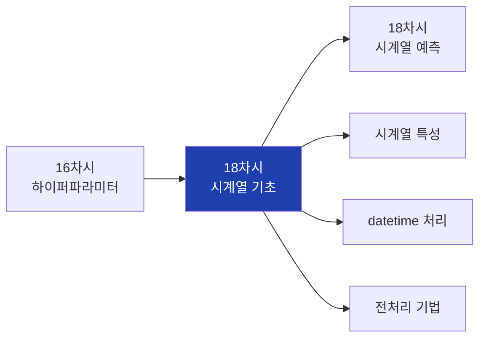

## 2. 대주제 구조

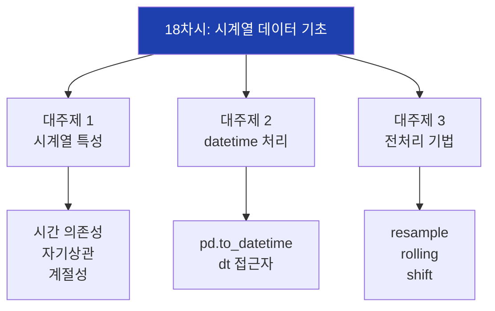

## 3. 일반 데이터 vs 시계열

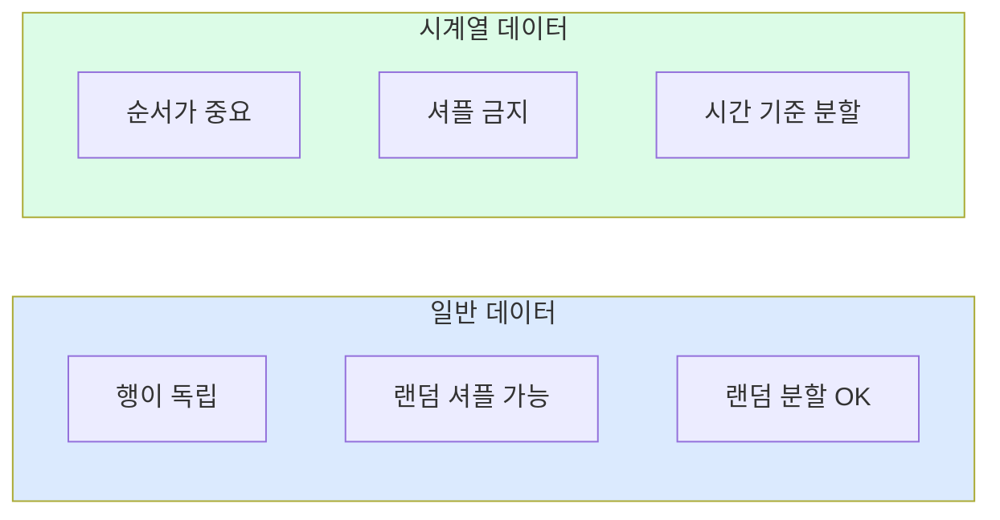

## 4. 시계열 특성 3가지

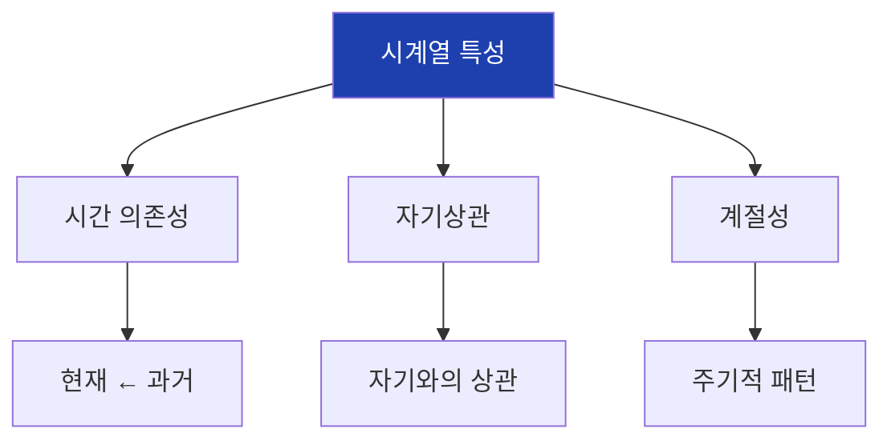

## 5. 시계열 구성요소

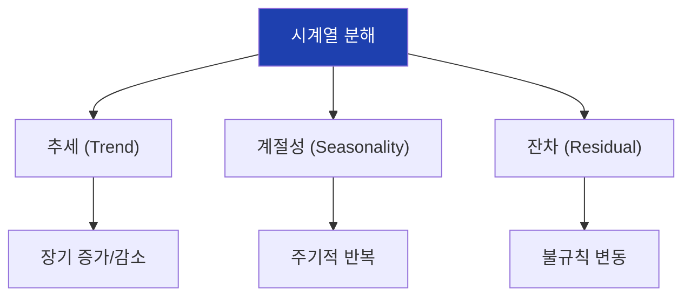

## 6. 추세 예시

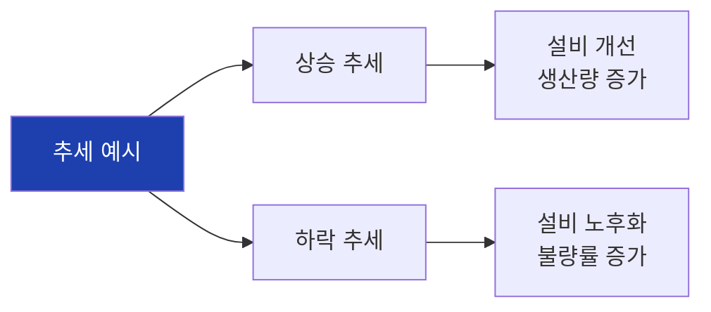

## 7. 계절성 예시

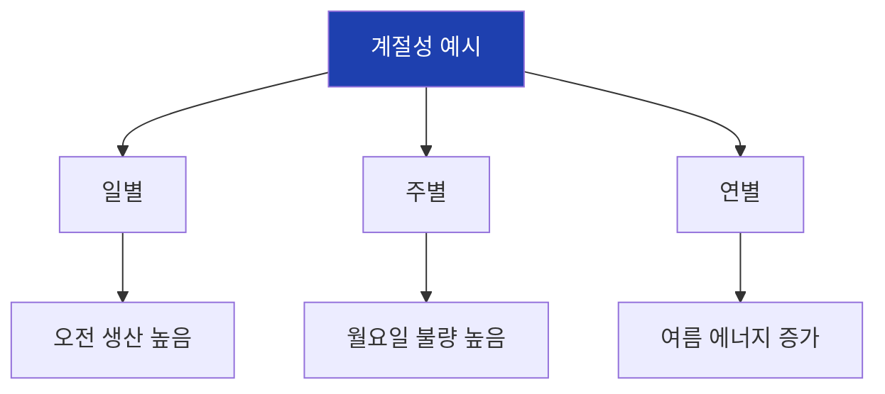

## 8. 데이터 분할 비교

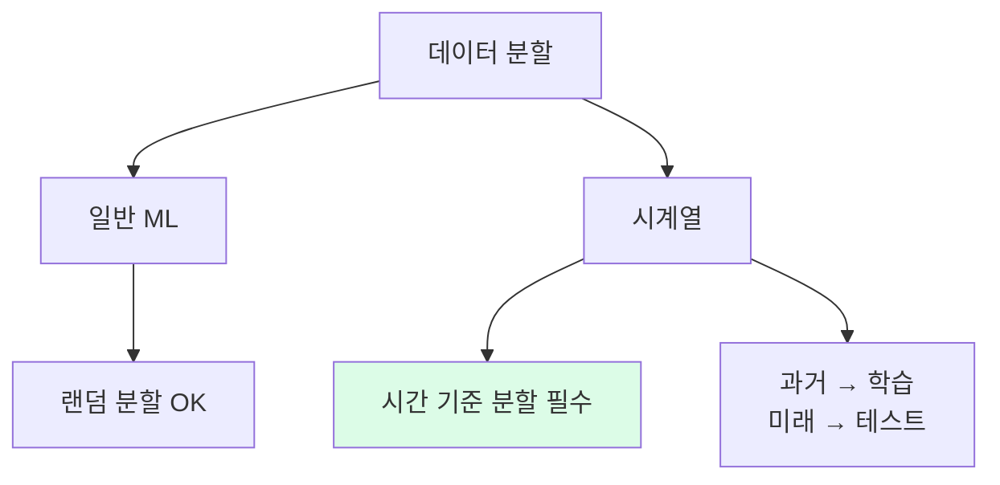

## 9. 시간 기준 분할

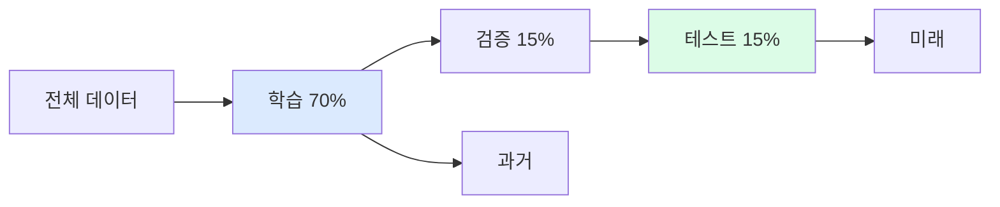

## 10. 데이터 누출 문제

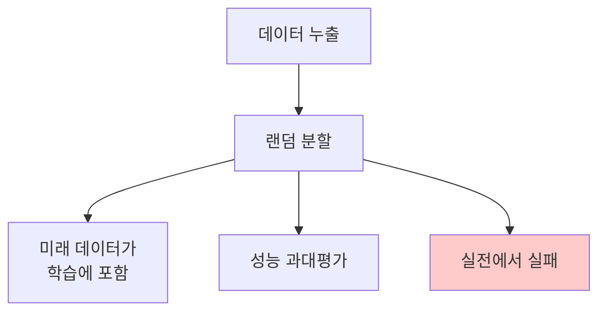

## 11. datetime 모듈

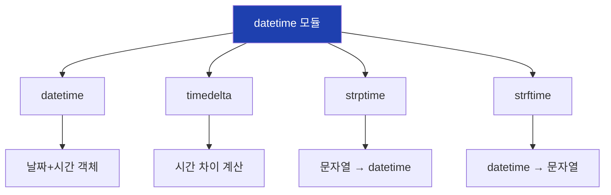

## 12. Pandas 날짜 처리

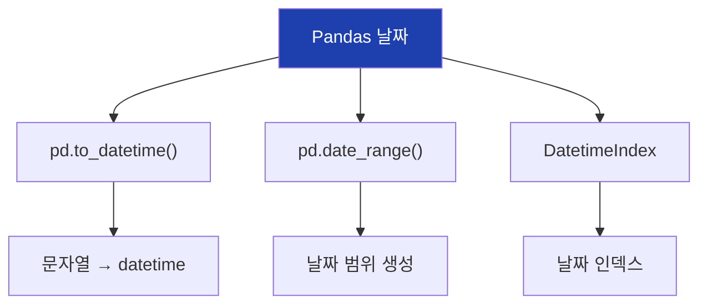

## 13. dt 접근자

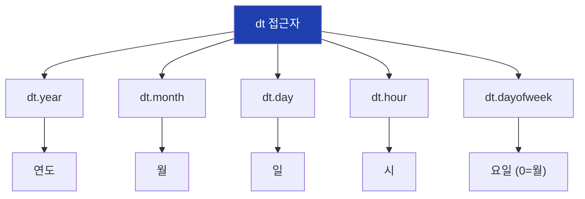

## 14. DatetimeIndex 장점

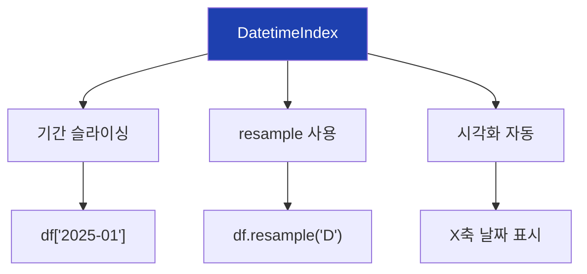

## 15. resample 개념

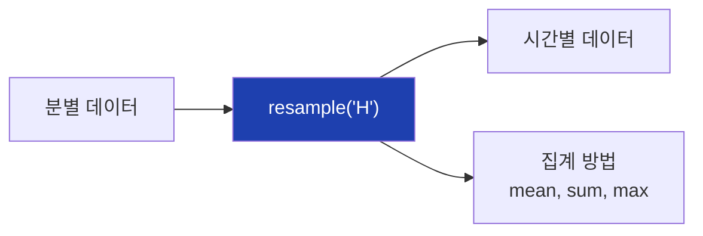

## 16. resample freq 옵션

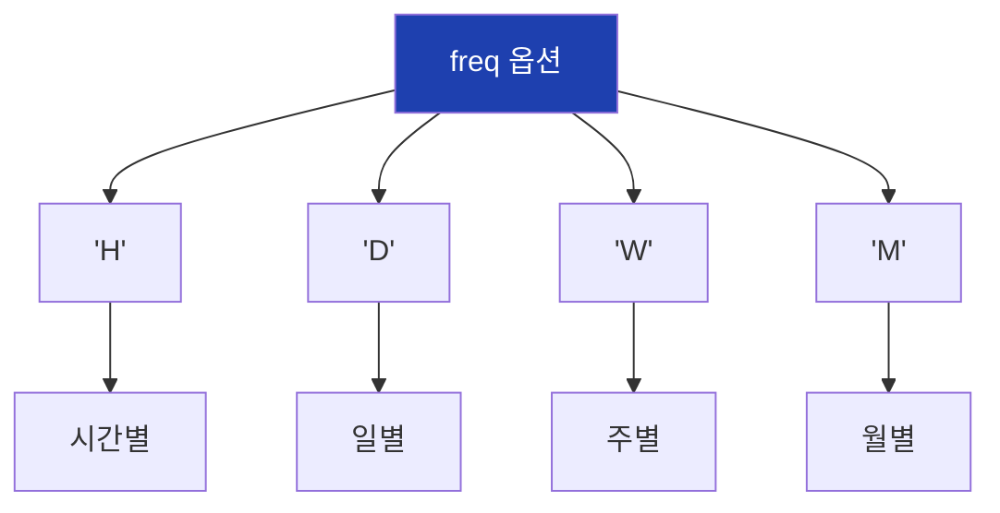

## 17. rolling 개념

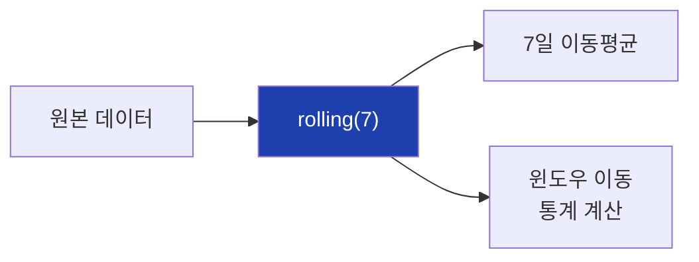

## 18. rolling 시각화

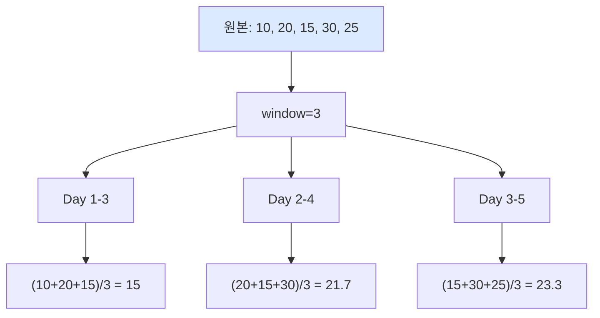

## 19. rolling 옵션

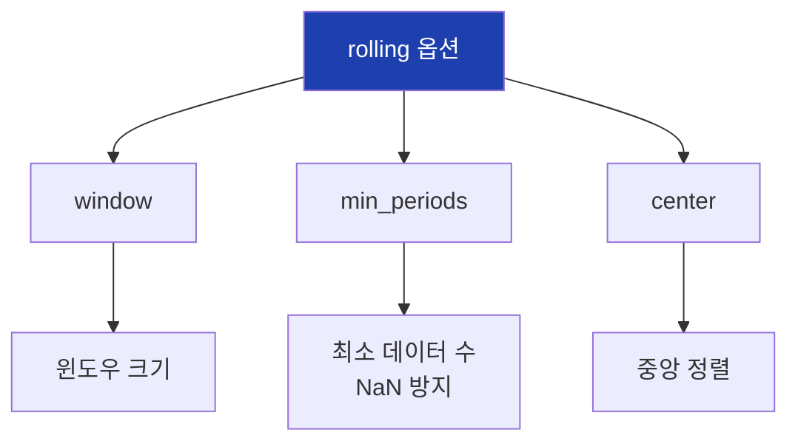

## 20. shift 개념

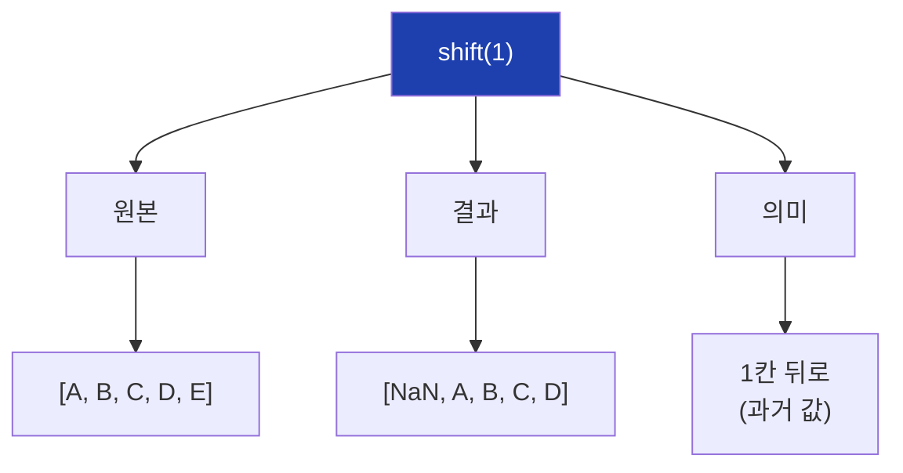

## 21. shift 방향

```mermaid
flowchart TD
    A["shift 방향"]

    A --> B["shift(1)"]
    B --> B1["과거 방향<br>Lag 특성"]

    A --> C["shift(-1)"]
    C --> C1["미래 방향<br>⚠️ 주의!"]

    style B1 fill:#dcfce7
    style C1 fill:#fecaca
```

## 22. Lag 특성 생성

```mermaid
flowchart TD
    A["Lag 특성"]

    A --> B["lag_1"]
    B --> B1["1시간 전 값"]

    A --> C["lag_24"]
    C --> C1["24시간 전 값"]

    A --> D["lag_168"]
    D --> D1["7일 전 값"]

    style A fill:#1e40af,color:#fff
```

## 23. 데이터 누출 방지

```mermaid
flowchart TD
    A["Rolling 특성"]

    A --> B["❌ 잘못된 방법"]
    B --> B1["rolling(7).mean()"]
    B --> B2["오늘 값 포함!"]

    A --> C["✅ 올바른 방법"]
    C --> C1["shift(1).rolling(7).mean()"]
    C --> C2["어제까지만 사용"]

    style B2 fill:#fecaca
    style C2 fill:#dcfce7
```

## 24. 특성 엔지니어링 순서

```mermaid
flowchart LR
    A["원본"]
    B["shift(1)"]
    C["rolling(7)"]
    D["mean()"]
    E["ma_7 특성"]

    A --> B --> C --> D --> E

    style A fill:#dbeafe
    style E fill:#dcfce7
```

## 25. 날짜 특성 추출

```mermaid
flowchart TD
    A["날짜에서 추출"]

    A --> B["hour"]
    B --> B1["시간대 효과"]

    A --> C["dayofweek"]
    C --> C1["요일 효과"]

    A --> D["month"]
    D --> D1["월별 효과"]

    A --> E["is_weekend"]
    E --> E1["주말 효과"]

    style A fill:#1e40af,color:#fff
```

## 26. diff 개념

```mermaid
flowchart TD
    A["diff()"]

    A --> B["원본"]
    B --> B1["[100, 105, 103]"]

    A --> C["diff(1)"]
    C --> C1["[NaN, 5, -2]"]

    A --> D["의미"]
    D --> D1["연속 값의 차이<br>변화량"]

    style A fill:#1e40af,color:#fff
```

## 27. pct_change 개념

```mermaid
flowchart TD
    A["pct_change()"]

    A --> B["원본"]
    B --> B1["[100, 110, 99]"]

    A --> C["결과"]
    C --> C1["[NaN, 0.10, -0.10]"]

    A --> D["의미"]
    D --> D1["변화율<br>10% 증가, 10% 감소"]

    style A fill:#1e40af,color:#fff
```

## 28. 실습 흐름

```mermaid
flowchart TD
    A["1. 데이터 생성"]
    B["2. datetime 변환"]
    C["3. 날짜 특성 추출"]
    D["4. resample"]
    E["5. rolling, shift"]
    F["6. 시간 분할"]

    A --> B --> C --> D --> E --> F

    style A fill:#dbeafe
    style F fill:#dcfce7
```

## 29. 전처리 기법 요약

```mermaid
flowchart TD
    A["시계열 전처리"]

    A --> B["resample()"]
    B --> B1["주기 변환"]

    A --> C["rolling()"]
    C --> C1["이동 통계"]

    A --> D["shift()"]
    D --> D1["Lag 특성"]

    A --> E["diff()"]
    E --> E1["차분"]

    style A fill:#1e40af,color:#fff
```

## 30. TimeSeriesSplit

```mermaid
flowchart TD
    A["TimeSeriesSplit"]

    A --> B["Fold 1"]
    B --> B1["[Train] [Val]"]

    A --> C["Fold 2"]
    C --> C1["[Train___] [Val]"]

    A --> D["Fold 3"]
    D --> D1["[Train______] [Val]"]

    style A fill:#1e40af,color:#fff
```

## 31. 핵심 정리

```mermaid
flowchart TD
    A["18차시 핵심"]

    A --> B["시계열 특성"]
    B --> B1["순서 중요<br>시간 기준 분할"]

    A --> C["datetime 처리"]
    C --> C1["pd.to_datetime<br>dt 접근자"]

    A --> D["전처리 기법"]
    D --> D1["resample<br>rolling<br>shift"]

    style A fill:#1e40af,color:#fff
```

## 32. shift 필수 규칙

```mermaid
flowchart TD
    A["shift(1) 필수"]

    A --> B["Lag 특성"]
    B --> B1["shift(n)으로 생성"]

    A --> C["Rolling 특성"]
    C --> C1["shift(1) 후 rolling"]

    A --> D["미래 누출 방지"]
    D --> D1["현재/미래 값 제외"]

    style A fill:#fecaca
```

## 33. 다음 차시 연결

```mermaid
flowchart LR
    A["18차시<br>시계열 기초"]
    B["18차시<br>시계열 예측"]

    A --> B

    A --> A1["전처리<br>특성 추출"]
    B --> B1["ML 모델<br>예측 실습"]

    style A fill:#dbeafe
    style B fill:#dcfce7
```

## 34. 제조 데이터 시계열

```mermaid
flowchart TD
    A["제조 시계열"]

    A --> B["센서 온도"]
    B --> B1["초/분 단위"]

    A --> C["생산량"]
    C --> C1["시간/일 단위"]

    A --> D["불량률"]
    D --> D1["일/주 단위"]

    A --> E["설비 로그"]
    E --> E1["이벤트 기반"]

    style A fill:#1e40af,color:#fff
```

## 35. 특성 엔지니어링 전략

```mermaid
flowchart TD
    A["시계열 특성"]

    A --> B["날짜 특성"]
    B --> B1["hour, dayofweek<br>month, is_weekend"]

    A --> C["Lag 특성"]
    C --> C1["shift(1,24,168)"]

    A --> D["Rolling 특성"]
    D --> D1["ma, std, max, min"]

    A --> E["변화 특성"]
    E --> E1["diff, pct_change"]

    style A fill:#1e40af,color:#fff
```

## 36. NaN 처리

```mermaid
flowchart TD
    A["NaN 발생"]

    A --> B["shift(n)"]
    B --> B1["첫 n개 NaN"]

    A --> C["rolling(n)"]
    C --> C1["첫 n-1개 NaN"]

    A --> D["처리 방법"]
    D --> D1["dropna()"]
    D --> D2["fillna()"]

    style A fill:#1e40af,color:#fff
```

## 37. 전체 워크플로우

```mermaid
flowchart TD
    A["시계열 데이터"]
    B["datetime 변환"]
    C["특성 추출"]
    D["전처리 기법"]
    E["NaN 처리"]
    F["시간 기준 분할"]
    G["모델 학습"]

    A --> B --> C --> D --> E --> F --> G

    style A fill:#dbeafe
    style G fill:#dcfce7
```

## 38. 주의사항 정리

```mermaid
flowchart TD
    A["시계열 주의사항"]

    A --> B["분할"]
    B --> B1["시간 기준 필수<br>랜덤 분할 금지"]

    A --> C["특성"]
    C --> C1["shift(1) 먼저<br>미래 누출 방지"]

    A --> D["검증"]
    D --> D1["TimeSeriesSplit<br>순차 검증"]

    style A fill:#fecaca
```
