# [19차시] 시계열 예측 모델 - 다이어그램

## 1. 학습 흐름

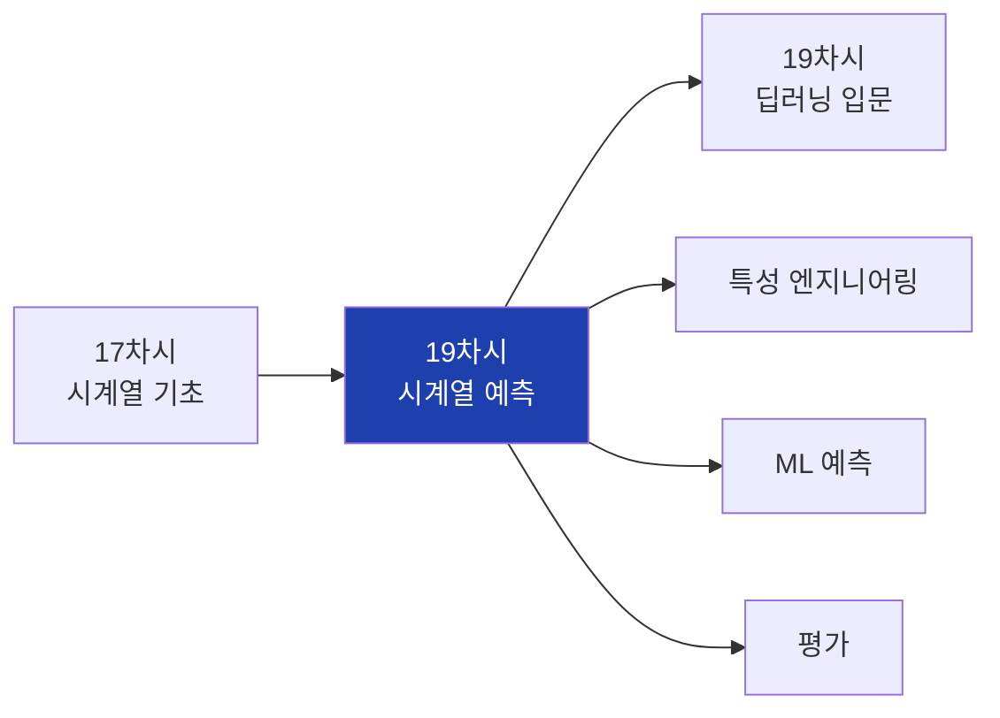

## 2. 대주제 구조

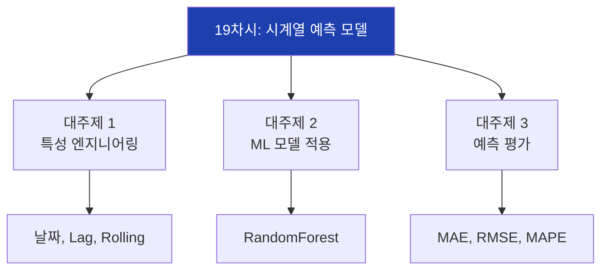

## 3. 특성 엔지니어링 종류

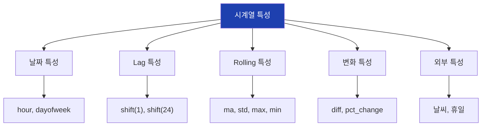

## 4. 날짜 특성 추출

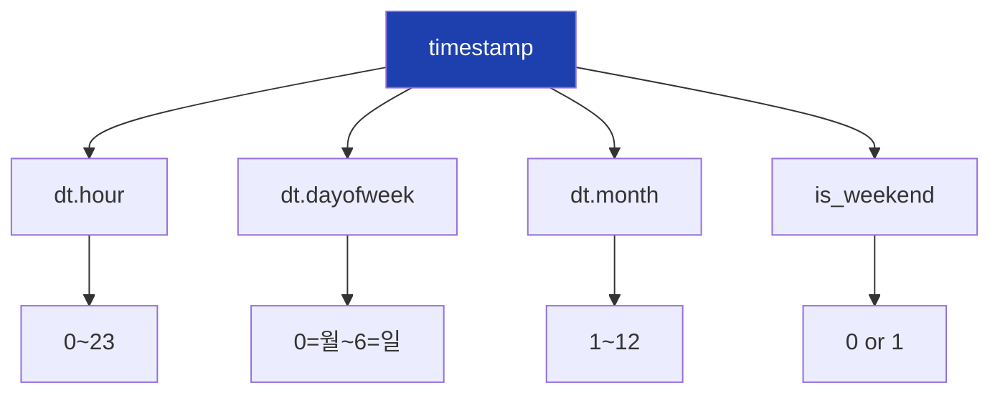

## 5. 주기적 인코딩

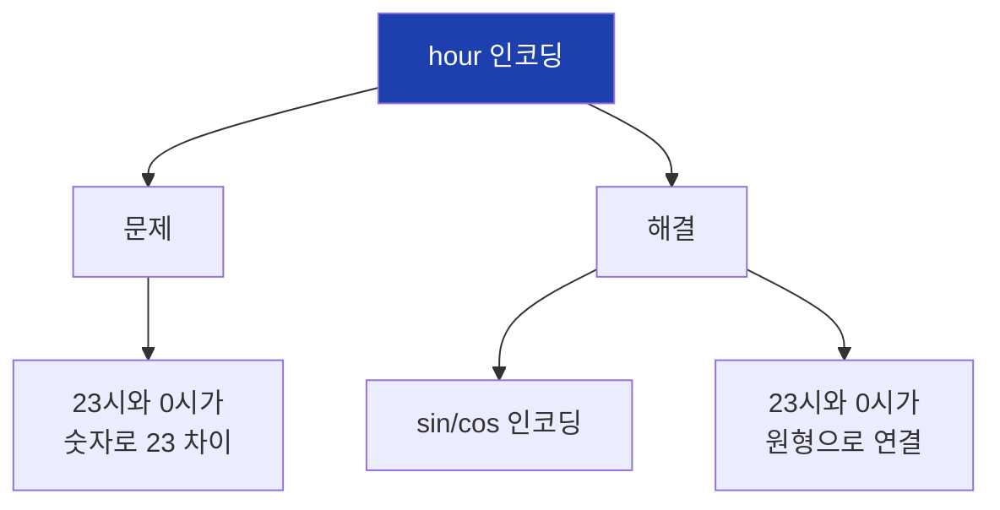

## 6. Lag 특성 생성

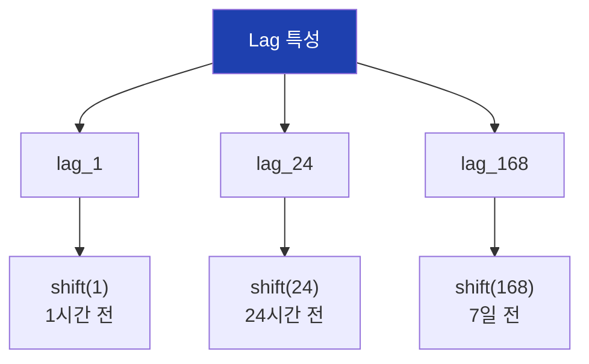

## 7. Rolling 특성 생성

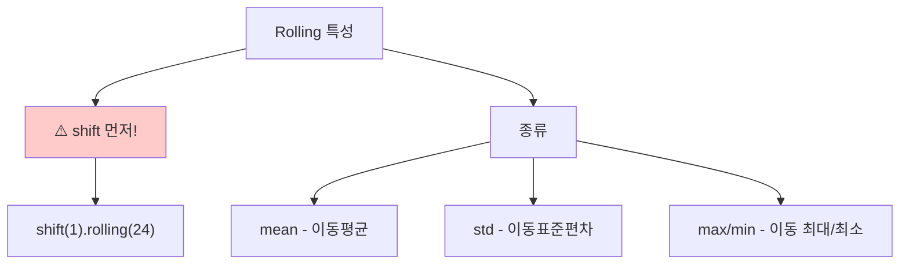

## 8. 미래 누출 방지

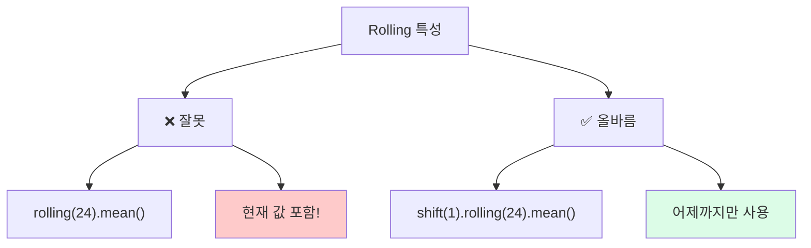

## 9. ML 예측 흐름

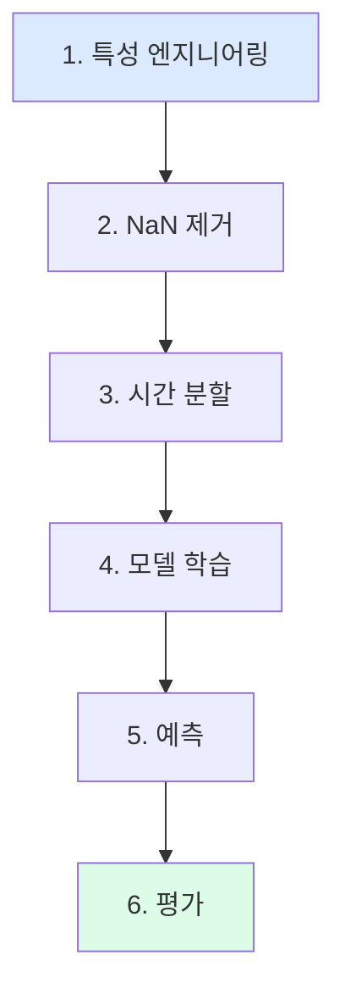

## 10. RandomForest 적용

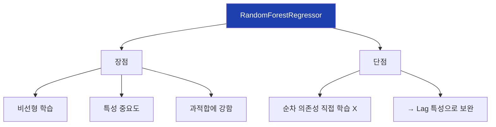

## 11. 모델 비교

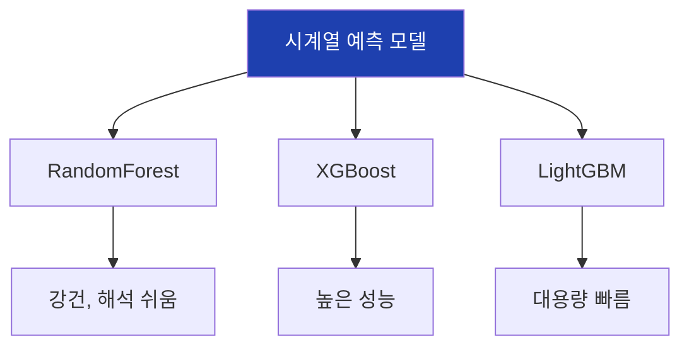

## 12. TimeSeriesSplit

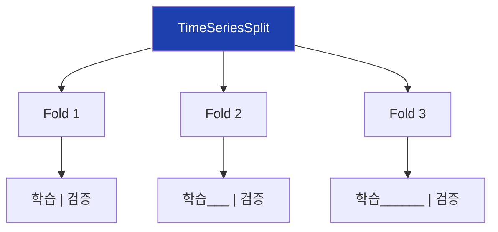

## 13. 다단계 예측

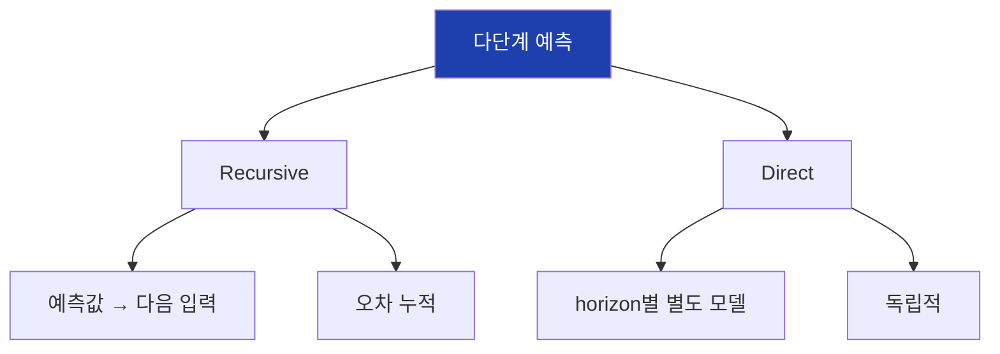

## 14. 평가 지표

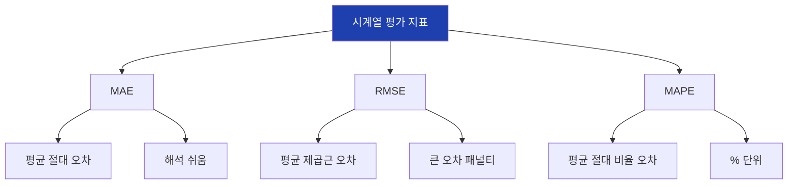

## 15. MAE 개념

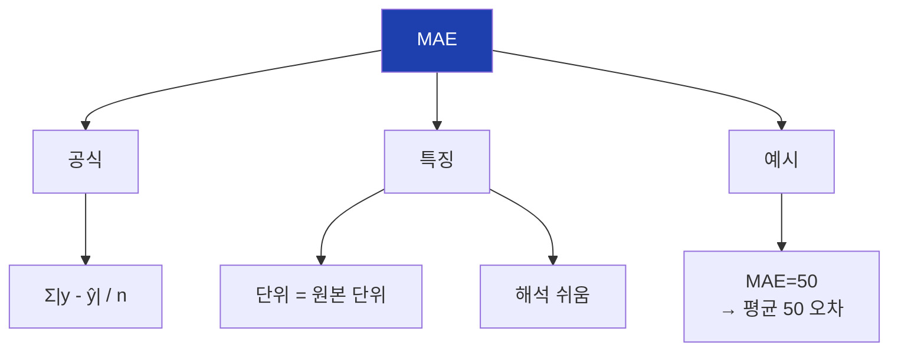

## 16. RMSE 개념

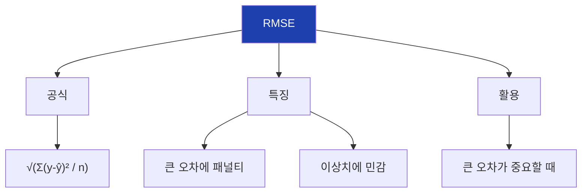

## 17. MAPE 개념

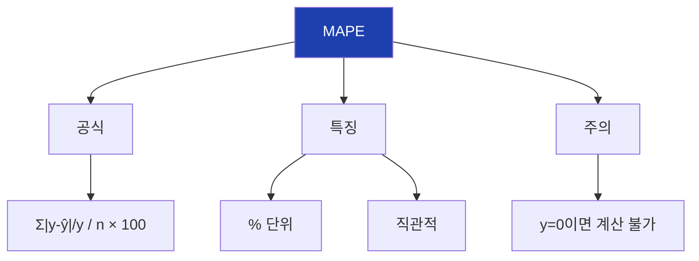

## 18. 지표 선택 가이드

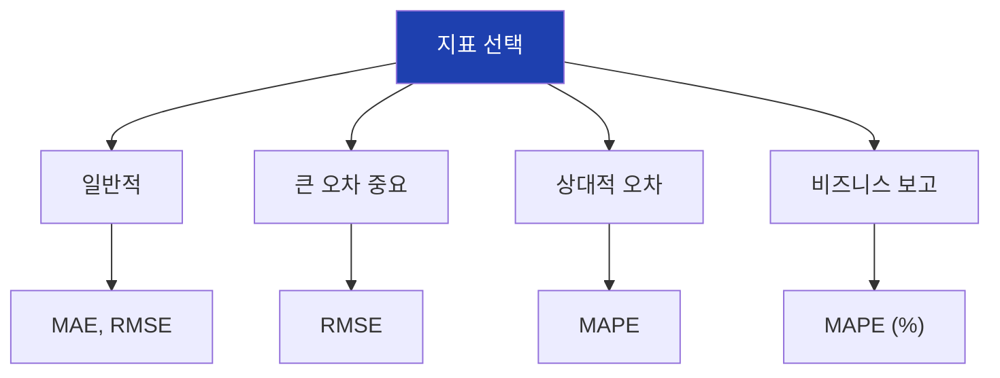

## 19. 시각적 평가

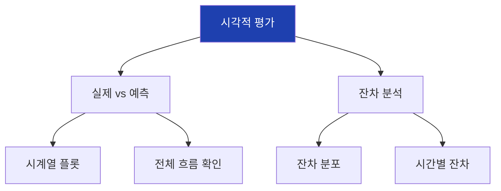

## 20. 잔차 분석

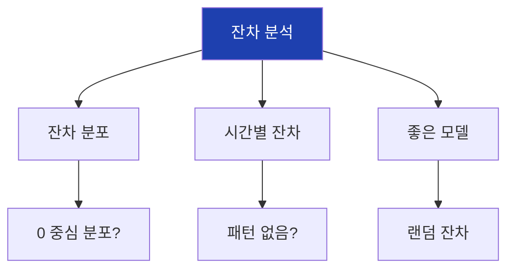

## 21. 특성 중요도

```mermaid
flowchart TD
    A["특성 중요도"]

    A --> B["높음"]
    B --> B1["lag_1, lag_24"]
    B --> B2["직접적 영향"]

    A --> C["중간"]
    C --> C1["hour, dayofweek"]
    C --> C2["패턴 기여"]

    A --> D["낮음"]
    D --> D1["제거 고려"]

    style A fill:#1e40af,color:#fff
```

## 22. 실습 흐름

```mermaid
flowchart TD
    A["1. 데이터 생성"]
    B["2. 특성 엔지니어링"]
    C["3. 시간 분할"]
    D["4. 모델 학습"]
    E["5. 예측 및 평가"]
    F["6. 시각화"]

    A --> B --> C --> D --> E --> F

    style A fill:#dbeafe
    style F fill:#dcfce7
```

## 23. 예측 성능 기준

```mermaid
flowchart TD
    A["MAPE 기준"]

    A --> B["< 5%"]
    B --> B1["매우 좋음"]

    A --> C["5~10%"]
    C --> C1["좋음"]

    A --> D["10~20%"]
    D --> D1["보통"]

    A --> E["> 20%"]
    E --> E1["개선 필요"]

    style B fill:#dcfce7
    style C fill:#dcfce7
    style D fill:#fef3c7
    style E fill:#fecaca
```

## 24. sklearn 함수 정리

```mermaid
flowchart TD
    A["sklearn 함수"]

    A --> B["모델"]
    B --> B1["RandomForestRegressor"]

    A --> C["분할"]
    C --> C1["TimeSeriesSplit"]

    A --> D["평가"]
    D --> D1["mean_absolute_error"]
    D --> D2["mean_squared_error"]

    style A fill:#1e40af,color:#fff
```

## 25. 예측 구간

```mermaid
flowchart TD
    A["예측 구간"]

    A --> B["점 예측"]
    B --> B1["단일 값"]

    A --> C["구간 예측"]
    C --> C1["상한/하한"]
    C --> C2["불확실성 표현"]

    A --> D["계산"]
    D --> D1["예측 ± 1.96 × std"]

    style A fill:#1e40af,color:#fff
```

## 26. 변화 특성

```mermaid
flowchart TD
    A["변화 특성"]

    A --> B["diff"]
    B --> B1["절대 변화량"]

    A --> C["pct_change"]
    C --> C1["상대 변화율"]

    A --> D["활용"]
    D --> D1["변동성 파악"]

    style A fill:#1e40af,color:#fff
```

## 27. 외부 특성

```mermaid
flowchart TD
    A["외부 특성"]

    A --> B["날씨"]
    B --> B1["온도, 습도"]

    A --> C["캘린더"]
    C --> C1["휴일, 이벤트"]

    A --> D["경제"]
    D --> D1["지표, 환율"]

    style A fill:#1e40af,color:#fff
```

## 28. 핵심 정리

```mermaid
flowchart TD
    A["19차시 핵심"]

    A --> B["특성 엔지니어링"]
    B --> B1["shift(1) 필수"]

    A --> C["ML 예측"]
    C --> C1["RandomForest<br>TimeSeriesSplit"]

    A --> D["평가"]
    D --> D1["MAE, MAPE<br>시각화"]

    style A fill:#1e40af,color:#fff
```

## 29. 과적합 방지

```mermaid
flowchart TD
    A["과적합 방지"]

    A --> B["특성 선택"]
    B --> B1["중요도 낮은 특성 제거"]

    A --> C["교차검증"]
    C --> C1["TimeSeriesSplit"]

    A --> D["정규화"]
    D --> D1["max_depth 제한"]

    style A fill:#1e40af,color:#fff
```

## 30. 다음 차시 연결

```mermaid
flowchart LR
    A["19차시<br>시계열 예측"]
    B["19차시<br>딥러닝 입문"]

    A --> B

    A --> A1["ML 기반 예측"]
    B --> B1["신경망 기초"]
    B --> B2["딥러닝 개념"]

    style A fill:#dbeafe
    style B fill:#dcfce7
```

## 31. 전체 워크플로우

```mermaid
flowchart TD
    A["원본 시계열"]
    B["특성 엔지니어링"]
    C["데이터 분할"]
    D["모델 학습"]
    E["예측"]
    F["평가"]
    G["배포"]

    A --> B --> C --> D --> E --> F --> G

    style A fill:#dbeafe
    style G fill:#dcfce7
```

## 32. 비율 특성

```mermaid
flowchart TD
    A["비율 특성"]

    A --> B["이동평균 대비"]
    B --> B1["value / ma"]

    A --> C["최대값 대비"]
    C --> C1["value / max"]

    A --> D["범위 내 위치"]
    D --> D1["(value-min)/(max-min)"]

    style A fill:#1e40af,color:#fff
```

## 33. 모델 선택 전략

```mermaid
flowchart TD
    A["모델 선택"]

    A --> B["데이터 적음"]
    B --> B1["RandomForest"]

    A --> C["데이터 많음"]
    C --> C1["XGBoost, LightGBM"]

    A --> D["해석 필요"]
    D --> D1["LinearRegression<br>DecisionTree"]

    style A fill:#1e40af,color:#fff
```

## 34. 예측 개선 전략

```mermaid
flowchart TD
    A["예측 개선"]

    A --> B["특성 추가"]
    B --> B1["더 많은 Lag<br>외부 변수"]

    A --> C["모델 튜닝"]
    C --> C1["하이퍼파라미터<br>최적화"]

    A --> D["앙상블"]
    D --> D1["여러 모델 결합"]

    style A fill:#1e40af,color:#fff
```

## 35. 주의사항 정리

```mermaid
flowchart TD
    A["시계열 예측 주의"]

    A --> B["데이터 누출"]
    B --> B1["shift(1) 필수"]

    A --> C["시간 분할"]
    C --> C1["랜덤 분할 금지"]

    A --> D["과적합"]
    D --> D1["교차검증 필수"]

    style A fill:#fecaca
```
