# [20차시] 딥러닝 입문: 신경망 기초 - 다이어그램

## 1. 학습 흐름

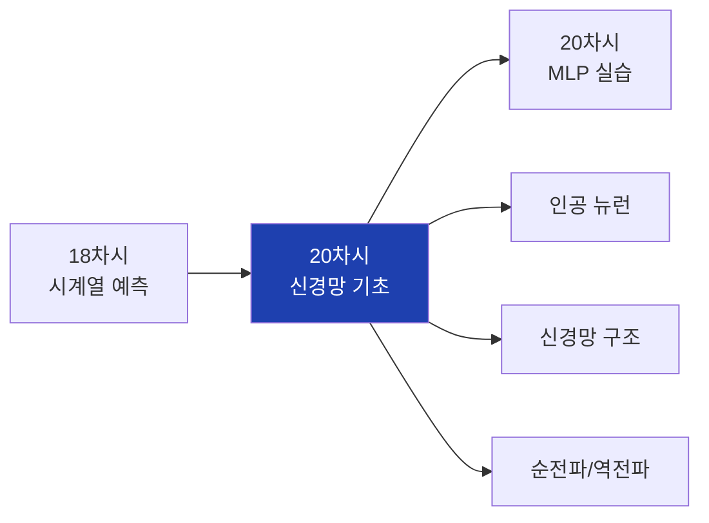

## 2. 대주제 구조

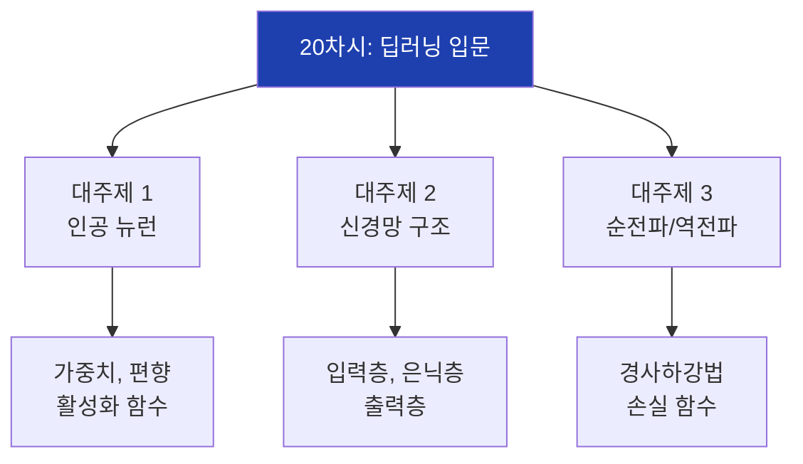

## 3. ML vs DL 비교

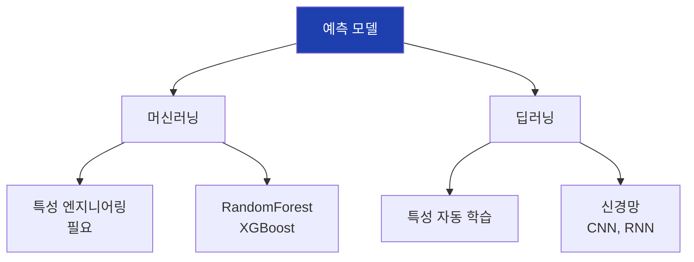

## 4. 생물학적 뉴런


## 5. 인공 뉴런 구조

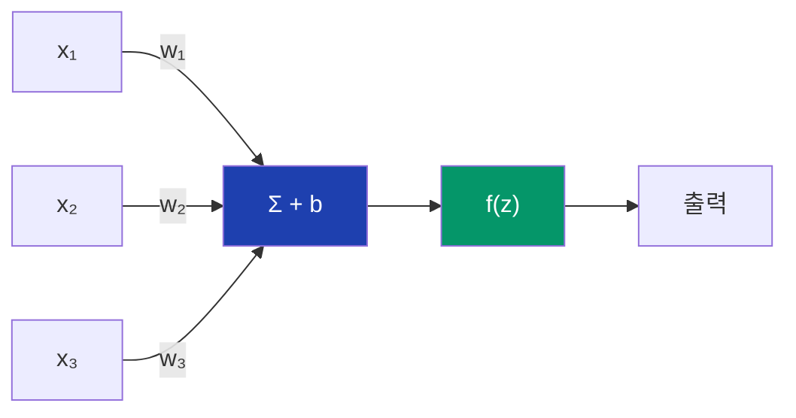

## 6. 퍼셉트론 수식

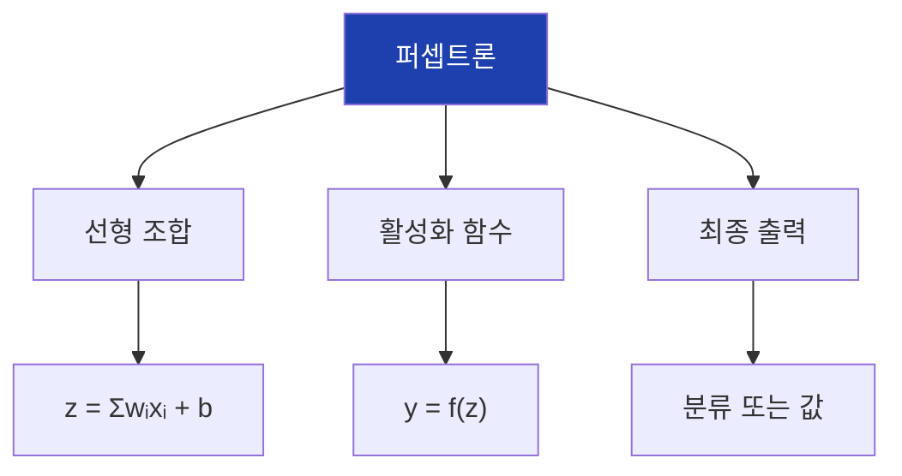

## 7. 가중치와 편향

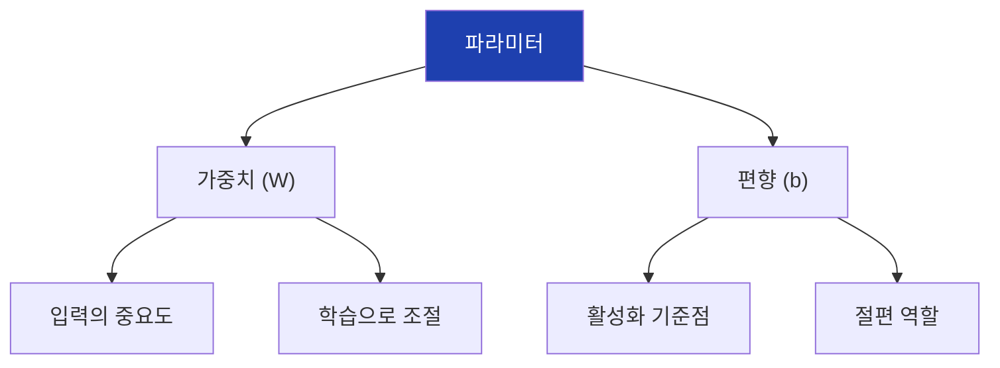

## 8. 활성화 함수 종류

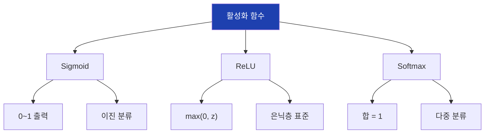

## 9. Sigmoid 함수

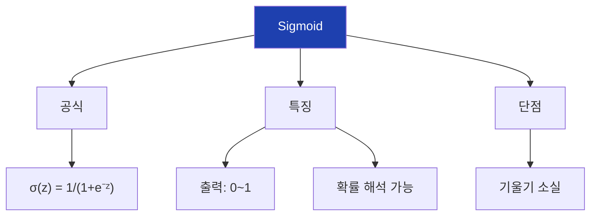

## 10. ReLU 함수

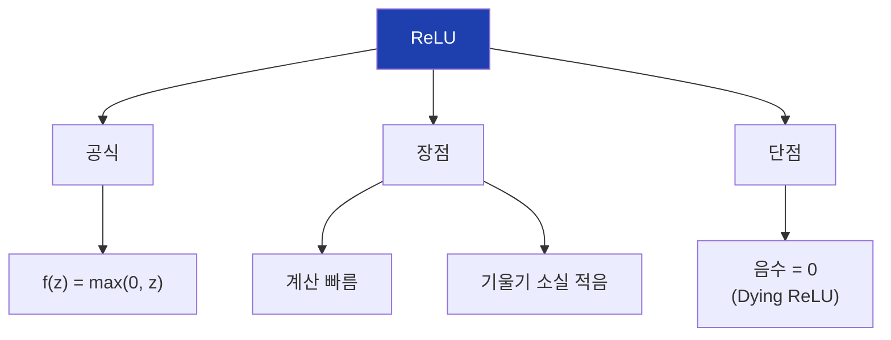

## 11. Tanh 함수

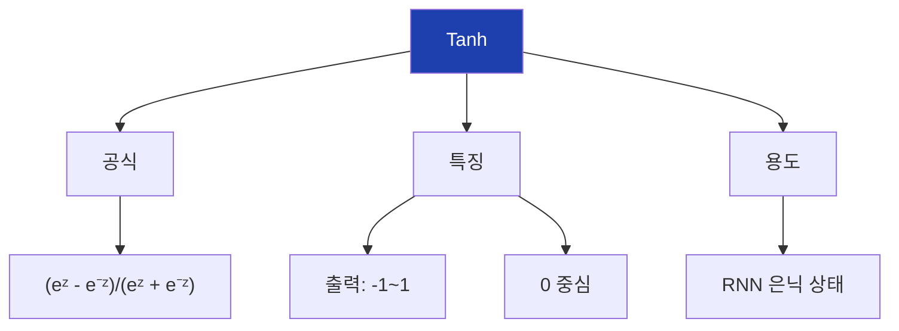

## 12. Softmax 함수

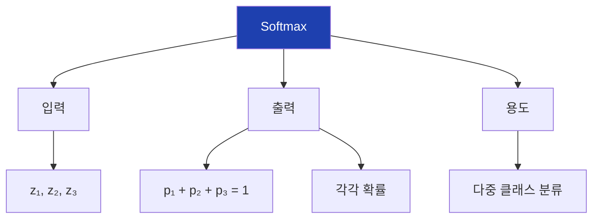

## 13. 활성화 함수 선택

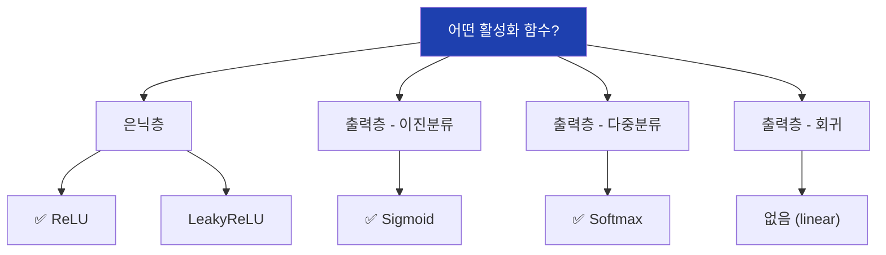

## 14. 신경망 층 구조

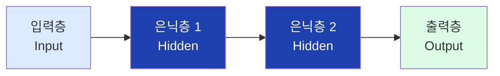

## 15. 입력층

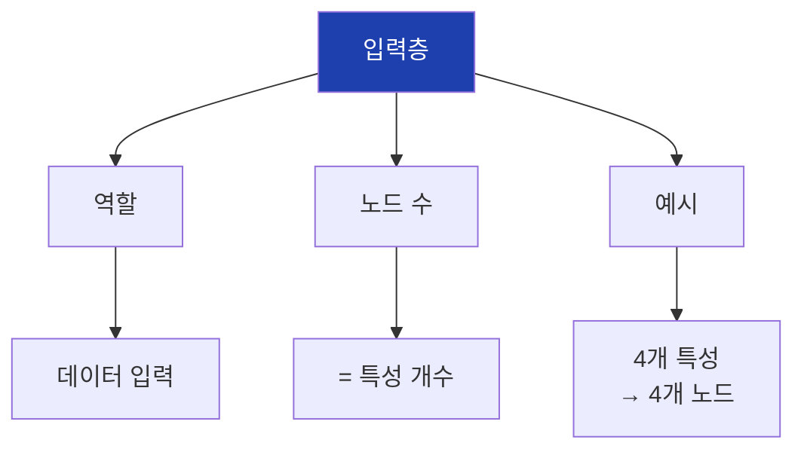

## 16. 은닉층

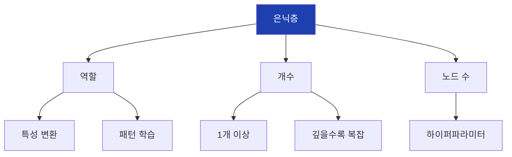

## 17. 출력층

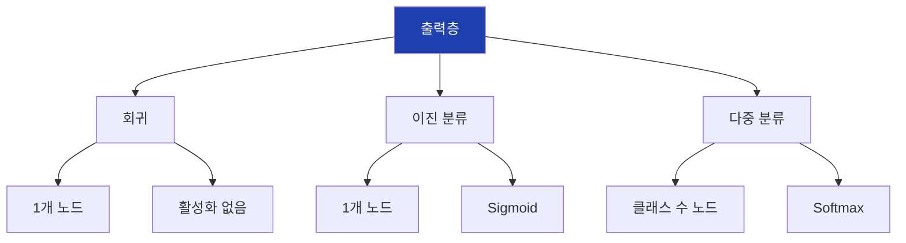

## 18. MLP 구조 예시

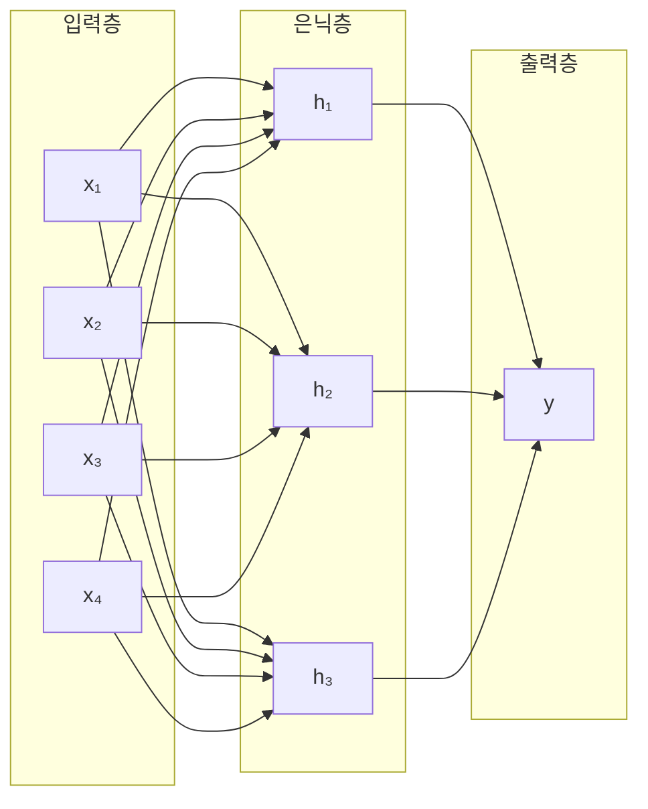

## 19. 파라미터 수 계산

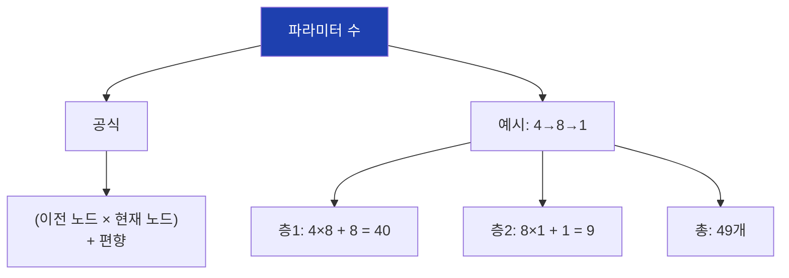

## 20. 깊은 신경망

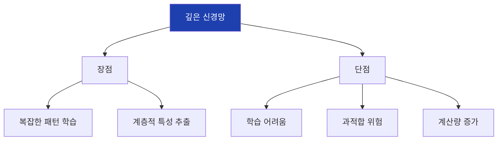

## 21. 순전파 개념

```mermaid
flowchart LR
    A["입력 X"]
    B["층 1"]
    C["층 2"]
    D["출력 ŷ"]

    A --> |"W₁, b₁"| B
    B --> |"활성화"| B
    B --> |"W₂, b₂"| C
    C --> |"활성화"| D

    style A fill:#dbeafe
    style D fill:#dcfce7
```

## 22. 순전파 수식

```mermaid
flowchart TD
    A["순전파 계산"]

    A --> B["층 1"]
    B --> B1["z₁ = X·W₁ + b₁"]
    B --> B2["a₁ = ReLU(z₁)"]

    A --> C["층 2"]
    C --> C1["z₂ = a₁·W₂ + b₂"]
    C --> C2["ŷ = Sigmoid(z₂)"]

    style A fill:#1e40af,color:#fff
```

## 23. 손실 함수 종류

```mermaid
flowchart TD
    A["손실 함수"]

    A --> B["회귀"]
    B --> B1["MSE"]
    B --> B2["MAE"]

    A --> C["이진 분류"]
    C --> C1["Binary<br>Cross-Entropy"]

    A --> D["다중 분류"]
    D --> D1["Categorical<br>Cross-Entropy"]

    style A fill:#1e40af,color:#fff
```

## 24. MSE 손실

```mermaid
flowchart TD
    A["MSE"]

    A --> B["공식"]
    B --> B1["L = (1/n)Σ(y-ŷ)²"]

    A --> C["특징"]
    C --> C1["제곱으로 패널티"]
    C --> C2["미분 가능"]

    A --> D["용도"]
    D --> D1["회귀 문제"]

    style A fill:#1e40af,color:#fff
```

## 25. Cross-Entropy 손실

```mermaid
flowchart TD
    A["Cross-Entropy"]

    A --> B["이진"]
    B --> B1["-[y·log(ŷ) +<br>(1-y)·log(1-ŷ)]"]

    A --> C["다중"]
    C --> C1["-Σyᵢ·log(ŷᵢ)"]

    A --> D["특징"]
    D --> D1["확률 분포 비교"]

    style A fill:#1e40af,color:#fff
```

## 26. 역전파 개념

```mermaid
flowchart RL
    A["출력층"]
    B["은닉층"]
    C["입력층"]

    A --> |"∂L/∂W₂"| B
    B --> |"∂L/∂W₁"| C

    A --> A1["손실 계산"]
    B --> B1["기울기 전파"]

    style A fill:#fecaca
```

## 27. 역전파 흐름

```mermaid
flowchart TD
    A["1. 순전파"]
    B["2. 손실 계산"]
    C["3. 기울기 계산<br>(역전파)"]
    D["4. 가중치 업데이트"]
    E["5. 반복"]

    A --> B --> C --> D --> E
    E --> |"에포크 반복"| A

    style C fill:#1e40af,color:#fff
```

## 28. 연쇄 법칙

```mermaid
flowchart TD
    A["연쇄 법칙"]

    A --> B["핵심"]
    B --> B1["∂L/∂w = ∂L/∂a · ∂a/∂z · ∂z/∂w"]

    A --> C["역할"]
    C --> C1["깊은 층의 기울기 계산"]

    A --> D["구현"]
    D --> D1["출력→입력 방향"]

    style A fill:#1e40af,color:#fff
```

## 29. 경사하강법

```mermaid
flowchart TD
    A["경사하강법"]

    A --> B["아이디어"]
    B --> B1["기울기 반대 방향으로<br>조금씩 이동"]

    A --> C["수식"]
    C --> C1["W = W - η·∂L/∂W"]

    A --> D["η (학습률)"]
    D --> D1["이동 폭 조절"]

    style A fill:#1e40af,color:#fff
```

## 30. 학습률 영향

```mermaid
flowchart TD
    A["학습률"]

    A --> B["너무 큼"]
    B --> B1["발산"]
    B --> B2["최적점 지나침"]

    A --> C["적절함"]
    C --> C1["안정적 수렴"]

    A --> D["너무 작음"]
    D --> D1["학습 느림"]
    D --> D2["지역 최소점"]

    style C fill:#dcfce7
    style B fill:#fecaca
    style D fill:#fef3c7
```

## 31. 옵티마이저 종류

```mermaid
flowchart TD
    A["옵티마이저"]

    A --> B["SGD"]
    B --> B1["기본 경사하강법"]

    A --> C["Momentum"]
    C --> C1["관성 추가"]

    A --> D["Adam"]
    D --> D1["✅ 가장 많이 사용"]
    D --> D2["적응적 학습률"]

    style A fill:#1e40af,color:#fff
    style D fill:#dcfce7
```

## 32. 에포크와 배치

```mermaid
flowchart TD
    A["학습 단위"]

    A --> B["에포크"]
    B --> B1["전체 데이터 1회 학습"]

    A --> C["배치"]
    C --> C1["한 번에 학습하는<br>데이터 개수"]

    A --> D["반복"]
    D --> D1["배치 수 = 데이터 / 배치 크기"]

    style A fill:#1e40af,color:#fff
```

## 33. 배치 크기 영향

```mermaid
flowchart TD
    A["배치 크기"]

    A --> B["작음 (32)"]
    B --> B1["잦은 업데이트"]
    B --> B2["노이즈 많음"]
    B --> B3["일반화 좋음"]

    A --> C["큼 (256)"]
    C --> C1["안정적 업데이트"]
    C --> C2["메모리 많이 필요"]
    C --> C3["빠른 학습"]

    style A fill:#1e40af,color:#fff
```

## 34. 학습 과정 시각화

```mermaid
flowchart TD
    A["학습 시작"]
    B["높은 손실"]
    C["손실 감소"]
    D["수렴"]
    E["학습 완료"]

    A --> B --> C --> D --> E

    style A fill:#dbeafe
    style E fill:#dcfce7
```

## 35. XOR 문제

```mermaid
flowchart TD
    A["XOR 문제"]

    A --> B["입력"]
    B --> B1["(0,0)→0"]
    B --> B2["(0,1)→1"]
    B --> B3["(1,0)→1"]
    B --> B4["(1,1)→0"]

    A --> C["특징"]
    C --> C1["선형 분리 불가"]
    C --> C2["신경망으로 해결"]

    style A fill:#1e40af,color:#fff
```

## 36. XOR 신경망 구조

```mermaid
flowchart LR
    subgraph 입력
        I1["x₁"]
        I2["x₂"]
    end

    subgraph 은닉
        H1["h₁"]
        H2["h₂"]
    end

    subgraph 출력
        O["y"]
    end

    I1 & I2 --> H1 & H2
    H1 & H2 --> O
```

## 37. 기울기 소실

```mermaid
flowchart TD
    A["기울기 소실"]

    A --> B["문제"]
    B --> B1["깊은 층일수록<br>기울기가 0에 가까워짐"]

    A --> C["원인"]
    C --> C1["Sigmoid/Tanh<br>기울기 최대 0.25"]

    A --> D["해결"]
    D --> D1["ReLU 사용"]
    D --> D2["배치 정규화"]

    style A fill:#fecaca
```

## 38. 과적합 방지

```mermaid
flowchart TD
    A["과적합 방지"]

    A --> B["드롭아웃"]
    B --> B1["무작위 노드 끄기"]

    A --> C["조기 종료"]
    C --> C1["검증 손실<br>증가시 중단"]

    A --> D["정규화"]
    D --> D1["L2 가중치 규제"]

    style A fill:#1e40af,color:#fff
```

## 39. 실습 흐름

```mermaid
flowchart TD
    A["1. 활성화 함수 구현"]
    B["2. 순전파 구현"]
    C["3. 손실 계산"]
    D["4. 역전파 구현"]
    E["5. 학습 루프"]
    F["6. 결과 확인"]

    A --> B --> C --> D --> E --> F

    style A fill:#dbeafe
    style F fill:#dcfce7
```

## 40. 핵심 정리

```mermaid
flowchart TD
    A["20차시 핵심"]

    A --> B["인공 뉴런"]
    B --> B1["가중치×입력 + 편향<br>활성화 함수"]

    A --> C["신경망 구조"]
    C --> C1["입력→은닉→출력<br>파라미터 계산"]

    A --> D["학습"]
    D --> D1["순전파→손실→역전파<br>경사하강법"]

    style A fill:#1e40af,color:#fff
```

## 41. 다음 차시 연결

```mermaid
flowchart LR
    A["20차시<br>신경망 기초"]
    B["20차시<br>MLP 실습"]

    A --> B

    A --> A1["원리 이해"]
    B --> B1["Keras 구현"]
    B --> B2["품질 예측"]

    style A fill:#dbeafe
    style B fill:#dcfce7
```
