# [21차시] 딥러닝 실습: MLP로 품질 예측 - 다이어그램

## 1. 학습 흐름

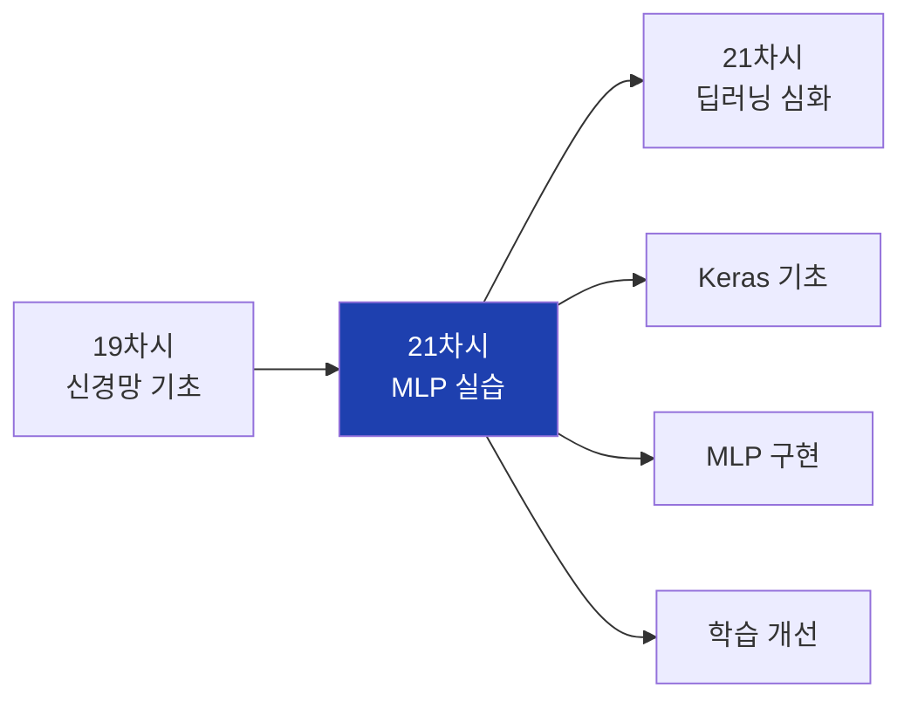

## 2. 대주제 구조

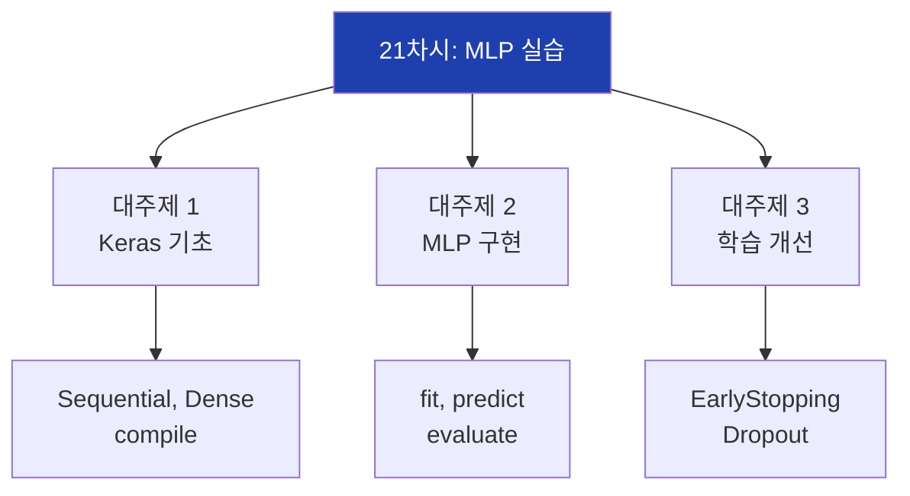

## 3. NumPy vs Keras 비교

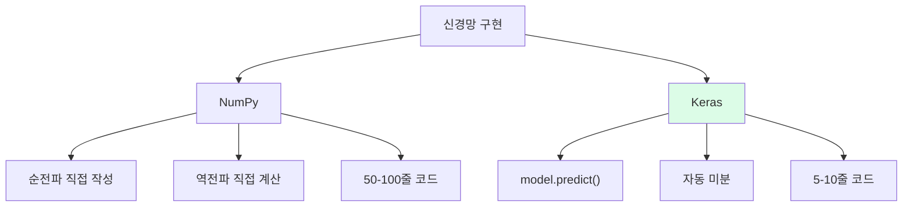

## 4. Sequential 모델 구조

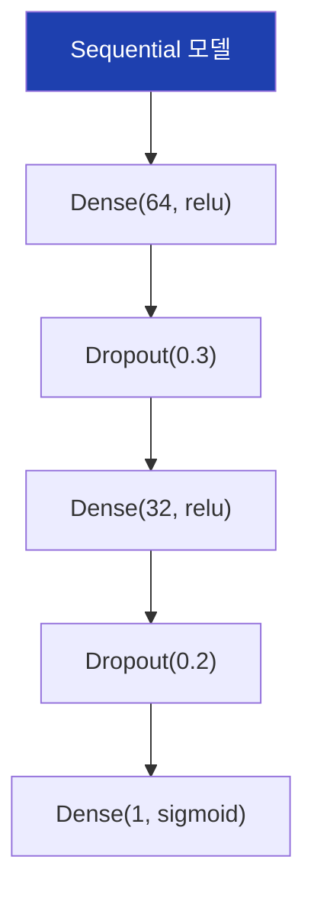

## 5. Dense 층 파라미터

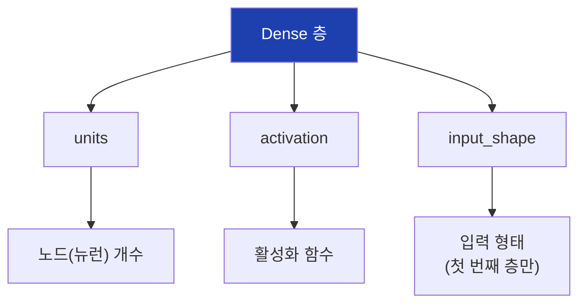

## 6. 활성화 함수 선택

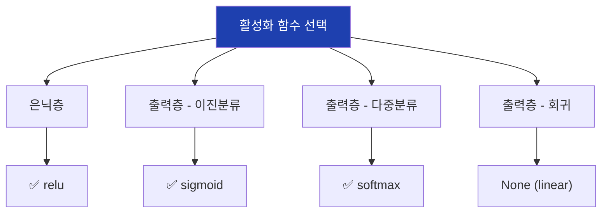

## 7. 모델 컴파일 설정

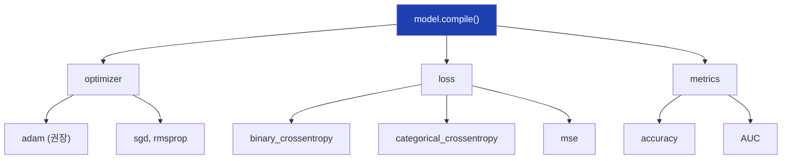

## 8. 손실 함수 선택

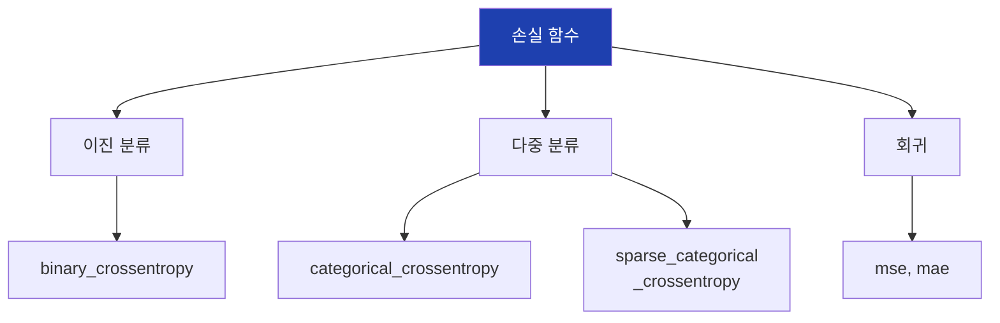

## 9. 옵티마이저 비교

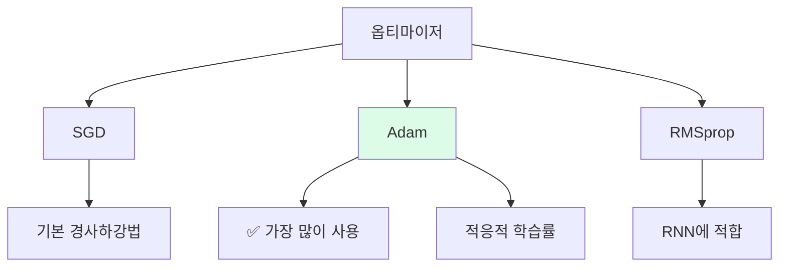

## 10. fit 파라미터

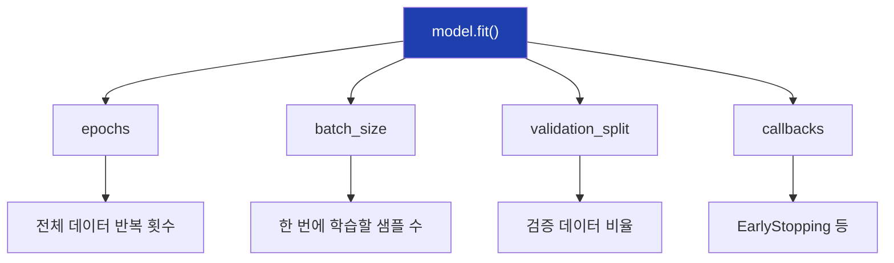

## 11. 배치 크기 영향

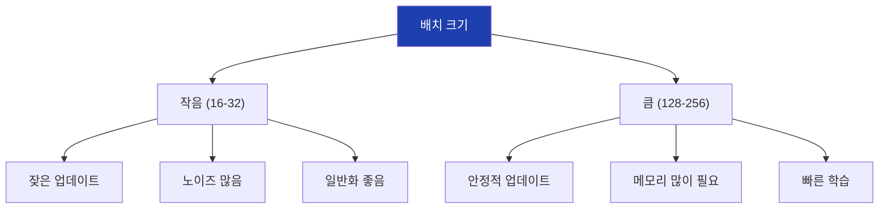

## 12. Keras 워크플로우

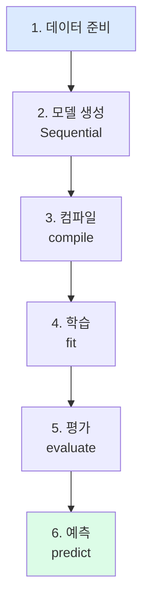

## 13. 데이터 전처리

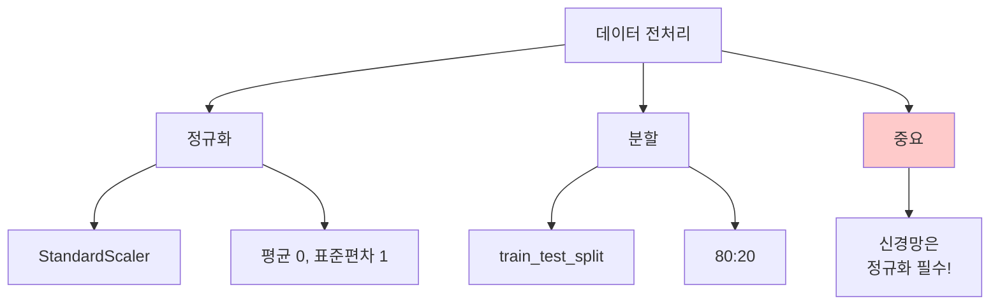

## 14. Dropout 동작

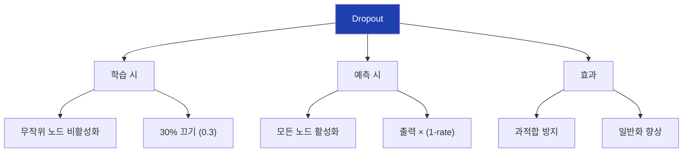

## 15. 학습 곡선 패턴

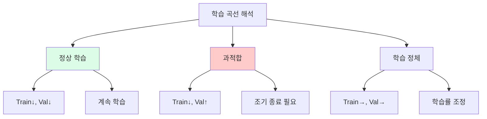

## 16. EarlyStopping 동작

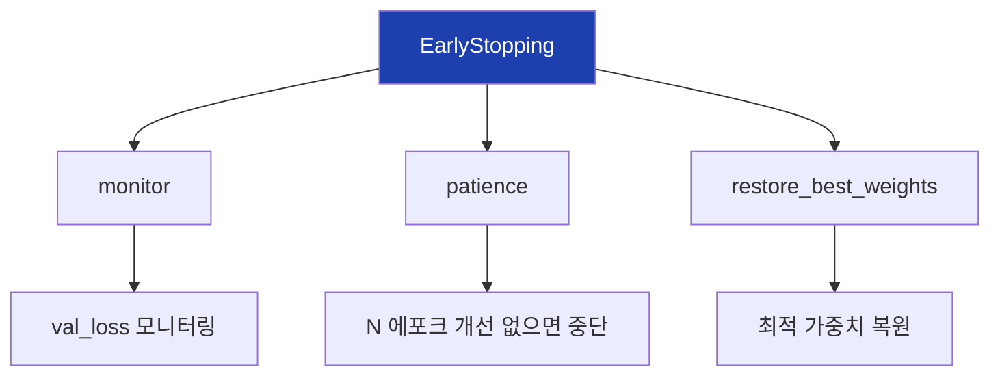

## 17. EarlyStopping 예시

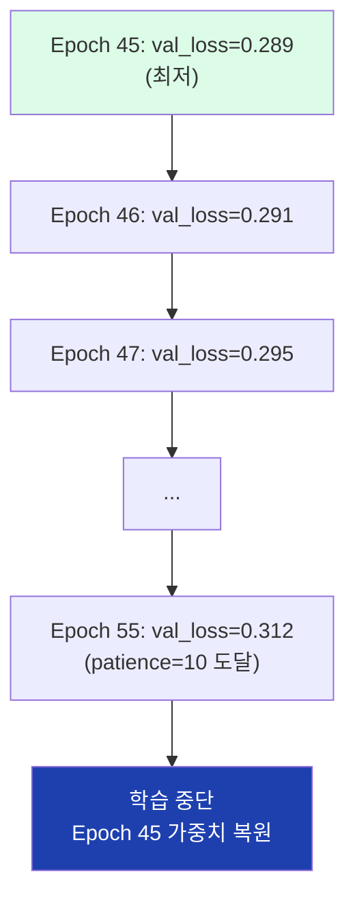

## 18. 콜백 종류

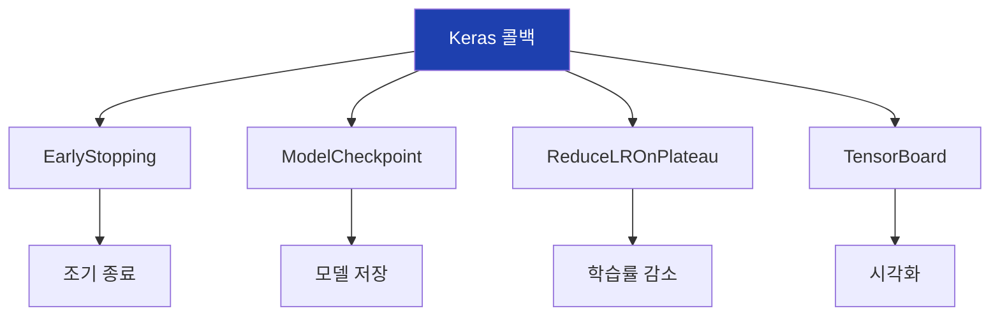

## 19. ModelCheckpoint

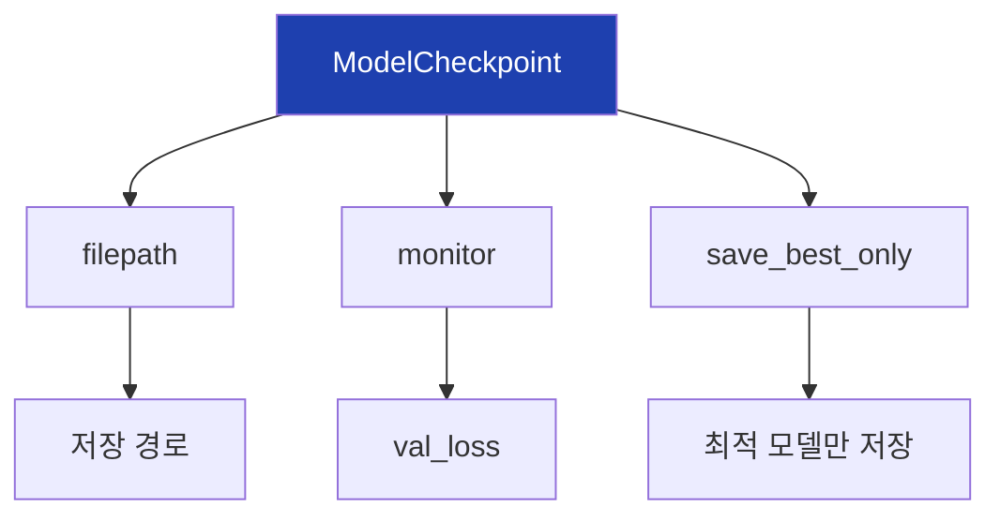

## 20. 모델 저장/로드

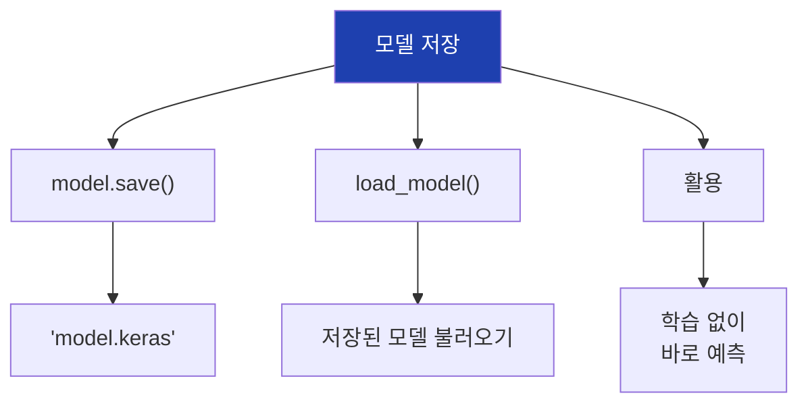

## 21. BatchNormalization

```mermaid
flowchart TD
    A["BatchNormalization"]

    A --> B["역할"]
    B --> B1["각 층 출력 정규화"]

    A --> C["장점"]
    C --> C1["학습 안정화"]
    C --> C2["빠른 수렴"]
    C --> C3["높은 학습률 가능"]

    A --> D["위치"]
    D --> D1["Dense 뒤, Dropout 앞"]

    style A fill:#1e40af,color:#fff
```

## 22. L2 정규화

```mermaid
flowchart TD
    A["L2 정규화"]

    A --> B["kernel_regularizer"]
    B --> B1["l2(0.01)"]

    A --> C["효과"]
    C --> C1["가중치 크기 제한"]
    C --> C2["과적합 방지"]

    A --> D["손실 함수"]
    D --> D1["Loss + λ×Σw²"]

    style A fill:#1e40af,color:#fff
```

## 23. 과적합 해결책

```mermaid
flowchart TD
    A["과적합 해결"]

    A --> B["Dropout"]
    B --> B1["무작위 노드 비활성화"]

    A --> C["EarlyStopping"]
    C --> C1["적절한 시점 종료"]

    A --> D["L2 정규화"]
    D --> D1["가중치 크기 제한"]

    A --> E["데이터 증강"]
    E --> E1["데이터 늘리기"]

    style A fill:#1e40af,color:#fff
```

## 24. 학습률 조정

```mermaid
flowchart TD
    A["학습률"]

    A --> B["기본값"]
    B --> B1["Adam: 0.001"]

    A --> C["조정"]
    C --> C1["더 작게: 0.0001"]
    C --> C2["더 크게: 0.01"]

    A --> D["ReduceLROnPlateau"]
    D --> D1["자동 감소"]

    style A fill:#1e40af,color:#fff
```

## 25. ReduceLROnPlateau

```mermaid
flowchart TD
    A["ReduceLROnPlateau"]

    A --> B["monitor"]
    B --> B1["val_loss"]

    A --> C["factor"]
    C --> C1["0.5 (절반으로)"]

    A --> D["patience"]
    D --> D1["개선 없을 때 대기"]

    A --> E["min_lr"]
    E --> E1["최소 학습률"]

    style A fill:#1e40af,color:#fff
```

## 26. 하이퍼파라미터 튜닝

```mermaid
flowchart TD
    A["하이퍼파라미터"]

    A --> B["구조"]
    B --> B1["은닉층 수: 1-3"]
    B --> B2["노드 수: 32-256"]

    A --> C["정규화"]
    C --> C1["Dropout: 0.1-0.5"]

    A --> D["학습"]
    D --> D1["학습률: 0.0001-0.01"]
    D --> D2["배치: 16-128"]

    style A fill:#1e40af,color:#fff
```

## 27. 평가 지표

```mermaid
flowchart TD
    A["평가 지표"]

    A --> B["accuracy"]
    B --> B1["정확도"]

    A --> C["precision/recall"]
    C --> C1["정밀도/재현율"]

    A --> D["AUC"]
    D --> D1["ROC 곡선 아래 면적"]

    A --> E["F1-score"]
    E --> E1["정밀도×재현율 조화평균"]

    style A fill:#1e40af,color:#fff
```

## 28. 예측과 평가

```mermaid
flowchart TD
    A["모델 사용"]

    A --> B["predict"]
    B --> B1["확률 예측"]
    B --> B2["(y_prob > 0.5)"]

    A --> C["evaluate"]
    C --> C1["손실 + 지표 반환"]

    A --> D["classification_report"]
    D --> D1["상세 분류 보고서"]

    style A fill:#1e40af,color:#fff
```

## 29. ML vs DL 비교

```mermaid
flowchart TD
    A["모델 선택"]

    A --> B["RandomForest"]
    B --> B1["정형 데이터"]
    B --> B2["해석 필요"]
    B --> B3["데이터 적음"]

    A --> C["MLP (DL)"]
    C --> C1["복잡한 패턴"]
    C --> C2["대용량 데이터"]
    C --> C3["GPU 활용"]

    style A fill:#1e40af,color:#fff
```

## 30. 딥러닝 적합 상황

```mermaid
flowchart TD
    A["딥러닝이 유리"]

    A --> B["이미지/자연어"]
    A --> C["복잡한 비선형 패턴"]
    A --> D["대용량 데이터"]

    E["머신러닝이 유리"]
    E --> F["정형 데이터"]
    E --> G["해석 중요"]
    E --> H["데이터 적음"]

    style A fill:#1e40af,color:#fff
    style E fill:#059669,color:#fff
```

## 31. 실습 흐름

```mermaid
flowchart TD
    A["1. 데이터 생성"]
    B["2. 전처리<br>(정규화, 분할)"]
    C["3. 모델 생성<br>(Sequential)"]
    D["4. 컴파일"]
    E["5. 학습 (fit)"]
    F["6. 평가 (evaluate)"]
    G["7. 시각화"]

    A --> B --> C --> D --> E --> F --> G

    style A fill:#dbeafe
    style G fill:#dcfce7
```

## 32. 완전한 코드 구조

```mermaid
flowchart TD
    A["임포트"]
    B["데이터 준비"]
    C["Sequential 모델"]
    D["Dense + Dropout"]
    E["compile"]
    F["callbacks 설정"]
    G["fit"]
    H["evaluate"]
    I["save"]

    A --> B --> C --> D --> E --> F --> G --> H --> I

    style A fill:#dbeafe
    style I fill:#dcfce7
```

## 33. 파라미터 수 계산

```mermaid
flowchart TD
    A["파라미터 수"]

    A --> B["입력(4) → Dense(64)"]
    B --> B1["4×64 + 64 = 320"]

    A --> C["Dense(64) → Dense(32)"]
    C --> C1["64×32 + 32 = 2,080"]

    A --> D["Dense(32) → Dense(1)"]
    D --> D1["32×1 + 1 = 33"]

    A --> E["총계: 2,433"]

    style A fill:#1e40af,color:#fff
```

## 34. 핵심 정리

```mermaid
flowchart TD
    A["21차시 핵심"]

    A --> B["Keras 기초"]
    B --> B1["Sequential<br>Dense, Dropout"]

    A --> C["학습 과정"]
    C --> C1["compile → fit<br>→ evaluate"]

    A --> D["개선 기법"]
    D --> D1["EarlyStopping<br>BatchNormalization"]

    style A fill:#1e40af,color:#fff
```

## 35. 다음 차시 연결

```mermaid
flowchart LR
    A["21차시<br>MLP 실습"]
    B["21차시<br>딥러닝 심화"]

    A --> B

    A --> A1["Dense 층"]
    B --> B1["CNN (이미지)"]
    B --> B2["RNN (시계열)"]

    style A fill:#dbeafe
    style B fill:#dcfce7
```
