# [22차시] 딥러닝 심화 - 다이어그램

## 1. 학습 흐름

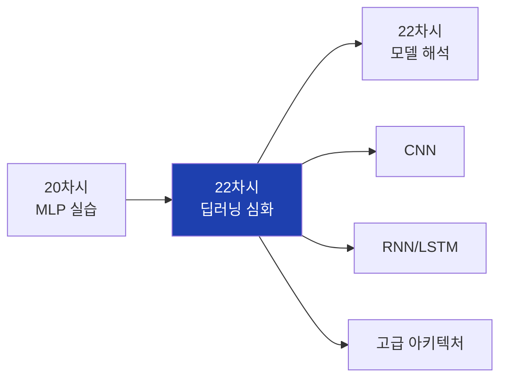

## 2. 대주제 구조

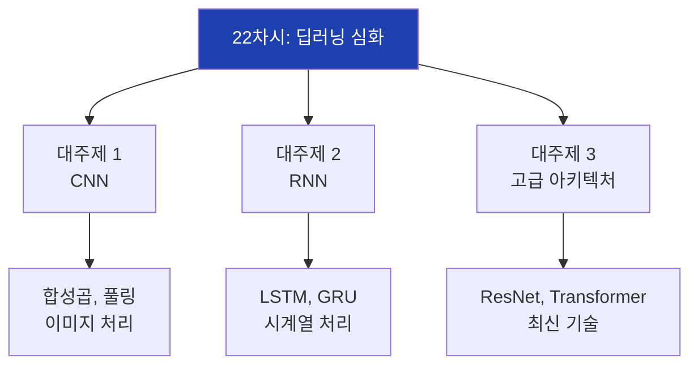

## 3. 딥러닝 아키텍처 분류

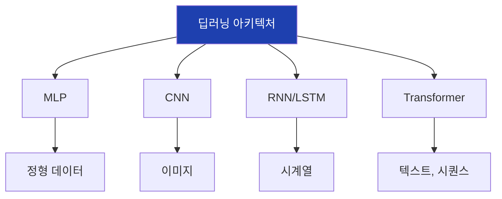

## 4. CNN 전체 구조

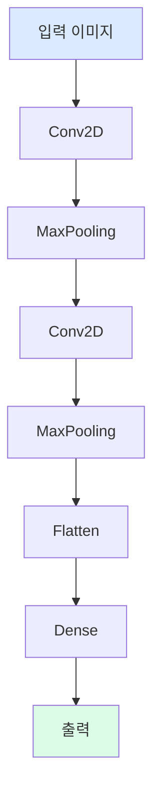

## 5. 합성곱 연산

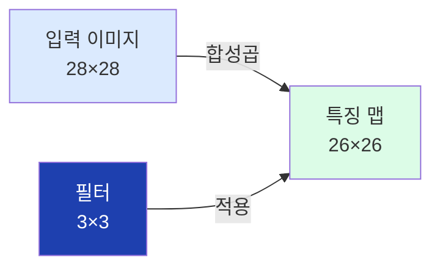

## 6. 필터 종류

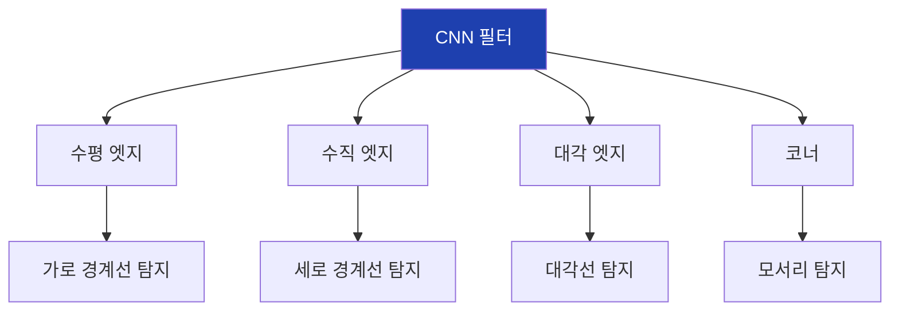

## 7. 풀링 연산

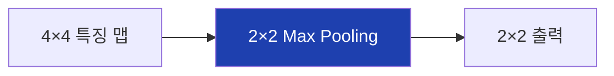

## 8. MaxPooling 효과

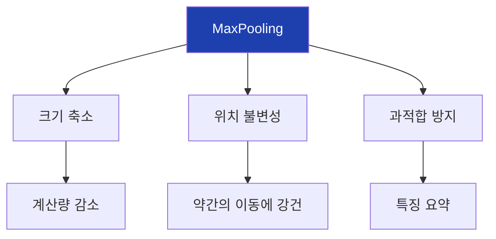

## 9. Conv2D 파라미터

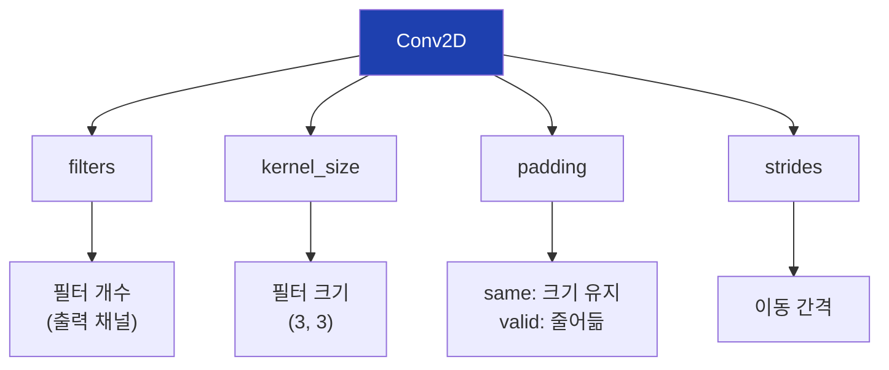

## 10. CNN 계층적 특징

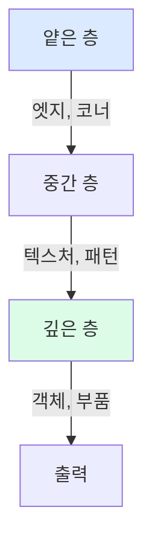

## 11. CNN 활용 분야

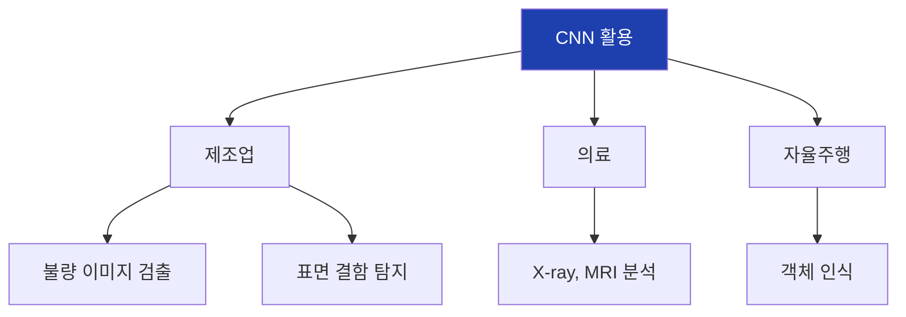

## 12. 전이학습

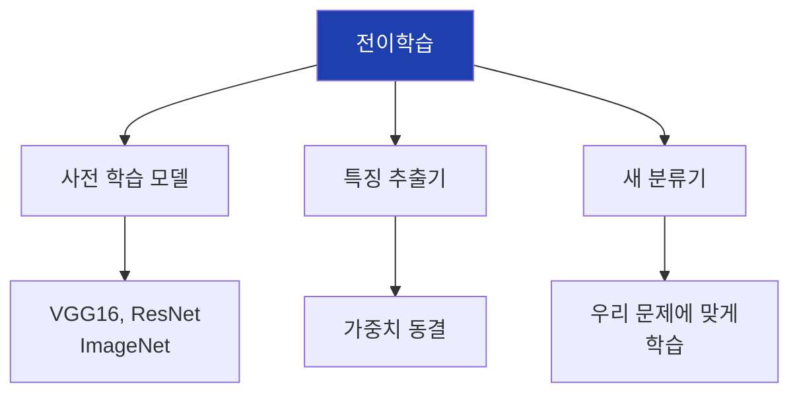

## 13. 전이학습 장점

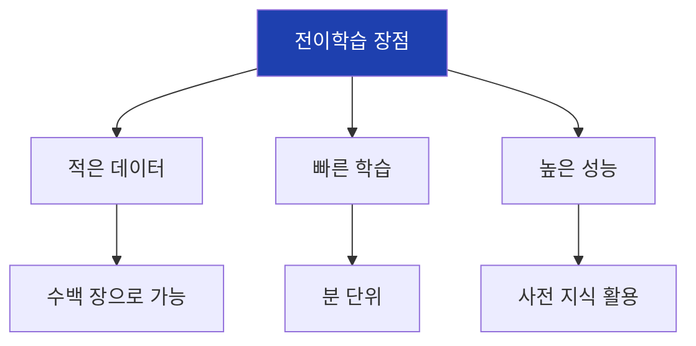

## 14. RNN 구조

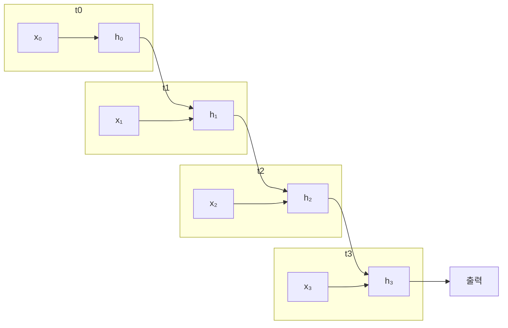

## 15. RNN 은닉 상태

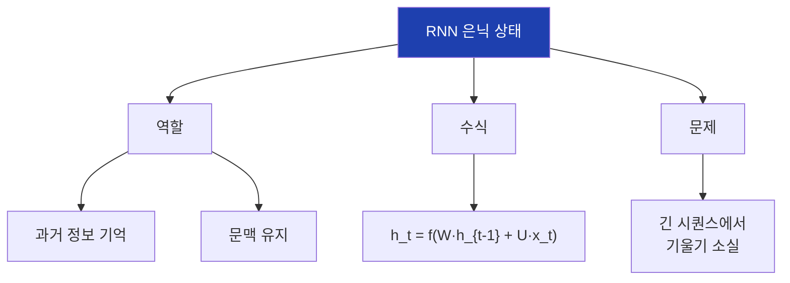

## 16. LSTM 구조

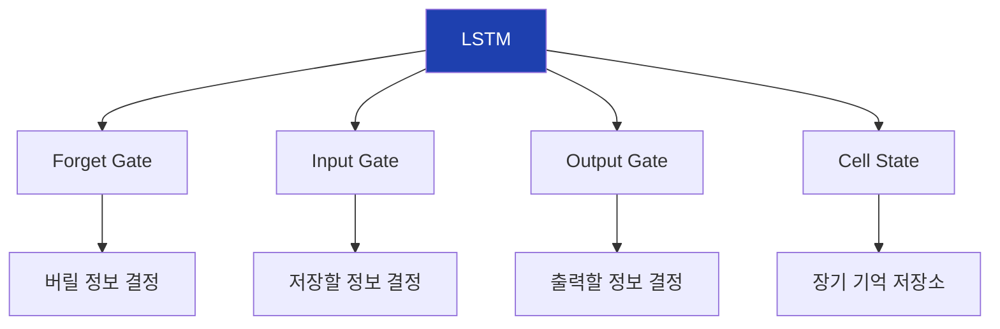

## 17. LSTM vs 기본 RNN

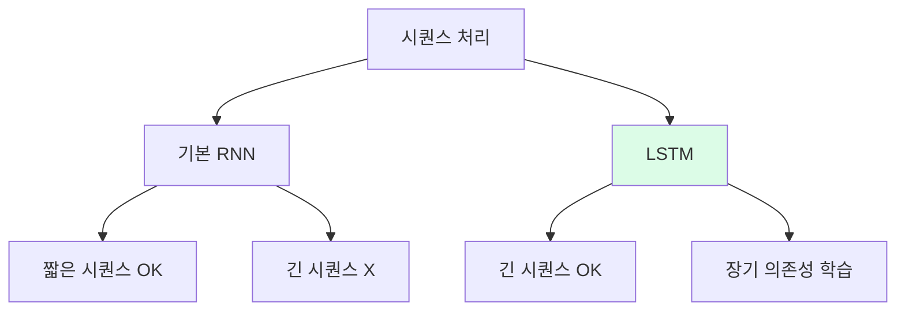

## 18. GRU 구조

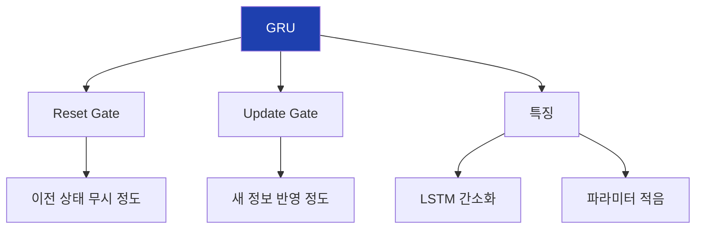

## 19. LSTM 파라미터

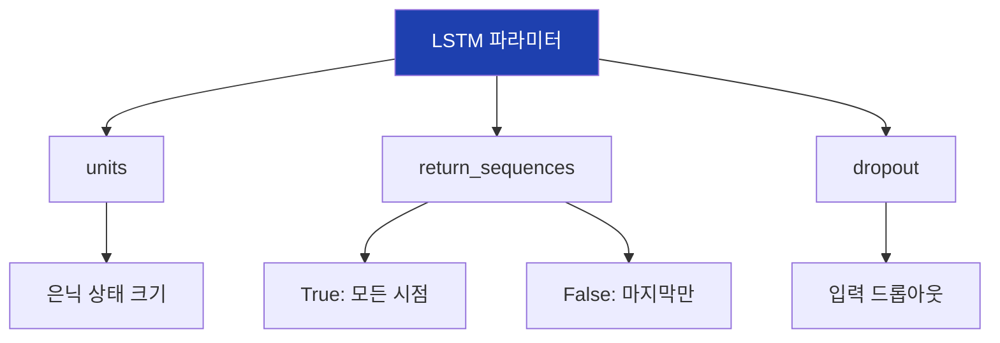

## 20. RNN 활용 분야

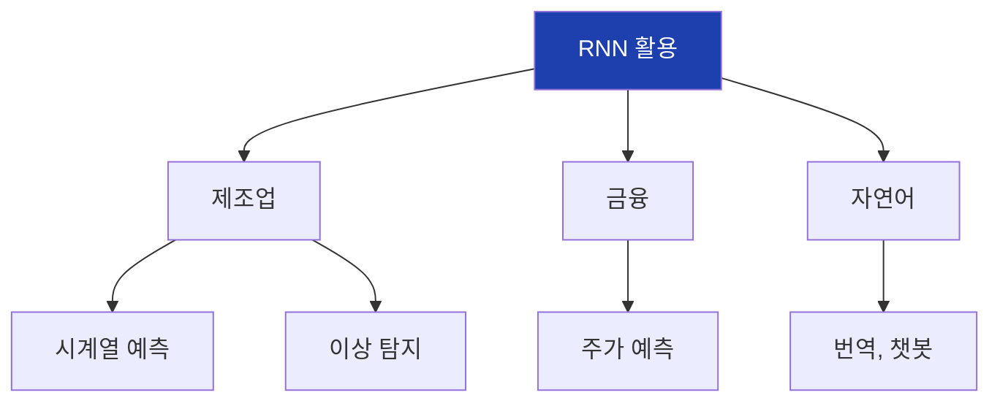

## 21. 시퀀스 데이터 변환

```mermaid
flowchart LR
    A["원본 시계열"]
    B["시퀀스 생성"]
    C["X: (samples, seq_len, features)"]
    D["y: 다음 값"]

    A --> B --> C
    B --> D

    style A fill:#dbeafe
    style C fill:#dcfce7
```

## 22. ResNet Skip Connection

```mermaid
flowchart TD
    A["입력 x"]
    B["Conv"]
    C["BN + ReLU"]
    D["Conv"]
    E["BN"]
    F["+ (덧셈)"]
    G["ReLU"]
    H["출력 y"]

    A --> B --> C --> D --> E --> F --> G --> H
    A --> |"Skip"| F

    style F fill:#1e40af,color:#fff
```

## 23. ResNet 효과

```mermaid
flowchart TD
    A["ResNet"]

    A --> B["문제 해결"]
    B --> B1["깊은 네트워크 학습 가능"]
    B --> B2["기울기 직접 전달"]

    A --> C["결과"]
    C --> C1["152층까지 학습"]
    C --> C2["ImageNet 우승"]

    style A fill:#1e40af,color:#fff
```

## 24. Attention 개념

```mermaid
flowchart TD
    A["Attention"]

    A --> B["아이디어"]
    B --> B1["중요한 부분에 집중"]

    A --> C["예시"]
    C --> C1["'먹었다' 예측 시<br>'사과를'에 집중"]

    A --> D["가중치"]
    D --> D1["동적으로 결정"]

    style A fill:#1e40af,color:#fff
```

## 25. Transformer 구조

```mermaid
flowchart TD
    A["입력 임베딩"]
    B["Self-Attention"]
    C["Feed-Forward"]
    D["반복 N번"]
    E["출력"]

    A --> B --> C --> D --> E

    style B fill:#1e40af,color:#fff
```

## 26. Transformer 특징

```mermaid
flowchart TD
    A["Transformer"]

    A --> B["RNN 없음"]
    B --> B1["Attention만 사용"]

    A --> C["병렬 처리"]
    C --> C1["빠른 학습"]

    A --> D["활용"]
    D --> D1["GPT, BERT 기반"]

    style A fill:#1e40af,color:#fff
```

## 27. 대형 언어 모델

```mermaid
flowchart TD
    A["LLM"]

    A --> B["GPT-3"]
    B --> B1["1,750억 파라미터"]

    A --> C["GPT-4"]
    C --> C1["멀티모달"]

    A --> D["LLaMA"]
    D --> D1["오픈소스"]

    style A fill:#1e40af,color:#fff
```

## 28. Diffusion 모델

```mermaid
flowchart LR
    A["노이즈"]
    B["노이즈 제거"]
    C["이미지"]

    A --> |"역과정 학습"| B
    B --> C

    style A fill:#dbeafe
    style C fill:#dcfce7
```

## 29. CNN 아키텍처 진화

```mermaid
flowchart TD
    A["1998: LeNet"]
    B["2012: AlexNet"]
    C["2014: VGG"]
    D["2015: ResNet"]
    E["2019: EfficientNet"]

    A --> B --> C --> D --> E

    style A fill:#dbeafe
    style E fill:#dcfce7
```

## 30. 아키텍처 선택 가이드

```mermaid
flowchart TD
    A["데이터 유형"]

    A --> B["정형 데이터"]
    B --> B1["MLP, ML"]

    A --> C["이미지"]
    C --> C1["CNN"]

    A --> D["시계열"]
    D --> D1["LSTM, GRU"]

    A --> E["텍스트"]
    E --> E1["Transformer"]

    style A fill:#1e40af,color:#fff
```

## 31. 제조업 딥러닝 로드맵

```mermaid
flowchart TD
    A["1단계: 정형 데이터"]
    B["2단계: 이미지"]
    C["3단계: 시계열"]
    D["4단계: 멀티모달"]

    A --> |"MLP"| B
    B --> |"CNN"| C
    C --> |"LSTM"| D

    A --> A1["센서 기반 예측 ✅"]
    B --> B1["불량 이미지 검출"]
    C --> C1["생산량 예측"]
    D --> D1["센서+이미지 통합"]

    style A fill:#dcfce7
```

## 32. 프레임워크 비교

```mermaid
flowchart TD
    A["딥러닝 프레임워크"]

    A --> B["TensorFlow/Keras"]
    B --> B1["산업 표준<br>배포 용이"]

    A --> C["PyTorch"]
    C --> C1["연구 표준<br>직관적"]

    A --> D["JAX"]
    D --> D1["고성능"]

    style A fill:#1e40af,color:#fff
```

## 33. Edge AI

```mermaid
flowchart TD
    A["Edge AI"]

    A --> B["개념"]
    B --> B1["기기에서 직접 AI 실행"]

    A --> C["장점"]
    C --> C1["실시간 처리"]
    C --> C2["네트워크 불필요"]
    C --> C3["데이터 보안"]

    style A fill:#1e40af,color:#fff
```

## 34. 핵심 정리

```mermaid
flowchart TD
    A["22차시 핵심"]

    A --> B["CNN"]
    B --> B1["이미지 특징 추출<br>전이학습"]

    A --> C["RNN/LSTM"]
    C --> C1["시계열 처리<br>장기 의존성"]

    A --> D["고급"]
    D --> D1["ResNet, Transformer<br>LLM, Diffusion"]

    style A fill:#1e40af,color:#fff
```

## 35. 다음 차시 연결

```mermaid
flowchart LR
    A["22차시<br>딥러닝 심화"]
    B["22차시<br>모델 해석"]

    A --> B

    A --> A1["CNN, RNN"]
    B --> B1["Feature Importance"]
    B --> B2["Permutation Importance"]

    style A fill:#dbeafe
    style B fill:#dcfce7
```
