# [23차시] 모델 해석과 변수별 영향력 분석 - 다이어그램

## 1. 학습 흐름

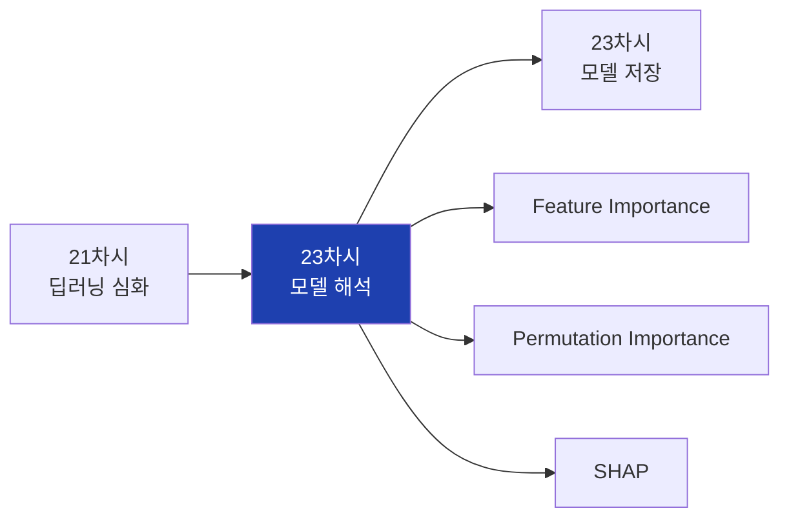

## 2. 대주제 구조

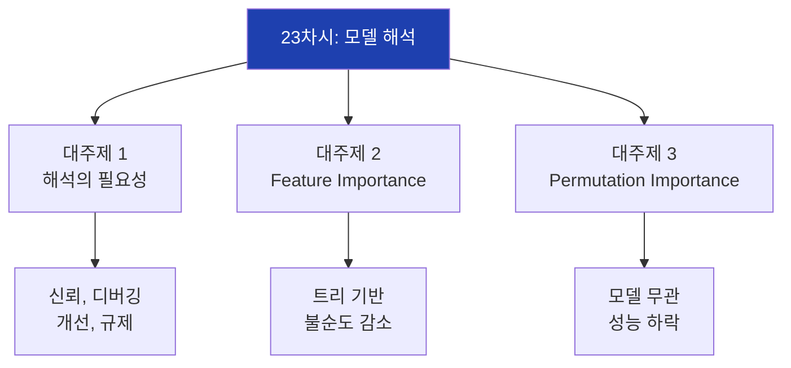

## 3. 블랙박스 문제

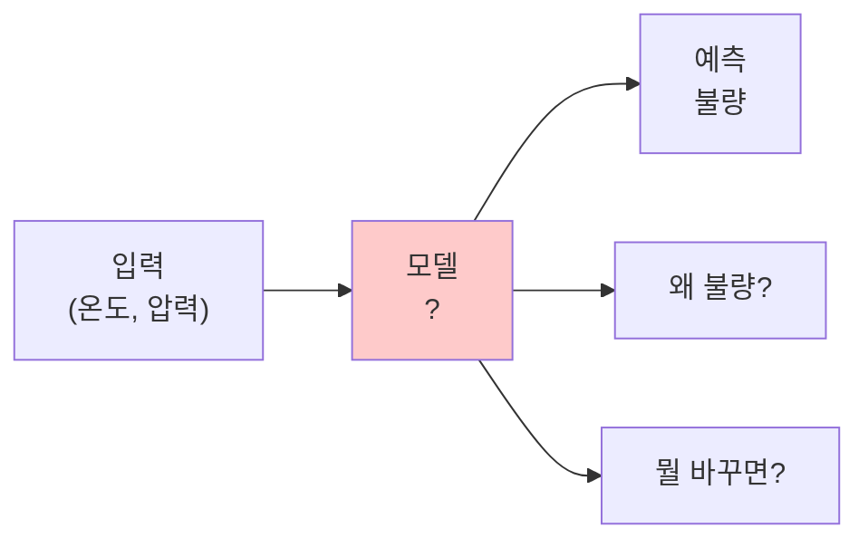

## 4. 모델 해석 필요성

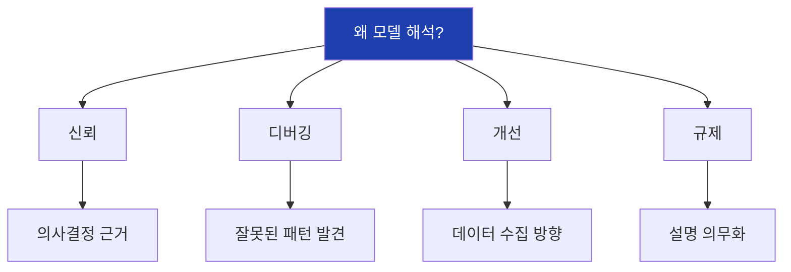

## 5. 해석 가능성 vs 성능

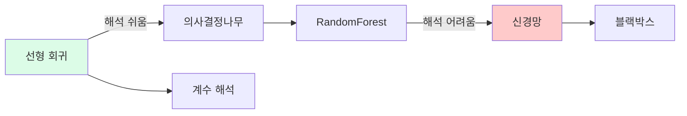

## 6. 전역 vs 지역 해석

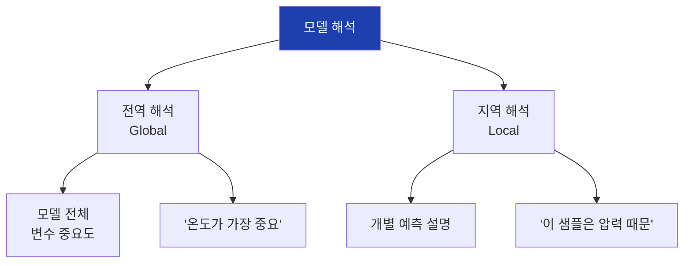

## 7. Feature Importance 원리

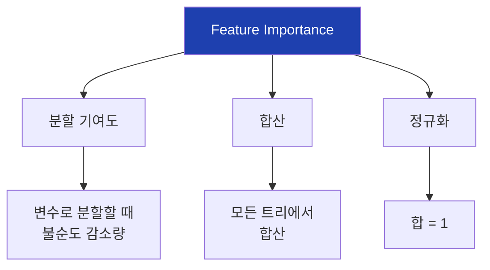

## 8. Feature Importance 예시

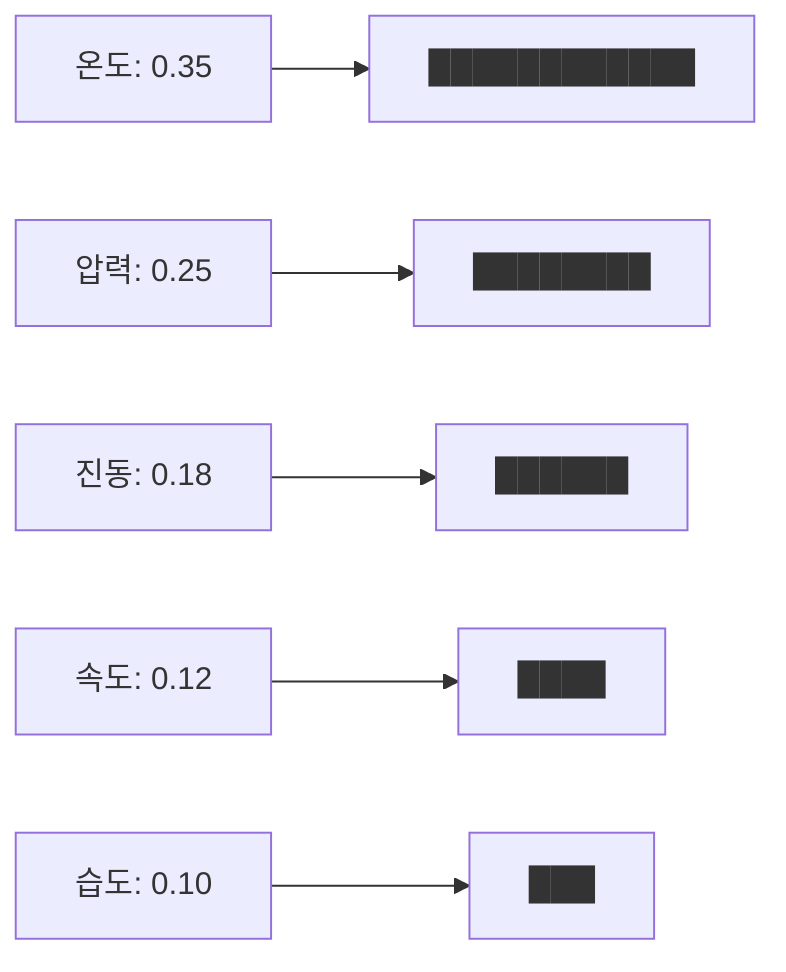

## 9. Feature Importance 활용

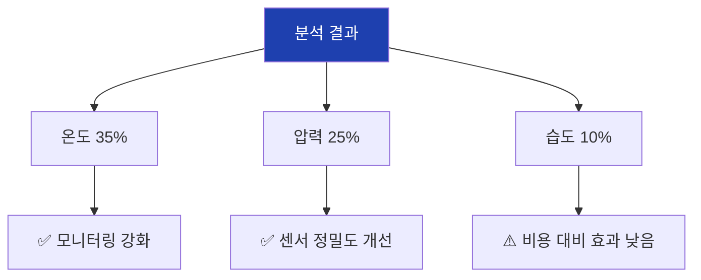

## 10. 상관 변수 문제

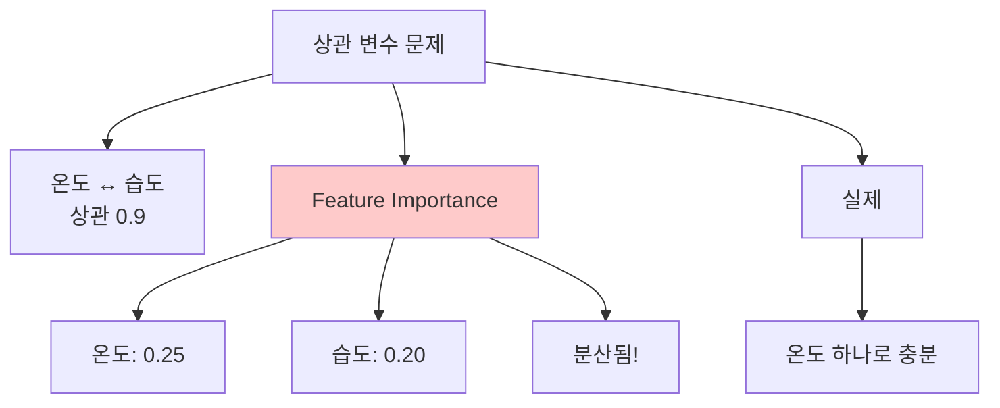

## 11. Permutation Importance 원리

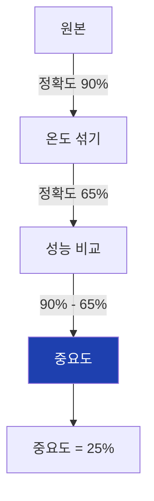

## 12. Permutation 과정

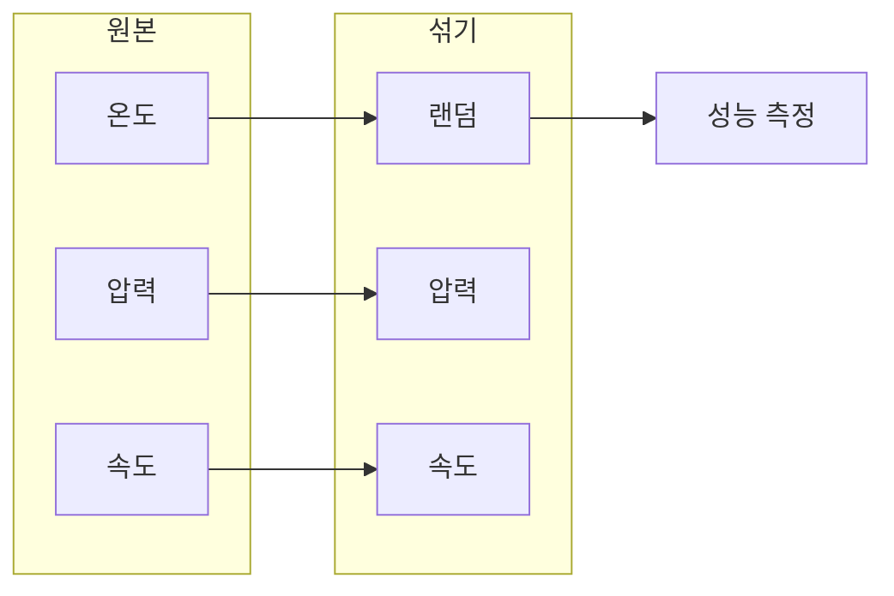

## 13. Permutation Importance 파라미터

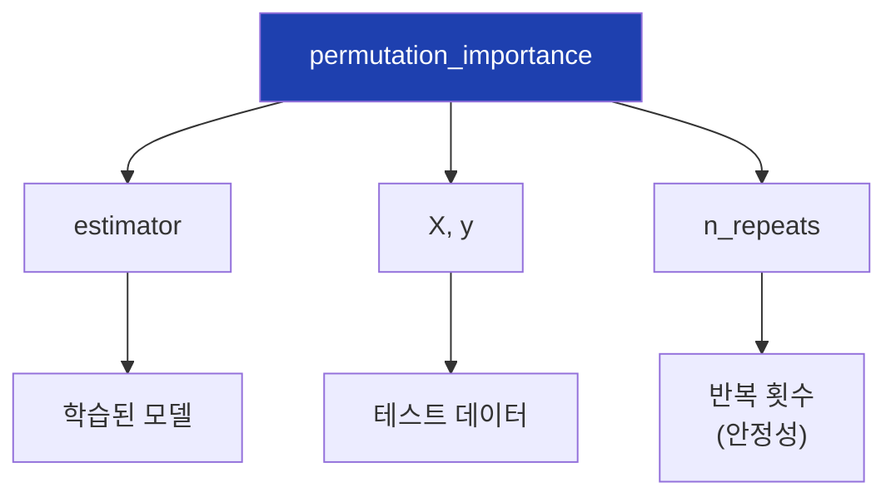

## 14. Feature vs Permutation

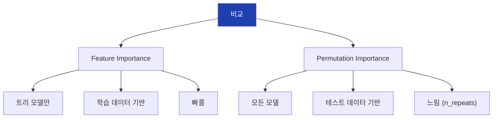

## 15. 두 방법 함께 사용

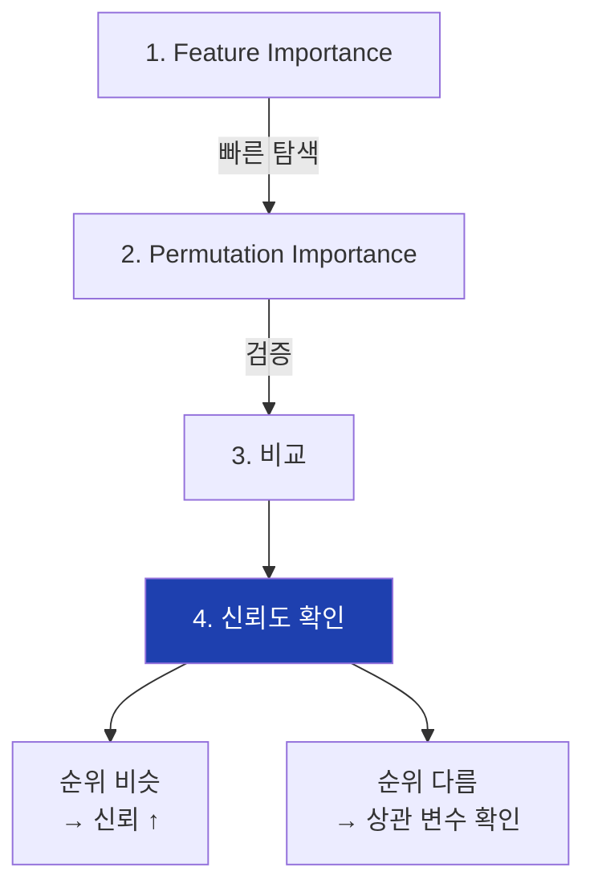

## 16. SHAP 개념

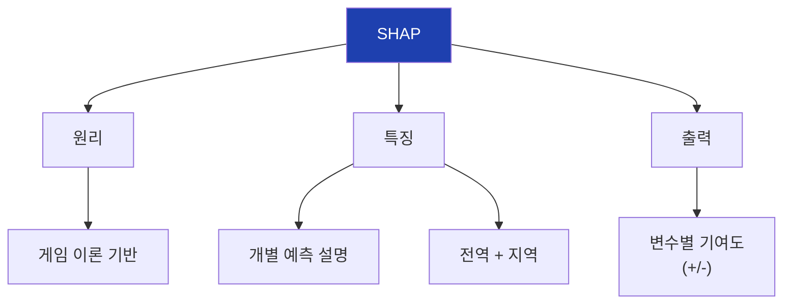

## 17. SHAP 예시

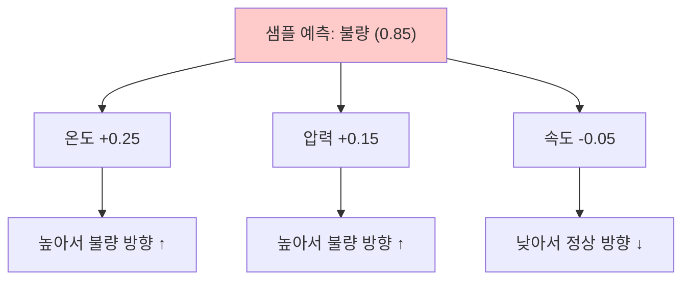

## 18. 모델 해석 워크플로우

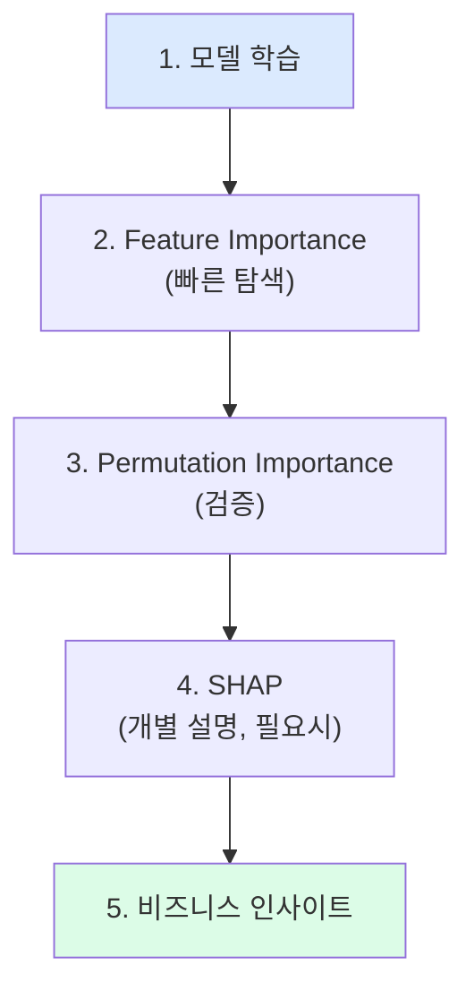

## 19. 비즈니스 활용

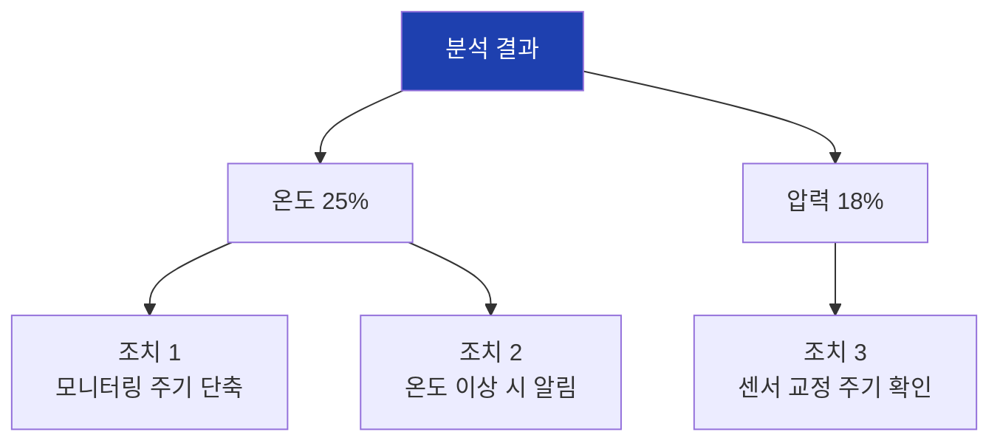

## 20. 실습 흐름

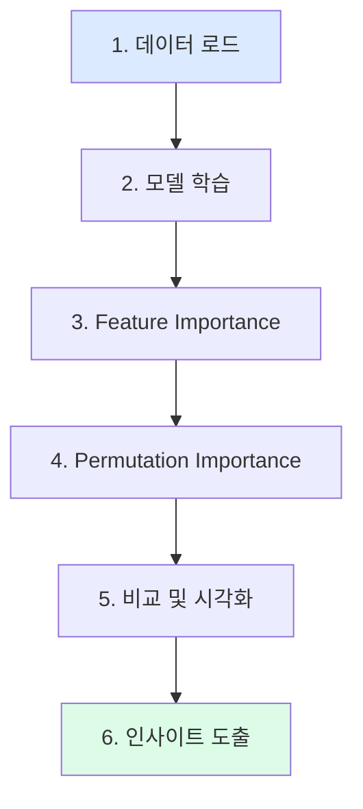

## 21. sklearn 함수

```mermaid
flowchart TD
    A["sklearn"]

    A --> B["model.feature_importances_"]
    B --> B1["트리 모델 내장"]

    A --> C["permutation_importance()"]
    C --> C1["모든 모델"]

    A --> D["result"]
    D --> D1[".importances_mean"]
    D --> D2[".importances_std"]

    style A fill:#1e40af,color:#fff
```

## 22. 핵심 정리

```mermaid
flowchart TD
    A["23차시 핵심"]

    A --> B["모델 해석"]
    B --> B1["신뢰, 디버깅<br>개선, 규제"]

    A --> C["Feature Importance"]
    C --> C1["트리 모델<br>빠름"]

    A --> D["Permutation Importance"]
    D --> D1["모든 모델<br>테스트 기반"]

    style A fill:#1e40af,color:#fff
```

## 23. 다음 차시 연결

```mermaid
flowchart LR
    A["23차시<br>모델 해석"]
    B["23차시<br>모델 저장"]

    A --> B

    A --> A1["변수 중요도"]
    B --> B1["joblib 저장"]
    B --> B2["Pipeline"]

    style A fill:#dbeafe
    style B fill:#dcfce7
```
