# [24차시] 모델 저장과 실무 배포 준비 - 다이어그램

## 1. 학습 흐름

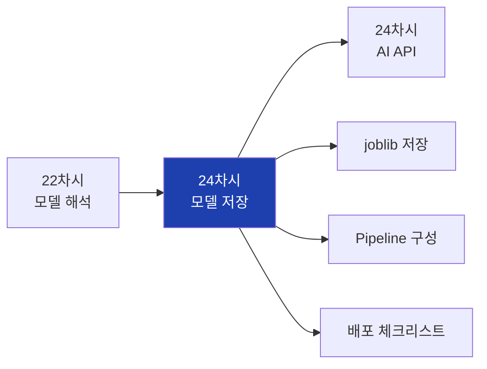

## 2. 대주제 구조

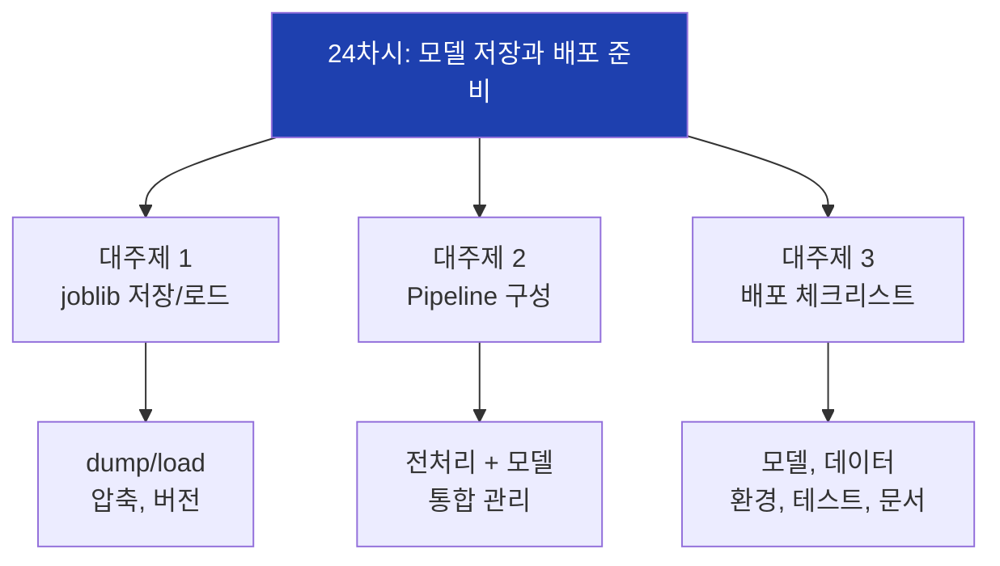

## 3. 모델 저장의 필요성

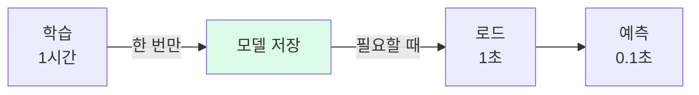

## 4. 저장 방법 비교

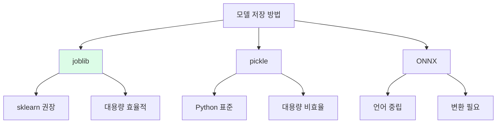

## 5. joblib 저장 과정

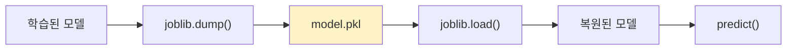

## 6. 압축 옵션

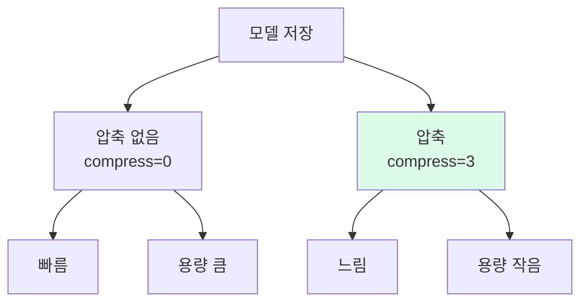

## 7. 버전 관리 중요성

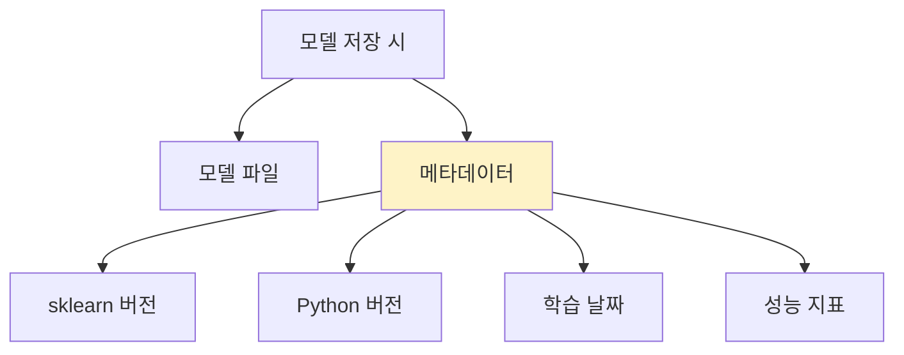

## 8. 전처리 없이 모델만 저장할 때 문제

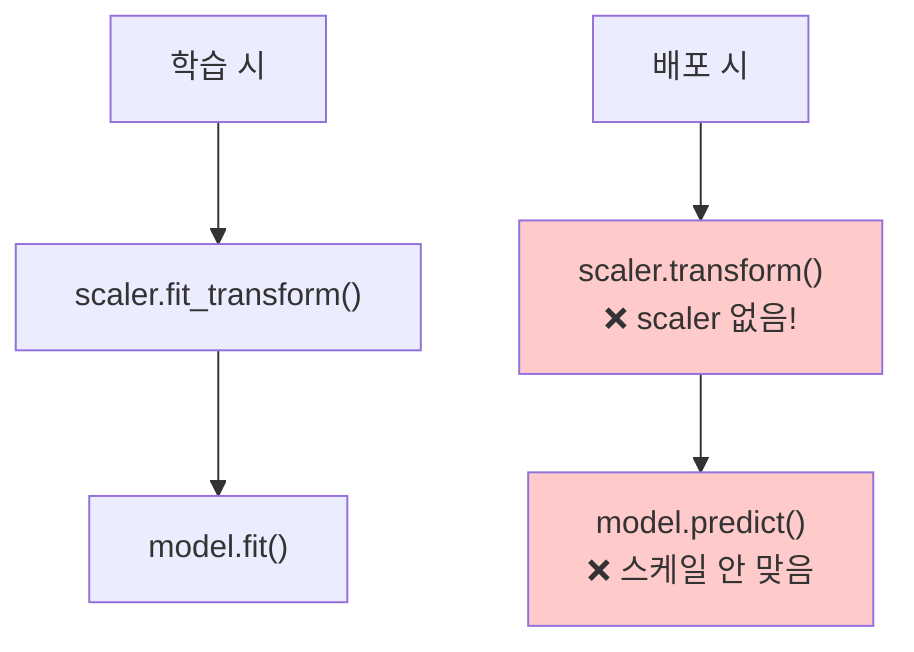

## 9. Pipeline 개념

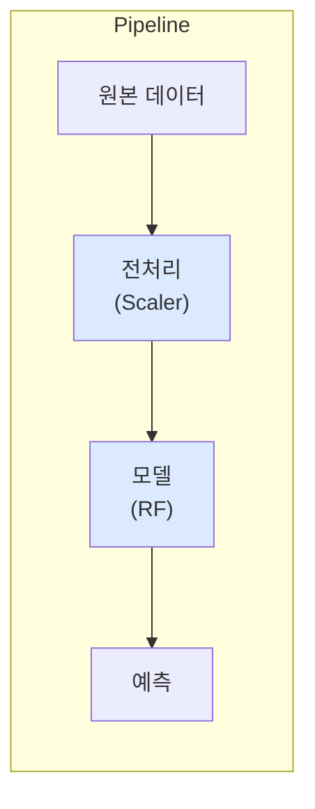

## 10. Pipeline 구성 요소

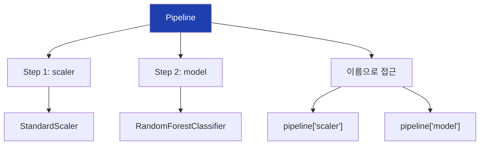

## 11. Pipeline fit 과정

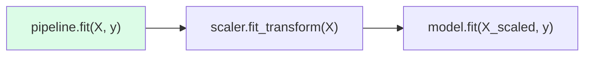

## 12. Pipeline predict 과정

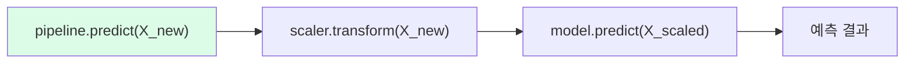

## 13. Pipeline 저장의 장점

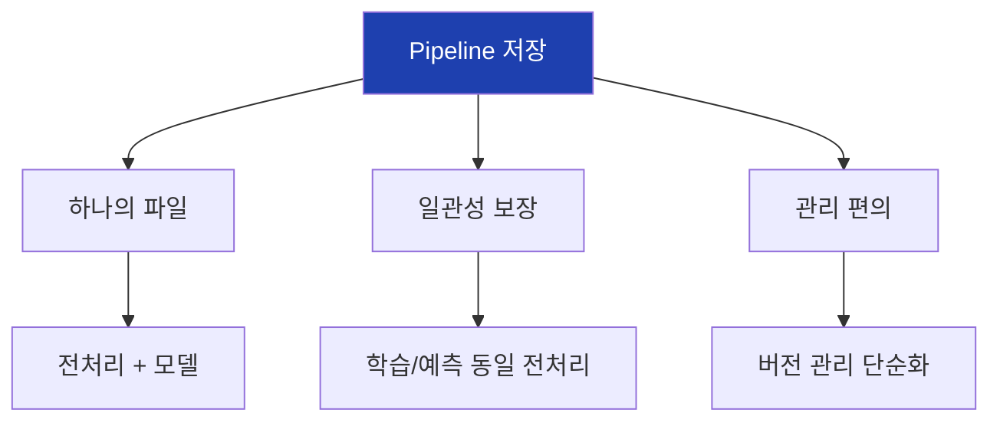

## 14. 다단계 Pipeline


## 15. ColumnTransformer

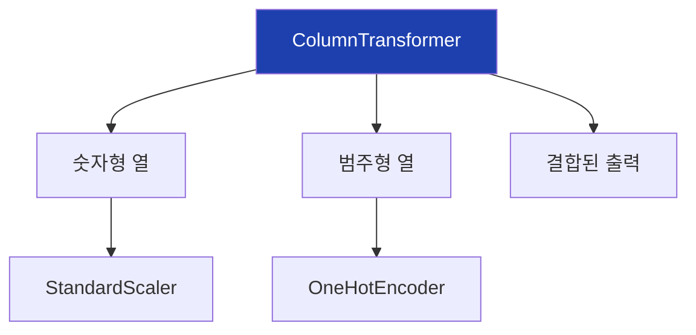

## 16. 배포 체크리스트 영역

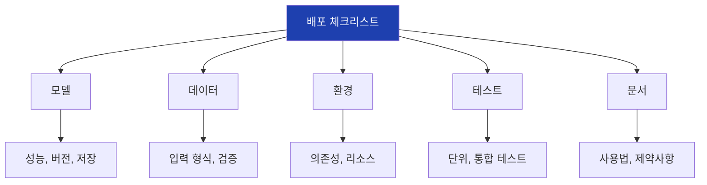

## 17. 입력 데이터 검증 흐름

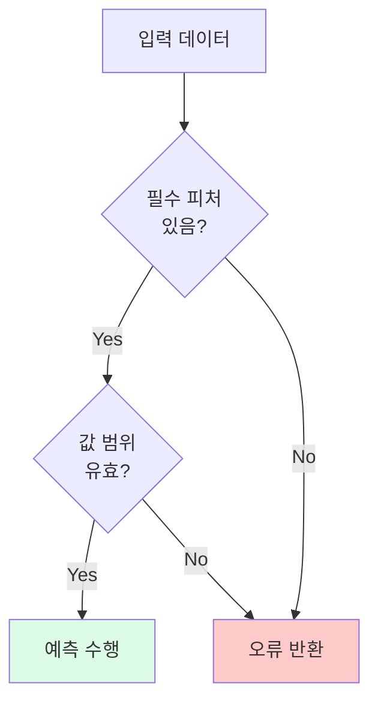

## 18. 배포 워크플로우

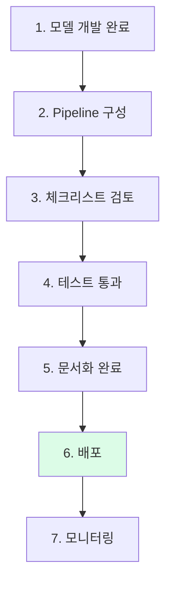

## 19. 모델 카드 구조

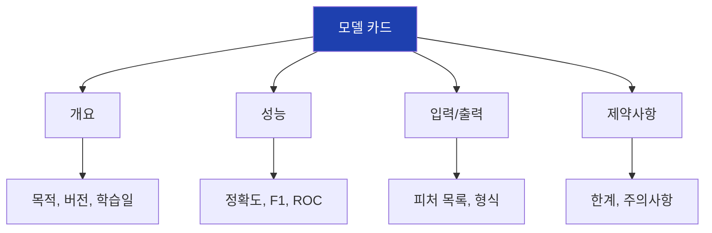

## 20. 배포 방식 선택

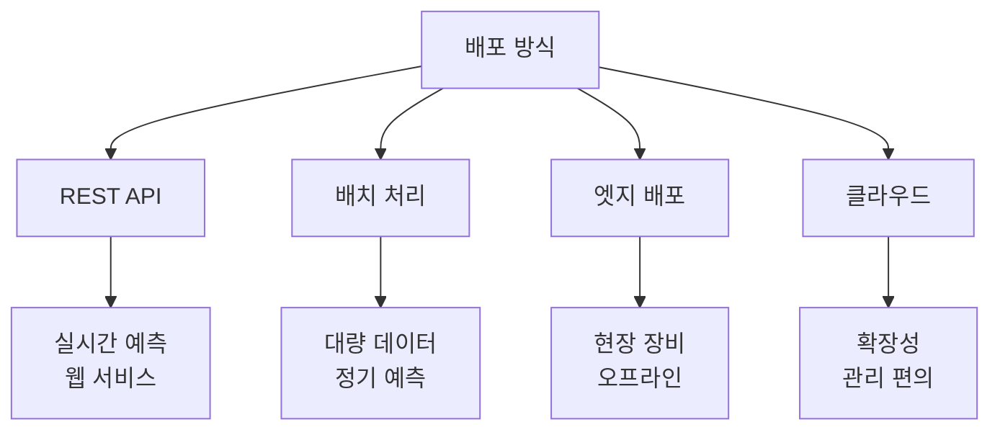

## 21. 모니터링 흐름

```mermaid
flowchart TD
    A["예측 요청"]
    B["로깅"]
    C["성능 측정"]
    D{"드리프트<br>감지?"}
    E["정상 운영"]
    F["재학습 알림"]

    A --> B --> C --> D
    D -->|No| E
    D -->|Yes| F

    style F fill:#fef3c7
```

## 22. 모델 드리프트

```mermaid
flowchart LR
    A["배포 시점<br>정확도 92%"]
    B["1개월 후<br>정확도 90%"]
    C["3개월 후<br>정확도 85%"]
    D["재학습 필요"]

    A --> B --> C --> D

    style C fill:#fecaca
    style D fill:#fef3c7
```

## 23. 실습 흐름

```mermaid
flowchart TD
    A["1. 데이터 준비"]
    B["2. Pipeline 구성"]
    C["3. 학습"]
    D["4. 저장"]
    E["5. 로드"]
    F["6. 검증"]
    G["7. 새 데이터 예측"]

    A --> B --> C --> D --> E --> F --> G

    style A fill:#dbeafe
    style G fill:#dcfce7
```

## 24. sklearn 함수 정리

```mermaid
flowchart TD
    A["sklearn"]

    A --> B["Pipeline"]
    B --> B1["fit(), predict()"]
    B --> B2["named_steps"]

    A --> C["make_pipeline"]
    C --> C1["자동 이름 생성"]

    A --> D["ColumnTransformer"]
    D --> D1["열별 전처리"]

    style A fill:#1e40af,color:#fff
```

## 25. joblib 함수 정리

```mermaid
flowchart TD
    A["joblib"]

    A --> B["dump()"]
    B --> B1["객체 저장"]
    B --> B2["compress 옵션"]

    A --> C["load()"]
    C --> C1["객체 로드"]

    style A fill:#1e40af,color:#fff
```

## 26. 핵심 정리

```mermaid
flowchart TD
    A["24차시 핵심"]

    A --> B["joblib"]
    B --> B1["dump/load<br>모델 저장"]

    A --> C["Pipeline"]
    C --> C1["전처리 + 모델<br>통합 저장"]

    A --> D["배포 체크리스트"]
    D --> D1["모델, 데이터<br>환경, 테스트, 문서"]

    style A fill:#1e40af,color:#fff
```

## 27. 다음 차시 연결

```mermaid
flowchart LR
    A["24차시<br>모델 저장"]
    B["24차시<br>AI API"]

    A --> B

    A --> A1["Pipeline"]
    A --> A2["배포 준비"]

    B --> B1["REST API"]
    B --> B2["requests"]

    style A fill:#dbeafe
    style B fill:#dcfce7
```

