# [25차시] AI API의 이해와 활용 - 다이어그램

## 1. 학습 흐름

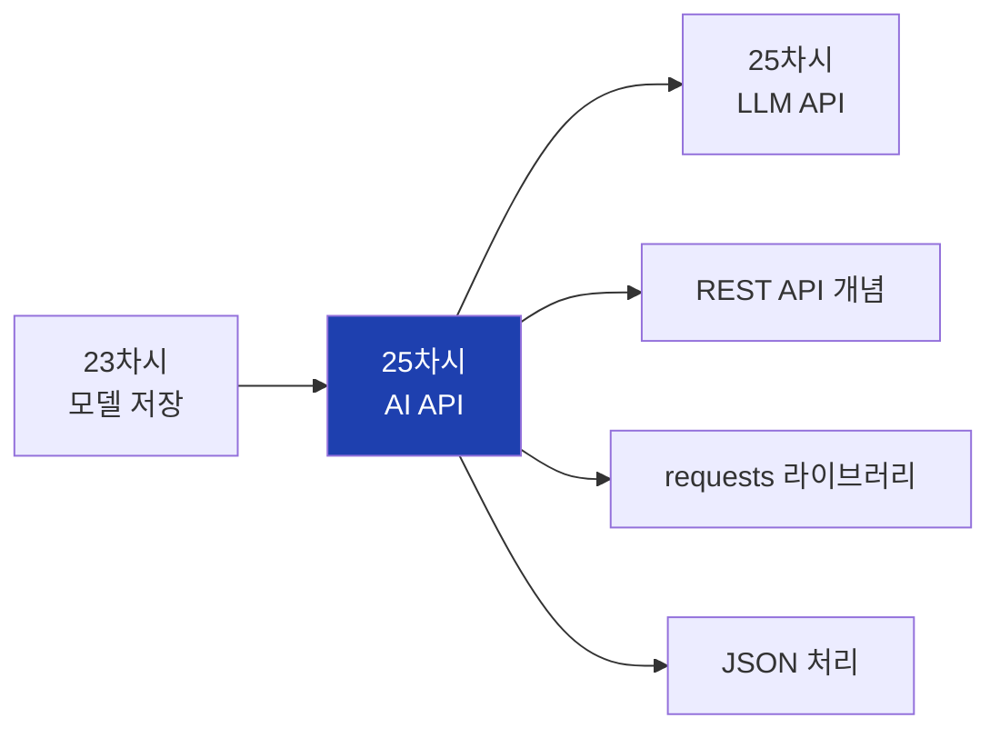

## 2. 대주제 구조

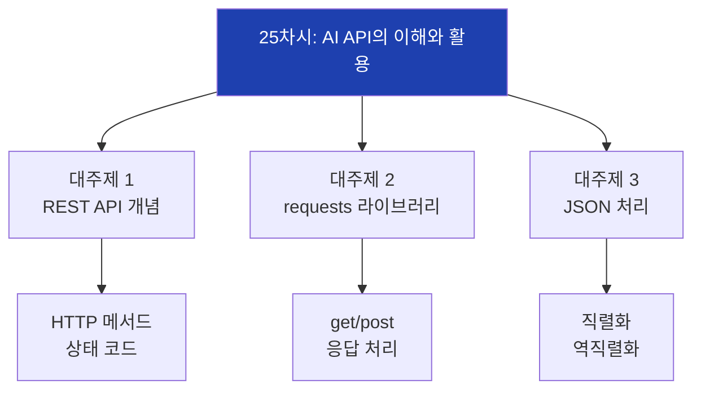

## 3. API 기본 개념

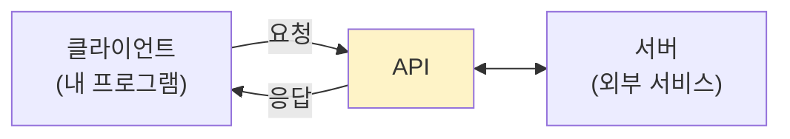

## 4. REST API 구조

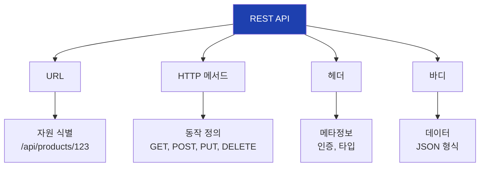

## 5. HTTP 메서드

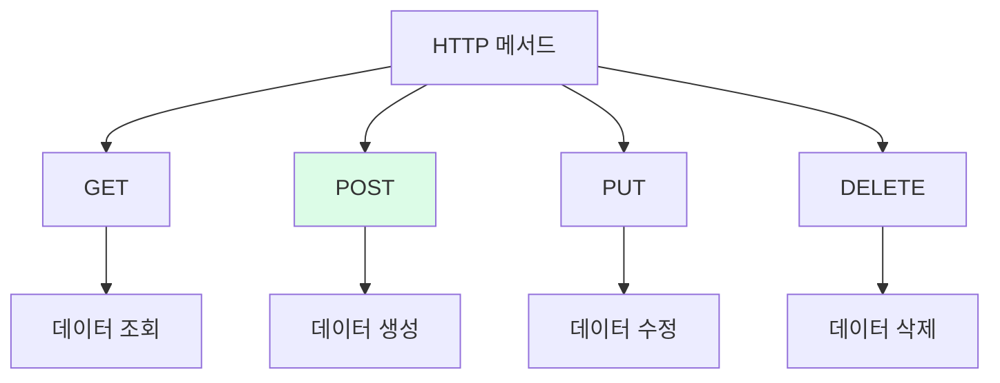

## 6. 요청-응답 흐름

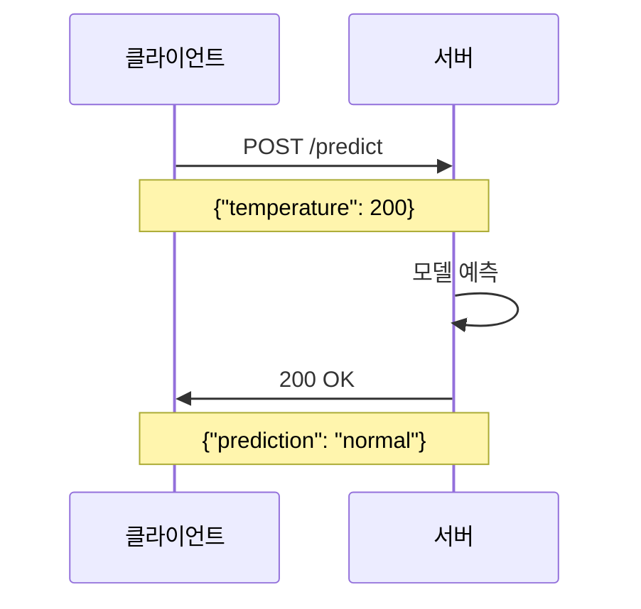

## 7. HTTP 상태 코드

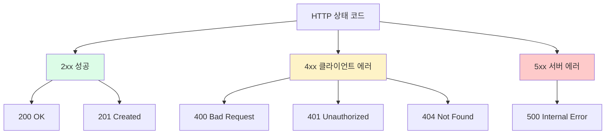

## 8. API 인증 방식

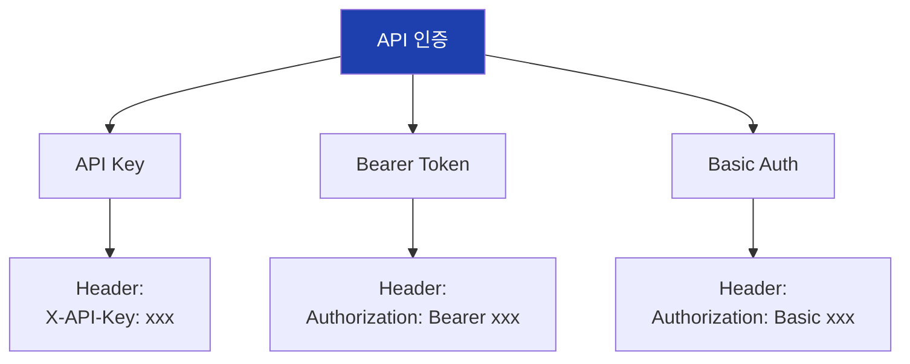

## 9. requests 라이브러리

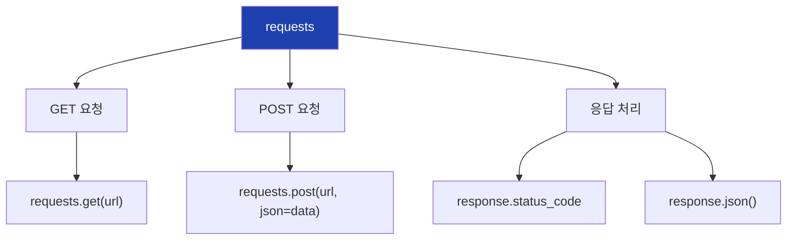

## 10. GET 요청 흐름

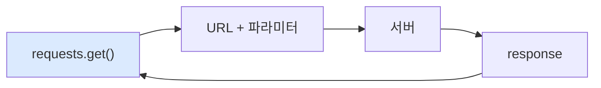

## 11. POST 요청 흐름

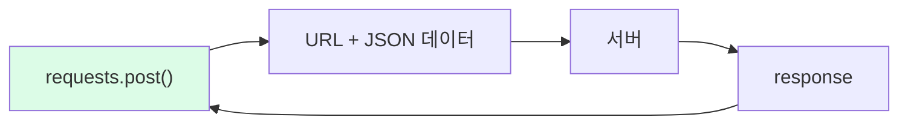

## 12. 응답 객체 속성

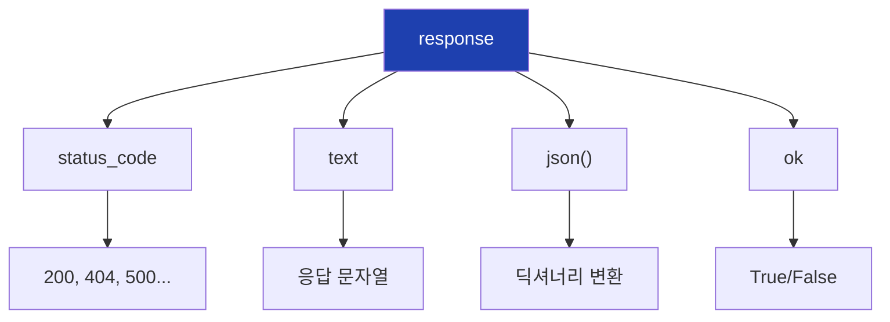

## 13. 에러 처리 패턴

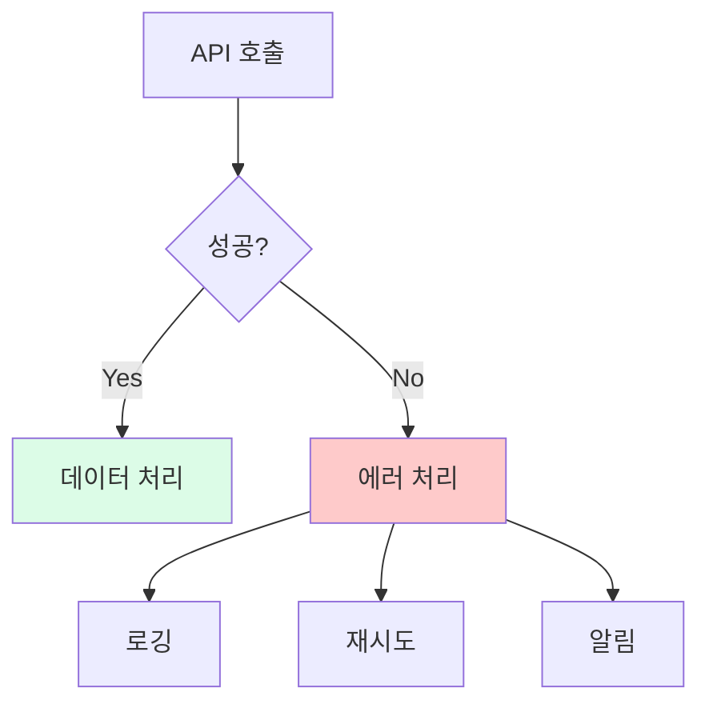

## 14. JSON 구조

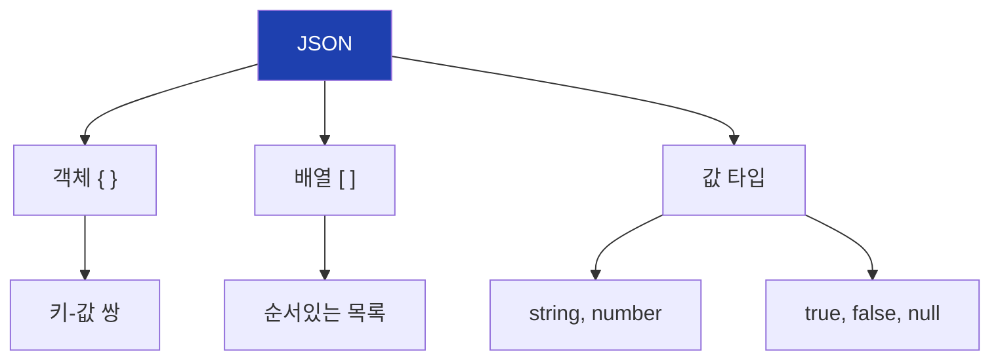

## 15. Python-JSON 변환

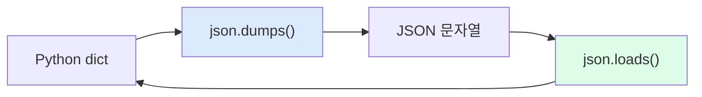

## 16. JSON 파일 처리

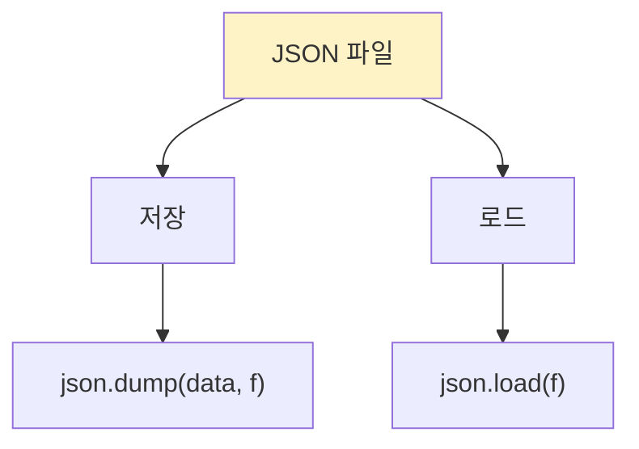

## 17. requests + JSON 자동 처리

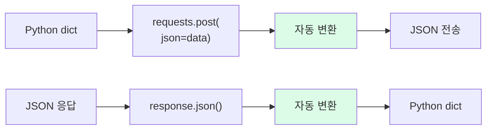

## 18. 중첩 JSON 구조

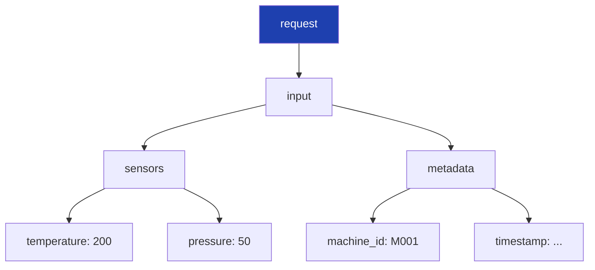

## 19. API 호출 완전 흐름

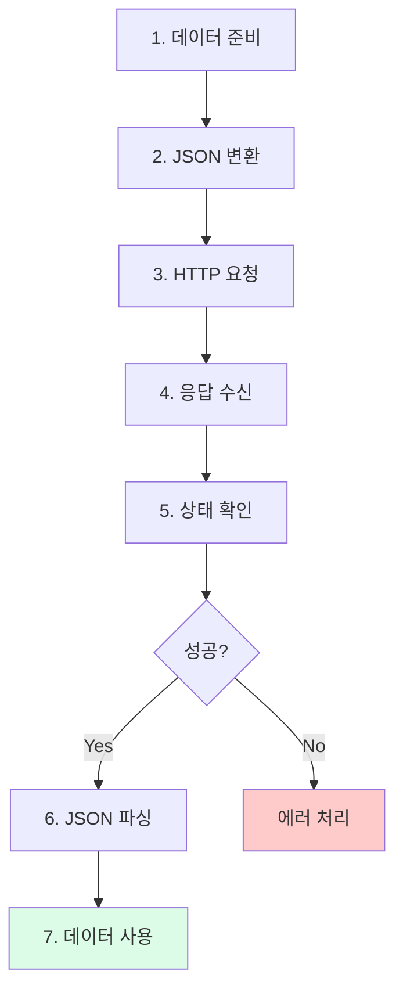

## 20. 세션 사용

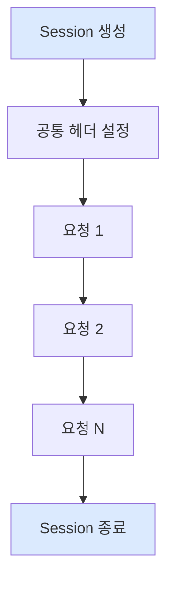

## 21. 타임아웃 처리

```mermaid
flowchart TD
    A["요청 전송"]
    B{"5초 내<br>응답?"}
    C["정상 처리"]
    D["Timeout 예외"]
    E["에러 처리"]

    A --> B
    B -->|Yes| C
    B -->|No| D --> E

    style C fill:#dcfce7
    style D fill:#fecaca
```

## 22. 제조업 API 활용

```mermaid
flowchart TD
    A["제조 시스템"]

    A --> B["품질 예측 API"]
    B --> B1["ML 모델 호출"]

    A --> C["설비 모니터링 API"]
    C --> C1["센서 데이터 조회"]

    A --> D["이상 분석 API"]
    D --> D1["LLM 원인 분석"]

    style A fill:#1e40af,color:#fff
```

## 23. 실습 흐름

```mermaid
flowchart TD
    A["1. 공개 API 호출"]
    B["2. GET 요청 테스트"]
    C["3. POST 요청 테스트"]
    D["4. JSON 변환 실습"]
    E["5. 에러 처리 실습"]
    F["6. 예측 시뮬레이션"]

    A --> B --> C --> D --> E --> F

    style A fill:#dbeafe
    style F fill:#dcfce7
```

## 24. 핵심 함수 정리

```mermaid
flowchart TD
    A["핵심 함수"]

    A --> B["requests"]
    B --> B1["get(url, params)"]
    B --> B2["post(url, json)"]

    A --> C["json"]
    C --> C1["dumps() - 직렬화"]
    C --> C2["loads() - 역직렬화"]

    A --> D["response"]
    D --> D1["status_code"]
    D --> D2["json()"]

    style A fill:#1e40af,color:#fff
```

## 25. 핵심 정리

```mermaid
flowchart TD
    A["25차시 핵심"]

    A --> B["REST API"]
    B --> B1["HTTP 기반<br>GET/POST"]

    A --> C["requests"]
    C --> C1["API 호출<br>응답 처리"]

    A --> D["JSON"]
    D --> D1["데이터 교환<br>형식"]

    style A fill:#1e40af,color:#fff
```

## 26. 실무 팁

```mermaid
flowchart TD
    A["실무 팁"]

    A --> B["API 키"]
    B --> B1["환경 변수로 관리"]

    A --> C["타임아웃"]
    C --> C1["항상 설정"]

    A --> D["에러 처리"]
    D --> D1["try-except 필수"]

    A --> E["로깅"]
    E --> E1["요청/응답 기록"]

    style A fill:#fef3c7
```

## 27. 다음 차시 연결

```mermaid
flowchart LR
    A["25차시<br>AI API"]
    B["25차시<br>LLM API"]

    A --> B

    A --> A1["REST API 기초"]
    A --> A2["requests 사용"]

    B --> B1["OpenAI/Claude"]
    B --> B2["프롬프트 작성"]

    style A fill:#dbeafe
    style B fill:#dcfce7
```

