# [26차시] LLM API와 프롬프트 작성법 - 다이어그램

## 1. 학습 흐름

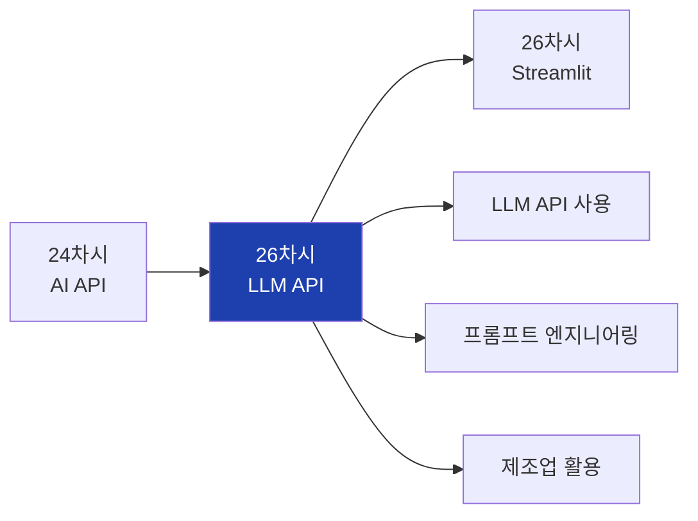

## 2. 대주제 구조

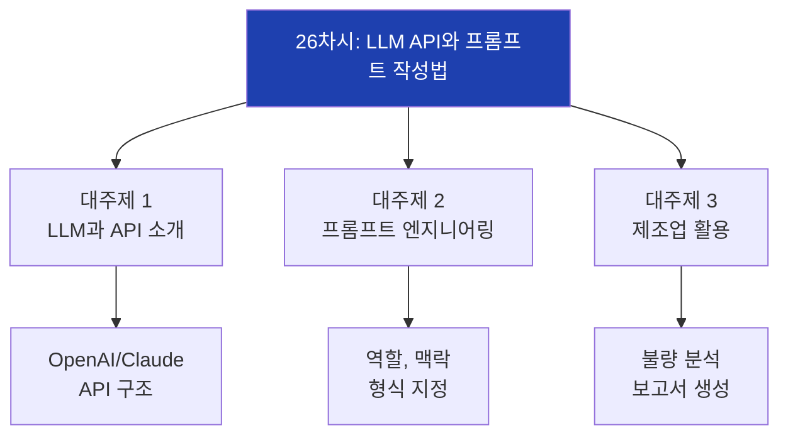

## 3. LLM 개념

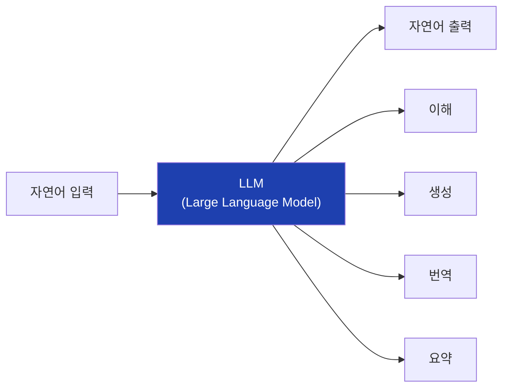

## 4. 주요 LLM 서비스

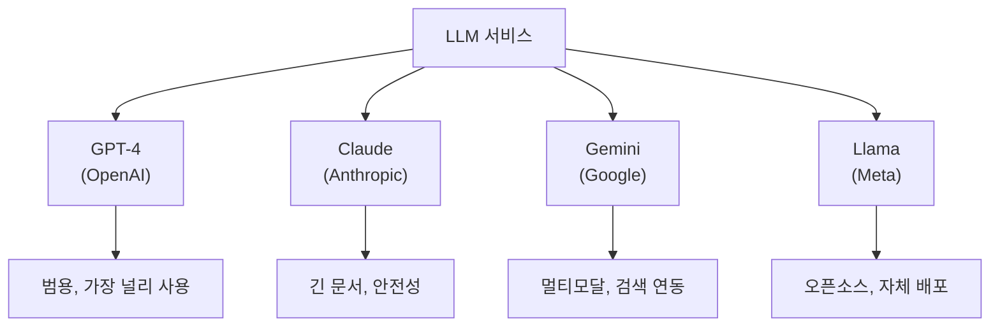

## 5. API 키 관리

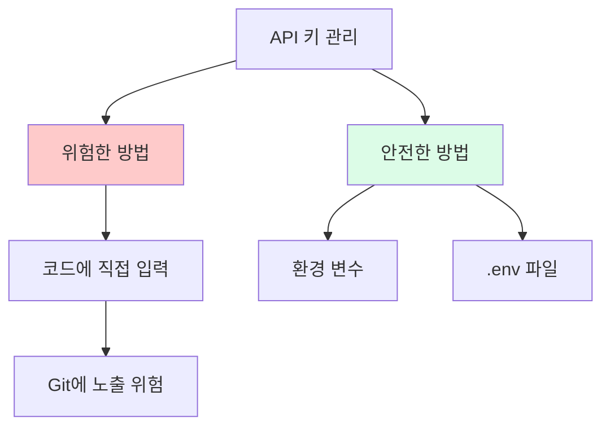

## 6. API 호출 구조

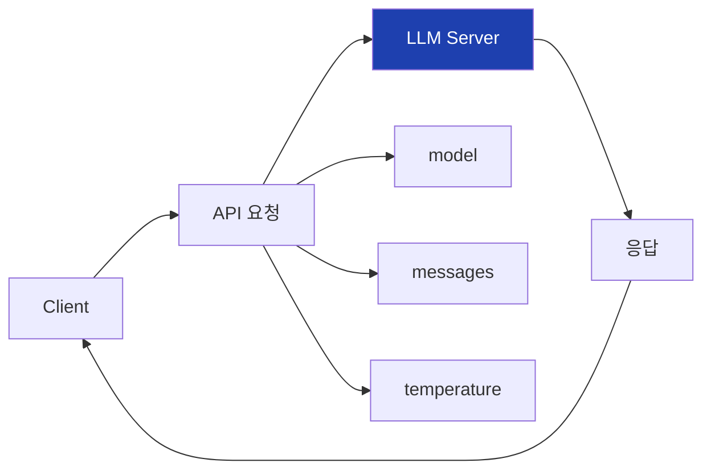

## 7. 메시지 역할

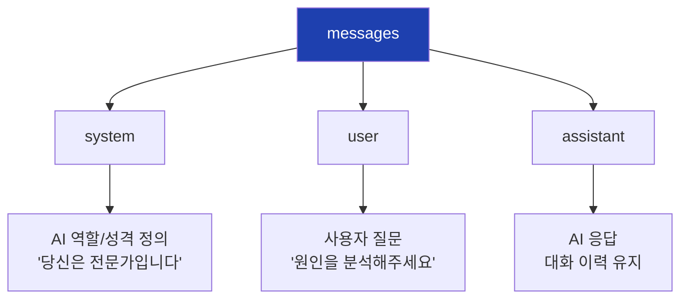

## 8. API 파라미터

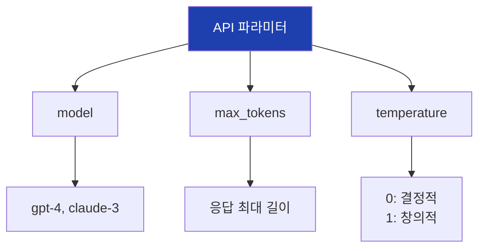

## 9. Temperature 효과

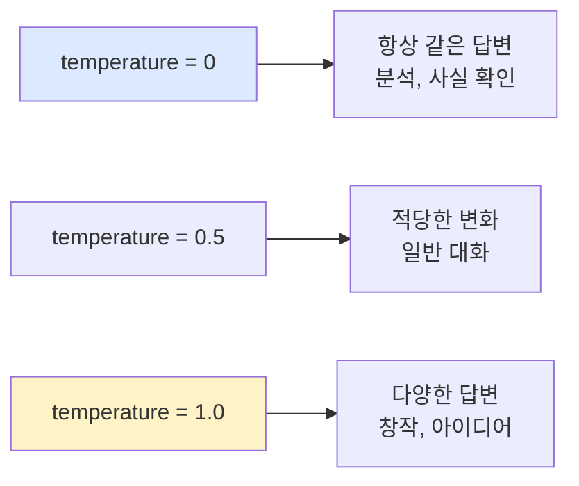

## 10. 프롬프트 엔지니어링

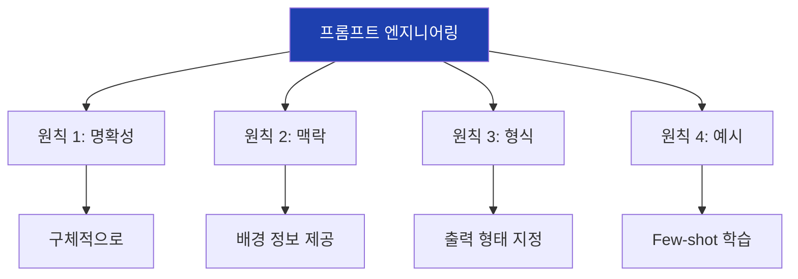

## 11. 좋은 프롬프트 vs 나쁜 프롬프트

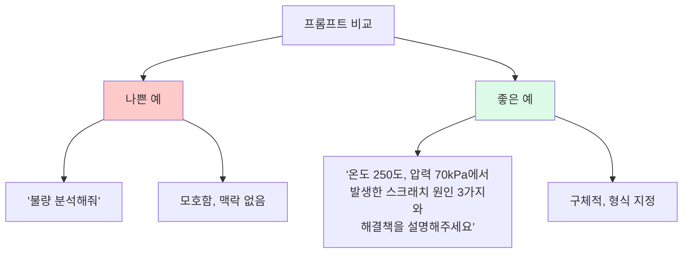

## 12. 역할 지정 (Role)

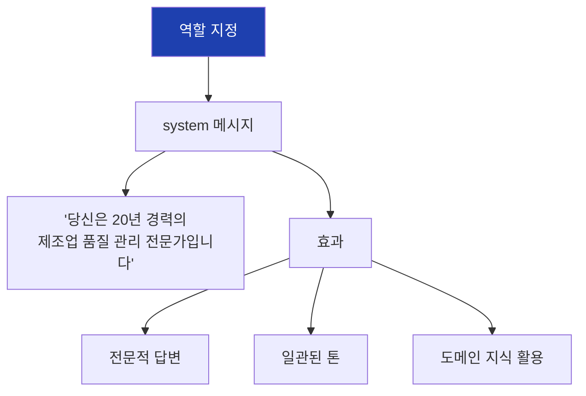

## 13. 맥락 제공 구조

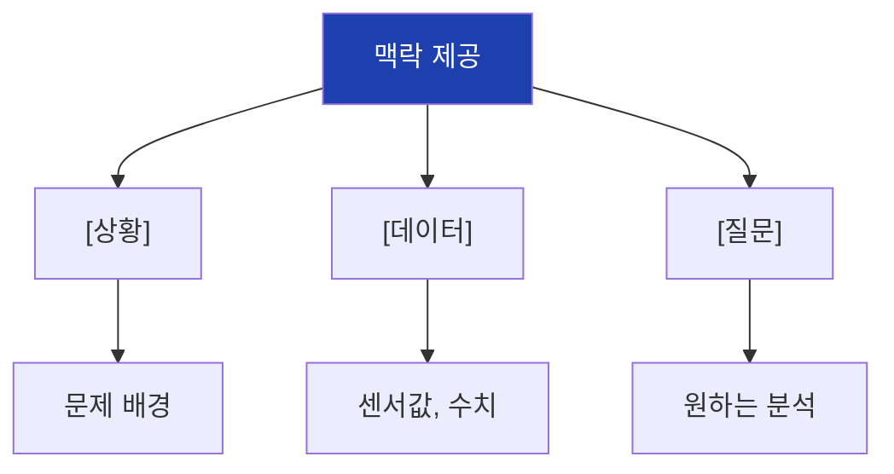

## 14. 출력 형식 지정

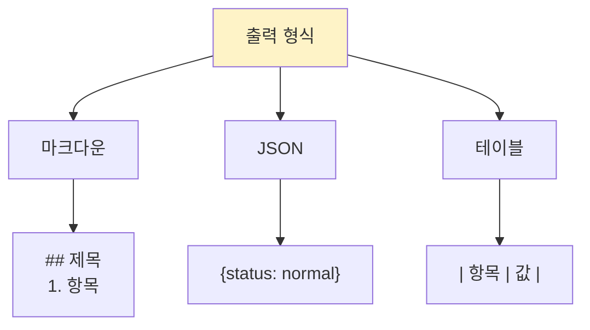

## 15. Few-shot 학습

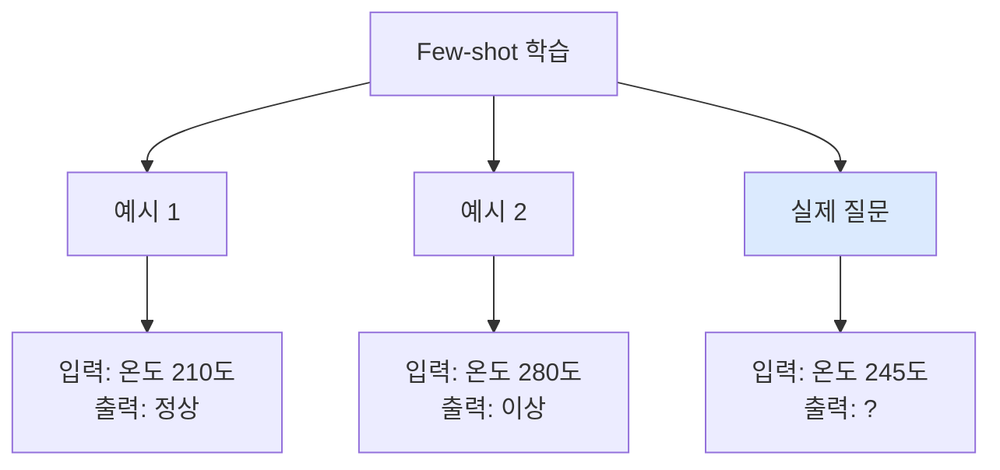

## 16. Chain of Thought

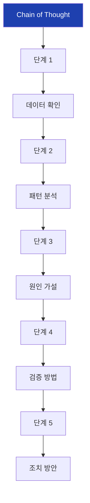

## 17. 제조업 활용 사례

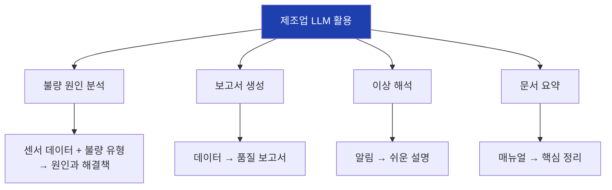

## 18. ML + LLM 하이브리드

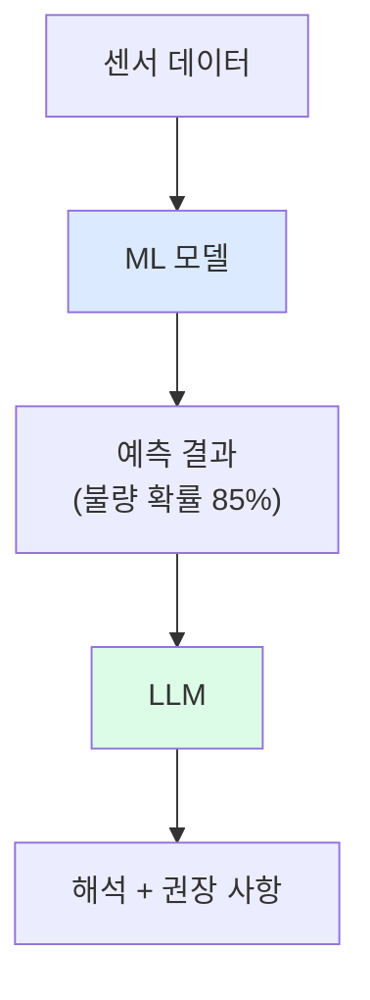

## 19. LLM 주의사항

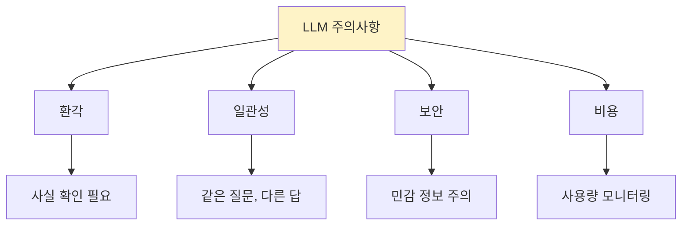

## 20. 비용 최적화

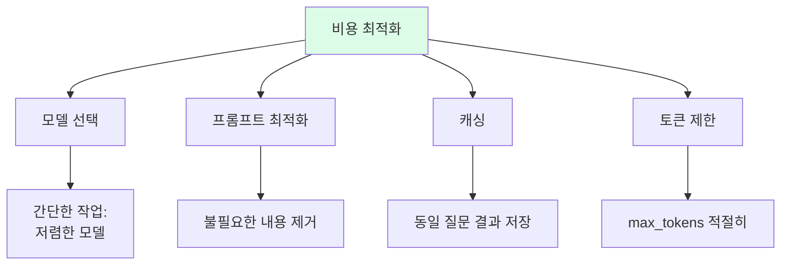

## 21. API 호출 흐름

```mermaid
sequenceDiagram
    participant App as 애플리케이션
    participant API as LLM API
    participant LLM as LLM 모델

    App->>API: 메시지 전송
    API->>LLM: 추론 요청
    LLM->>API: 응답 생성
    API->>App: 응답 반환
```

## 22. 실습 흐름

```mermaid
flowchart TD
    A["1. 환경 설정"]
    B["2. API 키 설정"]
    C["3. 기본 호출"]
    D["4. 역할 지정"]
    E["5. 형식 지정"]
    F["6. 제조업 활용"]

    A --> B --> C --> D --> E --> F

    style A fill:#dbeafe
    style F fill:#dcfce7
```

## 23. 프롬프트 템플릿

```mermaid
flowchart TD
    A["프롬프트 템플릿"]

    A --> B["역할"]
    B --> B1["당신은 {role}입니다"]

    A --> C["맥락"]
    C --> C1["[상황] {context}"]

    A --> D["데이터"]
    D --> D1["[데이터] {data}"]

    A --> E["요청"]
    E --> E1["[질문] {question}"]

    A --> F["형식"]
    F --> F1["[형식] {format}"]

    style A fill:#1e40af,color:#fff
```

## 24. 응답 처리

```mermaid
flowchart TD
    A["API 응답"]
    B["response.choices[0]"]
    C["message.content"]
    D["텍스트 추출"]

    A --> B --> C --> D

    D --> E{"JSON 형식?"}
    E -->|Yes| F["json.loads()"]
    E -->|No| G["텍스트 처리"]

    style D fill:#dcfce7
```

## 25. 핵심 코드 구조

```mermaid
flowchart TD
    A["OpenAI API"]

    A --> B["client = OpenAI()"]
    A --> C["chat.completions.create()"]
    A --> D["messages = [...]"]
    A --> E["response.choices[0].message.content"]

    style A fill:#1e40af,color:#fff
```

## 26. 핵심 정리

```mermaid
flowchart TD
    A["26차시 핵심"]

    A --> B["LLM API"]
    B --> B1["OpenAI/Claude<br>자연어 처리"]

    A --> C["프롬프트"]
    C --> C1["역할, 맥락<br>형식 지정"]

    A --> D["제조업 활용"]
    D --> D1["분석, 보고서<br>ML 조합"]

    style A fill:#1e40af,color:#fff
```

## 27. 다음 차시 연결

```mermaid
flowchart LR
    A["26차시<br>LLM API"]
    B["26차시<br>Streamlit"]

    A --> B

    A --> A1["프롬프트"]
    A --> A2["API 호출"]

    B --> B1["웹 UI"]
    B --> B2["인터랙티브 앱"]

    style A fill:#dbeafe
    style B fill:#dcfce7
```

