# [27차시] Streamlit으로 웹앱 만들기 - 다이어그램

## 1. 학습 흐름

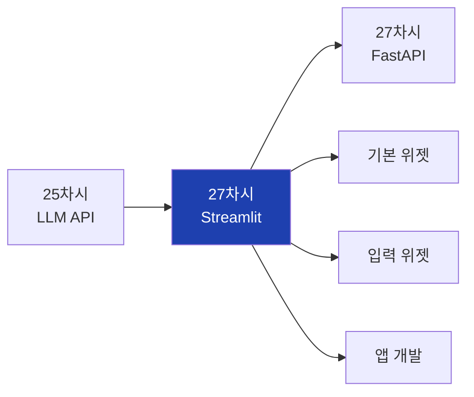

## 2. 대주제 구조

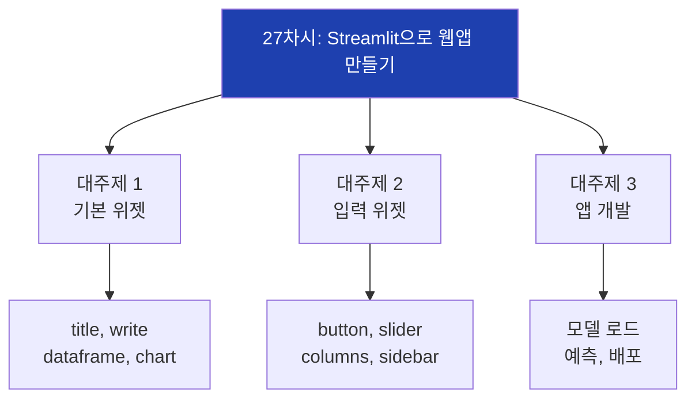

## 3. Streamlit 개념

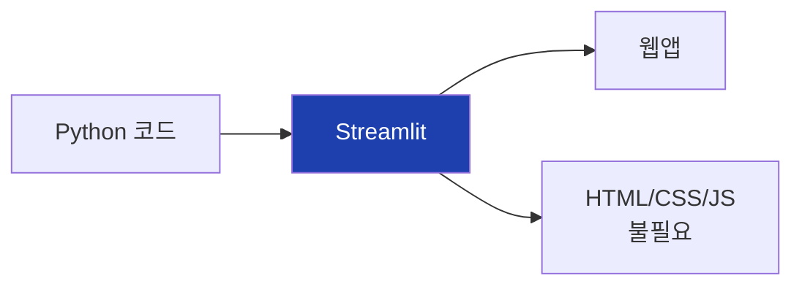

## 4. Streamlit 실행 흐름

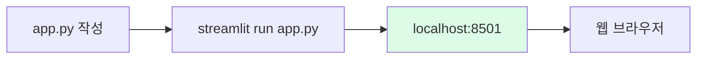

## 5. 텍스트 계층 구조

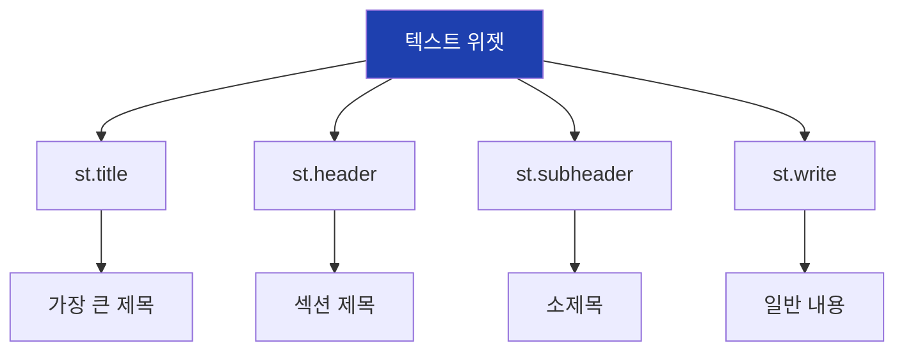

## 6. st.write 만능 출력

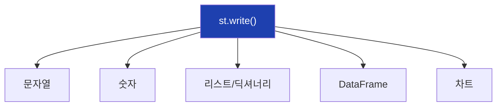

## 7. 데이터 표시 위젯

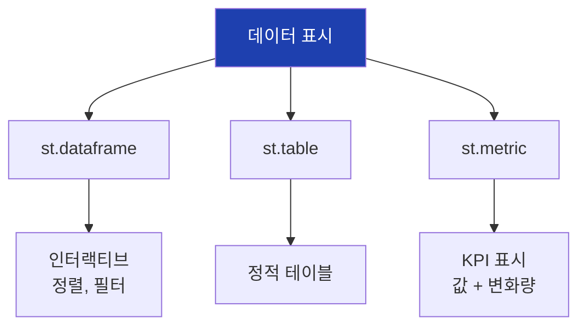

## 8. 차트 위젯

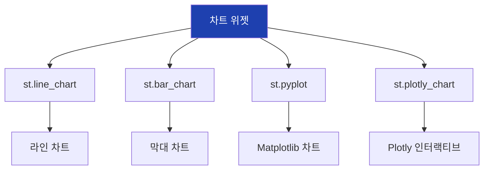

## 9. 입력 위젯 종류

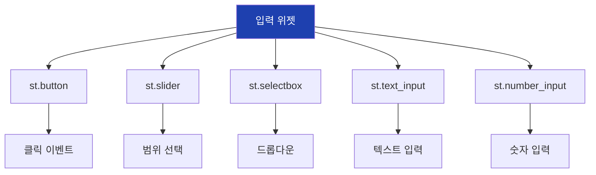

## 10. 버튼 동작

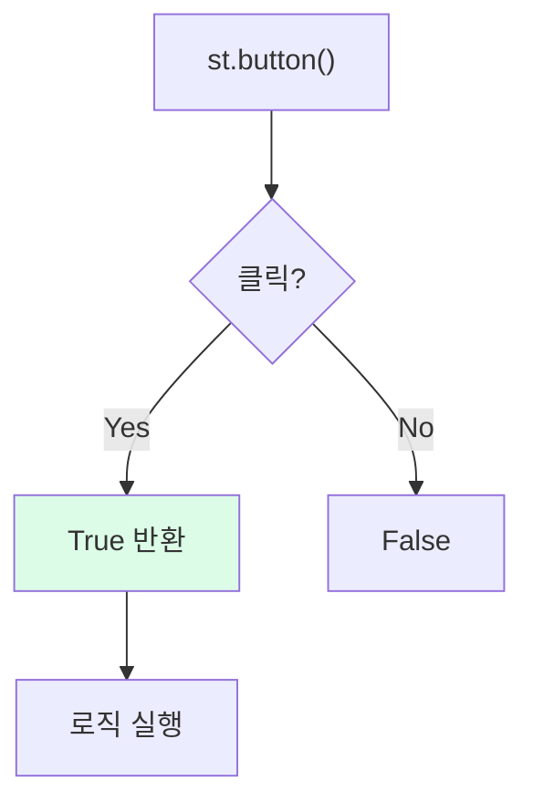

## 11. 슬라이더 위젯

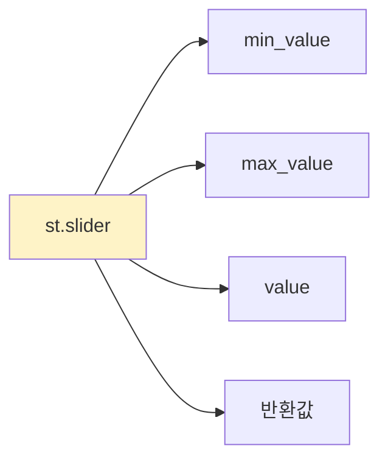

## 12. 레이아웃 - 열

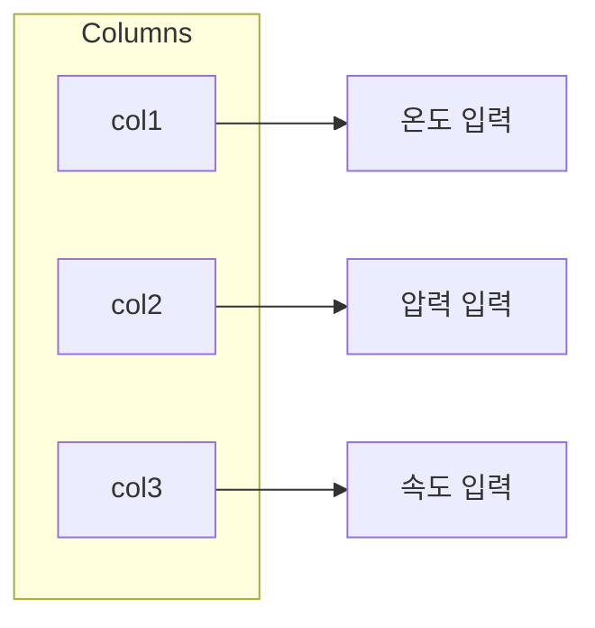

## 13. 레이아웃 - 사이드바

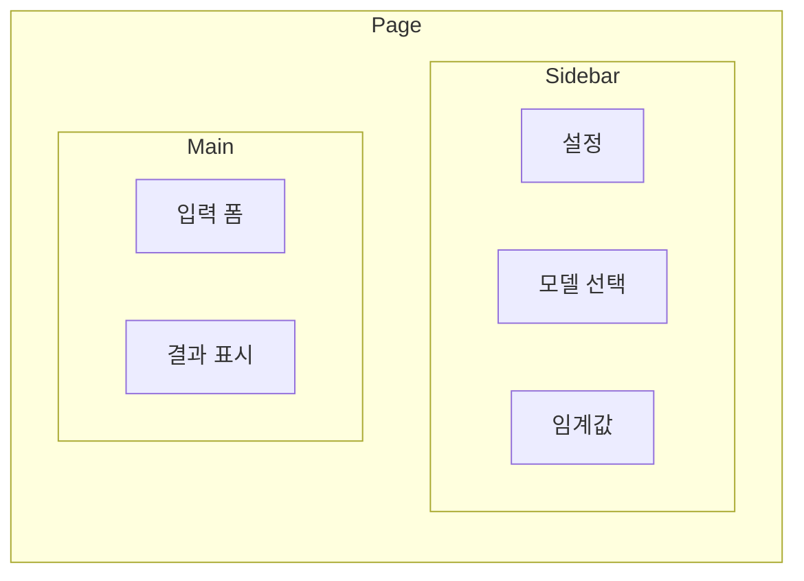

## 14. 레이아웃 - 탭

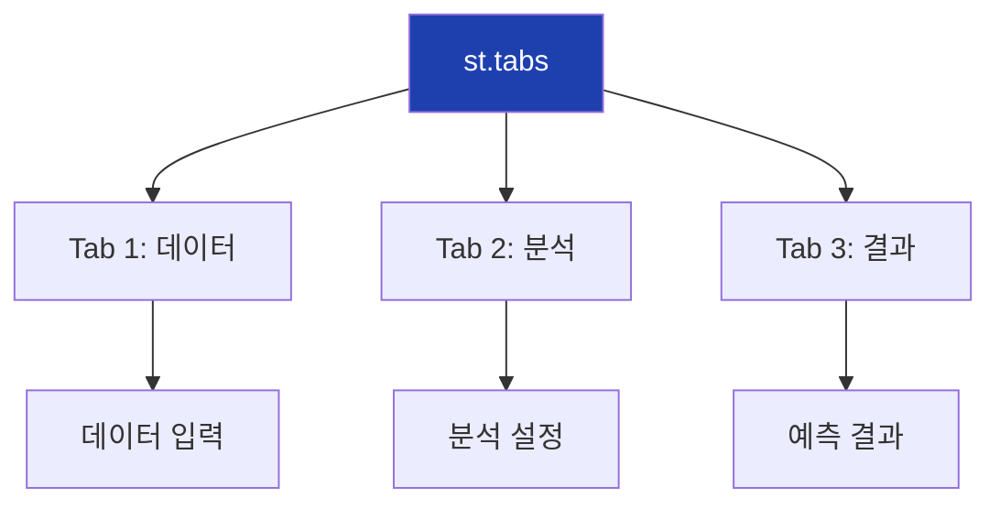

## 15. 폼 동작

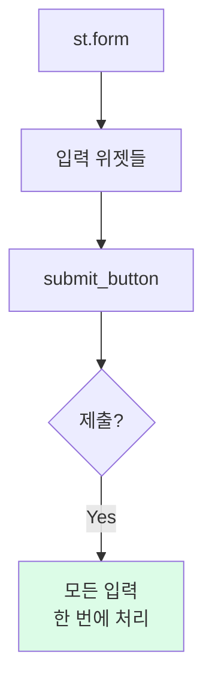

## 16. 상태 메시지

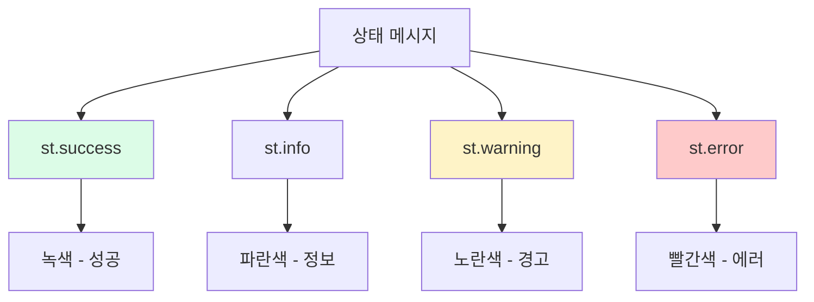

## 17. 캐싱 데코레이터

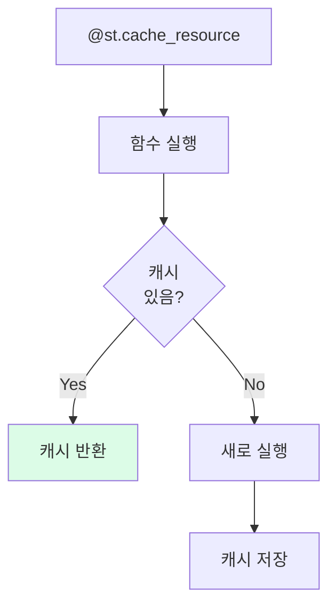

## 18. 품질 예측 앱 구조

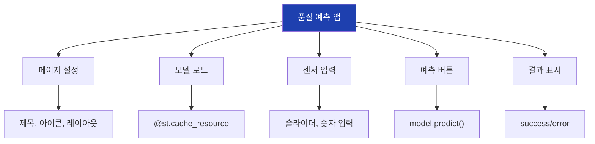

## 19. 앱 실행 흐름

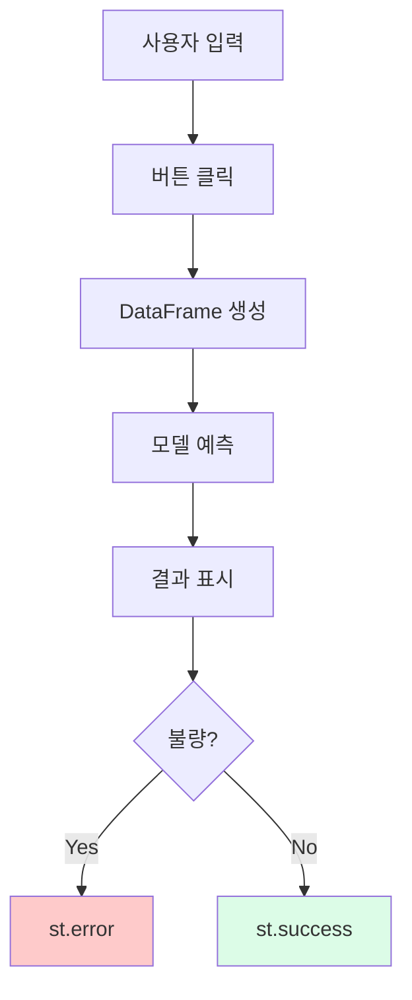

## 20. Streamlit Cloud 배포

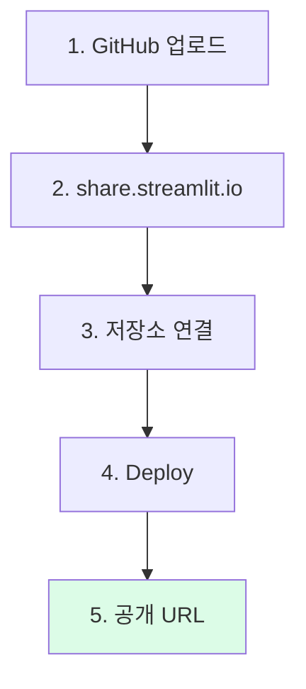

## 21. 필요 파일 구조

```mermaid
flowchart TD
    A["프로젝트 폴더"]

    A --> B["app.py"]
    B --> B1["메인 앱 코드"]

    A --> C["requirements.txt"]
    C --> C1["의존성 목록"]

    A --> D["model.pkl"]
    D --> D1["학습된 모델"]

    A --> E[".streamlit/"]
    E --> E1["secrets.toml"]

    style A fill:#1e40af,color:#fff
```

## 22. Secrets 관리

```mermaid
flowchart TD
    A["비밀 정보"]

    A --> B["로컬"]
    B --> B1[".streamlit/secrets.toml"]

    A --> C["Cloud"]
    C --> C1["Settings > Secrets"]

    A --> D["코드"]
    D --> D1["st.secrets['KEY']"]

    style A fill:#fef3c7
```

## 23. 위젯 요약 - 출력

```mermaid
flowchart TD
    A["출력 위젯"]

    A --> B["st.title/header"]
    A --> C["st.write"]
    A --> D["st.dataframe"]
    A --> E["st.metric"]
    A --> F["st.pyplot/line_chart"]

    style A fill:#1e40af,color:#fff
```

## 24. 위젯 요약 - 입력

```mermaid
flowchart TD
    A["입력 위젯"]

    A --> B["st.button"]
    A --> C["st.slider"]
    A --> D["st.selectbox"]
    A --> E["st.text_input"]
    A --> F["st.file_uploader"]

    style A fill:#1e40af,color:#fff
```

## 25. 위젯 요약 - 레이아웃

```mermaid
flowchart TD
    A["레이아웃 위젯"]

    A --> B["st.columns"]
    A --> C["st.sidebar"]
    A --> D["st.tabs"]
    A --> E["st.expander"]
    A --> F["st.form"]

    style A fill:#1e40af,color:#fff
```

## 26. 핵심 정리

```mermaid
flowchart TD
    A["27차시 핵심"]

    A --> B["Streamlit"]
    B --> B1["Python만으로<br>웹앱 개발"]

    A --> C["위젯"]
    C --> C1["출력, 입력<br>레이아웃"]

    A --> D["배포"]
    D --> D1["Streamlit Cloud<br>무료 호스팅"]

    style A fill:#1e40af,color:#fff
```

## 27. 다음 차시 연결

```mermaid
flowchart LR
    A["27차시<br>Streamlit"]
    B["27차시<br>FastAPI"]

    A --> B

    A --> A1["웹 UI"]
    A --> A2["사용자 인터랙션"]

    B --> B1["REST API"]
    B --> B2["프로그램 호출"]

    style A fill:#dbeafe
    style B fill:#dcfce7
```

