# [28차시] FastAPI로 예측 서비스 만들기 - 다이어그램

## 1. 학습 흐름

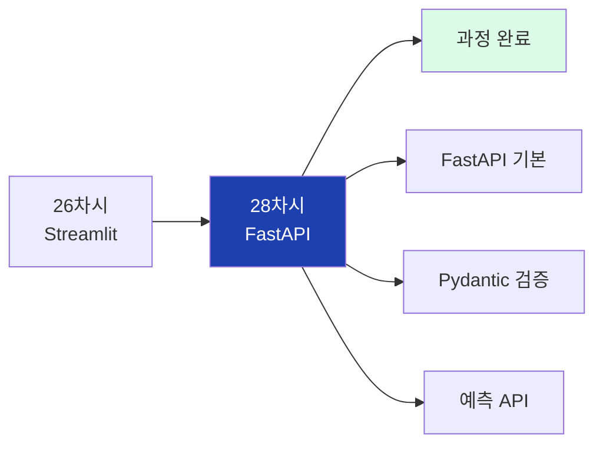

## 2. 대주제 구조

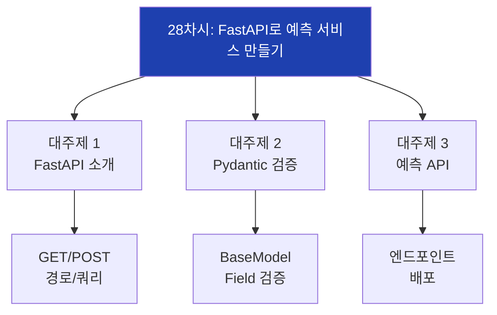

## 3. Streamlit vs FastAPI

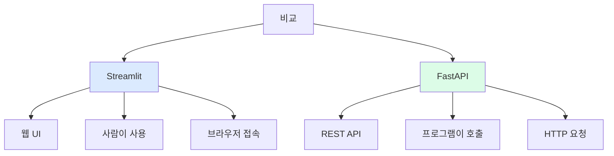

## 4. FastAPI 요청 흐름


## 5. FastAPI 실행 흐름

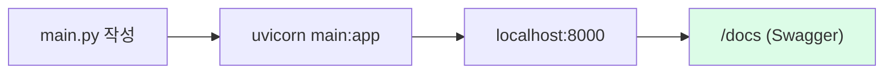

## 6. HTTP 메서드

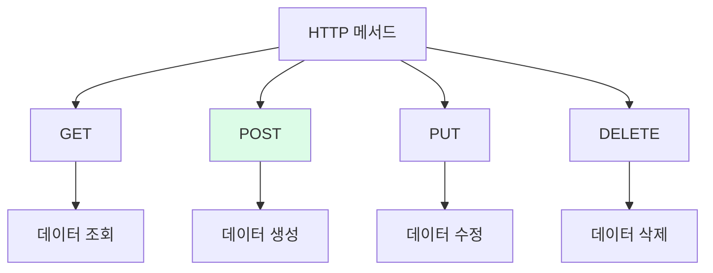

## 7. 데코레이터 구조

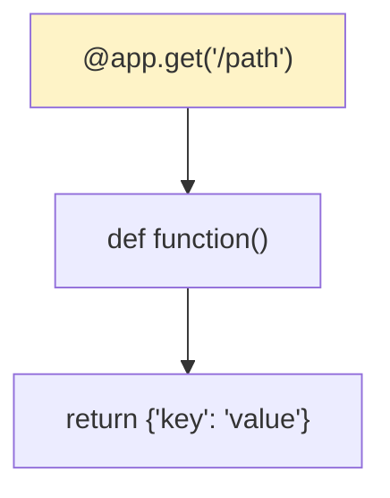

## 8. 경로 매개변수

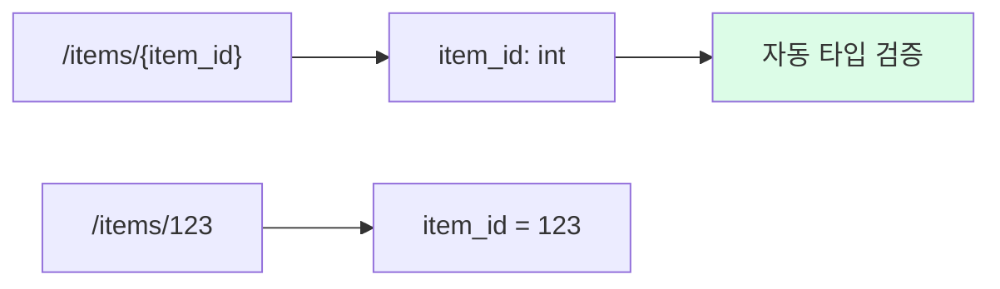

## 9. 쿼리 매개변수

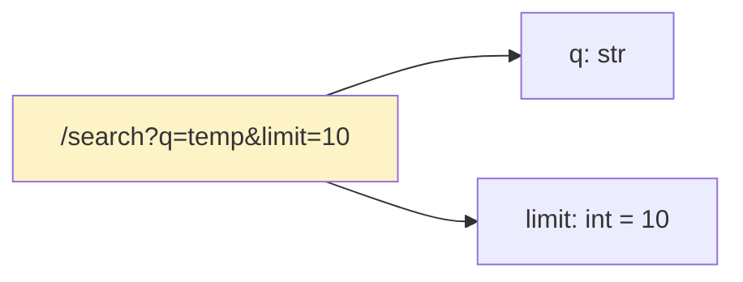

## 10. Pydantic BaseModel

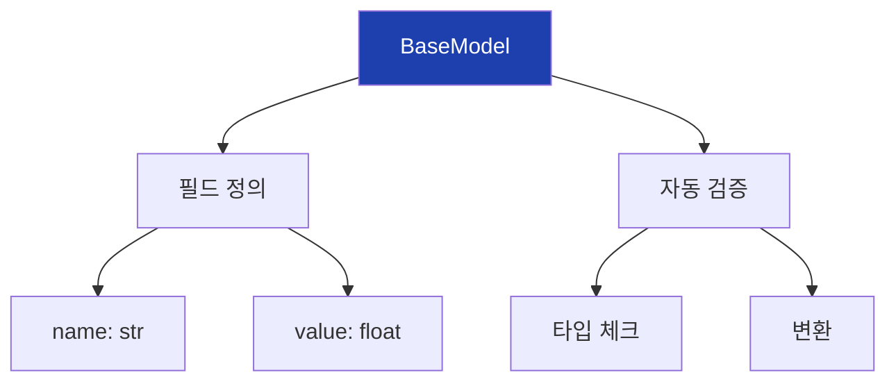

## 11. Pydantic Field 옵션

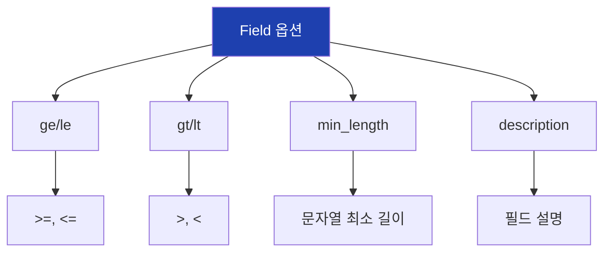

## 12. 요청/응답 모델

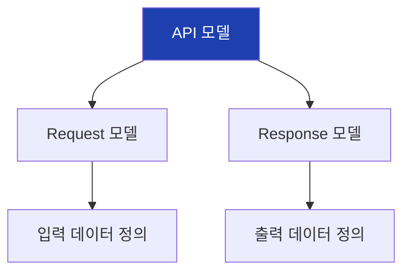

## 13. POST 요청 흐름

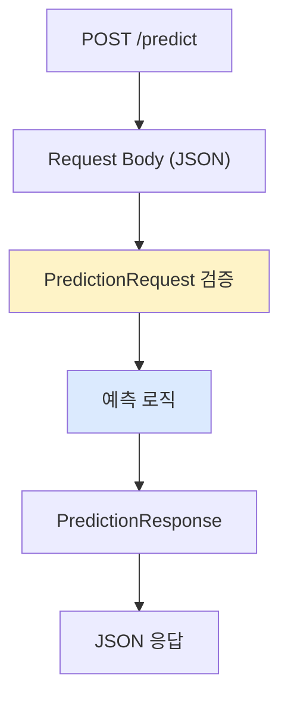

## 14. 데이터 검증 흐름

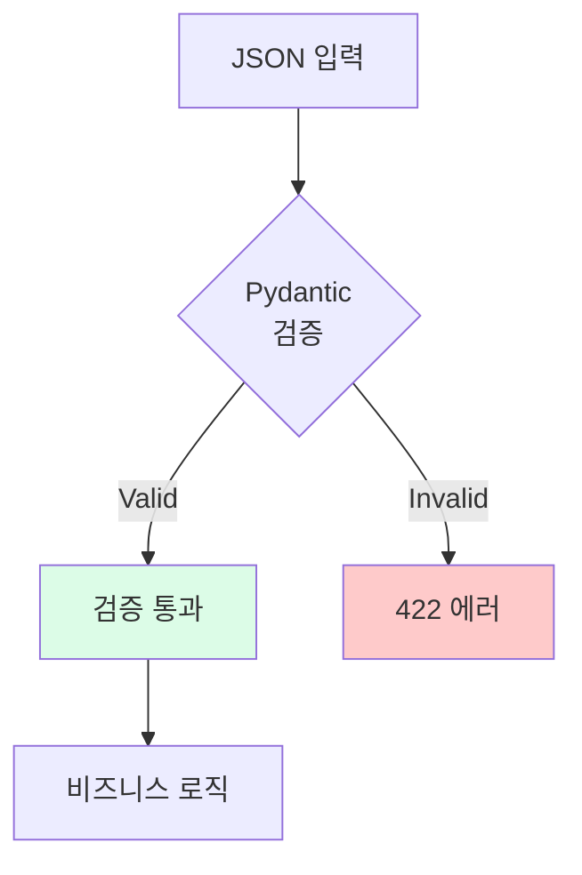

## 15. 프로젝트 구조

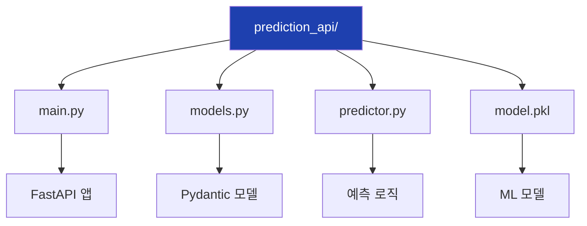

## 16. 예측 API 구조

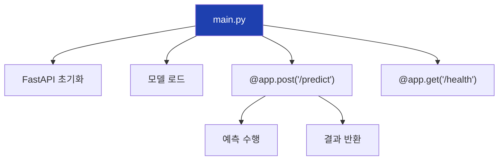

## 17. 에러 처리

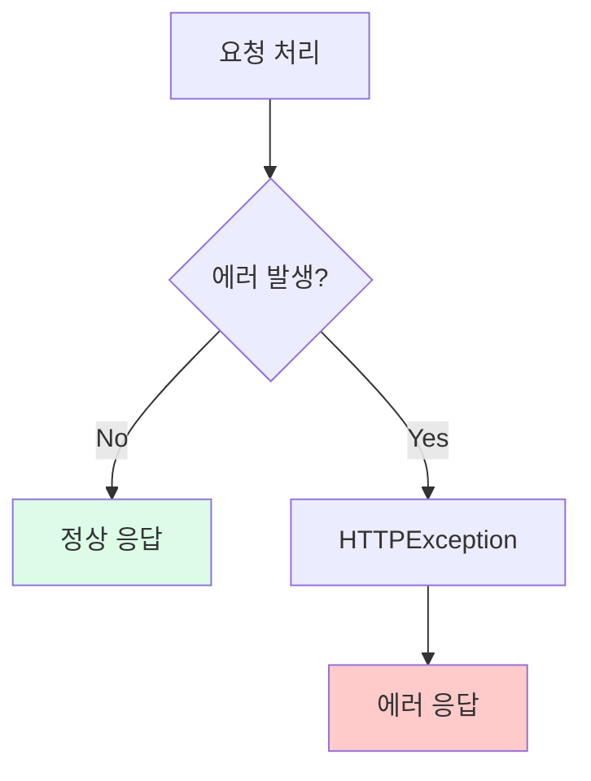

## 18. 배치 예측

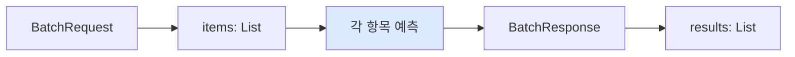

## 19. API 테스트

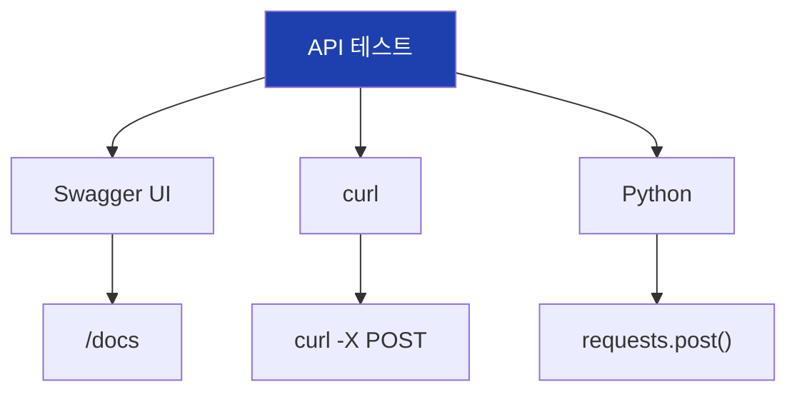

## 20. Docker 배포

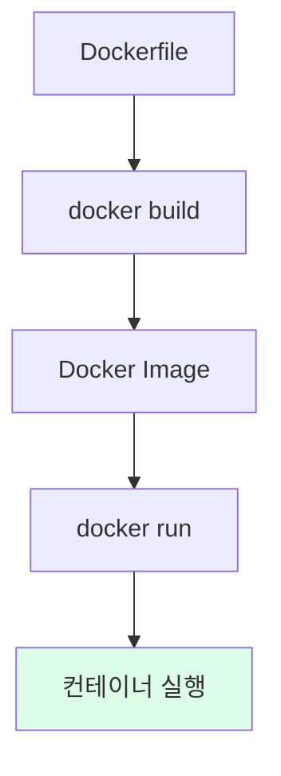

## 21. 배포 옵션

```mermaid
flowchart TD
    A["배포 방식"]

    A --> B["Docker"]
    B --> B1["컨테이너화"]

    A --> C["클라우드"]
    C --> C1["AWS/GCP/Azure"]

    A --> D["서버리스"]
    D --> D1["Lambda/Cloud Run"]

    style A fill:#1e40af,color:#fff
```

## 22. 실습 흐름

```mermaid
flowchart TD
    A["1. 환경 설정"]
    B["2. models.py 작성"]
    C["3. main.py 작성"]
    D["4. 서버 실행"]
    E["5. API 테스트"]
    F["6. 배포"]

    A --> B --> C --> D --> E --> F

    style A fill:#dbeafe
    style F fill:#dcfce7
```

## 23. 핵심 코드 구조

```mermaid
flowchart TD
    A["FastAPI 핵심"]

    A --> B["FastAPI()"]
    B --> B1["앱 인스턴스"]

    A --> C["@app.post()"]
    C --> C1["엔드포인트"]

    A --> D["BaseModel"]
    D --> D1["데이터 검증"]

    style A fill:#1e40af,color:#fff
```

## 24. 전체 과정 요약

```mermaid
flowchart LR
    A["23차시<br>모델 저장"]
    B["24차시<br>AI API"]
    C["25차시<br>LLM API"]
    D["26차시<br>Streamlit"]
    E["28차시<br>FastAPI"]

    A --> B --> C --> D --> E

    style E fill:#dcfce7
```

## 25. ML 서비스 아키텍처

```mermaid
flowchart TD
    A["ML 모델"]
    B["FastAPI 서버"]
    C["REST API"]

    D["웹 앱<br>(Streamlit)"]
    E["다른 시스템"]
    F["모바일 앱"]

    A --> B --> C

    C --> D
    C --> E
    C --> F

    style B fill:#1e40af,color:#fff
```

## 26. 핵심 정리

```mermaid
flowchart TD
    A["28차시 핵심"]

    A --> B["FastAPI"]
    B --> B1["빠른 Python<br>웹 프레임워크"]

    A --> C["Pydantic"]
    C --> C1["자동 데이터<br>검증"]

    A --> D["POST API"]
    D --> D1["예측 서비스<br>엔드포인트"]

    style A fill:#1e40af,color:#fff
```

## 27. 과정 완료

```mermaid
flowchart TD
    A["제조업 AI 과정 완료"]

    A --> B["데이터 분석"]
    A --> C["ML 모델 개발"]
    A --> D["모델 해석"]
    A --> E["배포와 서비스"]

    E --> E1["저장 (joblib)"]
    E --> E2["UI (Streamlit)"]
    E --> E3["API (FastAPI)"]

    style A fill:#1e40af,color:#fff
    style E fill:#dcfce7
```

