# 번외D: ML 워크플로우 종합 실습 - Mermaid 다이어그램

## 1. ML 워크플로우 전체 흐름

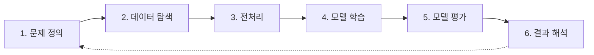

## 2. 분류 vs 회귀 판단

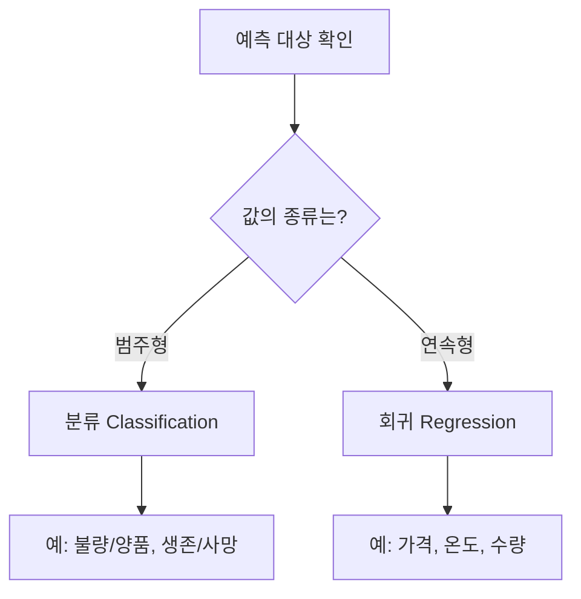

## 3. 타이타닉 문제 분석

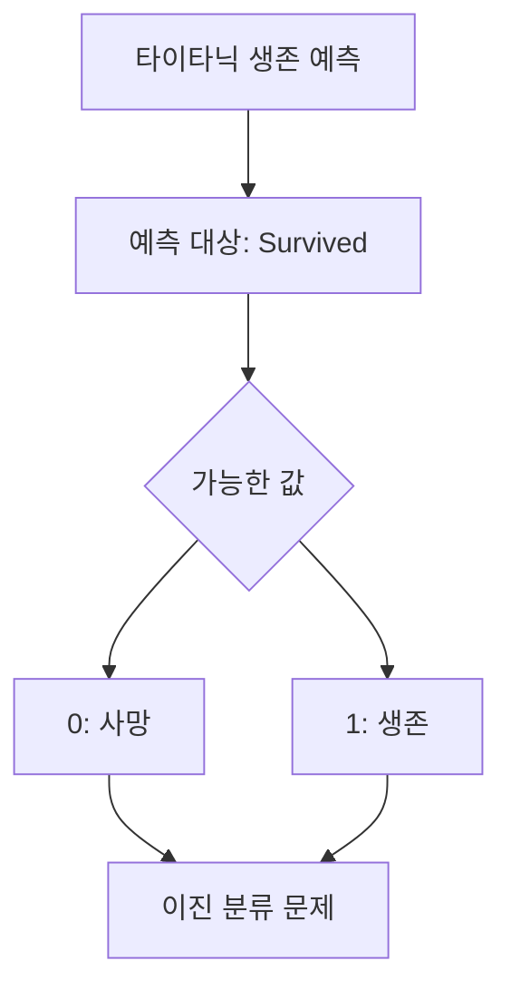

## 4. 데이터 탐색 단계

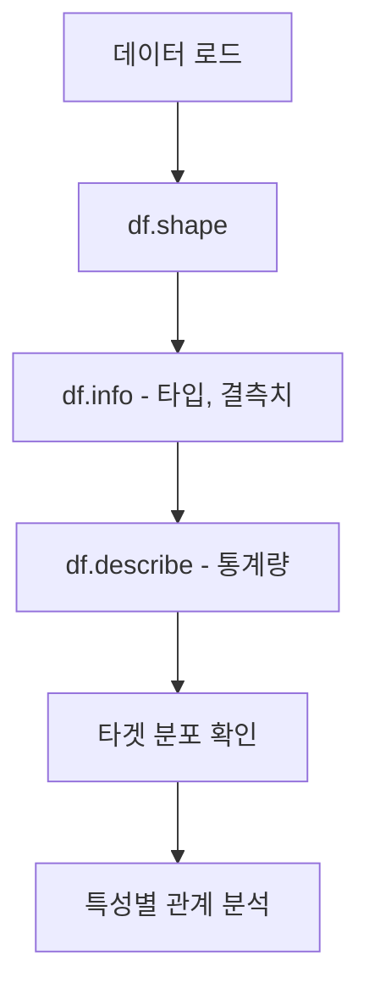

## 5. 결측치 처리 전략

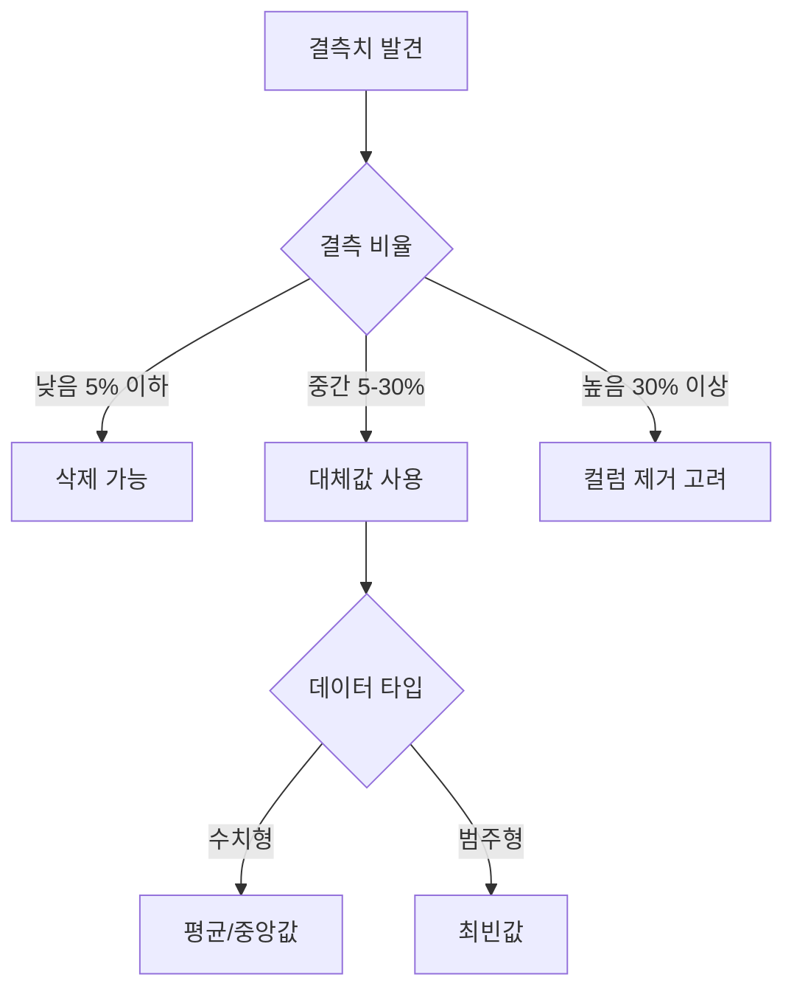

## 6. 연속형 결측치 대체 비교

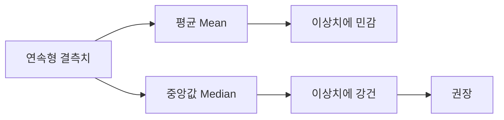

## 7. 범주형 인코딩 방법

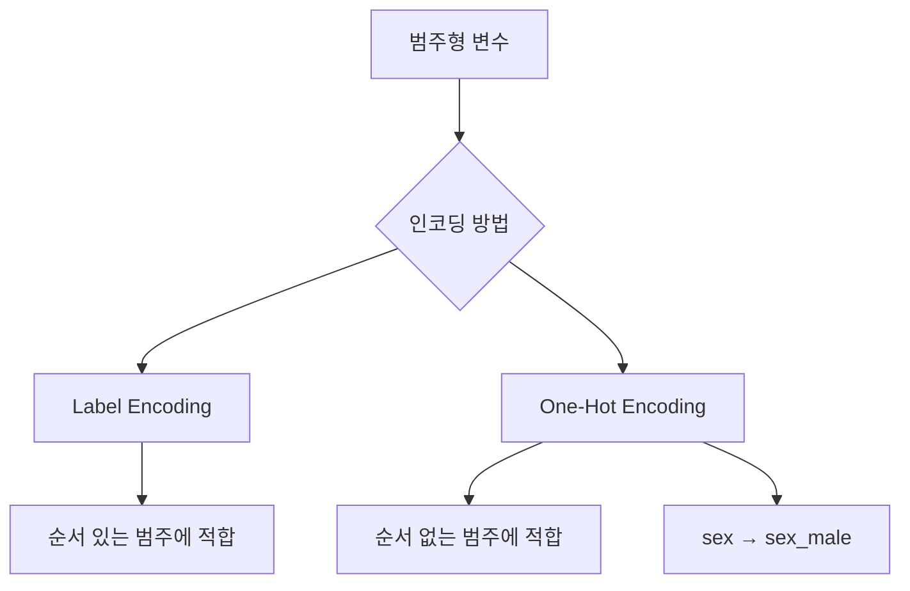

## 8. 데이터 분할 구조

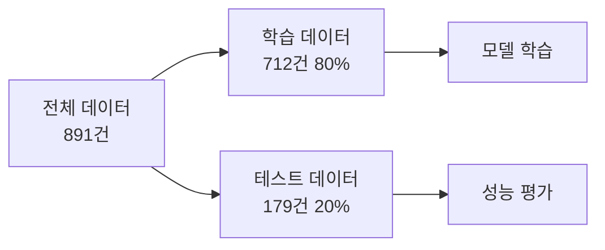

## 9. stratify 옵션 효과

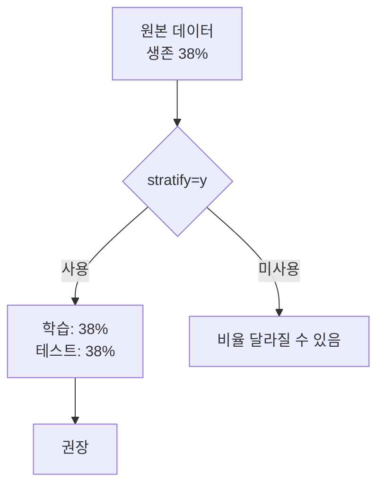

## 10. 3가지 모델 비교

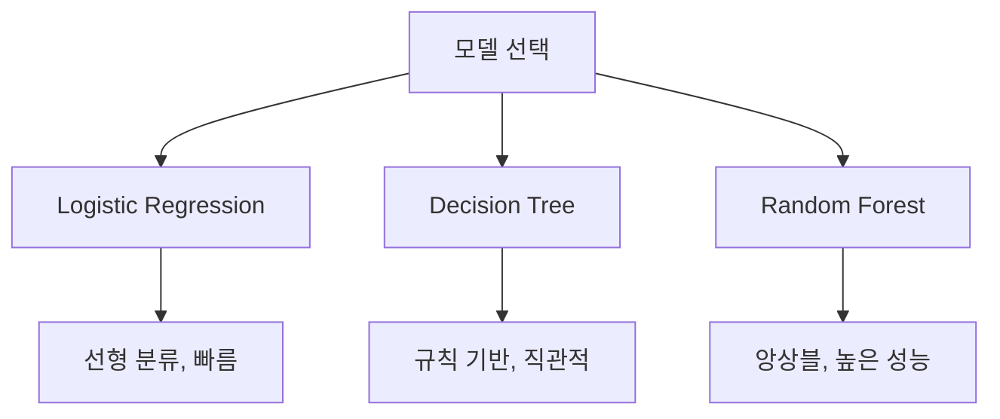

## 11. 모델 학습 흐름

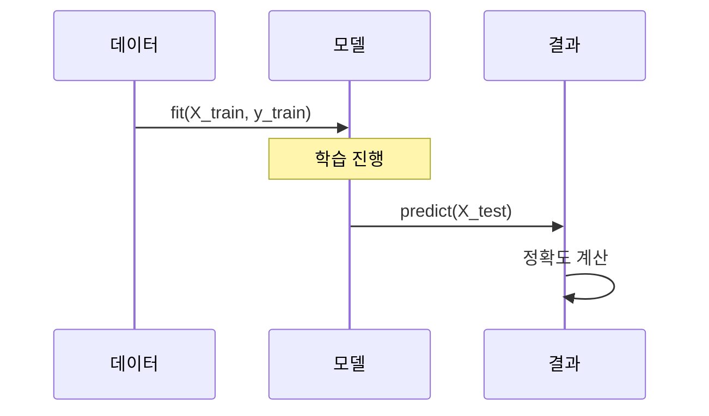

## 12. 혼동 행렬 구조

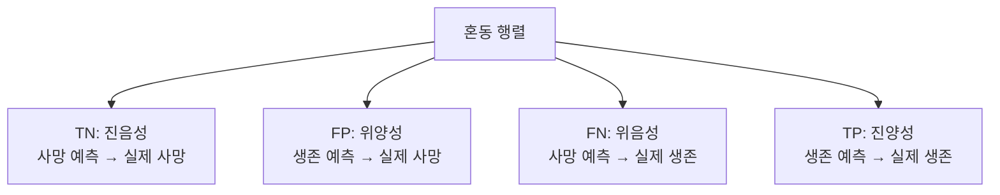

## 13. 평가 지표 관계

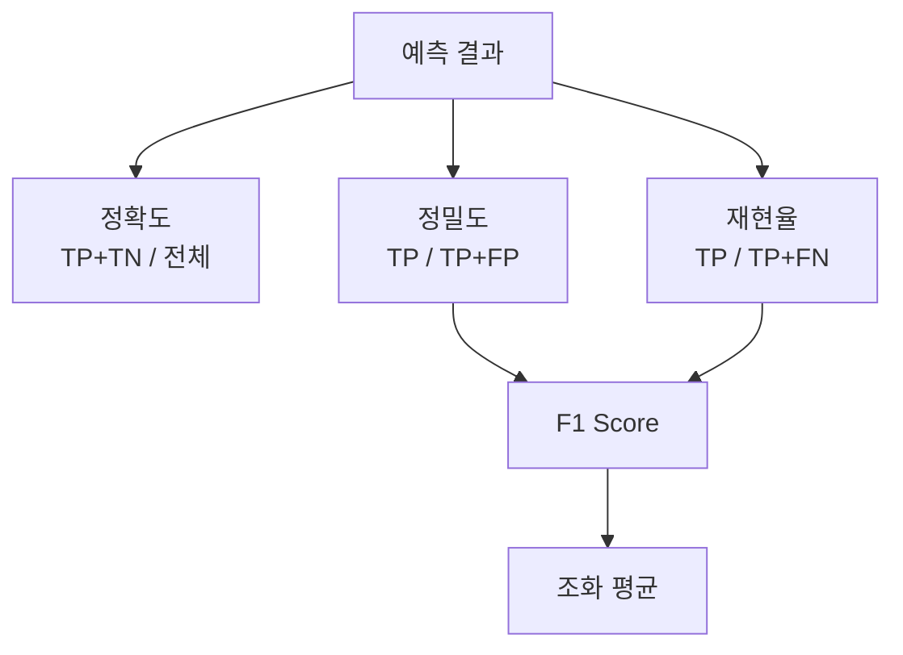

## 14. 상황별 중요 지표

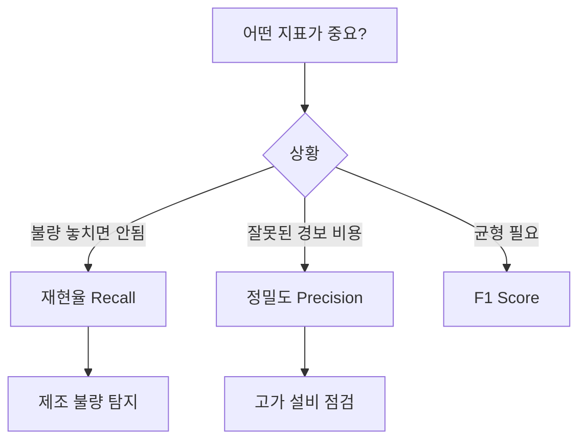

## 15. 특성 중요도 해석

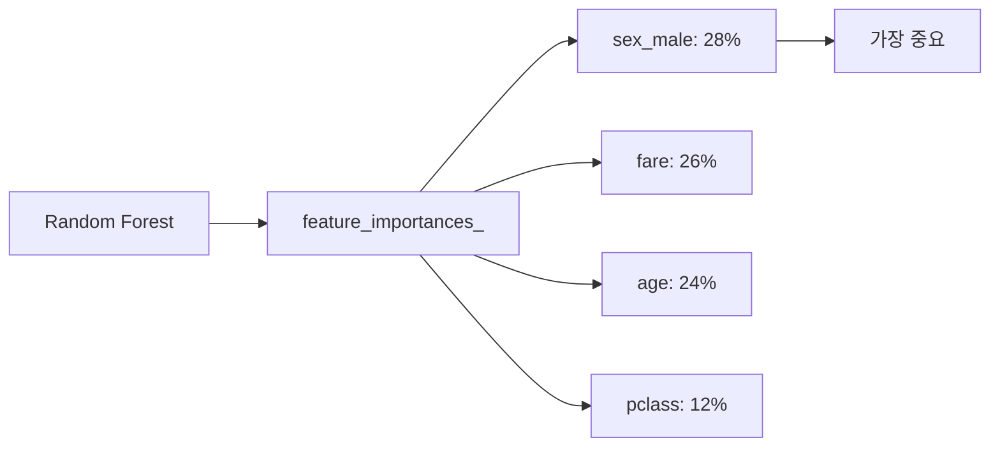

## 16. 비즈니스 인사이트 도출

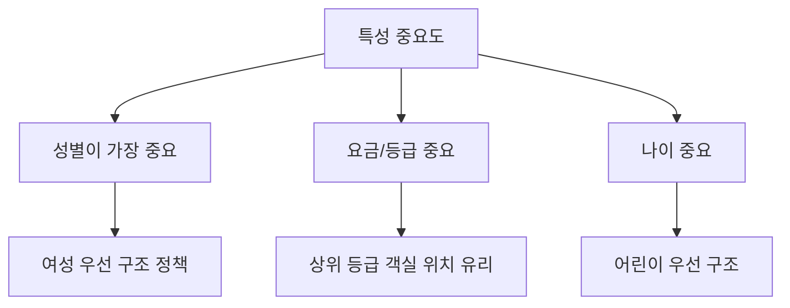

## 17. 제조업 적용 매핑

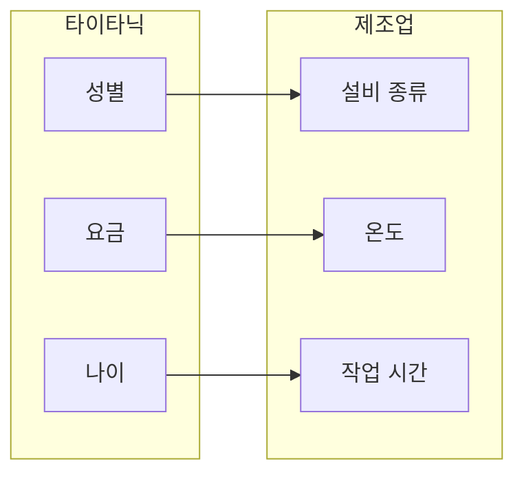

## 18. 전체 코드 흐름

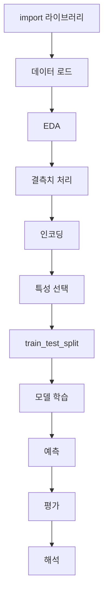

## 19. 체크리스트 마인드맵

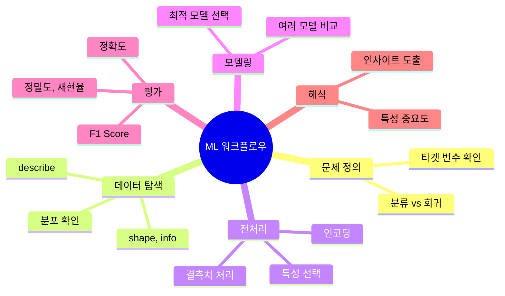

## 20. 학습 경로

