# 번외E: 특성 공학 기초 실습 - Mermaid 다이어그램

## 1. 특성 공학 전체 흐름

## 2. 특성 공학의 종류

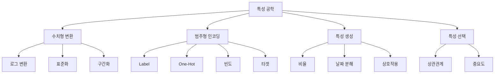

## 3. 좋은 특성의 조건

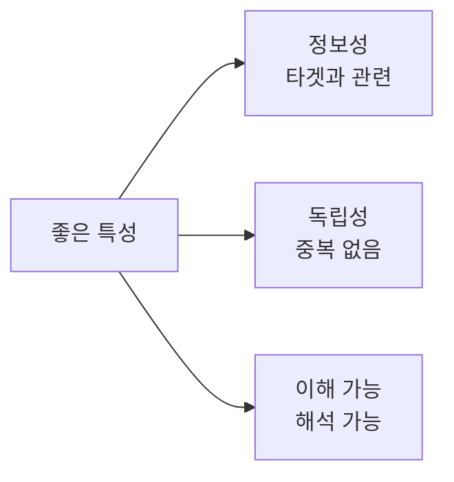

## 4. 로그 변환 효과

## 5. 비율 특성 생성

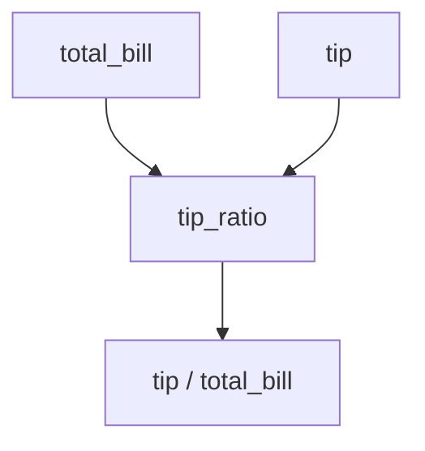

## 6. 1인당 금액 계산

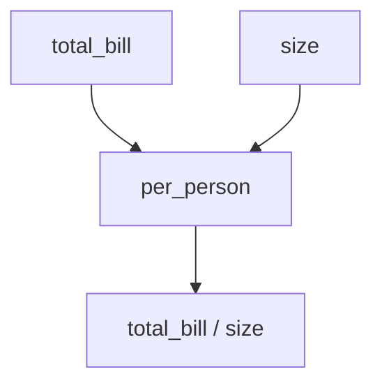

## 7. 구간화 방법 비교

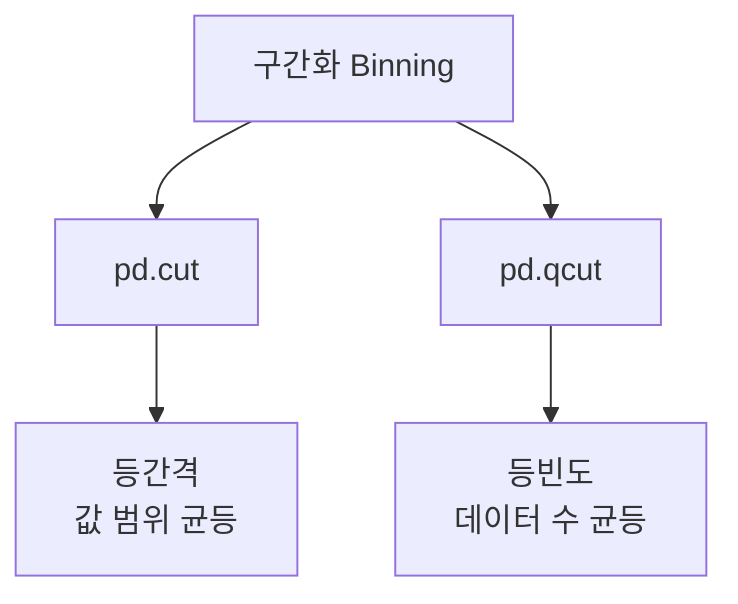

## 8. 빈도 인코딩 과정

## 9. 타겟 인코딩 과정

## 10. 타겟 인코딩 주의사항

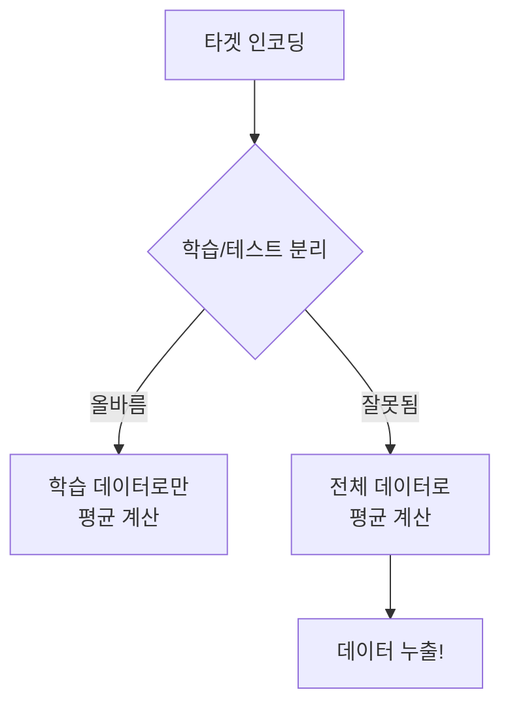

## 11. 날짜 특성 추출

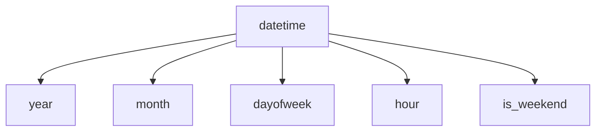

## 12. 주기적 특성 변환

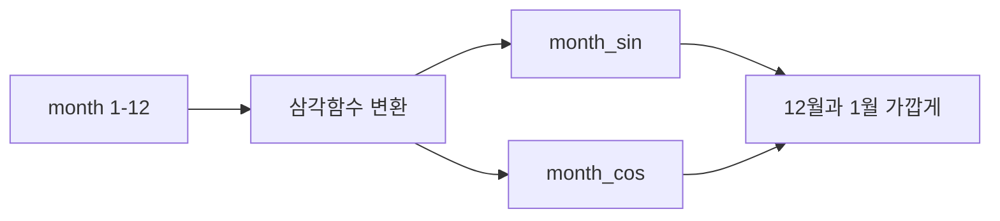

## 13. 특성 선택 방법

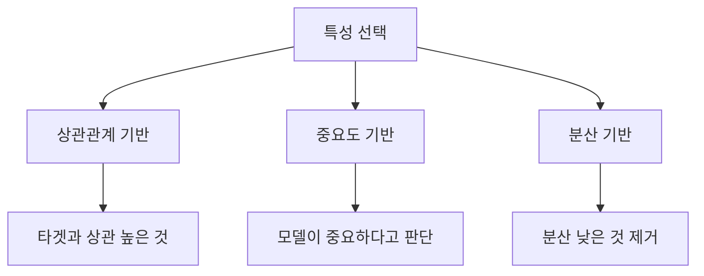

## 14. 상관관계 기반 선택

## 15. 다중공선성 문제

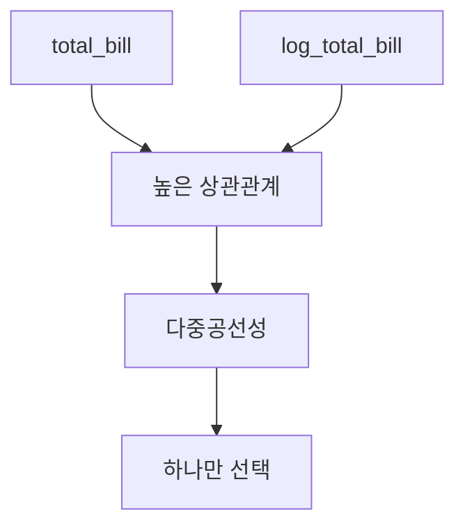

## 16. 성능 비교 실험

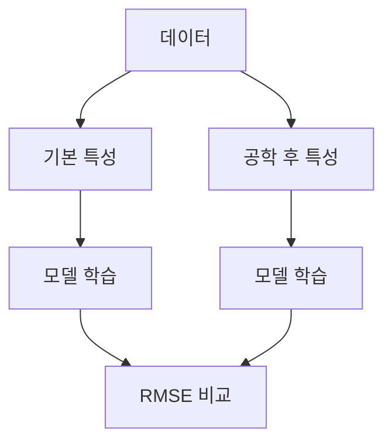

## 17. 특성 공학 체크리스트

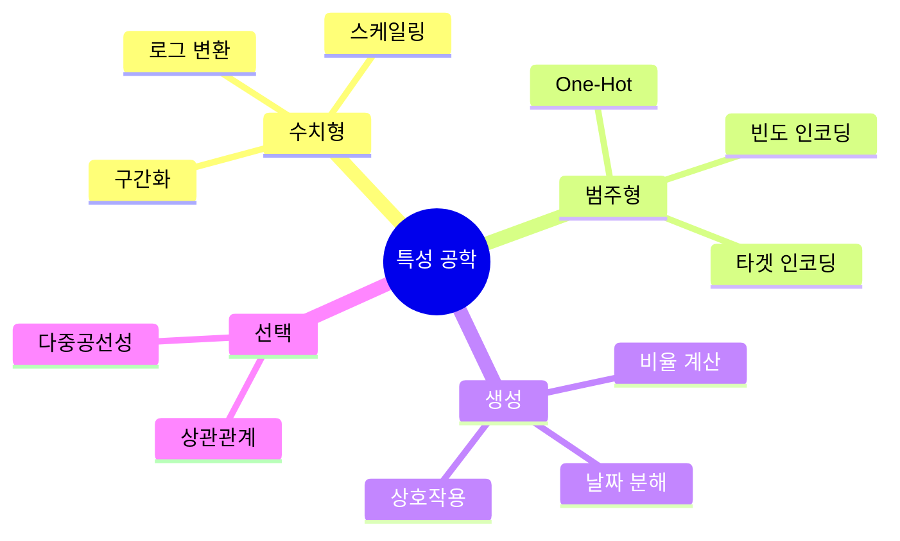

## 18. 전처리 vs 특성 공학

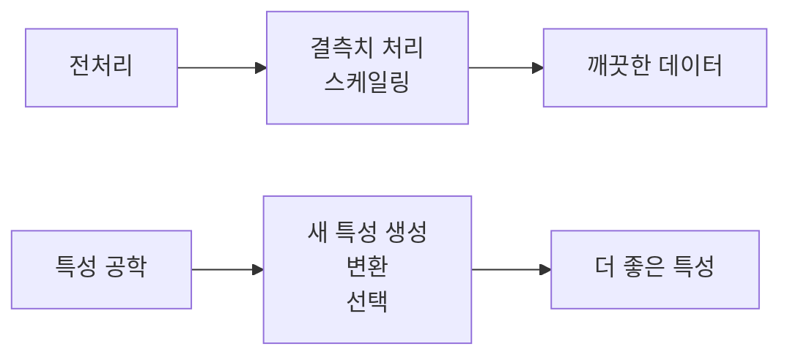

## 19. Tips 데이터 특성 공학 결과

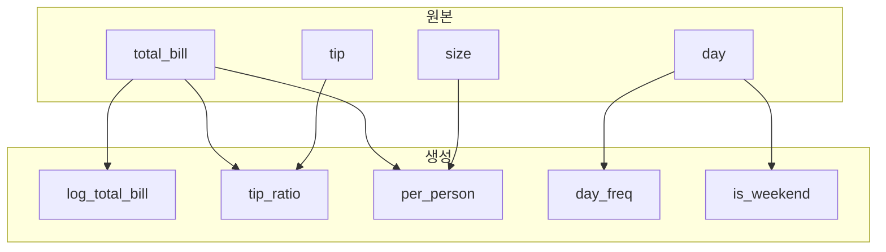

## 20. 학습 경로

