# 번외F: sklearn 핵심 패턴 마스터 - Mermaid 다이어그램

## 1. sklearn 설계 철학

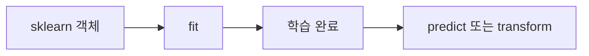

## 2. sklearn 객체 유형

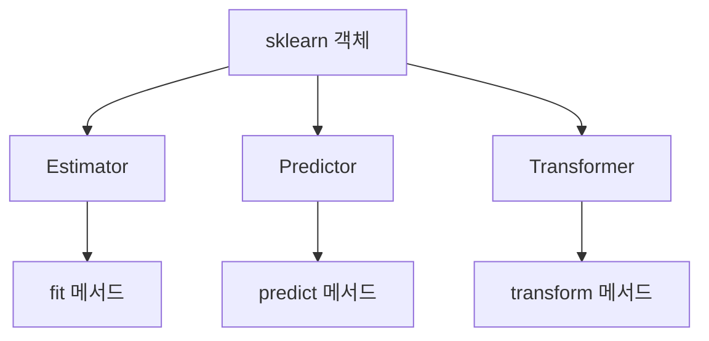

## 3. fit()이 하는 일

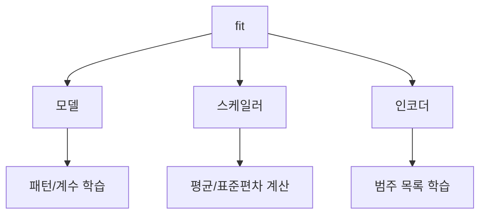

## 4. predict vs transform

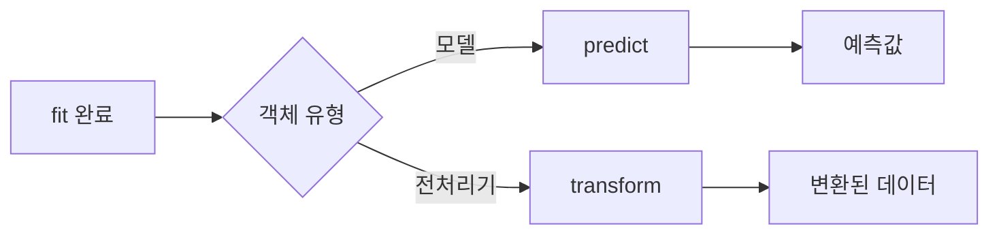

## 5. 올바른 fit/transform 흐름

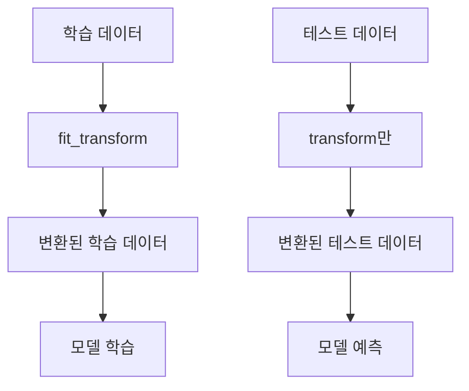

## 6. 잘못된 방법

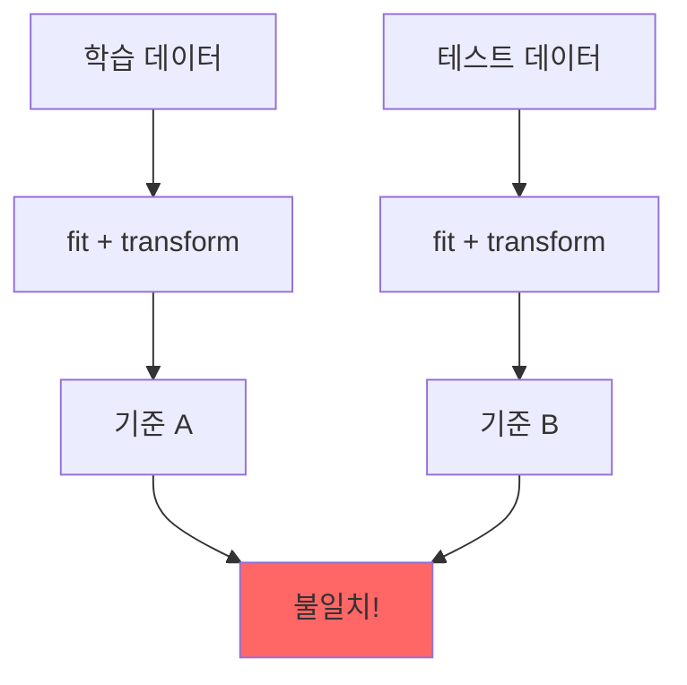

## 7. fit_transform 설명

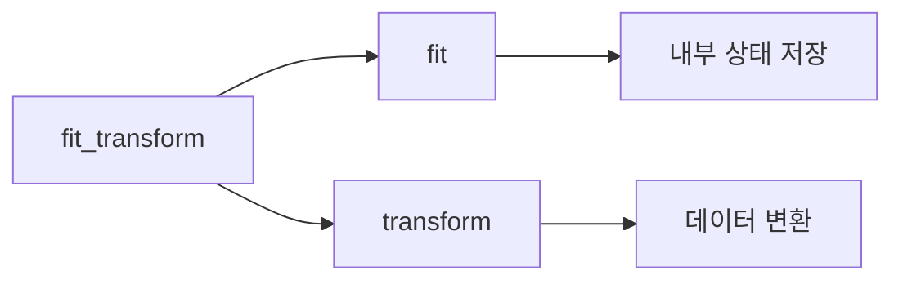

## 8. 전체 ML 워크플로우


## 9. Pipeline 없이 수동 관리

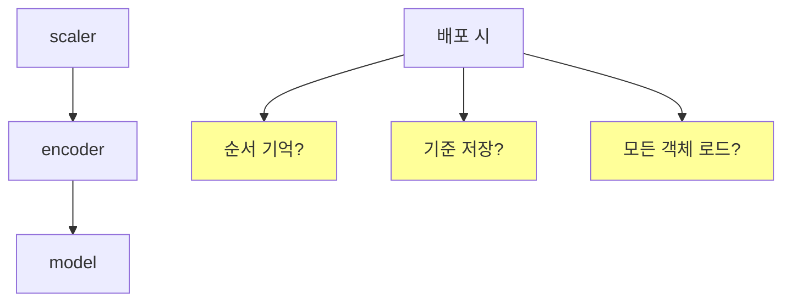

## 10. Pipeline 구조

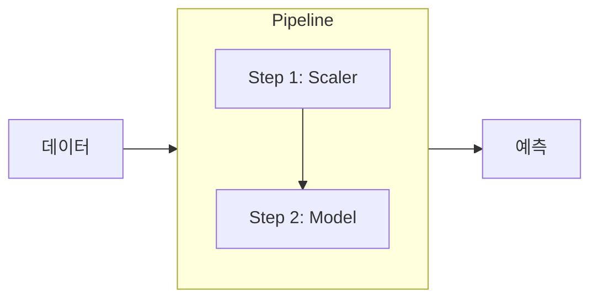

## 11. Pipeline fit() 내부 동작

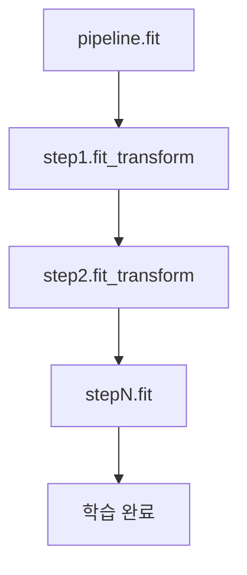

## 12. Pipeline predict() 내부 동작

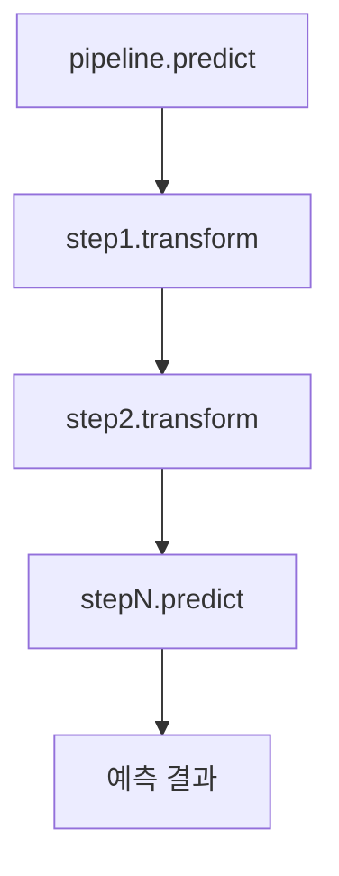

## 13. make_pipeline

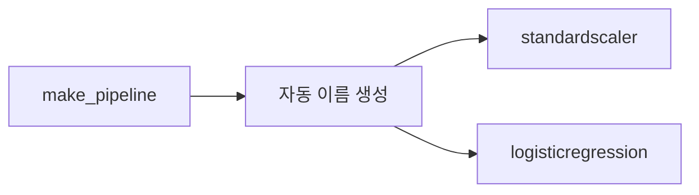

## 14. Pipeline 장점

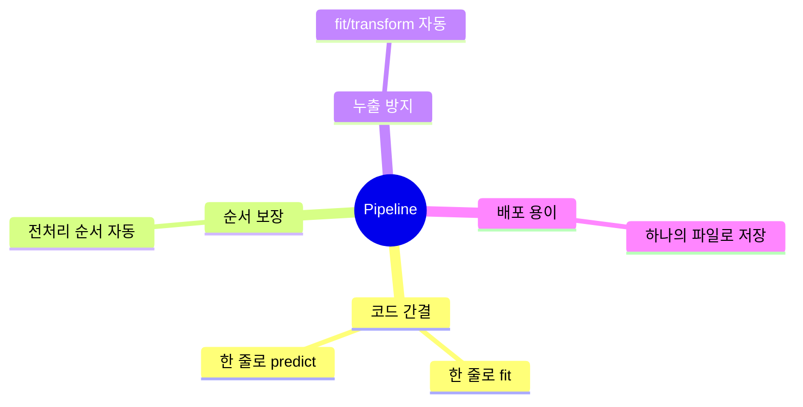

## 15. ColumnTransformer 필요성

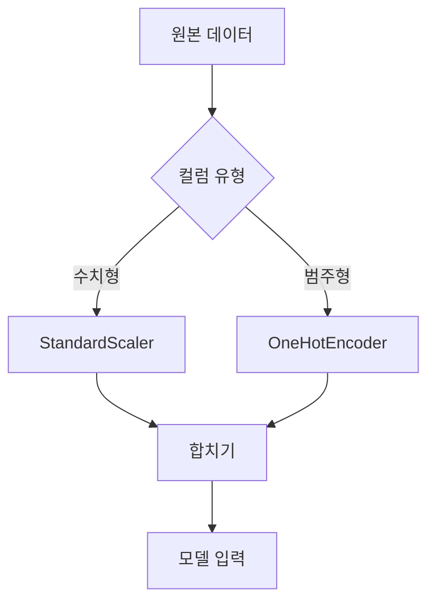

## 16. ColumnTransformer 구조

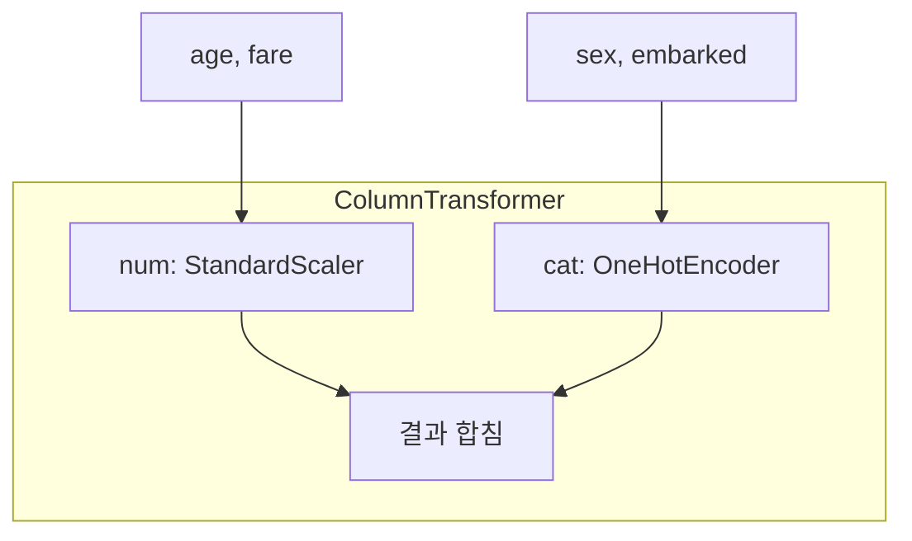

## 17. 전체 Pipeline + ColumnTransformer

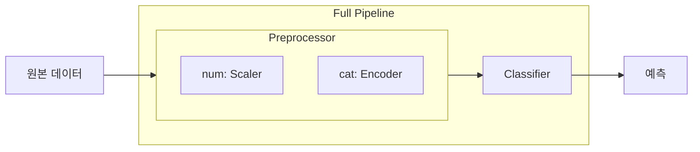

## 18. GridSearchCV + Pipeline

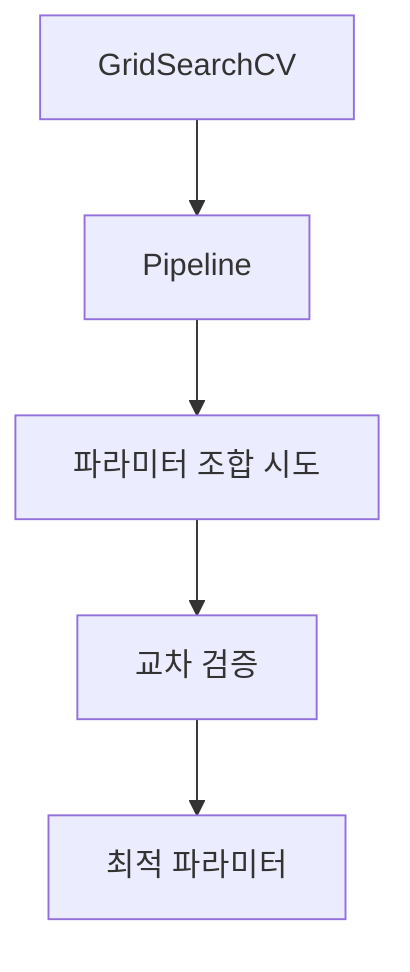

## 19. 모델 저장 및 배포

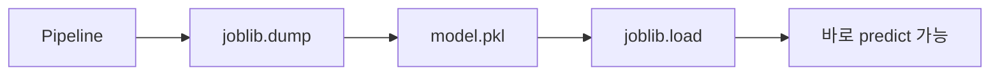

## 20. 핵심 규칙 3가지

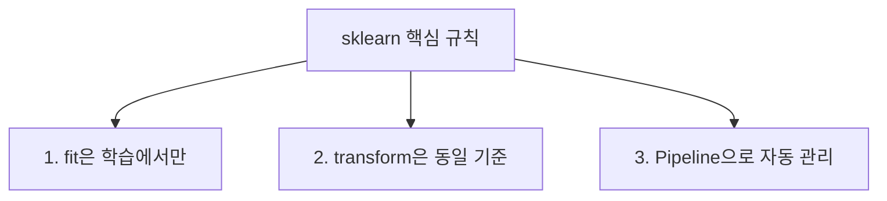

## 21. 메서드 사용 가이드

```mermaid
flowchart TD
    A{데이터 유형} -->|학습| B[fit_transform]
    A -->|테스트| C[transform만]
    D{객체 유형} -->|모델| E[fit + predict]
    D -->|전처리기| F[fit + transform]
```

## 22. sklearn 학습 경로

```mermaid
flowchart LR
    A[번외 D<br>워크플로우] --> B[번외 E<br>특성 공학]
    B --> C[번외 F<br>sklearn 패턴]
    C --> D[12차시~<br>모델 심화]
```
