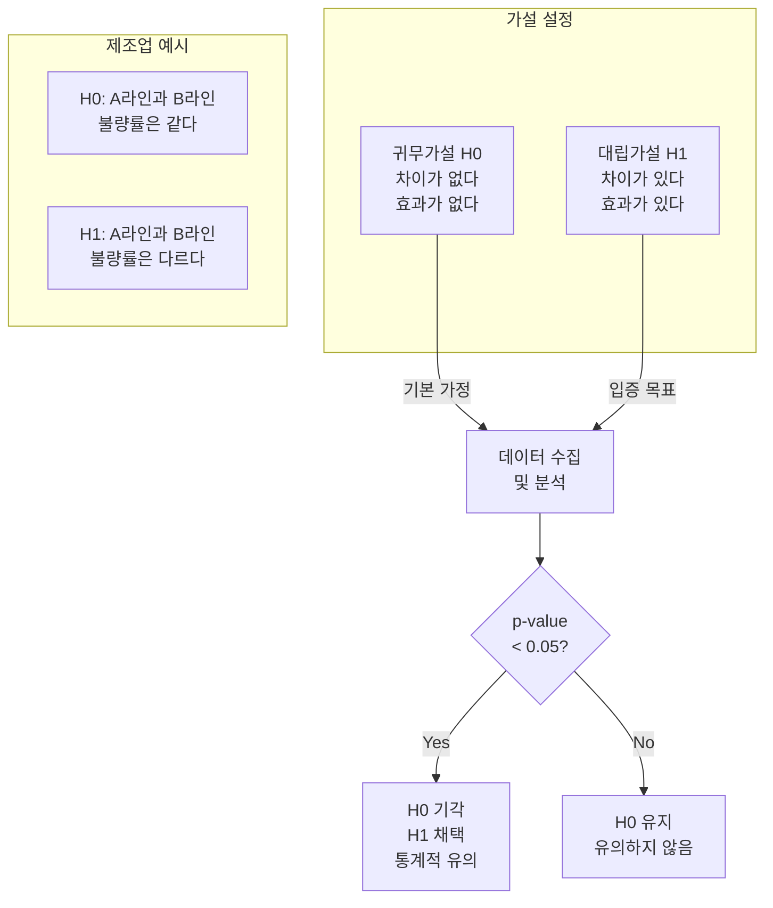
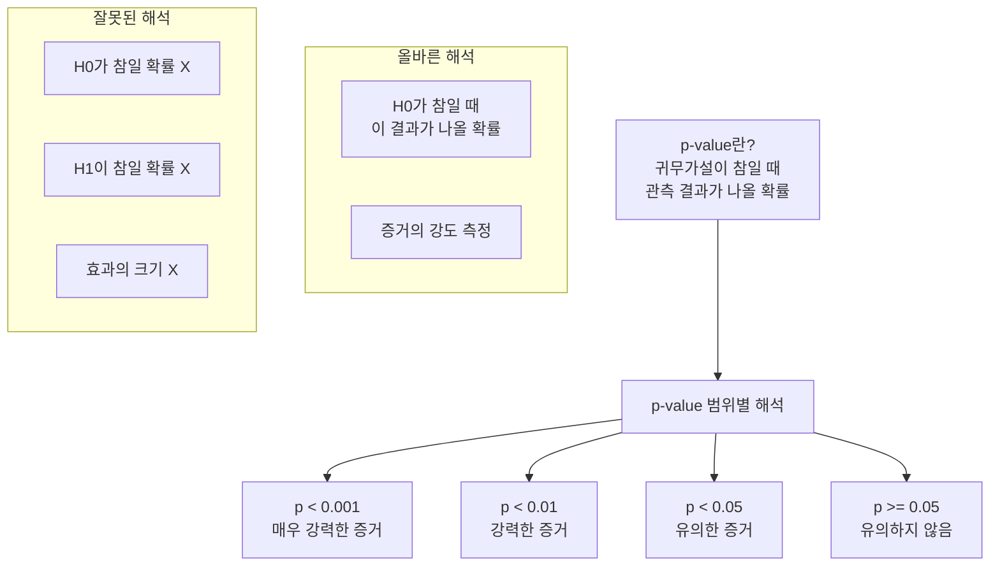
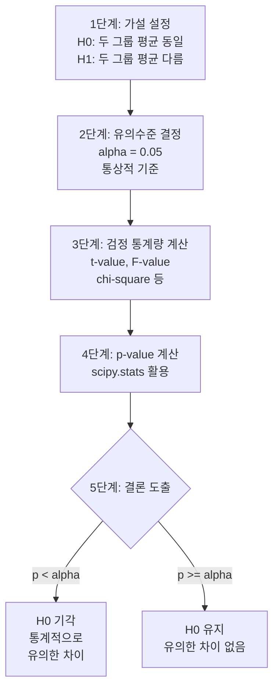
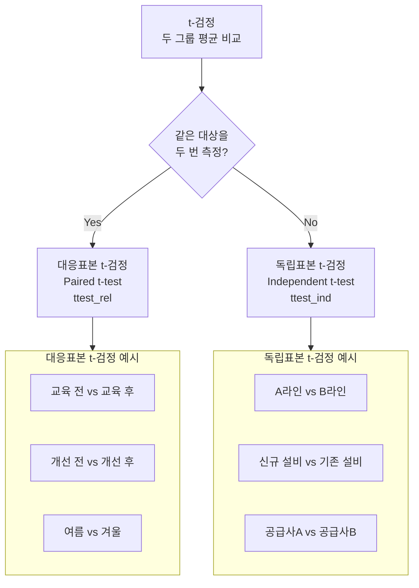
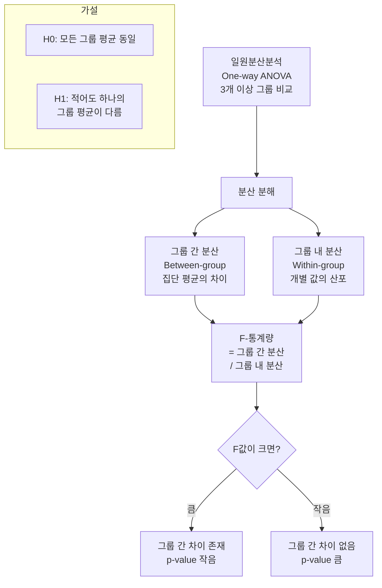
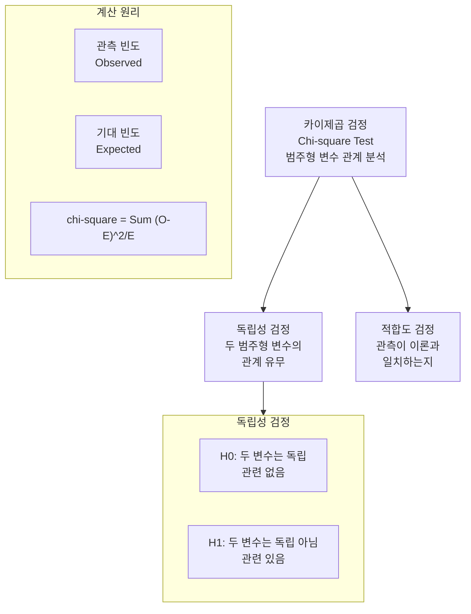
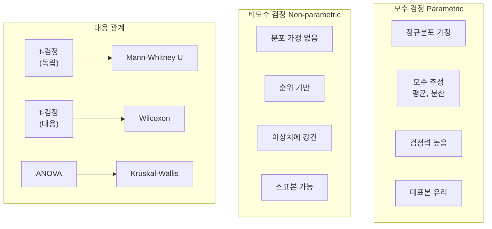
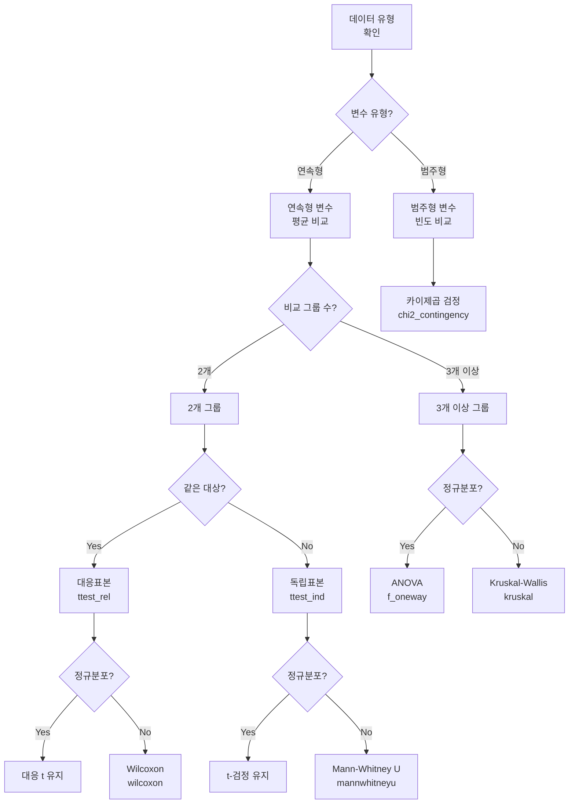

# [7차시] 통계 검정 실습

## 학습 목표

이 차시를 마치면 다음을 수행할 수 있음:

1. **가설검정**의 기본 개념과 p-value를 이해함
2. **t-검정, ANOVA**로 집단 간 평균을 비교함
3. **카이제곱 검정**으로 범주형 변수의 관계를 분석함
4. **비모수 검정**의 활용 상황을 판단함

---

## 강의 구성

| 파트 | 대주제 | 시간 |
|:----:|--------|:----:|
| 1 | 가설검정 기초 | 10분 |
| 2 | 모수 검정 (t-검정, ANOVA) | 10분 |
| 3 | 범주형 데이터 검정 (카이제곱) | 5분 |
| 4 | 비모수 검정 | 5분 |

---

## 실습 데이터셋

| 데이터셋 | 출처 | 용도 |
|----------|------|------|
| **Iris** | sklearn | 품종별 꽃잎 길이 비교 |
| **Titanic** | seaborn | 성별-생존 관계 분석 |
| **Wine Quality** | UCI | 품질 등급별 알코올 함량 비교 |

---

## 환경 설정

### 개념 설명

실습에 필요한 라이브러리를 import함. scipy.stats 모듈에서 다양한 통계 검정 함수를 제공함.

### 실습 코드

```python
import numpy as np
import pandas as pd
import matplotlib.pyplot as plt
import seaborn as sns
from scipy import stats
from scipy.stats import (ttest_ind, ttest_rel, f_oneway,
                         chi2_contingency, mannwhitneyu,
                         wilcoxon, kruskal, shapiro)
from sklearn.datasets import load_iris

# 한글 폰트 설정
plt.rcParams['font.family'] = 'Malgun Gothic'
plt.rcParams['axes.unicode_minus'] = False

# 경고 메시지 숨기기
import warnings
warnings.filterwarnings('ignore')

print("라이브러리 로드 완료!")
```

---

## 데이터 로드

### 실습 코드

```python
# 1) Iris 데이터셋 (붓꽃 데이터)
iris_data = load_iris()
iris = pd.DataFrame(iris_data.data, columns=['sepal_length', 'sepal_width',
                                              'petal_length', 'petal_width'])
iris['species'] = pd.Categorical.from_codes(iris_data.target,
                                             ['setosa', 'versicolor', 'virginica'])

print(f"[1] Iris 데이터셋 로드 완료")
print(f"    - 샘플 수: {len(iris)}")
print(f"    - 품종: {iris['species'].unique().tolist()}")

# 2) Titanic 데이터셋 (타이타닉 생존 데이터)
titanic = sns.load_dataset('titanic')
print(f"\n[2] Titanic 데이터셋 로드 완료")
print(f"    - 샘플 수: {len(titanic)}")
print(f"    - 주요 변수: sex, survived, pclass, age, fare")

# 3) Wine Quality 데이터셋 (와인 품질 데이터)
wine_url = 'https://archive.ics.uci.edu/ml/machine-learning-databases/wine-quality/winequality-red.csv'
wine = pd.read_csv(wine_url, sep=';')
print(f"\n[3] Wine Quality 데이터셋 로드 완료")
print(f"    - 샘플 수: {len(wine)}")
print(f"    - 품질 등급: {sorted(wine['quality'].unique())}")
```

### 결과 해설

- Iris: 150개 샘플, 3개 품종(setosa, versicolor, virginica), 각 품종당 50개 샘플
- Titanic: 891명 승객 정보, 생존 여부와 다양한 속성 포함
- Wine Quality: 1,599개 레드와인 샘플, 품질 등급 3-8

---

# Part 1. 가설검정 기초

## 1.1 왜 통계 검정이 필요한가?

### 개념 설명

제조 현장에서 다양한 비교 질문이 발생함:

| 상황 | 질문 |
|------|------|
| 품질 비교 | "A라인과 B라인 불량률이 정말 다른가?" |
| 공정 개선 | "새 공정으로 품질이 실제로 좋아졌는가?" |
| 원인 분석 | "교대 시간과 불량률은 관련이 있는가?" |
| 효과 검증 | "교육 후 작업 효율이 정말 올랐는가?" |

핵심 문제: "눈으로 보이는 차이"가 "통계적으로 의미 있는 차이"인지 판단해야 함.

---

## 1.2 가설검정이란?

### 개념 설명

데이터를 바탕으로 주장을 검증하는 절차임.



### 핵심 개념 정리

| 용어 | 의미 |
|------|------|
| 귀무가설 (H0) | "차이 없다" - 기본 가정 |
| 대립가설 (H1) | "차이 있다" - 입증하고 싶은 주장 |
| p-value | H0가 참일 때 관측 결과가 나올 확률 |
| 유의수준 (alpha) | 기각 기준, 보통 0.05 |

---

## 1.3 p-value란?

### 개념 설명

귀무가설이 참일 때, 관측 결과가 나올 확률임.



### p-value 해석 주의사항

| 잘못된 해석 | 올바른 해석 |
|------------|------------|
| "H0가 참일 확률" | H0가 참일 때 이 결과가 나올 확률 |
| "H1이 참일 확률" | 결과가 H0와 얼마나 상반되는지 척도 |
| "효과의 크기" | 통계적 유의성만 측정, 효과 크기 아님 |

---

## 1.4 p-value 개념 시연

### 실습 코드

```python
# Iris에서 setosa와 versicolor의 꽃잎 길이(petal_length) 비교
setosa_petal = iris[iris['species'] == 'setosa']['petal_length']
versicolor_petal = iris[iris['species'] == 'versicolor']['petal_length']

print(f"Setosa 꽃잎 길이:")
print(f"  - 평균: {setosa_petal.mean():.2f} cm")
print(f"  - 표준편차: {setosa_petal.std():.2f} cm")
print(f"  - 샘플 수: {len(setosa_petal)}")

print(f"\nVersicolor 꽃잎 길이:")
print(f"  - 평균: {versicolor_petal.mean():.2f} cm")
print(f"  - 표준편차: {versicolor_petal.std():.2f} cm")
print(f"  - 샘플 수: {len(versicolor_petal)}")

# 평균 차이
mean_diff = versicolor_petal.mean() - setosa_petal.mean()
print(f"\n평균 차이: {mean_diff:.2f} cm")

# t-검정 수행
t_stat, p_value = stats.ttest_ind(setosa_petal, versicolor_petal)

print(f"\nt-검정 결과:")
print(f"  - t 통계량: {t_stat:.4f}")
print(f"  - p-value: {p_value:.2e}")

# 해석
alpha = 0.05
if p_value < alpha:
    print(f"\n[결론] p-value({p_value:.2e}) < alpha({alpha})")
    print("       귀무가설 기각: 두 품종의 꽃잎 길이에 통계적으로 유의한 차이가 있음")
else:
    print(f"\n[결론] p-value({p_value:.4f}) >= alpha({alpha})")
    print("       귀무가설 채택: 두 품종의 꽃잎 길이에 유의한 차이 없음")
```

### 결과 해설

- Setosa 평균: 1.46 cm, Versicolor 평균: 4.26 cm
- 평균 차이: 2.80 cm로 눈에 보이는 차이가 큼
- p-value: 약 2.86e-62 (거의 0에 가까움)
- 결론: 매우 강력한 증거로 귀무가설을 기각함. 두 품종의 꽃잎 길이는 통계적으로 유의한 차이가 있음

---

## 1.5 유의수준과 판단 기준

### 개념 설명

유의수준(alpha) = H0를 기각하기 위한 p-value 기준임.

| alpha 값 | 의미 | 사용 상황 |
|------|------|----------|
| **0.05** | 5% | 일반적 연구 (가장 보편적) |
| 0.01 | 1% | 엄격한 기준 필요 시 |
| 0.10 | 10% | 탐색적 분석 |

**판단 규칙:**
- **p < alpha**: H0 기각 -> "통계적으로 유의함"
- **p >= alpha**: H0 기각 못함 -> "유의하지 않음"

---

## 1.6 가설검정 5단계 절차



---

# Part 2. 모수 검정

## 2.1 모수 검정이란?

### 개념 설명

정규분포를 가정하는 검정 방법임.

**전제 조건:**
- 데이터가 **정규분포**를 따름
- 모집단의 **모수**(평균, 분산)를 추정

**대표적 검정 방법:**

| 검정 | 목적 | 비교 그룹 수 |
|------|------|-------------|
| **독립표본 t-검정** | 두 그룹 평균 비교 | 2개 (독립) |
| **대응표본 t-검정** | 전후 평균 비교 | 2개 (쌍) |
| **일원분산분석 (ANOVA)** | 여러 그룹 평균 비교 | 3개 이상 |

---

## 2.2 독립표본 t-검정

### 개념 설명

서로 다른 두 그룹의 평균을 비교함.



### 실습 코드

```python
# 독립표본 t-검정: Iris - Setosa vs Versicolor 꽃잎 길이

# 정규성 검정 (Shapiro-Wilk test)
print("[Step 1] 정규성 검정 (Shapiro-Wilk test)")
_, p_setosa = stats.shapiro(setosa_petal)
_, p_versi = stats.shapiro(versicolor_petal)

print(f"  Setosa p-value: {p_setosa:.4f}", end="")
print(" -> 정규분포 따름" if p_setosa >= 0.05 else " -> 정규분포 아님")
print(f"  Versicolor p-value: {p_versi:.4f}", end="")
print(" -> 정규분포 따름" if p_versi >= 0.05 else " -> 정규분포 아님")

# 등분산성 검정 (Levene's test)
print("\n[Step 2] 등분산성 검정 (Levene's test)")
_, p_levene = stats.levene(setosa_petal, versicolor_petal)
print(f"  Levene p-value: {p_levene:.4f}", end="")
print(" -> 등분산" if p_levene >= 0.05 else " -> 이분산")

# 독립표본 t-검정 수행
print("\n[Step 3] 독립표본 t-검정 (scipy.stats.ttest_ind)")

# equal_var 파라미터: True=등분산 가정, False=이분산 가정(Welch's t-test)
t_stat, p_value = stats.ttest_ind(setosa_petal, versicolor_petal,
                                   equal_var=(p_levene >= 0.05))

print(f"\n  가설 설정:")
print(f"    H0: setosa 평균 = versicolor 평균 (평균 차이 없음)")
print(f"    H1: setosa 평균 != versicolor 평균 (평균 차이 있음)")

print(f"\n  결과:")
print(f"    t 통계량: {t_stat:.4f}")
print(f"    p-value: {p_value:.2e}")

print(f"\n  결론:", end=" ")
if p_value < 0.05:
    print("통계적으로 유의한 차이가 있음 (p < 0.05)")
    print(f"         Setosa(평균 {setosa_petal.mean():.2f}cm)와")
    print(f"         Versicolor(평균 {versicolor_petal.mean():.2f}cm)의")
    print(f"         꽃잎 길이는 유의하게 다름")
else:
    print("통계적으로 유의한 차이 없음 (p >= 0.05)")
```

### 결과 해설

- 정규성 검정: 두 그룹 모두 정규분포를 따름
- 등분산성 검정: 두 그룹의 분산이 다름 (이분산)
- t-검정 결과: p-value가 매우 작음 (약 1e-31)
- 결론: 두 품종의 꽃잎 길이에 통계적으로 유의한 차이가 있음

---

## 2.3 추가 예제: Titanic 요금 비교

### 실습 코드

```python
# Titanic - 생존자 vs 사망자의 요금(fare) 비교
survived_fare = titanic[titanic['survived'] == 1]['fare'].dropna()
died_fare = titanic[titanic['survived'] == 0]['fare'].dropna()

print(f"생존자 요금: 평균 {survived_fare.mean():.2f}, 중앙값 {survived_fare.median():.2f}")
print(f"사망자 요금: 평균 {died_fare.mean():.2f}, 중앙값 {died_fare.median():.2f}")

t_stat, p_value = stats.ttest_ind(survived_fare, died_fare, equal_var=False)
print(f"\nWelch's t-검정 결과:")
print(f"  t 통계량: {t_stat:.4f}")
print(f"  p-value: {p_value:.4f}")

if p_value < 0.05:
    print("\n  결론: 생존자와 사망자의 요금에 유의한 차이가 있음")
    print("        (비싼 티켓 구매자의 생존율이 더 높았을 수 있음)")
```

### 결과 해설

- 생존자 평균 요금이 사망자보다 높음
- 통계적으로 유의한 차이가 있음
- 해석: 객실 등급이 높은(요금이 비싼) 승객의 생존율이 더 높았음을 시사함

---

## 2.4 대응표본 t-검정

### 개념 설명

동일 대상의 전후 측정값을 비교함.

| 비교 대상 | 예시 |
|----------|------|
| 교육 효과 | 같은 작업자의 교육 전후 생산성 |
| 공정 개선 | 같은 설비의 개선 전후 불량률 |
| 계절 효과 | 같은 라인의 여름/겨울 품질 |

### 실습 코드

```python
# Iris 전체 데이터에서 sepal_length와 petal_length 비교
# (개념 이해용 예제)
sepal = iris['sepal_length'].values
petal = iris['petal_length'].values

print(f"꽃받침(sepal) 길이: 평균 {sepal.mean():.2f} cm")
print(f"꽃잎(petal) 길이: 평균 {petal.mean():.2f} cm")
print(f"차이: 평균 {(sepal - petal).mean():.2f} cm")

# 대응표본 t-검정
t_stat, p_value = stats.ttest_rel(sepal, petal)

print(f"\n대응표본 t-검정 (scipy.stats.ttest_rel) 결과:")
print(f"  t 통계량: {t_stat:.4f}")
print(f"  p-value: {p_value:.2e}")

if p_value < 0.05:
    print("\n  결론: 꽃받침과 꽃잎의 길이에 유의한 차이가 있음")
```

### 결과 해설

- 꽃받침(sepal)과 꽃잎(petal) 길이 간에 유의한 차이가 있음
- 같은 꽃에서 측정된 두 부위의 길이가 통계적으로 다름

---

## 2.5 일원분산분석 (One-way ANOVA)

### 개념 설명

3개 이상 그룹의 평균을 비교함.



### 실습 코드

```python
# Wine Quality 데이터에서 품질 등급별 그룹 생성
quality_groups = []
quality_labels = sorted(wine['quality'].unique())

print(f"품질 등급별 알코올 함량:")
for q in quality_labels:
    group = wine[wine['quality'] == q]['alcohol']
    quality_groups.append(group)
    print(f"  등급 {q}: 평균 {group.mean():.2f}%, 샘플 수 {len(group)}")

# One-way ANOVA
f_stat, p_value = stats.f_oneway(*quality_groups)

print(f"\n가설 설정:")
print(f"  H0: 모든 품질 등급의 알코올 함량 평균이 동일")
print(f"  H1: 적어도 하나의 품질 등급의 알코올 함량이 다름")

print(f"\nOne-way ANOVA (scipy.stats.f_oneway) 결과:")
print(f"  F 통계량: {f_stat:.4f}")
print(f"  p-value: {p_value:.2e}")

if p_value < 0.05:
    print("\n  결론: 품질 등급에 따라 알코올 함량에 유의한 차이가 있음")
    print("        사후검정(Post-hoc test)으로 어떤 그룹 간 차이인지 확인 필요")
```

### 결과 해설

- F 통계량이 크고 p-value가 매우 작음
- 결론: 와인 품질 등급에 따라 알코올 함량이 유의하게 다름
- 주의: ANOVA는 "차이가 있다"만 알려줌. 어느 그룹 간 차이인지는 사후분석 필요

---

## 2.6 Tukey HSD 사후검정

### 개념 설명

ANOVA에서 유의한 결과가 나온 후, 어떤 그룹 간에 차이가 있는지 확인함.

### 실습 코드

```python
from scipy.stats import tukey_hsd
from statsmodels.stats.multicomp import pairwise_tukeyhsd

# Tukey HSD 수행
result = tukey_hsd(*quality_groups)

print("Tukey HSD 결과 (일부 주요 비교):")
print("-" * 40)

# 결과 출력 (품질 등급 간 비교)
for i in range(len(quality_labels)):
    for j in range(i+1, len(quality_labels)):
        p_val = result.pvalue[i, j]
        if p_val < 0.05:
            print(f"등급 {quality_labels[i]} vs {quality_labels[j]}: p = {p_val:.4f} *")

print("\n* 표시: 통계적으로 유의한 차이 (p < 0.05)")

# statsmodels를 사용한 더 상세한 결과
print("\n[statsmodels를 사용한 Tukey HSD - 상세 결과]")
tukey = pairwise_tukeyhsd(wine['alcohol'], wine['quality'], alpha=0.05)
print(tukey.summary())
```

### 결과 해설

- 사후분석을 통해 어느 품질 등급 간에 유의한 차이가 있는지 확인할 수 있음
- reject=True인 쌍은 통계적으로 유의한 차이가 있는 그룹임
- 다중비교 보정이 적용되어 1종 오류가 제어됨

---

## 2.7 모수 검정 요약

| 검정 | 함수 | 사용 상황 |
|------|------|----------|
| 독립표본 t-검정 | `ttest_ind()` | 두 독립 그룹 평균 비교 |
| 대응표본 t-검정 | `ttest_rel()` | 동일 대상 전후 비교 |
| 일원분산분석 | `f_oneway()` | 3개 이상 그룹 비교 |

### 핵심 코드

```python
from scipy import stats

# 독립표본 t-검정
t, p = stats.ttest_ind(group1, group2)

# 대응표본 t-검정
t, p = stats.ttest_rel(before, after)

# ANOVA
f, p = stats.f_oneway(g1, g2, g3)
```

---

# Part 3. 범주형 데이터 검정

## 3.1 카이제곱 검정이란?

### 개념 설명

범주형 변수 간의 관계를 분석함.



| 유형 | 목적 | 예시 |
|------|------|------|
| 독립성 검정 | 두 범주형 변수의 관계 | 성별 vs 생존 |
| 적합도 검정 | 관측이 이론과 일치하는지 | 불량 유형 분포 |

---

## 3.2 교차표 만들기

### 개념 설명

두 범주형 변수의 빈도를 집계한 표임.

### 실습 코드

```python
# Titanic - 성별과 생존여부 분석

# 교차표(Contingency Table) 생성
print("[Step 1] 교차표(Contingency Table) 생성")
contingency_table = pd.crosstab(titanic['sex'], titanic['survived'],
                                 margins=True, margins_name='Total')
contingency_table.columns = ['사망(0)', '생존(1)', 'Total']
print(contingency_table)

# 비율 확인
print("\n[Step 2] 성별별 생존율")
survival_rate = titanic.groupby('sex')['survived'].mean() * 100
print(f"  여성 생존율: {survival_rate['female']:.1f}%")
print(f"  남성 생존율: {survival_rate['male']:.1f}%")
```

### 결과 해설

- 여성 생존율: 약 74.2%
- 남성 생존율: 약 18.9%
- 눈에 보이는 큰 차이가 있음. 이것이 통계적으로 유의한지 검정 필요

---

## 3.3 카이제곱 검정 수행

### 실습 코드

```python
# 카이제곱 검정 수행
print("[Step 3] 카이제곱 검정 (scipy.stats.chi2_contingency)")

# margins 제외한 교차표
ct = pd.crosstab(titanic['sex'], titanic['survived'])
chi2, p_value, dof, expected = stats.chi2_contingency(ct)

print(f"\n  가설 설정:")
print(f"    H0: 성별과 생존여부는 독립 (관련 없음)")
print(f"    H1: 성별과 생존여부는 독립이 아님 (관련 있음)")

print(f"\n  결과:")
print(f"    카이제곱 통계량: {chi2:.4f}")
print(f"    자유도(df): {dof}")
print(f"    p-value: {p_value:.2e}")

print(f"\n  기대 빈도표:")
expected_df = pd.DataFrame(expected,
                           index=['female', 'male'],
                           columns=['사망(0)', '생존(1)'])
print(expected_df.round(2))

if p_value < 0.05:
    print(f"\n  결론: 성별과 생존여부는 통계적으로 유의한 관련이 있음")
    print("        여성의 생존율이 남성보다 유의하게 높았음")
```

### 결과 해설

- 카이제곱 통계량: 260.72 (매우 큰 값)
- p-value: 거의 0 (약 1.2e-58)
- 결론: 성별과 생존 여부는 통계적으로 매우 강한 관련이 있음
- 기대 빈도와 관측 빈도의 차이가 매우 큼

---

## 3.4 추가 예제: 객실 등급과 생존

### 실습 코드

```python
# Titanic - 객실 등급(pclass)과 생존여부의 관계
ct_class = pd.crosstab(titanic['pclass'], titanic['survived'])
print("교차표:")
print(ct_class)

chi2, p_value, dof, expected = stats.chi2_contingency(ct_class)
print(f"\n카이제곱 검정 결과:")
print(f"  카이제곱 통계량: {chi2:.4f}")
print(f"  p-value: {p_value:.2e}")

print(f"\n등급별 생존율:")
for pclass in [1, 2, 3]:
    rate = titanic[titanic['pclass'] == pclass]['survived'].mean() * 100
    print(f"  {pclass}등급: {rate:.1f}%")

if p_value < 0.05:
    print(f"\n결론: 객실 등급과 생존여부는 유의한 관련이 있음")
    print("      상위 등급 승객의 생존율이 더 높았음")
```

### 결과 해설

- 1등급 생존율: 약 63%
- 2등급 생존율: 약 47%
- 3등급 생존율: 약 24%
- 객실 등급과 생존 여부 사이에 통계적으로 유의한 관련이 있음

---

## 3.5 카이제곱 검정 요약

### 핵심 개념

- **교차표**: 두 범주형 변수의 빈도 집계
- **기대 빈도**: 변수가 독립일 때 예상되는 빈도
- **카이제곱 통계량**: 관측과 기대의 차이 측정

### 핵심 코드

```python
from scipy.stats import chi2_contingency

# 교차표 생성
crosstab = pd.crosstab(df['var1'], df['var2'])

# 카이제곱 검정
chi2, p_value, dof, expected = chi2_contingency(crosstab)

# 해석: p < 0.05 -> 두 변수는 관련이 있음
```

---

# Part 4. 비모수 검정

## 4.1 비모수 검정이란?

### 개념 설명

정규분포를 가정하지 않는 검정 방법임.

**언제 사용하는가?**
- 데이터가 **정규분포를 따르지 않을 때**
- **표본 크기가 작을 때** (n < 30)
- **순서형 데이터**일 때
- **이상치가 많을 때**



### 장단점 비교

| 장점 | 단점 |
|------|------|
| 분포 가정 불필요 | 모수 검정보다 검정력 낮음 |
| 이상치에 강건함 | 순위만 사용하여 정보 손실 |
| 표본 크기 작아도 됨 | 해석이 덜 직관적 |

---

## 4.2 정규성 검정 (Shapiro-Wilk)

### 개념 설명

데이터가 정규분포를 따르는지 검정함. 모수 검정과 비모수 검정 중 어떤 것을 사용할지 결정하는 데 활용됨.

**가설:**
- H0: 데이터가 정규분포를 따름
- H1: 데이터가 정규분포를 따르지 않음
- p < 0.05: 정규분포가 아님 -> 비모수 검정 사용 권장

### 실습 코드

```python
from scipy.stats import shapiro

# Titanic fare 데이터의 정규성 검정
fare_data = titanic['fare'].dropna()

# 샘플 크기가 5000 초과시 오류 발생하므로 일부 샘플링
sample_fare = fare_data.sample(min(len(fare_data), 500), random_state=42)

stat, p_value = stats.shapiro(sample_fare)

print(f"Titanic 요금(fare) 정규성 검정:")
print(f"  표본 크기: {len(sample_fare)}")
print(f"  Shapiro-Wilk 통계량: {stat:.4f}")
print(f"  p-value: {p_value:.4f}")

if p_value < 0.05:
    print(f"\n  결론: 요금 데이터는 정규분포를 따르지 않음 (p < 0.05)")
    print("        비모수 검정 사용 권장")
else:
    print(f"\n  결론: 요금 데이터는 정규분포를 따름 (p >= 0.05)")

# Wine Quality 데이터 정규성 검정
print(f"\n\nWine Quality 주요 변수 정규성 검정:")
print("-" * 40)

wine_vars = ['alcohol', 'pH', 'residual sugar', 'quality']
for var in wine_vars:
    sample = wine[var].sample(min(len(wine), 500), random_state=42)
    stat, p_val = stats.shapiro(sample)
    normal = "정규분포" if p_val >= 0.05 else "비정규분포"
    print(f"  {var}: p = {p_val:.4f} -> {normal}")
```

### 결과 해설

- Titanic fare: 정규분포를 따르지 않음 -> 비모수 검정 권장
- Wine 변수들: pH는 정규분포에 가깝고, residual sugar는 비정규분포

---

## 4.3 Mann-Whitney U 검정

### 개념 설명

두 독립 그룹의 분포를 비교하는 비모수 검정임. 독립표본 t-검정의 비모수 대안임.

### 실습 코드

```python
from scipy.stats import mannwhitneyu

# Titanic - 생존자 vs 사망자의 요금 비교 (비모수)
survived_fare = titanic[titanic['survived'] == 1]['fare'].dropna()
died_fare = titanic[titanic['survived'] == 0]['fare'].dropna()

# Mann-Whitney U 검정
stat, p_value = stats.mannwhitneyu(survived_fare, died_fare, alternative='two-sided')

print(f"생존자 요금: 중앙값 {survived_fare.median():.2f}")
print(f"사망자 요금: 중앙값 {died_fare.median():.2f}")

print(f"\nMann-Whitney U 검정 (scipy.stats.mannwhitneyu) 결과:")
print(f"  U 통계량: {stat:.2f}")
print(f"  p-value: {p_value:.4e}")

if p_value < 0.05:
    print(f"\n  결론: 생존자와 사망자의 요금 분포에 유의한 차이가 있음")

# t-검정 결과와 비교
t_stat, t_p = stats.ttest_ind(survived_fare, died_fare, equal_var=False)
print(f"\n[비교] t-검정 p-value: {t_p:.4e}")
print("       두 검정 결과가 유사하면 결론의 신뢰성이 높음")
```

### 결과 해설

- Mann-Whitney U 검정도 유의한 결과를 보임
- t-검정과 결과가 유사함
- 정규성 가정을 하지 않아도 동일한 결론에 도달함

---

## 4.4 Wilcoxon 부호순위 검정

### 개념 설명

대응 표본의 비모수 검정임. 대응표본 t-검정의 비모수 대안임.

### 실습 코드

```python
from scipy.stats import wilcoxon

# Wine 데이터에서 두 산도 변수 비교
fixed = wine['fixed acidity'].values
citric = wine['citric acid'].values

# 스케일 맞추기 (min-max 정규화)
fixed_norm = (fixed - fixed.min()) / (fixed.max() - fixed.min())
citric_norm = (citric - citric.min()) / (citric.max() - citric.min())

# Wilcoxon 부호순위 검정
stat, p_value = stats.wilcoxon(fixed_norm, citric_norm)

print(f"Fixed acidity (정규화): 평균 {fixed_norm.mean():.4f}")
print(f"Citric acid (정규화): 평균 {citric_norm.mean():.4f}")

print(f"\nWilcoxon 부호순위 검정 (scipy.stats.wilcoxon) 결과:")
print(f"  통계량: {stat:.2f}")
print(f"  p-value: {p_value:.4e}")

if p_value < 0.05:
    print(f"\n  결론: 두 산도 지표 간에 유의한 차이가 있음")
```

### 결과 해설

- 두 산도 지표 간에 유의한 차이가 있음
- 비모수 검정으로도 명확한 결론을 도출할 수 있음

---

## 4.5 Kruskal-Wallis 검정

### 개념 설명

3개 이상 그룹의 비모수 비교임. ANOVA의 비모수 대안임.

### 실습 코드

```python
from scipy.stats import kruskal

# 품질 등급별 알코올 데이터
quality_groups = [wine[wine['quality'] == q]['alcohol']
                  for q in sorted(wine['quality'].unique())]

# Kruskal-Wallis 검정
stat, p_value = stats.kruskal(*quality_groups)

print(f"Kruskal-Wallis 검정 (scipy.stats.kruskal) 결과:")
print(f"  H 통계량: {stat:.4f}")
print(f"  p-value: {p_value:.2e}")

if p_value < 0.05:
    print(f"\n  결론: 품질 등급에 따라 알코올 함량 분포에 유의한 차이가 있음")

# ANOVA와 비교
f_stat, anova_p = stats.f_oneway(*quality_groups)

print(f"\n=== 모수 vs 비모수 검정 비교 ===")
print(f"ANOVA:")
print(f"  F-통계량: {f_stat:.4f}")
print(f"  p-value: {anova_p:.2e}")

print(f"\nKruskal-Wallis:")
print(f"  H-통계량: {stat:.4f}")
print(f"  p-value: {p_value:.2e}")

print("\n두 방법 모두 유의한 결과 -> 결론 일관됨")
```

### 결과 해설

- Kruskal-Wallis와 ANOVA 모두 유의한 결과
- 두 검정 방법의 결론이 일치하므로 결과의 신뢰성이 높음

---

## 4.6 비모수 검정 요약

### 언제 사용하는가?

- 정규분포 가정을 만족하지 않을 때
- 표본 크기가 작을 때 (n < 30)
- 순서형(서열) 데이터일 때

### 주요 함수

```python
from scipy.stats import mannwhitneyu, wilcoxon, kruskal

# Mann-Whitney U (두 독립 그룹)
u, p = mannwhitneyu(group1, group2)

# Wilcoxon (전후 비교)
w, p = wilcoxon(before, after)

# Kruskal-Wallis (3개 이상 그룹)
h, p = kruskal(g1, g2, g3)
```

---

# 검정 선택 가이드

## 상황별 적절한 검정 방법



---

## 검정 선택 요약표

| 상황 | 정규분포 가정 | 비정규분포 |
|------|-------------|-----------|
| 2개 독립 그룹 | `ttest_ind()` | `mannwhitneyu()` |
| 2개 대응 그룹 | `ttest_rel()` | `wilcoxon()` |
| 3개+ 그룹 | `f_oneway()` | `kruskal()` |
| 범주형 vs 범주형 | `chi2_contingency()` | - |

### 판단 순서

1. 변수 유형 확인 (연속형 vs 범주형)
2. 그룹 수 확인 (2개 vs 3개 이상)
3. 정규성 검정 (`shapiro()`)
4. 적절한 검정 선택

---

# 종합 실습

## 자동 검정 선택 함수

### 실습 코드

```python
def choose_statistical_test(data1, data2=None, paired=False, groups=None,
                            categorical=False, alpha=0.05):
    """
    데이터 특성에 따라 적절한 통계 검정 방법을 자동으로 선택하고 수행함.

    Parameters:
    -----------
    data1 : array-like
        첫 번째 데이터 또는 독립변수
    data2 : array-like, optional
        두 번째 데이터 (두 그룹 비교시)
    paired : bool
        대응표본 여부 (기본값: False)
    groups : list of array-like, optional
        세 개 이상의 그룹 비교시 그룹 리스트
    categorical : bool
        범주형 데이터 여부 (기본값: False)
    alpha : float
        유의수준 (기본값: 0.05)

    Returns:
    --------
    dict : 검정 결과 딕셔너리
    """

    result = {
        'test_name': None,
        'statistic': None,
        'p_value': None,
        'significant': None,
        'interpretation': None
    }

    # 1. 범주형 데이터인 경우 -> 카이제곱 검정
    if categorical:
        if isinstance(data1, pd.DataFrame):
            chi2, p, dof, expected = stats.chi2_contingency(data1)
        else:
            ct = pd.crosstab(data1, data2)
            chi2, p, dof, expected = stats.chi2_contingency(ct)

        result['test_name'] = '카이제곱 검정 (Chi-square test)'
        result['statistic'] = chi2
        result['p_value'] = p
        result['significant'] = p < alpha
        result['interpretation'] = '유의한 연관성 있음' if p < alpha else '유의한 연관성 없음'
        return result

    # 2. 세 개 이상 그룹 비교
    if groups is not None:
        # 정규성 검정 (첫 번째 그룹으로 대표)
        _, p_normal = stats.shapiro(groups[0][:min(len(groups[0]), 500)])

        if p_normal >= alpha:
            # 정규분포 -> ANOVA
            f_stat, p = stats.f_oneway(*groups)
            result['test_name'] = '일원분산분석 (One-way ANOVA)'
            result['statistic'] = f_stat
        else:
            # 비정규분포 -> Kruskal-Wallis
            h_stat, p = stats.kruskal(*groups)
            result['test_name'] = 'Kruskal-Wallis 검정'
            result['statistic'] = h_stat

        result['p_value'] = p
        result['significant'] = p < alpha
        result['interpretation'] = '그룹 간 유의한 차이 있음' if p < alpha else '그룹 간 유의한 차이 없음'
        return result

    # 3. 두 그룹 비교
    if data2 is not None:
        # 정규성 검정
        _, p1 = stats.shapiro(data1[:min(len(data1), 500)])
        _, p2 = stats.shapiro(data2[:min(len(data2), 500)])
        normal = (p1 >= alpha) and (p2 >= alpha)

        if paired:
            # 대응표본
            if normal:
                t_stat, p = stats.ttest_rel(data1, data2)
                result['test_name'] = '대응표본 t-검정 (Paired t-test)'
                result['statistic'] = t_stat
            else:
                stat, p = stats.wilcoxon(data1, data2)
                result['test_name'] = 'Wilcoxon 부호순위 검정'
                result['statistic'] = stat
        else:
            # 독립표본
            if normal:
                _, p_levene = stats.levene(data1, data2)
                t_stat, p = stats.ttest_ind(data1, data2, equal_var=(p_levene >= alpha))
                test_type = "등분산" if p_levene >= alpha else "이분산(Welch's)"
                result['test_name'] = f'독립표본 t-검정 ({test_type})'
                result['statistic'] = t_stat
            else:
                stat, p = stats.mannwhitneyu(data1, data2, alternative='two-sided')
                result['test_name'] = 'Mann-Whitney U 검정'
                result['statistic'] = stat

        result['p_value'] = p
        result['significant'] = p < alpha
        result['interpretation'] = '유의한 차이 있음' if p < alpha else '유의한 차이 없음'
        return result

    return result


# 함수 테스트
print("=== 자동 검정 선택 함수 테스트 ===")

# 테스트 1: Iris - 두 품종 비교
print("\n테스트 1: Iris Setosa vs Versicolor 꽃잎 길이")
result = choose_statistical_test(
    iris[iris['species'] == 'setosa']['petal_length'].values,
    iris[iris['species'] == 'versicolor']['petal_length'].values
)
print(f"  선택된 검정: {result['test_name']}")
print(f"  p-value: {result['p_value']:.4e}")
print(f"  결론: {result['interpretation']}")

# 테스트 2: Wine - 세 그룹 비교
print("\n테스트 2: Wine Quality (Low/Medium/High) 알코올 비교")
wine_low = wine[wine['quality'] <= 4]['alcohol'].values
wine_mid = wine[(wine['quality'] >= 5) & (wine['quality'] <= 6)]['alcohol'].values
wine_high = wine[wine['quality'] >= 7]['alcohol'].values

result = choose_statistical_test(groups=[wine_low, wine_mid, wine_high])
print(f"  선택된 검정: {result['test_name']}")
print(f"  p-value: {result['p_value']:.4e}")
print(f"  결론: {result['interpretation']}")

# 테스트 3: Titanic - 범주형
print("\n테스트 3: Titanic 성별과 생존 관계 (범주형)")
result = choose_statistical_test(titanic['sex'], titanic['survived'], categorical=True)
print(f"  선택된 검정: {result['test_name']}")
print(f"  p-value: {result['p_value']:.4e}")
print(f"  결론: {result['interpretation']}")
```

### 결과 해설

- 함수가 데이터 특성에 따라 자동으로 적절한 검정 방법을 선택함
- 정규성 검정 결과에 따라 모수/비모수 검정을 결정함
- 실무에서 검정 선택의 일관성을 유지하는 데 유용함

---

# 핵심 정리

## 통계 검정 선택 가이드

| 상황 | 검정 방법 |
|------|----------|
| 두 그룹 평균 비교 (정규분포) | 독립표본 t-검정 (`ttest_ind`) |
| 두 그룹 평균 비교 (비정규분포) | Mann-Whitney U (`mannwhitneyu`) |
| 전후 비교 (정규분포) | 대응표본 t-검정 (`ttest_rel`) |
| 전후 비교 (비정규분포) | Wilcoxon (`wilcoxon`) |
| 3개 이상 그룹 비교 (정규분포) | ANOVA (`f_oneway`) |
| 3개 이상 그룹 비교 (비정규분포) | Kruskal-Wallis (`kruskal`) |
| 범주형 변수 관계 | 카이제곱 (`chi2_contingency`) |
| 정규성 검정 | Shapiro-Wilk (`shapiro`) |

---

## 핵심 기억사항

- **p-value < 0.05**: 귀무가설 기각 -> 유의한 차이/관계 있음
- **p-value >= 0.05**: 귀무가설 채택 -> 유의한 차이/관계 없음
- 정규성 검정 먼저! -> 모수/비모수 검정 결정
- ANOVA 유의시 -> 사후검정으로 어떤 그룹 간 차이인지 확인
- 통계적 유의성 != 실질적 중요성 (효과 크기도 고려)

---

## 자주 하는 실수

| 실수 | 올바른 접근 |
|------|------------|
| p=0.06을 "거의 유의" | 유의하지 않음 (기준 준수) |
| p값만 보고 판단 | 효과 크기도 함께 확인 |
| 여러 번 검정 후 유의한 것만 보고 | 다중비교 보정 필요 |
| 표본 작은데 모수 검정 | 비모수 검정 고려 |
| ANOVA 유의하면 끝 | 사후분석으로 어느 그룹인지 확인 |

---

## 제조업 적용 예시

| 상황 | 적용 검정 |
|------|----------|
| A/B라인 불량률 비교 | 독립표본 t-검정 |
| 공정 개선 전후 비교 | 대응표본 t-검정 |
| 3개 교대조 생산성 비교 | ANOVA |
| 라인별 불량 유형 분포 | 카이제곱 검정 |
| 소량 샘플 품질 비교 | Mann-Whitney U |

---

## 핵심 코드 정리

```python
from scipy import stats

# 정규성 검정
stats.shapiro(data)  # Shapiro-Wilk test

# 모수 검정
stats.ttest_ind(group1, group2)  # 독립표본 t-검정
stats.ttest_rel(before, after)   # 대응표본 t-검정
stats.f_oneway(g1, g2, g3, ...)  # One-way ANOVA

# 비모수 검정
stats.mannwhitneyu(group1, group2)  # Mann-Whitney U
stats.wilcoxon(before, after)       # Wilcoxon 부호순위
stats.kruskal(g1, g2, g3, ...)      # Kruskal-Wallis

# 범주형 검정
stats.chi2_contingency(contingency_table)  # 카이제곱

# 사후검정
from scipy.stats import tukey_hsd
from statsmodels.stats.multicomp import pairwise_tukeyhsd
```

---

# 다음 차시 예고

## 8차시: 상관분석과 예측의 기초

### 학습 내용

- **상관계수**의 의미와 해석
- **단순선형회귀**의 개념
- sklearn으로 **예측 모델** 구현

### 준비물

- 오늘 배운 통계 검정 복습
- scipy, sklearn 설치 확인

---

**7차시 통계 검정 실습 완료**

**p < 0.05 -> 통계적으로 유의함**
