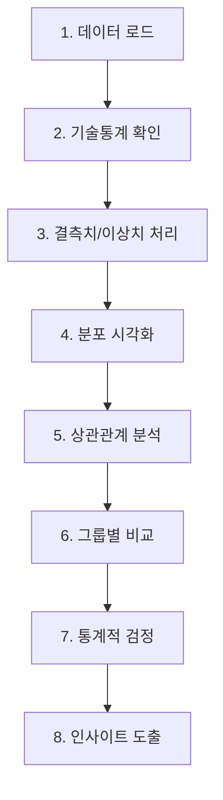
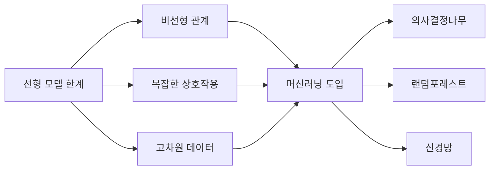

# 통계적 데이터 분석 종합과 한계

## 11차시 | Part II. 기초 수리와 데이터 분석

**6-10차시 기법 종합 적용 및 선형 모델의 한계 인식**

---

# 학습 목표

이 차시를 마치면 다음을 할 수 있습니다:

| 번호 | 학습 목표 |
|:----:|----------|
| 1 | 복잡한 제조 데이터에 **탐색적 분석(EDA) 기법을 종합 적용**한다 |
| 2 | 단순회귀와 중다회귀의 차이를 이해하고 **다중공선성을 진단**한다 |
| 3 | 선형 모델의 한계를 인식하고 **머신러닝 도입 필요성**을 설명한다 |

---

# 강의 구성

| 파트 | 주제 | 시간 |
|:----:|------|:----:|
| 1 | 6-10차시 기법 종합 적용 | 8분 |
| 2 | 단순회귀에서 중다회귀로 | 10분 |
| 3 | 선형 모델의 한계와 머신러닝 전환 | 7분 |

---

<!-- _class: lead -->

# Part 1

## 6-10차시 기법 종합 적용

---

# 지금까지 배운 기법들

## 6-10차시 핵심 개념 복습

| 차시 | 주제 | 핵심 기법 |
|:----:|------|----------|
| 6 | 확률분포와 품질검정 | 정규분포, Z-score, 정규성 검정 |
| 7 | 통계검정 실습 | t-검정, 가설검정, p-value |
| 8 | 상관분석과 예측 기초 | 상관계수, 단순선형회귀, $R^2$ |
| 9 | 제조 데이터 전처리 (1) | 결측치, 이상치, IQR |
| 10 | 제조 데이터 전처리 (2) | 스케일링, 인코딩 |

---

# EDA 종합 워크플로우

## 체계적 분석 프로세스



---

# 기술통계와 시각화

## 데이터 첫인상 파악

### 기술통계량
- 중심 경향: 평균, 중앙값, 최빈값
- 산포도: 표준편차, 분산, IQR
- 형태: 왜도(skewness), 첨도(kurtosis)

### 시각화 도구
| 목적 | 그래프 |
|------|--------|
| 분포 확인 | 히스토그램, KDE |
| 이상치 탐지 | 박스플롯 |
| 관계 파악 | 산점도, 히트맵 |

---

# 상관분석 복습

## 피어슨 상관계수

$$r = \frac{\sum(X_i - \bar{X})(Y_i - \bar{Y})}{\sqrt{\sum(X_i - \bar{X})^2} \cdot \sqrt{\sum(Y_i - \bar{Y})^2}}$$

### 해석 기준

| |r| 범위 | 해석 |
|----------|------|
| 0.0 ~ 0.3 | 약한 상관 |
| 0.3 ~ 0.5 | 보통 상관 |
| 0.5 ~ 0.7 | 중간 상관 |
| 0.7 ~ 1.0 | 강한 상관 |

---

# 통계적 검정 복습

## t-검정과 가설검정

### 가설 설정
- $H_0$ (귀무가설): 차이가 없다
- $H_1$ (대립가설): 차이가 있다

### p-value 해석
| p-value | 결론 |
|---------|------|
| p < 0.05 | 귀무가설 기각 (유의미한 차이) |
| p >= 0.05 | 귀무가설 채택 (차이 없음) |

---

<!-- _class: lead -->

# Part 2

## 단순회귀에서 중다회귀로

---

# 단순회귀 vs 중다회귀

## 모델 비교

### 단순선형회귀 (Simple Linear Regression)
$$Y = \beta_0 + \beta_1 X + \epsilon$$

- 독립변수 1개
- 예: 온도만으로 불량률 예측

### 중다선형회귀 (Multiple Linear Regression)
$$Y = \beta_0 + \beta_1 X_1 + \beta_2 X_2 + ... + \beta_p X_p + \epsilon$$

- 독립변수 여러 개
- 예: 온도, 습도, 속도로 불량률 예측

---

# 중다회귀의 수학적 표현

## 행렬 형태

$$\mathbf{Y} = \mathbf{X}\boldsymbol{\beta} + \boldsymbol{\epsilon}$$

### 계수 추정 (최소제곱법)

$$\hat{\boldsymbol{\beta}} = (\mathbf{X}^T\mathbf{X})^{-1}\mathbf{X}^T\mathbf{Y}$$

### 해석
- $\beta_j$: $X_j$가 1단위 증가할 때, **다른 변수가 고정된 상태에서** Y의 변화량

---

# 결정계수 $R^2$

## 모델 설명력

$$R^2 = 1 - \frac{SS_{res}}{SS_{tot}} = 1 - \frac{\sum(y_i - \hat{y}_i)^2}{\sum(y_i - \bar{y})^2}$$

### 해석
- $R^2 = 0.85$: 모델이 종속변수 변동의 85%를 설명
- 범위: 0 ~ 1

### 주의점
> 변수를 추가하면 $R^2$는 항상 증가하거나 유지됨
> 이것이 조정 $R^2$가 필요한 이유

---

# 조정 결정계수 $\bar{R}^2$

## 변수 개수를 고려한 설명력

$$\bar{R}^2 = 1 - (1-R^2)\frac{n-1}{n-p-1}$$

### 구성 요소
- $n$: 표본 크기
- $p$: 독립변수 개수
- $R^2$: 결정계수

### 특징
- 불필요한 변수 추가 시 $\bar{R}^2$는 감소할 수 있음
- 모델 비교 시 $\bar{R}^2$ 사용 권장

---

# $R^2$ vs $\bar{R}^2$ 비교

## 예시

| 모델 | 변수 개수 | $R^2$ | $\bar{R}^2$ |
|------|----------|-------|-------------|
| 모델 A | 2 | 0.75 | 0.74 |
| 모델 B | 5 | 0.78 | 0.73 |
| 모델 C | 10 | 0.80 | 0.68 |

<div class="tip">

**선택**: $\bar{R}^2$가 가장 높은 **모델 A** 선택
- 변수 추가가 실제 설명력 향상에 기여하지 않음

</div>

---

# 다중공선성 문제

## Multicollinearity

### 정의
> 독립변수들 간에 높은 상관관계가 존재하는 현상

### 문제점
1. 회귀계수 추정이 불안정
2. 표준오차 증가
3. 계수의 부호가 뒤바뀔 수 있음
4. 개별 변수의 영향력 해석 어려움

---

# VIF (분산팽창계수)

## Variance Inflation Factor

$$VIF_j = \frac{1}{1 - R_j^2}$$

### 구성 요소
- $R_j^2$: $X_j$를 다른 독립변수들로 회귀했을 때의 결정계수

### 해석 기준

| VIF | 해석 | 조치 |
|-----|------|------|
| 1 | 상관 없음 | OK |
| 1~5 | 약한 상관 | 주의 |
| 5~10 | 중간 상관 | 검토 필요 |
| >10 | 강한 상관 | 변수 제거 권장 |

---

# VIF 계산 예시

## 개념 이해

```
예: weight, horsepower, displacement 3개 변수

VIF(weight) 계산:
1. weight를 horsepower, displacement로 회귀
2. 이 회귀의 R^2 계산 (예: 0.90)
3. VIF = 1 / (1 - 0.90) = 10

해석: weight는 다른 변수들과 강한 상관
      -> 제거 또는 변수 선택 검토 필요
```

---

# 다중공선성 해결 방법

## 실무 대응

| 방법 | 설명 | 적용 시점 |
|------|------|----------|
| **변수 제거** | VIF 높은 변수 제거 | VIF > 10 |
| **변수 결합** | 관련 변수들을 하나로 | 개념적 유사성 |
| **PCA** | 주성분 분석으로 차원 축소 | 변수가 많을 때 |
| **정규화** | Ridge, Lasso 회귀 | 고급 기법 |

---

<!-- _class: lead -->

# Part 3

## 선형 모델의 한계와 머신러닝 전환

---

# 선형 모델의 가정

## 선형회귀가 유효하려면

| 가정 | 내용 | 검증 방법 |
|------|------|----------|
| **선형성** | X와 Y가 직선 관계 | 잔차 플롯 |
| **독립성** | 오차 간 독립 | Durbin-Watson |
| **등분산성** | 오차 분산 일정 | 잔차 플롯 |
| **정규성** | 오차가 정규분포 | Q-Q 플롯 |

<div class="important">

가정이 충족되지 않으면 예측과 해석이 왜곡됨

</div>

---

# 선형 모델의 한계 (1)

## 비선형 관계 포착 불가

```
실제 관계: Y = X^2 + noise

선형 모델 시도:
Y = b0 + b1*X

결과: 잔차에 곡선 패턴 발생
      -> 모델이 관계를 제대로 포착 못함
```

### 예시
- 온도와 효소 활성: 최적 온도 존재 (역U자형)
- 광고비와 매출: 체감 효과 (로그형)

---

# 선형 모델의 한계 (2)

## 복잡한 상호작용 효과

### 상호작용이란?
> 한 변수의 효과가 다른 변수 수준에 따라 달라지는 현상

### 예시
```
고온(90C) + 저습(30%) -> 불량률 5%
고온(90C) + 고습(80%) -> 불량률 15%
저온(60C) + 고습(80%) -> 불량률 3%

-> 온도와 습도의 조합 효과가 존재
   단순 선형 모델로는 포착 어려움
```

---

# 선형 모델의 한계 (3)

## 고차원 데이터 처리

### 문제점
| 상황 | 선형 모델 한계 |
|------|---------------|
| 변수가 많음 | 다중공선성 증가 |
| 범주형 변수 많음 | 더미 변수 폭발 |
| 변수 간 복잡한 관계 | 수동 변환 필요 |

### 결론
> 단순한 문제에는 효과적이나,
> 복잡한 실제 데이터에는 한계 존재

---

# 머신러닝으로의 전환

## 왜 머신러닝이 필요한가?



---

# 통계 모델 vs 머신러닝

## 접근 방식 비교

| 관점 | 통계 모델 | 머신러닝 |
|------|----------|----------|
| 목적 | 해석, 추론 | 예측 성능 |
| 가정 | 명시적 가정 필요 | 가정 최소화 |
| 모델 복잡도 | 단순 (해석 가능) | 복잡 (블랙박스) |
| 데이터 크기 | 소규모 가능 | 대규모 선호 |
| 변수 관계 | 사전 지정 | 자동 학습 |

---

# 다음 단계 미리보기

## Part III: 머신러닝 기초

| 차시 | 주제 | 핵심 내용 |
|:----:|------|----------|
| 12 | 머신러닝 소개 | 지도/비지도, 분류/회귀 |
| 13 | 의사결정나무 | 트리 기반 분류 |
| 14 | 랜덤포레스트 | 앙상블 학습 |
| 15 | 선형회귀와 다항회귀 | 연속값 예측 |

<div class="highlight">

지금까지 배운 통계적 기법이 머신러닝의 기초가 됨

</div>

---

# 핵심 정리

## 오늘 배운 내용

### 1. EDA 종합 적용
- 기술통계 + 시각화 + 상관분석 + 검정의 체계적 적용

### 2. 중다회귀와 다중공선성
- 조정 $R^2$: $\bar{R}^2 = 1 - (1-R^2)\frac{n-1}{n-p-1}$
- VIF: $VIF_j = \frac{1}{1 - R_j^2}$, VIF > 10이면 문제

### 3. 선형 모델 한계
- 비선형, 상호작용, 고차원 -> 머신러닝 필요

---

# 다음 차시 예고

## 12차시: 머신러닝 소개와 문제 유형

### 학습 내용
- 머신러닝이란?
- 지도학습 vs 비지도학습
- 분류 vs 회귀 문제
- sklearn 기본 사용법

<div class="tip">

**이 차시의 통계적 기법** + **다음 차시의 머신러닝** = **강력한 예측 모델**

</div>

---

# 감사합니다

## 11차시: 통계적 데이터 분석 종합과 한계

**Part II 마무리! 다음은 머신러닝입니다!**
