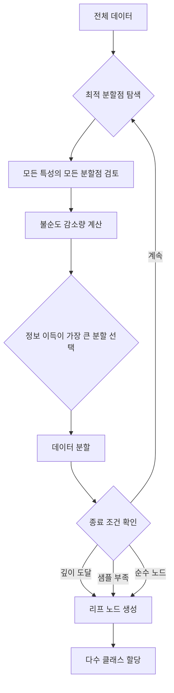
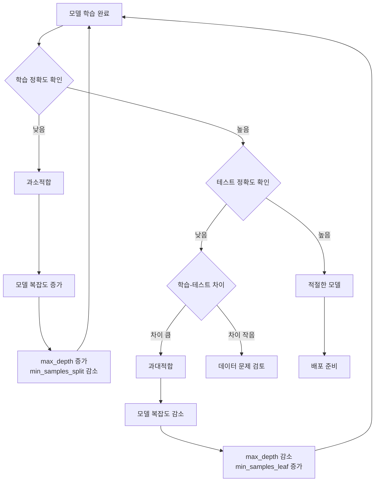

# [14차시] 분류 모델 (1) - 의사결정나무

## 학습 목표

| 목표 | 설명 |
|------|------|
| 의사결정나무의 원리 이해 | 지니 불순도와 정보 이득 개념을 수학적으로 이해함 |
| 분류 모델 학습 | DecisionTreeClassifier를 사용하여 분류 모델을 학습함 |
| 트리 해석 능력 | 트리 구조를 시각화하고 해석하여 특성 중요도를 분석함 |
| 과대적합 진단 | 과대적합 현상을 이해하고 적절한 하이퍼파라미터를 선택함 |

---

## 실습 데이터셋

| 데이터셋 | 출처 | 용도 |
|----------|------|------|
| **Iris** | sklearn.datasets | 의사결정나무 분류 실습 |
| **Steel Plates Faults** | UCI ML Repository | 제조업 품질 분류 연계 예시 |

Iris 데이터셋은 붓꽃 3종류(setosa, versicolor, virginica)를 꽃받침/꽃잎 크기로 분류하는 대표적인 분류 문제임.

참고: Steel Plates Faults 데이터셋은 철강 판재의 7가지 결함 유형을 27개 특성으로 분류하는 제조업 품질관리 데이터셋임. 실제 제조 현장에서 의사결정나무를 활용한 품질 예측에 적용 가능함.

---

## 강의 구성

| 파트 | 주제 | 핵심 내용 | 예상 시간 |
|:----:|------|----------|:--------:|
| 1 | 의사결정나무의 원리 | 질문 기반 분류, 불순도, 정보 이득 | 8분 |
| 2 | 수학적 배경 | 지니 불순도, 엔트로피, 정보 이득 수식 | 5분 |
| 3 | sklearn 실습 | DecisionTreeClassifier, 주요 파라미터 | 7분 |
| 4 | 트리 시각화와 해석 | plot_tree, 특성 중요도, 과대적합 분석 | 5분 |

---

## Part 1: 의사결정나무의 원리

### 1.1 의사결정나무(Decision Tree)란?

질문을 통해 데이터를 분류하는 알고리즘임. "스무고개"와 같은 원리로 동작함.

핵심 아이디어:
- 예/아니오로 답할 수 있는 질문을 던짐
- 질문에 따라 데이터를 나눔
- 최종적으로 클래스(범주) 결정

#### 일상 속 의사결정나무 예시

```
                "빨간색인가요?"
                      |
            +---------+---------+
           예                  아니오
            |                    |
    "동그란가요?"           "노란색인가요?"
          |                      |
      +---+---+              +---+---+
     예       아니오         예       아니오
      |         |            |         |
   사과      딸기        바나나      포도
```

### 1.2 트리 구조 용어

```
        [루트 노드]        <-- 첫 번째 질문 (가장 중요한 특성)
           |
    +------+------+
[내부 노드]    [내부 노드]  <-- 추가 질문
    |              |
+---+---+    +----+----+
[리프]  [리프] [리프] [리프]  <-- 최종 결정 (클래스)
```

| 용어 | 설명 |
|------|------|
| **루트 노드(Root Node)** | 첫 번째 분기점, 가장 중요한 특성으로 분할 |
| **내부 노드(Internal Node)** | 중간 분기점, 추가 질문 수행 |
| **리프 노드(Leaf Node)** | 최종 결정, 클래스 할당 |
| **깊이(Depth)** | 루트에서 리프까지의 최대 거리 |
| **가지(Branch)** | 노드 간 연결, 분할 조건 표현 |

### 1.3 의사결정나무 학습 프로세스



### 1.4 불순도(Impurity)란?

데이터가 얼마나 "섞여있는지" 측정하는 지표임.

| 분할 유형 | 설명 |
|----------|------|
| 좋은 분할 | 분할 후 각 그룹이 **한 클래스로 통일**, 불순도가 **낮아짐** |
| 나쁜 분할 | 분할 후에도 클래스가 **섞여있음**, 불순도가 **여전히 높음** |

```
[분할 전]
정상정상정상정상불량불량불량불량 (50% 정상, 50% 불량)

[분할 A - 좋은 분할]
왼쪽: 정상정상정상정상    오른쪽: 불량불량불량불량
      (100% 정상)              (100% 불량)

[분할 B - 나쁜 분할]
왼쪽: 정상정상불량불량    오른쪽: 정상정상불량불량
      (50% 정상)               (50% 정상)
```

---

## Part 2: 수학적 배경

### 2.1 지니 불순도(Gini Impurity)

가장 많이 사용하는 불순도 측정 방식임.

$$Gini(D) = 1 - \sum_{i=1}^{c} p_i^2$$

여기서:
- $D$: 데이터셋
- $c$: 클래스 개수
- $p_i$: 클래스 $i$에 속하는 샘플 비율

| Gini 값 | 해석 |
|---------|------|
| 0 | 완전히 순수 (한 클래스만 있음) |
| 0.5 | 가장 불순 (이진 분류에서 50:50) |
| 0.667 | 3클래스 균등 분포 (33:33:33) |

#### 실제 데이터 계산 예시

**Case A: 정상 10개, 불량 0개**

$$Gini = 1 - \left(\frac{10}{10}\right)^2 - \left(\frac{0}{10}\right)^2 = 1 - 1 - 0 = 0$$

결과: 완전 순수 (Gini = 0)

**Case B: 정상 5개, 불량 5개**

$$Gini = 1 - \left(\frac{5}{10}\right)^2 - \left(\frac{5}{10}\right)^2 = 1 - 0.25 - 0.25 = 0.5$$

결과: 가장 불순 (Gini = 0.5)

**Case C: 정상 80개, 불량 20개**

$$Gini = 1 - \left(\frac{80}{100}\right)^2 - \left(\frac{20}{100}\right)^2 = 1 - 0.64 - 0.04 = 0.32$$

결과: 다소 순수 (Gini = 0.32)

### 2.2 엔트로피(Entropy)

정보이론에 기반한 불순도 측정 방식임.

$$H(D) = -\sum_{i=1}^{c} p_i \log_2(p_i)$$

여기서:
- $H(D)$: 데이터셋 $D$의 엔트로피
- $p_i$: 클래스 $i$에 속하는 샘플 비율
- $\log_2$: 밑이 2인 로그 (비트 단위 정보량)

| 엔트로피 값 | 해석 |
|------------|------|
| 0 | 완전히 순수 (한 클래스만 있음) |
| 1 | 가장 불순 (이진 분류에서 50:50) |
| 1.585 | 3클래스 균등 분포 (33:33:33) |

#### 실제 데이터 계산 예시

**Case A: 정상 10개, 불량 0개**

$$H = -\left(\frac{10}{10} \log_2 \frac{10}{10}\right) - \left(\frac{0}{10} \log_2 \frac{0}{10}\right) = -1 \cdot 0 - 0 = 0$$

참고: $0 \cdot \log_2(0)$는 0으로 정의함

**Case B: 정상 5개, 불량 5개**

$$H = -\left(\frac{5}{10} \log_2 \frac{5}{10}\right) - \left(\frac{5}{10} \log_2 \frac{5}{10}\right)$$
$$H = -0.5 \cdot (-1) - 0.5 \cdot (-1) = 0.5 + 0.5 = 1$$

결과: 가장 불순 (엔트로피 = 1)

**Case C: 정상 80개, 불량 20개**

$$H = -\left(\frac{80}{100} \log_2 \frac{80}{100}\right) - \left(\frac{20}{100} \log_2 \frac{20}{100}\right)$$
$$H = -0.8 \cdot (-0.322) - 0.2 \cdot (-2.322) = 0.258 + 0.464 = 0.722$$

결과: 다소 순수 (엔트로피 = 0.722)

### 2.3 정보 이득(Information Gain)

분할로 얼마나 순수해졌는지 측정함.

$$IG(D, A) = H(D) - \sum_{v \in Values(A)} \frac{|D_v|}{|D|} H(D_v)$$

여기서:
- $IG(D, A)$: 특성 $A$로 분할했을 때의 정보 이득
- $H(D)$: 분할 전 불순도 (부모 노드)
- $D_v$: 특성 $A$의 값이 $v$인 부분집합
- $|D_v|/|D|$: 가중치 (부분집합의 비율)

#### 분할 전후 불순도 변화 예시

**상황**: 부모 노드에 정상 50개, 불량 50개 존재 (총 100개)

**분할 전 지니 불순도**:

$$Gini_{parent} = 1 - \left(\frac{50}{100}\right)^2 - \left(\frac{50}{100}\right)^2 = 0.5$$

**분할 A (좋은 분할)**: 온도 > 85도 기준

| 노드 | 정상 | 불량 | 샘플 수 | 지니 |
|------|------|------|---------|------|
| 왼쪽 (온도 <= 85) | 45 | 5 | 50 | 0.18 |
| 오른쪽 (온도 > 85) | 5 | 45 | 50 | 0.18 |

$$Gini_{children} = \frac{50}{100} \cdot 0.18 + \frac{50}{100} \cdot 0.18 = 0.18$$

$$IG_A = 0.5 - 0.18 = 0.32$$

**분할 B (나쁜 분할)**: 습도 > 60% 기준

| 노드 | 정상 | 불량 | 샘플 수 | 지니 |
|------|------|------|---------|------|
| 왼쪽 (습도 <= 60) | 25 | 25 | 50 | 0.5 |
| 오른쪽 (습도 > 60) | 25 | 25 | 50 | 0.5 |

$$Gini_{children} = \frac{50}{100} \cdot 0.5 + \frac{50}{100} \cdot 0.5 = 0.5$$

$$IG_B = 0.5 - 0.5 = 0$$

**결론**: 정보 이득이 더 큰 분할 A를 선택함 ($IG_A = 0.32 > IG_B = 0$)

### 2.4 지니 불순도 vs 엔트로피 비교

```python
import numpy as np
import matplotlib.pyplot as plt

# 한글 폰트 설정
plt.rcParams['font.family'] = 'Malgun Gothic'
plt.rcParams['axes.unicode_minus'] = False

# p 값 범위 (0.01 ~ 0.99)
p = np.linspace(0.01, 0.99, 100)

# 지니 불순도: 1 - p^2 - (1-p)^2
gini = 1 - p**2 - (1-p)**2

# 엔트로피: -p*log2(p) - (1-p)*log2(1-p)
entropy = -p * np.log2(p) - (1-p) * np.log2(1-p)

# 시각화
plt.figure(figsize=(10, 6))
plt.plot(p, gini, 'b-', linewidth=2, label='지니 불순도')
plt.plot(p, entropy, 'r--', linewidth=2, label='엔트로피')
plt.xlabel('클래스 1의 비율 (p)', fontsize=12)
plt.ylabel('불순도', fontsize=12)
plt.title('지니 불순도 vs 엔트로피 비교 (이진 분류)', fontsize=14)
plt.legend(fontsize=11)
plt.grid(True, alpha=0.3)
plt.axvline(x=0.5, color='gray', linestyle=':', alpha=0.5)
plt.axhline(y=0.5, color='gray', linestyle=':', alpha=0.5)
plt.tight_layout()
plt.savefig('gini_vs_entropy.png', dpi=150, bbox_inches='tight')
plt.close()
print("시각화 저장: gini_vs_entropy.png")
```

**출력 결과 해석**:
- 두 지표 모두 p=0.5 (50:50)일 때 최대값을 가짐
- 지니 불순도의 최대값은 0.5, 엔트로피의 최대값은 1.0
- 형태가 유사하여 실제로 비슷한 분할 결과를 생성함
- sklearn 기본값은 지니 불순도 사용 (계산이 더 빠름)

---

## Part 3: sklearn으로 의사결정나무 실습

### 3.1 데이터 로드 및 탐색

```python
import numpy as np
import pandas as pd
import matplotlib.pyplot as plt
from sklearn.model_selection import train_test_split
from sklearn.tree import DecisionTreeClassifier, plot_tree, export_text
from sklearn.metrics import accuracy_score, confusion_matrix, classification_report
from sklearn.datasets import load_iris

# 한글 폰트 설정
plt.rcParams['font.family'] = 'Malgun Gothic'
plt.rcParams['axes.unicode_minus'] = False

# Iris 데이터셋 로딩
iris = load_iris()
df = pd.DataFrame(iris.data, columns=iris.feature_names)
df['target'] = iris.target
df['species'] = pd.Categorical.from_codes(iris.target, iris.target_names)
print("Iris 데이터셋 로딩 완료")

print(f"\n[데이터 확인]")
print(f"데이터 크기: {df.shape}")
print(f"특성 이름: {list(iris.feature_names)}")
print(f"클래스: {list(iris.target_names)}")

print(f"\n클래스별 샘플 수:")
for i, name in enumerate(iris.target_names):
    count = (df['target'] == i).sum()
    print(f"  {name}: {count}개 ({count/len(df):.1%})")
```

**예상 출력**:
```
Iris 데이터셋 로딩 완료

[데이터 확인]
데이터 크기: (150, 6)
특성 이름: ['sepal length (cm)', 'sepal width (cm)', 'petal length (cm)', 'petal width (cm)']
클래스: ['setosa', 'versicolor', 'virginica']

클래스별 샘플 수:
  setosa: 50개 (33.3%)
  versicolor: 50개 (33.3%)
  virginica: 50개 (33.3%)
```

### 3.2 데이터 분할

```python
# 특성과 타겟 분리
feature_columns = list(iris.feature_names)
X = df[feature_columns]
y = df['target']

# 학습/테스트 분할
X_train, X_test, y_train, y_test = train_test_split(
    X, y,
    test_size=0.2,
    random_state=42,
    stratify=y  # 클래스 비율 유지
)

print(f"[데이터 분할 결과]")
print(f"학습 데이터: {len(X_train)}개 ({len(X_train)/len(X):.0%})")
print(f"테스트 데이터: {len(X_test)}개 ({len(X_test)/len(X):.0%})")
```

**예상 출력**:
```
[데이터 분할 결과]
학습 데이터: 120개 (80%)
테스트 데이터: 30개 (20%)
```

**결과 해설**:
- Iris 데이터셋은 150개 샘플, 4개 특성, 3개 클래스로 구성됨
- 각 클래스(setosa, versicolor, virginica)가 50개씩 균등하게 분포함
- `stratify=y` 옵션으로 학습/테스트 분할 시에도 클래스 비율이 유지됨

### 3.3 DecisionTreeClassifier 주요 파라미터

| 파라미터 | 설명 | 기본값 | 과대적합 영향 |
|----------|------|--------|--------------|
| `criterion` | 불순도 측정 방식 | 'gini' | - |
| `max_depth` | 트리 최대 깊이 | None (제한 없음) | 낮을수록 방지 |
| `min_samples_split` | 분할에 필요한 최소 샘플 | 2 | 높을수록 방지 |
| `min_samples_leaf` | 리프에 필요한 최소 샘플 | 1 | 높을수록 방지 |
| `max_features` | 분할 시 고려할 최대 특성 수 | None (전체) | 낮을수록 방지 |
| `max_leaf_nodes` | 최대 리프 노드 수 | None (제한 없음) | 낮을수록 방지 |
| `class_weight` | 클래스 가중치 | None | 불균형 데이터용 |

### 3.4 기본 의사결정나무 모델

```python
# 모델 생성 (깊이 제한)
model = DecisionTreeClassifier(
    criterion='gini',      # 불순도 측정 방식
    max_depth=5,           # 트리 최대 깊이
    min_samples_split=5,   # 분할 최소 샘플 수
    min_samples_leaf=2,    # 리프 최소 샘플 수
    random_state=42
)

# 학습
model.fit(X_train, y_train)

print("[모델 학습 완료]")
print(f"트리 깊이: {model.get_depth()}")
print(f"리프 노드 수: {model.get_n_leaves()}")
```

**예상 출력**:
```
[모델 학습 완료]
트리 깊이: 4
리프 노드 수: 7
```

### 3.5 예측 및 확률 예측

```python
# 예측
y_pred = model.predict(X_test)
y_proba = model.predict_proba(X_test)

print(f"[예측 결과 샘플 (처음 10개)]")
print(f"실제: {list(y_test[:10].values)}")
print(f"예측: {list(y_pred[:10])}")

print(f"\n[예측 결과 (꽃 이름)]")
for i in range(min(5, len(y_pred))):
    actual = iris.target_names[y_test.iloc[i]]
    predicted = iris.target_names[y_pred[i]]
    match = "O" if actual == predicted else "X"
    print(f"  샘플 {i+1}: 실제={actual}, 예측={predicted} [{match}]")

print(f"\n[확률 예측 (처음 5개)]")
for i in range(5):
    print(f"  샘플 {i+1}: setosa {y_proba[i][0]:.1%}, "
          f"versicolor {y_proba[i][1]:.1%}, virginica {y_proba[i][2]:.1%}")
```

**예상 출력**:
```
[예측 결과 샘플 (처음 10개)]
실제: [1, 0, 2, 1, 1, 0, 1, 2, 1, 1]
예측: [1, 0, 2, 1, 1, 0, 1, 2, 1, 1]

[예측 결과 (꽃 이름)]
  샘플 1: 실제=versicolor, 예측=versicolor [O]
  샘플 2: 실제=setosa, 예측=setosa [O]
  샘플 3: 실제=virginica, 예측=virginica [O]
  샘플 4: 실제=versicolor, 예측=versicolor [O]
  샘플 5: 실제=versicolor, 예측=versicolor [O]

[확률 예측 (처음 5개)]
  샘플 1: setosa 0.0%, versicolor 100.0%, virginica 0.0%
  샘플 2: setosa 100.0%, versicolor 0.0%, virginica 0.0%
  샘플 3: setosa 0.0%, versicolor 0.0%, virginica 100.0%
  샘플 4: setosa 0.0%, versicolor 100.0%, virginica 0.0%
  샘플 5: setosa 0.0%, versicolor 100.0%, virginica 0.0%
```

### 3.6 모델 평가

```python
from sklearn.metrics import classification_report, ConfusionMatrixDisplay

# 정확도
accuracy = model.score(X_test, y_test)
print(f"[정확도]")
print(f"학습 정확도: {model.score(X_train, y_train):.1%}")
print(f"테스트 정확도: {accuracy:.1%}")

# 혼동 행렬
cm = confusion_matrix(y_test, y_pred)
print(f"\n[혼동 행렬]")
print(f"              setosa  versicolor  virginica")
for i, name in enumerate(iris.target_names):
    print(f"  {name:>10}:  {cm[i,0]:5}      {cm[i,1]:5}      {cm[i,2]:5}")

# 분류 보고서
print(f"\n[분류 보고서]")
print(classification_report(y_test, y_pred, target_names=iris.target_names))
```

**예상 출력**:
```
[정확도]
학습 정확도: 99.2%
테스트 정확도: 100.0%

[혼동 행렬]
              setosa  versicolor  virginica
      setosa:     10          0          0
  versicolor:      0         10          0
   virginica:      0          0         10

[분류 보고서]
              precision    recall  f1-score   support

      setosa       1.00      1.00      1.00        10
  versicolor       1.00      1.00      1.00        10
   virginica       1.00      1.00      1.00        10

    accuracy                           1.00        30
   macro avg       1.00      1.00      1.00        30
weighted avg       1.00      1.00      1.00        30
```

### 3.7 max_depth에 따른 과대적합 실험

```python
depths = list(range(1, 11)) + [None]  # 1~10 + 제한없음
train_scores = []
test_scores = []
n_leaves_list = []

print("[깊이별 성능]")
print(f"{'깊이':>5} {'학습정확도':>10} {'테스트정확도':>12} {'리프수':>8}")
print("-" * 40)

for depth in depths:
    dt = DecisionTreeClassifier(max_depth=depth, random_state=42)
    dt.fit(X_train, y_train)

    train_acc = dt.score(X_train, y_train)
    test_acc = dt.score(X_test, y_test)
    n_leaves = dt.get_n_leaves()

    train_scores.append(train_acc)
    test_scores.append(test_acc)
    n_leaves_list.append(n_leaves)

    depth_str = str(depth) if depth else "None"
    print(f"{depth_str:>5} {train_acc:>10.1%} {test_acc:>12.1%} {n_leaves:>8}")

# 최적 깊이 찾기
best_idx = np.argmax(test_scores)
best_depth = depths[best_idx]
print(f"\n최적 깊이: {best_depth if best_depth else 'None'}")
print(f"최고 테스트 정확도: {test_scores[best_idx]:.1%}")
```

**예상 출력**:
```
[깊이별 성능]
  깊이   학습정확도   테스트정확도     리프수
----------------------------------------
    1      66.7%        70.0%        2
    2      96.7%        96.7%        4
    3      98.3%       100.0%        6
    4      99.2%       100.0%        7
    5     100.0%       100.0%        8
    6     100.0%       100.0%        9
    7     100.0%       100.0%       10
    8     100.0%       100.0%       10
    9     100.0%       100.0%       10
   10     100.0%       100.0%       10
 None     100.0%       100.0%       10

최적 깊이: 3
최고 테스트 정확도: 100.0%
```

### 3.8 과대적합 시각화

```python
# 과대적합 시각화
plt.figure(figsize=(12, 5))

# 그래프 1: 깊이별 정확도
plt.subplot(1, 2, 1)
depth_labels = [str(d) if d else 'None' for d in depths]
x_pos = range(len(depths))

plt.plot(x_pos, train_scores, 'b-o', linewidth=2, markersize=6, label='학습 정확도')
plt.plot(x_pos, test_scores, 'r-s', linewidth=2, markersize=6, label='테스트 정확도')
plt.fill_between(x_pos, train_scores, test_scores, alpha=0.2, color='orange')
plt.xticks(x_pos, depth_labels)
plt.xlabel('트리 최대 깊이 (max_depth)', fontsize=11)
plt.ylabel('정확도', fontsize=11)
plt.title('깊이에 따른 학습/테스트 정확도 변화', fontsize=12)
plt.legend(fontsize=10)
plt.grid(True, alpha=0.3)

# 과대적합 영역 표시
plt.axvspan(4, 10, alpha=0.1, color='red')
plt.text(7, 0.75, '과대적합\n위험 구간', ha='center', fontsize=10, color='red')

# 그래프 2: 깊이별 리프 노드 수
plt.subplot(1, 2, 2)
plt.bar(x_pos, n_leaves_list, color='steelblue', alpha=0.7)
plt.xticks(x_pos, depth_labels)
plt.xlabel('트리 최대 깊이 (max_depth)', fontsize=11)
plt.ylabel('리프 노드 수', fontsize=11)
plt.title('깊이에 따른 트리 복잡도 (리프 수)', fontsize=12)
plt.grid(True, alpha=0.3, axis='y')

plt.tight_layout()
plt.savefig('overfitting_analysis.png', dpi=150, bbox_inches='tight')
plt.close()
print("과대적합 분석 시각화 저장: overfitting_analysis.png")
```

**결과 해설**:
- max_depth가 너무 낮으면 과소적합, 너무 높으면 과대적합이 발생함
- 학습 정확도는 깊이가 깊을수록 계속 상승하지만, 테스트 정확도는 일정 깊이 이후 정체 또는 하락함
- 학습 정확도와 테스트 정확도 차이가 크면 과대적합 징후임
- Iris 데이터셋은 비교적 간단하여 depth=3~5에서 충분한 성능을 보임

---

## Part 4: 트리 시각화와 해석

### 4.1 트리 노드 정보 읽기

```
        +------------------+
        |  온도 <= 87.5    |  <-- 분할 조건
        |  gini = 0.42     |  <-- 불순도
        |  samples = 400   |  <-- 샘플 수
        |  value = [320, 80]|  <-- 클래스별 샘플 수
        |  class = 정상     |  <-- 다수 클래스
        +------------------+
```

| 항목 | 설명 |
|------|------|
| **분할 조건** | 이 노드에서 데이터를 나누는 기준 (조건 만족 시 왼쪽으로) |
| **gini** | 현재 노드의 지니 불순도 |
| **samples** | 현재 노드에 도달한 샘플 수 |
| **value** | 각 클래스별 샘플 수 배열 |
| **class** | 현재 노드에서 가장 많은 클래스 (리프에서 예측값) |

### 4.2 트리 시각화

```python
# 시각화용 모델 (깊이 3으로 제한해서 보기 좋게)
model_viz = DecisionTreeClassifier(max_depth=3, random_state=42)
model_viz.fit(X_train, y_train)

# 트리 시각화
fig, ax = plt.subplots(figsize=(20, 12))
plot_tree(
    model_viz,
    feature_names=feature_columns,
    class_names=list(iris.target_names),
    filled=True,
    rounded=True,
    fontsize=10,
    ax=ax
)
plt.title("Iris 의사결정나무 시각화 (max_depth=3)", fontsize=14)
plt.tight_layout()
plt.savefig('decision_tree_visualization.png', dpi=150, bbox_inches='tight')
plt.close()
print("트리 시각화 저장: decision_tree_visualization.png")
```

**시각화 해석**:
- 루트 노드: petal length <= 2.45 로 첫 분할
- petal length가 2.45cm 이하면 setosa로 즉시 분류 (완벽 분리)
- 이후 petal width, petal length 조합으로 versicolor, virginica 구분
- 노드 색상: 진할수록 해당 클래스로 순수해짐

### 4.3 텍스트로 트리 규칙 확인

```python
tree_rules = export_text(
    model_viz,
    feature_names=feature_columns
)
print("[트리 규칙]")
print(tree_rules)
```

**예상 출력**:
```
[트리 규칙]
|--- petal length (cm) <= 2.45
|   |--- class: setosa
|--- petal length (cm) > 2.45
|   |--- petal width (cm) <= 1.75
|   |   |--- petal length (cm) <= 4.95
|   |   |   |--- class: versicolor
|   |   |--- petal length (cm) > 4.95
|   |   |   |--- class: virginica
|   |--- petal width (cm) > 1.75
|   |   |--- class: virginica
```

**규칙 해석**:
1. 꽃잎 길이가 2.45cm 이하면 setosa
2. 꽃잎 너비가 1.75cm 초과면 virginica
3. 그 외: 꽃잎 길이 4.95cm 기준으로 versicolor/virginica 구분

### 4.4 특성 중요도

```python
importances = model.feature_importances_
sorted_idx = np.argsort(importances)[::-1]

print("[특성 중요도]")
for idx in sorted_idx:
    print(f"  {feature_columns[idx]}: {importances[idx]:.3f}")

# 특성 중요도 시각화
plt.figure(figsize=(10, 6))
colors = ['#2ecc71' if i == sorted_idx[0] else '#3498db' for i in sorted_idx]
bars = plt.barh(range(len(importances)), importances[sorted_idx], color=colors)
plt.yticks(range(len(importances)),
           [feature_columns[i] for i in sorted_idx])
plt.xlabel('특성 중요도 (Feature Importance)', fontsize=11)
plt.title('의사결정나무 - Iris 특성 중요도', fontsize=13)

# 값 표시
for i, bar in enumerate(bars):
    plt.text(bar.get_width() + 0.01, bar.get_y() + bar.get_height()/2,
             f'{importances[sorted_idx[i]]:.3f}', va='center', fontsize=10)

plt.xlim(0, max(importances) * 1.15)
plt.tight_layout()
plt.savefig('feature_importance.png', dpi=150, bbox_inches='tight')
plt.close()
print("특성 중요도 시각화 저장: feature_importance.png")
```

**예상 출력**:
```
[특성 중요도]
  petal width (cm): 0.442
  petal length (cm): 0.425
  sepal length (cm): 0.091
  sepal width (cm): 0.042
```

**해석**:
- petal width와 petal length가 분류에 가장 중요한 특성임
- sepal 특성들은 상대적으로 덜 중요함
- 특성 중요도 합은 항상 1.0임

### 4.5 깊이별 결정경계 변화 시각화

```python
# 2개 특성만 사용 (petal length, petal width)
X_2d = X_train[['petal length (cm)', 'petal width (cm)']].values
X_2d_test = X_test[['petal length (cm)', 'petal width (cm)']].values

# 결정 경계 그리기 함수
def plot_decision_boundary(ax, model, X, y, title):
    x_min, x_max = X[:, 0].min() - 0.5, X[:, 0].max() + 0.5
    y_min, y_max = X[:, 1].min() - 0.3, X[:, 1].max() + 0.3

    xx, yy = np.meshgrid(
        np.linspace(x_min, x_max, 200),
        np.linspace(y_min, y_max, 200)
    )
    Z = model.predict(np.c_[xx.ravel(), yy.ravel()])
    Z = Z.reshape(xx.shape)

    ax.contourf(xx, yy, Z, alpha=0.3, cmap='RdYlBu')
    ax.contour(xx, yy, Z, colors='black', linewidths=0.5)

    colors_map = {0: 'red', 1: 'yellow', 2: 'blue'}
    colors = [colors_map[t] for t in y]
    ax.scatter(X[:, 0], X[:, 1], c=colors, alpha=0.7, s=30, edgecolors='black', linewidth=0.5)

    ax.set_xlabel('Petal Length (cm)', fontsize=9)
    ax.set_ylabel('Petal Width (cm)', fontsize=9)
    ax.set_title(title, fontsize=10)

# 깊이별 비교
fig, axes = plt.subplots(2, 2, figsize=(12, 10))
depths_to_show = [1, 3, 5, None]
titles = ['max_depth=1 (과소적합)', 'max_depth=3 (적절)',
          'max_depth=5 (적절)', 'max_depth=None (과대적합 위험)']

for ax, depth, title in zip(axes.flatten(), depths_to_show, titles):
    model_2d = DecisionTreeClassifier(max_depth=depth, random_state=42)
    model_2d.fit(X_2d, y_train)
    plot_decision_boundary(ax, model_2d, X_2d, y_train, title)

    # 정확도 표시
    train_acc = model_2d.score(X_2d, y_train)
    test_acc = model_2d.score(X_2d_test, y_test)
    ax.text(0.02, 0.98, f'Train: {train_acc:.1%}\nTest: {test_acc:.1%}',
            transform=ax.transAxes, fontsize=9, verticalalignment='top',
            bbox=dict(boxstyle='round', facecolor='white', alpha=0.8))

plt.suptitle('깊이별 결정경계 변화 (빨강=setosa, 노랑=versicolor, 파랑=virginica)', fontsize=12)
plt.tight_layout()
plt.savefig('decision_boundary_by_depth.png', dpi=150, bbox_inches='tight')
plt.close()
print("깊이별 결정경계 시각화 저장: decision_boundary_by_depth.png")
```

**결과 해설**:
- depth=1: 너무 단순하여 versicolor/virginica 구분 불가능
- depth=3: 적절한 복잡도로 대부분의 데이터를 잘 분류함
- depth=5: 조금 더 복잡한 경계, 미세한 패턴 포착
- depth=None: 노이즈까지 학습하여 과도하게 복잡한 경계 형성 위험

### 4.6 과대적합 진단 프로세스



### 4.7 최종 모델 및 새 데이터 예측

```python
# 최적 깊이로 최종 모델
final_model = DecisionTreeClassifier(
    max_depth=5,
    min_samples_leaf=2,
    random_state=42
)
final_model.fit(X_train, y_train)

print(f"[최종 모델]")
print(f"깊이: {final_model.get_depth()}")
print(f"리프 수: {final_model.get_n_leaves()}")
print(f"학습 정확도: {final_model.score(X_train, y_train):.1%}")
print(f"테스트 정확도: {final_model.score(X_test, y_test):.1%}")

# 새 데이터 예측
new_flowers = pd.DataFrame({
    'sepal length (cm)': [5.0, 6.5, 7.2, 5.5, 6.8],
    'sepal width (cm)': [3.5, 2.8, 3.0, 2.5, 3.2],
    'petal length (cm)': [1.5, 4.5, 6.0, 4.0, 5.5],
    'petal width (cm)': [0.2, 1.5, 2.2, 1.3, 2.0]
})

print("\n[새 꽃 데이터]")
print(new_flowers)

predictions = final_model.predict(new_flowers)
probabilities = final_model.predict_proba(new_flowers)

print("\n[예측 결과]")
for i in range(len(new_flowers)):
    species = iris.target_names[predictions[i]]
    max_prob = max(probabilities[i]) * 100
    print(f"  꽃 {i+1}: {species} (확신도: {max_prob:.1f}%)")
```

**예상 출력**:
```
[최종 모델]
깊이: 4
리프 수: 7
학습 정확도: 99.2%
테스트 정확도: 100.0%

[새 꽃 데이터]
   sepal length (cm)  sepal width (cm)  petal length (cm)  petal width (cm)
0                5.0               3.5                1.5               0.2
1                6.5               2.8                4.5               1.5
2                7.2               3.0                6.0               2.2
3                5.5               2.5                4.0               1.3
4                6.8               3.2                5.5               2.0

[예측 결과]
  꽃 1: setosa (확신도: 100.0%)
  꽃 2: versicolor (확신도: 97.4%)
  꽃 3: virginica (확신도: 100.0%)
  꽃 4: versicolor (확신도: 97.4%)
  꽃 5: virginica (확신도: 100.0%)
```

**결과 해설**:
- petal length(꽃잎 길이)와 petal width(꽃잎 너비)가 가장 중요한 특성으로 나타남
- setosa는 다른 두 종과 명확히 구분되지만, versicolor와 virginica는 경계가 겹치는 영역이 존재함
- 의사결정나무는 축에 평행한 선으로만 분할하는 특성이 있음

---

## 핵심 정리

### 의사결정나무 핵심 개념

| 개념 | 설명 | 수식 |
|------|------|------|
| **의사결정나무** | 질문 기반으로 데이터 분류 | - |
| **지니 불순도** | 데이터 섞임 정도 측정 | $Gini = 1 - \sum p_i^2$ |
| **엔트로피** | 정보이론 기반 불순도 | $H = -\sum p_i \log_2 p_i$ |
| **정보 이득** | 분할로 인한 불순도 감소량 | $IG = H_{parent} - \sum w_i H_{child}$ |
| **max_depth** | 과대적합 방지용 깊이 제한 | - |
| **특성 중요도** | 분류에 기여하는 정도 | 합계 = 1.0 |

### 주요 파라미터 가이드

| 파라미터 | 권장값 | 효과 | 과대적합 방지 |
|----------|--------|------|--------------|
| max_depth | 3~10 | 트리 깊이 제한 | 낮을수록 효과적 |
| min_samples_split | 2~20 | 분할 최소 조건 | 높을수록 효과적 |
| min_samples_leaf | 1~10 | 리프 최소 조건 | 높을수록 효과적 |
| criterion | 'gini' / 'entropy' | 불순도 측정 | 유사한 결과 |

### sklearn 사용법 요약

```python
from sklearn.tree import DecisionTreeClassifier, plot_tree, export_text

# 1. 모델 생성 및 학습
model = DecisionTreeClassifier(
    max_depth=5,           # 깊이 제한
    min_samples_leaf=2,    # 리프 최소 샘플
    random_state=42
)
model.fit(X_train, y_train)

# 2. 예측
y_pred = model.predict(X_test)
y_proba = model.predict_proba(X_test)

# 3. 평가
accuracy = model.score(X_test, y_test)

# 4. 특성 중요도
importances = model.feature_importances_

# 5. 시각화
plot_tree(model, feature_names=..., class_names=..., filled=True)
export_text(model, feature_names=...)
```

### 장단점 요약

| 장점 | 단점 |
|------|------|
| 해석 용이 (화이트박스 모델) | 과대적합 경향 |
| 전처리 불필요 (스케일링, 정규화) | 불안정 (데이터 변화에 민감) |
| 특성 중요도 제공 | 축 평행 분할만 가능 |
| 범주형/수치형 모두 처리 | 단일 트리 성능 한계 |
| 비선형 관계 학습 가능 | 클래스 불균형에 취약 |

### 실무 권장사항

| 상황 | 권장 방법 |
|------|----------|
| 단일 트리 성능 한계 | 랜덤포레스트, XGBoost 등 앙상블 사용 |
| 최적 깊이 선택 | 교차검증으로 최적값 탐색 |
| 불균형 데이터 | `class_weight='balanced'` 옵션 사용 |
| 해석력 필요 | 의사결정나무 단독 또는 앙상블 + SHAP |
| 대용량 데이터 | LightGBM 고려 |

---

## 다음 차시 예고

### 15차시: 분류 모델 (2) - 랜덤포레스트

| 주제 | 내용 |
|------|------|
| 앙상블 학습 | 여러 모델을 결합하여 성능 향상 |
| 배깅(Bagging) | Bootstrap Aggregating 원리 |
| 랜덤포레스트 | 다수의 의사결정나무 결합 |
| 특성 중요도 | 앙상블에서의 특성 중요도 해석 |

다음 차시에서는 단일 의사결정나무의 한계를 극복하는 앙상블 기법과 랜덤포레스트를 학습함.

---

## [참고자료] 추가 학습 내용

### 제조업 적용 사례: Steel Plates Faults 데이터셋

Steel Plates Faults 데이터셋은 UCI Machine Learning Repository에서 제공하는 철강 판재 결함 분류 데이터셋임.

| 항목 | 내용 |
|------|------|
| 샘플 수 | 1,941개 |
| 특성 수 | 27개 (결함의 기하학적, 형태학적 특성) |
| 클래스 | 7개 (Pastry, Z_Scratch, K_Scratch, Stains, Dirtiness, Bumps, Other_Faults) |

**활용 예시**:
```python
# UCI에서 데이터 로드 (예시)
# from ucimlrepo import fetch_ucirepo
# steel_plates = fetch_ucirepo(id=198)

# 의사결정나무 적용
# model = DecisionTreeClassifier(max_depth=10)
# model.fit(X_train, y_train)
# -> 결함 유형별 분류 규칙 해석 가능
```

**제조업에서의 장점**:
- 분류 규칙이 명확하여 현장 작업자에게 설명 가능
- 어떤 특성이 결함과 관련되는지 특성 중요도로 파악
- 품질 관리 기준 수립에 트리 규칙 활용

### 지니 불순도 vs 엔트로피 선택 기준

| 기준 | 지니 불순도 | 엔트로피 |
|------|-------------|----------|
| 계산 속도 | 빠름 (제곱 연산) | 느림 (로그 연산) |
| 결과 차이 | 거의 동일 | 거의 동일 |
| 민감도 | 클래스 확률에 덜 민감 | 클래스 확률에 더 민감 |
| 권장 | sklearn 기본값, 일반 용도 | 정보이론적 해석 필요 시 |

실제로 두 방식의 결과 차이는 2% 미만으로, 대부분의 경우 지니 불순도(sklearn 기본값) 사용을 권장함.

### 의사결정나무 분할 알고리즘

의사결정나무는 탐욕적(Greedy) 알고리즘으로 최적의 분할을 찾음:

1. **CART (Classification and Regression Trees)**: sklearn 기본 알고리즘
   - 이진 분할만 수행 (예/아니오)
   - 지니 불순도 또는 MSE 사용

2. **ID3 (Iterative Dichotomiser 3)**:
   - 다진 분할 가능
   - 엔트로피 기반 정보 이득 사용
   - 범주형 변수에 최적화

3. **C4.5 / C5.0**:
   - ID3 개선 버전
   - 연속형 변수 처리 가능
   - 정보 이득비(Gain Ratio) 사용

### 가지치기(Pruning) 기법

| 방식 | 설명 | 구현 방법 |
|------|------|----------|
| **사전 가지치기** | 트리 성장 중 제한 | max_depth, min_samples_split, min_samples_leaf |
| **사후 가지치기** | 트리 완성 후 가지 제거 | ccp_alpha (비용 복잡도 가지치기) |

```python
# 사후 가지치기 예시
from sklearn.tree import DecisionTreeClassifier

# 비용 복잡도 가지치기 경로 계산
path = DecisionTreeClassifier().cost_complexity_pruning_path(X_train, y_train)
ccp_alphas = path.ccp_alphas

# 최적 alpha 탐색
for ccp_alpha in ccp_alphas:
    model = DecisionTreeClassifier(ccp_alpha=ccp_alpha, random_state=42)
    model.fit(X_train, y_train)
    # 교차검증으로 최적 alpha 선택
```

### 불균형 데이터 처리

```python
# 클래스 불균형 처리
model = DecisionTreeClassifier(
    class_weight='balanced',  # 자동 가중치 조정
    random_state=42
)

# 또는 수동 가중치
model = DecisionTreeClassifier(
    class_weight={0: 1, 1: 10},  # 소수 클래스에 높은 가중치
    random_state=42
)
```

| 방법 | 설명 |
|------|------|
| class_weight='balanced' | 클래스 빈도에 반비례하여 가중치 자동 설정 |
| 수동 가중치 | 도메인 지식 기반 가중치 직접 설정 |
| 오버샘플링 | SMOTE 등으로 소수 클래스 증강 |
| 언더샘플링 | 다수 클래스 축소 |

---

## 전체 실습 코드 (통합)

```python
"""
14차시 - 의사결정나무 전체 실습 코드
Iris 데이터셋을 사용한 분류 모델 학습 및 시각화
"""

import numpy as np
import pandas as pd
import matplotlib.pyplot as plt
from sklearn.model_selection import train_test_split
from sklearn.tree import DecisionTreeClassifier, plot_tree, export_text
from sklearn.metrics import accuracy_score, confusion_matrix, classification_report
from sklearn.datasets import load_iris

# 한글 폰트 설정
plt.rcParams['font.family'] = 'Malgun Gothic'
plt.rcParams['axes.unicode_minus'] = False

# =============================================================================
# 1. 데이터 로드
# =============================================================================
iris = load_iris()
df = pd.DataFrame(iris.data, columns=iris.feature_names)
df['target'] = iris.target
df['species'] = pd.Categorical.from_codes(iris.target, iris.target_names)

print("=" * 60)
print("[1] 데이터 로드 완료")
print("=" * 60)
print(f"데이터 크기: {df.shape}")
print(f"특성: {list(iris.feature_names)}")
print(f"클래스: {list(iris.target_names)}")

# =============================================================================
# 2. 데이터 분할
# =============================================================================
feature_columns = list(iris.feature_names)
X = df[feature_columns]
y = df['target']

X_train, X_test, y_train, y_test = train_test_split(
    X, y, test_size=0.2, random_state=42, stratify=y
)

print(f"\n[2] 데이터 분할")
print(f"학습: {len(X_train)}개, 테스트: {len(X_test)}개")

# =============================================================================
# 3. 모델 학습
# =============================================================================
model = DecisionTreeClassifier(
    criterion='gini',
    max_depth=5,
    min_samples_split=5,
    min_samples_leaf=2,
    random_state=42
)
model.fit(X_train, y_train)

print(f"\n[3] 모델 학습 완료")
print(f"트리 깊이: {model.get_depth()}, 리프 수: {model.get_n_leaves()}")

# =============================================================================
# 4. 모델 평가
# =============================================================================
y_pred = model.predict(X_test)

print(f"\n[4] 모델 평가")
print(f"학습 정확도: {model.score(X_train, y_train):.1%}")
print(f"테스트 정확도: {model.score(X_test, y_test):.1%}")
print(f"\n분류 보고서:")
print(classification_report(y_test, y_pred, target_names=iris.target_names))

# =============================================================================
# 5. 특성 중요도
# =============================================================================
importances = model.feature_importances_
sorted_idx = np.argsort(importances)[::-1]

print(f"\n[5] 특성 중요도")
for idx in sorted_idx:
    print(f"  {feature_columns[idx]}: {importances[idx]:.3f}")

# =============================================================================
# 6. 트리 규칙 출력
# =============================================================================
print(f"\n[6] 트리 규칙")
model_viz = DecisionTreeClassifier(max_depth=3, random_state=42)
model_viz.fit(X_train, y_train)
print(export_text(model_viz, feature_names=feature_columns))

# =============================================================================
# 7. 시각화 (트리, 특성 중요도, 결정 경계)
# =============================================================================
# 7.1 트리 시각화
fig, ax = plt.subplots(figsize=(20, 12))
plot_tree(model_viz, feature_names=feature_columns,
          class_names=list(iris.target_names), filled=True, rounded=True, ax=ax)
plt.title("Iris 의사결정나무 (max_depth=3)")
plt.tight_layout()
plt.savefig('01_decision_tree.png', dpi=150)
plt.close()

# 7.2 특성 중요도
plt.figure(figsize=(8, 5))
plt.barh(range(len(importances)), importances[sorted_idx], color='steelblue')
plt.yticks(range(len(importances)), [feature_columns[i] for i in sorted_idx])
plt.xlabel('특성 중요도')
plt.title('의사결정나무 특성 중요도')
plt.tight_layout()
plt.savefig('02_feature_importance.png', dpi=150)
plt.close()

# 7.3 지니 vs 엔트로피
p = np.linspace(0.01, 0.99, 100)
gini = 1 - p**2 - (1-p)**2
entropy = -p * np.log2(p) - (1-p) * np.log2(1-p)

plt.figure(figsize=(8, 5))
plt.plot(p, gini, 'b-', linewidth=2, label='지니 불순도')
plt.plot(p, entropy, 'r--', linewidth=2, label='엔트로피')
plt.xlabel('클래스 1 비율 (p)')
plt.ylabel('불순도')
plt.title('지니 불순도 vs 엔트로피')
plt.legend()
plt.grid(True, alpha=0.3)
plt.tight_layout()
plt.savefig('03_gini_vs_entropy.png', dpi=150)
plt.close()

# 7.4 깊이별 정확도
depths = list(range(1, 11)) + [None]
train_scores, test_scores = [], []
for depth in depths:
    dt = DecisionTreeClassifier(max_depth=depth, random_state=42)
    dt.fit(X_train, y_train)
    train_scores.append(dt.score(X_train, y_train))
    test_scores.append(dt.score(X_test, y_test))

plt.figure(figsize=(10, 5))
depth_labels = [str(d) if d else 'None' for d in depths]
plt.plot(depth_labels, train_scores, 'b-o', label='학습 정확도')
plt.plot(depth_labels, test_scores, 'r-s', label='테스트 정확도')
plt.xlabel('max_depth')
plt.ylabel('정확도')
plt.title('깊이별 학습/테스트 정확도')
plt.legend()
plt.grid(True, alpha=0.3)
plt.tight_layout()
plt.savefig('04_overfitting_analysis.png', dpi=150)
plt.close()

# 7.5 결정 경계 (2D)
X_2d = X_train[['petal length (cm)', 'petal width (cm)']].values

fig, axes = plt.subplots(2, 2, figsize=(12, 10))
for ax, depth, title in zip(axes.flatten(), [1, 3, 5, None],
    ['depth=1', 'depth=3', 'depth=5', 'depth=None']):

    model_2d = DecisionTreeClassifier(max_depth=depth, random_state=42)
    model_2d.fit(X_2d, y_train)

    x_min, x_max = X_2d[:, 0].min() - 0.5, X_2d[:, 0].max() + 0.5
    y_min, y_max = X_2d[:, 1].min() - 0.3, X_2d[:, 1].max() + 0.3
    xx, yy = np.meshgrid(np.linspace(x_min, x_max, 200),
                         np.linspace(y_min, y_max, 200))
    Z = model_2d.predict(np.c_[xx.ravel(), yy.ravel()]).reshape(xx.shape)

    ax.contourf(xx, yy, Z, alpha=0.3, cmap='RdYlBu')
    colors_map = {0: 'red', 1: 'yellow', 2: 'blue'}
    colors = [colors_map[t] for t in y_train]
    ax.scatter(X_2d[:, 0], X_2d[:, 1], c=colors, alpha=0.7, s=30, edgecolors='black')
    ax.set_xlabel('Petal Length')
    ax.set_ylabel('Petal Width')
    ax.set_title(title)

plt.suptitle('깊이별 결정경계')
plt.tight_layout()
plt.savefig('05_decision_boundary.png', dpi=150)
plt.close()

print(f"\n[7] 시각화 파일 저장 완료")
print("  - 01_decision_tree.png")
print("  - 02_feature_importance.png")
print("  - 03_gini_vs_entropy.png")
print("  - 04_overfitting_analysis.png")
print("  - 05_decision_boundary.png")

print("\n" + "=" * 60)
print("14차시 의사결정나무 실습 완료")
print("=" * 60)
```
