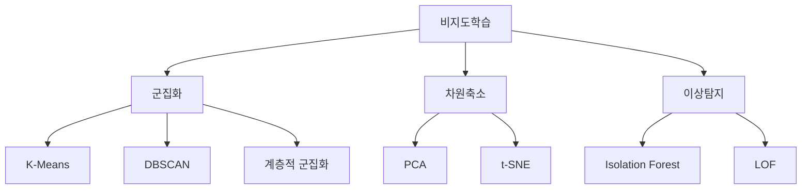
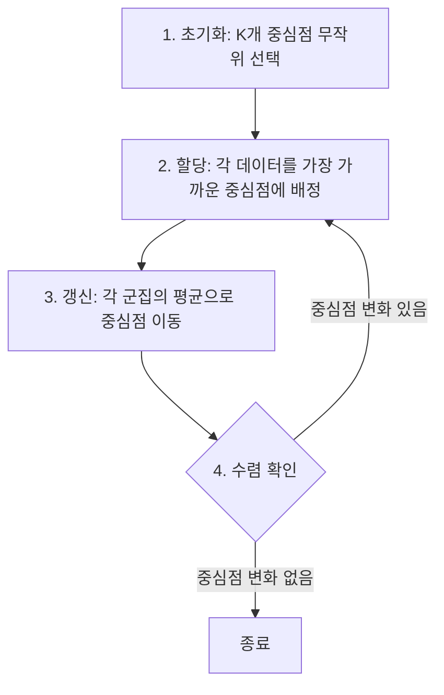

# [16차시] 비지도학습: 클러스터링과 이상 탐지

## 학습 목표

이 차시를 마치면 다음을 수행할 수 있음:

1. **비지도학습의 개념**과 활용 사례를 이해함
2. **K-Means**로 데이터를 군집화함
3. **클러스터링 기반 이상 탐지** 개념을 파악함

---

## 실습 데이터셋

| 데이터셋 | 출처 | 용도 |
|----------|------|------|
| **Iris** | sklearn.datasets | 클러스터링 실습 (레이블 없이 군집화) |
| **Wine** | sklearn.datasets | 다차원 군집화 및 이상 탐지 |

---

## 강의 구성

| 파트 | 주제 | 핵심 내용 |
|:----:|------|----------|
| 1 | 비지도학습 개념 | 지도학습과 비교, 활용 사례 |
| 2 | K-Means 클러스터링 | 알고리즘 원리, 최적 K 선택 |
| 3 | 이상 탐지 개념 | 거리 기반 이상치 탐지 |

---

## 파트 1: 비지도학습의 개념

### 개념 설명

#### 지도학습 vs 비지도학습

머신러닝은 레이블(정답) 유무에 따라 크게 두 가지로 구분됨.

| 구분 | 지도학습 (Supervised) | 비지도학습 (Unsupervised) |
|------|----------------------|---------------------------|
| **정답** | 있음 (레이블) | 없음 |
| **목표** | 정답 예측 | 구조/패턴 발견 |
| **대표 문제** | 분류, 회귀 | 군집화, 차원축소 |
| **예시** | 불량/정상 분류 | 유사 제품 그룹화 |

```
지도학습:
[입력] + [정답] --> [학습] --> [예측 모델]

비지도학습:
[입력만] --> [학습] --> [패턴/구조 발견]
```

#### 비지도학습이 필요한 경우

레이블이 없거나 확보 비용이 큰 상황에서 활용됨:

| 상황 | 설명 |
|------|------|
| **레이블 없음** | 신제품으로 기존 분류 체계 없음 |
| **레이블 비용 높음** | 전문가 판단이 필요한 경우 |
| **탐색적 분석** | 데이터 구조를 먼저 파악 |
| **이상 탐지** | 정상만 있고 불량 사례 없음 |

#### 비지도학습의 종류



#### 제조업 활용 사례

| 적용 분야 | 비지도학습 방법 | 활용 예시 |
|----------|----------------|----------|
| **제품 분류** | K-Means | 물성 기반 제품 그룹화 |
| **공정 분석** | 군집화 | 유사 조건 군집별 분석 |
| **이상 탐지** | 거리 기반 | 정상 패턴 벗어난 데이터 |
| **차원 축소** | PCA | 센서 변수 압축 |

### 실습 코드

#### 라이브러리 및 데이터 로드

```python
import numpy as np
import pandas as pd
import matplotlib.pyplot as plt
from sklearn.datasets import load_iris, load_wine

# Iris 데이터셋 로드
iris = load_iris()
df_iris = pd.DataFrame(iris.data, columns=iris.feature_names)
df_iris['species'] = iris.target  # 군집화에서는 사용하지 않음 (검증용)

print("[Iris 데이터셋]")
print(f"샘플 수: {len(df_iris)}")
print(f"특성 수: {len(iris.feature_names)}")
print(f"특성 이름: {iris.feature_names}")
print(f"\n처음 5행:")
print(df_iris.head())
```

---

```python
# Wine 데이터셋 로드
wine = load_wine()
df_wine = pd.DataFrame(wine.data, columns=wine.feature_names)
df_wine['wine_class'] = wine.target  # 검증용

print("[Wine 데이터셋]")
print(f"샘플 수: {len(df_wine)}")
print(f"특성 수: {len(wine.feature_names)}")
print(f"특성 이름:")
for i, name in enumerate(wine.feature_names):
    print(f"  {i+1}. {name}")
```

---

#### 지도학습과 비지도학습 비교

```python
from sklearn.tree import DecisionTreeClassifier
from sklearn.cluster import KMeans

# 데이터 준비 (Iris의 2개 특성만 사용)
X = df_iris[['sepal length (cm)', 'petal length (cm)']].values
y_true = df_iris['species'].values

# 지도학습: 정답(y_true)을 사용
clf = DecisionTreeClassifier(random_state=42)
clf.fit(X, y_true)
y_supervised = clf.predict(X)

# 비지도학습: 정답 없이 패턴만 사용
kmeans = KMeans(n_clusters=3, random_state=42, n_init=10)
kmeans.fit(X)
y_unsupervised = kmeans.labels_

print("[학습 방식 비교]")
print(f"지도학습: 정답({len(set(y_true))}개 클래스)을 알려주고 학습")
print(f"비지도학습: 정답 없이 {len(set(y_unsupervised))}개 군집 발견")
```

---

```python
# 시각화로 비교
fig, axes = plt.subplots(1, 3, figsize=(14, 4))

# 실제 레이블
ax1 = axes[0]
for label in range(3):
    mask = y_true == label
    ax1.scatter(X[mask, 0], X[mask, 1], label=iris.target_names[label], alpha=0.7)
ax1.set_xlabel('sepal length (cm)')
ax1.set_ylabel('petal length (cm)')
ax1.set_title('Actual Labels (Ground Truth)')
ax1.legend()

# 지도학습 결과
ax2 = axes[1]
for label in range(3):
    mask = y_supervised == label
    ax2.scatter(X[mask, 0], X[mask, 1], alpha=0.7)
ax2.set_xlabel('sepal length (cm)')
ax2.set_ylabel('petal length (cm)')
ax2.set_title('Supervised Learning (DecisionTree)')

# 비지도학습 결과
ax3 = axes[2]
for label in range(3):
    mask = y_unsupervised == label
    ax3.scatter(X[mask, 0], X[mask, 1], alpha=0.7)
# 중심점 표시
centers = kmeans.cluster_centers_
ax3.scatter(centers[:, 0], centers[:, 1], c='red', marker='X', s=200,
            edgecolors='black', linewidths=2, label='Centroids')
ax3.set_xlabel('sepal length (cm)')
ax3.set_ylabel('petal length (cm)')
ax3.set_title('Unsupervised Learning (K-Means)')
ax3.legend()

plt.tight_layout()
plt.show()

print("\n핵심 차이:")
print("  - 지도학습: 정답을 알려주고 학습하여 새 데이터 예측")
print("  - 비지도학습: 정답 없이 데이터의 구조/패턴 발견")
```

### 결과 해설

- 지도학습은 정답 레이블을 활용하여 분류 경계를 학습함
- 비지도학습은 레이블 없이 데이터의 자연스러운 군집을 발견함
- K-Means가 찾은 군집은 실제 품종과 유사하지만, 레이블 순서는 다를 수 있음

---

## 파트 2: K-Means 클러스터링

### 개념 설명

#### K-Means 알고리즘

K개의 중심점(centroid)을 기준으로 데이터를 K개 군집으로 분할하는 알고리즘임.

핵심 아이디어:
- 각 데이터는 **가장 가까운 중심점**에 할당됨
- 중심점은 해당 군집의 **평균 위치**로 갱신됨
- 수렴할 때까지 반복함

#### K-Means 목적함수

군집 내 분산의 합(Within-Cluster Sum of Squares, WCSS)을 최소화함:

$$\min \sum_{i=1}^{k} \sum_{x \in C_i} ||x - \mu_i||^2$$

| 기호 | 의미 |
|------|------|
| $k$ | 군집 개수 |
| $C_i$ | $i$번째 군집에 속한 데이터 집합 |
| $\mu_i$ | $i$번째 군집의 중심점 (평균) |
| $\|\|x - \mu_i\|\|^2$ | 데이터 $x$와 중심점 $\mu_i$ 간 유클리드 거리의 제곱 |

#### K-Means 알고리즘 단계



#### 엘보우 방법 (Elbow Method)

최적의 군집 개수 K를 결정하는 방법임.

- **Inertia**: 군집 내 거리 제곱합 (WCSS)
- K가 증가하면 Inertia 감소
- 감소율이 급격히 줄어드는 지점 = 최적 K ("팔꿈치" 지점)

#### 실루엣 점수 (Silhouette Score)

군집의 품질을 평가하는 지표임:

$$s(i) = \frac{b(i) - a(i)}{\max(a(i), b(i))}$$

| 기호 | 의미 |
|------|------|
| $a(i)$ | 같은 군집 내 다른 데이터들과의 평균 거리 (밀집도) |
| $b(i)$ | 가장 가까운 다른 군집의 데이터들과의 평균 거리 (분리도) |

| 점수 범위 | 해석 |
|-----------|------|
| 1에 가까움 | 잘 분리된 군집 |
| 0 근처 | 군집 경계에 위치 |
| 음수 | 잘못된 군집 배정 가능성 |

### 실습 코드

#### K-Means 기본 실습

```python
from sklearn.cluster import KMeans
from sklearn.preprocessing import StandardScaler

# 데이터 준비 (Iris - 4개 특성 모두 사용)
X_iris = df_iris[iris.feature_names].values

# 데이터 표준화 (스케일 맞춤)
scaler = StandardScaler()
X_scaled = scaler.fit_transform(X_iris)

print("[데이터 표준화]")
print(f"원본 데이터 평균: {X_iris.mean(axis=0).round(2)}")
print(f"표준화 후 평균: {X_scaled.mean(axis=0).round(4)}")
print(f"표준화 후 표준편차: {X_scaled.std(axis=0).round(4)}")
```

---

```python
# K-Means 모델 생성 및 학습 (K=3)
kmeans = KMeans(
    n_clusters=3,       # 군집 개수
    random_state=42,    # 재현성
    n_init=10,          # 초기화 횟수 (가장 좋은 결과 선택)
    max_iter=300        # 최대 반복 횟수
)

# 학습
kmeans.fit(X_scaled)

print("[K-Means 학습 결과]")
print(f"군집 레이블: {kmeans.labels_[:20]}... (처음 20개)")
print(f"군집별 데이터 수:")
for i in range(3):
    count = (kmeans.labels_ == i).sum()
    print(f"  군집 {i}: {count}개")
print(f"Inertia (WCSS): {kmeans.inertia_:.2f}")
print(f"반복 횟수: {kmeans.n_iter_}")
```

---

```python
# 군집 중심점 확인
print("[군집 중심점 (표준화 기준)]")
centers_df = pd.DataFrame(
    kmeans.cluster_centers_,
    columns=iris.feature_names,
    index=['Cluster 0', 'Cluster 1', 'Cluster 2']
)
print(centers_df.round(2))

# 원본 스케일로 역변환
centers_original = scaler.inverse_transform(kmeans.cluster_centers_)
print("\n[군집 중심점 (원본 스케일)]")
centers_original_df = pd.DataFrame(
    centers_original,
    columns=iris.feature_names,
    index=['Cluster 0', 'Cluster 1', 'Cluster 2']
)
print(centers_original_df.round(2))
```

---

#### 엘보우 방법으로 최적 K 찾기

```python
# 다양한 K 값에 대해 Inertia 계산
k_range = range(1, 11)
inertias = []

for k in k_range:
    kmeans_temp = KMeans(n_clusters=k, random_state=42, n_init=10)
    kmeans_temp.fit(X_scaled)
    inertias.append(kmeans_temp.inertia_)

# 결과 출력
print("[엘보우 방법 - Inertia 변화]")
for k, inertia in zip(k_range, inertias):
    bar = '*' * int(inertia / 20)
    print(f"K={k:2}: {inertia:7.2f} {bar}")
```

---

```python
# 엘보우 그래프 시각화
plt.figure(figsize=(10, 5))

plt.subplot(1, 2, 1)
plt.plot(k_range, inertias, 'bo-', linewidth=2, markersize=8)
plt.axvline(x=3, color='r', linestyle='--', label='Elbow point (K=3)')
plt.xlabel('Number of Clusters (K)')
plt.ylabel('Inertia (WCSS)')
plt.title('Elbow Method')
plt.legend()
plt.grid(True, alpha=0.3)

# Inertia 감소율
plt.subplot(1, 2, 2)
inertia_diff = np.diff(inertias)
plt.bar(range(2, 11), -inertia_diff, color='steelblue', alpha=0.7)
plt.axhline(y=-inertia_diff[1], color='r', linestyle='--', alpha=0.5)
plt.xlabel('K')
plt.ylabel('Inertia Decrease')
plt.title('Inertia Decrease Rate')
plt.grid(True, alpha=0.3)

plt.tight_layout()
plt.show()

print("\n해석:")
print("  - K=3에서 Inertia 감소율이 급격히 줄어듦")
print("  - 따라서 최적 K=3으로 결정")
```

---

#### 실루엣 점수 계산

```python
from sklearn.metrics import silhouette_score, silhouette_samples

# 다양한 K 값에 대해 실루엣 점수 계산
silhouette_scores = []

for k in range(2, 11):  # K=1은 계산 불가
    kmeans_temp = KMeans(n_clusters=k, random_state=42, n_init=10)
    labels_temp = kmeans_temp.fit_predict(X_scaled)
    score = silhouette_score(X_scaled, labels_temp)
    silhouette_scores.append(score)
    print(f"K={k}: 실루엣 점수 = {score:.3f}")

# 최적 K 찾기
best_k = list(range(2, 11))[np.argmax(silhouette_scores)]
best_score = max(silhouette_scores)
print(f"\n최적 K={best_k} (실루엣 점수: {best_score:.3f})")
```

---

```python
# 실루엣 점수 시각화
plt.figure(figsize=(8, 5))
plt.plot(range(2, 11), silhouette_scores, 'go-', linewidth=2, markersize=8)
plt.axvline(x=best_k, color='r', linestyle='--', label=f'Best K={best_k}')
plt.xlabel('Number of Clusters (K)')
plt.ylabel('Silhouette Score')
plt.title('Silhouette Score by K')
plt.legend()
plt.grid(True, alpha=0.3)
plt.show()

print("실루엣 점수 해석 기준:")
print("  - 0.7 이상: 강한 구조")
print("  - 0.5 ~ 0.7: 합리적 구조")
print("  - 0.25 ~ 0.5: 약한 구조")
print("  - 0.25 미만: 구조 없음")
```

---

#### 군집화 결과 시각화

```python
# K=3으로 최종 군집화
kmeans_final = KMeans(n_clusters=3, random_state=42, n_init=10)
labels = kmeans_final.fit_predict(X_scaled)
centers = kmeans_final.cluster_centers_

# 2개 특성으로 시각화 (petal length, petal width)
X_vis = X_scaled[:, 2:4]  # petal length, petal width
centers_vis = centers[:, 2:4]

plt.figure(figsize=(10, 5))

# 군집 결과
plt.subplot(1, 2, 1)
colors = ['#1f77b4', '#ff7f0e', '#2ca02c']
for i in range(3):
    mask = labels == i
    plt.scatter(X_vis[mask, 0], X_vis[mask, 1], c=colors[i],
                label=f'Cluster {i}', alpha=0.6, s=50)
plt.scatter(centers_vis[:, 0], centers_vis[:, 1], c='red',
            marker='X', s=300, edgecolors='black', linewidths=2, label='Centroids')
plt.xlabel('Petal Length (standardized)')
plt.ylabel('Petal Width (standardized)')
plt.title('K-Means Clustering Result')
plt.legend()
plt.grid(True, alpha=0.3)

# 실제 레이블과 비교
plt.subplot(1, 2, 2)
for i, name in enumerate(iris.target_names):
    mask = df_iris['species'] == i
    plt.scatter(X_vis[mask, 0], X_vis[mask, 1], label=name, alpha=0.6, s=50)
plt.xlabel('Petal Length (standardized)')
plt.ylabel('Petal Width (standardized)')
plt.title('Actual Species Labels')
plt.legend()
plt.grid(True, alpha=0.3)

plt.tight_layout()
plt.show()
```

---

#### 군집 결과와 실제 레이블 비교

```python
# 군집 레이블과 실제 품종 비교
comparison = pd.DataFrame({
    'Cluster': labels,
    'Actual': df_iris['species']
})

# 교차표 생성
crosstab = pd.crosstab(comparison['Cluster'], comparison['Actual'])
crosstab.columns = iris.target_names
crosstab.index = ['Cluster 0', 'Cluster 1', 'Cluster 2']

print("[군집 결과 vs 실제 품종 - 교차표]")
print(crosstab)

print("\n해석:")
print("  - 군집이 실제 품종과 높은 일치도를 보임")
print("  - 비지도학습으로 레이블 없이도 품종 구분 가능")
print("  - 단, 군집 번호와 품종 순서는 일치하지 않을 수 있음")
```

### 결과 해설

- 엘보우 방법에서 K=3일 때 Inertia 감소율이 급격히 줄어듦
- 실루엣 점수도 K=2 또는 K=3에서 최고값을 보임
- K-Means가 발견한 군집은 실제 Iris 품종과 높은 일치도를 보임
- 비지도학습으로 레이블 없이도 의미 있는 그룹을 발견할 수 있음

---

## 파트 3: 클러스터링 기반 이상 탐지

### 개념 설명

#### 이상 탐지란?

정상 패턴에서 벗어난 이상 데이터(anomaly)를 찾는 기법임.

| 용어 | 설명 |
|------|------|
| **이상치 (Anomaly)** | 정상 패턴에서 벗어난 데이터 |
| **정상 (Normal)** | 일반적인 패턴의 데이터 |
| **이상 탐지** | 이상치를 자동으로 찾는 기법 |

#### 제조업 이상 탐지 적용

| 적용 분야 | 정상 패턴 | 이상 탐지 대상 |
|----------|----------|---------------|
| **설비 모니터링** | 정상 가동 센서값 | 비정상 진동, 온도 |
| **품질 관리** | 양품 측정값 | 규격 이탈 제품 |
| **공정 관리** | 정상 운전 조건 | 비정상 공정 조건 |

#### 클러스터링 기반 이상 탐지 원리

군집 중심에서 멀리 떨어진 데이터를 이상치로 판별함.

```
정상 데이터 군집:
        o o o
      o   X   o    X = 군집 중심
        o o o

                   * = 이상치 후보 (중심에서 멀리 떨어짐)
                *
```

#### 거리 계산

유클리드 거리(Euclidean Distance)를 사용함:

$$d(x, \mu) = \sqrt{\sum_{j=1}^{p}(x_j - \mu_j)^2}$$

| 기호 | 의미 |
|------|------|
| $x$ | 데이터 포인트 |
| $\mu$ | 군집 중심점 |
| $p$ | 특성 개수 |

### 실습 코드

#### 이상 탐지용 데이터 준비

```python
# Wine 데이터셋으로 이상 탐지 실습
X_wine = df_wine[wine.feature_names].values

# 표준화
scaler_wine = StandardScaler()
X_wine_scaled = scaler_wine.fit_transform(X_wine)

print("[Wine 데이터셋 정보]")
print(f"샘플 수: {len(X_wine_scaled)}")
print(f"특성 수: {X_wine_scaled.shape[1]}")
```

---

```python
# K-Means 군집화 (K=3)
kmeans_wine = KMeans(n_clusters=3, random_state=42, n_init=10)
labels_wine = kmeans_wine.fit_predict(X_wine_scaled)
centers_wine = kmeans_wine.cluster_centers_

print("[군집화 결과]")
for i in range(3):
    count = (labels_wine == i).sum()
    print(f"군집 {i}: {count}개 샘플")
```

---

#### 거리 기반 이상 탐지

```python
# 각 데이터와 해당 군집 중심 간 거리 계산
def calculate_distance_to_centroid(X, labels, centers):
    """각 데이터와 해당 군집 중심 간 거리 계산"""
    distances = []
    for i, (x, label) in enumerate(zip(X, labels)):
        centroid = centers[label]
        distance = np.sqrt(np.sum((x - centroid) ** 2))
        distances.append(distance)
    return np.array(distances)

distances = calculate_distance_to_centroid(X_wine_scaled, labels_wine, centers_wine)

print("[거리 통계]")
print(f"평균 거리: {distances.mean():.3f}")
print(f"표준편차: {distances.std():.3f}")
print(f"최소 거리: {distances.min():.3f}")
print(f"최대 거리: {distances.max():.3f}")
```

---

```python
# 거리 분포 시각화
plt.figure(figsize=(12, 4))

# 히스토그램
plt.subplot(1, 3, 1)
plt.hist(distances, bins=30, color='steelblue', alpha=0.7, edgecolor='black')
plt.axvline(x=np.percentile(distances, 95), color='r', linestyle='--',
            label='95th percentile')
plt.xlabel('Distance to Centroid')
plt.ylabel('Frequency')
plt.title('Distance Distribution')
plt.legend()

# 정렬된 거리
plt.subplot(1, 3, 2)
sorted_distances = np.sort(distances)
plt.plot(sorted_distances, 'b-', linewidth=1)
threshold_95 = np.percentile(distances, 95)
plt.axhline(y=threshold_95, color='r', linestyle='--', label='95th percentile')
plt.xlabel('Sample Index (sorted)')
plt.ylabel('Distance')
plt.title('Sorted Distances')
plt.legend()

# 군집별 거리 박스플롯
plt.subplot(1, 3, 3)
distance_by_cluster = [distances[labels_wine == i] for i in range(3)]
plt.boxplot(distance_by_cluster, labels=['Cluster 0', 'Cluster 1', 'Cluster 2'])
plt.ylabel('Distance to Centroid')
plt.title('Distance by Cluster')

plt.tight_layout()
plt.show()
```

---

#### 이상치 탐지 및 결과

```python
# 이상치 탐지 (상위 5%를 이상치로 판별)
threshold = np.percentile(distances, 95)
is_anomaly = distances > threshold

print(f"[이상 탐지 결과]")
print(f"임계값 (95th percentile): {threshold:.3f}")
print(f"정상 데이터: {(~is_anomaly).sum()}개 ({(~is_anomaly).mean():.1%})")
print(f"이상 데이터: {is_anomaly.sum()}개 ({is_anomaly.mean():.1%})")
```

---

```python
# 이상치 목록 확인
anomaly_indices = np.where(is_anomaly)[0]
print(f"\n[이상치 샘플 인덱스]")
print(anomaly_indices)

# 이상치 데이터 상세 확인
print(f"\n[이상치 샘플 상세 정보]")
for idx in anomaly_indices[:5]:  # 처음 5개만 출력
    print(f"\n샘플 {idx}:")
    print(f"  군집: {labels_wine[idx]}")
    print(f"  거리: {distances[idx]:.3f} (임계값: {threshold:.3f})")
    print(f"  실제 클래스: {df_wine.iloc[idx]['wine_class']}")
```

---

#### 이상치 시각화

```python
# 2개 특성으로 시각화 (PCA로 차원 축소)
from sklearn.decomposition import PCA

# 2차원으로 축소
pca = PCA(n_components=2)
X_pca = pca.fit_transform(X_wine_scaled)
centers_pca = pca.transform(centers_wine)

plt.figure(figsize=(10, 6))

# 정상 데이터
normal_mask = ~is_anomaly
plt.scatter(X_pca[normal_mask, 0], X_pca[normal_mask, 1],
            c=labels_wine[normal_mask], cmap='viridis',
            alpha=0.6, s=50, label='Normal')

# 이상 데이터
plt.scatter(X_pca[is_anomaly, 0], X_pca[is_anomaly, 1],
            c='red', marker='X', s=150, edgecolors='black',
            linewidths=2, label='Anomaly')

# 군집 중심
plt.scatter(centers_pca[:, 0], centers_pca[:, 1],
            c='yellow', marker='*', s=400, edgecolors='black',
            linewidths=2, label='Centroids')

plt.xlabel(f'PC1 ({pca.explained_variance_ratio_[0]:.1%} variance)')
plt.ylabel(f'PC2 ({pca.explained_variance_ratio_[1]:.1%} variance)')
plt.title('Anomaly Detection using K-Means Clustering')
plt.legend()
plt.grid(True, alpha=0.3)
plt.show()

print("\n시각화 해석:")
print("  - 파란색/초록색/보라색: 정상 데이터 (군집 내)")
print("  - 빨간 X: 이상치 (군집 중심에서 멀리 떨어짐)")
print("  - 노란 별: 군집 중심점")
```

---

#### 다양한 임계값 비교

```python
# 다양한 percentile로 이상 탐지
percentiles = [90, 95, 97, 99]

print("[임계값별 이상 탐지 결과]")
print("-" * 50)
print(f"{'Percentile':>12} | {'Threshold':>10} | {'Anomalies':>10} | {'Ratio':>8}")
print("-" * 50)

for pct in percentiles:
    thresh = np.percentile(distances, pct)
    n_anomaly = (distances > thresh).sum()
    ratio = n_anomaly / len(distances) * 100
    print(f"{pct:>12}% | {thresh:>10.3f} | {n_anomaly:>10} | {ratio:>7.1f}%")

print("-" * 50)
print("\n임계값 선택 가이드:")
print("  - 95%: 일반적인 이상 탐지 기준")
print("  - 99%: 매우 심각한 이상만 탐지")
print("  - 실무에서는 도메인 지식 기반으로 조정 필요")
```

---

#### 제조 데이터 시뮬레이션 이상 탐지

```python
# 제조 데이터 시뮬레이션
np.random.seed(42)
n_samples = 500

# 정상 데이터 생성 (2개 공정 조건 그룹)
normal_group1 = np.random.multivariate_normal(
    mean=[85, 50, 100],  # 온도, 습도, 속도
    cov=[[4, 0.5, 0.3], [0.5, 9, 0.2], [0.3, 0.2, 16]],
    size=int(n_samples * 0.6)
)

normal_group2 = np.random.multivariate_normal(
    mean=[90, 45, 110],
    cov=[[4, 0.5, 0.3], [0.5, 9, 0.2], [0.3, 0.2, 16]],
    size=int(n_samples * 0.35)
)

# 이상 데이터 생성 (극단적인 값)
anomaly_data = np.random.multivariate_normal(
    mean=[100, 70, 130],  # 비정상 조건
    cov=[[10, 0, 0], [0, 15, 0], [0, 0, 25]],
    size=int(n_samples * 0.05)
)

# 데이터 결합
X_mfg = np.vstack([normal_group1, normal_group2, anomaly_data])
y_true_mfg = np.array([0] * len(normal_group1) + [0] * len(normal_group2) +
                       [1] * len(anomaly_data))

df_mfg = pd.DataFrame(X_mfg, columns=['Temperature', 'Humidity', 'Speed'])
df_mfg['Actual_Anomaly'] = y_true_mfg

print("[제조 시뮬레이션 데이터]")
print(f"전체 샘플: {len(df_mfg)}")
print(f"정상 샘플: {(y_true_mfg == 0).sum()}")
print(f"이상 샘플: {(y_true_mfg == 1).sum()}")
print(f"\n데이터 통계:")
print(df_mfg.describe().round(2))
```

---

```python
# K-Means 이상 탐지 적용
scaler_mfg = StandardScaler()
X_mfg_scaled = scaler_mfg.fit_transform(X_mfg)

kmeans_mfg = KMeans(n_clusters=2, random_state=42, n_init=10)
labels_mfg = kmeans_mfg.fit_predict(X_mfg_scaled)
centers_mfg = kmeans_mfg.cluster_centers_

# 거리 계산
distances_mfg = calculate_distance_to_centroid(X_mfg_scaled, labels_mfg, centers_mfg)

# 이상 탐지 (상위 10%)
threshold_mfg = np.percentile(distances_mfg, 90)
predicted_anomaly = (distances_mfg > threshold_mfg).astype(int)

print("[제조 데이터 이상 탐지 결과]")
print(f"임계값: {threshold_mfg:.3f}")
print(f"예측 이상: {predicted_anomaly.sum()}개")
print(f"실제 이상: {y_true_mfg.sum()}개")
```

---

```python
# 혼동 행렬로 성능 평가
from sklearn.metrics import confusion_matrix, classification_report

cm = confusion_matrix(y_true_mfg, predicted_anomaly)
print("\n[혼동 행렬]")
print(f"              예측:정상  예측:이상")
print(f"실제:정상       {cm[0,0]:5}      {cm[0,1]:5}")
print(f"실제:이상       {cm[1,0]:5}      {cm[1,1]:5}")

# 탐지율
true_positives = cm[1, 1]
false_negatives = cm[1, 0]
detection_rate = true_positives / (true_positives + false_negatives) * 100
print(f"\n이상 탐지율: {detection_rate:.1f}%")
```

---

```python
# 결과 시각화
fig, axes = plt.subplots(1, 2, figsize=(12, 5))

# 실제 레이블
ax1 = axes[0]
colors_actual = ['steelblue' if y == 0 else 'red' for y in y_true_mfg]
ax1.scatter(X_mfg[:, 0], X_mfg[:, 2], c=colors_actual, alpha=0.6, s=50)
ax1.set_xlabel('Temperature')
ax1.set_ylabel('Speed')
ax1.set_title('Actual Labels (Blue=Normal, Red=Anomaly)')
ax1.grid(True, alpha=0.3)

# 예측 결과
ax2 = axes[1]
colors_pred = ['steelblue' if y == 0 else 'red' for y in predicted_anomaly]
ax2.scatter(X_mfg[:, 0], X_mfg[:, 2], c=colors_pred, alpha=0.6, s=50)
# 군집 중심 역변환
centers_original_mfg = scaler_mfg.inverse_transform(centers_mfg)
ax2.scatter(centers_original_mfg[:, 0], centers_original_mfg[:, 2],
            c='yellow', marker='*', s=400, edgecolors='black',
            linewidths=2, label='Centroids')
ax2.set_xlabel('Temperature')
ax2.set_ylabel('Speed')
ax2.set_title('Predicted Labels (Blue=Normal, Red=Anomaly)')
ax2.legend()
ax2.grid(True, alpha=0.3)

plt.tight_layout()
plt.show()
```

### 결과 해설

- 군집 중심에서 거리가 먼 데이터를 이상치로 탐지함
- 임계값 설정에 따라 탐지 민감도가 달라짐
- 제조 시뮬레이션 데이터에서 이상 조건을 성공적으로 탐지함
- 실무에서는 도메인 지식을 바탕으로 임계값을 조정해야 함

---

## 핵심 정리

### 비지도학습 핵심 개념

| 개념 | 설명 |
|------|------|
| **비지도학습** | 레이블 없이 데이터의 패턴/구조 발견 |
| **군집화** | 유사한 데이터를 그룹으로 묶음 |
| **K-Means** | K개 중심점 기반 군집화 알고리즘 |
| **이상 탐지** | 정상 패턴에서 벗어난 데이터 탐지 |

### 주요 수식

| 수식 | 용도 |
|------|------|
| $\min \sum_{i=1}^{k} \sum_{x \in C_i} \|\|x - \mu_i\|\|^2$ | K-Means 목적함수 |
| $s(i) = \frac{b(i) - a(i)}{\max(a(i), b(i))}$ | 실루엣 점수 |

### 최적 K 선택 방법

| 방법 | 기준 |
|------|------|
| **엘보우 방법** | Inertia 감소율이 급격히 줄어드는 지점 |
| **실루엣 점수** | 점수가 최대가 되는 K 선택 |

### sklearn 패턴

```python
# K-Means 기본 패턴
from sklearn.cluster import KMeans
from sklearn.preprocessing import StandardScaler

# 1. 표준화
scaler = StandardScaler()
X_scaled = scaler.fit_transform(X)

# 2. 군집화
kmeans = KMeans(n_clusters=3, random_state=42)
labels = kmeans.fit_predict(X_scaled)

# 3. 결과 확인
centers = kmeans.cluster_centers_
inertia = kmeans.inertia_
```

### 이상 탐지 프로세스

```
1. 데이터 표준화
       |
       v
2. K-Means 군집화
       |
       v
3. 군집 중심까지 거리 계산
       |
       v
4. 임계값 설정 (예: 상위 5%)
       |
       v
5. 임계값 초과 = 이상치
```
