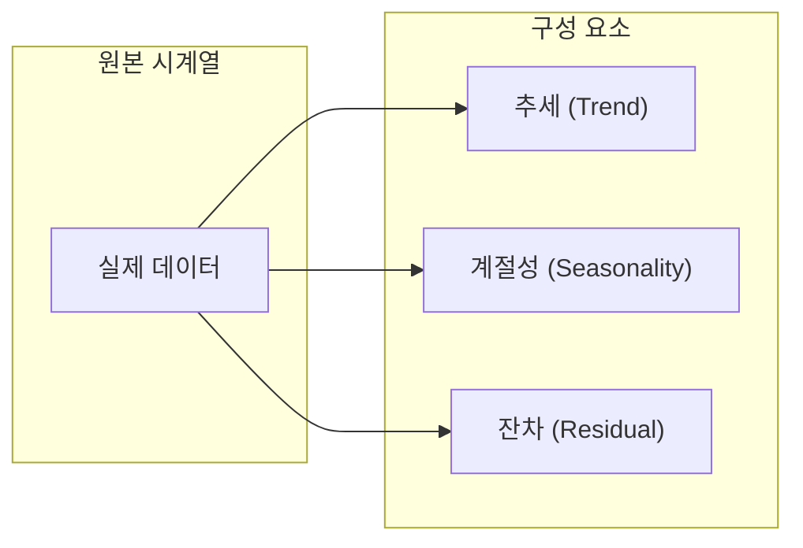
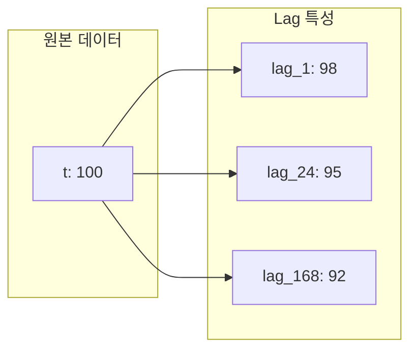

<!-- _class: lead -->
# [19차시] 시계열 데이터 분석과 예측

## 제조 AI 데이터 분석

---

# 학습 목표

1. **시간에 따라 변하는 데이터의 특성**을 이해한다
2. **시계열 특성 엔지니어링**을 수행한다
3. **ML 모델로 제조 설비 상태**를 예측한다

---

# 강의 구성 (25분)

| 파트 | 주제 | 시간 |
|:----:|------|:----:|
| 1 | 시계열 데이터의 이해 | 7분 |
| 2 | 시계열 특성 엔지니어링 | 8분 |
| 3 | ML 기반 예측 및 평가 | 10분 |

---

<!-- _class: lead -->
# Part 1
## 시계열 데이터의 이해

---

# 시계열 데이터란?

## 정의
- **시간 순서**로 기록된 데이터
- 각 데이터 포인트에 **타임스탬프** 존재

## 제조 현장 예시

| 데이터 | 주기 | 활용 |
|-------|:----:|------|
| 센서 온도/압력 | 초/분 | 이상 탐지 |
| 생산량 | 시간/일 | 수요 예측 |
| 설비 가동 로그 | 이벤트 | 예지 정비 |

---

# 시계열의 구성 요소



**분해 공식**: $Y_t = T_t + S_t + R_t$ (가법 모델)

---

# 시계열 데이터의 특성

| 특성 | 설명 | 수학적 표현 |
|------|------|------------|
| **시간 의존성** | 현재 값이 과거 값에 영향 | $X_t = f(X_{t-1}, X_{t-2}, ...)$ |
| **자기상관** | 자기 자신과의 상관관계 | $\rho_k = Corr(X_t, X_{t-k})$ |
| **계절성** | 주기적 반복 패턴 | $S_t = S_{t+m}$ (주기 m) |

---

# 자기상관함수 (ACF)

## 정의
시차 k에서의 자기상관 계수

$$\rho_k = \frac{\sum_{t=k+1}^{n}(X_t - \bar{X})(X_{t-k} - \bar{X})}{\sum_{t=1}^{n}(X_t - \bar{X})^2}$$

## 해석
- $\rho_1$: 1시점 전과의 상관 (lag-1)
- $\rho_{12}$: 12시점 전과의 상관 (월별 데이터의 연간 계절성)

---

# 일반 데이터 vs 시계열 데이터

| 일반 데이터 | 시계열 데이터 |
|------------|--------------|
| 행(row)이 독립 | 행 간에 **순서** 존재 |
| 랜덤 셔플 가능 | 셔플하면 **의미 손실** |
| 랜덤 분할 가능 | **시간 기준 분할** 필수 |
| K-Fold 교차검증 | **TimeSeriesSplit** 필수 |

---

# 시간 기준 분할의 중요성

```
전체 데이터 (시간순):
[--------- 학습 (70%) ---------|-- 검증 (15%) --|-- 테스트 (15%) --]
         과거                                                     미래
                              -->  시간 흐름  -->
```

**잘못된 방법**: 랜덤 분할 (미래 데이터로 과거 예측 = 데이터 누출)

**올바른 방법**: 시간 순서대로 분할 (과거로 미래 예측)

---

<!-- _class: lead -->
# Part 2
## 시계열 특성 엔지니어링

---

# 시계열 특성의 종류

| 종류 | 설명 | 예시 |
|------|------|------|
| **날짜 특성** | 시간에서 추출 | hour, dayofweek, month |
| **Lag 특성** | 과거 값 | lag_1, lag_24, lag_168 |
| **Rolling 특성** | 이동 통계 | ma_7, std_7, max_24 |
| **변화 특성** | 변화량/변화율 | diff, pct_change |

---

# 이동평균 (Moving Average)

## 수식

$$MA_t = \frac{1}{n} \sum_{i=0}^{n-1} X_{t-i}$$

## 의미
- $n$: 윈도우 크기
- 노이즈 제거, 추세 파악에 유용
- **주의**: 예측 시 shift(1) 필수 (미래 누출 방지)

---

# 지수평활 (Exponential Smoothing)

## 수식

$$S_t = \alpha X_t + (1-\alpha) S_{t-1}$$

## 특징
- $\alpha$: 평활 계수 (0 < $\alpha$ < 1)
- 최근 값에 더 큰 가중치
- $\alpha$가 클수록 최근 값 반영 증가

---

# Lag 특성 생성



**핵심**: `shift()` 함수로 과거 값을 특성으로 활용

---

# 데이터 누출 방지

## 잘못된 방법 (미래 정보 포함)
```python
df['ma_7'] = df['value'].rolling(7).mean()
# 현재 값이 이동평균에 포함됨!
```

## 올바른 방법 (shift 먼저)
```python
df['ma_7'] = df['value'].shift(1).rolling(7).mean()
# 어제까지의 데이터만 사용
```

---

# 주기적 인코딩

## 문제
- hour: 0, 1, 2, ... 23, 0, 1, ...
- 23시와 0시는 가깝지만 숫자로는 23 차이

## 해결: 사인/코사인 인코딩

$$hour_{sin} = \sin\left(\frac{2\pi \cdot hour}{24}\right)$$

$$hour_{cos} = \cos\left(\frac{2\pi \cdot hour}{24}\right)$$

---

<!-- _class: lead -->
# Part 3
## ML 기반 예측 및 평가

---

# ML 모델 적용 흐름


---

# 시계열 예측 평가 지표

| 지표 | 공식 | 특징 |
|------|------|------|
| **MAE** | $\frac{1}{n}\sum\|y - \hat{y}\|$ | 해석 쉬움, 단위 동일 |
| **RMSE** | $\sqrt{\frac{1}{n}\sum(y - \hat{y})^2}$ | 큰 오차에 패널티 |
| **MAPE** | $\frac{100}{n}\sum\frac{\|y - \hat{y}\|}{y}$ | 상대적 오차 (%) |

---

# 지표 선택 가이드

| 상황 | 권장 지표 |
|------|----------|
| 일반적인 경우 | MAE, RMSE |
| 큰 오차가 치명적 | RMSE |
| 상대적 오차 중요 | MAPE |
| 비즈니스 보고 | MAPE (% 직관적) |
| 0에 가까운 값 | MAE, RMSE (MAPE 불가) |

---

# TimeSeriesSplit 교차검증

```
Fold 1: [====Train====][=Val=]
Fold 2: [======Train======][=Val=]
Fold 3: [========Train========][=Val=]
Fold 4: [==========Train==========][=Val=]
Fold 5: [============Train============][=Val=]
        -----------------------> 시간
```

항상 과거로 미래를 예측하는 방식 유지

---

# 특성 중요도 분석

## RandomForest의 장점
- **비선형 관계** 학습 가능
- **특성 중요도** 자동 산출
- **과적합에 강함**

## 일반적 결과
- lag_1, lag_24 등 **Lag 특성**이 높은 중요도
- 계절성 있으면 **month, hour** 특성도 중요

---

# 핵심 정리

| 개념 | 핵심 내용 |
|------|----------|
| **시계열 특성** | 시간 의존성, 자기상관, 계절성 |
| **이동평균** | $MA_t = \frac{1}{n}\sum X_{t-i}$, 노이즈 제거 |
| **지수평활** | $S_t = \alpha X_t + (1-\alpha)S_{t-1}$ |
| **ACF** | 시차별 자기상관 계수 |
| **shift(1)** | 미래 누출 방지 필수 |
| **TimeSeriesSplit** | 시계열 전용 교차검증 |

---

# Pandas 시계열 핵심 함수

| 함수 | 용도 |
|------|------|
| `pd.to_datetime()` | 문자열을 datetime으로 변환 |
| `df.index.hour` (dt 접근자) | 시간 정보 추출 |
| `df.resample('D')` | 주기 변환 (일별, 주별 등) |
| `df.rolling(n)` | 이동 통계 계산 |
| `df.shift(n)` | 시차 변수 생성 |
| `df.diff(n)` | 차분 계산 |

---

<!-- _class: lead -->
# 수고하셨습니다!

## 실습 파일: `19_timeseries_analysis_prediction.ipynb`
