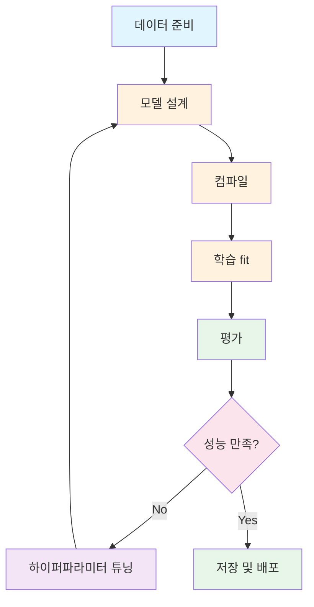
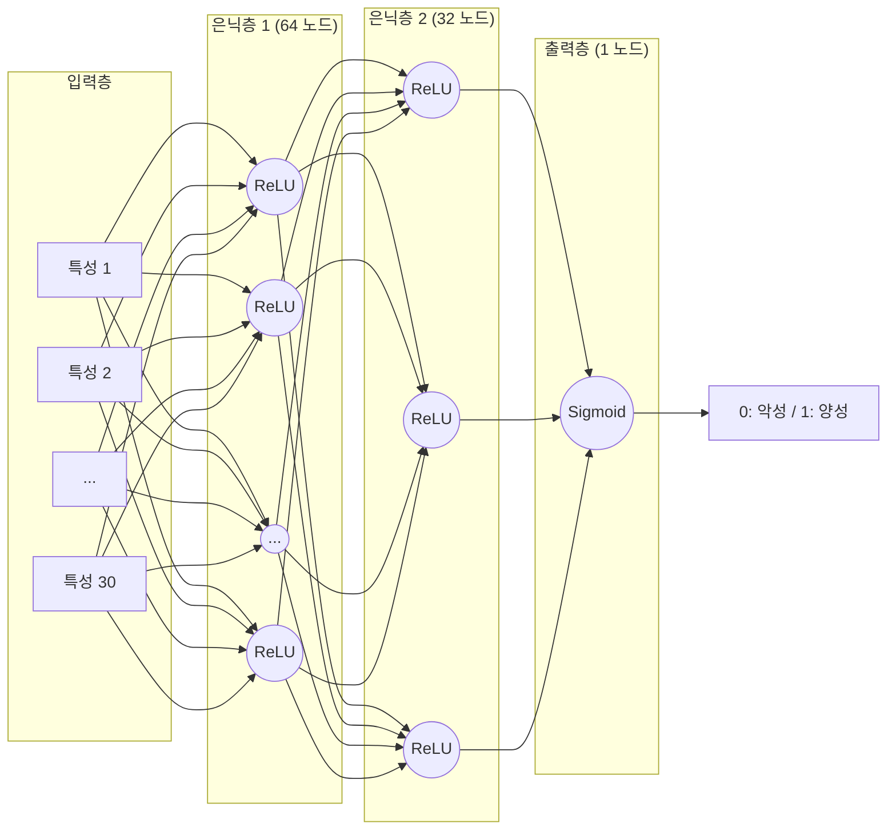

# 21차시: 딥러닝 실습 - MLP로 품질 예측

## 학습 목표

1. **Keras** 프레임워크의 기본 사용법을 익힘
2. **MLP 모델**을 구현하고 학습시킴
3. 학습 결과를 **분석하고 개선**함
4. **수학적 원리**를 이해하고 실무에 적용함

---

## 강의 구성

| 구간 | 시간 | 내용 |
|:----:|:----:|------|
| Part 1 | 8분 | Keras 기초 |
| Part 2 | 10분 | MLP 모델 구현 |
| Part 3 | 5분 | 학습 및 개선 |
| 정리 | 2분 | 핵심 요약 |

---

## 지난 시간 복습

- **인공 뉴런**: z = wx + b, y = f(z)
- **활성화 함수**: ReLU(은닉층), Sigmoid/Softmax(출력층)
- **순전파**: 입력에서 출력으로 계산
- **역전파**: 손실에서 기울기 계산 후 가중치 업데이트

---

# Part 1: Keras 기초

## 1.1 Keras란?

Keras는 TensorFlow 위에서 동작하는 고수준 딥러닝 API임. 복잡한 수학적 구현 없이도 직관적인 인터페이스로 모델을 구현할 수 있으며, 산업계에서 가장 많이 사용되는 프레임워크임.

**설치 및 임포트**

```python
# 설치
pip install tensorflow

# 임포트
import tensorflow as tf
from tensorflow import keras
from tensorflow.keras import layers
from tensorflow.keras.models import Sequential
from tensorflow.keras.layers import Dense, Dropout, BatchNormalization
```

---

## 1.2 Keras 모델 개발 흐름



Keras 모델 개발은 위 흐름을 따름. 성능이 만족스럽지 않으면 하이퍼파라미터를 조정하여 반복 개선함.

---

## 1.3 왜 Keras인가?

| NumPy 직접 구현 | Keras 사용 |
|----------------|-----------|
| 순전파 직접 작성 | model.predict() |
| 역전파 직접 계산 | 자동 미분 |
| 경사하강법 구현 | 옵티마이저 선택 |
| 수십~수백 줄 코드 | **10줄 이내** |

---

## 1.4 Sequential 모델 구조

```
Sequential 모델
    |
    +-- Dense(64, activation='relu')    <- 은닉층 1
    +-- Dense(32, activation='relu')    <- 은닉층 2
    +-- Dense(1, activation='sigmoid')  <- 출력층
```

층을 순서대로 쌓는 **Sequential** 모델을 사용함.

---

## 1.5 Sequential 모델 생성

```python
from tensorflow.keras.models import Sequential
from tensorflow.keras.layers import Dense

# 방법 1: 리스트로 전달
model = Sequential([
    Dense(64, activation='relu', input_shape=(30,)),
    Dense(32, activation='relu'),
    Dense(1, activation='sigmoid')
])

# 방법 2: add로 추가
model = Sequential()
model.add(Dense(64, activation='relu', input_shape=(30,)))
model.add(Dense(32, activation='relu'))
model.add(Dense(1, activation='sigmoid'))
```

---

## 1.6 Dense 층 이해

```python
Dense(units=64, activation='relu', input_shape=(30,))
```

| 파라미터 | 의미 |
|---------|------|
| `units` | 노드(뉴런) 개수 |
| `activation` | 활성화 함수 |
| `input_shape` | 입력 형태 (첫 번째 층만 필요) |

---

## 1.7 활성화 함수 선택

| 위치 | 문제 유형 | 활성화 함수 |
|------|----------|------------|
| 은닉층 | 모든 문제 | `'relu'` |
| 출력층 | 이진 분류 | `'sigmoid'` |
| 출력층 | 다중 분류 | `'softmax'` |
| 출력층 | 회귀 | `None` (linear) |

---

## 1.8 파라미터 수 계산

MLP에서 각 층의 파라미터(가중치와 편향) 수를 계산하는 공식:

$$Parameters = (n_{in} \times n_{out}) + n_{out}$$

- $n_{in}$: 이전 층의 노드 수
- $n_{out}$: 현재 층의 노드 수
- $n_{out}$: 편향(bias) 개수

**계산 예시** (입력 30개 -> 64 -> 32 -> 1):

```
입력(30) -> Dense(64): 30 x 64 + 64 = 1,984
Dense(64) -> Dense(32): 64 x 32 + 32 = 2,080
Dense(32) -> Dense(1): 32 x 1 + 1 = 33

총: 4,097개 파라미터
```

---

## 1.9 모델 요약

```python
model.summary()
```

출력 예시:
```
Model: "sequential"
_________________________________________________________________
Layer (type)                 Output Shape              Param #
=================================================================
dense (Dense)                (None, 64)                1984
dense_1 (Dense)              (None, 32)                2080
dense_2 (Dense)              (None, 1)                 33
=================================================================
Total params: 4,097
Trainable params: 4,097
Non-trainable params: 0
```

---

## 1.10 모델 컴파일

```python
model.compile(
    optimizer='adam',           # 옵티마이저
    loss='binary_crossentropy', # 손실 함수
    metrics=['accuracy']        # 평가 지표
)
```

**컴파일 = 학습 설정 정의**

---

## 1.11 옵티마이저 선택

| 옵티마이저 | 특징 |
|-----------|------|
| `'sgd'` | 기본 경사하강법 |
| `'adam'` | **가장 많이 사용** (적응적 학습률) |
| `'rmsprop'` | RNN에 적합 |

**권장: 'adam'으로 시작**

---

## 1.12 Adam 옵티마이저 원리

Adam은 모멘텀과 RMSprop을 결합한 최적화 알고리즘임.

**1차 모멘트 (평균):**

$$m_t = \beta_1 m_{t-1} + (1-\beta_1)g_t$$

**2차 모멘트 (분산):**

$$v_t = \beta_2 v_{t-1} + (1-\beta_2)g_t^2$$

- $g_t$: 현재 기울기
- $\beta_1 = 0.9$, $\beta_2 = 0.999$: 감쇠율
- 각 파라미터마다 적응적으로 학습률을 조정함

---

## 1.13 손실 함수 선택

| 문제 유형 | 손실 함수 |
|----------|----------|
| 이진 분류 | `'binary_crossentropy'` |
| 다중 분류 | `'categorical_crossentropy'` |
| 다중 분류 (정수 라벨) | `'sparse_categorical_crossentropy'` |
| 회귀 | `'mse'` 또는 `'mae'` |

---

## 1.14 Binary Cross-Entropy Loss

이진 분류에서 사용하는 손실 함수의 수학적 정의:

$$L = -\frac{1}{N}\sum_{i=1}^{N}[y_i\log(\hat{y}_i) + (1-y_i)\log(1-\hat{y}_i)]$$

- $N$: 샘플 수
- $y_i$: 실제 라벨 (0 또는 1)
- $\hat{y}_i$: 예측 확률 (0~1)

**해석:**
- 정답이 1일 때: $-\log(\hat{y})$ -> 예측이 1에 가까울수록 손실 감소
- 정답이 0일 때: $-\log(1-\hat{y})$ -> 예측이 0에 가까울수록 손실 감소

---

## 실습 코드: Keras 기본 설정

```python
import numpy as np
import pandas as pd
import matplotlib.pyplot as plt
from sklearn.datasets import load_breast_cancer
from sklearn.model_selection import train_test_split
from sklearn.preprocessing import StandardScaler
from sklearn.metrics import classification_report, confusion_matrix, roc_auc_score

# TensorFlow/Keras 임포트
import os
os.environ['TF_CPP_MIN_LOG_LEVEL'] = '2'  # 경고 숨기기

import tensorflow as tf
from tensorflow.keras.models import Sequential, load_model
from tensorflow.keras.layers import Dense, Dropout, BatchNormalization
from tensorflow.keras.callbacks import EarlyStopping, ModelCheckpoint, ReduceLROnPlateau
from tensorflow.keras.optimizers import Adam
from tensorflow.keras.regularizers import l2

print(f"TensorFlow 버전: {tf.__version__}")
```

---

# Part 2: MLP 모델 구현

## 2.1 실습 목표

**유방암 진단 분류** (Breast Cancer Wisconsin 데이터셋)
- 입력: 세포 특성 데이터 (30개 특성)
- 출력: 양성/악성 분류
- 목표: 정확한 진단 예측

---

## 2.2 MLP 아키텍처 설계



---

## 2.3 데이터 준비

```python
# Breast Cancer 데이터 로드
cancer = load_breast_cancer()
X = cancer.data
y = cancer.target

# DataFrame으로 변환
df = pd.DataFrame(X, columns=cancer.feature_names)
df['target'] = y

print(f"총 샘플 수: {len(df)}")
print(f"특성 수: {len(cancer.feature_names)}")
print(f"클래스: {cancer.target_names} (0=악성, 1=양성)")
print(f"양성(benign) 비율: {y.mean():.2%}")
```

출력:
```
총 샘플 수: 569
특성 수: 30
클래스: ['malignant' 'benign'] (0=악성, 1=양성)
양성(benign) 비율: 62.74%
```

---

## 2.4 데이터 전처리

```python
# 정규화 (StandardScaler)
scaler = StandardScaler()
X_scaled = scaler.fit_transform(X)

print(f"정규화 전 - mean radius 범위: {X[:, 0].min():.1f} ~ {X[:, 0].max():.1f}")
print(f"정규화 후 - mean radius 범위: {X_scaled[:, 0].min():.2f} ~ {X_scaled[:, 0].max():.2f}")

# 학습/테스트 분할
X_train, X_test, y_train, y_test = train_test_split(
    X_scaled, y, test_size=0.2, random_state=42, stratify=y
)

print(f"학습 세트: {len(X_train)}개")
print(f"테스트 세트: {len(X_test)}개")
```

---

## 2.5 데이터 정규화의 중요성

| 정규화 전 | 정규화 후 |
|----------|----------|
| 반지름: 6~28 | -2.0 ~ 3.0 |
| 면적: 143~2501 | -1.5 ~ 4.0 |
| 스케일 불균형 | **스케일 통일** |
| 학습 불안정 | **학습 안정** |

**신경망은 정규화 필수!**

---

## 2.6 기본 MLP 모델 생성

```python
# 기본 모델 생성
model_basic = Sequential([
    Dense(64, activation='relu', input_shape=(X_train.shape[1],)),
    Dense(32, activation='relu'),
    Dense(1, activation='sigmoid')
])

# 컴파일
model_basic.compile(
    optimizer='adam',
    loss='binary_crossentropy',
    metrics=['accuracy']
)

print("모델 구조:")
model_basic.summary()
```

---

## 2.7 Dropout 이해

학습 시 일부 노드를 무작위로 비활성화하여 과적합을 방지하는 기법임.

```
학습 시:
[O] [X] [O] [O] [X] [O]  <- 30% 무작위 비활성화
 |   |   |   |   |   |
[O] [O] [O] [O] [O] [O]

예측 시:
모든 노드 활성화 (출력에 보존 확률 곱함)
```

**효과**: 특정 노드에 의존하지 않음 -> 일반화 능력 향상

---

## 2.8 Dropout 수학적 표현

Dropout의 수학적 동작:

$$\tilde{a}^{(l)} = r^{(l)} \odot a^{(l)}, \quad r^{(l)} \sim Bernoulli(p)$$

- $a^{(l)}$: l번째 층의 활성화 값
- $r^{(l)}$: 베르누이 분포를 따르는 마스크 (0 또는 1)
- $p$: 보존 확률 (예: Dropout(0.3)이면 p=0.7)
- $\odot$: 원소별 곱셈 (element-wise multiplication)

**테스트 시**: 모든 노드 활성화, 출력에 p를 곱하여 스케일 조정

---

## 2.9 Dropout 사용법

```python
from tensorflow.keras.layers import Dropout

# Dropout(rate): rate 비율로 무작위 비활성화
model = Sequential([
    Dense(64, activation='relu', input_shape=(30,)),
    Dropout(0.3),  # 30% 드롭아웃

    Dense(32, activation='relu'),
    Dropout(0.2),  # 20% 드롭아웃

    Dense(1, activation='sigmoid')
])
```

**권장**: 은닉층 사이에 0.2~0.5

---

## 2.10 개선된 모델 설계

```python
from tensorflow.keras.layers import Dense, Dropout, BatchNormalization

# 개선된 모델
model = Sequential([
    # 첫 번째 은닉층
    Dense(64, activation='relu', input_shape=(X_train.shape[1],)),
    BatchNormalization(),
    Dropout(0.3),

    # 두 번째 은닉층
    Dense(32, activation='relu'),
    BatchNormalization(),
    Dropout(0.2),

    # 세 번째 은닉층
    Dense(16, activation='relu'),
    Dropout(0.1),

    # 출력층
    Dense(1, activation='sigmoid')
])

# 컴파일
model.compile(
    optimizer=Adam(learning_rate=0.001),
    loss='binary_crossentropy',
    metrics=['accuracy']
)

print("개선된 모델 구조:")
model.summary()
```

---

## 2.11 모델 학습 (fit)

```python
history = model.fit(
    X_train, y_train,           # 학습 데이터
    epochs=100,                  # 반복 횟수
    batch_size=32,               # 배치 크기
    validation_split=0.2,        # 검증 데이터 비율
    verbose=1                    # 출력 레벨
)
```

---

## 2.12 fit 파라미터

| 파라미터 | 의미 | 권장값 |
|---------|------|--------|
| epochs | 전체 데이터 반복 횟수 | 50~200 |
| batch_size | 한 번에 학습할 샘플 수 | 32~128 |
| validation_split | 검증 데이터 비율 | 0.2 |
| verbose | 0: 무출력, 1: 진행바, 2: 에포크당 한 줄 | 1 |

---

## 2.13 학습 출력 예시

```
Epoch 1/100
12/12 [==============================] - 1s 30ms/step
- loss: 0.6543 - accuracy: 0.6123 - val_loss: 0.5890 - val_accuracy: 0.6500

Epoch 50/100
12/12 [==============================] - 0s 5ms/step
- loss: 0.1234 - accuracy: 0.9512 - val_loss: 0.1567 - val_accuracy: 0.9450

Epoch 100/100
12/12 [==============================] - 0s 5ms/step
- loss: 0.0856 - accuracy: 0.9725 - val_loss: 0.1234 - val_accuracy: 0.9560
```

---

## 2.14 history 객체

```python
# 학습 기록
history.history.keys()
# dict_keys(['loss', 'accuracy', 'val_loss', 'val_accuracy'])

# 손실 기록 접근
train_loss = history.history['loss']      # 학습 손실
val_loss = history.history['val_loss']    # 검증 손실

# 정확도 기록 접근
train_acc = history.history['accuracy']       # 학습 정확도
val_acc = history.history['val_accuracy']     # 검증 정확도
```

---

## 2.15 학습 곡선 시각화

```python
import matplotlib.pyplot as plt

fig, axes = plt.subplots(1, 2, figsize=(14, 5))

# 손실 곡선
axes[0].plot(history.history['loss'], label='Train Loss', linewidth=2, color='blue')
axes[0].plot(history.history['val_loss'], label='Validation Loss', linewidth=2, color='orange')
axes[0].set_title('Loss Curve', fontsize=14)
axes[0].set_xlabel('Epoch')
axes[0].set_ylabel('Loss')
axes[0].legend()
axes[0].grid(True, alpha=0.3)

# 정확도 곡선
axes[1].plot(history.history['accuracy'], label='Train Accuracy', linewidth=2, color='blue')
axes[1].plot(history.history['val_accuracy'], label='Validation Accuracy', linewidth=2, color='orange')
axes[1].set_title('Accuracy Curve', fontsize=14)
axes[1].set_xlabel('Epoch')
axes[1].set_ylabel('Accuracy')
axes[1].legend()
axes[1].grid(True, alpha=0.3)

plt.tight_layout()
plt.savefig('learning_curves.png', dpi=150, bbox_inches='tight')
plt.show()
```

---

## 2.16 학습 곡선 해석

| 패턴 | 의미 | 조치 |
|-----|------|------|
| Train 감소, Val 감소 | 정상 학습 | 계속 진행 |
| Train 감소, Val 정체 | 과적합 시작 | 조기 종료 |
| Train 감소, Val 증가 | 과적합 | Dropout/정규화 강화 |
| Train 정체, Val 정체 | 학습 정체 | 학습률 조정 |

---

## 2.17 모델 평가

```python
# 테스트 데이터로 평가
loss, accuracy = model.evaluate(X_test, y_test, verbose=0)
print(f"테스트 손실: {loss:.4f}")
print(f"테스트 정확도: {accuracy:.2%}")

# 예측
y_pred_prob = model.predict(X_test, verbose=0)
y_pred = (y_pred_prob > 0.5).astype(int).ravel()

# AUC 점수
auc_score = roc_auc_score(y_test, y_pred_prob)
print(f"AUC: {auc_score:.4f}")
```

---

## 2.18 분류 보고서

```python
from sklearn.metrics import classification_report

print(classification_report(y_test, y_pred,
                            target_names=['악성(Malignant)', '양성(Benign)']))
```

출력 예시:
```
                   precision    recall  f1-score   support

악성(Malignant)        0.95      0.93      0.94        43
  양성(Benign)         0.96      0.97      0.96        71

      accuracy                            0.96       114
     macro avg         0.96      0.95      0.95       114
  weighted avg         0.96      0.96      0.96       114
```

---

## 2.19 혼동 행렬 시각화

```python
from sklearn.metrics import confusion_matrix
import seaborn as sns

cm = confusion_matrix(y_test, y_pred)

fig, ax = plt.subplots(figsize=(8, 6))
sns.heatmap(cm, annot=True, fmt='d', cmap='Blues',
            xticklabels=['Predicted: Malignant', 'Predicted: Benign'],
            yticklabels=['Actual: Malignant', 'Actual: Benign'],
            annot_kws={'size': 16})

ax.set_title('Confusion Matrix', fontsize=14)
plt.tight_layout()
plt.savefig('confusion_matrix.png', dpi=150, bbox_inches='tight')
plt.show()

# 혼동 행렬 해석
tn, fp, fn, tp = cm.ravel()
print(f"True Negative (정확히 악성 판정): {tn}")
print(f"False Positive (악성을 양성으로 오진): {fp}")
print(f"False Negative (양성을 악성으로 오진): {fn}")
print(f"True Positive (정확히 양성 판정): {tp}")
```

---

# Part 3: 학습 및 개선

## 3.1 과적합 문제

**증상**:
- 학습 정확도는 계속 상승
- 검증 정확도는 정체 또는 하락

**원인**:
- 모델이 너무 복잡함
- 학습 데이터가 부족함
- 학습을 너무 오래 진행함

---

## 3.2 과적합 해결책

| 방법 | 구현 | 효과 |
|-----|------|------|
| Dropout | `Dropout(0.3)` | 노드 의존성 감소 |
| 조기 종료 | `EarlyStopping` | 최적 시점에 학습 중단 |
| L2 정규화 | `kernel_regularizer=l2(0.01)` | 가중치 크기 제한 |
| 데이터 증강 | 데이터 변형 | 학습 데이터 다양화 |

---

## 3.3 L2 정규화 수학적 표현

L2 정규화는 손실 함수에 가중치의 제곱합을 추가하여 가중치가 너무 커지는 것을 방지함.

$$L_{total} = L_{data} + \lambda \sum_{i} w_i^2$$

- $L_{data}$: 원래 손실 함수 (예: Binary Cross-Entropy)
- $\lambda$: 정규화 강도 (예: 0.01)
- $w_i$: 모델의 가중치

**효과**: 가중치 값을 작게 유지하여 모델의 복잡도를 제한함

---

## 3.4 L2 정규화 적용

```python
from tensorflow.keras.regularizers import l2

model_l2 = Sequential([
    Dense(64, activation='relu', input_shape=(X_train.shape[1],),
          kernel_regularizer=l2(0.01)),
    Dropout(0.3),
    Dense(32, activation='relu', kernel_regularizer=l2(0.01)),
    Dropout(0.2),
    Dense(1, activation='sigmoid')
])

model_l2.compile(
    optimizer='adam',
    loss='binary_crossentropy',
    metrics=['accuracy']
)
```

---

## 3.5 콜백 설정

```python
from tensorflow.keras.callbacks import EarlyStopping, ModelCheckpoint, ReduceLROnPlateau

# EarlyStopping: 검증 손실이 개선되지 않으면 조기 종료
early_stop = EarlyStopping(
    monitor='val_loss',
    patience=15,
    restore_best_weights=True,
    verbose=1
)

# ModelCheckpoint: 최적 모델 저장
checkpoint = ModelCheckpoint(
    'best_cancer_model.keras',
    monitor='val_loss',
    save_best_only=True,
    verbose=0
)

# ReduceLROnPlateau: 학습 정체 시 학습률 감소
reduce_lr = ReduceLROnPlateau(
    monitor='val_loss',
    factor=0.5,
    patience=5,
    min_lr=0.00001,
    verbose=1
)

callbacks = [early_stop, checkpoint, reduce_lr]
```

---

## 3.6 EarlyStopping 동작

```
Epoch 45: val_loss=0.1234 (최저)
Epoch 46: val_loss=0.1256
Epoch 47: val_loss=0.1278
...
Epoch 60: val_loss=0.1567 (patience=15 도달)
-> 학습 중단, Epoch 45 가중치 복원
```

**효과**: 과적합 방지 + 학습 시간 절약

---

## 3.7 모델 학습 (콜백 적용)

```python
history = model.fit(
    X_train, y_train,
    epochs=200,
    batch_size=32,
    validation_split=0.2,
    callbacks=callbacks,
    verbose=1
)

print(f"학습 완료!")
print(f"실제 에포크 수: {len(history.history['loss'])}")
print(f"최종 학습 손실: {history.history['loss'][-1]:.4f}")
print(f"최종 검증 손실: {history.history['val_loss'][-1]:.4f}")
```

---

## 3.8 Dropout 효과 비교 시각화

```python
# Dropout 없는 모델
model_no_dropout = Sequential([
    Dense(64, activation='relu', input_shape=(X_train.shape[1],)),
    Dense(32, activation='relu'),
    Dense(1, activation='sigmoid')
])
model_no_dropout.compile(optimizer='adam', loss='binary_crossentropy', metrics=['accuracy'])
history_no_dropout = model_no_dropout.fit(X_train, y_train, epochs=100,
                                           validation_split=0.2, verbose=0)

# Dropout 있는 모델
model_with_dropout = Sequential([
    Dense(64, activation='relu', input_shape=(X_train.shape[1],)),
    Dropout(0.3),
    Dense(32, activation='relu'),
    Dropout(0.2),
    Dense(1, activation='sigmoid')
])
model_with_dropout.compile(optimizer='adam', loss='binary_crossentropy', metrics=['accuracy'])
history_with_dropout = model_with_dropout.fit(X_train, y_train, epochs=100,
                                               validation_split=0.2, verbose=0)

# 비교 시각화
fig, axes = plt.subplots(1, 2, figsize=(14, 5))

axes[0].plot(history_no_dropout.history['val_loss'], label='Without Dropout', linewidth=2)
axes[0].plot(history_with_dropout.history['val_loss'], label='With Dropout', linewidth=2)
axes[0].set_title('Dropout Effect on Validation Loss', fontsize=14)
axes[0].set_xlabel('Epoch')
axes[0].set_ylabel('Validation Loss')
axes[0].legend()
axes[0].grid(True, alpha=0.3)

axes[1].plot(history_no_dropout.history['val_accuracy'], label='Without Dropout', linewidth=2)
axes[1].plot(history_with_dropout.history['val_accuracy'], label='With Dropout', linewidth=2)
axes[1].set_title('Dropout Effect on Validation Accuracy', fontsize=14)
axes[1].set_xlabel('Epoch')
axes[1].set_ylabel('Validation Accuracy')
axes[1].legend()
axes[1].grid(True, alpha=0.3)

plt.tight_layout()
plt.savefig('dropout_comparison.png', dpi=150, bbox_inches='tight')
plt.show()
```

---

## 3.9 모델 저장 및 로드

```python
# 저장
model.save('cancer_model.keras')
print("모델 저장 완료: cancer_model.keras")

# 로드
from tensorflow.keras.models import load_model
loaded_model = load_model('cancer_model.keras')
print("모델 로드 완료")

# 로드한 모델로 예측
y_pred_loaded = loaded_model.predict(X_test[:5], verbose=0)
for i in range(5):
    status = "양성(Benign)" if y_pred_loaded[i, 0] > 0.5 else "악성(Malignant)"
    actual = "양성(Benign)" if y_test[i] == 1 else "악성(Malignant)"
    print(f"샘플 {i+1}: 예측={y_pred_loaded[i, 0]:.4f} ({status}), 실제={actual}")
```

---

## 3.10 ML vs DL 비교

| 항목 | RandomForest | MLP (Keras) |
|-----|-------------|-------------|
| 특성 엔지니어링 | 필요 | 자동 학습 |
| 학습 속도 | 빠름 | 느림 (GPU 필요) |
| 해석 가능성 | 높음 | 낮음 |
| 대용량 데이터 | 제한적 | 강점 |
| 이미지/텍스트 | 어려움 | 강점 |

---

## 3.11 ML vs DL 비교 실습

```python
from sklearn.ensemble import RandomForestClassifier
from sklearn.linear_model import LogisticRegression

# RandomForest
rf = RandomForestClassifier(n_estimators=100, random_state=42)
rf.fit(X_train, y_train)
rf_acc = rf.score(X_test, y_test)

# Logistic Regression
lr = LogisticRegression(random_state=42, max_iter=1000)
lr.fit(X_train, y_train)
lr_acc = lr.score(X_test, y_test)

# MLP (위에서 학습한 모델)
_, mlp_acc = model.evaluate(X_test, y_test, verbose=0)

print("모델 비교:")
print(f"  Logistic Regression: {lr_acc:.2%}")
print(f"  Random Forest: {rf_acc:.2%}")
print(f"  MLP (Keras): {mlp_acc:.2%}")
```

---

## 3.12 ML vs DL 성능 비교 시각화

```python
# 모델별 성능 비교 시각화
models = ['Logistic\nRegression', 'Random\nForest', 'MLP\n(Keras)']
accuracies = [lr_acc, rf_acc, mlp_acc]
colors = ['#3498db', '#2ecc71', '#e74c3c']

fig, ax = plt.subplots(figsize=(10, 6))
bars = ax.bar(models, accuracies, color=colors, edgecolor='black', linewidth=1.5)

# 막대 위에 값 표시
for bar, acc in zip(bars, accuracies):
    ax.text(bar.get_x() + bar.get_width()/2, bar.get_height() + 0.005,
            f'{acc:.2%}', ha='center', va='bottom', fontsize=12, fontweight='bold')

ax.set_ylim(0.9, 1.0)
ax.set_ylabel('Accuracy', fontsize=12)
ax.set_title('ML vs DL Performance Comparison', fontsize=14)
ax.grid(axis='y', alpha=0.3)

plt.tight_layout()
plt.savefig('ml_vs_dl_comparison.png', dpi=150, bbox_inches='tight')
plt.show()
```

---

## 3.13 언제 딥러닝을 사용할까?

**딥러닝이 유리한 경우**:
- 이미지, 자연어, 음성 데이터
- 복잡한 비선형 패턴이 있는 경우
- 대용량 데이터 (수만 개 이상)
- 특성 엔지니어링이 어려운 경우

**ML이 유리한 경우**:
- 정형 데이터 (테이블 형태)
- 데이터가 적음 (수천 개 이하)
- 모델 해석이 중요한 경우
- 빠른 학습/예측이 필요한 경우

---

# 핵심 정리

## 오늘 배운 내용

1. **Keras 기초**
   - Sequential 모델, Dense 층
   - compile: optimizer, loss, metrics
   - 파라미터 수 계산: $(n_{in} \times n_{out}) + n_{out}$

2. **MLP 구현**
   - 모델 설계 -> 컴파일 -> fit -> evaluate
   - Dropout으로 과적합 방지
   - 학습 곡선 시각화 및 해석

3. **학습 개선**
   - EarlyStopping, ModelCheckpoint
   - L2 정규화, 학습률 조정
   - ML vs DL 비교

---

## 핵심 수식 요약

| 수식 | 의미 |
|-----|------|
| $Parameters = (n_{in} \times n_{out}) + n_{out}$ | 층별 파라미터 수 |
| $L = -\frac{1}{N}\sum[y\log(\hat{y}) + (1-y)\log(1-\hat{y})]$ | Binary Cross-Entropy |
| $\tilde{a} = r \odot a, \quad r \sim Bernoulli(p)$ | Dropout |
| $L_{total} = L_{data} + \lambda \sum w_i^2$ | L2 정규화 |

---

## 핵심 코드

```python
# 1. 모델 생성
model = Sequential([
    Dense(64, activation='relu', input_shape=(n_features,)),
    Dropout(0.3),
    Dense(32, activation='relu'),
    Dense(1, activation='sigmoid')
])

# 2. 컴파일
model.compile(optimizer='adam', loss='binary_crossentropy',
              metrics=['accuracy'])

# 3. 학습
model.fit(X_train, y_train, epochs=100, validation_split=0.2,
          callbacks=[EarlyStopping(patience=15, restore_best_weights=True)])

# 4. 평가
model.evaluate(X_test, y_test)
```

---

## 체크리스트

- [ ] Keras Sequential 모델 생성
- [ ] Dense 층 추가 (활성화 함수 포함)
- [ ] Dropout으로 과적합 방지
- [ ] compile (optimizer, loss, metrics)
- [ ] fit (epochs, batch_size, validation_split)
- [ ] callbacks (EarlyStopping)
- [ ] evaluate로 테스트 평가
- [ ] 학습 곡선 시각화

---

## 사용한 데이터셋

- **Breast Cancer Wisconsin (sklearn)**
  - 569개 샘플, 30개 특성
  - 이진 분류: 악성(Malignant) vs 양성(Benign)
  - `from sklearn.datasets import load_breast_cancer`

---

## 다음 차시 예고

### [22차시] 딥러닝 심화

- CNN (합성곱 신경망) 기초
- RNN (순환 신경망) 개요
- 고급 아키텍처 소개

---

# [참고자료] 하이퍼파라미터 튜닝 상세

## A.1 하이퍼파라미터 개요

| 파라미터 | 시도 범위 | 영향 |
|---------|----------|------|
| 은닉층 수 | 1~3개 | 모델 복잡도 |
| 노드 수 | 32, 64, 128, 256 | 표현력 |
| Dropout | 0.1~0.5 | 정규화 강도 |
| 학습률 | 0.0001~0.01 | 수렴 속도 |
| 배치 크기 | 16, 32, 64, 128 | 학습 안정성 |

---

## A.2 하이퍼파라미터 실험

```python
# 다양한 구조 테스트
architectures = [
    {'hidden': [32], 'dropout': [0.2]},
    {'hidden': [64, 32], 'dropout': [0.3, 0.2]},
    {'hidden': [128, 64, 32], 'dropout': [0.3, 0.2, 0.1]},
]

results = []
print("다양한 구조 테스트:")

for i, arch in enumerate(architectures):
    model_exp = Sequential()
    model_exp.add(Dense(arch['hidden'][0], activation='relu',
                       input_shape=(X_train.shape[1],)))
    model_exp.add(Dropout(arch['dropout'][0]))

    for j in range(1, len(arch['hidden'])):
        model_exp.add(Dense(arch['hidden'][j], activation='relu'))
        model_exp.add(Dropout(arch['dropout'][j]))

    model_exp.add(Dense(1, activation='sigmoid'))

    model_exp.compile(optimizer='adam', loss='binary_crossentropy',
                     metrics=['accuracy'])

    history_exp = model_exp.fit(
        X_train, y_train,
        epochs=50,
        batch_size=32,
        validation_split=0.2,
        verbose=0
    )

    _, acc = model_exp.evaluate(X_test, y_test, verbose=0)
    results.append({
        'structure': str(arch['hidden']),
        'accuracy': acc
    })
    print(f"  구조 {arch['hidden']}: 정확도={acc:.2%}")

# 최적 구조
best_result = max(results, key=lambda x: x['accuracy'])
print(f"\n최적 구조: {best_result['structure']}")
print(f"정확도: {best_result['accuracy']:.2%}")
```

---

## A.3 학습률 스케줄링

```python
from tensorflow.keras.callbacks import LearningRateScheduler

# 단계적 감소
def step_decay(epoch):
    initial_lr = 0.001
    drop = 0.5
    epochs_drop = 20
    lr = initial_lr * (drop ** (epoch // epochs_drop))
    return lr

# 콜백으로 적용
lr_scheduler = LearningRateScheduler(step_decay, verbose=1)

history = model.fit(
    X_train, y_train,
    epochs=100,
    validation_split=0.2,
    callbacks=[lr_scheduler],
    verbose=1
)
```

---

## A.4 배치 크기와 학습률의 관계

| 배치 크기 | 특징 | 권장 학습률 |
|----------|------|------------|
| 16 | 노이즈 높음, 일반화 좋음 | 낮은 학습률 |
| 32 | 균형 잡힘 | 0.001 |
| 64 | 안정적, 빠름 | 0.001~0.01 |
| 128+ | 매우 안정적, GPU 효율적 | 높은 학습률 |

**팁**: 배치 크기를 2배로 늘리면 학습률도 2배로 늘리는 것이 일반적임 (Linear Scaling Rule)

---

## A.5 모델 구조 시각화

```python
from tensorflow.keras.utils import plot_model

# 모델 구조를 이미지로 저장
plot_model(model, to_file='model_architecture.png',
           show_shapes=True, show_layer_names=True,
           rankdir='TB', dpi=150)

print("모델 구조가 'model_architecture.png'로 저장됨")
```
