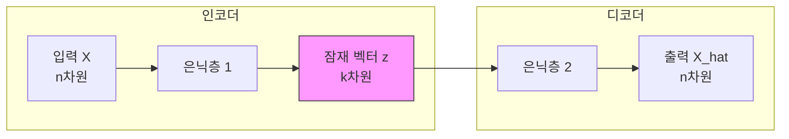

# 22차시: 딥러닝 응용 - 오토인코더 기반 이상 탐지

## 학습 목표

1. **오토인코더**의 구조와 원리를 이해함
2. **Keras**로 오토인코더 모델을 구성함
3. **재구성 오차**를 활용한 이상 탐지 기법을 익힘

---

## 강의 구성

| 구간 | 시간 | 내용 |
|:----:|:----:|------|
| 대주제 1 | 8분 | 오토인코더 개념과 수학적 배경 |
| 대주제 2 | 10분 | Keras로 오토인코더 구현 |
| 대주제 3 | 5분 | 재구성 오차 기반 이상 탐지 |
| 정리 | 2분 | 핵심 요약 |

---

## 지난 시간 복습

- **Keras로 MLP 구현**: Sequential, Dense, Dropout
- **CNN**: 이미지 특징 추출 (Conv2D, MaxPooling)
- **RNN/LSTM**: 시계열 순차 데이터 처리

**오늘**: 비지도 학습 기반 이상 탐지 - 오토인코더

---

# 대주제 1: 오토인코더 개념과 수학적 배경

## 1.1 오토인코더란?

**정의**: 입력을 압축 후 복원하여 **입력 자체를 재구성**하는 신경망임

**특징**:
- 비지도 학습 (레이블 불필요)
- 차원 축소와 특징 추출
- 이상 탐지에 활용

---

## 1.2 오토인코더 구조



- **인코더**: 입력을 저차원으로 압축함
- **잠재 공간 (Latent Space)**: 핵심 특징만 남긴 표현임
- **디코더**: 저차원에서 원래 차원으로 복원함

---

## 1.3 오토인코더 목적 함수

**목표**: 입력과 출력의 차이를 최소화함

$$\min ||X - \hat{X}||^2$$

| 기호 | 의미 |
|-----|------|
| $X$ | 원본 입력 |
| $\hat{X}$ | 재구성된 출력 |
| $\|\|\cdot\|\|^2$ | L2 노름 (유클리드 거리) |

---

## 1.4 인코더 수식

**입력을 잠재 공간으로 변환함**

$$z = f(X) = \sigma(W_e X + b_e)$$

| 기호 | 의미 |
|-----|------|
| $z$ | 잠재 벡터 (Latent Vector) |
| $W_e$ | 인코더 가중치 |
| $b_e$ | 인코더 편향 |
| $\sigma$ | 활성화 함수 (ReLU 등) |

---

## 1.5 디코더 수식

**잠재 공간에서 입력을 복원함**

$$\hat{X} = g(z) = \sigma(W_d z + b_d)$$

| 기호 | 의미 |
|-----|------|
| $\hat{X}$ | 재구성된 출력 |
| $W_d$ | 디코더 가중치 |
| $b_d$ | 디코더 편향 |

---

## 1.6 재구성 오차 (Reconstruction Error)

**손실 함수**: MSE (Mean Squared Error)

$$L = \frac{1}{n}\sum_{i=1}^{n}||X_i - \hat{X}_i||^2$$

**의미**:
- 낮은 오차 = 정상 데이터 (학습 패턴과 유사함)
- 높은 오차 = 이상 데이터 (학습 패턴과 상이함)

---

## 1.7 이상 탐지 원리

```
[학습 단계]
정상 데이터만으로 학습 -> 정상 패턴 기억

[탐지 단계]
새 데이터 입력 -> 재구성 -> 오차 계산
  |
  +-- 오차 작음 -> 정상
  +-- 오차 큼   -> 이상
```

**핵심**: 정상 패턴만 학습한 모델은 이상 데이터를 제대로 복원하지 못함

---

## 1.8 임계값 설정

**통계적 임계값 설정**

$$\theta = \mu + k\sigma$$

| 기호 | 의미 | 권장값 |
|-----|------|--------|
| $\mu$ | 재구성 오차 평균 | 데이터에서 계산 |
| $\sigma$ | 재구성 오차 표준편차 | 데이터에서 계산 |
| $k$ | 민감도 상수 | 2 ~ 3 |

- $k=2$: 약 95% 신뢰구간 (민감한 탐지)
- $k=3$: 약 99.7% 신뢰구간 (보수적 탐지)

---

## 실습 코드: 환경 설정 및 라이브러리 임포트

```python
import numpy as np
import pandas as pd
import matplotlib.pyplot as plt

# TensorFlow/Keras 임포트
import os
os.environ['TF_CPP_MIN_LOG_LEVEL'] = '2'  # 경고 숨기기

import tensorflow as tf
from tensorflow.keras.models import Model, Sequential
from tensorflow.keras.layers import Input, Dense, Dropout, BatchNormalization
from tensorflow.keras.callbacks import EarlyStopping, ModelCheckpoint
from tensorflow.keras.optimizers import Adam

from sklearn.preprocessing import StandardScaler, MinMaxScaler
from sklearn.model_selection import train_test_split
from sklearn.metrics import classification_report, confusion_matrix, roc_auc_score, roc_curve

print(f"TensorFlow 버전: {tf.__version__}")
np.random.seed(42)
tf.random.set_seed(42)
```

---

## 1.9 왜 오토인코더로 이상 탐지?

| 방법 | 장점 | 단점 |
|-----|------|------|
| 규칙 기반 | 해석 용이 | 복잡한 패턴 불가 |
| 통계 기반 | 간단함 | 다변량 어려움 |
| **오토인코더** | **복잡한 패턴 학습** | 학습 필요 |

**핵심**: 정상 패턴을 학습하여 비정상을 탐지함

---

## 1.10 오토인코더 변형

| 변형 | 특징 | 용도 |
|-----|------|------|
| Vanilla AE | 기본 구조 | 차원 축소, 이상 탐지 |
| Denoising AE | 노이즈 추가 학습 | 노이즈 제거, 강건성 |
| Variational AE | 확률적 잠재 공간 | 데이터 생성 |
| Sparse AE | 희소 제약 | 특징 추출 |

---

## 실습 코드: 오토인코더 개념 시각화

```python
def visualize_autoencoder_concept():
    """
    오토인코더 개념 시각화
    """
    fig, axes = plt.subplots(1, 3, figsize=(15, 4))

    # 1. 오토인코더 구조
    ax = axes[0]
    layers = [6, 4, 2, 4, 6]  # 입력-인코더-잠재-디코더-출력
    layer_names = ['Input\n(n)', 'Encoder\n(hidden)', 'Latent\n(k)', 'Decoder\n(hidden)', 'Output\n(n)']
    colors = ['#3498db', '#9b59b6', '#e74c3c', '#9b59b6', '#2ecc71']

    for i, (n, name, color) in enumerate(zip(layers, layer_names, colors)):
        for j in range(n):
            y = (n - 1) / 2 - j
            circle = plt.Circle((i * 2, y * 0.5), 0.15, color=color, alpha=0.7)
            ax.add_patch(circle)
        ax.text(i * 2, -2, name, ha='center', fontsize=9)

    # 연결선
    for i in range(len(layers) - 1):
        for j in range(layers[i]):
            for k in range(layers[i + 1]):
                y1 = (layers[i] - 1) / 2 - j
                y2 = (layers[i + 1] - 1) / 2 - k
                ax.plot([i * 2 + 0.15, (i + 1) * 2 - 0.15], [y1 * 0.5, y2 * 0.5],
                       'gray', alpha=0.2, linewidth=0.5)

    ax.set_xlim(-1, 9)
    ax.set_ylim(-3, 2)
    ax.set_aspect('equal')
    ax.axis('off')
    ax.set_title('Autoencoder Architecture', fontsize=12, fontweight='bold')

    # 2. 정상 vs 이상 재구성
    ax = axes[1]
    x = np.linspace(0, 4*np.pi, 100)
    normal = np.sin(x) + 0.1 * np.random.randn(100)
    anomaly = np.sin(x) + 0.5 * np.random.randn(100) + 0.5

    ax.plot(x, normal, 'b-', label='Normal (low error)', linewidth=2)
    ax.plot(x, anomaly, 'r--', label='Anomaly (high error)', linewidth=2)
    ax.fill_between(x, normal - 0.2, normal + 0.2, alpha=0.3, color='blue')
    ax.legend()
    ax.set_xlabel('Feature')
    ax.set_ylabel('Value')
    ax.set_title('Reconstruction Error Concept', fontsize=12, fontweight='bold')
    ax.grid(True, alpha=0.3)

    # 3. 임계값 설정
    ax = axes[2]
    np.random.seed(42)
    normal_errors = np.random.exponential(0.5, 1000)
    anomaly_errors = np.random.exponential(1.5, 50) + 2

    ax.hist(normal_errors, bins=30, alpha=0.7, label='Normal', color='blue', density=True)
    ax.hist(anomaly_errors, bins=15, alpha=0.7, label='Anomaly', color='red', density=True)

    mu = np.mean(normal_errors)
    sigma = np.std(normal_errors)
    threshold = mu + 3 * sigma
    ax.axvline(threshold, color='green', linestyle='--', linewidth=2,
               label=f'Threshold (mu + 3*sigma = {threshold:.2f})')

    ax.legend()
    ax.set_xlabel('Reconstruction Error')
    ax.set_ylabel('Density')
    ax.set_title('Threshold Setting', fontsize=12, fontweight='bold')
    ax.grid(True, alpha=0.3)

    plt.tight_layout()
    plt.savefig('autoencoder_concept.png', dpi=150, bbox_inches='tight')
    plt.show()

visualize_autoencoder_concept()
```

---

# 대주제 2: Keras로 오토인코더 구현

## 2.1 실습 데이터: 제조 설비 센서 데이터 시뮬레이션

제조 현장에서 수집되는 센서 데이터를 시뮬레이션하여 이상 탐지 실습을 진행함

---

## 실습 코드: 제조 센서 데이터 생성

```python
def generate_manufacturing_sensor_data(n_normal=5000, n_anomaly=100, n_features=10, random_state=42):
    """
    제조 설비 센서 데이터 생성

    정상 데이터: 안정적인 센서 값 패턴
    이상 데이터: 급격한 변동, 이상 패턴
    """
    np.random.seed(random_state)

    # 센서 특성 정의
    feature_names = [
        'temperature',      # 온도
        'pressure',         # 압력
        'vibration',        # 진동
        'rotation_speed',   # 회전 속도
        'power_consumption',# 전력 소비
        'humidity',         # 습도
        'flow_rate',        # 유량
        'voltage',          # 전압
        'current',          # 전류
        'noise_level'       # 소음 수준
    ]

    # 정상 데이터 생성 (안정적인 분포)
    normal_data = np.zeros((n_normal, n_features))

    # 각 센서별 정상 범위 정의
    normal_params = {
        'temperature': (150, 5),        # 평균 150도, 표준편차 5
        'pressure': (50, 2),            # 평균 50bar, 표준편차 2
        'vibration': (0.5, 0.1),        # 평균 0.5mm/s, 표준편차 0.1
        'rotation_speed': (3000, 50),   # 평균 3000rpm, 표준편차 50
        'power_consumption': (100, 5),  # 평균 100kW, 표준편차 5
        'humidity': (45, 3),            # 평균 45%, 표준편차 3
        'flow_rate': (200, 10),         # 평균 200L/min, 표준편차 10
        'voltage': (380, 5),            # 평균 380V, 표준편차 5
        'current': (50, 2),             # 평균 50A, 표준편차 2
        'noise_level': (65, 3)          # 평균 65dB, 표준편차 3
    }

    for i, (name, (mean, std)) in enumerate(normal_params.items()):
        normal_data[:, i] = np.random.normal(mean, std, n_normal)

    # 센서 간 상관관계 추가 (현실적인 데이터)
    # 온도 상승 -> 전력 소비 증가
    normal_data[:, 4] += 0.3 * (normal_data[:, 0] - 150)
    # 회전 속도 증가 -> 진동 증가
    normal_data[:, 2] += 0.0001 * (normal_data[:, 3] - 3000)

    # 이상 데이터 생성 (다양한 이상 패턴)
    anomaly_data = np.zeros((n_anomaly, n_features))

    for i in range(n_anomaly):
        # 기본값은 정상 범위에서 시작
        sample = np.array([np.random.normal(m, s) for (m, s) in normal_params.values()])

        # 이상 유형 랜덤 선택
        anomaly_type = np.random.choice(['temperature_spike', 'vibration_surge',
                                         'power_anomaly', 'multi_sensor'])

        if anomaly_type == 'temperature_spike':
            # 온도 급상승
            sample[0] += np.random.uniform(20, 40)
            sample[4] += np.random.uniform(15, 30)  # 전력도 증가

        elif anomaly_type == 'vibration_surge':
            # 진동 급증
            sample[2] += np.random.uniform(0.5, 1.5)
            sample[9] += np.random.uniform(10, 20)  # 소음도 증가

        elif anomaly_type == 'power_anomaly':
            # 전력 이상
            sample[4] += np.random.uniform(30, 50)
            sample[7] -= np.random.uniform(20, 40)  # 전압 강하

        else:  # multi_sensor
            # 다중 센서 이상
            affected = np.random.choice(n_features, size=np.random.randint(3, 6), replace=False)
            for idx in affected:
                sample[idx] += np.random.uniform(-3, 3) * normal_params[feature_names[idx]][1]

        anomaly_data[i] = sample

    # 라벨 생성
    y_normal = np.zeros(n_normal)
    y_anomaly = np.ones(n_anomaly)

    # 데이터 결합
    X = np.vstack([normal_data, anomaly_data])
    y = np.hstack([y_normal, y_anomaly])

    # DataFrame 생성
    df = pd.DataFrame(X, columns=feature_names)
    df['is_anomaly'] = y

    return df, feature_names

# 데이터 생성
df, feature_names = generate_manufacturing_sensor_data(n_normal=5000, n_anomaly=100)

print("제조 센서 데이터 생성 완료")
print(f"  - 전체 샘플 수: {len(df)}")
print(f"  - 정상 샘플: {(df['is_anomaly'] == 0).sum()}")
print(f"  - 이상 샘플: {(df['is_anomaly'] == 1).sum()}")
print(f"  - 특성 수: {len(feature_names)}")
print(f"\n특성 목록:")
for name in feature_names:
    print(f"  - {name}")
```

---

## 실습 코드: 데이터 탐색 및 시각화

```python
# 데이터 기본 통계
print("데이터 기본 통계:")
print(df.describe().round(2))
```

---

```python
def visualize_sensor_data(df, feature_names):
    """
    센서 데이터 시각화
    """
    fig, axes = plt.subplots(2, 2, figsize=(14, 10))

    # 1. 주요 센서 분포 비교 (정상 vs 이상)
    ax = axes[0, 0]
    selected_features = ['temperature', 'vibration', 'power_consumption', 'pressure']
    normal_data = df[df['is_anomaly'] == 0][selected_features]
    anomaly_data = df[df['is_anomaly'] == 1][selected_features]

    x = np.arange(len(selected_features))
    width = 0.35

    normal_means = normal_data.mean().values
    anomaly_means = anomaly_data.mean().values
    normal_stds = normal_data.std().values
    anomaly_stds = anomaly_data.std().values

    ax.bar(x - width/2, normal_means, width, label='Normal', color='blue', alpha=0.7)
    ax.bar(x + width/2, anomaly_means, width, label='Anomaly', color='red', alpha=0.7)
    ax.errorbar(x - width/2, normal_means, yerr=normal_stds, fmt='none', color='blue', capsize=3)
    ax.errorbar(x + width/2, anomaly_means, yerr=anomaly_stds, fmt='none', color='red', capsize=3)

    ax.set_xticks(x)
    ax.set_xticklabels(selected_features, rotation=45)
    ax.legend()
    ax.set_ylabel('Mean Value')
    ax.set_title('Sensor Value Comparison: Normal vs Anomaly', fontweight='bold')
    ax.grid(True, alpha=0.3)

    # 2. 온도 vs 전력 소비 산점도
    ax = axes[0, 1]
    normal = df[df['is_anomaly'] == 0]
    anomaly = df[df['is_anomaly'] == 1]

    ax.scatter(normal['temperature'], normal['power_consumption'],
               alpha=0.3, label='Normal', c='blue', s=20)
    ax.scatter(anomaly['temperature'], anomaly['power_consumption'],
               alpha=0.8, label='Anomaly', c='red', s=50, marker='x')

    ax.set_xlabel('Temperature')
    ax.set_ylabel('Power Consumption')
    ax.set_title('Temperature vs Power Consumption', fontweight='bold')
    ax.legend()
    ax.grid(True, alpha=0.3)

    # 3. 진동 vs 소음 산점도
    ax = axes[1, 0]
    ax.scatter(normal['vibration'], normal['noise_level'],
               alpha=0.3, label='Normal', c='blue', s=20)
    ax.scatter(anomaly['vibration'], anomaly['noise_level'],
               alpha=0.8, label='Anomaly', c='red', s=50, marker='x')

    ax.set_xlabel('Vibration')
    ax.set_ylabel('Noise Level')
    ax.set_title('Vibration vs Noise Level', fontweight='bold')
    ax.legend()
    ax.grid(True, alpha=0.3)

    # 4. 센서별 이상 비율 히트맵
    ax = axes[1, 1]

    # 정상 대비 이상의 편차 계산
    normal_means = df[df['is_anomaly'] == 0][feature_names].mean()
    normal_stds = df[df['is_anomaly'] == 0][feature_names].std()
    anomaly_means = df[df['is_anomaly'] == 1][feature_names].mean()

    z_scores = (anomaly_means - normal_means) / normal_stds

    colors = ['red' if z > 0 else 'blue' for z in z_scores]
    bars = ax.barh(feature_names, z_scores.values, color=colors, alpha=0.7)
    ax.axvline(0, color='black', linewidth=1)
    ax.axvline(2, color='red', linestyle='--', alpha=0.5, label='|z| = 2')
    ax.axvline(-2, color='red', linestyle='--', alpha=0.5)

    ax.set_xlabel('Z-Score (Anomaly vs Normal)')
    ax.set_title('Anomaly Deviation by Sensor', fontweight='bold')
    ax.legend()
    ax.grid(True, alpha=0.3)

    plt.tight_layout()
    plt.savefig('sensor_data_visualization.png', dpi=150, bbox_inches='tight')
    plt.show()

visualize_sensor_data(df, feature_names)
```

---

## 2.2 데이터 전처리

```python
# 특성과 라벨 분리
X = df[feature_names].values
y = df['is_anomaly'].values

print(f"전체 데이터 형태: {X.shape}")
print(f"라벨 분포: 정상={sum(y==0)}, 이상={sum(y==1)}")
```

---

## 실습 코드: 학습/테스트 분할 및 정규화

```python
# 정상 데이터만 분리 (오토인코더는 정상 데이터로만 학습)
X_normal = X[y == 0]
X_anomaly = X[y == 1]

print(f"정상 데이터: {X_normal.shape}")
print(f"이상 데이터: {X_anomaly.shape}")

# 정상 데이터를 학습/검증으로 분할
X_train_normal, X_val_normal = train_test_split(
    X_normal, test_size=0.2, random_state=42
)

print(f"\n학습용 정상 데이터: {X_train_normal.shape}")
print(f"검증용 정상 데이터: {X_val_normal.shape}")

# 정규화 (MinMaxScaler: 0~1 범위)
scaler = MinMaxScaler()
X_train_scaled = scaler.fit_transform(X_train_normal)
X_val_scaled = scaler.transform(X_val_normal)

# 테스트 데이터 (정상 + 이상 혼합)
X_test = np.vstack([X_val_normal, X_anomaly])
y_test = np.hstack([np.zeros(len(X_val_normal)), np.ones(len(X_anomaly))])
X_test_scaled = scaler.transform(X_test)

print(f"\n테스트 데이터: {X_test_scaled.shape}")
print(f"테스트 라벨: 정상={sum(y_test==0)}, 이상={sum(y_test==1)}")

print(f"\n정규화 후 값 범위:")
print(f"  - 최소: {X_train_scaled.min():.4f}")
print(f"  - 최대: {X_train_scaled.max():.4f}")
```

---

## 2.3 기본 오토인코더 구조

```
입력 (10) -> 인코더 -> 잠재 (3) -> 디코더 -> 출력 (10)
            [10->8->5->3]       [3->5->8->10]
```

**차원 관계**: 입력 = 출력 > 잠재 공간

---

## 실습 코드: Sequential API로 오토인코더 구현

```python
def build_autoencoder_sequential(input_dim, latent_dim=3):
    """
    Sequential API로 오토인코더 생성

    Parameters:
    - input_dim: 입력 차원
    - latent_dim: 잠재 공간 차원
    """
    model = Sequential([
        # 인코더
        Dense(8, activation='relu', input_shape=(input_dim,)),
        BatchNormalization(),
        Dropout(0.2),

        Dense(5, activation='relu'),
        BatchNormalization(),

        Dense(latent_dim, activation='relu', name='latent'),  # 잠재 공간

        # 디코더
        Dense(5, activation='relu'),
        BatchNormalization(),

        Dense(8, activation='relu'),
        BatchNormalization(),
        Dropout(0.2),

        Dense(input_dim, activation='sigmoid')  # 출력 (0~1 범위)
    ], name='autoencoder_sequential')

    return model

# 모델 생성
input_dim = X_train_scaled.shape[1]
latent_dim = 3

autoencoder_seq = build_autoencoder_sequential(input_dim, latent_dim)

print("Sequential 오토인코더 구조:")
autoencoder_seq.summary()
```

---

## 2.4 Functional API로 오토인코더 구현

Functional API를 사용하면 인코더와 디코더를 별도로 추출할 수 있음

---

## 실습 코드: Functional API로 오토인코더 구현

```python
def build_autoencoder_functional(input_dim, latent_dim=3):
    """
    Functional API로 오토인코더 생성
    인코더와 디코더 분리 가능

    Parameters:
    - input_dim: 입력 차원
    - latent_dim: 잠재 공간 차원
    """
    # 입력층
    input_layer = Input(shape=(input_dim,), name='input')

    # 인코더
    x = Dense(8, activation='relu', name='encoder_1')(input_layer)
    x = BatchNormalization()(x)
    x = Dropout(0.2)(x)

    x = Dense(5, activation='relu', name='encoder_2')(x)
    x = BatchNormalization()(x)

    latent = Dense(latent_dim, activation='relu', name='latent')(x)

    # 디코더
    x = Dense(5, activation='relu', name='decoder_1')(latent)
    x = BatchNormalization()(x)

    x = Dense(8, activation='relu', name='decoder_2')(x)
    x = BatchNormalization()(x)
    x = Dropout(0.2)(x)

    output_layer = Dense(input_dim, activation='sigmoid', name='output')(x)

    # 전체 오토인코더 모델
    autoencoder = Model(input_layer, output_layer, name='autoencoder')

    # 인코더만 추출
    encoder = Model(input_layer, latent, name='encoder')

    return autoencoder, encoder

# 모델 생성
autoencoder, encoder = build_autoencoder_functional(input_dim, latent_dim)

print("Functional API 오토인코더 구조:")
autoencoder.summary()

print("\n인코더 구조:")
encoder.summary()
```

---

## 2.5 모델 컴파일

```python
# 모델 컴파일
autoencoder.compile(
    optimizer=Adam(learning_rate=0.001),
    loss='mse'  # 재구성 오차
)

print("모델 컴파일 완료")
print("  - Optimizer: Adam (lr=0.001)")
print("  - Loss: MSE (Mean Squared Error)")
```

---

## 2.6 콜백 설정

```python
# 콜백 설정
callbacks = [
    EarlyStopping(
        monitor='val_loss',
        patience=15,
        restore_best_weights=True,
        verbose=1
    ),
    ModelCheckpoint(
        'best_autoencoder.keras',
        monitor='val_loss',
        save_best_only=True,
        verbose=0
    )
]

print("콜백 설정 완료:")
print("  - EarlyStopping: patience=15, restore_best_weights=True")
print("  - ModelCheckpoint: best_autoencoder.keras")
```

---

## 2.7 모델 학습

**핵심**: 입력 = 타겟 (자기 자신을 예측)

---

## 실습 코드: 오토인코더 학습

```python
# 모델 학습 (입력 = 타겟)
history = autoencoder.fit(
    X_train_scaled, X_train_scaled,  # 입력 = 타겟
    epochs=100,
    batch_size=32,
    validation_data=(X_val_scaled, X_val_scaled),
    callbacks=callbacks,
    verbose=1
)

print(f"\n학습 완료!")
print(f"  - 실제 에포크 수: {len(history.history['loss'])}")
print(f"  - 최종 학습 손실: {history.history['loss'][-1]:.6f}")
print(f"  - 최종 검증 손실: {history.history['val_loss'][-1]:.6f}")
```

---

## 실습 코드: 학습 곡선 시각화

```python
def plot_training_history(history):
    """
    학습 곡선 시각화
    """
    fig, ax = plt.subplots(figsize=(10, 5))

    ax.plot(history.history['loss'], label='Training Loss', linewidth=2)
    ax.plot(history.history['val_loss'], label='Validation Loss', linewidth=2)

    ax.set_xlabel('Epoch')
    ax.set_ylabel('Loss (MSE)')
    ax.set_title('Autoencoder Training History', fontsize=12, fontweight='bold')
    ax.legend()
    ax.grid(True, alpha=0.3)

    # 최저점 표시
    min_val_loss = min(history.history['val_loss'])
    min_epoch = history.history['val_loss'].index(min_val_loss)
    ax.axvline(min_epoch, color='red', linestyle='--', alpha=0.5)
    ax.annotate(f'Best: {min_val_loss:.6f}',
                xy=(min_epoch, min_val_loss),
                xytext=(min_epoch + 5, min_val_loss + 0.001),
                fontsize=10)

    plt.tight_layout()
    plt.savefig('training_history.png', dpi=150, bbox_inches='tight')
    plt.show()

plot_training_history(history)
```

---

## 2.8 잠재 공간 시각화

인코더를 통해 추출한 잠재 벡터를 시각화하여 정상/이상 데이터의 분포를 확인함

---

## 실습 코드: 잠재 공간 시각화

```python
def visualize_latent_space(encoder, X_test_scaled, y_test):
    """
    잠재 공간 시각화 (3D)
    """
    # 잠재 벡터 추출
    latent_vectors = encoder.predict(X_test_scaled, verbose=0)

    print(f"잠재 벡터 형태: {latent_vectors.shape}")

    # 3D 시각화
    fig = plt.figure(figsize=(12, 5))

    # 3D 산점도
    ax1 = fig.add_subplot(121, projection='3d')

    normal_mask = y_test == 0
    anomaly_mask = y_test == 1

    ax1.scatter(latent_vectors[normal_mask, 0],
                latent_vectors[normal_mask, 1],
                latent_vectors[normal_mask, 2],
                c='blue', alpha=0.3, s=20, label='Normal')
    ax1.scatter(latent_vectors[anomaly_mask, 0],
                latent_vectors[anomaly_mask, 1],
                latent_vectors[anomaly_mask, 2],
                c='red', alpha=0.8, s=50, label='Anomaly', marker='x')

    ax1.set_xlabel('Latent Dim 1')
    ax1.set_ylabel('Latent Dim 2')
    ax1.set_zlabel('Latent Dim 3')
    ax1.set_title('Latent Space (3D)', fontweight='bold')
    ax1.legend()

    # 2D 투영 (Dim 1 vs Dim 2)
    ax2 = fig.add_subplot(122)

    ax2.scatter(latent_vectors[normal_mask, 0],
                latent_vectors[normal_mask, 1],
                c='blue', alpha=0.3, s=20, label='Normal')
    ax2.scatter(latent_vectors[anomaly_mask, 0],
                latent_vectors[anomaly_mask, 1],
                c='red', alpha=0.8, s=50, label='Anomaly', marker='x')

    ax2.set_xlabel('Latent Dim 1')
    ax2.set_ylabel('Latent Dim 2')
    ax2.set_title('Latent Space (2D Projection)', fontweight='bold')
    ax2.legend()
    ax2.grid(True, alpha=0.3)

    plt.tight_layout()
    plt.savefig('latent_space.png', dpi=150, bbox_inches='tight')
    plt.show()

    return latent_vectors

latent_vectors = visualize_latent_space(encoder, X_test_scaled, y_test)
```

---

# 대주제 3: 재구성 오차 기반 이상 탐지

## 3.1 재구성 오차 계산

재구성 오차는 원본과 복원된 데이터 간의 차이를 측정함

---

## 실습 코드: 재구성 오차 계산

```python
def calculate_reconstruction_error(autoencoder, X):
    """
    재구성 오차 계산

    Parameters:
    - autoencoder: 학습된 오토인코더 모델
    - X: 입력 데이터

    Returns:
    - reconstruction_error: 샘플별 재구성 오차 (MSE)
    """
    # 재구성
    X_reconstructed = autoencoder.predict(X, verbose=0)

    # 샘플별 MSE 계산
    reconstruction_error = np.mean((X - X_reconstructed) ** 2, axis=1)

    return reconstruction_error, X_reconstructed

# 재구성 오차 계산
reconstruction_error, X_reconstructed = calculate_reconstruction_error(
    autoencoder, X_test_scaled
)

print("재구성 오차 통계:")
print(f"  - 평균: {reconstruction_error.mean():.6f}")
print(f"  - 표준편차: {reconstruction_error.std():.6f}")
print(f"  - 최소: {reconstruction_error.min():.6f}")
print(f"  - 최대: {reconstruction_error.max():.6f}")

# 정상/이상 별 통계
normal_error = reconstruction_error[y_test == 0]
anomaly_error = reconstruction_error[y_test == 1]

print(f"\n정상 데이터 재구성 오차:")
print(f"  - 평균: {normal_error.mean():.6f}")
print(f"  - 표준편차: {normal_error.std():.6f}")

print(f"\n이상 데이터 재구성 오차:")
print(f"  - 평균: {anomaly_error.mean():.6f}")
print(f"  - 표준편차: {anomaly_error.std():.6f}")
```

---

## 3.2 임계값 결정

통계적 방법으로 임계값을 설정함: $\theta = \mu + k\sigma$

---

## 실습 코드: 임계값 설정 및 시각화

```python
def determine_threshold(reconstruction_error, y_test, k_values=[2, 2.5, 3]):
    """
    다양한 k 값에 대한 임계값 계산 및 성능 비교
    """
    # 정상 데이터의 재구성 오차로 임계값 계산
    normal_error = reconstruction_error[y_test == 0]
    mu = np.mean(normal_error)
    sigma = np.std(normal_error)

    print("임계값 설정 (정상 데이터 기준):")
    print(f"  - mu (평균): {mu:.6f}")
    print(f"  - sigma (표준편차): {sigma:.6f}")
    print()

    results = []
    for k in k_values:
        threshold = mu + k * sigma

        # 이상 판정
        y_pred = (reconstruction_error > threshold).astype(int)

        # 성능 지표 계산
        from sklearn.metrics import precision_score, recall_score, f1_score

        precision = precision_score(y_test, y_pred)
        recall = recall_score(y_test, y_pred)
        f1 = f1_score(y_test, y_pred)

        results.append({
            'k': k,
            'threshold': threshold,
            'precision': precision,
            'recall': recall,
            'f1': f1,
            'detected': y_pred.sum()
        })

        print(f"k = {k}:")
        print(f"  - Threshold: {threshold:.6f}")
        print(f"  - Precision: {precision:.4f}")
        print(f"  - Recall: {recall:.4f}")
        print(f"  - F1-Score: {f1:.4f}")
        print(f"  - Detected anomalies: {y_pred.sum()}")
        print()

    return results, mu, sigma

results, mu, sigma = determine_threshold(reconstruction_error, y_test)
```

---

## 실습 코드: 재구성 오차 분포 시각화

```python
def plot_reconstruction_error_distribution(reconstruction_error, y_test, mu, sigma, k=3):
    """
    재구성 오차 분포 시각화
    """
    fig, axes = plt.subplots(1, 2, figsize=(14, 5))

    normal_error = reconstruction_error[y_test == 0]
    anomaly_error = reconstruction_error[y_test == 1]
    threshold = mu + k * sigma

    # 1. 히스토그램
    ax = axes[0]
    ax.hist(normal_error, bins=50, alpha=0.7, label='Normal', color='blue', density=True)
    ax.hist(anomaly_error, bins=20, alpha=0.7, label='Anomaly', color='red', density=True)

    ax.axvline(threshold, color='green', linestyle='--', linewidth=2,
               label=f'Threshold (k={k}): {threshold:.4f}')
    ax.axvline(mu, color='orange', linestyle=':', linewidth=2,
               label=f'Mean: {mu:.4f}')

    ax.set_xlabel('Reconstruction Error')
    ax.set_ylabel('Density')
    ax.set_title('Reconstruction Error Distribution', fontweight='bold')
    ax.legend()
    ax.grid(True, alpha=0.3)

    # 2. 샘플별 오차
    ax = axes[1]

    normal_idx = np.where(y_test == 0)[0]
    anomaly_idx = np.where(y_test == 1)[0]

    ax.scatter(normal_idx, reconstruction_error[y_test == 0],
               alpha=0.3, c='blue', s=20, label='Normal')
    ax.scatter(anomaly_idx, reconstruction_error[y_test == 1],
               alpha=0.8, c='red', s=50, marker='x', label='Anomaly')

    ax.axhline(threshold, color='green', linestyle='--', linewidth=2,
               label=f'Threshold: {threshold:.4f}')

    ax.set_xlabel('Sample Index')
    ax.set_ylabel('Reconstruction Error')
    ax.set_title('Sample-wise Reconstruction Error', fontweight='bold')
    ax.legend()
    ax.grid(True, alpha=0.3)

    plt.tight_layout()
    plt.savefig('reconstruction_error_distribution.png', dpi=150, bbox_inches='tight')
    plt.show()

plot_reconstruction_error_distribution(reconstruction_error, y_test, mu, sigma, k=3)
```

---

## 3.3 최종 이상 탐지 및 평가

선택한 임계값으로 최종 이상 탐지를 수행하고 성능을 평가함

---

## 실습 코드: 최종 이상 탐지 결과

```python
# 최적 k 선택 (F1-Score 기준)
best_result = max(results, key=lambda x: x['f1'])
best_k = best_result['k']
threshold = mu + best_k * sigma

print(f"최적 k 값: {best_k}")
print(f"최적 임계값: {threshold:.6f}")

# 최종 예측
y_pred = (reconstruction_error > threshold).astype(int)

# 분류 보고서
print("\n분류 보고서:")
print(classification_report(y_test, y_pred, target_names=['Normal', 'Anomaly']))

# 혼동 행렬
print("혼동 행렬:")
cm = confusion_matrix(y_test, y_pred)
print(cm)
```

---

## 실습 코드: ROC 곡선 및 혼동 행렬 시각화

```python
def plot_evaluation_results(y_test, y_pred, reconstruction_error):
    """
    평가 결과 시각화
    """
    fig, axes = plt.subplots(1, 2, figsize=(12, 5))

    # 1. 혼동 행렬
    ax = axes[0]
    cm = confusion_matrix(y_test, y_pred)

    im = ax.imshow(cm, cmap='Blues')
    ax.set_xticks([0, 1])
    ax.set_yticks([0, 1])
    ax.set_xticklabels(['Pred: Normal', 'Pred: Anomaly'])
    ax.set_yticklabels(['True: Normal', 'True: Anomaly'])

    for i in range(2):
        for j in range(2):
            color = 'white' if cm[i, j] > cm.max() / 2 else 'black'
            ax.text(j, i, str(cm[i, j]), ha='center', va='center',
                   fontsize=20, fontweight='bold', color=color)

    ax.set_title('Confusion Matrix', fontweight='bold')
    plt.colorbar(im, ax=ax)

    # 2. ROC 곡선
    ax = axes[1]
    fpr, tpr, thresholds = roc_curve(y_test, reconstruction_error)
    auc_score = roc_auc_score(y_test, reconstruction_error)

    ax.plot(fpr, tpr, 'b-', linewidth=2, label=f'AUC = {auc_score:.4f}')
    ax.plot([0, 1], [0, 1], 'k--', linewidth=1)
    ax.fill_between(fpr, tpr, alpha=0.3)

    ax.set_xlabel('False Positive Rate')
    ax.set_ylabel('True Positive Rate')
    ax.set_title('ROC Curve', fontweight='bold')
    ax.legend(loc='lower right')
    ax.grid(True, alpha=0.3)

    plt.tight_layout()
    plt.savefig('evaluation_results.png', dpi=150, bbox_inches='tight')
    plt.show()

    print(f"\nAUC-ROC Score: {auc_score:.4f}")

plot_evaluation_results(y_test, y_pred, reconstruction_error)
```

---

## 실습 코드: 재구성 결과 시각화

```python
def visualize_reconstruction_examples(X_test_scaled, X_reconstructed, y_test,
                                       reconstruction_error, feature_names, n_examples=3):
    """
    정상/이상 샘플의 재구성 결과 비교
    """
    fig, axes = plt.subplots(2, n_examples, figsize=(15, 8))

    # 정상 샘플 (재구성 오차가 작은 순)
    normal_idx = np.where(y_test == 0)[0]
    normal_sorted = normal_idx[np.argsort(reconstruction_error[normal_idx])]

    # 이상 샘플 (재구성 오차가 큰 순)
    anomaly_idx = np.where(y_test == 1)[0]
    anomaly_sorted = anomaly_idx[np.argsort(-reconstruction_error[anomaly_idx])]

    # 정상 샘플 시각화
    for i in range(n_examples):
        ax = axes[0, i]
        idx = normal_sorted[i]

        x = np.arange(len(feature_names))
        width = 0.35

        ax.bar(x - width/2, X_test_scaled[idx], width, label='Original', alpha=0.7)
        ax.bar(x + width/2, X_reconstructed[idx], width, label='Reconstructed', alpha=0.7)

        ax.set_xticks(x)
        ax.set_xticklabels(feature_names, rotation=45, ha='right', fontsize=8)
        ax.set_title(f'Normal Sample (Error: {reconstruction_error[idx]:.6f})', fontsize=10)
        ax.legend(fontsize=8)
        ax.set_ylim(0, 1)

    # 이상 샘플 시각화
    for i in range(n_examples):
        ax = axes[1, i]
        idx = anomaly_sorted[i]

        x = np.arange(len(feature_names))
        width = 0.35

        ax.bar(x - width/2, X_test_scaled[idx], width, label='Original', alpha=0.7)
        ax.bar(x + width/2, X_reconstructed[idx], width, label='Reconstructed', alpha=0.7)

        ax.set_xticks(x)
        ax.set_xticklabels(feature_names, rotation=45, ha='right', fontsize=8)
        ax.set_title(f'Anomaly Sample (Error: {reconstruction_error[idx]:.6f})', fontsize=10)
        ax.legend(fontsize=8)
        ax.set_ylim(0, 1)

    axes[0, 0].set_ylabel('Normalized Value')
    axes[1, 0].set_ylabel('Normalized Value')

    plt.suptitle('Reconstruction Comparison: Normal vs Anomaly', fontsize=14, fontweight='bold')
    plt.tight_layout()
    plt.savefig('reconstruction_examples.png', dpi=150, bbox_inches='tight')
    plt.show()

visualize_reconstruction_examples(X_test_scaled, X_reconstructed, y_test,
                                   reconstruction_error, feature_names)
```

---

## 3.4 모델 저장 및 로드

```python
# 모델 저장
autoencoder.save('manufacturing_autoencoder.keras')
encoder.save('manufacturing_encoder.keras')

print("모델 저장 완료:")
print("  - manufacturing_autoencoder.keras")
print("  - manufacturing_encoder.keras")

# 모델 로드
from tensorflow.keras.models import load_model

loaded_autoencoder = load_model('manufacturing_autoencoder.keras')
loaded_encoder = load_model('manufacturing_encoder.keras')

print("\n모델 로드 완료")

# 로드된 모델로 예측 확인
test_pred = loaded_autoencoder.predict(X_test_scaled[:5], verbose=0)
print(f"\n로드된 모델 예측 확인 (처음 5개 샘플):")
print(f"  - 원본 형태: {X_test_scaled[:5].shape}")
print(f"  - 재구성 형태: {test_pred.shape}")
```

---

## 3.5 실시간 이상 탐지 함수

```python
def detect_anomaly(autoencoder, scaler, new_data, threshold):
    """
    새로운 데이터에 대한 이상 탐지

    Parameters:
    - autoencoder: 학습된 오토인코더
    - scaler: 학습에 사용된 스케일러
    - new_data: 새로운 센서 데이터 (raw)
    - threshold: 이상 탐지 임계값

    Returns:
    - is_anomaly: 이상 여부
    - error: 재구성 오차
    """
    # 데이터 형태 확인
    if new_data.ndim == 1:
        new_data = new_data.reshape(1, -1)

    # 정규화
    new_data_scaled = scaler.transform(new_data)

    # 재구성
    reconstructed = autoencoder.predict(new_data_scaled, verbose=0)

    # 재구성 오차 계산
    error = np.mean((new_data_scaled - reconstructed) ** 2, axis=1)

    # 이상 판정
    is_anomaly = error > threshold

    return is_anomaly, error

# 테스트
print("실시간 이상 탐지 테스트:")

# 정상 샘플 테스트
normal_sample = X_test[0]  # 정상 샘플
is_anomaly, error = detect_anomaly(autoencoder, scaler, normal_sample, threshold)
print(f"\n정상 샘플:")
print(f"  - 재구성 오차: {error[0]:.6f}")
print(f"  - 임계값: {threshold:.6f}")
print(f"  - 판정: {'이상' if is_anomaly[0] else '정상'}")

# 이상 샘플 테스트
anomaly_sample = X_anomaly[0]  # 이상 샘플
is_anomaly, error = detect_anomaly(autoencoder, scaler, anomaly_sample, threshold)
print(f"\n이상 샘플:")
print(f"  - 재구성 오차: {error[0]:.6f}")
print(f"  - 임계값: {threshold:.6f}")
print(f"  - 판정: {'이상' if is_anomaly[0] else '정상'}")
```

---

## 3.6 센서별 이상 기여도 분석

어떤 센서가 이상에 가장 많이 기여하는지 분석함

---

## 실습 코드: 센서별 이상 기여도 분석

```python
def analyze_sensor_contribution(X_test_scaled, X_reconstructed, y_test, feature_names):
    """
    센서별 재구성 오차 기여도 분석
    """
    # 센서별 재구성 오차
    sensor_errors = (X_test_scaled - X_reconstructed) ** 2

    # 정상/이상 그룹별 평균
    normal_sensor_error = sensor_errors[y_test == 0].mean(axis=0)
    anomaly_sensor_error = sensor_errors[y_test == 1].mean(axis=0)

    # 이상 기여도 (이상 - 정상)
    contribution = anomaly_sensor_error - normal_sensor_error

    # 시각화
    fig, ax = plt.subplots(figsize=(12, 6))

    x = np.arange(len(feature_names))
    width = 0.35

    ax.bar(x - width/2, normal_sensor_error, width, label='Normal', color='blue', alpha=0.7)
    ax.bar(x + width/2, anomaly_sensor_error, width, label='Anomaly', color='red', alpha=0.7)

    ax.set_xticks(x)
    ax.set_xticklabels(feature_names, rotation=45, ha='right')
    ax.set_ylabel('Mean Reconstruction Error')
    ax.set_title('Sensor-wise Reconstruction Error Analysis', fontweight='bold')
    ax.legend()
    ax.grid(True, alpha=0.3, axis='y')

    plt.tight_layout()
    plt.savefig('sensor_contribution.png', dpi=150, bbox_inches='tight')
    plt.show()

    # 기여도 순위
    print("\n이상 기여도 순위 (이상 - 정상):")
    sorted_idx = np.argsort(-contribution)
    for i, idx in enumerate(sorted_idx):
        print(f"  {i+1}. {feature_names[idx]}: {contribution[idx]:.6f}")

    return contribution

contribution = analyze_sensor_contribution(X_test_scaled, X_reconstructed, y_test, feature_names)
```

---

# 핵심 정리

## 오토인코더 수식 요약

| 구성요소 | 수식 |
|---------|------|
| 목적 함수 | $\min \|\|X - \hat{X}\|\|^2$ |
| 인코더 | $z = \sigma(W_e X + b_e)$ |
| 디코더 | $\hat{X} = \sigma(W_d z + b_d)$ |
| 재구성 오차 | $L = \|\|X - \hat{X}\|\|^2$ |
| 임계값 | $\theta = \mu + k\sigma$ |

---

## 오늘 배운 내용

1. **오토인코더 구조**
   - 인코더-잠재공간-디코더
   - 입력 = 출력 (자기 자신 복원)

2. **Keras 구현**
   - Sequential 또는 Functional API
   - loss='mse', 입력을 타겟으로 학습

3. **이상 탐지**
   - 재구성 오차 계산
   - 임계값 기반 판정 ($\theta = \mu + k\sigma$)

---

## 핵심 코드 요약

```python
# 1. 오토인코더 구성
autoencoder = Sequential([
    # 인코더
    Dense(8, activation='relu', input_shape=(input_dim,)),
    Dense(latent_dim, activation='relu'),
    # 디코더
    Dense(8, activation='relu'),
    Dense(input_dim, activation='sigmoid')
])

# 2. 컴파일
autoencoder.compile(optimizer='adam', loss='mse')

# 3. 학습 (입력 = 타겟)
autoencoder.fit(X_train, X_train, epochs=100, validation_split=0.2)

# 4. 재구성 오차 계산
X_pred = autoencoder.predict(X_test)
reconstruction_error = np.mean((X_test - X_pred) ** 2, axis=1)

# 5. 임계값 설정 및 이상 판정
threshold = mu + 3 * sigma
is_anomaly = reconstruction_error > threshold
```

---

## 체크리스트

- [ ] 오토인코더 구조 이해 (인코더-잠재공간-디코더)
- [ ] 재구성 오차 개념 이해 ($L = ||X - \hat{X}||^2$)
- [ ] Keras로 오토인코더 구현 (Sequential/Functional)
- [ ] 학습: `model.fit(X, X)` 형태
- [ ] 정규화 및 데이터 전처리
- [ ] 임계값 설정: $\theta = \mu + k\sigma$
- [ ] 이상 판정: 오차 > 임계값
- [ ] 성능 평가: Precision, Recall, F1, AUC-ROC

---

## 사용한 데이터셋

- **제조 설비 센서 데이터 (시뮬레이션)**
  - 5,000개 정상 샘플, 100개 이상 샘플
  - 10개 센서 특성 (온도, 압력, 진동 등)
  - 이상 유형: 온도 급상승, 진동 급증, 전력 이상, 다중 센서 이상

---

## 다음 차시 예고

### [23차시] 모델 해석과 변수별 영향력 분석

- Feature Importance
- Permutation Importance
- SHAP 개념 소개
