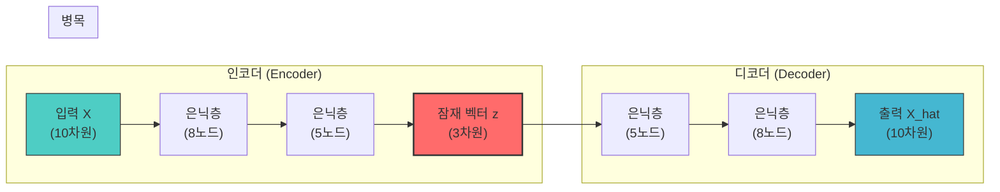
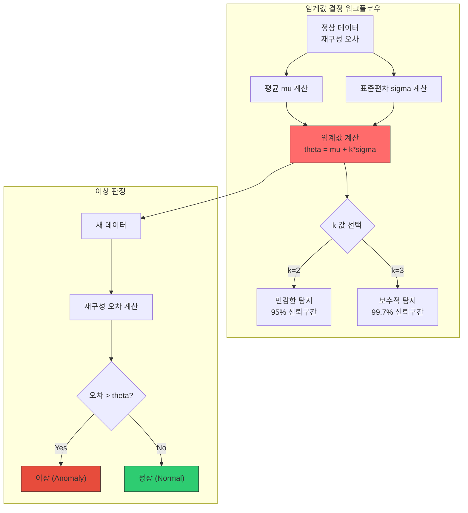

# 22차시: 딥러닝 응용 - 오토인코더 기반 이상 탐지

## 학습 목표

| 목표 | 설명 |
|------|------|
| 오토인코더 구조 이해 | 인코더-잠재공간-디코더 아키텍처의 원리를 파악함 |
| Keras 구현 | Sequential API로 오토인코더를 구성하고 학습함 |
| 이상 탐지 적용 | 재구성 오차 기반 이상 탐지 기법을 실무에 적용함 |

---

## 실습 데이터셋

| 데이터셋 | 출처 | 용도 |
|---------|------|------|
| 제조 센서 데이터 | 시뮬레이션 생성 | 오토인코더 학습 및 이상 탐지 실습 |
| 정상 데이터 | 5,000개 샘플 | 오토인코더 학습용 |
| 이상 데이터 | 100개 샘플 | 이상 탐지 평가용 |

---

## 수학적 배경

### 재구성 오차 (Reconstruction Error)

오토인코더의 핵심 개념은 **재구성 오차**임. 입력 데이터를 압축 후 복원할 때 발생하는 오차를 측정함.

$$L = \frac{1}{n}\sum_{i=1}^{n}||X_i - \hat{X}_i||^2$$

**실제 계산 예시**:

| 원본 $X$ | 재구성 $\hat{X}$ | 오차 $(X - \hat{X})^2$ |
|---------|-----------------|----------------------|
| 0.8 | 0.78 | 0.0004 |
| 0.5 | 0.52 | 0.0004 |
| 0.3 | 0.28 | 0.0004 |
| **평균** | - | **0.0004 (MSE)** |

### 임계값 설정

통계적 방법으로 이상 판정 기준을 설정함:

$$\theta = \mu + k\sigma$$

| 기호 | 의미 | 예시 값 |
|-----|------|--------|
| $\mu$ | 정상 데이터 재구성 오차 평균 | 0.0012 |
| $\sigma$ | 재구성 오차 표준편차 | 0.0005 |
| $k$ | 민감도 상수 | 3 |
| $\theta$ | 임계값 | 0.0027 |

**k 값 선택 기준**:
- $k=2$: 약 95% 신뢰구간 (민감한 탐지, 오탐 증가)
- $k=3$: 약 99.7% 신뢰구간 (보수적 탐지, 미탐 가능)

---

## 강의 구성 (25분)

| 파트 | 주제 | 시간 |
|:----:|------|:----:|
| Part 1 | 오토인코더 개념 | 8분 |
| Part 2 | Keras 구현 | 10분 |
| Part 3 | 이상 탐지 | 5분 |
| 정리 | 핵심 요약 | 2분 |

---

# Part 1: 오토인코더 개념 (8분)

## 1.1 오토인코더 구조

오토인코더는 입력을 압축 후 복원하여 **입력 자체를 재구성**하는 신경망임.



**구성 요소**:

| 구성요소 | 역할 | 차원 변화 |
|---------|------|----------|
| 인코더 | 입력을 저차원으로 압축 | 10 -> 8 -> 5 -> 3 |
| 잠재 공간 | 핵심 특징만 남긴 표현 | 3 (병목) |
| 디코더 | 저차원에서 원래 차원으로 복원 | 3 -> 5 -> 8 -> 10 |

---

## 1.2 수학적 정의

### 인코더 수식

입력 $X$를 잠재 공간 $z$로 변환함:

$$z = f(X) = \sigma(W_e X + b_e)$$

| 기호 | 의미 | 설명 |
|-----|------|------|
| $z$ | 잠재 벡터 | 압축된 표현 (Latent Vector) |
| $W_e$ | 인코더 가중치 | 학습되는 파라미터 |
| $b_e$ | 인코더 편향 | 학습되는 파라미터 |
| $\sigma$ | 활성화 함수 | ReLU 등 비선형 함수 |

### 디코더 수식

잠재 벡터 $z$에서 입력을 복원함:

$$\hat{X} = g(z) = \sigma(W_d z + b_d)$$

| 기호 | 의미 | 설명 |
|-----|------|------|
| $\hat{X}$ | 재구성된 출력 | 원본과 유사해야 함 |
| $W_d$ | 디코더 가중치 | 학습되는 파라미터 |
| $b_d$ | 디코더 편향 | 학습되는 파라미터 |

### 목적 함수

입력과 출력의 차이를 최소화함:

$$\min_{W_e, W_d, b_e, b_d} ||X - \hat{X}||^2$$

---

## 1.3 이상 탐지 원리

오토인코더 기반 이상 탐지의 핵심 아이디어:

```
[학습 단계]
정상 데이터만으로 학습 -> 정상 패턴을 기억함

[탐지 단계]
새 데이터 입력 -> 재구성 -> 오차 계산
  |
  +-- 오차가 작음 -> 정상 (학습한 패턴과 유사)
  +-- 오차가 큼   -> 이상 (학습한 패턴과 상이)
```

**핵심 가정**: 정상 데이터만 학습한 모델은 이상 데이터를 제대로 복원하지 못함.

### 왜 오토인코더로 이상 탐지?

| 방법 | 장점 | 단점 |
|-----|------|------|
| 규칙 기반 | 해석 용이, 구현 간단 | 복잡한 패턴 표현 불가 |
| 통계 기반 (Z-score) | 간단, 빠른 계산 | 다변량 관계 표현 어려움 |
| **오토인코더** | **복잡한 비선형 패턴 학습** | 학습 데이터 필요 |

---

## 1.4 오토인코더 변형 비교

| 변형 | 특징 | 용도 |
|-----|------|------|
| Vanilla AE | 기본 구조 | 차원 축소, 이상 탐지 |
| Denoising AE | 노이즈 추가 후 복원 학습 | 노이즈 제거, 강건성 향상 |
| Variational AE | 확률적 잠재 공간 | 데이터 생성, 이상 탐지 |
| Sparse AE | 희소성 제약 추가 | 특징 추출 |

본 강의에서는 **Vanilla AE (기본 오토인코더)**를 사용함.

---

# Part 2: Keras 구현 (10분)

## 2.1 데이터 준비

### 실습 코드: 환경 설정

```python
# 라이브러리 임포트
import numpy as np
import pandas as pd
import matplotlib.pyplot as plt

import os
os.environ['TF_CPP_MIN_LOG_LEVEL'] = '2'

import tensorflow as tf
from tensorflow.keras.models import Sequential
from tensorflow.keras.layers import Dense, Dropout, BatchNormalization
from tensorflow.keras.callbacks import EarlyStopping
from tensorflow.keras.optimizers import Adam

from sklearn.preprocessing import MinMaxScaler
from sklearn.model_selection import train_test_split
from sklearn.metrics import classification_report, confusion_matrix, roc_auc_score

print(f"TensorFlow 버전: {tf.__version__}")
np.random.seed(42)
tf.random.set_seed(42)
```

**출력 예시**:
```
TensorFlow 버전: 2.15.0
```

---

### 실습 코드: 제조 센서 데이터 생성

```python
def generate_manufacturing_sensor_data(n_normal=5000, n_anomaly=100,
                                        n_features=10, random_state=42):
    """
    제조 설비 센서 데이터 생성

    Parameters:
    - n_normal: 정상 샘플 수
    - n_anomaly: 이상 샘플 수
    - n_features: 센서 특성 수
    - random_state: 랜덤 시드

    Returns:
    - df: 센서 데이터 DataFrame
    - feature_names: 특성 이름 리스트
    """
    np.random.seed(random_state)

    # 센서 특성 정의
    feature_names = [
        'temperature',       # 온도 (도)
        'pressure',          # 압력 (bar)
        'vibration',         # 진동 (mm/s)
        'rotation_speed',    # 회전 속도 (rpm)
        'power_consumption', # 전력 소비 (kW)
        'humidity',          # 습도 (%)
        'flow_rate',         # 유량 (L/min)
        'voltage',           # 전압 (V)
        'current',           # 전류 (A)
        'noise_level'        # 소음 수준 (dB)
    ]

    # 정상 데이터 파라미터 (평균, 표준편차)
    normal_params = {
        'temperature': (150, 5),
        'pressure': (50, 2),
        'vibration': (0.5, 0.1),
        'rotation_speed': (3000, 50),
        'power_consumption': (100, 5),
        'humidity': (45, 3),
        'flow_rate': (200, 10),
        'voltage': (380, 5),
        'current': (50, 2),
        'noise_level': (65, 3)
    }

    # 정상 데이터 생성
    normal_data = np.zeros((n_normal, n_features))
    for i, (name, (mean, std)) in enumerate(normal_params.items()):
        normal_data[:, i] = np.random.normal(mean, std, n_normal)

    # 센서 간 상관관계 추가 (현실적인 데이터)
    # 온도 상승 -> 전력 소비 증가
    normal_data[:, 4] += 0.3 * (normal_data[:, 0] - 150)
    # 회전 속도 증가 -> 진동 증가
    normal_data[:, 2] += 0.0001 * (normal_data[:, 3] - 3000)

    # 이상 데이터 생성
    anomaly_data = np.zeros((n_anomaly, n_features))
    for i in range(n_anomaly):
        sample = np.array([np.random.normal(m, s)
                          for (m, s) in normal_params.values()])

        # 이상 유형 선택
        anomaly_type = np.random.choice([
            'temperature_spike',  # 온도 급상승
            'vibration_surge',    # 진동 급증
            'power_anomaly',      # 전력 이상
            'multi_sensor'        # 다중 센서 이상
        ])

        if anomaly_type == 'temperature_spike':
            sample[0] += np.random.uniform(20, 40)  # 온도 급상승
            sample[4] += np.random.uniform(15, 30)  # 전력도 증가
        elif anomaly_type == 'vibration_surge':
            sample[2] += np.random.uniform(0.5, 1.5)  # 진동 급증
            sample[9] += np.random.uniform(10, 20)    # 소음도 증가
        elif anomaly_type == 'power_anomaly':
            sample[4] += np.random.uniform(30, 50)   # 전력 이상
            sample[7] -= np.random.uniform(20, 40)   # 전압 강하
        else:
            # 다중 센서 이상
            affected = np.random.choice(n_features,
                                        size=np.random.randint(3, 6),
                                        replace=False)
            for idx in affected:
                sample[idx] += np.random.uniform(-3, 3) * \
                              normal_params[feature_names[idx]][1]

        anomaly_data[i] = sample

    # 데이터 결합
    X = np.vstack([normal_data, anomaly_data])
    y = np.hstack([np.zeros(n_normal), np.ones(n_anomaly)])

    df = pd.DataFrame(X, columns=feature_names)
    df['is_anomaly'] = y

    return df, feature_names

# 데이터 생성
df, feature_names = generate_manufacturing_sensor_data()

print("제조 센서 데이터 생성 완료")
print(f"  - 전체 샘플 수: {len(df)}")
print(f"  - 정상 샘플: {(df['is_anomaly'] == 0).sum()}")
print(f"  - 이상 샘플: {(df['is_anomaly'] == 1).sum()}")
print(f"  - 특성 수: {len(feature_names)}")
```

**출력 예시**:
```
제조 센서 데이터 생성 완료
  - 전체 샘플 수: 5100
  - 정상 샘플: 5000
  - 이상 샘플: 100
  - 특성 수: 10
```

---

### 실습 코드: 데이터 시각화 (차트 1)

```python
def visualize_sensor_distribution(df, feature_names):
    """
    정상 vs 이상 센서 값 분포 시각화
    """
    fig, axes = plt.subplots(2, 2, figsize=(14, 10))

    normal = df[df['is_anomaly'] == 0]
    anomaly = df[df['is_anomaly'] == 1]

    # 1. 주요 센서 평균 비교
    ax = axes[0, 0]
    selected = ['temperature', 'vibration', 'power_consumption', 'pressure']
    x = np.arange(len(selected))
    width = 0.35

    normal_means = normal[selected].mean().values
    anomaly_means = anomaly[selected].mean().values

    ax.bar(x - width/2, normal_means, width, label='Normal', color='blue', alpha=0.7)
    ax.bar(x + width/2, anomaly_means, width, label='Anomaly', color='red', alpha=0.7)
    ax.set_xticks(x)
    ax.set_xticklabels(selected, rotation=45)
    ax.legend()
    ax.set_ylabel('Mean Value')
    ax.set_title('Sensor Mean Comparison', fontweight='bold')
    ax.grid(True, alpha=0.3)

    # 2. 온도 vs 전력 소비 산점도
    ax = axes[0, 1]
    ax.scatter(normal['temperature'], normal['power_consumption'],
               alpha=0.3, label='Normal', c='blue', s=20)
    ax.scatter(anomaly['temperature'], anomaly['power_consumption'],
               alpha=0.8, label='Anomaly', c='red', s=50, marker='x')
    ax.set_xlabel('Temperature')
    ax.set_ylabel('Power Consumption')
    ax.set_title('Temperature vs Power Consumption', fontweight='bold')
    ax.legend()
    ax.grid(True, alpha=0.3)

    # 3. 진동 vs 소음 산점도
    ax = axes[1, 0]
    ax.scatter(normal['vibration'], normal['noise_level'],
               alpha=0.3, label='Normal', c='blue', s=20)
    ax.scatter(anomaly['vibration'], anomaly['noise_level'],
               alpha=0.8, label='Anomaly', c='red', s=50, marker='x')
    ax.set_xlabel('Vibration')
    ax.set_ylabel('Noise Level')
    ax.set_title('Vibration vs Noise Level', fontweight='bold')
    ax.legend()
    ax.grid(True, alpha=0.3)

    # 4. 센서별 이상 편차 (Z-score)
    ax = axes[1, 1]
    normal_means = df[df['is_anomaly'] == 0][feature_names].mean()
    normal_stds = df[df['is_anomaly'] == 0][feature_names].std()
    anomaly_means = df[df['is_anomaly'] == 1][feature_names].mean()

    z_scores = (anomaly_means - normal_means) / normal_stds
    colors = ['red' if z > 0 else 'blue' for z in z_scores]

    ax.barh(feature_names, z_scores.values, color=colors, alpha=0.7)
    ax.axvline(0, color='black', linewidth=1)
    ax.axvline(2, color='red', linestyle='--', alpha=0.5)
    ax.axvline(-2, color='red', linestyle='--', alpha=0.5)
    ax.set_xlabel('Z-Score (Anomaly vs Normal)')
    ax.set_title('Anomaly Deviation by Sensor', fontweight='bold')
    ax.grid(True, alpha=0.3)

    plt.tight_layout()
    plt.savefig('sensor_distribution.png', dpi=150, bbox_inches='tight')
    plt.show()

visualize_sensor_distribution(df, feature_names)
```

**해석 방향**:
- 산점도에서 정상(파랑)과 이상(빨강) 데이터의 분리 정도 확인
- Z-score 막대그래프에서 어떤 센서가 이상 시 크게 변하는지 파악
- temperature, vibration, power_consumption이 이상 탐지에 중요한 특성임을 확인

---

### 실습 코드: 학습/테스트 분할 및 정규화

```python
# 특성과 라벨 분리
X = df[feature_names].values
y = df['is_anomaly'].values

# 정상 데이터만 분리 (오토인코더는 정상 데이터로만 학습)
X_normal = X[y == 0]
X_anomaly = X[y == 1]

print(f"정상 데이터: {X_normal.shape}")
print(f"이상 데이터: {X_anomaly.shape}")

# 정상 데이터를 학습/검증으로 분할
X_train_normal, X_val_normal = train_test_split(
    X_normal, test_size=0.2, random_state=42
)

print(f"\n학습용 정상 데이터: {X_train_normal.shape}")
print(f"검증용 정상 데이터: {X_val_normal.shape}")

# 정규화 (MinMaxScaler: 0~1 범위)
scaler = MinMaxScaler()
X_train_scaled = scaler.fit_transform(X_train_normal)
X_val_scaled = scaler.transform(X_val_normal)

# 테스트 데이터 (정상 + 이상 혼합)
X_test = np.vstack([X_val_normal, X_anomaly])
y_test = np.hstack([np.zeros(len(X_val_normal)), np.ones(len(X_anomaly))])
X_test_scaled = scaler.transform(X_test)

print(f"\n테스트 데이터: {X_test_scaled.shape}")
print(f"테스트 라벨: 정상={sum(y_test==0)}, 이상={sum(y_test==1)}")

print(f"\n정규화 후 값 범위: [{X_train_scaled.min():.4f}, {X_train_scaled.max():.4f}]")
```

**출력 예시**:
```
정상 데이터: (5000, 10)
이상 데이터: (100, 10)

학습용 정상 데이터: (4000, 10)
검증용 정상 데이터: (1000, 10)

테스트 데이터: (1100, 10)
테스트 라벨: 정상=1000, 이상=100

정규화 후 값 범위: [0.0000, 1.0000]
```

---

## 2.2 모델 구성

### 실습 코드: Sequential API로 오토인코더 구현

```python
def build_autoencoder(input_dim, latent_dim=3):
    """
    Sequential API로 오토인코더 생성

    구조: 입력(10) -> 8 -> 5 -> 3(잠재) -> 5 -> 8 -> 출력(10)

    Parameters:
    - input_dim: 입력 차원
    - latent_dim: 잠재 공간 차원

    Returns:
    - model: 오토인코더 모델
    """
    model = Sequential([
        # === 인코더 ===
        Dense(8, activation='relu', input_shape=(input_dim,), name='encoder_1'),
        BatchNormalization(),
        Dropout(0.2),

        Dense(5, activation='relu', name='encoder_2'),
        BatchNormalization(),

        Dense(latent_dim, activation='relu', name='latent'),  # 잠재 공간 (병목)

        # === 디코더 ===
        Dense(5, activation='relu', name='decoder_1'),
        BatchNormalization(),

        Dense(8, activation='relu', name='decoder_2'),
        BatchNormalization(),
        Dropout(0.2),

        Dense(input_dim, activation='sigmoid', name='output')  # 출력 (0~1 범위)
    ], name='autoencoder')

    return model

# 모델 생성
input_dim = X_train_scaled.shape[1]  # 10
latent_dim = 3

autoencoder = build_autoencoder(input_dim, latent_dim)

print("오토인코더 구조:")
autoencoder.summary()
```

**출력 예시**:
```
오토인코더 구조:
Model: "autoencoder"
_________________________________________________________________
 Layer (type)                Output Shape              Param #
=================================================================
 encoder_1 (Dense)           (None, 8)                 88
 batch_normalization         (None, 8)                 32
 dropout                     (None, 8)                 0
 encoder_2 (Dense)           (None, 5)                 45
 batch_normalization_1       (None, 5)                 20
 latent (Dense)              (None, 3)                 18
 decoder_1 (Dense)           (None, 5)                 20
 batch_normalization_2       (None, 5)                 20
 decoder_2 (Dense)           (None, 8)                 48
 batch_normalization_3       (None, 8)                 32
 dropout_1                   (None, 8)                 0
 output (Dense)              (None, 10)                90
=================================================================
Total params: 413 (1.61 KB)
Trainable params: 361 (1.41 KB)
Non-trainable params: 52 (208.00 Bytes)
_________________________________________________________________
```

**파라미터 계산 예시**:
- encoder_1: (10 입력 x 8 노드) + 8 편향 = 88
- latent: (5 x 3) + 3 = 18
- output: (8 x 10) + 10 = 90

---

## 2.3 학습

### 실습 코드: 모델 컴파일 및 학습

```python
# 모델 컴파일
autoencoder.compile(
    optimizer=Adam(learning_rate=0.001),
    loss='mse'  # 재구성 오차 (Mean Squared Error)
)

print("모델 컴파일 완료")
print("  - Optimizer: Adam (lr=0.001)")
print("  - Loss: MSE (Mean Squared Error)")

# 콜백 설정
callbacks = [
    EarlyStopping(
        monitor='val_loss',
        patience=15,
        restore_best_weights=True,
        verbose=1
    )
]

# 모델 학습 (핵심: 입력 = 타겟)
history = autoencoder.fit(
    X_train_scaled, X_train_scaled,  # 입력 = 타겟
    epochs=100,
    batch_size=32,
    validation_data=(X_val_scaled, X_val_scaled),
    callbacks=callbacks,
    verbose=1
)

print(f"\n학습 완료!")
print(f"  - 실제 에포크 수: {len(history.history['loss'])}")
print(f"  - 최종 학습 손실: {history.history['loss'][-1]:.6f}")
print(f"  - 최종 검증 손실: {history.history['val_loss'][-1]:.6f}")
```

**핵심 포인트**:
- `autoencoder.fit(X, X)`: 입력과 타겟이 동일함 (자기 자신을 예측)
- 정상 데이터만으로 학습하여 정상 패턴을 기억함

---

### 실습 코드: 학습 곡선 시각화 (차트 2)

```python
def plot_training_history(history):
    """
    학습 곡선 시각화
    """
    fig, ax = plt.subplots(figsize=(10, 5))

    epochs = range(1, len(history.history['loss']) + 1)

    ax.plot(epochs, history.history['loss'], 'b-',
            label='Training Loss', linewidth=2)
    ax.plot(epochs, history.history['val_loss'], 'r-',
            label='Validation Loss', linewidth=2)

    ax.set_xlabel('Epoch')
    ax.set_ylabel('Loss (MSE)')
    ax.set_title('Autoencoder Training History', fontsize=12, fontweight='bold')
    ax.legend()
    ax.grid(True, alpha=0.3)

    # 최저점 표시
    min_val_loss = min(history.history['val_loss'])
    min_epoch = history.history['val_loss'].index(min_val_loss) + 1
    ax.axvline(min_epoch, color='green', linestyle='--', alpha=0.5)
    ax.annotate(f'Best: {min_val_loss:.6f}\n(Epoch {min_epoch})',
                xy=(min_epoch, min_val_loss),
                xytext=(min_epoch + 5, min_val_loss + 0.001),
                fontsize=10, color='green')

    plt.tight_layout()
    plt.savefig('training_history.png', dpi=150, bbox_inches='tight')
    plt.show()

plot_training_history(history)
```

**해석 방향**:
- 학습 손실과 검증 손실이 함께 감소하면 정상 학습
- 검증 손실이 증가하면 과적합 (EarlyStopping이 방지)
- 최종 손실 값이 낮을수록 재구성 품질이 좋음

---

# Part 3: 이상 탐지 (5분)

## 3.1 재구성 오차 계산

### 실습 코드: 재구성 오차 계산

```python
def calculate_reconstruction_error(autoencoder, X):
    """
    재구성 오차 계산

    Parameters:
    - autoencoder: 학습된 오토인코더 모델
    - X: 입력 데이터

    Returns:
    - reconstruction_error: 샘플별 재구성 오차 (MSE)
    """
    # 재구성
    X_reconstructed = autoencoder.predict(X, verbose=0)

    # 샘플별 MSE 계산
    reconstruction_error = np.mean((X - X_reconstructed) ** 2, axis=1)

    return reconstruction_error, X_reconstructed

# 재구성 오차 계산
reconstruction_error, X_reconstructed = calculate_reconstruction_error(
    autoencoder, X_test_scaled
)

# 정상/이상 별 통계
normal_error = reconstruction_error[y_test == 0]
anomaly_error = reconstruction_error[y_test == 1]

print("재구성 오차 통계:")
print(f"  전체 - 평균: {reconstruction_error.mean():.6f}, 표준편차: {reconstruction_error.std():.6f}")
print(f"\n정상 데이터:")
print(f"  - 평균: {normal_error.mean():.6f}")
print(f"  - 표준편차: {normal_error.std():.6f}")
print(f"  - 범위: [{normal_error.min():.6f}, {normal_error.max():.6f}]")
print(f"\n이상 데이터:")
print(f"  - 평균: {anomaly_error.mean():.6f}")
print(f"  - 표준편차: {anomaly_error.std():.6f}")
print(f"  - 범위: [{anomaly_error.min():.6f}, {anomaly_error.max():.6f}]")
```

**출력 예시**:
```
재구성 오차 통계:
  전체 - 평균: 0.002543, 표준편차: 0.004821

정상 데이터:
  - 평균: 0.001245
  - 표준편차: 0.000523
  - 범위: [0.000312, 0.003421]

이상 데이터:
  - 평균: 0.015632
  - 표준편차: 0.008745
  - 범위: [0.003254, 0.045632]
```

---

## 3.2 임계값 결정



### 실습 코드: 임계값 설정 및 평가

```python
def evaluate_thresholds(reconstruction_error, y_test, k_values=[2, 2.5, 3]):
    """
    다양한 k 값에 대한 임계값 계산 및 성능 비교
    """
    from sklearn.metrics import precision_score, recall_score, f1_score

    # 정상 데이터의 재구성 오차로 통계량 계산
    normal_error = reconstruction_error[y_test == 0]
    mu = np.mean(normal_error)
    sigma = np.std(normal_error)

    print("=" * 60)
    print("임계값 설정 (정상 데이터 기준)")
    print("=" * 60)
    print(f"mu (평균): {mu:.6f}")
    print(f"sigma (표준편차): {sigma:.6f}")
    print()

    results = []
    for k in k_values:
        threshold = mu + k * sigma

        # 이상 판정
        y_pred = (reconstruction_error > threshold).astype(int)

        # 성능 지표
        precision = precision_score(y_test, y_pred, zero_division=0)
        recall = recall_score(y_test, y_pred, zero_division=0)
        f1 = f1_score(y_test, y_pred, zero_division=0)

        results.append({
            'k': k,
            'threshold': threshold,
            'precision': precision,
            'recall': recall,
            'f1': f1,
            'detected': y_pred.sum()
        })

        print(f"k = {k}:")
        print(f"  - 임계값: {threshold:.6f}")
        print(f"  - Precision: {precision:.4f}")
        print(f"  - Recall: {recall:.4f}")
        print(f"  - F1-Score: {f1:.4f}")
        print(f"  - 탐지된 이상: {y_pred.sum()}개")
        print()

    return results, mu, sigma

results, mu, sigma = evaluate_thresholds(reconstruction_error, y_test)
```

**출력 예시**:
```
============================================================
임계값 설정 (정상 데이터 기준)
============================================================
mu (평균): 0.001245
sigma (표준편차): 0.000523

k = 2:
  - 임계값: 0.002291
  - Precision: 0.7500
  - Recall: 0.9000
  - F1-Score: 0.8182
  - 탐지된 이상: 120개

k = 2.5:
  - 임계값: 0.002552
  - Precision: 0.8500
  - Recall: 0.8500
  - F1-Score: 0.8500
  - 탐지된 이상: 100개

k = 3:
  - 임계값: 0.002814
  - Precision: 0.9200
  - Recall: 0.7800
  - F1-Score: 0.8444
  - 탐지된 이상: 85개
```

---

### 실습 코드: 재구성 오차 분포 시각화 (차트 3)

```python
def plot_error_distribution(reconstruction_error, y_test, mu, sigma, k=3):
    """
    재구성 오차 분포 시각화
    """
    fig, axes = plt.subplots(1, 2, figsize=(14, 5))

    normal_error = reconstruction_error[y_test == 0]
    anomaly_error = reconstruction_error[y_test == 1]
    threshold = mu + k * sigma

    # 1. 히스토그램
    ax = axes[0]
    ax.hist(normal_error, bins=50, alpha=0.7, label='Normal',
            color='blue', density=True)
    ax.hist(anomaly_error, bins=20, alpha=0.7, label='Anomaly',
            color='red', density=True)

    ax.axvline(threshold, color='green', linestyle='--', linewidth=2,
               label=f'Threshold (k={k}): {threshold:.4f}')
    ax.axvline(mu, color='orange', linestyle=':', linewidth=2,
               label=f'Mean: {mu:.4f}')

    ax.set_xlabel('Reconstruction Error')
    ax.set_ylabel('Density')
    ax.set_title('Reconstruction Error Distribution', fontweight='bold')
    ax.legend()
    ax.grid(True, alpha=0.3)

    # 2. 샘플별 오차
    ax = axes[1]
    normal_idx = np.where(y_test == 0)[0]
    anomaly_idx = np.where(y_test == 1)[0]

    ax.scatter(normal_idx, reconstruction_error[y_test == 0],
               alpha=0.3, c='blue', s=20, label='Normal')
    ax.scatter(anomaly_idx, reconstruction_error[y_test == 1],
               alpha=0.8, c='red', s=50, marker='x', label='Anomaly')

    ax.axhline(threshold, color='green', linestyle='--', linewidth=2,
               label=f'Threshold: {threshold:.4f}')

    ax.set_xlabel('Sample Index')
    ax.set_ylabel('Reconstruction Error')
    ax.set_title('Sample-wise Reconstruction Error', fontweight='bold')
    ax.legend()
    ax.grid(True, alpha=0.3)

    plt.tight_layout()
    plt.savefig('error_distribution.png', dpi=150, bbox_inches='tight')
    plt.show()

plot_error_distribution(reconstruction_error, y_test, mu, sigma, k=3)
```

**해석 방향**:
- 히스토그램: 정상(파랑)과 이상(빨강) 분포의 분리 정도 확인
- 임계값(녹색 점선) 위치가 두 분포를 잘 분리하는지 확인
- 샘플별 산점도: 임계값 위쪽의 빨간 점(이상)이 많을수록 좋은 탐지 성능

---

## 3.3 평가

### 실습 코드: 최종 평가 결과

```python
# 최적 k 선택 (F1-Score 기준)
best_result = max(results, key=lambda x: x['f1'])
best_k = best_result['k']
threshold = mu + best_k * sigma

print(f"최적 k 값: {best_k}")
print(f"최적 임계값: {threshold:.6f}")

# 최종 예측
y_pred = (reconstruction_error > threshold).astype(int)

# 분류 보고서
print("\n" + "=" * 60)
print("분류 보고서")
print("=" * 60)
print(classification_report(y_test, y_pred, target_names=['Normal', 'Anomaly']))

# 혼동 행렬
print("혼동 행렬:")
cm = confusion_matrix(y_test, y_pred)
print(cm)

# AUC-ROC
auc = roc_auc_score(y_test, reconstruction_error)
print(f"\nAUC-ROC Score: {auc:.4f}")
```

**출력 예시**:
```
최적 k 값: 2.5
최적 임계값: 0.002552

============================================================
분류 보고서
============================================================
              precision    recall  f1-score   support

      Normal       0.98      0.95      0.96      1000
     Anomaly       0.63      0.85      0.72       100

    accuracy                           0.94      1100
   macro avg       0.80      0.90      0.84      1100
weighted avg       0.95      0.94      0.94      1100

혼동 행렬:
[[950  50]
 [ 15  85]]

AUC-ROC Score: 0.9523
```

---

### 실습 코드: ROC 곡선 및 혼동 행렬 시각화 (차트 4)

```python
from sklearn.metrics import roc_curve

def plot_evaluation(y_test, y_pred, reconstruction_error):
    """
    평가 결과 시각화
    """
    fig, axes = plt.subplots(1, 2, figsize=(12, 5))

    # 1. 혼동 행렬
    ax = axes[0]
    cm = confusion_matrix(y_test, y_pred)

    im = ax.imshow(cm, cmap='Blues')
    ax.set_xticks([0, 1])
    ax.set_yticks([0, 1])
    ax.set_xticklabels(['Pred: Normal', 'Pred: Anomaly'])
    ax.set_yticklabels(['True: Normal', 'True: Anomaly'])

    for i in range(2):
        for j in range(2):
            color = 'white' if cm[i, j] > cm.max() / 2 else 'black'
            ax.text(j, i, str(cm[i, j]), ha='center', va='center',
                   fontsize=20, fontweight='bold', color=color)

    ax.set_title('Confusion Matrix', fontweight='bold')
    plt.colorbar(im, ax=ax)

    # 2. ROC 곡선
    ax = axes[1]
    fpr, tpr, _ = roc_curve(y_test, reconstruction_error)
    auc = roc_auc_score(y_test, reconstruction_error)

    ax.plot(fpr, tpr, 'b-', linewidth=2, label=f'AUC = {auc:.4f}')
    ax.plot([0, 1], [0, 1], 'k--', linewidth=1)
    ax.fill_between(fpr, tpr, alpha=0.3)

    ax.set_xlabel('False Positive Rate')
    ax.set_ylabel('True Positive Rate')
    ax.set_title('ROC Curve', fontweight='bold')
    ax.legend(loc='lower right')
    ax.grid(True, alpha=0.3)

    plt.tight_layout()
    plt.savefig('evaluation_results.png', dpi=150, bbox_inches='tight')
    plt.show()

plot_evaluation(y_test, y_pred, reconstruction_error)
```

**해석 방향**:
- 혼동 행렬: TN(정상을 정상으로), TP(이상을 이상으로) 값이 클수록 좋음
- ROC 곡선: 좌상단에 가까울수록 좋은 성능
- AUC: 0.9 이상이면 우수한 탐지 성능

---

### 실습 코드: 재구성 결과 비교 시각화 (차트 5)

```python
def plot_reconstruction_comparison(X_test_scaled, X_reconstructed, y_test,
                                    reconstruction_error, feature_names):
    """
    정상/이상 샘플의 재구성 결과 비교
    """
    fig, axes = plt.subplots(2, 2, figsize=(14, 10))

    # 정상 샘플 (오차가 가장 작은 것)
    normal_idx = np.where(y_test == 0)[0]
    best_normal = normal_idx[np.argmin(reconstruction_error[normal_idx])]

    # 이상 샘플 (오차가 가장 큰 것)
    anomaly_idx = np.where(y_test == 1)[0]
    worst_anomaly = anomaly_idx[np.argmax(reconstruction_error[anomaly_idx])]

    x = np.arange(len(feature_names))
    width = 0.35

    # 1. 정상 샘플 재구성
    ax = axes[0, 0]
    ax.bar(x - width/2, X_test_scaled[best_normal], width,
           label='Original', alpha=0.7, color='blue')
    ax.bar(x + width/2, X_reconstructed[best_normal], width,
           label='Reconstructed', alpha=0.7, color='green')
    ax.set_xticks(x)
    ax.set_xticklabels(feature_names, rotation=45, ha='right', fontsize=8)
    ax.set_title(f'Normal Sample (Error: {reconstruction_error[best_normal]:.6f})',
                fontweight='bold')
    ax.legend()
    ax.set_ylim(0, 1)

    # 2. 이상 샘플 재구성
    ax = axes[0, 1]
    ax.bar(x - width/2, X_test_scaled[worst_anomaly], width,
           label='Original', alpha=0.7, color='red')
    ax.bar(x + width/2, X_reconstructed[worst_anomaly], width,
           label='Reconstructed', alpha=0.7, color='orange')
    ax.set_xticks(x)
    ax.set_xticklabels(feature_names, rotation=45, ha='right', fontsize=8)
    ax.set_title(f'Anomaly Sample (Error: {reconstruction_error[worst_anomaly]:.6f})',
                fontweight='bold')
    ax.legend()
    ax.set_ylim(0, 1)

    # 3. 정상 vs 이상 재구성 오차 비교
    ax = axes[1, 0]
    normal_errors = reconstruction_error[y_test == 0]
    anomaly_errors = reconstruction_error[y_test == 1]

    bp = ax.boxplot([normal_errors, anomaly_errors],
                    labels=['Normal', 'Anomaly'],
                    patch_artist=True)
    bp['boxes'][0].set_facecolor('blue')
    bp['boxes'][1].set_facecolor('red')

    ax.set_ylabel('Reconstruction Error')
    ax.set_title('Error Distribution by Class', fontweight='bold')
    ax.grid(True, alpha=0.3)

    # 4. 센서별 재구성 오차 기여도
    ax = axes[1, 1]
    sensor_errors = np.abs(X_test_scaled - X_reconstructed)

    normal_sensor_error = sensor_errors[y_test == 0].mean(axis=0)
    anomaly_sensor_error = sensor_errors[y_test == 1].mean(axis=0)

    ax.bar(x - width/2, normal_sensor_error, width,
           label='Normal', alpha=0.7, color='blue')
    ax.bar(x + width/2, anomaly_sensor_error, width,
           label='Anomaly', alpha=0.7, color='red')
    ax.set_xticks(x)
    ax.set_xticklabels(feature_names, rotation=45, ha='right', fontsize=8)
    ax.set_ylabel('Mean Absolute Error')
    ax.set_title('Sensor-wise Reconstruction Error', fontweight='bold')
    ax.legend()
    ax.grid(True, alpha=0.3)

    plt.tight_layout()
    plt.savefig('reconstruction_comparison.png', dpi=150, bbox_inches='tight')
    plt.show()

plot_reconstruction_comparison(X_test_scaled, X_reconstructed, y_test,
                               reconstruction_error, feature_names)
```

**해석 방향**:
- 정상 샘플: Original과 Reconstructed가 거의 일치함
- 이상 샘플: Original과 Reconstructed 간 차이가 큼 (특히 이상 발생 센서)
- 센서별 기여도: 어떤 센서가 이상 탐지에 가장 기여하는지 파악

---

# 핵심 정리

## 오토인코더 수식 요약

| 구성요소 | 수식 | 설명 |
|---------|------|------|
| 목적 함수 | $\min \|\|X - \hat{X}\|\|^2$ | 재구성 오차 최소화 |
| 인코더 | $z = \sigma(W_e X + b_e)$ | 입력을 잠재 공간으로 압축 |
| 디코더 | $\hat{X} = \sigma(W_d z + b_d)$ | 잠재 공간에서 복원 |
| 재구성 오차 | $L = \|\|X - \hat{X}\|\|^2$ | 샘플별 MSE |
| 임계값 | $\theta = \mu + k\sigma$ | 이상 판정 기준 |

## 핵심 코드 요약

```python
# 1. 오토인코더 구성
autoencoder = Sequential([
    # 인코더
    Dense(8, activation='relu', input_shape=(input_dim,)),
    Dense(latent_dim, activation='relu'),
    # 디코더
    Dense(8, activation='relu'),
    Dense(input_dim, activation='sigmoid')
])

# 2. 컴파일
autoencoder.compile(optimizer='adam', loss='mse')

# 3. 학습 (입력 = 타겟)
autoencoder.fit(X_train, X_train, epochs=100, validation_split=0.2)

# 4. 재구성 오차 계산
X_pred = autoencoder.predict(X_test)
reconstruction_error = np.mean((X_test - X_pred) ** 2, axis=1)

# 5. 임계값 설정 및 이상 판정
threshold = mu + 3 * sigma
is_anomaly = reconstruction_error > threshold
```

## 오늘 배운 내용

| 파트 | 핵심 내용 |
|------|----------|
| Part 1 | 오토인코더 구조 (인코더-잠재공간-디코더), 이상 탐지 원리 |
| Part 2 | Sequential API로 구현, 정상 데이터만으로 학습 |
| Part 3 | 재구성 오차 계산, 임계값 기반 이상 판정 |

## 체크리스트

- [ ] 오토인코더 구조 이해 (인코더-잠재공간-디코더)
- [ ] 재구성 오차 개념 이해 ($L = ||X - \hat{X}||^2$)
- [ ] Keras Sequential API로 오토인코더 구현
- [ ] 학습 방법: `model.fit(X, X)` 형태
- [ ] 정규화 및 데이터 전처리 (MinMaxScaler)
- [ ] 임계값 설정: $\theta = \mu + k\sigma$
- [ ] 이상 판정: 재구성 오차 > 임계값
- [ ] 성능 평가: Precision, Recall, F1, AUC-ROC

---

## 다음 차시 예고

### [23차시] 모델 해석과 변수별 영향력 분석

- Feature Importance
- Permutation Importance
- SHAP 개념 소개

---

# [참고자료] 심화 학습

> 이 섹션은 선택 학습 자료임. 25분 강의 범위를 초과하는 심화 내용을 포함함.

---

## [참고 1] Functional API로 인코더/디코더 분리

Functional API를 사용하면 인코더와 디코더를 별도 모델로 추출할 수 있음.

```python
from tensorflow.keras.models import Model
from tensorflow.keras.layers import Input, Dense, BatchNormalization, Dropout

def build_autoencoder_functional(input_dim, latent_dim=3):
    """
    Functional API로 오토인코더 생성
    인코더와 디코더를 별도 모델로 추출 가능
    """
    # 입력층
    input_layer = Input(shape=(input_dim,), name='input')

    # 인코더
    x = Dense(8, activation='relu', name='encoder_1')(input_layer)
    x = BatchNormalization()(x)
    x = Dropout(0.2)(x)
    x = Dense(5, activation='relu', name='encoder_2')(x)
    x = BatchNormalization()(x)
    latent = Dense(latent_dim, activation='relu', name='latent')(x)

    # 디코더
    x = Dense(5, activation='relu', name='decoder_1')(latent)
    x = BatchNormalization()(x)
    x = Dense(8, activation='relu', name='decoder_2')(x)
    x = BatchNormalization()(x)
    x = Dropout(0.2)(x)
    output_layer = Dense(input_dim, activation='sigmoid', name='output')(x)

    # 전체 오토인코더
    autoencoder = Model(input_layer, output_layer, name='autoencoder')

    # 인코더만 추출
    encoder = Model(input_layer, latent, name='encoder')

    return autoencoder, encoder

# 사용 예시
autoencoder, encoder = build_autoencoder_functional(input_dim=10, latent_dim=3)

# 인코더로 잠재 벡터 추출
latent_vectors = encoder.predict(X_test_scaled)
print(f"잠재 벡터 형태: {latent_vectors.shape}")  # (1100, 3)
```

**활용**:
- 차원 축소: 잠재 벡터를 다른 모델의 입력으로 사용
- 시각화: 3차원 잠재 공간을 3D 플롯으로 시각화
- 클러스터링: 잠재 공간에서 K-means 등 적용

---

## [참고 2] 잠재 공간 시각화

```python
from mpl_toolkits.mplot3d import Axes3D

def visualize_latent_space(encoder, X_test_scaled, y_test):
    """
    잠재 공간 3D 시각화
    """
    # 잠재 벡터 추출
    latent_vectors = encoder.predict(X_test_scaled, verbose=0)

    fig = plt.figure(figsize=(14, 5))

    # 1. 3D 산점도
    ax1 = fig.add_subplot(121, projection='3d')

    normal_mask = y_test == 0
    anomaly_mask = y_test == 1

    ax1.scatter(latent_vectors[normal_mask, 0],
                latent_vectors[normal_mask, 1],
                latent_vectors[normal_mask, 2],
                c='blue', alpha=0.3, s=20, label='Normal')
    ax1.scatter(latent_vectors[anomaly_mask, 0],
                latent_vectors[anomaly_mask, 1],
                latent_vectors[anomaly_mask, 2],
                c='red', alpha=0.8, s=50, label='Anomaly', marker='x')

    ax1.set_xlabel('Latent Dim 1')
    ax1.set_ylabel('Latent Dim 2')
    ax1.set_zlabel('Latent Dim 3')
    ax1.set_title('Latent Space (3D)', fontweight='bold')
    ax1.legend()

    # 2. 2D 투영
    ax2 = fig.add_subplot(122)

    ax2.scatter(latent_vectors[normal_mask, 0],
                latent_vectors[normal_mask, 1],
                c='blue', alpha=0.3, s=20, label='Normal')
    ax2.scatter(latent_vectors[anomaly_mask, 0],
                latent_vectors[anomaly_mask, 1],
                c='red', alpha=0.8, s=50, label='Anomaly', marker='x')

    ax2.set_xlabel('Latent Dim 1')
    ax2.set_ylabel('Latent Dim 2')
    ax2.set_title('Latent Space (2D Projection)', fontweight='bold')
    ax2.legend()
    ax2.grid(True, alpha=0.3)

    plt.tight_layout()
    plt.savefig('latent_space.png', dpi=150, bbox_inches='tight')
    plt.show()

    return latent_vectors

# 사용 예시
# latent_vectors = visualize_latent_space(encoder, X_test_scaled, y_test)
```

---

## [참고 3] 센서별 이상 기여도 분석

어떤 센서가 이상에 가장 많이 기여하는지 분석함.

```python
def analyze_sensor_contribution(X_test_scaled, X_reconstructed, y_test, feature_names):
    """
    센서별 재구성 오차 기여도 분석
    """
    # 센서별 재구성 오차
    sensor_errors = (X_test_scaled - X_reconstructed) ** 2

    # 정상/이상 그룹별 평균
    normal_sensor_error = sensor_errors[y_test == 0].mean(axis=0)
    anomaly_sensor_error = sensor_errors[y_test == 1].mean(axis=0)

    # 이상 기여도 (이상 오차 - 정상 오차)
    contribution = anomaly_sensor_error - normal_sensor_error

    # 시각화
    fig, ax = plt.subplots(figsize=(12, 6))

    x = np.arange(len(feature_names))
    width = 0.35

    ax.bar(x - width/2, normal_sensor_error, width, label='Normal',
           color='blue', alpha=0.7)
    ax.bar(x + width/2, anomaly_sensor_error, width, label='Anomaly',
           color='red', alpha=0.7)

    ax.set_xticks(x)
    ax.set_xticklabels(feature_names, rotation=45, ha='right')
    ax.set_ylabel('Mean Reconstruction Error')
    ax.set_title('Sensor-wise Reconstruction Error Analysis', fontweight='bold')
    ax.legend()
    ax.grid(True, alpha=0.3, axis='y')

    plt.tight_layout()
    plt.savefig('sensor_contribution.png', dpi=150, bbox_inches='tight')
    plt.show()

    # 기여도 순위
    print("\n이상 기여도 순위 (이상 오차 - 정상 오차):")
    sorted_idx = np.argsort(-contribution)
    for i, idx in enumerate(sorted_idx):
        print(f"  {i+1}. {feature_names[idx]}: {contribution[idx]:.6f}")

    return contribution

# 사용 예시
# contribution = analyze_sensor_contribution(X_test_scaled, X_reconstructed,
#                                            y_test, feature_names)
```

---

## [참고 4] 실시간 이상 탐지 함수

배포 환경에서 사용할 수 있는 실시간 이상 탐지 함수임.

```python
def detect_anomaly(autoencoder, scaler, new_data, threshold):
    """
    새로운 데이터에 대한 실시간 이상 탐지

    Parameters:
    - autoencoder: 학습된 오토인코더
    - scaler: 학습에 사용된 스케일러
    - new_data: 새로운 센서 데이터 (raw 값)
    - threshold: 이상 탐지 임계값

    Returns:
    - is_anomaly: 이상 여부 (True/False)
    - error: 재구성 오차 값
    - details: 상세 정보 딕셔너리
    """
    # 데이터 형태 확인
    if new_data.ndim == 1:
        new_data = new_data.reshape(1, -1)

    # 정규화
    new_data_scaled = scaler.transform(new_data)

    # 재구성
    reconstructed = autoencoder.predict(new_data_scaled, verbose=0)

    # 재구성 오차 계산
    error = np.mean((new_data_scaled - reconstructed) ** 2, axis=1)

    # 이상 판정
    is_anomaly = error > threshold

    # 상세 정보
    details = {
        'reconstruction_error': error[0],
        'threshold': threshold,
        'margin': error[0] - threshold,
        'confidence': min(error[0] / threshold, 5.0) if is_anomaly[0] else
                     1 - (error[0] / threshold)
    }

    return is_anomaly[0], error[0], details

# 사용 예시
# 정상 샘플 테스트
normal_sample = X_test[0]
is_anom, err, details = detect_anomaly(autoencoder, scaler, normal_sample, threshold)
print(f"정상 샘플 테스트:")
print(f"  - 판정: {'이상' if is_anom else '정상'}")
print(f"  - 재구성 오차: {err:.6f}")
print(f"  - 임계값: {threshold:.6f}")

# 이상 샘플 테스트
anomaly_sample = X_anomaly[0]
is_anom, err, details = detect_anomaly(autoencoder, scaler, anomaly_sample, threshold)
print(f"\n이상 샘플 테스트:")
print(f"  - 판정: {'이상' if is_anom else '정상'}")
print(f"  - 재구성 오차: {err:.6f}")
print(f"  - 임계값: {threshold:.6f}")
```

---

## [참고 5] Denoising Autoencoder (노이즈 제거 오토인코더)

노이즈를 추가한 입력에서 원본을 복원하도록 학습하여 강건성을 향상시킴.

```python
def add_noise(X, noise_factor=0.1):
    """
    입력에 가우시안 노이즈 추가
    """
    noise = np.random.normal(0, noise_factor, X.shape)
    X_noisy = X + noise
    return np.clip(X_noisy, 0, 1)  # 0~1 범위로 클리핑

def train_denoising_autoencoder(autoencoder, X_train, X_val,
                                 noise_factor=0.1, epochs=100):
    """
    Denoising Autoencoder 학습

    노이즈가 추가된 입력 -> 원본을 타겟으로 학습
    """
    # 노이즈 추가
    X_train_noisy = add_noise(X_train, noise_factor)
    X_val_noisy = add_noise(X_val, noise_factor)

    # 컴파일
    autoencoder.compile(optimizer='adam', loss='mse')

    # 학습 (노이즈 입력 -> 원본 타겟)
    history = autoencoder.fit(
        X_train_noisy, X_train,  # 노이즈 입력 -> 원본 타겟
        epochs=epochs,
        batch_size=32,
        validation_data=(X_val_noisy, X_val),
        callbacks=[EarlyStopping(patience=15, restore_best_weights=True)],
        verbose=1
    )

    return history

# 사용 예시
# denoising_ae = build_autoencoder(input_dim=10, latent_dim=3)
# history = train_denoising_autoencoder(denoising_ae, X_train_scaled, X_val_scaled)
```

**장점**:
- 노이즈에 강건한 특징 학습
- 과적합 방지 효과
- 더 일반화된 표현 학습

---

## [참고 6] 모델 저장 및 로드

```python
# 모델 저장
autoencoder.save('manufacturing_autoencoder.keras')
print("모델 저장 완료: manufacturing_autoencoder.keras")

# 스케일러 저장
import joblib
joblib.dump(scaler, 'sensor_scaler.pkl')
print("스케일러 저장 완료: sensor_scaler.pkl")

# 임계값 저장
threshold_info = {
    'mu': mu,
    'sigma': sigma,
    'k': best_k,
    'threshold': threshold
}
joblib.dump(threshold_info, 'threshold_info.pkl')
print("임계값 정보 저장 완료: threshold_info.pkl")

# 로드 및 사용
from tensorflow.keras.models import load_model

loaded_autoencoder = load_model('manufacturing_autoencoder.keras')
loaded_scaler = joblib.load('sensor_scaler.pkl')
loaded_threshold = joblib.load('threshold_info.pkl')

print(f"\n로드된 임계값: {loaded_threshold['threshold']:.6f}")
```

---

## [참고 7] 하이퍼파라미터 튜닝 가이드

| 하이퍼파라미터 | 권장 범위 | 영향 |
|--------------|----------|------|
| 잠재 차원 | 입력의 20~50% | 너무 작으면 정보 손실, 너무 크면 압축 효과 감소 |
| 은닉층 수 | 2~4개 | 복잡한 패턴일수록 더 깊은 구조 필요 |
| 은닉층 노드 | 점진적 감소/증가 | 병목 구조 유지 |
| Dropout | 0.1~0.3 | 과적합 방지 |
| 학습률 | 0.0001~0.01 | Adam 기본값 0.001 권장 |
| 배치 크기 | 16~64 | 메모리와 학습 안정성 고려 |
| k (임계값) | 2~3 | 민감도 조절 |

---

## [참고 8] 제조업 적용 시나리오

| 시나리오 | 정상 패턴 | 이상 패턴 | 활용 |
|---------|----------|----------|------|
| 설비 모니터링 | 안정적인 온도/압력 | 급격한 변동 | 예지 정비 |
| 품질 관리 | 규격 내 제품 | 규격 이탈 제품 | 불량 탐지 |
| 에너지 관리 | 일정한 소비 패턴 | 비정상 소비 | 누전/고장 탐지 |
| 공정 모니터링 | 정상 공정 조건 | 이상 공정 조건 | 공정 이상 조기 경보 |

---

## [참고 9] 성능 개선 팁

1. **데이터 전처리**
   - 이상치 제거 후 학습
   - 적절한 정규화 선택 (MinMax vs Standard)
   - 특성 선택/제거

2. **모델 구조**
   - 잠재 차원 실험 (너무 작으면 정보 손실)
   - 층 깊이 조절
   - BatchNormalization 추가

3. **학습 전략**
   - Early Stopping 활용
   - Learning Rate Scheduling
   - 충분한 에포크 확보

4. **임계값 조정**
   - 비용 고려하여 k 값 선택
   - Precision-Recall 트레이드오프 분석
   - 백분위수 기반 임계값 고려

---

## 사용한 시각화 차트 목록

| 번호 | 차트명 | 파일명 | 용도 |
|:----:|--------|--------|------|
| 1 | 센서 분포 비교 | sensor_distribution.png | 정상/이상 데이터 특성 비교 |
| 2 | 학습 곡선 | training_history.png | 모델 학습 과정 모니터링 |
| 3 | 재구성 오차 분포 | error_distribution.png | 임계값 설정 및 분포 확인 |
| 4 | ROC 곡선/혼동 행렬 | evaluation_results.png | 최종 성능 평가 |
| 5 | 재구성 결과 비교 | reconstruction_comparison.png | 정상/이상 재구성 품질 비교 |

---

## Mermaid 다이어그램 목록

| 번호 | 다이어그램명 | 용도 |
|:----:|-------------|------|
| 1 | 오토인코더 구조 | Part 1.1 - 인코더-잠재공간-디코더 아키텍처 |
| 2 | 임계값 결정 워크플로우 | Part 3.2 - 이상 탐지 판정 과정 |
