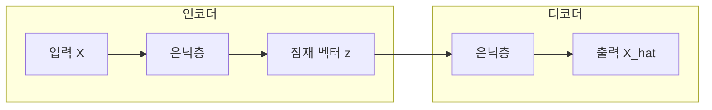

# 22차시: 딥러닝 응용 - 오토인코더 기반 이상 탐지

## 학습 목표

1. **오토인코더**의 구조와 원리를 이해함
2. **Keras**로 오토인코더 모델을 구성함
3. **재구성 오차**를 활용한 이상 탐지 기법을 익힘

---

## 강의 구성

| 구간 | 시간 | 내용 |
|:----:|:----:|------|
| 대주제 1 | 8분 | 오토인코더 개념과 수학적 배경 |
| 대주제 2 | 10분 | Keras로 오토인코더 구현 |
| 대주제 3 | 5분 | 재구성 오차 기반 이상 탐지 |
| 정리 | 2분 | 핵심 요약 |

---

## 지난 시간 복습

- **Keras로 MLP 구현**: Sequential, Dense, Dropout
- **CNN**: 이미지 특징 추출 (Conv2D, MaxPooling)
- **RNN/LSTM**: 시계열 순차 데이터 처리

**오늘**: 비지도 학습 기반 이상 탐지 - 오토인코더

---

# 대주제 1: 오토인코더 개념과 수학적 배경

## 1.1 오토인코더란?

**정의**: 입력을 압축 후 복원하여 **입력 자체를 재구성**하는 신경망

**특징**:
- 비지도 학습 (레이블 불필요)
- 차원 축소와 특징 추출
- 이상 탐지에 활용

---

## 1.2 오토인코더 구조



- **인코더**: 입력을 저차원으로 압축
- **잠재 공간 (Latent Space)**: 핵심 특징만 남긴 표현
- **디코더**: 저차원에서 원래 차원으로 복원

---

## 1.3 오토인코더 목적 함수

**목표**: 입력과 출력의 차이를 최소화

$$\min ||X - \hat{X}||^2$$

| 기호 | 의미 |
|-----|------|
| $X$ | 원본 입력 |
| $\hat{X}$ | 재구성된 출력 |
| $\|\|\cdot\|\|^2$ | L2 노름 (유클리드 거리) |

---

## 1.4 인코더 수식

**입력을 잠재 공간으로 변환**

$$z = f(X) = \sigma(W_e X + b_e)$$

| 기호 | 의미 |
|-----|------|
| $z$ | 잠재 벡터 (Latent Vector) |
| $W_e$ | 인코더 가중치 |
| $b_e$ | 인코더 편향 |
| $\sigma$ | 활성화 함수 (ReLU 등) |

---

## 1.5 디코더 수식

**잠재 공간에서 입력 복원**

$$\hat{X} = g(z) = \sigma(W_d z + b_d)$$

| 기호 | 의미 |
|-----|------|
| $\hat{X}$ | 재구성된 출력 |
| $W_d$ | 디코더 가중치 |
| $b_d$ | 디코더 편향 |

---

## 1.6 재구성 오차 (Reconstruction Error)

**손실 함수**: MSE (Mean Squared Error)

$$L = \frac{1}{n}\sum_{i=1}^{n}||X_i - \hat{X}_i||^2$$

**의미**:
- 낮은 오차 = 정상 데이터 (학습 패턴과 유사)
- 높은 오차 = 이상 데이터 (학습 패턴과 상이)

---

## 1.7 이상 탐지 원리

```
[학습 단계]
정상 데이터만으로 학습 -> 정상 패턴 기억

[탐지 단계]
새 데이터 입력 -> 재구성 -> 오차 계산
  |
  +-- 오차 작음 -> 정상
  +-- 오차 큼   -> 이상
```

---

## 1.8 임계값 설정

**통계적 임계값 설정**

$$\theta = \mu + k\sigma$$

| 기호 | 의미 | 권장값 |
|-----|------|--------|
| $\mu$ | 재구성 오차 평균 | - |
| $\sigma$ | 재구성 오차 표준편차 | - |
| $k$ | 민감도 상수 | 2 ~ 3 |

- $k=2$: 약 95% 신뢰구간
- $k=3$: 약 99.7% 신뢰구간

---

## 1.9 왜 오토인코더로 이상 탐지?

| 방법 | 장점 | 단점 |
|-----|------|------|
| 규칙 기반 | 해석 용이 | 복잡한 패턴 불가 |
| 통계 기반 | 간단 | 다변량 어려움 |
| **오토인코더** | **복잡한 패턴 학습** | 학습 필요 |

**핵심**: 정상 패턴을 학습하여 비정상을 탐지

---

## 1.10 오토인코더 변형

| 변형 | 특징 | 용도 |
|-----|------|------|
| Vanilla AE | 기본 구조 | 차원 축소, 이상 탐지 |
| Denoising AE | 노이즈 추가 학습 | 노이즈 제거, 강건성 |
| Variational AE | 확률적 잠재 공간 | 데이터 생성 |
| Sparse AE | 희소 제약 | 특징 추출 |

---

# 대주제 2: Keras로 오토인코더 구현

## 2.1 기본 오토인코더 구조

```
입력 (n) -> 인코더 -> 잠재 (k) -> 디코더 -> 출력 (n)
           [n->64->k]          [k->64->n]
```

**차원 관계**: 입력 = 출력 > 잠재 공간

---

## 2.2 Sequential 모델로 구현

```python
from tensorflow.keras.models import Sequential
from tensorflow.keras.layers import Dense

# 입력 차원: 30, 잠재 차원: 8
autoencoder = Sequential([
    # 인코더
    Dense(64, activation='relu', input_shape=(30,)),
    Dense(32, activation='relu'),
    Dense(8, activation='relu'),  # 잠재 공간
    # 디코더
    Dense(32, activation='relu'),
    Dense(64, activation='relu'),
    Dense(30, activation='sigmoid')  # 출력
])
```

---

## 2.3 Functional API로 구현

```python
from tensorflow.keras.models import Model
from tensorflow.keras.layers import Input, Dense

# 입력 정의
input_layer = Input(shape=(30,))

# 인코더
encoded = Dense(64, activation='relu')(input_layer)
encoded = Dense(32, activation='relu')(encoded)
latent = Dense(8, activation='relu')(encoded)

# 디코더
decoded = Dense(32, activation='relu')(latent)
decoded = Dense(64, activation='relu')(decoded)
output = Dense(30, activation='sigmoid')(decoded)

# 모델 생성
autoencoder = Model(input_layer, output)
```

---

## 2.4 인코더/디코더 분리

```python
# 인코더만 추출
encoder = Model(input_layer, latent)

# 잠재 벡터 추출 가능
latent_features = encoder.predict(X_test)
```

**활용**: 차원 축소, 특징 추출

---

## 2.5 컴파일 설정

```python
autoencoder.compile(
    optimizer='adam',
    loss='mse'  # 재구성 오차
)
```

| 설정 | 값 | 이유 |
|-----|-----|------|
| optimizer | adam | 적응적 학습률 |
| loss | mse | 재구성 오차 최소화 |

---

## 2.6 학습 방법

```python
history = autoencoder.fit(
    X_train, X_train,  # 입력 = 타겟
    epochs=100,
    batch_size=32,
    validation_split=0.2,
    callbacks=[EarlyStopping(patience=10)]
)
```

**핵심**: `y = X` (자기 자신을 예측)

---

## 2.7 잠재 공간 크기 선택

| 입력 차원 | 잠재 차원 | 압축률 |
|----------|----------|--------|
| 30 | 8 | 73% |
| 100 | 20 | 80% |
| 784 | 32 | 96% |

**원칙**: 충분히 압축하되, 정보 손실 최소화

---

## 2.8 활성화 함수 선택

| 위치 | 함수 | 이유 |
|-----|------|------|
| 은닉층 | ReLU | 비선형성 |
| 출력층 | sigmoid | 0~1 정규화 데이터 |
| 출력층 | linear | 정규화 안 된 데이터 |

---

# 대주제 3: 재구성 오차 기반 이상 탐지

## 3.1 재구성 오차 계산

```python
# 재구성
X_pred = autoencoder.predict(X_test)

# 샘플별 오차 (MSE)
reconstruction_error = np.mean((X_test - X_pred) ** 2, axis=1)
```

---

## 3.2 임계값 결정

```python
# 통계적 임계값
mu = np.mean(reconstruction_error)
sigma = np.std(reconstruction_error)

threshold = mu + 3 * sigma  # 99.7% 신뢰구간
```

---

## 3.3 이상 판정

```python
# 이상 여부 판정
is_anomaly = reconstruction_error > threshold

# 결과 확인
print(f"정상: {(~is_anomaly).sum()}개")
print(f"이상: {is_anomaly.sum()}개")
```

---

## 3.4 제조업 적용 시나리오

| 데이터 | 정상 패턴 | 이상 패턴 |
|-------|----------|----------|
| 센서 데이터 | 안정적 온도/압력 | 급격한 변동 |
| 설비 진동 | 규칙적 진동 | 불규칙 진동 |
| 전력 소비 | 일정한 소비 패턴 | 급격한 증가/감소 |

---

## 3.5 성능 평가 지표

| 지표 | 의미 |
|-----|------|
| Precision | 이상 예측 중 실제 이상 비율 |
| Recall | 실제 이상 중 탐지 비율 |
| F1-Score | Precision과 Recall의 조화 평균 |
| AUC-ROC | 분류 성능 종합 지표 |

---

# 핵심 정리

## 오토인코더 수식 요약

| 구성요소 | 수식 |
|---------|------|
| 목적 함수 | $\min \|\|X - \hat{X}\|\|^2$ |
| 인코더 | $z = \sigma(W_e X + b_e)$ |
| 디코더 | $\hat{X} = \sigma(W_d z + b_d)$ |
| 재구성 오차 | $L = \|\|X - \hat{X}\|\|^2$ |
| 임계값 | $\theta = \mu + k\sigma$ |

---

## 오늘 배운 내용

1. **오토인코더 구조**
   - 인코더-잠재공간-디코더
   - 입력 = 출력 (자기 자신 복원)

2. **Keras 구현**
   - Sequential 또는 Functional API
   - loss='mse', 입력을 타겟으로 학습

3. **이상 탐지**
   - 재구성 오차 계산
   - 임계값 기반 판정

---

## 체크리스트

- [ ] 오토인코더 구조 이해 (인코더-잠재공간-디코더)
- [ ] 재구성 오차 개념 이해 ($L = ||X - \hat{X}||^2$)
- [ ] Keras로 오토인코더 구현
- [ ] 학습: `model.fit(X, X)` 형태
- [ ] 임계값 설정: $\theta = \mu + k\sigma$
- [ ] 이상 판정: 오차 > 임계값

---

## 다음 차시 예고

### [23차시] 모델 해석과 변수별 영향력 분석

- Feature Importance
- Permutation Importance
- SHAP 개념 소개
