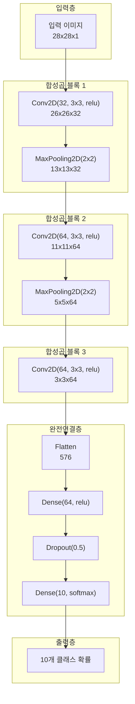

# 23차시: 딥러닝 응용 - CNN 기반 이미지 불량 검출

## 학습 목표

| 목표 | 설명 |
|------|------|
| CNN 구조 이해 | 합성곱 신경망의 구조와 각 층의 역할을 이해함 |
| 수식 전개 | 합성곱 연산, 특성 맵 크기 계산, 풀링 연산의 수학적 원리를 학습함 |
| Keras 구현 | CNN 모델을 Keras로 구성하고 학습함 |
| 불량 분류 | Fashion-MNIST를 활용하여 이미지 기반 불량 검출을 수행함 |

---

## 실습 데이터셋

| 데이터셋 | 출처 | 용도 |
|---------|------|------|
| Fashion-MNIST | tensorflow.keras.datasets | 의류 이미지 10개 클래스 분류 |

```python
from tensorflow.keras.datasets import fashion_mnist
(X_train, y_train), (X_test, y_test) = fashion_mnist.load_data()
```

---

## 수학적 배경

### 합성곱 연산

입력 이미지 $I$와 커널(필터) $K$의 2D 합성곱 연산:

$$
(I * K)(i,j) = \sum_{m=0}^{k_h-1} \sum_{n=0}^{k_w-1} I(i+m, j+n) \cdot K(m,n)
$$

| 기호 | 의미 |
|------|------|
| $I$ | 입력 이미지 (2D 행렬) |
| $K$ | 커널/필터 (작은 2D 행렬) |
| $(i,j)$ | 출력 특성 맵의 위치 |
| $(m,n)$ | 커널 내부의 상대 위치 |
| $k_h, k_w$ | 커널의 높이, 너비 |

### 특성 맵 크기 계산

$$
O = \frac{W - K + 2P}{S} + 1
$$

| 기호 | 의미 | 예시 |
|------|------|------|
| $O$ | 출력 크기 | 26 |
| $W$ | 입력 크기 | 28 |
| $K$ | 커널 크기 | 3 |
| $P$ | 패딩 | 0 |
| $S$ | 스트라이드 | 1 |

**계산 예시 (Fashion-MNIST 첫 번째 합성곱층)**:

$$
O = \frac{28 - 3 + 2 \times 0}{1} + 1 = \frac{25}{1} + 1 = 26
$$

### 풀링 연산

Max Pooling 연산:

$$
y_{ij} = \max_{(m,n) \in R_{ij}} x_{mn}
$$

| 기호 | 의미 |
|------|------|
| $y_{ij}$ | 출력 위치 $(i,j)$의 값 |
| $R_{ij}$ | 풀링 영역 (예: 2x2) |
| $x_{mn}$ | 영역 내 입력값 |

---

## 강의 구성 (25분)

| 파트 | 주제 | 시간 |
|:----:|------|:----:|
| Part 1 | CNN 구조 이해 | 8분 |
| Part 2 | Keras CNN 구현 | 10분 |
| Part 3 | 평가 및 해석 | 5분 |
| 정리 | 핵심 요약 | 2분 |

---

## Part 1: CNN 구조 이해 (8분)

### 1.1 CNN 전체 구조

CNN(Convolutional Neural Network)은 이미지 처리에 특화된 신경망으로, 공간적 구조를 유지하면서 특징을 추출함.



| 층 유형 | 역할 | 파라미터 |
|--------|------|----------|
| Conv2D | 지역적 특징 추출 | 필터 수, 커널 크기 |
| MaxPooling2D | 공간 크기 축소, 강건성 확보 | 풀링 크기 |
| Flatten | 다차원을 1차원으로 변환 | 없음 |
| Dense | 분류 수행 | 뉴런 수 |
| Dropout | 과적합 방지 | 드롭 비율 |

---

### 1.2 합성곱 연산 수동 계산

```python
import numpy as np

def convolution_2d_manual(image, kernel):
    """
    2D 합성곱 연산을 수동으로 계산함

    수식: (I * K)(i,j) = sum_m sum_n I(i+m, j+n) * K(m,n)
    """
    img_h, img_w = image.shape
    ker_h, ker_w = kernel.shape

    # 출력 크기 계산: O = W - K + 1 (패딩 0, 스트라이드 1)
    out_h = img_h - ker_h + 1
    out_w = img_w - ker_w + 1

    output = np.zeros((out_h, out_w))

    for i in range(out_h):
        for j in range(out_w):
            # 현재 위치의 영역 추출
            region = image[i:i+ker_h, j:j+ker_w]
            # 요소별 곱셈 후 합산
            output[i, j] = np.sum(region * kernel)

    return output

# 예시: 3x3 입력, 2x2 커널
image = np.array([
    [1, 2, 3],
    [4, 5, 6],
    [7, 8, 9]
], dtype=float)

kernel = np.array([
    [1, 0],
    [0, 1]
], dtype=float)

print("입력 이미지 (3x3):")
print(image)
print("\n커널 (2x2):")
print(kernel)

# 합성곱 연산 수행
output = convolution_2d_manual(image, kernel)
print("\n합성곱 결과 (2x2):")
print(output)
```

**실제 데이터 계산 과정**:

| 위치 | 연산 | 결과 |
|------|------|------|
| (0,0) | 1x1 + 2x0 + 4x0 + 5x1 | 6 |
| (0,1) | 2x1 + 3x0 + 5x0 + 6x1 | 8 |
| (1,0) | 4x1 + 5x0 + 7x0 + 8x1 | 12 |
| (1,1) | 5x1 + 6x0 + 8x0 + 9x1 | 14 |

---

### 1.3 특성 맵 크기 계산 실습

```python
def calculate_output_size(W, K, P=0, S=1):
    """
    합성곱 출력 크기 계산

    공식: O = (W - K + 2P) / S + 1
    """
    O = (W - K + 2*P) // S + 1
    return O

print("특성 맵 크기 계산 공식: O = (W - K + 2P) / S + 1")
print("=" * 60)

# Fashion-MNIST CNN 각 층의 크기 변화 추적
print("\nFashion-MNIST CNN 크기 변화:")
print("-" * 60)

layers_info = [
    ("입력", 28, "-", "-", "-", 28),
    ("Conv2D(32, 3x3)", 28, 3, 0, 1, calculate_output_size(28, 3, 0, 1)),
    ("MaxPooling(2x2)", 26, 2, 0, 2, calculate_output_size(26, 2, 0, 2)),
    ("Conv2D(64, 3x3)", 13, 3, 0, 1, calculate_output_size(13, 3, 0, 1)),
    ("MaxPooling(2x2)", 11, 2, 0, 2, calculate_output_size(11, 2, 0, 2)),
    ("Conv2D(64, 3x3)", 5, 3, 0, 1, calculate_output_size(5, 3, 0, 1)),
]

for name, W, K, P, S, O in layers_info:
    if K == "-":
        print(f"  {name}: {O}x{O}")
    else:
        print(f"  {name}: ({W} - {K} + 2x{P}) / {S} + 1 = {O}x{O}")
```

**Fashion-MNIST CNN 크기 변화 요약**:

| 층 | 입력 크기 | 연산 | 출력 크기 |
|----|----------|------|----------|
| 입력 | - | - | 28x28x1 |
| Conv2D(32) | 28x28x1 | (28-3+0)/1+1 | 26x26x32 |
| MaxPool | 26x26x32 | (26-2)/2+1 | 13x13x32 |
| Conv2D(64) | 13x13x32 | (13-3+0)/1+1 | 11x11x64 |
| MaxPool | 11x11x64 | (11-2)/2+1 | 5x5x64 |
| Conv2D(64) | 5x5x64 | (5-3+0)/1+1 | 3x3x64 |
| Flatten | 3x3x64 | 3x3x64 | 576 |

---

### 1.4 풀링 연산 수동 계산

```python
def max_pooling_2d(image, pool_size=2, stride=2):
    """
    2x2 Max Pooling 연산

    수식: y_ij = max_{(m,n) in R_ij} x_mn
    """
    h, w = image.shape
    out_h = (h - pool_size) // stride + 1
    out_w = (w - pool_size) // stride + 1

    output = np.zeros((out_h, out_w))

    for i in range(out_h):
        for j in range(out_w):
            region = image[i*stride:i*stride+pool_size,
                          j*stride:j*stride+pool_size]
            output[i, j] = np.max(region)

    return output

# 예시 특성 맵 (4x4)
feature_map = np.array([
    [1, 3, 2, 4],
    [5, 6, 7, 8],
    [9, 10, 11, 12],
    [2, 1, 3, 2]
], dtype=float)

print("입력 특성 맵 (4x4):")
print(feature_map.astype(int))

max_pooled = max_pooling_2d(feature_map)
print("\n2x2 Max Pooling 결과 (2x2):")
print(max_pooled.astype(int))
```

**Max Pooling 계산 과정**:

| 영역 | 값 | 최댓값 |
|------|-----|--------|
| 좌상단 | [1, 3, 5, 6] | 6 |
| 우상단 | [2, 4, 7, 8] | 8 |
| 좌하단 | [9, 10, 2, 1] | 10 |
| 우하단 | [11, 12, 3, 2] | 12 |

---

### 1.5 CNN 파라미터 수 계산

파라미터 수 계산 공식:
- **Conv2D**: $(K_h \times K_w \times C_{in} + 1) \times C_{out}$
- **Dense**: $(n_{in} + 1) \times n_{out}$

```python
def calculate_conv_params(kernel_h, kernel_w, in_channels, out_channels):
    """Conv2D 층의 파라미터 수 계산"""
    weights = kernel_h * kernel_w * in_channels * out_channels
    biases = out_channels
    return weights + biases

def calculate_dense_params(in_features, out_features):
    """Dense 층의 파라미터 수 계산"""
    return (in_features + 1) * out_features

print("Fashion-MNIST CNN 파라미터 수 계산:")
print("=" * 50)

layers = [
    ("Conv2D(32, 3x3)", calculate_conv_params(3, 3, 1, 32)),
    ("Conv2D(64, 3x3)", calculate_conv_params(3, 3, 32, 64)),
    ("Conv2D(64, 3x3)", calculate_conv_params(3, 3, 64, 64)),
    ("Dense(64)", calculate_dense_params(576, 64)),
    ("Dense(10)", calculate_dense_params(64, 10)),
]

total = 0
for name, params in layers:
    print(f"  {name}: {params:,} 파라미터")
    total += params

print("-" * 50)
print(f"  총 파라미터: {total:,}")
```

**파라미터 수 상세 계산**:

| 층 | 계산식 | 파라미터 수 |
|----|--------|------------|
| Conv2D(32) | (3x3x1+1)x32 | 320 |
| Conv2D(64) | (3x3x32+1)x64 | 18,496 |
| Conv2D(64) | (3x3x64+1)x64 | 36,928 |
| Dense(64) | (576+1)x64 | 36,928 |
| Dense(10) | (64+1)x10 | 650 |
| **합계** | - | **93,322** |

---

## Part 2: Keras CNN 구현 (10분)

### 2.1 환경 설정 및 데이터 로드

```python
import numpy as np
import matplotlib.pyplot as plt
import os

os.environ['TF_CPP_MIN_LOG_LEVEL'] = '2'

import tensorflow as tf
from tensorflow import keras
from tensorflow.keras.models import Sequential
from tensorflow.keras.layers import (
    Conv2D, MaxPooling2D, Flatten, Dense, Dropout
)
from tensorflow.keras.callbacks import EarlyStopping
from tensorflow.keras.datasets import fashion_mnist
from sklearn.metrics import classification_report, confusion_matrix

print(f"TensorFlow 버전: {tf.__version__}")

# 데이터 로드
(X_train, y_train), (X_test, y_test) = fashion_mnist.load_data()

# 클래스 이름 정의
class_names = [
    'T-shirt/top', 'Trouser', 'Pullover', 'Dress', 'Coat',
    'Sandal', 'Shirt', 'Sneaker', 'Bag', 'Ankle boot'
]

print(f"\nFashion-MNIST 데이터셋:")
print(f"  학습 데이터: {X_train.shape}")
print(f"  테스트 데이터: {X_test.shape}")
print(f"  클래스 수: {len(class_names)}")
```

**Fashion-MNIST 데이터셋 정보**:

| 항목 | 값 |
|------|-----|
| 학습 샘플 수 | 60,000 |
| 테스트 샘플 수 | 10,000 |
| 이미지 크기 | 28x28 픽셀 |
| 채널 수 | 1 (흑백) |
| 클래스 수 | 10 |

---

### 2.2 데이터 시각화

```python
# 시각화 1: 클래스별 대표 이미지
fig, axes = plt.subplots(2, 5, figsize=(12, 5))

for i, ax in enumerate(axes.flat):
    idx = np.where(y_train == i)[0][0]
    ax.imshow(X_train[idx], cmap='gray')
    ax.set_title(f'{i}: {class_names[i]}')
    ax.axis('off')

plt.suptitle('Fashion-MNIST Classes', fontsize=14)
plt.tight_layout()
plt.savefig('fashion_mnist_classes.png', dpi=150, bbox_inches='tight')
plt.show()
```

**차트 해석 방향**:
- 각 클래스의 시각적 특성 확인
- 유사한 클래스 식별 (예: Shirt vs T-shirt, Sneaker vs Ankle boot)
- 분류 난이도 예측

---

### 2.3 데이터 전처리

```python
# 1. 정규화 (0~255 -> 0~1)
X_train_norm = X_train.astype('float32') / 255.0
X_test_norm = X_test.astype('float32') / 255.0

print("정규화 결과:")
print(f"  변환 전: {X_train.min()} ~ {X_train.max()}")
print(f"  변환 후: {X_train_norm.min():.2f} ~ {X_train_norm.max():.2f}")

# 2. 채널 차원 추가 (CNN 입력 형태: batch, height, width, channels)
X_train_cnn = X_train_norm.reshape(-1, 28, 28, 1)
X_test_cnn = X_test_norm.reshape(-1, 28, 28, 1)

print(f"\nCNN 입력 형태:")
print(f"  학습 데이터: {X_train_cnn.shape}")
print(f"  테스트 데이터: {X_test_cnn.shape}")
```

**전처리 단계 요약**:

| 단계 | 변환 전 | 변환 후 | 목적 |
|------|---------|---------|------|
| 정규화 | 0~255 | 0~1 | 학습 안정화 |
| Reshape | (N, 28, 28) | (N, 28, 28, 1) | CNN 입력 형태 |

---

### 2.4 기본 CNN 모델 구성

```python
def create_basic_cnn(input_shape=(28, 28, 1), num_classes=10):
    """
    기본 CNN 모델 생성

    구조:
    - Conv2D(32) -> MaxPooling
    - Conv2D(64) -> MaxPooling
    - Conv2D(64)
    - Flatten -> Dense(64) -> Dense(num_classes)
    """
    model = Sequential([
        # 첫 번째 합성곱 블록
        Conv2D(32, (3, 3), activation='relu', input_shape=input_shape,
               name='conv1'),
        MaxPooling2D((2, 2), name='pool1'),

        # 두 번째 합성곱 블록
        Conv2D(64, (3, 3), activation='relu', name='conv2'),
        MaxPooling2D((2, 2), name='pool2'),

        # 세 번째 합성곱 층
        Conv2D(64, (3, 3), activation='relu', name='conv3'),

        # 분류기
        Flatten(name='flatten'),
        Dense(64, activation='relu', name='dense1'),
        Dropout(0.5, name='dropout'),
        Dense(num_classes, activation='softmax', name='output')
    ])

    return model

# 모델 생성
model = create_basic_cnn()
model.summary()
```

**모델 구조 요약**:

| 층 | 출력 형태 | 파라미터 수 |
|----|----------|------------|
| conv1 (Conv2D) | (26, 26, 32) | 320 |
| pool1 (MaxPooling2D) | (13, 13, 32) | 0 |
| conv2 (Conv2D) | (11, 11, 64) | 18,496 |
| pool2 (MaxPooling2D) | (5, 5, 64) | 0 |
| conv3 (Conv2D) | (3, 3, 64) | 36,928 |
| flatten | (576,) | 0 |
| dense1 | (64,) | 36,928 |
| dropout | (64,) | 0 |
| output | (10,) | 650 |

---

### 2.5 모델 컴파일 및 학습

```python
# 모델 컴파일
model.compile(
    optimizer='adam',
    loss='sparse_categorical_crossentropy',
    metrics=['accuracy']
)

print("컴파일 설정:")
print("  - Optimizer: Adam")
print("  - Loss: sparse_categorical_crossentropy (정수 라벨)")
print("  - Metrics: accuracy")

# 콜백 설정
early_stop = EarlyStopping(
    monitor='val_loss',
    patience=5,
    restore_best_weights=True,
    verbose=1
)

# 모델 학습
print("\n모델 학습 시작...")
history = model.fit(
    X_train_cnn, y_train,
    epochs=20,
    batch_size=64,
    validation_split=0.2,
    callbacks=[early_stop],
    verbose=1
)

print(f"\n학습 완료!")
print(f"  실제 에포크 수: {len(history.history['loss'])}")
print(f"  최종 학습 정확도: {history.history['accuracy'][-1]:.4f}")
print(f"  최종 검증 정확도: {history.history['val_accuracy'][-1]:.4f}")
```

**학습 설정 요약**:

| 항목 | 설정값 | 설명 |
|------|--------|------|
| Optimizer | Adam | 적응형 학습률 |
| Loss | sparse_categorical_crossentropy | 정수 라벨용 |
| Batch Size | 64 | 메모리 효율성 |
| Validation Split | 0.2 | 검증 데이터 20% |
| Early Stopping | patience=5 | 조기 종료 |

---

### 2.6 학습 곡선 시각화

```python
# 시각화 2: 학습 곡선
fig, axes = plt.subplots(1, 2, figsize=(14, 5))

# 손실 곡선
axes[0].plot(history.history['loss'], label='Train', linewidth=2)
axes[0].plot(history.history['val_loss'], label='Validation', linewidth=2)
axes[0].set_title('Loss Curve', fontsize=14)
axes[0].set_xlabel('Epoch')
axes[0].set_ylabel('Loss')
axes[0].legend()
axes[0].grid(True, alpha=0.3)

# 정확도 곡선
axes[1].plot(history.history['accuracy'], label='Train', linewidth=2)
axes[1].plot(history.history['val_accuracy'], label='Validation', linewidth=2)
axes[1].set_title('Accuracy Curve', fontsize=14)
axes[1].set_xlabel('Epoch')
axes[1].set_ylabel('Accuracy')
axes[1].legend()
axes[1].grid(True, alpha=0.3)

plt.tight_layout()
plt.savefig('learning_curves.png', dpi=150, bbox_inches='tight')
plt.show()
```

**학습 곡선 해석 가이드**:

| 패턴 | 의미 | 조치 |
|------|------|------|
| Train/Val 수렴 | 정상 학습 | 유지 |
| Train 감소, Val 증가 | 과적합 | Dropout 증가, 데이터 증강 |
| Train/Val 높은 손실 | 과소적합 | 모델 복잡도 증가 |
| Val 불안정 | 학습률 문제 | 학습률 감소 |

---

## Part 3: 평가 및 해석 (5분)

### 3.1 테스트 데이터 평가

```python
# 테스트 데이터 평가
test_loss, test_accuracy = model.evaluate(X_test_cnn, y_test, verbose=0)

print("테스트 데이터 평가 결과:")
print("=" * 40)
print(f"  테스트 손실: {test_loss:.4f}")
print(f"  테스트 정확도: {test_accuracy:.2%}")

# 예측 수행
y_pred_prob = model.predict(X_test_cnn, verbose=0)
y_pred = np.argmax(y_pred_prob, axis=1)

print(f"\n예측 결과:")
print(f"  총 테스트 샘플: {len(y_test):,}")
print(f"  정확한 예측: {np.sum(y_pred == y_test):,}")
print(f"  오분류: {np.sum(y_pred != y_test):,}")
```

---

### 3.2 혼동 행렬 시각화

```python
# 시각화 3: 혼동 행렬
cm = confusion_matrix(y_test, y_pred)

fig, ax = plt.subplots(figsize=(12, 10))
im = ax.imshow(cm, cmap='Blues')

ax.set_xticks(np.arange(len(class_names)))
ax.set_yticks(np.arange(len(class_names)))
ax.set_xticklabels(class_names, rotation=45, ha='right')
ax.set_yticklabels(class_names)

for i in range(len(class_names)):
    for j in range(len(class_names)):
        color = 'white' if cm[i, j] > cm.max()/2 else 'black'
        ax.text(j, i, cm[i, j], ha='center', va='center', color=color)

ax.set_xlabel('Predicted Label')
ax.set_ylabel('True Label')
ax.set_title('Confusion Matrix')

plt.colorbar(im)
plt.tight_layout()
plt.savefig('confusion_matrix.png', dpi=150, bbox_inches='tight')
plt.show()
```

**혼동 행렬 해석 방향**:
- 대각선: 정확한 예측 (높을수록 좋음)
- 비대각선: 오분류 (낮을수록 좋음)
- 자주 혼동되는 클래스 쌍 확인

---

### 3.3 분류 보고서

```python
# 분류 보고서 출력
print("분류 보고서:")
print("=" * 60)
print(classification_report(y_test, y_pred, target_names=class_names))
```

**주요 성능 지표**:

| 지표 | 의미 | 제조업 관점 |
|------|------|------------|
| Precision | 양성 예측 중 실제 양성 비율 | 오검출 최소화 |
| Recall | 실제 양성 중 검출된 비율 | 불량 놓치지 않기 |
| F1-score | Precision과 Recall의 조화평균 | 균형 잡힌 성능 |

---

### 3.4 오분류 분석

```python
# 시각화 4: 오분류 샘플
wrong_idx = np.where(y_test != y_pred)[0]
sample_idx = np.random.choice(wrong_idx, 10, replace=False)

fig, axes = plt.subplots(2, 5, figsize=(15, 6))

for i, (ax, idx) in enumerate(zip(axes.flat, sample_idx)):
    ax.imshow(X_test[idx], cmap='gray')
    true_label = class_names[y_test[idx]]
    pred_label = class_names[y_pred[idx]]
    ax.set_title(f'True: {true_label}\nPred: {pred_label}', fontsize=10)
    ax.axis('off')

plt.suptitle('Misclassified Samples', fontsize=14)
plt.tight_layout()
plt.savefig('misclassified_samples.png', dpi=150, bbox_inches='tight')
plt.show()

# 자주 혼동되는 클래스 쌍 분석
print("\n자주 혼동되는 클래스 쌍:")
print("-" * 40)

cm_off_diag = cm.copy()
np.fill_diagonal(cm_off_diag, 0)

for _ in range(3):
    idx = np.unravel_index(np.argmax(cm_off_diag), cm_off_diag.shape)
    true_class = class_names[idx[0]]
    pred_class = class_names[idx[1]]
    count = cm_off_diag[idx]
    print(f"  {true_class} -> {pred_class}: {count}회")
    cm_off_diag[idx] = 0
```

**오분류 원인 분석**:
- 유사한 형태의 클래스 (Shirt vs T-shirt, Sneaker vs Ankle boot)
- 이미지 품질 문제 (흐릿함, 노이즈)
- 특이한 디자인/스타일

---

### 3.5 예측 확신도 분석

```python
# 시각화 5: 예측 확신도 분포
correct_mask = (y_pred == y_test)
correct_confidences = y_pred_prob[correct_mask].max(axis=1)
wrong_confidences = y_pred_prob[~correct_mask].max(axis=1)

fig, ax = plt.subplots(figsize=(10, 5))
ax.hist(correct_confidences, bins=30, alpha=0.7, label='Correct', color='green')
ax.hist(wrong_confidences, bins=30, alpha=0.7, label='Wrong', color='red')
ax.set_xlabel('Prediction Confidence')
ax.set_ylabel('Count')
ax.set_title('Confidence Distribution: Correct vs Wrong Predictions')
ax.legend()
ax.grid(True, alpha=0.3)
plt.tight_layout()
plt.savefig('confidence_distribution.png', dpi=150, bbox_inches='tight')
plt.show()

print("확신도 통계:")
print(f"  정확한 예측 평균 확신도: {correct_confidences.mean():.3f}")
print(f"  오분류 평균 확신도: {wrong_confidences.mean():.3f}")
```

**확신도 분석 의미**:
- 정확한 예측: 높은 확신도 기대
- 오분류: 낮은 확신도 경향
- 확신도 임계값으로 불확실한 예측 필터링 가능

---

### 3.6 이미지 분류 파이프라인


---

### 3.7 모델 저장 및 예측 함수

```python
# 모델 저장
model.save('fashion_mnist_cnn.keras')
print("모델 저장 완료: fashion_mnist_cnn.keras")

# 단일 이미지 예측 함수
def predict_single_image(model, image, class_names):
    """
    단일 이미지 예측

    Parameters:
        model: 학습된 CNN 모델
        image: 28x28 픽셀 이미지
        class_names: 클래스 이름 리스트

    Returns:
        예측 클래스, 확신도
    """
    if image.max() > 1:
        image = image.astype('float32') / 255.0

    image = image.reshape(1, 28, 28, 1)
    predictions = model.predict(image, verbose=0)
    predicted_class = np.argmax(predictions[0])
    confidence = predictions[0, predicted_class]

    return class_names[predicted_class], confidence

# 예측 테스트
print("\n단일 이미지 예측 테스트:")
for i in range(5):
    pred_class, conf = predict_single_image(model, X_test[i], class_names)
    actual = class_names[y_test[i]]
    status = "O" if pred_class == actual else "X"
    print(f"  [{status}] 예측: {pred_class:15} | 실제: {actual:15} | 확신도: {conf:.2%}")
```

---

## 핵심 정리

### 오늘 배운 내용

| 주제 | 핵심 내용 |
|------|----------|
| 합성곱 연산 | $(I * K)(i,j) = \sum_m \sum_n I(i+m, j+n) \cdot K(m,n)$ |
| 특성 맵 크기 | $O = \frac{W - K + 2P}{S} + 1$ |
| Max Pooling | $y_{ij} = \max_{(m,n) \in R_{ij}} x_{mn}$ |
| CNN 구조 | Conv2D -> MaxPooling -> Flatten -> Dense |
| 출력 활성화 | 다중분류: softmax, 이진분류: sigmoid |
| 손실 함수 | 다중분류: sparse_categorical_crossentropy |

### 핵심 코드

```python
# CNN 모델 구성
model = Sequential([
    Conv2D(32, (3, 3), activation='relu', input_shape=(28, 28, 1)),
    MaxPooling2D((2, 2)),
    Conv2D(64, (3, 3), activation='relu'),
    MaxPooling2D((2, 2)),
    Conv2D(64, (3, 3), activation='relu'),
    Flatten(),
    Dense(64, activation='relu'),
    Dropout(0.5),
    Dense(10, activation='softmax')
])

model.compile(optimizer='adam',
              loss='sparse_categorical_crossentropy',
              metrics=['accuracy'])

model.fit(X_train, y_train, epochs=20, validation_split=0.2,
          callbacks=[EarlyStopping(patience=5)])
```

### 체크리스트

| 항목 | 확인 |
|------|------|
| 합성곱 연산 수식 이해 | [ ] |
| 특성 맵 크기 계산 공식 적용 | [ ] |
| Conv2D, MaxPooling2D 층 구성 | [ ] |
| 이미지 데이터 전처리 (정규화, reshape) | [ ] |
| 다중 클래스 분류 설정 (softmax, sparse_categorical_crossentropy) | [ ] |
| 혼동 행렬로 성능 분석 | [ ] |
| 모델 저장 및 로드 | [ ] |

---

## 다음 차시 예고

### [24차시] 모델 저장과 실무 배포 준비

- 학습된 모델 저장/로드 방법
- 추론 최적화 기법
- 실무 배포 체크리스트

---

---

## [참고자료] 심화 학습

> 선택 학습 - 25분 초과 콘텐츠

### A. 개선된 CNN 모델 (BatchNormalization)

BatchNormalization은 각 층의 입력을 정규화하여 학습을 안정화하고 수렴 속도를 향상시킴.

```python
from tensorflow.keras.layers import BatchNormalization

def create_improved_cnn(input_shape=(28, 28, 1), num_classes=10):
    """
    개선된 CNN 모델 (BatchNormalization 포함)

    개선사항:
    - BatchNormalization: 학습 안정화
    - Dropout: 과적합 방지
    - 더 많은 필터
    """
    model = Sequential([
        # 첫 번째 합성곱 블록
        Conv2D(32, (3, 3), padding='same', activation='relu',
               input_shape=input_shape),
        BatchNormalization(),
        Conv2D(32, (3, 3), padding='same', activation='relu'),
        BatchNormalization(),
        MaxPooling2D((2, 2)),
        Dropout(0.25),

        # 두 번째 합성곱 블록
        Conv2D(64, (3, 3), padding='same', activation='relu'),
        BatchNormalization(),
        Conv2D(64, (3, 3), padding='same', activation='relu'),
        BatchNormalization(),
        MaxPooling2D((2, 2)),
        Dropout(0.25),

        # 분류기
        Flatten(),
        Dense(128, activation='relu'),
        BatchNormalization(),
        Dropout(0.5),
        Dense(num_classes, activation='softmax')
    ])

    return model

model_improved = create_improved_cnn()
model_improved.summary()
```

**BatchNormalization 효과**:

| 항목 | 설명 |
|------|------|
| 학습 안정화 | 각 층의 입력 분포 정규화 |
| 수렴 속도 향상 | 더 높은 학습률 사용 가능 |
| 정규화 효과 | 약간의 과적합 방지 |

---

### B. 데이터 증강 기법

데이터 증강은 원본 데이터를 변환하여 학습 데이터를 늘리는 기법으로, 과적합을 방지하고 일반화 성능을 향상시킴.

```python
from tensorflow.keras.preprocessing.image import ImageDataGenerator

datagen = ImageDataGenerator(
    rotation_range=10,        # 회전 범위 (도)
    width_shift_range=0.1,    # 수평 이동 범위
    height_shift_range=0.1,   # 수직 이동 범위
    zoom_range=0.1,           # 확대/축소 범위
    horizontal_flip=True,     # 수평 반전
    fill_mode='nearest'
)

# 증강 데이터로 학습
model.fit(
    datagen.flow(X_train_cnn, y_train, batch_size=64),
    epochs=20,
    validation_data=(X_test_cnn, y_test),
    callbacks=[early_stop]
)
```

**데이터 증강 설정**:

| 파라미터 | 값 | 설명 |
|----------|-----|------|
| rotation_range | 10 | 무작위 회전 각도 |
| width_shift_range | 0.1 | 수평 이동 비율 |
| height_shift_range | 0.1 | 수직 이동 비율 |
| zoom_range | 0.1 | 확대/축소 범위 |
| horizontal_flip | True | 수평 반전 적용 |

---

### C. 특징 맵 시각화

CNN이 학습한 특징을 시각화하여 모델의 작동 방식을 이해함.

```python
def visualize_feature_maps(model, image, layer_names=None):
    """
    CNN 특징 맵 시각화
    """
    if layer_names is None:
        layer_names = [layer.name for layer in model.layers
                      if 'conv' in layer.name]

    outputs = [model.get_layer(name).output for name in layer_names]
    feature_model = keras.Model(inputs=model.input, outputs=outputs)

    feature_maps = feature_model.predict(image.reshape(1, 28, 28, 1), verbose=0)

    for layer_name, fmap in zip(layer_names, feature_maps):
        n_features = min(fmap.shape[-1], 8)

        fig, axes = plt.subplots(1, n_features, figsize=(15, 2))
        fig.suptitle(f'Layer: {layer_name}', fontsize=12)

        for i in range(n_features):
            axes[i].imshow(fmap[0, :, :, i], cmap='viridis')
            axes[i].set_title(f'Filter {i}')
            axes[i].axis('off')

        plt.tight_layout()
        plt.savefig(f'feature_map_{layer_name}.png', dpi=150, bbox_inches='tight')
        plt.show()

# 특징 맵 시각화 실행
sample_image = X_test[0]
visualize_feature_maps(model, sample_image)
```

**특징 맵 해석**:
- 초기 층: 엣지, 질감 등 저수준 특징
- 후반 층: 형태, 패턴 등 고수준 특징
- 필터별로 다른 특징 감지

---

### D. 이진 분류 및 클래스 가중치

불균형 데이터에서 클래스 가중치를 적용하여 소수 클래스의 학습을 강화함.

```python
from sklearn.utils.class_weight import compute_class_weight

# 이진 분류: 신발류 vs 비신발류
def create_binary_labels(y, positive_classes=[5, 7, 9]):
    """다중 클래스를 이진 클래스로 변환"""
    return np.isin(y, positive_classes).astype(int)

y_train_binary = create_binary_labels(y_train)
y_test_binary = create_binary_labels(y_test)

# 클래스 가중치 계산
class_weights = compute_class_weight(
    class_weight='balanced',
    classes=np.unique(y_train_binary),
    y=y_train_binary
)
class_weight_dict = dict(enumerate(class_weights))

print(f"클래스 가중치:")
print(f"  음성 (0): {class_weight_dict[0]:.3f}")
print(f"  양성 (1): {class_weight_dict[1]:.3f}")

# 이진 분류 모델
def create_binary_cnn(input_shape=(28, 28, 1)):
    """이진 분류용 CNN 모델"""
    model = Sequential([
        Conv2D(32, (3, 3), activation='relu', input_shape=input_shape),
        MaxPooling2D((2, 2)),
        Conv2D(64, (3, 3), activation='relu'),
        MaxPooling2D((2, 2)),
        Conv2D(64, (3, 3), activation='relu'),
        Flatten(),
        Dense(64, activation='relu'),
        Dropout(0.5),
        Dense(1, activation='sigmoid')  # 이진 분류
    ])

    model.compile(
        optimizer='adam',
        loss='binary_crossentropy',
        metrics=['accuracy']
    )

    return model

model_binary = create_binary_cnn()

# 클래스 가중치 적용 학습
model_binary.fit(
    X_train_cnn, y_train_binary,
    epochs=10,
    batch_size=64,
    validation_split=0.2,
    class_weight=class_weight_dict,
    callbacks=[EarlyStopping(patience=3, restore_best_weights=True)]
)
```

**이진 분류 vs 다중 분류**:

| 항목 | 이진 분류 | 다중 분류 |
|------|----------|----------|
| 출력층 | Dense(1, sigmoid) | Dense(N, softmax) |
| 손실 함수 | binary_crossentropy | sparse_categorical_crossentropy |
| 예측값 | 0~1 확률 | N개 클래스 확률 |

---

### E. 불량 검출 성능 지표

제조업 불량 검출에서 중요한 성능 지표:

```python
from sklearn.metrics import precision_score, recall_score, f1_score, roc_auc_score

y_pred_prob = model_binary.predict(X_test_cnn, verbose=0)
y_pred = (y_pred_prob > 0.5).astype(int).ravel()

precision = precision_score(y_test_binary, y_pred)
recall = recall_score(y_test_binary, y_pred)
f1 = f1_score(y_test_binary, y_pred)
auc = roc_auc_score(y_test_binary, y_pred_prob)

print("불량 검출 성능 지표:")
print(f"  정밀도 (Precision): {precision:.4f}")
print(f"  재현율 (Recall): {recall:.4f}")
print(f"  F1-score: {f1:.4f}")
print(f"  AUC-ROC: {auc:.4f}")
```

**제조업 관점 해석**:

| 지표 | 의미 | 제조업 중요도 |
|------|------|-------------|
| Precision | 불량 판정 중 실제 불량 비율 | 오검출 비용 관련 |
| Recall | 실제 불량 중 검출된 비율 | 불량 유출 방지 (높은 우선순위) |
| F1-score | 정밀도와 재현율의 조화평균 | 균형 성능 |
| AUC-ROC | 분류기 전체 성능 | 임계값 독립 평가 |

---

### F. 엣지 검출 필터 예시

CNN에서 학습되는 필터의 예시로, 수동 정의된 엣지 검출 필터:

```python
filters = {
    "수직 엣지": np.array([[-1, 0, 1], [-1, 0, 1], [-1, 0, 1]], dtype=float),
    "수평 엣지": np.array([[-1, -1, -1], [0, 0, 0], [1, 1, 1]], dtype=float),
    "Sobel X": np.array([[-1, 0, 1], [-2, 0, 2], [-1, 0, 1]], dtype=float),
    "Sobel Y": np.array([[-1, -2, -1], [0, 0, 0], [1, 2, 1]], dtype=float),
}

print("엣지 검출 필터 예시:")
for name, kernel in filters.items():
    print(f"\n{name}:")
    print(kernel.astype(int))
```

---

### G. 전체 파이프라인 코드

```python
# 완전한 CNN 이미지 분류 파이프라인
import numpy as np
import matplotlib.pyplot as plt
import tensorflow as tf
from tensorflow.keras.models import Sequential
from tensorflow.keras.layers import Conv2D, MaxPooling2D, Flatten, Dense, Dropout
from tensorflow.keras.callbacks import EarlyStopping
from tensorflow.keras.datasets import fashion_mnist
from sklearn.metrics import classification_report, confusion_matrix

# 1. 데이터 로드
(X_train, y_train), (X_test, y_test) = fashion_mnist.load_data()

# 2. 전처리
X_train_cnn = X_train.astype('float32').reshape(-1, 28, 28, 1) / 255.0
X_test_cnn = X_test.astype('float32').reshape(-1, 28, 28, 1) / 255.0

# 3. 모델 구성
model = Sequential([
    Conv2D(32, (3, 3), activation='relu', input_shape=(28, 28, 1)),
    MaxPooling2D((2, 2)),
    Conv2D(64, (3, 3), activation='relu'),
    MaxPooling2D((2, 2)),
    Conv2D(64, (3, 3), activation='relu'),
    Flatten(),
    Dense(64, activation='relu'),
    Dropout(0.5),
    Dense(10, activation='softmax')
])

# 4. 컴파일
model.compile(optimizer='adam',
              loss='sparse_categorical_crossentropy',
              metrics=['accuracy'])

# 5. 학습
history = model.fit(X_train_cnn, y_train, epochs=20, batch_size=64,
                    validation_split=0.2,
                    callbacks=[EarlyStopping(patience=5, restore_best_weights=True)])

# 6. 평가
test_loss, test_acc = model.evaluate(X_test_cnn, y_test, verbose=0)
print(f"테스트 정확도: {test_acc:.2%}")

# 7. 저장
model.save('fashion_mnist_cnn.keras')
```
