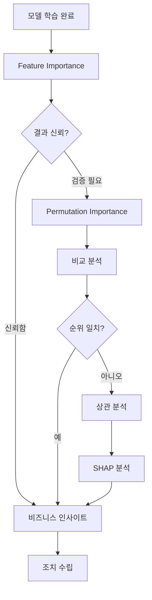
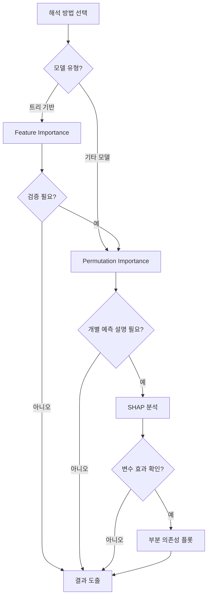

# 24차시: 모델 해석과 변수별 영향력 분석

## 학습 목표

1. **모델 해석**의 필요성과 종류를 이해함
2. **Feature Importance**를 수학적으로 이해하고 계산함
3. **Permutation Importance**를 활용하여 변수 중요도를 검증함
4. **SHAP** 개념과 부분 의존성 플롯을 활용함
5. 해석 결과를 바탕으로 **비즈니스 인사이트**를 도출함

---

## 강의 구성

| 구간 | 시간 | 내용 |
|:----:|:----:|------|
| 대주제 1 | 7분 | 모델 해석의 필요성과 수학적 기초 |
| 대주제 2 | 8분 | Feature Importance (지니 기반) |
| 대주제 3 | 7분 | Permutation Importance |
| 대주제 4 | 5분 | SHAP과 부분 의존성 플롯 |
| 정리 | 3분 | 비교 분석 및 핵심 요약 |

---

## 지난 시간 복습

- **CNN**: 이미지 처리, 합성곱, 풀링
- **RNN/LSTM**: 시계열 처리, 장기 의존성
- **고급 아키텍처**: ResNet, Transformer

**오늘**: 모델이 왜 그런 예측을 했는지 이해하기

---

# 대주제 1: 모델 해석의 필요성과 수학적 기초

## 1.1 왜 모델 해석이 필요한가?

**블랙박스 문제**:
```
입력 [온도, 압력, 속도] -> 모델 -> 예측: 불량
                          ?
```

- 왜 불량이라고 예측했는가?
- 어떤 변수가 중요했는가?
- 예측을 신뢰할 수 있는가?

---

## 1.2 모델 해석이 중요한 이유

| 관점 | 이유 |
|-----|------|
| **신뢰** | 예측 근거를 설명해야 의사결정 가능 |
| **디버깅** | 잘못된 패턴 학습 발견 |
| **개선** | 중요 변수 파악으로 데이터 수집 방향 결정 |
| **규제** | EU AI Act 등 설명 의무화 추세 |

---

## 1.3 모델 해석 워크플로우



---

## 1.4 해석 가능한 모델 vs 복잡한 모델

| 모델 | 해석 가능성 | 성능 |
|-----|-----------|------|
| 선형 회귀 | 높음 (계수) | 낮음 |
| 의사결정나무 | 높음 (규칙) | 중간 |
| RandomForest | 중간 (중요도) | 높음 |
| 신경망 | 낮음 (블랙박스) | 높음 |

**해석 방법으로 복잡한 모델도 이해 가능**

---

## 1.5 모델 해석 방법 분류

| 분류 | 방법 | 특징 |
|-----|------|------|
| **모델 내장** | Feature Importance | 트리 모델 전용 |
| **모델 무관** | Permutation Importance | 모든 모델 가능 |
| **인스턴스별** | SHAP, LIME | 개별 예측 설명 |

---

## 1.6 전역 vs 지역 해석

**전역 해석 (Global)**:
- 모델 전체에서 변수 중요도
- "온도가 가장 중요한 변수"

**지역 해석 (Local)**:
- 특정 예측에 대한 설명
- "이 샘플은 압력이 높아서 불량"

---

## 1.7 해석 방법 선택 가이드



---

## 실습 코드: 데이터셋 로드

```python
import numpy as np
import pandas as pd
import matplotlib.pyplot as plt
from sklearn.datasets import load_wine
from sklearn.ensemble import RandomForestClassifier, GradientBoostingClassifier
from sklearn.linear_model import LogisticRegression
from sklearn.model_selection import train_test_split
from sklearn.preprocessing import StandardScaler
from sklearn.inspection import permutation_importance
from sklearn.metrics import accuracy_score, classification_report

# 한글 폰트 설정
plt.rcParams['font.family'] = ['DejaVu Sans', 'sans-serif']
plt.rcParams['axes.unicode_minus'] = False

print("=" * 60)
print("[24차시] 모델 해석과 변수별 영향력 분석")
print("=" * 60)

# sklearn의 Wine 데이터셋 로드
wine = load_wine()
X = pd.DataFrame(wine.data, columns=wine.feature_names)
y = wine.target

print("\n[Wine 데이터셋 개요]")
print(f"  샘플 수: {len(X)}")
print(f"  특성 수: {X.shape[1]}")
print(f"  클래스: {list(wine.target_names)}")
print(f"  클래스 분포: {np.bincount(y)}")

print("\n[특성 목록]")
for i, name in enumerate(wine.feature_names):
    print(f"  {i+1:2d}. {name}")
```

---

# 대주제 2: Feature Importance (지니 기반)

## 2.1 Feature Importance란?

**정의**: 모델이 예측할 때 각 변수가 얼마나 기여했는가

**트리 모델에서**:
- 변수로 분할할 때 불순도 감소량
- 많이 사용되고, 불순도를 많이 줄이면 중요

---

## 2.2 Feature Importance 수학적 정의

트리 기반 모델에서 변수 j의 Feature Importance는 다음과 같이 정의됨:

$$FI_j = \sum_{t: split\ on\ j} \frac{n_t}{N} \Delta Gini_t$$

| 기호 | 의미 |
|-----|------|
| $FI_j$ | 변수 j의 Feature Importance |
| $t$ | 변수 j로 분할하는 노드 |
| $n_t$ | 노드 t에 도달하는 샘플 수 |
| $N$ | 전체 샘플 수 |
| $\Delta Gini_t$ | 노드 t에서의 지니 불순도 감소량 |

---

## 2.3 지니 불순도 감소량 계산

**지니 불순도 정의**:
$$Gini(t) = 1 - \sum_{k=1}^{K} p_{tk}^2$$

**분할 후 불순도 감소**:
$$\Delta Gini_t = Gini(t) - \frac{n_{left}}{n_t}Gini(t_{left}) - \frac{n_{right}}{n_t}Gini(t_{right})$$

---

## 2.4 Feature Importance 계산 예시

**상황**: 100개 샘플, 변수 "온도"로 분할

```
노드 t (100개 샘플)
Gini = 0.48

       온도 <= 25
      /         \
   왼쪽(60개)    오른쪽(40개)
   Gini=0.20    Gini=0.30
```

**계산**:
$$\Delta Gini = 0.48 - \frac{60}{100} \times 0.20 - \frac{40}{100} \times 0.30$$
$$\Delta Gini = 0.48 - 0.12 - 0.12 = 0.24$$

**Feature Importance 기여도**:
$$FI_{온도} += \frac{100}{N} \times 0.24$$

---

## 2.5 Mean Decrease in Impurity (MDI)

Feature Importance의 또 다른 표현:

$$MDI_j = \frac{\sum_{t \in T_j} n_t \cdot \Delta i_t}{\sum_{t \in T} n_t \cdot \Delta i_t}$$

| 기호 | 의미 |
|-----|------|
| $T_j$ | 변수 j로 분할하는 모든 노드 집합 |
| $T$ | 트리의 모든 분할 노드 집합 |
| $\Delta i_t$ | 노드 t에서의 불순도 감소 |

**특징**: 모든 변수의 MDI 합 = 1

---

## 2.6 MDI 계산 예시

**상황**: 3개 변수 (온도, 압력, 속도), 5개 분할 노드

| 노드 | 분할 변수 | 샘플 수 | 불순도 감소 | 가중 기여도 |
|-----|---------|---------|-----------|-----------|
| 1 | 온도 | 100 | 0.24 | 24.0 |
| 2 | 압력 | 60 | 0.15 | 9.0 |
| 3 | 온도 | 40 | 0.20 | 8.0 |
| 4 | 속도 | 35 | 0.10 | 3.5 |
| 5 | 압력 | 25 | 0.08 | 2.0 |

**총합**: 24.0 + 9.0 + 8.0 + 3.5 + 2.0 = 46.5

**MDI 계산**:
- 온도: (24.0 + 8.0) / 46.5 = 0.688
- 압력: (9.0 + 2.0) / 46.5 = 0.237
- 속도: 3.5 / 46.5 = 0.075

---

## 실습 코드: 데이터 분할 및 모델 학습

```python
# 데이터 분할
X_train, X_test, y_train, y_test = train_test_split(
    X, y, test_size=0.2, random_state=42, stratify=y
)

# RandomForest 학습
model = RandomForestClassifier(n_estimators=100, random_state=42)
model.fit(X_train, y_train)

# 성능 확인
train_acc = model.score(X_train, y_train)
test_acc = model.score(X_test, y_test)

print(f"\n[모델 성능]")
print(f"  학습 정확도: {train_acc:.2%}")
print(f"  테스트 정확도: {test_acc:.2%}")

# 분류 리포트
print("\n[분류 리포트]")
y_pred = model.predict(X_test)
print(classification_report(y_test, y_pred, target_names=wine.target_names))
```

---

## 2.7 Feature Importance 추출

```python
# Feature Importance 추출
feature_importance = model.feature_importances_
feature_names = wine.feature_names

# 정렬
fi_df = pd.DataFrame({
    'Feature': feature_names,
    'Importance': feature_importance
}).sort_values('Importance', ascending=False)

print("\n[Feature Importance]")
print("-" * 50)
for _, row in fi_df.iterrows():
    bar = '*' * int(row['Importance'] * 50)
    print(f"  {row['Feature']:25s}: {row['Importance']:.3f} {bar}")

print("\n[해석]")
top_features = fi_df.head(3)['Feature'].tolist()
print(f"  - 가장 중요한 특성: {top_features[0]}")
print(f"  - 상위 3개 특성이 전체 중요도의 "
      f"{fi_df.head(3)['Importance'].sum():.1%} 차지")
```

---

## 2.8 Feature Importance 바차트 시각화

```python
fig, ax = plt.subplots(figsize=(12, 8))

# 수평 막대 그래프
colors = plt.cm.Blues(np.linspace(0.4, 0.9, len(fi_df)))
bars = ax.barh(fi_df['Feature'], fi_df['Importance'], color=colors[::-1])

ax.set_xlabel('Importance', fontsize=12)
ax.set_ylabel('Feature', fontsize=12)
ax.set_title('Feature Importance - Wine Classification (RandomForest)', fontsize=14)
ax.invert_yaxis()  # 높은 순으로 위에서 아래로

# 값 표시
for i, (feature, importance) in enumerate(zip(fi_df['Feature'], fi_df['Importance'])):
    ax.text(importance + 0.005, i, f'{importance:.3f}', va='center', fontsize=10)

# 그리드 추가
ax.grid(axis='x', alpha=0.3, linestyle='--')
ax.set_xlim(0, fi_df['Importance'].max() * 1.15)

plt.tight_layout()
plt.savefig('feature_importance_wine.png', dpi=150, bbox_inches='tight')
plt.show()

print("\n[Feature Importance 바차트 저장 완료]")
print("  -> feature_importance_wine.png")
```

---

## 2.9 Feature Importance 해석

```
proline              ********************  0.180
flavanoids           ******************    0.165
color_intensity      ***************       0.140
od280/od315          **************        0.125
alcohol              ************          0.110
```

**해석**:
- proline (프롤린)이 가장 중요
- flavanoids, color_intensity가 상위 3개
- 상위 5개 특성이 전체의 약 72% 설명

---

## 2.10 Feature Importance 주의점

**한계**:
1. **상관 변수 문제**: 상관된 변수 간 중요도 분산
2. **스케일 영향**: 일부 모델에서 스케일 영향
3. **트리 모델 전용**: 다른 모델에는 적용 어려움

**해결**: Permutation Importance 사용

---

## 2.11 상관 변수 문제 예시

```
proline과 alcohol이 높은 상관 (r = 0.7)

Feature Importance:
proline: 0.18
alcohol: 0.11  <- 합쳐서 0.29인데 분산됨

실제로는 "proline" 하나로도 충분한 정보일 수 있음
```

---

# 대주제 3: Permutation Importance

## 3.1 Permutation Importance란?

**아이디어**:
변수 값을 무작위로 섞으면 예측 성능이 얼마나 떨어지는가?

**중요한 변수** -> 섞으면 성능 크게 하락
**중요하지 않은 변수** -> 섞어도 성능 유지

---

## 3.2 Permutation Importance 수학적 정의

$$PI_j = Score_{original} - \frac{1}{K}\sum_{k=1}^{K}Score_{permuted_j}^{(k)}$$

| 기호 | 의미 |
|-----|------|
| $PI_j$ | 변수 j의 Permutation Importance |
| $Score_{original}$ | 원본 데이터로 계산한 성능 점수 |
| $Score_{permuted_j}^{(k)}$ | 변수 j를 k번째 섞은 후 성능 점수 |
| $K$ | 반복 횟수 (n_repeats) |

---

## 3.3 Permutation Importance 원리

```
원본 데이터:
온도  압력  속도  -> 정확도 90%

온도 섞기 (K=3):
  k=1: 랜덤  압력  속도  -> 정확도 62%
  k=2: 랜덤  압력  속도  -> 정확도 68%
  k=3: 랜덤  압력  속도  -> 정확도 65%

평균: (62 + 68 + 65) / 3 = 65%
PI = 90% - 65% = 25%
```

---

## 3.4 Permutation Importance 계산 예시

**상황**: 3개 변수, 원본 정확도 92%

| 변수 | 섞은 후 정확도 | PI |
|-----|--------------|-----|
| proline | 68% | 92 - 68 = 24% |
| flavanoids | 75% | 92 - 75 = 17% |
| alcohol | 82% | 92 - 82 = 10% |
| ash | 91% | 92 - 91 = 1% |

**해석**: proline을 섞으면 정확도가 24% 하락 -> 가장 중요

---

## 3.5 sklearn에서 구현

```python
from sklearn.inspection import permutation_importance

# Permutation Importance 계산
result = permutation_importance(
    model, X_test, y_test,
    n_repeats=10,      # 반복 횟수
    random_state=42
)

# 결과
importances = result.importances_mean
std = result.importances_std
```

---

## 실습 코드: Permutation Importance 계산

```python
from sklearn.inspection import permutation_importance

# Permutation Importance 계산
print("\nPermutation Importance 계산 중 (n_repeats=10)...")
perm_importance = permutation_importance(
    model, X_test, y_test,
    n_repeats=10,
    random_state=42,
    n_jobs=-1
)

# 결과 정리
pi_df = pd.DataFrame({
    'Feature': feature_names,
    'Importance': perm_importance.importances_mean,
    'Std': perm_importance.importances_std
}).sort_values('Importance', ascending=False)

print("\n[Permutation Importance]")
print("-" * 60)
for _, row in pi_df.iterrows():
    bar = '*' * int(row['Importance'] * 30)
    print(f"  {row['Feature']:25s}: {row['Importance']:.3f} +/- {row['Std']:.3f} {bar}")
```

---

## 3.6 Permutation Importance 파라미터

| 파라미터 | 의미 | 권장값 |
|---------|------|--------|
| `estimator` | 학습된 모델 | - |
| `X`, `y` | 테스트 데이터 | - |
| `n_repeats` | 반복 횟수 (안정성) | 10-30 |
| `scoring` | 평가 지표 | 'accuracy', 'f1' 등 |
| `n_jobs` | 병렬 처리 수 | -1 (모든 코어) |

---

## 3.7 Permutation Importance 바차트 시각화 (에러바 포함)

```python
fig, ax = plt.subplots(figsize=(12, 8))

# 수평 막대 그래프 with 에러바
colors = plt.cm.Greens(np.linspace(0.4, 0.9, len(pi_df)))
bars = ax.barh(pi_df['Feature'], pi_df['Importance'],
               xerr=pi_df['Std'], color=colors[::-1],
               capsize=4, error_kw={'elinewidth': 1.5, 'capthick': 1.5})

ax.set_xlabel('Importance (Performance Drop)', fontsize=12)
ax.set_ylabel('Feature', fontsize=12)
ax.set_title('Permutation Importance - Wine Classification', fontsize=14)
ax.invert_yaxis()

# 값 표시
for i, (importance, std) in enumerate(zip(pi_df['Importance'], pi_df['Std'])):
    ax.text(importance + std + 0.01, i, f'{importance:.3f}', va='center', fontsize=10)

# 그리드 추가
ax.grid(axis='x', alpha=0.3, linestyle='--')
ax.axvline(x=0, color='gray', linestyle='-', linewidth=0.5)

plt.tight_layout()
plt.savefig('permutation_importance_wine.png', dpi=150, bbox_inches='tight')
plt.show()

print("\n[Permutation Importance 바차트 저장 완료]")
print("  -> permutation_importance_wine.png")
```

---

## 3.8 Feature vs Permutation Importance 비교

| 항목 | Feature Importance | Permutation Importance |
|-----|-------------------|------------------------|
| 모델 | 트리 모델만 | 모든 모델 |
| 데이터 | 학습 데이터 기반 | 테스트 데이터 기반 |
| 상관 변수 | 분산됨 | 그래도 분산됨 |
| 계산 비용 | 빠름 | 느림 (n_repeats) |
| 신뢰도 | 중간 | 높음 (표준편차 제공) |

---

## 실습 코드: Feature vs Permutation Importance 비교

```python
# 비교 테이블
comparison = pd.DataFrame({
    'Feature': feature_names,
    'Feature_Importance': feature_importance,
    'Permutation_Importance': perm_importance.importances_mean
})

# 순위 계산
comparison['FI_Rank'] = comparison['Feature_Importance'].rank(ascending=False).astype(int)
comparison['PI_Rank'] = comparison['Permutation_Importance'].rank(ascending=False).astype(int)
comparison['Rank_Diff'] = abs(comparison['FI_Rank'] - comparison['PI_Rank'])

comparison = comparison.sort_values('Feature_Importance', ascending=False)

print("\n[비교 테이블]")
print("-" * 85)
print(f"{'Feature':25s} | {'FI':8s} | {'PI':8s} | FI순위 | PI순위 | 차이")
print("-" * 85)
for _, row in comparison.iterrows():
    print(f"{row['Feature']:25s} | {row['Feature_Importance']:.3f}    | "
          f"{row['Permutation_Importance']:.3f}    | "
          f"{int(row['FI_Rank']):6d} | {int(row['PI_Rank']):6d} | {int(row['Rank_Diff']):4d}")

print("\n[해석]")
rank_diff_sum = comparison['Rank_Diff'].sum()
if rank_diff_sum <= 10:
    print("  -> 두 방법의 순위가 비교적 일치 - 결과 신뢰도 높음")
else:
    print("  -> 순위 차이 존재 - 상관 변수 확인 필요")
```

---

## 3.9 두 방법 비교 시각화

```python
fig, axes = plt.subplots(1, 2, figsize=(16, 8))

# Feature Importance
fi_sorted = fi_df.sort_values('Importance', ascending=True)
axes[0].barh(fi_sorted['Feature'], fi_sorted['Importance'], color='steelblue')
axes[0].set_title('Feature Importance (MDI)', fontsize=14)
axes[0].set_xlabel('Importance')
axes[0].set_ylabel('Feature')
axes[0].grid(axis='x', alpha=0.3)

# 값 표시
for i, (feature, importance) in enumerate(zip(fi_sorted['Feature'], fi_sorted['Importance'])):
    axes[0].text(importance + 0.002, i, f'{importance:.3f}', va='center', fontsize=9)

# Permutation Importance
pi_sorted = pi_df.sort_values('Importance', ascending=True)
axes[1].barh(pi_sorted['Feature'], pi_sorted['Importance'],
             xerr=pi_sorted['Std'], color='seagreen', capsize=3)
axes[1].set_title('Permutation Importance', fontsize=14)
axes[1].set_xlabel('Importance (with error bars)')
axes[1].set_ylabel('Feature')
axes[1].grid(axis='x', alpha=0.3)

# 값 표시
for i, (importance, std) in enumerate(zip(pi_sorted['Importance'], pi_sorted['Std'])):
    axes[1].text(importance + std + 0.005, i, f'{importance:.3f}', va='center', fontsize=9)

plt.suptitle('Feature Importance vs Permutation Importance Comparison', fontsize=16, y=1.02)
plt.tight_layout()
plt.savefig('importance_comparison_wine.png', dpi=150, bbox_inches='tight')
plt.show()

print("\n[두 방법 비교 시각화 저장 완료]")
print("  -> importance_comparison_wine.png")
```

---

## 3.10 상관 분석

```python
# 상관 행렬
corr_matrix = X.corr()

# 높은 상관관계 찾기 (|r| > 0.7)
print("\n[높은 상관관계 (|r| > 0.7)]")
high_corr_pairs = []
for i in range(len(feature_names)):
    for j in range(i+1, len(feature_names)):
        r = corr_matrix.iloc[i, j]
        if abs(r) > 0.7:
            print(f"  {feature_names[i]} - {feature_names[j]}: {r:.2f}")
            high_corr_pairs.append((feature_names[i], feature_names[j], r))

if not high_corr_pairs:
    print("  -> 높은 상관관계 없음")
else:
    print(f"\n  총 {len(high_corr_pairs)}개의 높은 상관관계 발견")
```

---

## 3.11 상관 행렬 히트맵 시각화

```python
fig, ax = plt.subplots(figsize=(14, 12))

# 히트맵 그리기
im = ax.imshow(corr_matrix, cmap='RdBu_r', vmin=-1, vmax=1, aspect='auto')

# 축 설정
ax.set_xticks(range(len(feature_names)))
ax.set_yticks(range(len(feature_names)))
ax.set_xticklabels(feature_names, rotation=45, ha='right', fontsize=10)
ax.set_yticklabels(feature_names, fontsize=10)

# 컬러바
cbar = plt.colorbar(im, ax=ax, label='Correlation', shrink=0.8)
cbar.ax.tick_params(labelsize=10)

# 상관계수 값 표시 (절대값 0.5 이상만)
for i in range(len(feature_names)):
    for j in range(len(feature_names)):
        value = corr_matrix.iloc[i, j]
        if abs(value) >= 0.5:
            color = 'white' if abs(value) > 0.7 else 'black'
            ax.text(j, i, f'{value:.2f}', ha='center', va='center',
                   color=color, fontsize=8)

ax.set_title('Feature Correlation Matrix - Wine Dataset', fontsize=14, pad=20)

plt.tight_layout()
plt.savefig('correlation_matrix_wine.png', dpi=150, bbox_inches='tight')
plt.show()

print("\n[상관 행렬 히트맵 저장 완료]")
print("  -> correlation_matrix_wine.png")
```

---

## 3.12 다른 모델과 비교

```python
from sklearn.ensemble import GradientBoostingClassifier

# GradientBoosting
gb_model = GradientBoostingClassifier(n_estimators=100, random_state=42)
gb_model.fit(X_train, y_train)

gb_fi = gb_model.feature_importances_
gb_pi = permutation_importance(gb_model, X_test, y_test, n_repeats=10, random_state=42)

print("\n[GradientBoosting Feature Importance - Top 5]")
gb_fi_sorted = sorted(zip(feature_names, gb_fi), key=lambda x: -x[1])[:5]
for feature, fi in gb_fi_sorted:
    print(f"  {feature:25s}: {fi:.3f}")

print("\n[모델 간 중요도 비교 - Top 5]")
model_comparison = pd.DataFrame({
    'Feature': feature_names,
    'RF_FI': feature_importance,
    'GB_FI': gb_fi,
    'RF_PI': perm_importance.importances_mean,
    'GB_PI': gb_pi.importances_mean
})
model_comparison = model_comparison.nlargest(5, 'RF_FI')
print(model_comparison.to_string(index=False))
```

---

# 대주제 4: SHAP과 부분 의존성 플롯

## 4.1 SHAP 개념 (Shapley Value)

**SHAP (SHapley Additive exPlanations)**:
- 게임 이론 기반 해석 방법
- 개별 예측에 대한 변수 기여도
- 전역 + 지역 해석 모두 가능

---

## 4.2 SHAP 수학적 정의

Shapley value는 다음과 같이 정의됨:

$$\phi_j = \sum_{S \subseteq F \setminus \{j\}} \frac{|S|!(|F|-|S|-1)!}{|F|!}[f(S \cup \{j\}) - f(S)]$$

| 기호 | 의미 |
|-----|------|
| $\phi_j$ | 변수 j의 SHAP value |
| $F$ | 전체 변수 집합 |
| $S$ | 변수 j를 제외한 변수들의 부분집합 |
| $f(S)$ | 집합 S의 변수만 사용했을 때 예측값 |
| $\|S\|!$ | S의 크기의 팩토리얼 |

---

## 4.3 SHAP 계산 예시

**상황**: 3개 변수 (A, B, C), 변수 B의 SHAP 계산

가능한 모든 조합:
1. {} -> {B}: f({B}) - f({}) = 0.3 - 0.0 = 0.3
2. {A} -> {A,B}: f({A,B}) - f({A}) = 0.6 - 0.4 = 0.2
3. {C} -> {B,C}: f({B,C}) - f({C}) = 0.5 - 0.2 = 0.3
4. {A,C} -> {A,B,C}: f({A,B,C}) - f({A,C}) = 0.85 - 0.55 = 0.3

**가중 평균 계산**:
$$\phi_B = \frac{1}{6}[(2 \times 0.3) + (1 \times 0.2) + (1 \times 0.3) + (2 \times 0.3)]$$
$$\phi_B = \frac{1}{6}[0.6 + 0.2 + 0.3 + 0.6] = \frac{1.7}{6} \approx 0.283$$

---

## 4.4 SHAP의 특성

**Shapley value의 공리**:
1. **효율성**: 모든 SHAP value 합 = 예측값 - 기본값
2. **대칭성**: 동등한 기여를 하는 변수는 같은 SHAP value
3. **더미**: 기여하지 않는 변수의 SHAP value = 0
4. **가법성**: 여러 모델의 SHAP value 합 = 합친 모델의 SHAP value

---

## 4.5 SHAP 사용 코드 (참고)

```python
# SHAP 라이브러리 필요 (pip install shap)
import shap

# TreeExplainer 생성
explainer = shap.TreeExplainer(model)

# SHAP values 계산
shap_values = explainer.shap_values(X_test)

# Summary plot (전역 해석)
shap.summary_plot(shap_values, X_test)

# 개별 샘플 해석 (지역 해석)
shap.force_plot(explainer.expected_value[0],
                shap_values[0][0], X_test.iloc[0])
```

---

## 4.6 SHAP 해석 예시

```
샘플 1 예측: class_0 (확률 0.85)

변수별 기여도:
proline (+0.25)       <- 높은 값이 class_0 방향
flavanoids (+0.18)    <- 높은 값이 class_0 방향
color_intensity (-0.08) <- 낮은 값이 class_0 반대 방향
alcohol (+0.12)       <- 높은 값이 class_0 방향
```

**왜 이 샘플이 class_0인지** 구체적 설명

---

## 4.7 부분 의존성 플롯 (Partial Dependence Plot)

**정의**: 특정 변수가 변할 때 예측 확률이 어떻게 변하는지 시각화

**계산**:
$$PD_j(x_j) = \frac{1}{n} \sum_{i=1}^{n} f(x_j, x_{i,-j})$$

- 변수 j를 특정 값으로 고정
- 나머지 변수는 원래 값 사용
- 모든 샘플에 대해 예측 평균

---

## 4.8 부분 의존성 플롯 시각화

```python
# 가장 중요한 변수의 부분 의존성
top_feature = fi_df.iloc[0]['Feature']
print(f"\n'{top_feature}'의 부분 의존성 분석:")

# 값 범위에 따른 예측 확률
feature_values = np.linspace(X[top_feature].min(), X[top_feature].max(), 30)
X_temp = X_test.copy()
predictions_per_class = []

for val in feature_values:
    X_temp[top_feature] = val
    pred_proba = model.predict_proba(X_temp).mean(axis=0)
    predictions_per_class.append(pred_proba)

predictions_per_class = np.array(predictions_per_class)

# 값 변화에 따른 예측 확률 출력
print(f"\n  {top_feature} 값 변화에 따른 클래스별 예측 확률:")
sample_indices = [0, 7, 14, 21, 29]
for idx in sample_indices:
    probs = predictions_per_class[idx]
    print(f"    값 {feature_values[idx]:8.1f}: "
          f"class_0={probs[0]:.3f}, class_1={probs[1]:.3f}, class_2={probs[2]:.3f}")

# 시각화
fig, ax = plt.subplots(figsize=(12, 7))
colors = ['#1f77b4', '#ff7f0e', '#2ca02c']
for i, class_name in enumerate(wine.target_names):
    ax.plot(feature_values, predictions_per_class[:, i],
            label=class_name, linewidth=2.5, color=colors[i])

ax.set_xlabel(top_feature, fontsize=12)
ax.set_ylabel('Predicted Probability', fontsize=12)
ax.set_title(f'Partial Dependence Plot: {top_feature}', fontsize=14)
ax.legend(loc='best', fontsize=11)
ax.grid(True, alpha=0.3, linestyle='--')

# 데이터 분포 표시 (rug plot)
for i, class_idx in enumerate([0, 1, 2]):
    class_values = X[y == class_idx][top_feature]
    ax.scatter(class_values, [-0.03 - i*0.02]*len(class_values),
               alpha=0.3, s=10, color=colors[i], marker='|')

ax.set_ylim(-0.1, 1.05)

plt.tight_layout()
plt.savefig('partial_dependence_wine.png', dpi=150, bbox_inches='tight')
plt.show()

print("\n[부분 의존성 플롯 저장 완료]")
print("  -> partial_dependence_wine.png")
```

---

## 4.9 sklearn의 PartialDependenceDisplay 활용

```python
from sklearn.inspection import PartialDependenceDisplay

# 상위 4개 중요 변수
top_4_features = fi_df.head(4)['Feature'].tolist()
top_4_indices = [list(feature_names).index(f) for f in top_4_features]

# 부분 의존성 플롯
fig, axes = plt.subplots(2, 2, figsize=(14, 10))

for idx, (feature_idx, feature_name) in enumerate(zip(top_4_indices, top_4_features)):
    ax = axes[idx // 2, idx % 2]

    # 각 클래스에 대한 PDP
    for class_idx in range(3):
        PartialDependenceDisplay.from_estimator(
            model, X_train, [feature_idx],
            target=class_idx,
            ax=ax,
            line_kw={'label': wine.target_names[class_idx], 'linewidth': 2}
        )

    ax.set_title(f'Partial Dependence: {feature_name}', fontsize=12)
    ax.legend(loc='best')
    ax.grid(True, alpha=0.3)

plt.suptitle('Partial Dependence Plots - Top 4 Features', fontsize=14, y=1.02)
plt.tight_layout()
plt.savefig('partial_dependence_top4.png', dpi=150, bbox_inches='tight')
plt.show()
```

---

## 4.10 2D 부분 의존성 플롯

```python
# 상위 2개 변수 조합
top_2_features = fi_df.head(2)['Feature'].tolist()
top_2_indices = [list(feature_names).index(f) for f in top_2_features]

fig, axes = plt.subplots(1, 3, figsize=(18, 5))

for class_idx in range(3):
    ax = axes[class_idx]

    # 2D PDP
    PartialDependenceDisplay.from_estimator(
        model, X_train, [tuple(top_2_indices)],
        target=class_idx,
        ax=ax,
        kind='both'  # contour + individual lines
    )

    ax.set_title(f'2D PDP: {wine.target_names[class_idx]}', fontsize=12)

plt.suptitle(f'2D Partial Dependence: {top_2_features[0]} vs {top_2_features[1]}',
             fontsize=14, y=1.02)
plt.tight_layout()
plt.savefig('partial_dependence_2d.png', dpi=150, bbox_inches='tight')
plt.show()
```

---

# 핵심 정리

## 오늘 배운 내용

1. **모델 해석의 필요성**
   - 신뢰, 디버깅, 개선, 규제 대응
   - 블랙박스 -> 설명 가능한 AI

2. **Feature Importance (MDI)**
   - 트리 모델 내장 기능
   - 빠르지만 상관 변수 문제 있음
   - 수식: $FI_j = \sum_{t: split\ on\ j} \frac{n_t}{N} \Delta Gini_t$

3. **Permutation Importance**
   - 모든 모델에 적용 가능
   - 테스트 데이터 기반, 신뢰도 높음
   - 수식: $PI_j = Score_{original} - \frac{1}{K}\sum_{k=1}^{K}Score_{permuted_j}^{(k)}$

4. **SHAP**
   - 게임 이론 기반, 공정한 기여도 분배
   - 전역 + 지역 해석 모두 가능
   - 수식: $\phi_j = \sum_{S \subseteq F \setminus \{j\}} \frac{|S|!(|F|-|S|-1)!}{|F|!}[f(S \cup \{j\}) - f(S)]$

---

## 핵심 코드

```python
# Feature Importance (트리 모델)
model.feature_importances_

# Permutation Importance (모든 모델)
from sklearn.inspection import permutation_importance
result = permutation_importance(model, X_test, y_test, n_repeats=10)
result.importances_mean
result.importances_std

# 부분 의존성 플롯
from sklearn.inspection import PartialDependenceDisplay
PartialDependenceDisplay.from_estimator(model, X, [feature_idx])

# SHAP (별도 설치 필요)
import shap
explainer = shap.TreeExplainer(model)
shap_values = explainer.shap_values(X_test)
```

---

## 수식 요약 표

| 방법 | 수식 | 특징 |
|-----|------|------|
| Feature Importance | $FI_j = \sum_{t} \frac{n_t}{N} \Delta Gini_t$ | 트리 모델 전용, 빠름 |
| MDI | $MDI_j = \frac{\sum_{t \in T_j} n_t \cdot \Delta i_t}{\sum_{t \in T} n_t \cdot \Delta i_t}$ | 정규화된 버전, 합=1 |
| Permutation Importance | $PI_j = Score_{orig} - \frac{1}{K}\sum Score_{perm}$ | 모델 무관, 표준편차 제공 |
| SHAP | $\phi_j = \sum_{S} w(S)[f(S \cup j) - f(S)]$ | 게임 이론, 공정한 분배 |

---

## 비즈니스 인사이트 도출

```python
# 상위 중요 변수 추출
top_features = fi_df.head(3)['Feature'].tolist()
low_features = fi_df.tail(3)['Feature'].tolist()

print("\n[분석 결과]")
print("-" * 50)
print(f"  가장 중요한 특성 Top 3: {top_features}")
print(f"  상대적으로 덜 중요한 특성: {low_features}")

print("\n[Wine Classification 맥락에서의 해석]")
print("-" * 50)

# 주요 특성에 대한 해석
interpretations = {
    'proline': '프롤린(아미노산) - 와인 품종별 특성 반영',
    'flavanoids': '플라보노이드 - 와인의 색과 맛에 영향',
    'color_intensity': '색 강도 - 품종 구분에 중요',
    'od280/od315_of_diluted_wines': '희석된 와인의 흡광도 비율',
    'alcohol': '알코올 함량 - 와인 특성의 기본 지표',
    'hue': '색조 - 와인의 숙성도 반영',
    'total_phenols': '총 페놀 - 항산화 특성 지표'
}

for i, (_, row) in enumerate(fi_df.iterrows()):
    feature = row['Feature']
    importance = row['Importance']
    if importance > 0.08:
        interpretation = interpretations.get(feature, '품종 분류에 기여')
        print(f"  {feature}:")
        print(f"    - 중요도: {importance:.3f}")
        print(f"    - 해석: {interpretation}")
```

---

## 제조업 활용 시나리오

**분석 결과** (가상):
- 온도가 가장 중요 (25%)
- 압력이 두 번째 (18%)
- 속도가 세 번째 (12%)

**조치**:
1. 온도 모니터링 주기 단축
2. 온도 이상 시 즉시 알림 설정
3. 압력 센서 교정 주기 확인
4. 불필요한 습도 센서 비용 절감 검토
5. 신규 설비 도입 시 온도/압력 중심 설계

---

## 체크리스트

- [ ] Feature Importance 추출 및 수식 이해
- [ ] Permutation Importance 계산 및 에러바 확인
- [ ] 두 방법 결과 비교 및 순위 검증
- [ ] 상관 행렬 분석으로 변수 관계 파악
- [ ] 중요 변수 시각화 (바차트, 히트맵)
- [ ] 부분 의존성 플롯으로 변수 효과 확인
- [ ] SHAP 개념 이해 (선택)
- [ ] 비즈니스 인사이트 도출

---

## 시각화 요약

| 시각화 | 파일명 | 목적 |
|-------|-------|------|
| Feature Importance 바차트 | feature_importance_wine.png | 변수별 MDI 기반 중요도 |
| Permutation Importance 바차트 | permutation_importance_wine.png | 성능 하락 기반 중요도 (에러바) |
| 두 방법 비교 | importance_comparison_wine.png | FI vs PI 순위 비교 |
| 상관 행렬 히트맵 | correlation_matrix_wine.png | 변수 간 상관관계 |
| 부분 의존성 플롯 | partial_dependence_wine.png | 변수값에 따른 예측 변화 |

---

## 사용한 데이터셋

- **sklearn.datasets.load_wine**
  - 178개 샘플, 13개 특성, 3개 클래스
  - 와인 품종 분류 (class_0, class_1, class_2)
  - 이탈리아 동일 지역의 세 가지 품종 와인
  - 화학적 분석 결과로 품종 구분

---

## 다음 차시 예고

### [25차시] 모델 저장과 실무 배포 준비

- joblib으로 모델 저장/로드
- Pipeline 구성
- 배포 체크리스트
- 버전 관리 및 재현성 확보

---

## 추가 실습: 전체 워크플로우

```python
# 전체 워크플로우 간략 버전
from sklearn.datasets import load_wine
from sklearn.ensemble import RandomForestClassifier
from sklearn.model_selection import train_test_split
from sklearn.inspection import permutation_importance
import pandas as pd

# 데이터 로드 및 분할
wine = load_wine()
X = pd.DataFrame(wine.data, columns=wine.feature_names)
y = wine.target
X_train, X_test, y_train, y_test = train_test_split(X, y, test_size=0.2, random_state=42)

# 모델 학습
model = RandomForestClassifier(n_estimators=100, random_state=42)
model.fit(X_train, y_train)
print(f"테스트 정확도: {model.score(X_test, y_test):.2%}")

# Feature Importance
fi_df = pd.DataFrame({
    'Feature': wine.feature_names,
    'FI': model.feature_importances_
}).sort_values('FI', ascending=False)

# Permutation Importance
perm = permutation_importance(model, X_test, y_test, n_repeats=10, random_state=42)
fi_df['PI'] = [perm.importances_mean[list(wine.feature_names).index(f)] for f in fi_df['Feature']]

# 결과 출력
print("\n[Top 5 Features]")
print(fi_df.head(5).to_string(index=False))
```

---

## 마무리

오늘 학습한 내용:

1. **모델 해석**이 왜 중요한지 이해함
2. **Feature Importance**의 수학적 원리와 계산법 학습
3. **Permutation Importance**로 모델 무관하게 변수 중요도 측정
4. **SHAP**의 게임 이론 기반 접근법 이해
5. **부분 의존성 플롯**으로 변수 효과 시각화

다음 차시에는 학습한 모델을 저장하고 실무에 배포하는 방법을 학습함.
