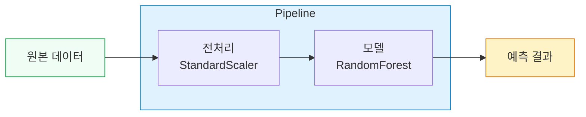
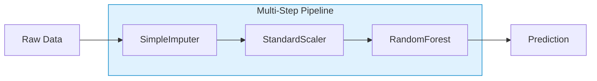

# 25차시: 모델 저장과 실무 배포 준비

---

## 학습 목표

| 번호 | 학습 목표 |
|:----:|----------|
| 1 | joblib으로 모델을 저장하고 로드하는 방법을 이해함 |
| 2 | Pipeline으로 전처리와 모델을 통합하여 관리함 |
| 3 | 실무 배포를 위한 체크리스트를 작성하고 활용함 |

---

## 수학적 배경

### 직렬화와 역직렬화 개념

모델 저장의 핵심은 **직렬화(Serialization)**임. 메모리에 있는 객체를 파일로 저장 가능한 바이트 스트림으로 변환하는 과정임.

**직렬화 (객체를 바이트로 변환)**:

$$Serialize: Object \rightarrow ByteStream$$

**역직렬화 (바이트를 객체로 복원)**:

$$Deserialize: ByteStream \rightarrow Object$$

### 압축률 계산

모델 파일의 압축 효율을 측정하는 공식:

$$CompressionRatio = \frac{OriginalSize - CompressedSize}{OriginalSize} \times 100\%$$

예시:
- 원본 크기: 1000 KB, 압축 후: 300 KB
- 압축률: $\frac{1000 - 300}{1000} \times 100\% = 70\%$

### 배치 예측 처리량

모델 배포 시 성능 측정을 위한 처리량(Throughput) 계산:

$$Throughput = \frac{BatchSize}{PredictionTime}\ (samples/second)$$

예시: 배치 크기 100개, 예측 시간 0.05초 -> 처리량: $2000$ samples/second

### Pipeline 데이터 흐름

Pipeline에서 데이터가 각 단계를 거치는 과정:

$$X_{output} = Model(Scaler(Imputer(X_{input})))$$

---

## 실습 데이터: Breast Cancer 데이터셋

sklearn에서 제공하는 유방암 진단 데이터셋을 활용함

### 데이터 특성

| 항목 | 내용 |
|------|------|
| 샘플 수 | 569개 |
| 특성 수 | 30개 |
| 클래스 | 악성(malignant: 0), 양성(benign: 1) |
| 출처 | UCI ML Repository |

### 특성 구성

| 특성 종류 | 설명 | 예시 |
|----------|------|------|
| mean | 평균값 | mean radius, mean texture |
| se | 표준오차 | radius error, texture error |
| worst | 최악값 | worst radius, worst texture |

총 10개 기본 특성 x 3개 통계량 = 30개 특성

---

## Part 1: joblib으로 모델 저장과 로드

### 1.1 왜 모델을 저장해야 하는가?

학습에는 시간이 오래 걸리지만, 예측은 빠름

```
학습: 10분 ~ 수시간 (데이터 로드 -> 전처리 -> 학습 -> 튜닝)
예측: 0.01초 ~ 1초
```

모델 저장의 이점:
- 매번 학습하는 시간 낭비를 방지함
- 학습된 모델을 파일로 저장하여 재사용함
- 다른 환경에서 동일한 모델 사용이 가능함
- API 서버에서 로드만 하면 즉시 예측 가능함

---

### 1.2 모델 저장 방법 비교

| 방법 | 장점 | 단점 | 권장 상황 |
|-----|------|------|----------|
| **joblib** | 대용량 배열 효율적, sklearn 권장 | Python 전용 | sklearn 모델 |
| **pickle** | Python 표준 라이브러리 | 대용량 비효율 | 소규모 객체 |
| **ONNX** | 언어 중립, 배포 최적화 | 변환 필요 | 프로덕션 배포 |

sklearn 모델은 joblib 사용을 권장함

---

### 1.3 실습 환경 설정

```python
import numpy as np
import pandas as pd
import matplotlib.pyplot as plt
import os
import json
import time
from datetime import datetime

# sklearn imports
from sklearn.datasets import load_breast_cancer
from sklearn.ensemble import RandomForestClassifier
from sklearn.preprocessing import StandardScaler
from sklearn.model_selection import train_test_split
from sklearn.pipeline import Pipeline, make_pipeline
from sklearn.impute import SimpleImputer
from sklearn.metrics import accuracy_score, classification_report
import sklearn
import joblib

# 한글 폰트 설정
plt.rcParams['font.family'] = ['DejaVu Sans', 'sans-serif']
plt.rcParams['axes.unicode_minus'] = False

print("=" * 60)
print("[25차시] 모델 저장과 실무 배포 준비")
print("=" * 60)
```

---

### 1.4 데이터 로드 및 분할

```python
# sklearn의 유방암 진단 데이터셋 로드
cancer = load_breast_cancer()
X = pd.DataFrame(cancer.data, columns=cancer.feature_names)
y = cancer.target

print("[Breast Cancer 데이터셋 개요]")
print(f"  샘플 수: {len(X)}")
print(f"  특성 수: {X.shape[1]}")
print(f"  클래스: {list(cancer.target_names)} (0=악성, 1=양성)")
print(f"  클래스 분포: 악성={np.sum(y==0)}, 양성={np.sum(y==1)}")

# 특성 목록
feature_cols = list(cancer.feature_names)
```

---

```python
# 데이터 분할
X_train, X_test, y_train, y_test = train_test_split(
    X, y, test_size=0.2, random_state=42, stratify=y
)

print(f"학습 데이터: {len(X_train)}")
print(f"테스트 데이터: {len(X_test)}")
print(f"양성 비율 (학습): {y_train.mean():.1%}")
print(f"양성 비율 (테스트): {y_test.mean():.1%}")
```

stratify=y 옵션으로 클래스 비율을 유지하여 분할함

---

### 1.5 기본 모델 학습 (Pipeline 없이)

```python
# 전처리와 모델을 따로 관리
scaler = StandardScaler()
X_train_scaled = scaler.fit_transform(X_train)
X_test_scaled = scaler.transform(X_test)

model = RandomForestClassifier(n_estimators=100, random_state=42)
model.fit(X_train_scaled, y_train)

train_acc = model.score(X_train_scaled, y_train)
test_acc = model.score(X_test_scaled, y_test)

print(f"학습 정확도: {train_acc:.2%}")
print(f"테스트 정확도: {test_acc:.2%}")
```

**문제점**: scaler와 model을 따로 저장하고 관리해야 함

---

### 1.6 모델 저장하기 (joblib.dump)

```python
# 저장 디렉토리 생성
MODEL_DIR = './models/'
os.makedirs(MODEL_DIR, exist_ok=True)

# 모델 저장
model_path = os.path.join(MODEL_DIR, 'cancer_model.pkl')
scaler_path = os.path.join(MODEL_DIR, 'cancer_scaler.pkl')

joblib.dump(model, model_path)
joblib.dump(scaler, scaler_path)

print(f"모델 저장: {model_path}")
print(f"스케일러 저장: {scaler_path}")

# 파일 크기 확인
model_size = os.path.getsize(model_path)
scaler_size = os.path.getsize(scaler_path)
print(f"모델 크기: {model_size/1024:.1f} KB")
print(f"스케일러 크기: {scaler_size/1024:.1f} KB")
```

---

### 1.7 압축 저장

```python
# 압축 저장 (compress 옵션 사용)
compressed_path = os.path.join(MODEL_DIR, 'cancer_model_compressed.pkl.gz')
joblib.dump(model, compressed_path, compress=3)

compressed_size = os.path.getsize(compressed_path)

# 압축률 계산
compression_ratio = (1 - compressed_size/model_size) * 100

print(f"압축 전: {model_size/1024:.1f} KB")
print(f"압축 후: {compressed_size/1024:.1f} KB")
print(f"압축률: {compression_ratio:.1f}%")
```

#### 압축 옵션 비교

| 레벨 | 특징 | 용도 |
|------|------|------|
| 0 | 압축 없음 (빠름) | 빠른 저장/로드 필요 시 |
| 3 | 균형 (권장) | 대부분의 경우 |
| 9 | 최대 압축 (느림) | 저장 공간 제한 시 |

---

### 1.8 모델 로드하기 (joblib.load)

```python
# 모델 로드
loaded_model = joblib.load(model_path)
loaded_scaler = joblib.load(scaler_path)

# 로드 후 예측 검증
X_test_scaled_loaded = loaded_scaler.transform(X_test)
loaded_acc = loaded_model.score(X_test_scaled_loaded, y_test)

print(f"로드 후 정확도: {loaded_acc:.2%}")
print(f"원본과 동일: {loaded_acc == test_acc}")
```

학습 없이 바로 예측 가능함

---

### 1.9 저장 시 주의사항

#### 버전 호환성

```python
import sklearn

metadata = {
    'sklearn_version': sklearn.__version__,
    'python_version': '3.9',
    'created_at': datetime.now().isoformat(),
    'model_type': 'RandomForestClassifier'
}

# 메타데이터와 함께 저장
model_bundle = {'model': model, 'metadata': metadata}
joblib.dump(model_bundle, os.path.join(MODEL_DIR, 'model_with_meta.pkl'))

print("메타데이터 포함 저장 완료")
```

저장 시 버전을 함께 기록해야 로드 시 호환성 문제를 방지함

#### 보안 주의

```python
# 주의: pickle/joblib은 임의 코드 실행이 가능함
# 신뢰할 수 없는 파일 로드 금지!
# 안전한 방법: 출처가 확인된 파일만 로드
```

---

## Part 2: Pipeline 구성과 활용

### 2.1 왜 Pipeline이 필요한가?

#### 문제 상황

```python
# 학습 시
scaler.fit_transform(X_train)
model.fit(X_train_scaled, y_train)

# 배포 시 (문제 발생!)
X_new_scaled = scaler.transform(X_new)  # scaler도 저장해야 함!
prediction = model.predict(X_new_scaled)
```

전처리 객체를 따로 관리해야 하는 번거로움이 발생함

---

### 2.2 Pipeline이란?

전처리 + 모델을 하나로 묶은 객체임



Pipeline 장점:
- 한 번에 저장/로드 가능
- 데이터 누수 방지
- 코드 간결화
- 일관된 전처리 보장

---

### 2.3 Pipeline 기본 구조

```python
from sklearn.pipeline import Pipeline
from sklearn.preprocessing import StandardScaler
from sklearn.ensemble import RandomForestClassifier

# Pipeline 구성
pipeline = Pipeline([
    ('scaler', StandardScaler()),       # 1단계: 스케일링
    ('model', RandomForestClassifier(n_estimators=100, random_state=42))  # 2단계: 모델
])

# 학습 (자동으로 순서대로 처리)
pipeline.fit(X_train, y_train)

# 예측 (자동으로 스케일링 후 예측)
train_acc_pipe = pipeline.score(X_train, y_train)
test_acc_pipe = pipeline.score(X_test, y_test)

print(f"학습 정확도: {train_acc_pipe:.2%}")
print(f"테스트 정확도: {test_acc_pipe:.2%}")
```

---

### 2.4 Pipeline 구조 시각화

```python
# Pipeline 구조 시각화
fig, ax = plt.subplots(figsize=(12, 4))

# 박스 좌표
boxes = [
    {'x': 0.1, 'y': 0.3, 'w': 0.15, 'h': 0.4, 'label': 'Input\nData', 'color': '#d1fae5'},
    {'x': 0.3, 'y': 0.3, 'w': 0.15, 'h': 0.4, 'label': 'StandardScaler\n(Step 1)', 'color': '#bfdbfe'},
    {'x': 0.5, 'y': 0.3, 'w': 0.15, 'h': 0.4, 'label': 'RandomForest\n(Step 2)', 'color': '#bfdbfe'},
    {'x': 0.7, 'y': 0.3, 'w': 0.15, 'h': 0.4, 'label': 'Prediction', 'color': '#fef3c7'}
]

for box in boxes:
    rect = plt.Rectangle((box['x'], box['y']), box['w'], box['h'],
                         facecolor=box['color'], edgecolor='#374151', linewidth=2)
    ax.add_patch(rect)
    ax.text(box['x'] + box['w']/2, box['y'] + box['h']/2, box['label'],
           ha='center', va='center', fontsize=10, fontweight='bold')

# 화살표
for i in range(3):
    ax.annotate('', xy=(boxes[i+1]['x'], 0.5),
               xytext=(boxes[i]['x'] + boxes[i]['w'], 0.5),
               arrowprops=dict(arrowstyle='->', color='#374151', lw=2))

ax.set_xlim(0, 1)
ax.set_ylim(0, 1)
ax.axis('off')
ax.set_title('Pipeline Structure: Data Flow', fontsize=14, fontweight='bold')
plt.tight_layout()
plt.savefig(os.path.join(MODEL_DIR, 'pipeline_structure.png'), dpi=150)
plt.show()
```

---

### 2.5 Pipeline 저장/로드

```python
# 저장
pipeline_path = os.path.join(MODEL_DIR, 'cancer_pipeline.pkl')
joblib.dump(pipeline, pipeline_path)
print(f"Pipeline 저장: {pipeline_path}")

pipeline_size = os.path.getsize(pipeline_path)
print(f"파일 크기: {pipeline_size/1024:.1f} KB")

# 로드
loaded_pipeline = joblib.load(pipeline_path)

# 검증
loaded_pipe_acc = loaded_pipeline.score(X_test, y_test)
print(f"로드 후 정확도: {loaded_pipe_acc:.2%}")
```

전처리 객체를 따로 관리할 필요가 없음

---

### 2.6 새 데이터 예측

```python
# 새 데이터 예측
print("새 데이터 예측:")
new_data = X_test.iloc[:5].copy()

predictions = loaded_pipeline.predict(new_data)
probabilities = loaded_pipeline.predict_proba(new_data)

print(f"\n{'샘플':<8} {'예측':<10} {'실제':<10} {'양성확률':<10} {'일치':<6}")
print("-" * 50)

for i, (pred, prob) in enumerate(zip(predictions, probabilities)):
    actual = y_test.iloc[i]
    diagnosis = cancer.target_names[pred]
    actual_name = cancer.target_names[actual]
    match = "O" if pred == actual else "X"
    print(f"{i+1:<8} {diagnosis:<10} {actual_name:<10} {prob[1]:.1%}      {match}")
```

predict()만 호출하면 전처리가 자동으로 적용됨

---

### 2.7 다단계 Pipeline

```python
from sklearn.impute import SimpleImputer

# 결측치 처리 + 정규화 + 모델
multi_pipeline = Pipeline([
    ('imputer', SimpleImputer(strategy='median')),  # 1단계: 결측치 처리
    ('scaler', StandardScaler()),                    # 2단계: 정규화
    ('model', RandomForestClassifier(n_estimators=100, random_state=42))  # 3단계: 모델
])

multi_pipeline.fit(X_train, y_train)
print(f"다단계 Pipeline 정확도: {multi_pipeline.score(X_test, y_test):.2%}")
print(f"단계: {list(multi_pipeline.named_steps.keys())}")
```



---

### 2.8 메타데이터와 함께 저장

```python
import sklearn

# 메타데이터 생성
metadata = {
    'model_name': 'Breast Cancer Diagnosis Model',
    'version': 'v1.0.0',
    'created_at': datetime.now().isoformat(),
    'sklearn_version': sklearn.__version__,
    'features': feature_cols,
    'n_features': len(feature_cols),
    'target_names': list(cancer.target_names),
    'train_accuracy': float(train_acc_pipe),
    'test_accuracy': float(test_acc_pipe),
    'dataset': 'sklearn.datasets.load_breast_cancer'
}

# 모델 번들 저장
model_bundle = {
    'pipeline': pipeline,
    'metadata': metadata
}

bundle_path = os.path.join(MODEL_DIR, 'cancer_model_bundle.pkl')
joblib.dump(model_bundle, bundle_path)
print(f"모델 번들 저장: {bundle_path}")

# 메타데이터 JSON 저장 (별도 파일로)
metadata_path = os.path.join(MODEL_DIR, 'cancer_model_metadata.json')
with open(metadata_path, 'w', encoding='utf-8') as f:
    json.dump(metadata, f, indent=2, ensure_ascii=False)

print(f"메타데이터 저장: {metadata_path}")
```

메타데이터를 함께 저장하면 모델 이력 관리가 용이함

---

### 2.9 Pipeline 장점 정리

| 장점 | 설명 |
|-----|------|
| **일관성** | 학습/예측 시 동일한 전처리 보장 |
| **데이터 누수 방지** | fit은 학습 데이터에만 적용 |
| **저장 간편** | 하나의 객체로 저장/로드 |
| **GridSearchCV 통합** | 전처리 파라미터도 튜닝 가능 |
| **코드 가독성** | 워크플로우가 명확함 |

---

## Part 3: 배포 체크리스트

### 3.1 모델 배포란?

학습된 모델을 실제 환경에서 사용 가능하게 만드는 과정임


---

### 3.2 배포 전 체크리스트 개요

| 영역 | 확인 항목 |
|-----|----------|
| **모델** | 성능 지표, 파일 저장, 버전 관리 |
| **데이터** | 입력 형식 정의, 전처리 포함 여부 |
| **환경** | 의존성 패키지, 리소스 요구사항 |
| **테스트** | 단위 테스트, 통합 테스트, 부하 테스트 |
| **문서** | 사용법, 제약사항, 모니터링 가이드 |

---

### 3.3 입력 검증 함수 구현

```python
def validate_input(data, required_features):
    """입력 데이터 검증 함수"""
    # DataFrame 변환
    if isinstance(data, dict):
        data = pd.DataFrame([data])
    elif isinstance(data, list):
        data = pd.DataFrame(data)

    warnings = []

    # 필수 피처 확인
    missing = set(required_features) - set(data.columns)
    if missing:
        raise ValueError(f"누락된 특성: {missing}")

    # 값 범위 확인
    for col in data.columns:
        if (data[col] < 0).any():
            warnings.append(f"{col}: 음수 값 존재")
        if data[col].isna().any():
            warnings.append(f"{col}: 결측값 존재")

    return True, warnings

# 검증 테스트
valid_data = X_test.iloc[0].to_dict()
is_valid, warnings = validate_input(valid_data, feature_cols)
print(f"정상 입력: 검증 통과={is_valid}, 경고 수={len(warnings)}")
```

입력 검증으로 잘못된 데이터로 인한 오류를 방지함

---

### 3.4 예측 함수 구현

```python
def predict_diagnosis(data, model_path='./models/cancer_pipeline.pkl'):
    """유방암 진단 예측 함수"""
    # 1. 데이터 변환
    if isinstance(data, dict):
        data = pd.DataFrame([data])
    elif isinstance(data, list):
        data = pd.DataFrame(data)

    # 2. 모델 로드
    pipeline = joblib.load(model_path)

    # 3. 예측
    prediction = pipeline.predict(data)
    probability = pipeline.predict_proba(data)

    # 4. 결과 구성
    results = []
    for i, (pred, prob) in enumerate(zip(prediction, probability)):
        results.append({
            'prediction': cancer.target_names[pred],
            'malignant_probability': float(prob[0]),
            'benign_probability': float(prob[1]),
            'confidence': float(max(prob))
        })

    return results if len(results) > 1 else results[0]

# 예측 테스트
test_input = X_test.iloc[0].to_dict()
result = predict_diagnosis(test_input, pipeline_path)
print(f"예측: {result['prediction']}, 신뢰도: {result['confidence']:.1%}")
```

---

### 3.5 특성 중요도 시각화

```python
# Pipeline에서 모델 추출
rf_model = pipeline.named_steps['model']
importances = rf_model.feature_importances_

# 정렬
fi_df = pd.DataFrame({
    'Feature': feature_cols,
    'Importance': importances
}).sort_values('Importance', ascending=False)

# 특성 중요도 바차트 시각화
fig, ax = plt.subplots(figsize=(12, 10))

top15 = fi_df.head(15)
colors = plt.cm.Blues(np.linspace(0.4, 0.9, len(top15)))[::-1]

bars = ax.barh(range(len(top15)), top15['Importance'], color=colors, edgecolor='#1e3a5f')

# 값 표시
for i, (bar, val) in enumerate(zip(bars, top15['Importance'])):
    ax.text(val + 0.005, i, f'{val:.3f}', va='center', fontsize=9)

ax.set_yticks(range(len(top15)))
ax.set_yticklabels(top15['Feature'])
ax.set_xlabel('Importance', fontsize=12)
ax.set_title('Feature Importance - Breast Cancer Diagnosis Model', fontsize=14, fontweight='bold')
ax.invert_yaxis()
ax.grid(axis='x', alpha=0.3)

plt.tight_layout()
plt.savefig(os.path.join(MODEL_DIR, 'feature_importance.png'), dpi=150)
plt.show()
```

특성 중요도를 분석하여 모델의 예측 근거를 이해함

---

### 3.6 예측 성능 측정

```python
import time

# 단일 예측 시간 측정
n_trials = 100
single_times = []

for _ in range(n_trials):
    single_input = X_test.iloc[[0]]
    start = time.time()
    _ = loaded_pipeline.predict(single_input)
    single_times.append(time.time() - start)

print(f"단일 예측 성능 (n={n_trials}):")
print(f"  평균: {np.mean(single_times)*1000:.2f} ms")
print(f"  최소: {np.min(single_times)*1000:.2f} ms")
print(f"  최대: {np.max(single_times)*1000:.2f} ms")

# 배치 예측 시간 측정
batch_sizes = [1, 10, 50, 100]
batch_results = []

print("\n[배치 예측 성능]")
print(f"{'배치 크기':<12} {'총 시간(ms)':<15} {'샘플당(ms)':<15} {'처리량(samples/s)':<20}")
print("-" * 65)

for batch_size in batch_sizes:
    batch_input = X_test.iloc[:batch_size]
    times = []
    for _ in range(20):
        start = time.time()
        _ = loaded_pipeline.predict(batch_input)
        times.append(time.time() - start)

    avg_time = np.mean(times)
    per_sample = avg_time / len(batch_input) * 1000
    throughput = len(batch_input) / avg_time

    batch_results.append({
        'batch_size': batch_size,
        'total_ms': avg_time * 1000,
        'per_sample_ms': per_sample,
        'throughput': throughput
    })

    print(f"{batch_size:<12} {avg_time*1000:<15.2f} {per_sample:<15.3f} {throughput:<20.1f}")
```

---

### 3.7 예측 시간 비교 시각화

```python
# 예측 시간 비교 시각화 (단일 vs 배치)
fig, axes = plt.subplots(1, 2, figsize=(14, 5))

# 왼쪽: 배치 크기별 총 시간
ax1 = axes[0]
batch_sizes_plot = [r['batch_size'] for r in batch_results]
total_times = [r['total_ms'] for r in batch_results]
per_sample_times = [r['per_sample_ms'] for r in batch_results]

x = np.arange(len(batch_sizes_plot))
width = 0.35

bars1 = ax1.bar(x - width/2, total_times, width, label='Total Time (ms)', color='#3b82f6')
bars2 = ax1.bar(x + width/2, per_sample_times, width, label='Per Sample (ms)', color='#f97316')

ax1.set_xlabel('Batch Size', fontsize=11)
ax1.set_ylabel('Time (ms)', fontsize=11)
ax1.set_title('Prediction Time: Total vs Per Sample', fontsize=12, fontweight='bold')
ax1.set_xticks(x)
ax1.set_xticklabels(batch_sizes_plot)
ax1.legend()
ax1.grid(axis='y', alpha=0.3)

# 오른쪽: 처리량 비교
ax2 = axes[1]
throughputs = [r['throughput'] for r in batch_results]

bars3 = ax2.bar(batch_sizes_plot, throughputs, color='#10b981', edgecolor='#047857')

ax2.set_xlabel('Batch Size', fontsize=11)
ax2.set_ylabel('Throughput (samples/second)', fontsize=11)
ax2.set_title('Prediction Throughput by Batch Size', fontsize=12, fontweight='bold')
ax2.grid(axis='y', alpha=0.3)

plt.tight_layout()
plt.savefig(os.path.join(MODEL_DIR, 'prediction_time_comparison.png'), dpi=150)
plt.show()
```

배치 예측이 단일 예측보다 샘플당 처리 시간이 효율적임

---

### 3.8 배포 체크리스트 생성

```python
checklist_content = f"""
# 유방암 진단 모델 배포 체크리스트

## 1. 모델 관련
- [x] 최종 성능 지표 기록 (정확도: {test_acc_pipe:.2%})
- [x] 모델 파일 저장 (cancer_pipeline.pkl)
- [x] 모델 버전 관리 (v1.0.0)
- [x] 메타데이터 저장

## 2. 데이터 관련
- [x] 입력 데이터 형식 정의 (30개 특성)
- [x] 입력값 검증 함수 구현
- [x] 전처리 Pipeline에 포함

## 3. 환경 관련
- [x] Python 버전: 3.9+
- [x] sklearn 버전: {sklearn.__version__}
- [x] requirements.txt 생성
- [x] 예측 소요 시간 측정

## 4. 테스트 관련
- [x] 모델 로드 테스트
- [x] 예측 기능 테스트
- [x] 배치 예측 테스트
"""

checklist_path = os.path.join(MODEL_DIR, 'deployment_checklist.md')
with open(checklist_path, 'w', encoding='utf-8') as f:
    f.write(checklist_content)

print(f"배포 체크리스트 저장: {checklist_path}")
```

---

### 3.9 requirements.txt 생성

```python
requirements = f"""# Breast Cancer Diagnosis Model Dependencies
# Generated: {datetime.now().strftime('%Y-%m-%d')}

# Core ML
scikit-learn>={sklearn.__version__}
numpy>=1.21.0
pandas>=1.3.0
joblib>=1.1.0

# Visualization
matplotlib>=3.4.0
"""

requirements_path = os.path.join(MODEL_DIR, 'requirements.txt')
with open(requirements_path, 'w') as f:
    f.write(requirements)

print(f"requirements.txt 저장: {requirements_path}")
```

---

### 3.10 배포 방식 선택

| 방식 | 적합한 상황 | 장점 | 단점 |
|-----|------------|------|------|
| **REST API** | 실시간 예측 | 표준화, 확장성 | 네트워크 지연 |
| **배치 처리** | 대량 데이터 | 효율적 처리 | 실시간 불가 |
| **엣지 배포** | 현장 장비 | 빠른 응답 | 업데이트 어려움 |
| **클라우드** | 확장성 필요 | 자동 확장 | 비용 발생 |

26-28차시에서 FastAPI, Streamlit을 활용한 배포 방법을 상세히 다룸

---

### 3.11 모델 드리프트 감지

드리프트: 시간이 지남에 따라 모델 성능이 저하되는 현상임

```python
def check_model_drift(model, X_new, y_actual, baseline_acc, threshold=0.05):
    """모델 드리프트 감지 함수"""
    current_acc = model.score(X_new, y_actual)
    performance_drop = baseline_acc - current_acc

    result = {
        'baseline_accuracy': baseline_acc,
        'current_accuracy': current_acc,
        'performance_drop': performance_drop,
        'drift_detected': performance_drop > threshold
    }

    if performance_drop > threshold:
        result['recommendation'] = '성능 저하 감지! 재학습 권장'
    else:
        result['recommendation'] = '정상 범위'

    return result

# 테스트
drift_result = check_model_drift(
    loaded_pipeline, X_test, y_test,
    baseline_acc=0.96, threshold=0.05
)

print("[드리프트 감지 결과]")
for key, value in drift_result.items():
    print(f"  {key}: {value}")
```

주기적으로 성능을 모니터링하여 드리프트를 감지해야 함

---

## 핵심 정리

### joblib 저장/로드

| 함수 | 설명 | 예시 |
|------|------|------|
| joblib.dump(obj, path) | 모델 저장 | `joblib.dump(model, 'model.pkl')` |
| joblib.load(path) | 모델 로드 | `model = joblib.load('model.pkl')` |
| compress=3 | 압축 옵션 | `joblib.dump(model, 'model.pkl.gz', compress=3)` |

---

### Pipeline 구성 요약

```python
# Pipeline 구성 및 저장
from sklearn.pipeline import Pipeline
from sklearn.preprocessing import StandardScaler
from sklearn.ensemble import RandomForestClassifier

pipeline = Pipeline([
    ('scaler', StandardScaler()),
    ('model', RandomForestClassifier())
])

# 학습
pipeline.fit(X_train, y_train)

# 저장
joblib.dump(pipeline, 'pipeline.pkl')

# 로드 후 예측 (전처리 자동 적용)
loaded = joblib.load('pipeline.pkl')
prediction = loaded.predict(X_new)
```

---

### 핵심 수식 요약

| 개념 | 수식 |
|------|------|
| 직렬화 | $Serialize: Object \rightarrow ByteStream$ |
| 역직렬화 | $Deserialize: ByteStream \rightarrow Object$ |
| 압축률 | $CompressionRatio = \frac{Original - Compressed}{Original} \times 100\%$ |
| 처리량 | $Throughput = \frac{BatchSize}{PredictionTime}$ |

---

### 배포 체크리스트 요약

| 영역 | 핵심 항목 |
|------|----------|
| 모델 | 성능 기록, 버전 관리, 메타데이터 저장 |
| 데이터 | 입력 형식 정의, 검증 로직 구현 |
| 환경 | requirements.txt, 리소스 요구사항 측정 |
| 테스트 | 단위/통합/부하 테스트 수행 |
| 문서 | 사용법, 제약사항, 모니터링 가이드 작성 |

---

## 저장된 파일 목록

```
models/
├── cancer_model.pkl              # 모델만 (개별 저장)
├── cancer_scaler.pkl             # 스케일러만 (개별 저장)
├── cancer_model_compressed.pkl.gz # 압축 모델
├── cancer_pipeline.pkl           # Pipeline (권장)
├── cancer_model_bundle.pkl       # 메타데이터 포함 번들
├── cancer_model_metadata.json    # 메타데이터 JSON
├── deployment_checklist.md       # 배포 체크리스트
├── requirements.txt              # 의존성 목록
├── pipeline_structure.png        # Pipeline 구조 시각화
├── feature_importance.png        # 특성 중요도 시각화
└── prediction_time_comparison.png # 예측 시간 비교 시각화
```

---

## 다음 차시 예고

### 26차시: AI API의 이해와 활용

학습 내용:
- REST API 개념과 구조 이해
- requests 라이브러리 사용법
- JSON 데이터 처리
- 외부 API 호출 실습

저장한 모델을 API로 서비스하는 방법을 학습함

```python
# 다음 차시 미리보기
import requests

# API 호출 예시
response = requests.post(
    'http://localhost:8000/predict',
    json={'features': [...]}
)
prediction = response.json()
```

---

## 용어 정리

| 용어 | 설명 |
|------|------|
| 직렬화 (Serialization) | 객체를 바이트 스트림으로 변환하는 과정 |
| 역직렬화 (Deserialization) | 바이트 스트림을 객체로 복원하는 과정 |
| Pipeline | 전처리와 모델을 하나로 묶은 sklearn 객체 |
| 드리프트 (Drift) | 시간 경과에 따른 모델 성능 저하 현상 |
| 처리량 (Throughput) | 단위 시간당 처리 가능한 샘플 수 |
| 메타데이터 | 모델에 대한 부가 정보 (버전, 성능, 생성일 등) |

---

## 25차시 학습 완료

### 학습 내용 요약

1. **joblib 저장/로드**: dump()와 load() 함수로 모델 저장 및 복원
2. **Pipeline 구성**: 전처리와 모델을 하나의 객체로 통합
3. **배포 준비**: 체크리스트, 메타데이터, 의존성 관리

### 핵심 기술

- `joblib.dump(pipeline, 'model.pkl')` : 모델 저장
- `joblib.load('model.pkl')` : 모델 로드
- `Pipeline([('step1', transformer), ('step2', model)])` : Pipeline 구성

학습한 모델을 저장하고 실무 환경에서 활용할 준비가 완료됨
