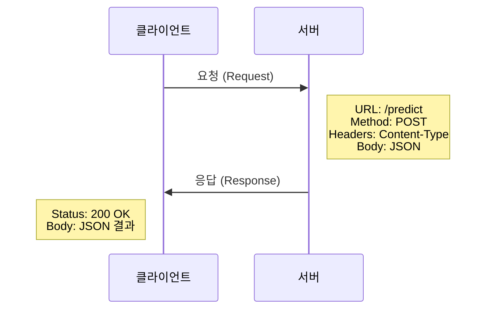
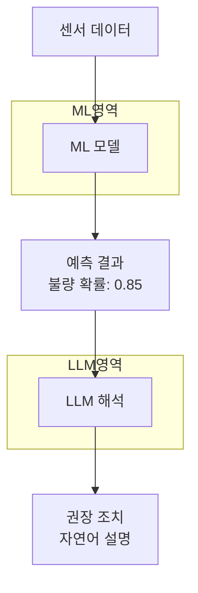

# 26차시: API 활용과 LLM 연동

## 학습 목표

| 목표 | 설명 |
|------|------|
| API 개념 이해 | REST API의 구조와 HTTP 통신 방식을 이해함 |
| requests 활용 | Python requests 라이브러리로 외부 API를 호출함 |
| LLM API 연동 | OpenAI, Claude API를 활용하여 자연어 처리를 수행함 |
| 프롬프트 작성 | 효과적인 프롬프트 엔지니어링 기법을 적용함 |

---

## 실습 환경

| 항목 | 설명 |
|------|------|
| 언어 | Python 3.8 이상 |
| 라이브러리 | requests, json, openai, anthropic |
| 테스트 API | JSONPlaceholder, httpbin.org |
| 설치 명령 | `pip install requests openai anthropic python-dotenv` |

---

## 강의 구성 (25분)

| 파트 | 주제 | 시간 |
|:----:|------|:----:|
| Part 1 | API와 REST API 개념 | 8분 |
| Part 2 | LLM API 호출과 응답 처리 | 8분 |
| Part 3 | 프롬프트 작성과 제조업 활용 | 7분 |
| 정리 | 핵심 요약 및 체크리스트 | 2분 |

---

## Part 1: API와 REST API 개념 (8분)

### 1.1 API란?

**API (Application Programming Interface)**
- 프로그램 간 통신 방법을 정의한 규약
- 다른 프로그램의 기능을 빌려 쓰는 표준화된 방법


**다이어그램 해석**
- 클라이언트: 데이터를 요청하는 프로그램 (Python 스크립트 등)
- API: 요청과 응답의 형식을 정의하는 인터페이스
- 서버: 요청을 처리하고 결과를 반환하는 시스템

**일상 속 API 활용 사례**

| 서비스 | API 활용 |
|--------|----------|
| 날씨 앱 | 기상청 API로 날씨 데이터 조회 |
| 지도 앱 | 구글/네이버 지도 API |
| AI 서비스 | OpenAI, Claude API |

---

### 1.2 REST API란?

**REST (Representational State Transfer)**
- 웹에서 자원(Resource)을 다루는 설계 원칙
- HTTP 프로토콜 기반, URL로 자원 식별

**HTTP 메서드와 CRUD 연산**

| 메서드 | 동작 | 설명 | 예시 |
|--------|------|------|------|
| **GET** | 조회 | 데이터 가져오기 | 제품 목록 조회 |
| **POST** | 생성 | 새 데이터 만들기 | 예측 요청 전송 |
| **PUT** | 수정 | 데이터 전체 수정 | 설정 업데이트 |
| **DELETE** | 삭제 | 데이터 삭제 | 기록 삭제 |

---

### 1.3 REST API 통신 흐름



**다이어그램 해석**
- 클라이언트에서 서버로 URL, 메서드, 헤더, 본문을 포함한 요청 전송
- 서버는 처리 후 상태 코드와 결과 데이터를 응답

**HTTP 상태 코드**

| 코드 | 의미 | 대응 방법 |
|------|------|-----------|
| **200** | 성공 | 정상 처리 |
| **400** | 잘못된 요청 | 요청 데이터 확인 |
| **401** | 인증 필요 | API 키 확인 |
| **404** | 자원 없음 | URL 확인 |
| **500** | 서버 오류 | 잠시 후 재시도 |

---

### 1.4 requests 라이브러리

Python에서 가장 널리 사용되는 HTTP 라이브러리

```bash
pip install requests
```

**실습: GET 요청**

```python
import requests

# 공개 API 호출 (JSONPlaceholder - 테스트용 무료 API)
url = 'https://jsonplaceholder.typicode.com/posts/1'
response = requests.get(url)

print(f"상태 코드: {response.status_code}")
print(f"성공 여부: {response.ok}")
print(f"응답 본문:\n{response.text[:200]}...")
```

**실행 결과**
```
상태 코드: 200
성공 여부: True
응답 본문:
{
  "userId": 1,
  "id": 1,
  "title": "sunt aut facere repellat provident..."
}...
```

---

### 1.5 POST 요청과 JSON 전송

```python
import requests

url = 'https://httpbin.org/post'

# JSON 데이터 전송 (제조 센서 데이터 예시)
sensor_data = {
    'temperature': 200,
    'pressure': 50,
    'speed': 100
}

response = requests.post(url, json=sensor_data)
result = response.json()

print(f"상태 코드: {response.status_code}")
print(f"전송된 JSON: {result.get('json', {})}")
```

---

### 1.6 에러 처리 패턴

```python
import requests

def safe_api_call(url, data=None, timeout=10):
    """안전한 API 호출 함수"""
    try:
        if data:
            response = requests.post(url, json=data, timeout=timeout)
        else:
            response = requests.get(url, timeout=timeout)

        response.raise_for_status()
        return {'success': True, 'data': response.json()}

    except requests.Timeout:
        return {'success': False, 'error': '요청 시간 초과'}
    except requests.ConnectionError:
        return {'success': False, 'error': '연결 실패'}
    except requests.HTTPError as e:
        return {'success': False, 'error': f'HTTP 에러: {e}'}

# 사용 예시
result = safe_api_call('https://jsonplaceholder.typicode.com/posts/1')
print(result)
```

---

### 1.7 JSON 데이터 처리

**Python-JSON 타입 대응표**

| Python | JSON |
|--------|------|
| dict | object { } |
| list | array [ ] |
| str | string |
| int, float | number |
| True, False | true, false |
| None | null |

```python
import json

# 직렬화 (Python -> JSON)
data = {'temperature': 200, 'status': True}
json_str = json.dumps(data, indent=2, ensure_ascii=False)
print(json_str)

# 역직렬화 (JSON -> Python)
json_str = '{"temperature": 200, "status": true}'
parsed_data = json.loads(json_str)
print(f"온도: {parsed_data['temperature']}")
```

---

## Part 2: LLM API 호출과 응답 처리 (8분)

### 2.1 LLM이란?

**LLM (Large Language Model)**
- 대규모 텍스트 데이터로 학습한 언어 모델
- 자연어 이해, 생성, 번역, 요약, 분석 수행
- 대표 모델: GPT-4, Claude, Gemini, Llama


**주요 LLM 서비스 비교**

| 서비스 | 제공사 | 특징 |
|--------|--------|------|
| **GPT-4** | OpenAI | 가장 널리 사용, 범용성 |
| **Claude** | Anthropic | 긴 문서 처리, 안전성 |
| **Gemini** | Google | 멀티모달, 검색 연동 |

---

### 2.2 API 키 보안 관리

**위험한 방법 (절대 금지)**
```python
api_key = "sk-proj-xxxxx"  # 코드에 직접 입력 금지
```

**안전한 방법 (권장)**
```python
import os
from dotenv import load_dotenv

load_dotenv()
api_key = os.environ.get('OPENAI_API_KEY')

if api_key:
    print(f"API 키 로드 완료: {api_key[:10]}...")
```

**.env 파일 (프로젝트 루트)**
```
OPENAI_API_KEY=sk-proj-xxxxxxxxxxxxxxxx
ANTHROPIC_API_KEY=sk-ant-xxxxxxxxxxxxxxxx
```

---

### 2.3 OpenAI API 호출

```python
from openai import OpenAI
import os

client = OpenAI(api_key=os.environ.get('OPENAI_API_KEY'))

response = client.chat.completions.create(
    model="gpt-4",
    messages=[
        {"role": "system", "content": "당신은 제조업 품질 관리 전문가입니다."},
        {"role": "user", "content": "온도 이상의 원인을 분석해주세요."}
    ],
    temperature=0.3,
    max_tokens=1000
)

answer = response.choices[0].message.content
print(answer)
```

---

### 2.4 Claude API 호출

```python
import anthropic
import os

client = anthropic.Anthropic(api_key=os.environ.get('ANTHROPIC_API_KEY'))

response = client.messages.create(
    model="claude-3-sonnet-20240229",
    max_tokens=1024,
    messages=[
        {"role": "user", "content": "온도 이상의 원인을 분석해주세요."}
    ]
)

answer = response.content[0].text
print(answer)
```

---

### 2.5 메시지 역할과 파라미터

**메시지 역할**

| 역할 | 설명 | 사용 시점 |
|------|------|----------|
| **system** | AI의 역할/성격 정의 | 대화 시작 시 |
| **user** | 사용자 질문 | 매 요청마다 |
| **assistant** | AI 응답 (이전 대화) | 대화 이력 유지 시 |

**주요 파라미터**

| 파라미터 | 설명 | 권장값 |
|----------|------|--------|
| **model** | 사용할 모델 | gpt-4, claude-3-sonnet |
| **max_tokens** | 응답 최대 길이 | 1000~4000 |
| **temperature** | 창의성 (0~1) | 분석: 0.3, 창작: 0.8 |

---

### 2.6 LLM API 비용 구조

| 모델 | 입력 (1K 토큰) | 출력 (1K 토큰) |
|------|---------------|---------------|
| GPT-4 Turbo | $0.01 | $0.03 |
| GPT-3.5 Turbo | $0.0005 | $0.0015 |
| Claude 3 Sonnet | $0.003 | $0.015 |
| Claude 3 Haiku | $0.00025 | $0.00125 |

```python
def estimate_cost(prompt_tokens, completion_tokens, model="gpt-4"):
    """API 호출 비용 추정"""
    pricing = {
        'gpt-4': {'input': 0.01, 'output': 0.03},
        'gpt-3.5-turbo': {'input': 0.0005, 'output': 0.0015}
    }
    rates = pricing.get(model, pricing['gpt-4'])

    input_cost = (prompt_tokens / 1000) * rates['input']
    output_cost = (completion_tokens / 1000) * rates['output']
    total_cost = input_cost + output_cost

    return {
        'total_cost_usd': round(total_cost, 6),
        'total_cost_krw': round(total_cost * 1400, 2)
    }

cost = estimate_cost(500, 200, 'gpt-4')
print(f"총 비용: ${cost['total_cost_usd']} (약 {cost['total_cost_krw']}원)")
```

---

## Part 3: 프롬프트 작성과 제조업 활용 (7분)

### 3.1 프롬프트 엔지니어링

**정의**: AI에게 원하는 결과를 얻기 위한 질문/지시 작성 기술

| 구분 | 프롬프트 | 평가 |
|------|----------|------|
| 나쁜 예 | "불량 분석해줘" | 모호함, 맥락 없음 |
| 좋은 예 | "제조 라인에서 온도 250도, 압력 70kPa 조건에서 발생한 표면 스크래치 불량의 원인을 3가지 제시해주세요." | 구체적, 맥락 제공 |

---

### 3.2 프롬프트 기본 원칙


**5가지 핵심 원칙**

| 원칙 | 설명 |
|------|------|
| **명확성** | 구체적이고 명확하게 작성 |
| **맥락 제공** | 배경 정보 포함 |
| **형식 지정** | 원하는 출력 형태 명시 |
| **예시 제공** | Few-shot 학습 |
| **단계적 사고** | Chain of Thought |

---

### 3.3 역할 지정과 맥락 제공

```python
system_prompt = """
당신은 20년 경력의 제조업 품질 관리 전문가입니다.
데이터 기반으로 분석하고, 실용적인 해결책을 제시합니다.
"""

user_prompt = """
[상황]
자동차 부품 제조 라인에서 용접 품질 불량이 증가했습니다.

[데이터]
- 불량률: 지난 주 2% -> 이번 주 5%
- 용접 전류: 평균 180A (기준: 175-185A)
- 온도: 평균 850도 (기준: 800-900도)

[질문]
불량률 증가의 원인과 조치 방안을 제시해주세요.

[형식]
## 원인 분석
1. [원인]: 근거와 영향

## 권장 조치
1. 즉시 조치: ...
2. 단기 대책: ...
"""
```

---

### 3.4 Few-shot 학습

예시를 통해 원하는 출력 패턴을 학습시키는 방법

```python
user_prompt = """
센서 데이터 이상 여부를 판단해주세요.

예시 1:
입력: 온도 210도, 압력 55kPa
출력: {"status": "정상", "reason": "모든 값이 정상 범위 내"}

예시 2:
입력: 온도 280도, 압력 45kPa
출력: {"status": "이상", "reason": "온도 초과 (280 > 220)"}

이제 분석해주세요:
입력: 온도 245도, 압력 72kPa
출력:
"""
```

---

### 3.5 ML + LLM 하이브리드 분석



**다이어그램 해석**
- ML 모델: 센서 데이터로 불량 확률 예측 (수치 출력)
- LLM: 예측 결과를 자연어로 해석하여 권장 조치 설명
- ML의 정확성과 LLM의 설명력을 결합한 하이브리드 접근법

---

### 3.6 실습: 불량 원인 분석 프롬프트

```python
def create_defect_analysis_prompt(sensor_data, defect_type):
    """불량 원인 분석 프롬프트 생성"""
    system_prompt = """
당신은 20년 경력의 제조업 품질 관리 전문가입니다.
데이터 기반으로 분석하고, 실용적인 해결책을 제시합니다.
"""

    user_prompt = f"""
[제조 공정 불량 분석]

불량 유형: {defect_type}
센서 데이터:
- 온도: {sensor_data['temperature']}도
- 압력: {sensor_data['pressure']}kPa
- 속도: {sensor_data['speed']}rpm

위 데이터를 바탕으로:
1. 가장 가능성 높은 원인 3가지
2. 각 원인의 해결 방법
3. 예방을 위한 권장 사항

을 분석해주세요.
"""

    return [
        {"role": "system", "content": system_prompt},
        {"role": "user", "content": user_prompt}
    ]

# 사용 예시
sensor_data = {'temperature': 235, 'pressure': 72, 'speed': 1500}
messages = create_defect_analysis_prompt(sensor_data, "표면 스크래치")
```

---

### 3.7 실습: 하이브리드 분석 구현

```python
def hybrid_analysis(sensor_data, ml_prediction, ml_probability):
    """ML 예측 결과를 LLM으로 해석"""
    prompt = f"""
[ML 모델 예측 결과 해석]

입력 데이터:
- 온도: {sensor_data['temperature']}도 (정상: 180-220)
- 압력: {sensor_data['pressure']}kPa (정상: 50-70)
- 진동: {sensor_data['vibration']}mm/s (정상: 0-5)

ML 예측 결과: {ml_prediction}
예측 확률: {ml_probability:.1%}

현장 작업자가 이해할 수 있게:
1. 예측 결과의 의미 (한 문장)
2. 주의가 필요한 센서값
3. 권장 조치 사항 (우선순위별)

을 설명해주세요.
"""
    print("=== LLM 프롬프트 ===")
    print(prompt)

    # 실제 환경에서는 LLM API 호출
    return prompt

# 사용 예시
sensor_data = {'temperature': 235, 'pressure': 68, 'vibration': 8.5}
hybrid_analysis(sensor_data, 'defect', 0.85)
```

---

### 3.8 LLM 활용 시 주의사항

| 항목 | 주의점 | 대응 방안 |
|------|--------|----------|
| **환각** | 사실이 아닌 내용 생성 | 중요 정보 검증 필수 |
| **일관성** | 같은 질문에 다른 답변 | temperature=0 사용 |
| **보안** | 민감 정보 전송 위험 | 데이터 익명화 |
| **비용** | 예상치 못한 비용 | 사용량 모니터링 |

**비용 최적화 전략**

| 전략 | 방법 |
|------|------|
| 모델 선택 | 간단한 작업은 GPT-3.5, Haiku 사용 |
| 프롬프트 최적화 | 불필요한 내용 제거 |
| 캐싱 | 동일 질문 결과 저장 재사용 |
| 토큰 제한 | max_tokens 적절히 설정 |

---

## 실습 종합: 완전한 예제

### 공개 API 호출 + 데이터 처리

```python
import requests
import json

def fetch_and_process_data():
    """공개 API에서 데이터를 가져와 처리"""
    url = 'https://jsonplaceholder.typicode.com/posts'
    params = {'_limit': 3}

    print("=== 1. API 호출 ===")
    response = requests.get(url, params=params, timeout=10)

    if not response.ok:
        print(f"에러: {response.status_code}")
        return None

    data = response.json()
    print(f"가져온 데이터 수: {len(data)}개")

    print("\n=== 2. 데이터 처리 ===")
    for item in data:
        print(f"ID: {item['id']}, 제목: {item['title'][:30]}...")

    result = {
        'total_items': len(data),
        'ids': [item['id'] for item in data],
        'status': 'success'
    }

    print("\n=== 3. 결과 JSON ===")
    print(json.dumps(result, indent=2))
    return result

result = fetch_and_process_data()
```

---

### 제조업 LLM 활용 종합 예제

```python
def complete_manufacturing_analysis():
    """제조업 데이터 분석 완전한 예제"""
    # 1. 센서 데이터
    sensor_data = {
        'temperature': 232,
        'pressure': 68,
        'vibration': 7.2,
        'humidity': 45,
        'speed': 1450
    }

    # 2. 정상 범위
    normal_ranges = {
        'temperature': (180, 220),
        'pressure': (50, 70),
        'vibration': (0, 5),
        'humidity': (30, 60),
        'speed': (1400, 1600)
    }

    # 3. 이상 탐지 (ML 역할)
    print("=== 이상 탐지 ===")
    anomalies = []
    for key, value in sensor_data.items():
        min_val, max_val = normal_ranges[key]
        if value < min_val or value > max_val:
            anomalies.append(f"{key}: {value} (범위: {min_val}-{max_val})")
            print(f"[이상] {anomalies[-1]}")

    # 4. LLM 분석 요청
    prompt = f"""
센서 이상 탐지 결과:
- 이상 항목: {', '.join(anomalies) if anomalies else '없음'}

설비 상태를 평가하고 권장 조치를 제안해주세요.
"""
    print(f"\n=== LLM 프롬프트 ===\n{prompt}")

    return {'sensor_data': sensor_data, 'anomalies': anomalies}

result = complete_manufacturing_analysis()
```

---

## 핵심 정리

| 분류 | 핵심 내용 |
|------|----------|
| REST API | HTTP 기반, URL로 자원 식별, 메서드로 동작 정의 |
| HTTP 메서드 | GET(조회), POST(생성), PUT(수정), DELETE(삭제) |
| 상태 코드 | 200(성공), 400(잘못된 요청), 401(인증 필요), 500(서버 에러) |
| JSON | 데이터 교환 형식, dumps(직렬화), loads(역직렬화) |
| LLM API | 자연어 처리 AI, 토큰 기반 과금 |
| 프롬프트 | 역할 지정, 맥락 제공, 형식 지정, Few-shot, CoT |

### 핵심 코드 요약

```python
import requests
import json
from openai import OpenAI
import os

# REST API 호출
response = requests.get(url, timeout=10)
response = requests.post(url, json=data, timeout=10)
if response.ok:
    result = response.json()

# JSON 처리
json_str = json.dumps(data, ensure_ascii=False, indent=2)
data = json.loads(json_str)

# LLM API 호출
client = OpenAI(api_key=os.environ['OPENAI_API_KEY'])
response = client.chat.completions.create(
    model="gpt-4",
    messages=[
        {"role": "system", "content": "제조 전문가"},
        {"role": "user", "content": "불량 원인 분석..."}
    ],
    temperature=0.3
)
answer = response.choices[0].message.content
```

---

## 체크리스트

| 구분 | 항목 | 확인 |
|------|------|:----:|
| API | REST API 개념 이해 | [ ] |
| API | HTTP 메서드 (GET, POST) 구분 | [ ] |
| API | HTTP 상태 코드 의미 파악 | [ ] |
| requests | requests.get(), post() 사용 | [ ] |
| requests | 에러 처리 (try-except, timeout) | [ ] |
| JSON | json.dumps(), loads() 사용 | [ ] |
| LLM | API 키 환경 변수 설정 | [ ] |
| LLM | 메시지 역할 (system, user) 이해 | [ ] |
| 프롬프트 | 역할 지정, 맥락 제공 작성 | [ ] |
| 프롬프트 | Few-shot 학습 적용 | [ ] |
| 활용 | ML + LLM 하이브리드 분석 이해 | [ ] |

---

## 다음 차시 예고

**27차시: Streamlit으로 웹 앱 만들기**
- Streamlit 기본 구조와 컴포넌트
- 데이터 시각화 대시보드 구현
- ML 모델 예측 인터페이스 제작
