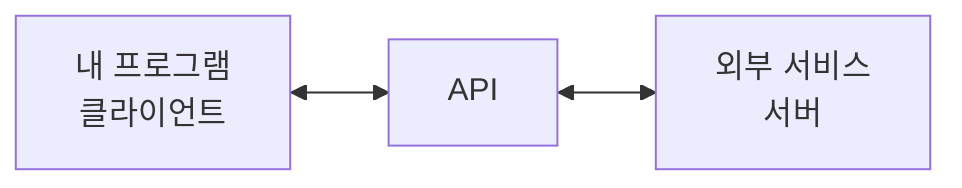
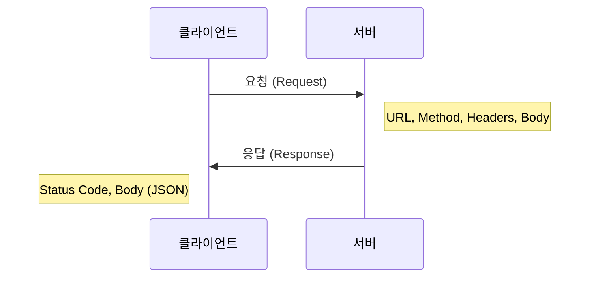
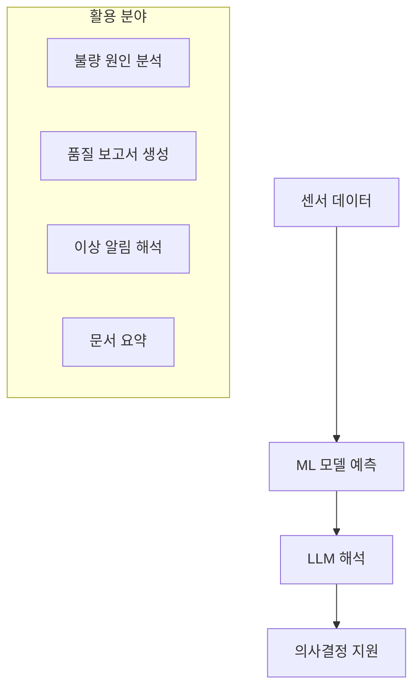

<!-- _class: lead -->
# [26차시] API 활용과 LLM 연동

## 외부 서비스 연동과 대화형 AI 활용

---

# 학습 목표

1. **API**의 개념과 **REST API** 통신 방식을 이해한다
2. **requests** 라이브러리로 외부 데이터를 호출한다
3. **LLM API**를 활용하여 제조 데이터 분석을 보조한다

---

# 수업 흐름

| 구간 | 시간 | 내용 |
|:----:|:----:|------|
| 대주제 1 | 8분 | API와 REST API 개념 |
| 대주제 2 | 8분 | LLM API 호출과 응답 처리 |
| 대주제 3 | 7분 | 프롬프트 작성과 제조업 활용 |
| 정리 | 2분 | 핵심 요약 |

---

<!-- _class: lead -->
# 대주제 1
## API와 REST API 개념

---

# API란?

**API (Application Programming Interface)**

- 프로그램 간 통신 방법을 정의한 규약
- "다른 프로그램의 기능을 빌려 쓰는 방법"



---

# REST API 구조

**REST (Representational State Transfer)**
- 웹에서 자원을 다루는 설계 원칙
- HTTP 프로토콜 기반

```
https://api.example.com/products/123
       |--- 서버 주소 ---|  |자원|
```

**HTTP 메서드**

| 메서드 | 동작 | 설명 |
|-------|-----|------|
| **GET** | 조회 | 데이터 가져오기 |
| **POST** | 생성 | 새 데이터 만들기 (ML 예측 요청) |

---

# REST API 요청과 응답



**HTTP 상태 코드**

| 코드 | 의미 | 설명 |
|-----|------|------|
| 200 | OK | 성공 |
| 400 | Bad Request | 잘못된 요청 |
| 401 | Unauthorized | 인증 필요 |
| 500 | Server Error | 서버 오류 |

---

# requests 라이브러리

**Python에서 가장 많이 쓰는 HTTP 라이브러리**

```python
import requests

# GET 요청
response = requests.get(url, params={'key': 'value'})

# POST 요청
response = requests.post(url, json=data, headers=headers)

# 응답 처리
if response.ok:
    result = response.json()
```

---

# JSON 데이터 교환

**JSON (JavaScript Object Notation)**
- API 통신의 표준 데이터 형식

| Python | JSON |
|--------|------|
| dict | object { } |
| list | array [ ] |
| True/False | true/false |
| None | null |

```python
import json

# Python -> JSON 문자열
json_str = json.dumps(data, ensure_ascii=False)

# JSON 문자열 -> Python
data = json.loads(json_str)
```

---

<!-- _class: lead -->
# 대주제 2
## LLM API 호출과 응답 처리

---

# LLM이란?

**LLM (Large Language Model)**

- 대규모 텍스트로 학습한 언어 모델
- 자연어 이해, 생성, 번역, 요약 등 수행

| 서비스 | 제공사 | 특징 |
|-------|-------|------|
| **GPT-4** | OpenAI | 가장 널리 사용, 범용 |
| **Claude** | Anthropic | 긴 문서 처리, 안전성 |
| **Gemini** | Google | 멀티모달, 검색 연동 |

---

# API 키 관리

**안전한 API 키 관리 방법**

```python
import os
from dotenv import load_dotenv

# .env 파일에서 환경 변수 로드
load_dotenv()

# 환경 변수에서 API 키 읽기
api_key = os.environ.get('OPENAI_API_KEY')
```

**절대 하면 안 되는 것**: 코드에 API 키 직접 입력

---

# OpenAI API 기본 구조

```python
from openai import OpenAI

client = OpenAI(api_key=os.environ['OPENAI_API_KEY'])

response = client.chat.completions.create(
    model="gpt-4",
    messages=[
        {"role": "system", "content": "제조 전문가"},
        {"role": "user", "content": "온도 이상 원인 분석"}
    ],
    temperature=0.3,
    max_tokens=1000
)

answer = response.choices[0].message.content
```

---

# 메시지 역할과 파라미터

**메시지 역할**

| 역할 | 설명 |
|-----|------|
| **system** | AI의 역할/성격 정의 |
| **user** | 사용자 질문 |
| **assistant** | AI 응답 (대화 이력) |

**주요 파라미터**

| 파라미터 | 설명 | 권장값 |
|---------|------|--------|
| temperature | 창의성 (0~1) | 분석: 0.3, 창작: 0.8 |
| max_tokens | 응답 최대 길이 | 1000~4000 |

---

<!-- _class: lead -->
# 대주제 3
## 프롬프트 작성과 제조업 활용

---

# 프롬프트 엔지니어링

**정의**: AI에게 원하는 결과를 얻기 위한 질문 작성 기술

```
나쁜 프롬프트:
"불량 분석해줘"

좋은 프롬프트:
"제조 라인에서 온도 250도, 압력 70kPa 조건에서
발생한 표면 스크래치 불량의 원인을 3가지 제시하고
각각의 해결책을 설명해주세요."
```

---

# 프롬프트 기본 원칙

| 원칙 | 설명 |
|-----|------|
| **명확성** | 구체적이고 명확하게 |
| **맥락 제공** | 배경 정보 포함 |
| **형식 지정** | 원하는 출력 형태 명시 |
| **예시 제공** | Few-shot 학습 |
| **단계적 사고** | Chain of Thought |

---

# 프롬프트 작성 기법

**역할 지정 + 맥락 제공 + 형식 지정**

```python
system_prompt = """
당신은 20년 경력의 제조업 품질 관리 전문가입니다.
데이터 기반으로 분석하고, 실용적인 해결책을 제시합니다.
"""

user_prompt = """
[상황] 용접 품질 불량이 증가 (2% -> 5%)
[데이터] 온도: 850도, 전류: 180A, 시간: 2.3초

## 형식
1. 원인 분석 (3가지)
2. 권장 조치
"""
```

---

# 제조업 활용 사례



---

# LLM + ML 하이브리드

```python
def hybrid_analysis(sensor_data):
    # 1. ML 모델로 예측
    prediction = ml_model.predict(sensor_data)
    probability = ml_model.predict_proba(sensor_data)

    # 2. LLM으로 해석
    prompt = f"""
    입력: {sensor_data}
    예측: {prediction} (확률: {probability})

    해석과 권장 조치를 제시해주세요.
    """
    interpretation = call_llm(prompt)

    return {'prediction': prediction,
            'interpretation': interpretation}
```

---

# 주의사항

| 항목 | 주의점 |
|-----|--------|
| **환각** | LLM이 사실이 아닌 내용 생성 가능 -> 검증 필요 |
| **비용** | 토큰 사용량 모니터링 필수 |
| **보안** | 민감 정보 전송 주의 |
| **일관성** | 같은 질문에 다른 답변 가능 |

---

<!-- _class: lead -->
# 핵심 정리

---

# 오늘 배운 내용

1. **API와 REST API**
   - HTTP 메서드 (GET, POST)
   - requests 라이브러리, JSON 처리

2. **LLM API 호출**
   - OpenAI/Claude API 구조
   - 메시지 역할, 파라미터

3. **프롬프트와 활용**
   - 역할 지정, 맥락 제공, 형식 지정
   - 제조업 활용: 불량 분석, 보고서 생성

---

# 핵심 코드

```python
import requests
from openai import OpenAI

# REST API 호출
response = requests.post(url, json=data)
result = response.json()

# LLM API 호출
client = OpenAI(api_key=os.environ['OPENAI_API_KEY'])
response = client.chat.completions.create(
    model="gpt-4",
    messages=[{"role": "user", "content": prompt}],
    temperature=0.3
)
answer = response.choices[0].message.content
```

---

# 체크리스트

- [ ] REST API 개념 이해
- [ ] requests.get(), requests.post() 사용
- [ ] JSON 직렬화/역직렬화
- [ ] LLM API 키 발급 및 환경 변수 설정
- [ ] 역할 지정 프롬프트 작성
- [ ] 제조업 활용 사례 실습

---

<!-- _class: lead -->
# 수고하셨습니다!

## 실습: LLM API로 품질 이상 분석하기

