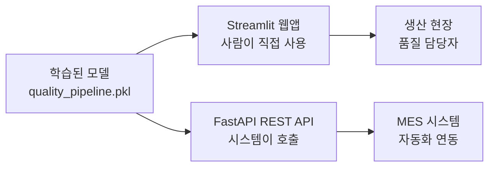
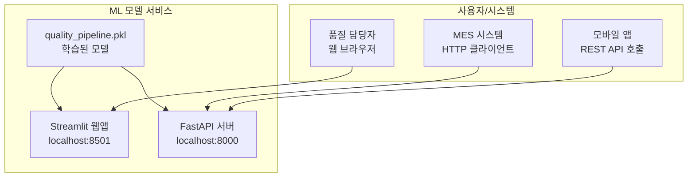

# 27차시: ML 모델 서비스 배포 - 웹앱과 API 구축

## 학습 목표

1. **Streamlit**으로 대화형 예측 웹앱을 제작함
2. **FastAPI**로 예측 API 엔드포인트를 구축함
3. **제조 품질 예측 모델**을 서비스로 배포함

---

## 강의 구성

| 구간 | 시간 | 내용 |
|:----:|:----:|------|
| 대주제 1 | 8분 | Streamlit 웹앱 구축 |
| 대주제 2 | 10분 | FastAPI 엔드포인트 구현 |
| 대주제 3 | 5분 | 통합 서비스 아키텍처 |
| 정리 | 2분 | 핵심 요약 |

---

## 도입: ML 모델 서비스 배포 개요

### 왜 모델 서비스 배포가 필요한가

학습된 머신러닝 모델은 Jupyter Notebook이나 Python 스크립트로만 사용할 수 있음. 실제 현장에서 모델을 활용하려면 **서비스 형태**로 배포해야 함.



### 두 가지 배포 방식 비교

| 항목 | Streamlit | FastAPI |
|-----|-----------|---------|
| **용도** | 사용자 인터페이스 | API 서버 |
| **호출 방식** | 웹 브라우저 | HTTP 요청 |
| **대상** | 사람 (직접 입력) | 프로그램 (자동 호출) |
| **출력** | 웹 페이지 | JSON 데이터 |
| **사용 사례** | 품질 담당자 예측 | MES 시스템 연동 |

---

## 대주제 1: Streamlit 웹앱 구축

### 1.1 Streamlit 개요

**Streamlit**은 Python만으로 웹앱을 구현하는 프레임워크임. HTML, CSS, JavaScript 없이 Python 코드만으로 인터랙티브 웹앱을 생성함.

```python
# Streamlit 설치
# pip install streamlit

import streamlit as st

st.title("품질 예측 시스템")
st.write("센서 데이터를 입력하세요.")
```

```bash
# 앱 실행
streamlit run app.py
# 브라우저에서 http://localhost:8501 접속
```

---

### 1.2 핵심 출력 위젯

```python
import streamlit as st
import pandas as pd

# 텍스트 출력
st.title("제목 (가장 큼)")
st.header("헤더")
st.subheader("서브헤더")
st.text("일반 텍스트")

# 범용 출력 (타입 자동 감지)
st.write("문자열")
st.write(123)
st.write({"key": "value"})

# DataFrame 출력
df = pd.DataFrame({
    'temperature': [200, 210, 220],
    'pressure': [50, 55, 60],
    'status': ['정상', '정상', '경고']
})
st.dataframe(df)  # 인터랙티브 테이블

# KPI 지표 표시
col1, col2, col3 = st.columns(3)
col1.metric("불량률", "2.3%", "-0.2%")
col2.metric("가동률", "94.5%", "+1.2%")
col3.metric("생산량", "15,234", "+234")
```

**출력 위젯 요약**

| 함수 | 용도 |
|-----|------|
| `st.title()` | 제목 표시 |
| `st.write()` | 범용 출력 (자동 타입 감지) |
| `st.dataframe()` | 인터랙티브 테이블 |
| `st.table()` | 정적 테이블 |
| `st.metric()` | KPI 지표 (변화량 색상 표시) |
| `st.line_chart()` | 라인 차트 |
| `st.bar_chart()` | 바 차트 |

---

### 1.3 핵심 입력 위젯

```python
import streamlit as st

# 버튼
if st.button("분석 시작"):
    st.write("분석을 시작합니다...")
    st.success("분석 완료!")

# 슬라이더
temperature = st.slider("온도", 100, 300, 200)
st.write(f"설정 온도: {temperature}도")

# 숫자 입력
pressure = st.number_input("압력", min_value=20, max_value=100, value=50)

# 드롭다운 선택
line = st.selectbox("생산 라인", ["라인 A", "라인 B", "라인 C"])

# 다중 선택
features = st.multiselect("분석 항목", ["온도", "압력", "속도", "진동"])

# 체크박스
apply_preprocessing = st.checkbox("데이터 전처리 적용")

# 라디오 버튼
model_type = st.radio("모델 선택", ["RandomForest", "XGBoost"])
```

**입력 위젯 요약**

| 함수 | 용도 |
|-----|------|
| `st.button()` | 버튼 (클릭 시 True 반환) |
| `st.slider()` | 슬라이더 (범위 선택) |
| `st.number_input()` | 숫자 입력 |
| `st.text_input()` | 텍스트 입력 |
| `st.selectbox()` | 드롭다운 단일 선택 |
| `st.multiselect()` | 다중 선택 |
| `st.checkbox()` | 체크박스 |
| `st.radio()` | 라디오 버튼 |

---

### 1.4 레이아웃 구성

```python
import streamlit as st

# 열 분할
col1, col2 = st.columns(2)

with col1:
    st.header("온도")
    temp = st.number_input("온도(도)", value=200)

with col2:
    st.header("압력")
    pres = st.number_input("압력(kPa)", value=50)

# 사이드바
st.sidebar.title("설정")
model = st.sidebar.selectbox("모델", ["RF", "XGB"])
threshold = st.sidebar.slider("임계값", 0.0, 1.0, 0.5)

# 접기/펼치기
with st.expander("상세 설정 보기"):
    st.write("고급 옵션")
    n_estimators = st.number_input("트리 수", value=100)

# 탭
tab1, tab2 = st.tabs(["데이터", "결과"])
with tab1:
    st.header("데이터 입력")
with tab2:
    st.header("예측 결과")
```

---

### 1.5 폼과 상태 메시지

```python
import streamlit as st

# 폼 (일괄 제출)
with st.form("prediction_form"):
    st.write("센서 데이터 입력")
    temp = st.number_input("온도", value=200)
    pres = st.number_input("압력", value=50)
    speed = st.number_input("속도", value=100)

    submitted = st.form_submit_button("예측 실행")

    if submitted:
        st.write(f"온도: {temp}, 압력: {pres}, 속도: {speed}")

# 상태 메시지
st.success("성공 메시지")
st.info("정보 메시지")
st.warning("경고 메시지")
st.error("에러 메시지")
```

---

### 1.6 모델 캐싱

모델을 매 요청마다 로드하면 성능이 저하됨. `@st.cache_resource` 데코레이터를 사용하여 모델을 한 번만 로드함.

```python
import streamlit as st
import joblib

@st.cache_resource  # 모델 캐싱 (한 번만 로드)
def load_model():
    return joblib.load('quality_pipeline.pkl')

try:
    model = load_model()
    st.sidebar.success("모델 로드 완료")
except Exception as e:
    st.sidebar.error(f"모델 로드 실패: {e}")
    model = None
```

**캐싱 데코레이터 비교**

| 데코레이터 | 용도 |
|-----------|------|
| `@st.cache_resource` | 모델, DB 연결 등 리소스 객체 |
| `@st.cache_data` | DataFrame, 계산 결과 등 데이터 |

---

### 1.7 품질 예측 웹앱 완성

```python
import streamlit as st
import pandas as pd
import numpy as np

# 페이지 설정
st.set_page_config(
    page_title="품질 예측 시스템",
    layout="wide"
)

# 타이틀
st.title("제조 품질 예측 시스템")
st.markdown("센서 데이터를 입력하여 품질을 예측합니다.")

# 모델 캐싱 (실제 환경에서는 joblib.load 사용)
@st.cache_resource
def load_model():
    # 데모용 간단한 예측기
    class DemoPredictor:
        def predict(self, X):
            risk = (X['temperature'].values[0] - 200) / 100
            risk += (X['vibration'].values[0] - 5) / 10
            return [1 if risk > 0.5 else 0]
        def predict_proba(self, X):
            risk = (X['temperature'].values[0] - 200) / 100
            risk += (X['vibration'].values[0] - 5) / 10
            prob = min(max(risk, 0), 1)
            return [[1-prob, prob]]
    return DemoPredictor()

model = load_model()

# 입력 섹션
st.header("센서 데이터 입력")

col1, col2 = st.columns(2)

with col1:
    temperature = st.slider("온도 (도)", 100, 300, 200)
    pressure = st.slider("압력 (kPa)", 20, 100, 50)
    speed = st.slider("속도 (rpm)", 50, 200, 100)

with col2:
    humidity = st.slider("습도 (%)", 20, 80, 50)
    vibration = st.slider("진동 (mm/s)", 0.0, 15.0, 5.0)

# 예측 실행
if st.button("품질 예측", type="primary"):
    # 입력 데이터 구성
    input_data = pd.DataFrame({
        'temperature': [temperature],
        'pressure': [pressure],
        'speed': [speed],
        'humidity': [humidity],
        'vibration': [vibration]
    })

    # 예측
    prediction = model.predict(input_data)
    probability = model.predict_proba(input_data)

    # 결과 표시
    st.header("예측 결과")

    col1, col2 = st.columns(2)

    with col1:
        if prediction[0] == 1:
            st.error(f"불량 예측 (확률: {probability[0][1]:.1%})")
        else:
            st.success(f"정상 예측 (확률: {probability[0][0]:.1%})")

    with col2:
        st.metric("위험 점수", f"{int(probability[0][1] * 100)}",
                  delta=None if probability[0][1] < 0.3 else "주의 필요")

    # 입력값 표시
    st.subheader("입력 데이터")
    st.dataframe(input_data.T.rename(columns={0: '값'}))
```

---

## 대주제 2: FastAPI 엔드포인트 구현

### 2.1 FastAPI 개요

**FastAPI**는 고성능 Python 웹 프레임워크임. 다른 프로그램이나 시스템에서 HTTP 요청으로 모델을 호출할 수 있는 REST API를 구축함.

```python
# FastAPI 설치
# pip install fastapi uvicorn

from fastapi import FastAPI

app = FastAPI()

@app.get("/")
def read_root():
    return {"message": "Hello, FastAPI!"}

@app.get("/health")
def health_check():
    return {"status": "healthy"}
```

```bash
# 서버 실행
uvicorn main:app --reload
# http://127.0.0.1:8000 접속
# http://127.0.0.1:8000/docs 자동 문서
```

---

### 2.2 HTTP 메서드와 매개변수

```python
from fastapi import FastAPI

app = FastAPI()

# GET - 경로 매개변수
@app.get("/items/{item_id}")
def read_item(item_id: int):
    return {"item_id": item_id}
# /items/123 -> {"item_id": 123}
# /items/abc -> 에러 (타입 검증)

# GET - 쿼리 매개변수
@app.get("/search")
def search_items(q: str, limit: int = 10):
    return {"query": q, "limit": limit}
# /search?q=temperature&limit=5

# POST - 요청 본문
@app.post("/predict")
def predict(data: dict):
    return {"received": data, "prediction": "normal"}
```

**HTTP 메서드 요약**

| 메서드 | 용도 | 데코레이터 |
|-------|------|-----------|
| GET | 데이터 조회 | `@app.get()` |
| POST | 데이터 생성/예측 | `@app.post()` |
| PUT | 데이터 수정 | `@app.put()` |
| DELETE | 데이터 삭제 | `@app.delete()` |

---

### 2.3 Pydantic 데이터 검증

**Pydantic**은 데이터 검증 라이브러리로, FastAPI와 완벽하게 통합됨. 타입 힌트를 기반으로 자동 검증을 수행함.

```python
from pydantic import BaseModel, Field
from typing import Optional, List
from datetime import datetime

# 요청 모델
class SensorData(BaseModel):
    temperature: float = Field(
        ...,  # 필수 필드
        ge=100,  # >= 100
        le=300,  # <= 300
        description="온도 (도)"
    )
    pressure: float = Field(..., ge=20, le=100, description="압력 (kPa)")
    speed: float = Field(..., ge=50, le=200, description="속도 (rpm)")
    humidity: float = Field(50.0, ge=20, le=80, description="습도 (%)")
    vibration: float = Field(5.0, ge=0, le=15, description="진동 (mm/s)")

# 응답 모델
class PredictionResponse(BaseModel):
    prediction: str
    probability: float
    risk_score: int
    timestamp: datetime
    anomalies: List[str] = []
```

---

### 2.4 Field 검증 옵션

| 옵션 | 의미 | 예시 |
|-----|------|------|
| `...` | 필수 필드 | `Field(...)` |
| `ge` | >= (greater or equal) | `ge=100` |
| `le` | <= (less or equal) | `le=300` |
| `gt` | > (greater than) | `gt=0` |
| `lt` | < (less than) | `lt=100` |
| `min_length` | 문자열 최소 길이 | `min_length=1` |
| `max_length` | 문자열 최대 길이 | `max_length=100` |
| `description` | 필드 설명 | `description="온도"` |

---

### 2.5 자동 검증 동작

```python
from pydantic import BaseModel

class SensorData(BaseModel):
    temperature: float
    pressure: float
    speed: float

# 유효한 데이터
data = SensorData(
    temperature=200,
    pressure=50,
    speed=100
)
# OK!

# 잘못된 데이터
data = SensorData(
    temperature="hot",  # 문자열
    pressure=50,
    speed=100
)
# 에러: temperature must be float
```

---

### 2.6 예측 API 엔드포인트 구현

```python
from fastapi import FastAPI, HTTPException
from pydantic import BaseModel, Field
from typing import List
from datetime import datetime

app = FastAPI(
    title="품질 예측 API",
    description="제조 공정 품질 예측 서비스",
    version="1.0.0"
)

# 요청/응답 모델
class SensorData(BaseModel):
    temperature: float = Field(..., ge=100, le=300)
    pressure: float = Field(..., ge=20, le=100)
    speed: float = Field(..., ge=50, le=200)
    humidity: float = Field(50.0, ge=20, le=80)
    vibration: float = Field(5.0, ge=0, le=15)

class PredictionResponse(BaseModel):
    prediction: str
    probability: float
    risk_score: int
    timestamp: datetime
    anomalies: List[str] = []

# 예측기 클래스 (데모용)
class QualityPredictor:
    def predict(self, data: dict) -> dict:
        risk_score = 0
        anomalies = []

        if data['temperature'] > 250:
            risk_score += 30
            anomalies.append("온도 초과")
        if data['vibration'] > 10:
            risk_score += 20
            anomalies.append("진동 초과")
        if data['pressure'] > 70:
            risk_score += 15
            anomalies.append("압력 초과")

        risk_score = min(100, risk_score)
        probability = risk_score / 100

        if risk_score >= 50:
            prediction = 'defect'
        elif risk_score >= 30:
            prediction = 'warning'
        else:
            prediction = 'normal'

        return {
            'prediction': prediction,
            'probability': probability,
            'risk_score': risk_score,
            'anomalies': anomalies
        }

predictor = QualityPredictor()

# 엔드포인트
@app.get("/")
def root():
    return {
        "service": "품질 예측 API",
        "version": "1.0.0",
        "docs": "/docs"
    }

@app.get("/health")
def health_check():
    return {
        "status": "healthy",
        "timestamp": datetime.now().isoformat()
    }

@app.post("/predict", response_model=PredictionResponse)
def predict(data: SensorData):
    try:
        result = predictor.predict(data.dict())

        return PredictionResponse(
            prediction=result['prediction'],
            probability=result['probability'],
            risk_score=result['risk_score'],
            timestamp=datetime.now(),
            anomalies=result['anomalies']
        )
    except Exception as e:
        raise HTTPException(status_code=500, detail=str(e))
```

---

### 2.7 API 테스트 방법

**curl 명령어**

```bash
# GET 요청 - 헬스 체크
curl http://localhost:8000/health

# POST 요청 - 예측
curl -X POST http://localhost:8000/predict \
  -H "Content-Type: application/json" \
  -d '{
    "temperature": 200,
    "pressure": 50,
    "speed": 100,
    "humidity": 55,
    "vibration": 5
  }'
```

**Python requests**

```python
import requests

url = "http://localhost:8000/predict"

data = {
    "temperature": 200,
    "pressure": 50,
    "speed": 100,
    "humidity": 55,
    "vibration": 5
}

response = requests.post(url, json=data)
print(response.json())
# {"prediction": "normal", "probability": 0.0, "risk_score": 0, ...}
```

---

### 2.8 에러 처리

```python
from fastapi import HTTPException
from fastapi.responses import JSONResponse
from pydantic import ValidationError

# HTTPException 사용
@app.post("/predict")
def predict(data: SensorData):
    if data.temperature > 300:
        raise HTTPException(
            status_code=400,
            detail="온도가 허용 범위를 초과했습니다"
        )
    # 예측 로직...

# 전역 예외 핸들러
@app.exception_handler(ValidationError)
async def validation_exception_handler(request, exc):
    return JSONResponse(
        status_code=422,
        content={
            "error": "Validation Error",
            "detail": exc.errors()
        }
    )
```

---

### 2.9 배치 예측 엔드포인트

```python
from typing import List

class BatchPredictionRequest(BaseModel):
    items: List[SensorData]

class BatchPredictionResponse(BaseModel):
    results: List[PredictionResponse]
    total: int
    defect_count: int

@app.post("/predict/batch", response_model=BatchPredictionResponse)
def predict_batch(request: BatchPredictionRequest):
    results = []
    for item in request.items:
        result = predictor.predict(item.dict())
        results.append(PredictionResponse(
            prediction=result['prediction'],
            probability=result['probability'],
            risk_score=result['risk_score'],
            timestamp=datetime.now(),
            anomalies=result['anomalies']
        ))

    defect_count = sum(1 for r in results if r.prediction == 'defect')

    return BatchPredictionResponse(
        results=results,
        total=len(results),
        defect_count=defect_count
    )
```

---

## 대주제 3: 통합 서비스 아키텍처

### 3.1 서비스 배포 구조



---

### 3.2 프로젝트 디렉토리 구조

```
quality_service/
+-- streamlit_app/
|   +-- app.py              # Streamlit 웹앱
|   +-- requirements.txt    # streamlit, pandas, joblib
+-- fastapi_app/
|   +-- main.py             # FastAPI 서버
|   +-- models.py           # Pydantic 모델
|   +-- predictor.py        # 예측 로직
|   +-- requirements.txt    # fastapi, uvicorn, pydantic
+-- models/
|   +-- quality_pipeline.pkl  # 학습된 ML 모델
+-- docker/
|   +-- Dockerfile.streamlit
|   +-- Dockerfile.fastapi
+-- docker-compose.yml
```

---

### 3.3 배포 옵션 비교

| 방식 | Streamlit | FastAPI |
|-----|-----------|---------|
| **클라우드 (무료)** | Streamlit Cloud | - |
| **클라우드 (유료)** | AWS/GCP | AWS/GCP/Azure |
| **컨테이너** | Docker | Docker |
| **서버리스** | - | Lambda/Cloud Run |
| **온프레미스** | 직접 서버 | 직접 서버 |

---

### 3.4 Docker 배포

**FastAPI Dockerfile**

```dockerfile
FROM python:3.9-slim

WORKDIR /app
COPY requirements.txt .
RUN pip install --no-cache-dir -r requirements.txt

COPY . .

CMD ["uvicorn", "main:app", "--host", "0.0.0.0", "--port", "8000"]
```

**Streamlit Dockerfile**

```dockerfile
FROM python:3.9-slim

WORKDIR /app
COPY requirements.txt .
RUN pip install --no-cache-dir -r requirements.txt

COPY . .

CMD ["streamlit", "run", "app.py", "--server.port", "8501"]
```

**실행**

```bash
# FastAPI
docker build -t quality-api -f Dockerfile.fastapi .
docker run -p 8000:8000 quality-api

# Streamlit
docker build -t quality-app -f Dockerfile.streamlit .
docker run -p 8501:8501 quality-app
```

---

### 3.5 requirements.txt

**Streamlit용**

```
streamlit>=1.28.0
pandas>=2.0.0
numpy>=1.24.0
scikit-learn>=1.3.0
joblib>=1.3.0
matplotlib>=3.5.0
```

**FastAPI용**

```
fastapi>=0.104.0
uvicorn>=0.24.0
pydantic>=2.5.0
pandas>=2.0.0
numpy>=1.24.0
scikit-learn>=1.3.0
joblib>=1.3.0
```

---

### 3.6 배포 시 주의사항

| 항목 | Streamlit | FastAPI |
|-----|-----------|---------|
| **모델 크기** | 큰 모델은 로드 시간 증가 | 시작 시 메모리 확보 필요 |
| **동시 접속** | 무료 티어 제한 있음 | 워커 수로 확장 |
| **보안** | st.secrets 사용 | 환경변수 사용 |
| **캐싱** | @st.cache_resource | 전역 변수/싱글톤 |
| **로깅** | st.write로 디버그 | logging 모듈 사용 |

---

## 실습: 통합 서비스 구축

### Streamlit 웹앱 전체 코드

```python
# streamlit_app/app.py
import streamlit as st
import pandas as pd
import requests
from datetime import datetime

# 페이지 설정
st.set_page_config(
    page_title="품질 예측 시스템",
    layout="wide"
)

st.title("제조 품질 예측 시스템")

# 사이드바 설정
st.sidebar.title("설정")
use_api = st.sidebar.checkbox("FastAPI 서버 사용", value=False)
api_url = st.sidebar.text_input("API URL", "http://localhost:8000")

# 입력 섹션
st.header("센서 데이터 입력")

with st.form("prediction_form"):
    col1, col2 = st.columns(2)

    with col1:
        temperature = st.slider("온도 (도)", 100, 300, 200)
        pressure = st.slider("압력 (kPa)", 20, 100, 50)
        speed = st.slider("속도 (rpm)", 50, 200, 100)

    with col2:
        humidity = st.slider("습도 (%)", 20, 80, 50)
        vibration = st.slider("진동 (mm/s)", 0.0, 15.0, 5.0)

    submitted = st.form_submit_button("품질 예측", type="primary")

# 예측 실행
if submitted:
    input_data = {
        "temperature": temperature,
        "pressure": pressure,
        "speed": speed,
        "humidity": humidity,
        "vibration": vibration
    }

    if use_api:
        # FastAPI 서버 호출
        try:
            response = requests.post(
                f"{api_url}/predict",
                json=input_data,
                timeout=10
            )
            if response.status_code == 200:
                result = response.json()
            else:
                st.error(f"API 오류: {response.status_code}")
                result = None
        except requests.exceptions.RequestException as e:
            st.error(f"연결 오류: {e}")
            result = None
    else:
        # 로컬 예측 (데모용)
        risk_score = 0
        anomalies = []
        if temperature > 250:
            risk_score += 30
            anomalies.append("온도 초과")
        if vibration > 10:
            risk_score += 20
            anomalies.append("진동 초과")
        if pressure > 70:
            risk_score += 15
            anomalies.append("압력 초과")

        prediction = 'defect' if risk_score >= 50 else 'warning' if risk_score >= 30 else 'normal'

        result = {
            'prediction': prediction,
            'probability': risk_score / 100,
            'risk_score': risk_score,
            'anomalies': anomalies,
            'timestamp': datetime.now().isoformat()
        }

    # 결과 표시
    if result:
        st.header("예측 결과")

        col1, col2, col3 = st.columns(3)

        with col1:
            if result['prediction'] == 'defect':
                st.error("불량 예측")
            elif result['prediction'] == 'warning':
                st.warning("경고")
            else:
                st.success("정상")

        with col2:
            st.metric("위험 점수", f"{result['risk_score']}점")

        with col3:
            st.metric("불량 확률", f"{result['probability']:.1%}")

        if result.get('anomalies'):
            st.subheader("이상 항목")
            for anomaly in result['anomalies']:
                st.write(f"- {anomaly}")

        st.subheader("입력 데이터")
        st.json(input_data)
```

---

### FastAPI 서버 전체 코드

```python
# fastapi_app/main.py
from fastapi import FastAPI, HTTPException
from fastapi.middleware.cors import CORSMiddleware
from pydantic import BaseModel, Field
from typing import List
from datetime import datetime

app = FastAPI(
    title="품질 예측 API",
    description="제조 공정 품질 예측 서비스",
    version="1.0.0"
)

# CORS 설정 (Streamlit에서 호출 허용)
app.add_middleware(
    CORSMiddleware,
    allow_origins=["*"],
    allow_credentials=True,
    allow_methods=["*"],
    allow_headers=["*"],
)

# 요청/응답 모델
class SensorData(BaseModel):
    temperature: float = Field(..., ge=100, le=300, description="온도 (도)")
    pressure: float = Field(..., ge=20, le=100, description="압력 (kPa)")
    speed: float = Field(..., ge=50, le=200, description="속도 (rpm)")
    humidity: float = Field(50.0, ge=20, le=80, description="습도 (%)")
    vibration: float = Field(5.0, ge=0, le=15, description="진동 (mm/s)")

class PredictionResponse(BaseModel):
    prediction: str
    probability: float
    risk_score: int
    timestamp: str
    anomalies: List[str] = []

class HealthResponse(BaseModel):
    status: str
    version: str
    timestamp: str

# 예측 로직
def predict_quality(data: dict) -> dict:
    risk_score = 0
    anomalies = []

    if data['temperature'] > 250:
        risk_score += 30
        anomalies.append("온도 초과")
    if data['vibration'] > 10:
        risk_score += 20
        anomalies.append("진동 초과")
    if data['pressure'] > 70:
        risk_score += 15
        anomalies.append("압력 초과")

    risk_score = min(100, risk_score)
    probability = risk_score / 100

    if risk_score >= 50:
        prediction = 'defect'
    elif risk_score >= 30:
        prediction = 'warning'
    else:
        prediction = 'normal'

    return {
        'prediction': prediction,
        'probability': probability,
        'risk_score': risk_score,
        'anomalies': anomalies
    }

# 엔드포인트
@app.get("/", tags=["Root"])
def root():
    return {
        "service": "품질 예측 API",
        "version": "1.0.0",
        "docs": "/docs"
    }

@app.get("/health", response_model=HealthResponse, tags=["Health"])
def health_check():
    return HealthResponse(
        status="healthy",
        version="1.0.0",
        timestamp=datetime.now().isoformat()
    )

@app.post("/predict", response_model=PredictionResponse, tags=["Prediction"])
def predict(data: SensorData):
    try:
        result = predict_quality(data.dict())

        return PredictionResponse(
            prediction=result['prediction'],
            probability=result['probability'],
            risk_score=result['risk_score'],
            timestamp=datetime.now().isoformat(),
            anomalies=result['anomalies']
        )
    except Exception as e:
        raise HTTPException(status_code=500, detail=str(e))

# 배치 예측
class BatchRequest(BaseModel):
    items: List[SensorData]

class BatchResponse(BaseModel):
    results: List[PredictionResponse]
    total: int
    defect_count: int

@app.post("/predict/batch", response_model=BatchResponse, tags=["Prediction"])
def predict_batch(request: BatchRequest):
    results = []
    for item in request.items:
        result = predict_quality(item.dict())
        results.append(PredictionResponse(
            prediction=result['prediction'],
            probability=result['probability'],
            risk_score=result['risk_score'],
            timestamp=datetime.now().isoformat(),
            anomalies=result['anomalies']
        ))

    defect_count = sum(1 for r in results if r.prediction == 'defect')

    return BatchResponse(
        results=results,
        total=len(results),
        defect_count=defect_count
    )

if __name__ == "__main__":
    import uvicorn
    uvicorn.run("main:app", host="0.0.0.0", port=8000, reload=True)
```

---

## 핵심 정리

### 1. Streamlit 웹앱 핵심

```python
import streamlit as st
import pandas as pd

# 캐싱으로 모델 로드
@st.cache_resource
def load_model():
    return joblib.load('model.pkl')

# 입력 위젯
temp = st.slider("온도", 100, 300, 200)

# 예측 버튼
if st.button("예측"):
    result = model.predict(input_data)
    st.success("정상" if result == 0 else "불량")
```

### 2. FastAPI 엔드포인트 핵심

```python
from fastapi import FastAPI
from pydantic import BaseModel, Field

app = FastAPI()

class SensorData(BaseModel):
    temperature: float = Field(..., ge=100, le=300)

class PredictionResponse(BaseModel):
    prediction: str
    probability: float

@app.post("/predict", response_model=PredictionResponse)
def predict(data: SensorData):
    result = model.predict(data.dict())
    return PredictionResponse(prediction=result)
```

### 3. 배포 방식 선택

| 대상 | 도구 | 특징 |
|-----|------|------|
| 사람 (직접 입력) | Streamlit | 웹 UI, 시각화 |
| 프로그램 (자동 호출) | FastAPI | REST API, JSON |

---

## 체크리스트

- [ ] Streamlit 설치 및 웹앱 실행
- [ ] 입력 위젯과 레이아웃 구성
- [ ] @st.cache_resource로 모델 캐싱
- [ ] FastAPI 설치 및 서버 실행
- [ ] Pydantic 모델로 데이터 검증
- [ ] POST 엔드포인트 구현
- [ ] 에러 처리 추가
- [ ] API 테스트 (curl/requests)
- [ ] Docker로 컨테이너화

---

## 다음 단계

이번 차시에서 학습한 내용을 바탕으로:

1. **실제 모델 연동**: `joblib.load()`로 학습된 모델 로드
2. **클라우드 배포**: Streamlit Cloud, AWS, GCP 활용
3. **보안 강화**: API 키 인증, HTTPS 적용
4. **모니터링**: 로깅, 메트릭 수집
