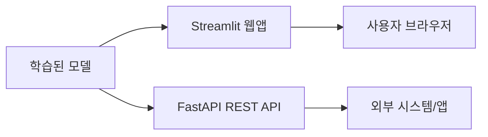
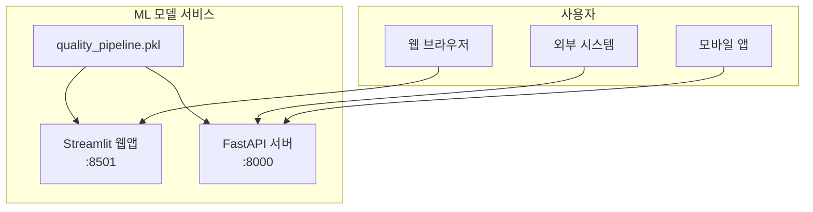

<!-- _class: lead -->
# [27차시] ML 모델 서비스 배포

## 웹앱과 API 구축

---

# 학습 목표

1. **Streamlit**으로 대화형 예측 웹앱을 제작함
2. **FastAPI**로 예측 API 엔드포인트를 구축함
3. **제조 품질 예측 모델**을 서비스로 배포함

---

# 수업 흐름

| 구간 | 시간 | 내용 |
|:----:|:----:|------|
| 대주제 1 | 8분 | Streamlit 웹앱 구축 |
| 대주제 2 | 10분 | FastAPI 엔드포인트 구현 |
| 대주제 3 | 5분 | 통합 서비스 아키텍처 |
| 정리 | 2분 | 핵심 요약 |

---

# ML 모델 서비스 배포 개요



**두 가지 배포 방식**
- **Streamlit**: 사람이 직접 사용하는 웹 인터페이스
- **FastAPI**: 프로그램이 호출하는 API 서버

---

<!-- _class: lead -->
# 대주제 1
## Streamlit 웹앱 구축

---

# Streamlit 핵심 개념

**Python만으로 웹앱을 구현하는 프레임워크**

| 특징 | 설명 |
|-----|------|
| 설치 | `pip install streamlit` |
| 실행 | `streamlit run app.py` |
| 접속 | http://localhost:8501 |

```python
import streamlit as st

st.title("품질 예측 시스템")
st.write("센서 데이터를 입력하세요.")
```

---

# 핵심 출력 위젯

| 함수 | 용도 |
|-----|------|
| `st.title()` | 제목 표시 |
| `st.write()` | 범용 출력 (자동 타입 감지) |
| `st.dataframe()` | 인터랙티브 테이블 |
| `st.metric()` | KPI 지표 표시 |
| `st.line_chart()` | 라인 차트 |

---

# 핵심 입력 위젯

| 함수 | 용도 |
|-----|------|
| `st.button()` | 버튼 (클릭 시 True) |
| `st.slider()` | 슬라이더 (범위 선택) |
| `st.number_input()` | 숫자 입력 |
| `st.selectbox()` | 드롭다운 선택 |
| `st.form()` | 폼 (일괄 제출) |

---

# 레이아웃 구성

```python
# 열 분할
col1, col2 = st.columns(2)
with col1:
    temp = st.slider("온도", 100, 300, 200)
with col2:
    pres = st.slider("압력", 20, 100, 50)

# 사이드바
st.sidebar.title("설정")
model = st.sidebar.selectbox("모델", ["RF", "XGB"])
```

---

# 모델 캐싱

```python
import streamlit as st
import joblib

@st.cache_resource  # 모델 한 번만 로드
def load_model():
    return joblib.load('quality_pipeline.pkl')

model = load_model()
```

**캐싱 데코레이터**
- `@st.cache_resource`: 모델, DB 연결 등 리소스
- `@st.cache_data`: DataFrame, 계산 결과 등

---

# 품질 예측 웹앱 구조

```python
import streamlit as st
import pandas as pd
import joblib

st.set_page_config(page_title="품질 예측", layout="wide")
st.title("제조 품질 예측 시스템")

# 입력
col1, col2 = st.columns(2)
with col1:
    temp = st.slider("온도", 100, 300, 200)
with col2:
    pres = st.slider("압력", 20, 100, 50)

# 예측
if st.button("예측"):
    X = pd.DataFrame([[temp, pres]], columns=['temperature','pressure'])
    pred = model.predict(X)[0]
    st.write("불량" if pred == 1 else "정상")
```

---

<!-- _class: lead -->
# 대주제 2
## FastAPI 엔드포인트 구현

---

# Streamlit vs FastAPI

| 항목 | Streamlit | FastAPI |
|-----|-----------|---------|
| **용도** | 사용자 UI | API 서버 |
| **호출 방식** | 브라우저 | HTTP 요청 |
| **대상** | 사람 | 프로그램 |
| **출력** | 웹 페이지 | JSON |

---

# FastAPI 핵심 개념

**고성능 Python 웹 프레임워크**

```python
from fastapi import FastAPI

app = FastAPI()

@app.get("/")
def read_root():
    return {"message": "Hello, FastAPI!"}

@app.get("/health")
def health_check():
    return {"status": "healthy"}
```

```bash
# 설치 및 실행
pip install fastapi uvicorn
uvicorn main:app --reload
```

---

# HTTP 메서드와 경로

```python
@app.get("/items/{item_id}")    # 경로 매개변수
def read_item(item_id: int):
    return {"item_id": item_id}

@app.get("/search")             # 쿼리 매개변수
def search(q: str, limit: int = 10):
    return {"query": q, "limit": limit}

@app.post("/predict")           # POST 요청
def predict(data: dict):
    return {"prediction": "normal"}
```

**자동 문서**: http://localhost:8000/docs

---

# Pydantic 데이터 검증

```python
from pydantic import BaseModel, Field

class SensorData(BaseModel):
    temperature: float = Field(..., ge=100, le=300)
    pressure: float = Field(..., ge=20, le=100)
    speed: float = Field(..., ge=50, le=200)
    humidity: float = Field(50.0, ge=20, le=80)
    vibration: float = Field(5.0, ge=0, le=15)

class PredictionResponse(BaseModel):
    prediction: str
    probability: float
    risk_score: int
```

---

# Field 검증 옵션

| 옵션 | 의미 |
|-----|------|
| `ge` | >= (greater or equal) |
| `le` | <= (less or equal) |
| `gt` | > (greater than) |
| `lt` | < (less than) |
| `...` | 필수 필드 |
| `default` | 기본값 |

---

# 예측 API 엔드포인트

```python
from fastapi import FastAPI, HTTPException
from datetime import datetime

@app.post("/predict", response_model=PredictionResponse)
def predict(data: SensorData):
    try:
        result = predictor.predict(data.dict())
        return PredictionResponse(
            prediction=result['prediction'],
            probability=result['probability'],
            risk_score=int(result['defect_prob'] * 100)
        )
    except Exception as e:
        raise HTTPException(status_code=500, detail=str(e))
```

---

# API 호출 방법

**curl**
```bash
curl -X POST http://localhost:8000/predict \
  -H "Content-Type: application/json" \
  -d '{"temperature": 200, "pressure": 50, "speed": 100}'
```

**Python**
```python
import requests

response = requests.post(
    "http://localhost:8000/predict",
    json={"temperature": 200, "pressure": 50, "speed": 100}
)
print(response.json())
```

---

<!-- _class: lead -->
# 대주제 3
## 통합 서비스 아키텍처

---

# 서비스 배포 아키텍처



---

# 프로젝트 구조

```
quality_service/
+-- streamlit_app/
|   +-- app.py              # Streamlit 웹앱
|   +-- requirements.txt
+-- fastapi_app/
|   +-- main.py             # FastAPI 서버
|   +-- models.py           # Pydantic 모델
|   +-- predictor.py        # 예측 로직
|   +-- requirements.txt
+-- models/
|   +-- quality_pipeline.pkl
+-- Dockerfile
```

---

# 배포 옵션 비교

| 방식 | Streamlit | FastAPI |
|-----|-----------|---------|
| **클라우드** | Streamlit Cloud | AWS/GCP/Azure |
| **컨테이너** | Docker | Docker |
| **서버리스** | - | Lambda/Cloud Run |
| **무료** | Streamlit Cloud | - |

---

# Docker 배포

**Dockerfile (FastAPI)**
```dockerfile
FROM python:3.9-slim

WORKDIR /app
COPY requirements.txt .
RUN pip install -r requirements.txt

COPY . .

CMD ["uvicorn", "main:app", "--host", "0.0.0.0", "--port", "8000"]
```

```bash
docker build -t quality-api .
docker run -p 8000:8000 quality-api
```

---

# 배포 시 주의사항

| 항목 | Streamlit | FastAPI |
|-----|-----------|---------|
| **모델 크기** | 로드 시간 | 메모리 관리 |
| **동시 접속** | 무료 티어 제한 | 워커 수 설정 |
| **보안** | st.secrets | 환경변수 |
| **캐싱** | @st.cache_resource | 전역 변수 |

---

<!-- _class: lead -->
# 핵심 정리

---

# 오늘 배운 내용

1. **Streamlit 웹앱**
   - st.slider, st.button, st.columns
   - @st.cache_resource로 모델 캐싱

2. **FastAPI API 서버**
   - @app.post() 엔드포인트
   - Pydantic BaseModel, Field 검증

3. **통합 배포**
   - 웹앱은 사람, API는 시스템 대상
   - Docker로 컨테이너화

---

# 핵심 코드 비교

**Streamlit**
```python
if st.button("예측"):
    pred = model.predict(input_data)
    st.success("정상" if pred == 0 else "불량")
```

**FastAPI**
```python
@app.post("/predict", response_model=PredictionResponse)
def predict(data: SensorData):
    result = model.predict(data.dict())
    return PredictionResponse(prediction=result)
```

---

# 체크리스트

- [ ] Streamlit 설치 및 웹앱 실행
- [ ] 입력 위젯과 레이아웃 구성
- [ ] FastAPI 설치 및 서버 실행
- [ ] Pydantic 모델로 데이터 검증
- [ ] POST 엔드포인트 구현
- [ ] 모델 연동 및 예측 서비스 완성

---

<!-- _class: lead -->
# 수고하셨습니다!

## 실습: 품질 예측 웹앱 + API 구축

